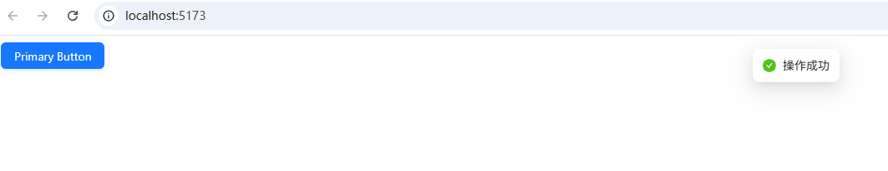
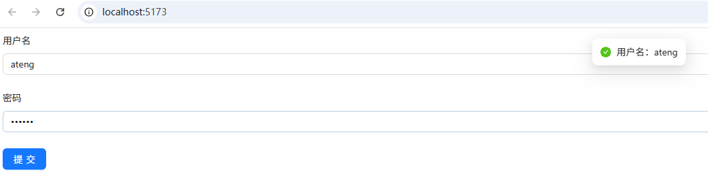

# Antdv Next

antdv-next 是基于 Ant Design 设计体系的 Vue 实现，提供了丰富的高质量 Vue 组件，帮助开发者快速构建现代化的 Web 应用。

- [官网地址](https://antdv-next.com/)


## 基础配置

**安装依赖**

```
pnpm add antdv-next@1.1.0
```

**全局注册**

在 main.ts 中：

```ts
import { createApp } from 'vue'
import App from './App.vue'
import AntdvNext from 'antdv-next'

const app = createApp(App)

app.use(AntdvNext)

app.mount('#app')
```


## 按需引入

安装插件

```
pnpm add -D @antdv-next/auto-import-resolver unplugin-vue-components@30.0.0 unplugin-auto-import@20.3.0
```

配置 vite.config.ts

```ts
import { defineConfig } from 'vite'
import AutoImport from 'unplugin-auto-import/vite'
import Components from 'unplugin-vue-components/vite'
import { AntdvNextResolver } from '@antdv-next/auto-import-resolver'

export default defineConfig({
  plugins: [
    AutoImport({
      resolvers: [AntdvNextResolver()]
    }),
    Components({
      resolvers: [AntdvNextResolver()]
    })
  ]
})
```


## 使用示例

### 基础按钮示例

```vue
<script setup lang="ts">
import { message } from 'antdv-next'

const handleClick = () => {
  message.success('操作成功')
}
</script>

<template>
  <a-button type="primary" @click="handleClick">
    Primary Button
  </a-button>
</template>
```



------

### 表单示例

```vue
<script setup lang="ts">
import { reactive } from 'vue'
import { message } from 'antdv-next'

interface FormState {
  username: string
  password: string
}

const formState = reactive<FormState>({
  username: '',
  password: ''
})

const onSubmit = () => {
  message.success(`用户名：${formState.username}`)
}
</script>

<template>
  <a-form :model="formState" layout="vertical">
    <a-form-item label="用户名">
      <a-input v-model:value="formState.username" />
    </a-form-item>

    <a-form-item label="密码">
      <a-input-password v-model:value="formState.password" />
    </a-form-item>

    <a-form-item>
      <a-button type="primary" @click="onSubmit">
        提交
      </a-button>
    </a-form-item>
  </a-form>
</template>
```

