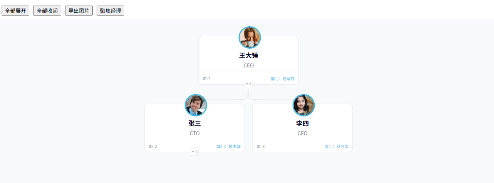

# org-chart

bumbeishvili/org-chart 是一个开源的 JavaScript 库，用于使用 D3.js 构建交互式组织结构图。

- [官网地址](https://github.com/bumbeishvili/org-chart)


## 基础配置

**安装依赖**

```
pnpm add d3-org-chart @types/d3-org-chart
```


## 最简示例

```vue
<template>
  <div class="chart-wrapper">
    <div ref="chartRef" class="chart-container"></div>
  </div>
</template>

<script setup lang="ts">
import { onMounted, onBeforeUnmount, ref } from 'vue'
import { OrgChart } from 'd3-org-chart'

interface OrgNode {
  id: string
  parentId?: string
  name: string
  title: string
}

const chartRef = ref<HTMLDivElement | null>(null)

let chart: OrgChart<OrgNode> | null = null

const data: OrgNode[] = [
  { id: '1', name: 'CEO', title: '首席执行官' },
  { id: '2', parentId: '1', name: 'CTO', title: '技术总监' },
  { id: '3', parentId: '1', name: 'CFO', title: '财务总监' },
  { id: '4', parentId: '2', name: 'Dev Manager', title: '开发经理' },
  { id: '5', parentId: '2', name: 'QA Manager', title: '测试经理' }
]

onMounted(() => {
  if (!chartRef.value) return

  chart = new OrgChart<OrgNode>()
      .container(chartRef.value as any)
      .data(data)
      .nodeWidth(() => 220)
      .nodeHeight(() => 100)
      .childrenMargin(() => 40)
      .compact(false)
      .nodeContent((d) => {
        return `
        <div style="
          width: 220px;
          height: 100px;
          border-radius: 8px;
          background: #ffffff;
          border: 1px solid #e5e7eb;
          box-shadow: 0 2px 6px rgba(0,0,0,0.1);
          display: flex;
          flex-direction: column;
          justify-content: center;
          align-items: center;
        ">
          <div style="font-size:16px;font-weight:bold;">
            ${d.data.name}
          </div>
          <div style="font-size:14px;color:#666;">
            ${d.data.title}
          </div>
        </div>
      `
      })

  chart.render()
})

onBeforeUnmount(() => {
  chart = null
})
</script>

<style scoped>
.chart-wrapper {
  width: 100%;
  height: 600px;
  background: #f5f7fa;
}

.chart-container {
  width: 100%;
  height: 100%;
}
</style>
```


## 组件封装

### useOrgChart

```ts
// composables/useOrgChart.ts
import { ref, shallowRef, onUnmounted, type Ref } from 'vue';
import { OrgChart } from 'd3-org-chart';

// 定义基础节点接口
export interface OrgNode {
    id: string;
    parentId?: string;
    name: string;
    title?: string;
    image?: string;
    [key: string]: any; // 允许扩展自定义属性
}

interface UseOrgChartOptions<T> {
    data: Ref<T[]>;
    containerId?: string;
    nodeWidth?: number;
    nodeHeight?: number;
    onNodeClick?: (nodeId: string) => void;
}

export function useOrgChart<T extends OrgNode>(options: UseOrgChartOptions<T>) {
    const chartRef = ref<HTMLElement | null>(null);
    const chartInstance = shallowRef<OrgChart<T> | null>(null);

    // 初始化图表
    const initChart = () => {
        if (!chartRef.value) return;

        chartInstance.value = new OrgChart<T>()
            .container(chartRef.value as any)
            .data(options.data.value)
            .nodeWidth(() => options.nodeWidth || 250)
            .nodeHeight(() => options.nodeHeight || 120)
            .childrenMargin(() => 50)
            .compact(false)
            // 核心：点击事件钩子
            .onNodeClick((d) => {
                if (options.onNodeClick) options.onNodeClick(d.data.id);
            })
            // 核心：自定义节点内容（支持头像和自定义HTML）
            .nodeContent((d) => {
                const color = '#ffffff';
                return `
          <div style="font-family: 'Inter', sans-serif; background-color:${color}; position:relative; width:${d.width}px; height:${d.height}px; border-radius:10px; border: 1px solid #E4E2E9">
            <div style="position:absolute; margin-top:-25px; margin-left:${d.width / 2 - 25}px; width:50px; height:50px; border-radius:50px; border:3px solid #3AB6E3; overflow:hidden; background:#fff">
               
            </div>
            
            <div style="padding-top:35px; text-align:center">
              <div style="color:#08011E; font-size:16px; font-weight:bold">${d.data.name}</div>
              <div style="color:#716E7B; font-size:13px; margin-top:4px">${d.data.title || ''}</div>
            </div>

            <div style="display:flex; justify-content:space-between; padding:10px; margin-top:5px; border-top:1px solid #F0F0F0">
               <div style="font-size:10px; color:#999">ID: ${d.data.id}</div>
               <div style="font-size:10px; color:#3AB6E3">部门：${d.data.department || 'N/A'}</div>
            </div>
          </div>
        `;
            });

        chartInstance.value.render();
    };

    // 展开/收起所有节点
    const expandAll = () => {
        chartInstance.value?.expandAll().render();
    };

    const collapseAll = () => {
        chartInstance.value?.collapseAll().render();
    };

    // 居中某个节点
    const fitNode = (nodeId: string) => {
        chartInstance.value?.setCentered(nodeId).render();
    };

    // 导出图片
    const exportImg = () => {
        chartInstance.value?.exportImg();
    };

    onUnmounted(() => {
        if (chartInstance.value) {
            chartInstance.value = null;
        }
    });

    return {
        chartRef,
        chartInstance,
        initChart,
        expandAll,
        collapseAll,
        fitNode,
        exportImg
    };
}
```

### 使用

```vue
<template>
  <div class="org-chart-page">
    <div class="toolbar">
      <button @click="expandAll">全部展开</button>
      <button @click="collapseAll">全部收起</button>
      <button @click="exportImg">导出图片</button>
      <button @click="fitNode('4')">聚焦经理</button>
    </div>

    <div ref="chartRef" class="chart-container"></div>
  </div>
</template>

<script setup lang="ts">
import { onMounted, ref } from 'vue';
import { useOrgChart, type OrgNode } from '@/composables/useOrgChart';

const rawData = ref<OrgNode[]>([
  { id: '1', name: '王大锤', title: 'CEO', image: 'https://i.pravatar.cc/150?u=1', department: '总裁办' },
  { id: '2', parentId: '1', name: '张三', title: 'CTO', image: 'https://i.pravatar.cc/150?u=2', department: '技术部' },
  { id: '3', parentId: '1', name: '李四', title: 'CFO', image: 'https://i.pravatar.cc/150?u=3', department: '财务部' },
  { id: '4', parentId: '2', name: '王五', title: '研发经理', image: 'https://i.pravatar.cc/150?u=4', department: '技术部' },
]);

const {
  chartRef,
  initChart,
  expandAll,
  collapseAll,
  fitNode,
  exportImg
} = useOrgChart({
  data: rawData,
  onNodeClick: (id) => {
    console.log('点击了节点：', id);
  }
});

onMounted(() => {
  // 可以在这里进行接口请求，请求完后再 init
  initChart();
});
</script>

<style scoped>
.org-chart-page {
  width: 100%;
  height: 100vh;
  display: flex;
  flex-direction: column;
}
.toolbar {
  padding: 10px;
  background: #fff;
  border-bottom: 1px solid #eee;
  display: flex;
  gap: 10px;
}
.chart-container {
  flex: 1;
  background-color: #f8f9fa;
  overflow: hidden;
}
</style>
```

