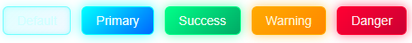

# 全局配置

## 按需导入

安装插件

```
pnpm add unplugin-vue-components@30.0.0 unplugin-auto-import@20.3.0
```

配置vite.config.ts

```ts
import { defineConfig } from 'vite'
import AutoImport from 'unplugin-auto-import/vite'
import Components from 'unplugin-vue-components/vite'
import { ElementPlusResolver } from 'unplugin-vue-components/resolvers'

export default defineConfig({
  // ...
  plugins: [
    // ...
    AutoImport({
      resolvers: [ElementPlusResolver()],
    }),
    Components({
      resolvers: [ElementPlusResolver()],
    }),
  ],
})
```

当前配置完成后，**已经可以：**

```
<script setup lang="ts">
const count = ref(0)

const handleClick = () => {
  ElMessage.success('OK')
}
</script>

<template>
  <el-button type="primary" @click="handleClick">
    点我
  </el-button>
</template>
```

✔ 不需要：

- `import { ElButton, ElMessage } from 'element-plus'`
- `app.use(ElementPlus)`
- 手动注册组件

👉 **组件 + API 都是按需自动引入**

## 全局定制样式

### 安装 SCSS

```
pnpm add sass@1.97.2 unplugin-element-plus@0.11.2
```

### 创建主题定制 SCSS 文件

在 `src/styles/element/index.scss` 创建文件：

```scss
// styles/element/index.scss

@forward "element-plus/theme-chalk/src/common/var.scss" with (
  $colors: (
    "primary": (
      "base": #00ffff,
    ),
    "success": (
      "base": #00ff88,
    ),
    "warning": (
      "base": #ffaa00,
    ),
    "danger": (
      "base": #ff0033,
    )
  )
);

@use "element-plus/theme-chalk/src/index.scss" as *;
```

### 配置 Vite

在 `vite.config.ts` 中加入全局 SCSS 变量注入设置：

```ts
import { defineConfig } from 'vite';
import vue from '@vitejs/plugin-vue';
import ElementPlus from "unplugin-element-plus/vite"
import path from 'path';

export default defineConfig({
    plugins: [
        vue(),
        ElementPlus({
            useSource: true, // 确保使用 element-plus 的源码 sass
        }),
    ],
    resolve: {
        alias: {
            '@': path.resolve(__dirname, 'src'),
        }
    }
});
```

### 在入口文件引入主题文件

修改 `main.ts`：

```ts
import "@/styles/element/index.scss"
import "@/styles/global.scss"
```

删除官方“默认主题 CSS”

```ts
import 'element-plus/dist/index.css'
```

### 定制Button

创建 `src/styles/element/button.scss`

```scss
/* ============================================================
 * Element Plus - 科技风按钮全量定制
 * 文件路径：src/styles/element/button.scss
 * ============================================================
 */

/* ========================
 * 通用按钮基础样式
 * ======================== */
.el-button {
  --el-button-bg-color: transparent;
  --el-button-border-color: rgba(0, 255, 255, 0.5);
  --el-button-text-color: #cfffff;

  background: linear-gradient(
                  135deg,
                  rgba(0, 255, 255, 0.12),
                  rgba(0, 120, 255, 0.05)
  );

  border: 1px solid var(--el-button-border-color);
  border-radius: 6px;

  box-shadow:
          inset 0 0 6px rgba(0, 255, 255, 0.25),
          0 0 10px rgba(0, 255, 255, 0.25);

  transition:
          background 0.25s ease,
          box-shadow 0.25s ease,
          transform 0.15s ease;

  &:hover {
    background: linear-gradient(
                    135deg,
                    rgba(0, 255, 255, 0.28),
                    rgba(0, 120, 255, 0.12)
    );

    box-shadow:
            inset 0 0 10px rgba(0, 255, 255, 0.45),
            0 0 16px rgba(0, 255, 255, 0.55);
  }

  &:active {
    transform: translateY(1px);
    box-shadow:
            inset 0 0 8px rgba(0, 255, 255, 0.6);
  }
}

/* ========================
 * Primary - 主科技色
 * ======================== */
.el-button--primary {
  --el-button-border-color: #00ffff;
  --el-button-text-color: #eaffff;

  background: linear-gradient(
                  135deg,
                  #00ffff,
                  #0066ff
  );

  box-shadow:
          0 0 14px rgba(0, 255, 255, 0.7);

  &:hover {
    background: linear-gradient(
                    135deg,
                    #33ffff,
                    #3388ff
    );
    box-shadow:
            0 0 22px rgba(0, 255, 255, 0.9);
  }
}

/* ========================
 * Success - 能量绿
 * ======================== */
.el-button--success {
  --el-button-border-color: #00ff88;
  --el-button-text-color: #eafff3;

  background: linear-gradient(
                  135deg,
                  #00ff88,
                  #00aa66
  );

  box-shadow:
          0 0 12px rgba(0, 255, 136, 0.6);

  &:hover {
    background: linear-gradient(
                    135deg,
                    #33ff99,
                    #00cc77
    );
    box-shadow:
            0 0 20px rgba(0, 255, 136, 0.85);
  }
}

/* ========================
 * Warning - 能量橙
 * ======================== */
.el-button--warning {
  --el-button-border-color: #ffaa00;
  --el-button-text-color: #fff2cc;

  background: linear-gradient(
                  135deg,
                  #ffaa00,
                  #ff8800
  );

  box-shadow:
          0 0 12px rgba(255, 170, 0, 0.6);

  &:hover {
    background: linear-gradient(
                    135deg,
                    #ffcc33,
                    #ffaa00
    );
    box-shadow:
            0 0 20px rgba(255, 170, 0, 0.85);
  }
}

/* ========================
 * Danger - 警告红
 * ======================== */
.el-button--danger {
  --el-button-border-color: #ff0033;
  --el-button-text-color: #ffe5eb;

  background: linear-gradient(
                  135deg,
                  #ff0033,
                  #cc0033
  );

  box-shadow:
          0 0 12px rgba(255, 0, 51, 0.6);

  &:hover {
    background: linear-gradient(
                    135deg,
                    #ff3355,
                    #ff0033
    );
    box-shadow:
            0 0 20px rgba(255, 0, 51, 0.85);
  }
}

/* ========================
 * Disabled 状态
 * ======================== */
.el-button.is-disabled {
  opacity: 0.4;
  box-shadow: none !important;
  filter: grayscale(0.6);
}
```

修改 `src/styles/element/index.scss`，放在最后

```scss
@use "@/styles/element/button.scss";
```

使用

```vue
<template>
  <el-container>
    <el-button>Default</el-button>
    <el-button type="primary">Primary</el-button>
    <el-button type="success">Success</el-button>
    <el-button type="warning">Warning</el-button>
    <el-button type="danger">Danger</el-button>
  </el-container>
</template>

<style scoped>
</style>
```



### 定制Table

创建 `src/styles/element/table.scss`

```scss
/* ============================================================
 * Element Plus - 科技风 Table 全量定制
 * 文件路径：src/styles/element/table.scss
 * ============================================================
 */

/* ========================
 * Table 整体容器
 * ======================== */
.el-table {
  --el-table-border-color: rgba(0, 255, 255, 0.15);
  --el-table-text-color: #cfefff;
  --el-table-header-text-color: #eaffff;

  background-color: rgba(10, 25, 40, 0.85);
  color: var(--el-table-text-color);
  border-radius: 8px;
  overflow: hidden;

  box-shadow:
          inset 0 0 18px rgba(0, 255, 255, 0.08),
          0 0 18px rgba(0, 255, 255, 0.12);
}

/* ========================
 * 表头
 * ======================== */
.el-table__header-wrapper {
  background: linear-gradient(
                  180deg,
                  rgba(0, 255, 255, 0.18),
                  rgba(0, 120, 255, 0.08)
  );
}

.el-table th.el-table__cell {
  background: transparent;
  color: var(--el-table-header-text-color);
  font-weight: 600;
  font-size: 14px;
  border-bottom: 1px solid rgba(0, 255, 255, 0.35);

  text-shadow: 0 0 6px rgba(0, 255, 255, 0.35);
}

/* ========================
 * 表体
 * ======================== */
.el-table__body-wrapper {
  background: rgba(5, 20, 35, 0.9);
}

.el-table td.el-table__cell {
  background: transparent;
  border-bottom: 1px solid rgba(0, 255, 255, 0.08);
  font-size: 13px;
  color: var(--el-table-text-color);
}

/* ========================
 * 行 hover 高亮（核心）
 * ======================== */
.el-table--enable-row-hover .el-table__body tr:hover > td {
  background: linear-gradient(
                  90deg,
                  rgba(0, 255, 255, 0.12),
                  rgba(0, 120, 255, 0.06)
  );

  box-shadow:
          inset 0 0 12px rgba(0, 255, 255, 0.35);
}

/* ========================
 * 选中行
 * ======================== */
.el-table__body tr.current-row > td {
  background: linear-gradient(
                  90deg,
                  rgba(0, 255, 255, 0.25),
                  rgba(0, 120, 255, 0.12)
  );

  box-shadow:
          inset 0 0 16px rgba(0, 255, 255, 0.55);
}

/* ========================
 * 斑马纹（如果你开了 stripe）
 * ======================== */
.el-table--striped
.el-table__body
tr.el-table__row--striped
td {
  background: rgba(0, 255, 255, 0.03);
}

/* ========================
 * 表格边框（border 模式）
 * ======================== */
.el-table--border {
  border: 1px solid rgba(0, 255, 255, 0.25);
}

.el-table--border td,
.el-table--border th {
  border-right: 1px solid rgba(0, 255, 255, 0.15);
}

/* ========================
 * 空数据
 * ======================== */
.el-table__empty-text {
  color: #8fdada;
  font-size: 13px;
  text-shadow: 0 0 6px rgba(0, 255, 255, 0.3);
}

/* ========================
 * 滚动条（表格内）
 * ======================== */
.el-table__body-wrapper::-webkit-scrollbar {
  width: 6px;
  height: 6px;
}

.el-table__body-wrapper::-webkit-scrollbar-thumb {
  background: linear-gradient(
                  180deg,
                  #00ffff,
                  #0066ff
  );
  border-radius: 4px;
}

.el-table__body-wrapper::-webkit-scrollbar-track {
  background: rgba(0, 0, 0, 0.2);
}
```

修改 `src/styles/element/index.scss`，放在最后

```scss
@use "@/styles/element/table.scss";
```

使用

```vue
<template>
  <div class="app-root">
    <h1>System Monitor</h1>
    <!-- 表格区 -->
    <div>
      <el-table
          :data="tableData"
          stripe
          border
          highlight-current-row
          height="360"
      >
        <el-table-column prop="id" label="ID" width="80" />
        <el-table-column prop="name" label="Service Name" />
        <el-table-column prop="status" label="Status" width="120">
          <template #default="{ row }">
            <el-tag
                :type="row.status === 'Running' ? 'success' : 'danger'"
                effect="dark"
            >
              {{ row.status }}
            </el-tag>
          </template>
        </el-table-column>
        <el-table-column prop="cpu" label="CPU (%)" width="120" />
        <el-table-column prop="memory" label="Memory (MB)" width="140" />
        <el-table-column label="Action" width="160">
          <template #default>
            <el-button size="small" type="primary">Detail</el-button>
            <el-button size="small" type="danger">Stop</el-button>
          </template>
        </el-table-column>
      </el-table>
    </div>
  </div>
</template>

<script setup lang="ts">
interface ServiceInfo {
  id: number
  name: string
  status: 'Running' | 'Stopped'
  cpu: number
  memory: number
}

const tableData: ServiceInfo[] = [
  { id: 1, name: 'Auth Service', status: 'Running', cpu: 12, memory: 256 },
  { id: 2, name: 'Gateway', status: 'Running', cpu: 28, memory: 512 },
  { id: 3, name: 'Order Service', status: 'Stopped', cpu: 0, memory: 0 },
  { id: 4, name: 'Message Queue', status: 'Running', cpu: 35, memory: 768 },
  { id: 5, name: 'File Storage', status: 'Running', cpu: 18, memory: 384 },
]
</script>

<style scoped>
</style>
```

