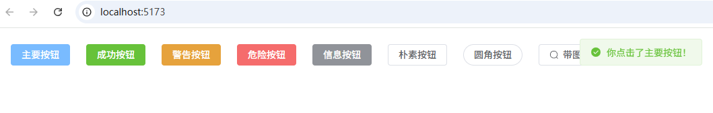
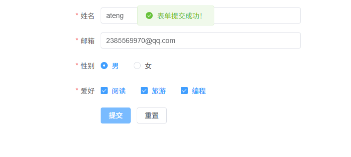

# Element Plus

基于 Vue 3，面向设计师和开发者的组件库

- [官网地址](https://element-plus.org/zh-CN/#/zh-CN)


## 基础配置

**安装依赖**

```
pnpm add element-plus@2.13.0 @element-plus/icons-vue@2.3.2
```

**全局注册**

在 main.ts 中：

```ts
import { createApp } from 'vue'
import App from './App.vue'
import ElementPlus from 'element-plus'
import 'element-plus/dist/index.css'
import zhCn from 'element-plus/es/locale/lang/zh-cn'
import * as ElementPlusIconsVue from '@element-plus/icons-vue'

const app = createApp(App)

app.use(ElementPlus, {
    locale: zhCn,
})
for (const [key, component] of Object.entries(ElementPlusIconsVue)) {
    app.component(key, component)
}

app.mount('#app')
```


## 按需引入

安装插件

```
pnpm add -D unplugin-vue-components@30.0.0 unplugin-auto-import@20.3.0
```

配置vite.config.ts

```ts
import { defineConfig } from 'vite'
import AutoImport from 'unplugin-auto-import/vite'
import Components from 'unplugin-vue-components/vite'
import { ElementPlusResolver } from 'unplugin-vue-components/resolvers'

export default defineConfig({
  // ...
  plugins: [
    // ...
    AutoImport({
      resolvers: [ElementPlusResolver()],
    }),
    Components({
      resolvers: [ElementPlusResolver()],
    }),
  ],
})
```

## 使用示例

### 基础按钮示例

```vue
<template>
  <div class="button-demo">
    <el-button type="primary" @click="handleClick">主要按钮</el-button>
    <el-button type="success">成功按钮</el-button>
    <el-button type="warning">警告按钮</el-button>
    <el-button type="danger">危险按钮</el-button>
    <el-button type="info">信息按钮</el-button>
    <el-button plain>朴素按钮</el-button>
    <el-button round>圆角按钮</el-button>
    <el-button icon="Search">带图标按钮</el-button>
  </div>
</template>

<script setup lang="ts">
import { ElMessage } from 'element-plus'

const handleClick = () => {
  ElMessage({
    message: '你点击了主要按钮！',
    type: 'success',
  })
}
</script>

<style scoped>
.button-demo {
  display: flex;
  flex-wrap: wrap;
  gap: 12px;
  padding: 16px;
}
</style>
```



------

### 表单示例

```vue
<template>
  <el-form :model="form" :rules="rules" ref="formRef" label-width="100px">
    <el-form-item label="姓名" prop="name">
      <el-input v-model="form.name" placeholder="请输入姓名"></el-input>
    </el-form-item>

    <el-form-item label="邮箱" prop="email">
      <el-input v-model="form.email" placeholder="请输入邮箱"></el-input>
    </el-form-item>

    <el-form-item label="性别" prop="gender">
      <el-radio-group v-model="form.gender">
        <el-radio value="male">男</el-radio>
        <el-radio value="female">女</el-radio>
      </el-radio-group>
    </el-form-item>

    <el-form-item label="爱好" prop="hobby">
      <el-checkbox-group v-model="form.hobby">
        <el-checkbox value="reading">阅读</el-checkbox>
        <el-checkbox value="traveling">旅游</el-checkbox>
        <el-checkbox value="coding">编程</el-checkbox>
      </el-checkbox-group>
    </el-form-item>

    <el-form-item>
      <el-button type="primary" @click="submitForm">提交</el-button>
      <el-button @click="resetForm">重置</el-button>
    </el-form-item>
  </el-form>
</template>

<script setup lang="ts">
import { ref } from 'vue'
import { ElMessage, type FormInstance } from 'element-plus'

interface FormModel {
  name: string
  email: string
  gender: string
  hobby: string[]
}

const formRef = ref<FormInstance>()
const form = ref<FormModel>({
  name: '',
  email: '',
  gender: '',
  hobby: [],
})

const rules = {
  name: [
    { required: true, message: '请输入姓名', trigger: 'blur' },
    { min: 2, max: 10, message: '长度在 2 到 10 个字符', trigger: 'blur' },
  ],
  email: [
    { required: true, message: '请输入邮箱', trigger: 'blur' },
    { type: 'email', message: '请输入正确的邮箱地址', trigger: 'blur' },
  ],
  gender: [{ required: true, message: '请选择性别', trigger: 'change' }],
  hobby: [{ type: 'array', required: true, message: '请选择爱好', trigger: 'change' }],
}

const submitForm = () => {
  formRef.value?.validate((valid) => {
    if (valid) {
      ElMessage.success('表单提交成功！')
    } else {
      ElMessage.error('表单验证失败！')
    }
  })
}

const resetForm = () => {
  formRef.value?.resetFields()
}
</script>

<style scoped>
.el-form {
  max-width: 500px;
  margin: 20px auto;
}
</style>
```

