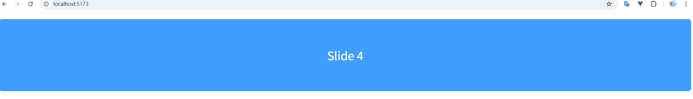
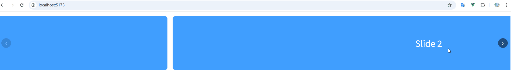
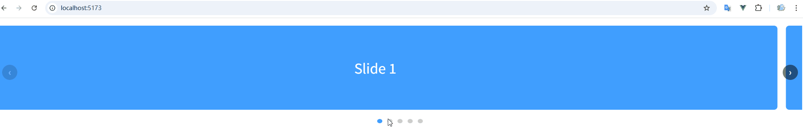
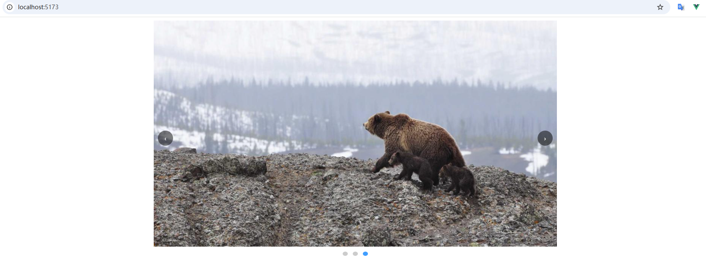
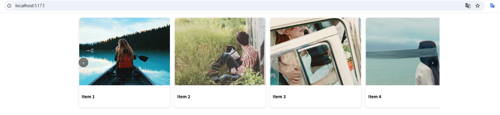

# Embla Carousel

Embla Carousel是一个轻量级、无依赖的轮播图库，专为流畅的动画和精准的滑动而设计。它与框架无关，完全开源，旨在为您提供完全的控制权，而不会增加不必要的臃肿。

- [官网地址](https://github.com/davidjerleke/embla-carousel)


## 基础配置

**安装依赖**

```
pnpm add embla-carousel@8.6.0 embla-carousel-autoplay@8.6.0
```


## 基础轮播

```vue
<template>
  <!-- Embla 根容器 -->
  <div class="embla" ref="emblaRef">
    <!-- 滑动容器 -->
    <div class="embla__container">
      <!-- 每一项 slide -->
      <div class="embla__slide" v-for="n in 5" :key="n">
        <div class="slide-content">
          Slide {{ n }}
        </div>
      </div>
    </div>
  </div>
</template>

<script setup lang="ts">
import { onMounted, onBeforeUnmount, ref } from 'vue'
import EmblaCarousel, { type EmblaOptionsType } from 'embla-carousel'

// DOM 引用
const emblaRef = ref<HTMLDivElement | null>(null)

// Embla 实例
let emblaApi: ReturnType<typeof EmblaCarousel> | null = null

// 配置项（可选）
const options: EmblaOptionsType = {
  loop: true,       // 是否循环
  align: 'center',  // 对齐方式
}

onMounted(() => {
  if (!emblaRef.value) return
  emblaApi = EmblaCarousel(emblaRef.value, options)
})

onBeforeUnmount(() => {
  emblaApi?.destroy()
})
</script>

<style scoped>
/* 根容器 */
.embla {
  overflow: hidden;
  width: 100%;
}

/* 滑动容器 */
.embla__container {
  display: flex;
}

/* 单个 slide */
.embla__slide {
  flex: 0 0 100%; /* 每次显示 1 个 */
  padding: 10px;
}

/* 内容样式，仅示例用 */
.slide-content {
  height: 200px;
  background: #409eff;
  color: #fff;
  font-size: 32px;
  display: flex;
  align-items: center;
  justify-content: center;
  border-radius: 8px;
}
</style>

```




## 上一页 / 下一页按钮

```vue
<template>
  <div class="embla">
    <!-- 轮播区域 -->
    <div class="embla__viewport" ref="emblaRef">
      <div class="embla__container">
        <div
            class="embla__slide"
            v-for="n in 5"
            :key="n"
        >
          <div class="slide-content">
            Slide {{ n }}
          </div>
        </div>
      </div>
    </div>

    <!-- 控制按钮 -->
    <button
        class="embla__button embla__button--prev"
        :disabled="!canScrollPrev"
        @click="scrollPrev"
    >
      ‹
    </button>

    <button
        class="embla__button embla__button--next"
        :disabled="!canScrollNext"
        @click="scrollNext"
    >
      ›
    </button>
  </div>
</template>

<script setup lang="ts">
import { ref, onMounted, onBeforeUnmount } from 'vue'
import EmblaCarousel, { type EmblaOptionsType } from 'embla-carousel'

// DOM 引用
const emblaRef = ref<HTMLDivElement | null>(null)

// Embla 实例
let emblaApi: ReturnType<typeof EmblaCarousel> | null = null

// 按钮状态
const canScrollPrev = ref(false)
const canScrollNext = ref(false)

// 配置项
const options: EmblaOptionsType = {
  loop: false, // 改成 true 可体验循环
}

// 更新按钮状态
function updateButtons() {
  if (!emblaApi) return
  canScrollPrev.value = emblaApi.canScrollPrev()
  canScrollNext.value = emblaApi.canScrollNext()
}

// 操作方法
function scrollPrev() {
  emblaApi?.scrollPrev()
}

function scrollNext() {
  emblaApi?.scrollNext()
}

onMounted(() => {
  if (!emblaRef.value) return

  emblaApi = EmblaCarousel(emblaRef.value, options)

  // 初始化 & 监听选中变化
  updateButtons()
  emblaApi.on('select', updateButtons)
  emblaApi.on('reInit', updateButtons)
})

onBeforeUnmount(() => {
  emblaApi?.destroy()
})
</script>

<style scoped>
.embla {
  position: relative;
  width: 100%;
}

.embla__viewport {
  overflow: hidden;
}

.embla__container {
  display: flex;
}

.embla__slide {
  flex: 0 0 100%;
  padding: 10px;
}

.slide-content {
  height: 200px;
  background: #409eff;
  color: #fff;
  font-size: 32px;
  display: flex;
  align-items: center;
  justify-content: center;
  border-radius: 8px;
}

/* 按钮样式 */
.embla__button {
  position: absolute;
  top: 50%;
  transform: translateY(-50%);
  width: 36px;
  height: 36px;
  border-radius: 50%;
  border: none;
  background: rgba(0, 0, 0, 0.5);
  color: #fff;
  font-size: 20px;
  cursor: pointer;
}

.embla__button:disabled {
  opacity: 0.3;
  cursor: not-allowed;
}

.embla__button--prev {
  left: 10px;
}

.embla__button--next {
  right: 10px;
}
</style>

```



## 分页圆点

```vue
<template>
  <div class="embla">
    <!-- 轮播区域 -->
    <div class="embla__viewport" ref="emblaRef">
      <div class="embla__container">
        <div
            class="embla__slide"
            v-for="n in 5"
            :key="n"
        >
          <div class="slide-content">
            Slide {{ n }}
          </div>
        </div>
      </div>
    </div>

    <!-- 上一页 / 下一页 -->
    <button
        class="embla__button embla__button--prev"
        :disabled="!canScrollPrev"
        @click="scrollPrev"
    >
      ‹
    </button>

    <button
        class="embla__button embla__button--next"
        :disabled="!canScrollNext"
        @click="scrollNext"
    >
      ›
    </button>

    <!-- 分页圆点 -->
    <div class="embla__dots">
      <button
          v-for="(dot, index) in scrollSnaps"
          :key="index"
          class="embla__dot"
          :class="{ 'is-selected': selectedIndex === index }"
          @click="scrollTo(index)"
      />
    </div>
  </div>
</template>

<script setup lang="ts">
import { ref, onMounted, onBeforeUnmount } from 'vue'
import EmblaCarousel, { type EmblaOptionsType } from 'embla-carousel'

// DOM 引用
const emblaRef = ref<HTMLDivElement | null>(null)

// Embla 实例
let emblaApi: ReturnType<typeof EmblaCarousel> | null = null

// 箭头状态
const canScrollPrev = ref(false)
const canScrollNext = ref(false)

// 分页状态
const scrollSnaps = ref<number[]>([])
const selectedIndex = ref(0)

// 配置项
const options: EmblaOptionsType = {
  loop: false,
}

// 更新箭头状态
function updateButtons() {
  if (!emblaApi) return
  canScrollPrev.value = emblaApi.canScrollPrev()
  canScrollNext.value = emblaApi.canScrollNext()
}

// 更新圆点状态
function updateDots() {
  if (!emblaApi) return
  selectedIndex.value = emblaApi.selectedScrollSnap()
}

// 滚动方法
function scrollPrev() {
  emblaApi?.scrollPrev()
}

function scrollNext() {
  emblaApi?.scrollNext()
}

function scrollTo(index: number) {
  emblaApi?.scrollTo(index)
}

onMounted(() => {
  if (!emblaRef.value) return

  emblaApi = EmblaCarousel(emblaRef.value, options)

  // 初始化数据
  scrollSnaps.value = emblaApi.scrollSnapList()
  updateButtons()
  updateDots()

  // 监听事件
  emblaApi.on('select', () => {
    updateButtons()
    updateDots()
  })

  emblaApi.on('reInit', () => {
    scrollSnaps.value = emblaApi!.scrollSnapList()
    updateButtons()
    updateDots()
  })
})

onBeforeUnmount(() => {
  emblaApi?.destroy()
})
</script>

<style scoped>
.embla {
  position: relative;
  width: 100%;
}

.embla__viewport {
  overflow: hidden;
}

.embla__container {
  display: flex;
}

.embla__slide {
  flex: 0 0 100%;
  padding: 10px;
}

.slide-content {
  height: 200px;
  background: #409eff;
  color: #fff;
  font-size: 32px;
  display: flex;
  align-items: center;
  justify-content: center;
  border-radius: 8px;
}

/* 箭头按钮 */
.embla__button {
  position: absolute;
  top: 50%;
  transform: translateY(-50%);
  width: 36px;
  height: 36px;
  border-radius: 50%;
  border: none;
  background: rgba(0, 0, 0, 0.5);
  color: #fff;
  font-size: 20px;
  cursor: pointer;
}

.embla__button:disabled {
  opacity: 0.3;
  cursor: not-allowed;
}

.embla__button--prev {
  left: 10px;
}

.embla__button--next {
  right: 10px;
}

/* 分页圆点 */
.embla__dots {
  display: flex;
  justify-content: center;
  margin-top: 12px;
}

.embla__dot {
  width: 10px;
  height: 10px;
  margin: 0 6px;
  border-radius: 50%;
  background: #ccc;
  border: none;
  cursor: pointer;
}

.embla__dot.is-selected {
  background: #409eff;
}
</style>

```



## 图片轮播

```vue
<template>
  <!-- 外层约束容器 -->
  <div class="carousel-wrapper">
    <div class="embla">
      <!-- 轮播区域 -->
      <div class="embla__viewport" ref="emblaRef">
        <div class="embla__container">
          <div
              class="embla__slide"
              v-for="(img, index) in images"
              :key="index"
          >
            <div class="embla__slide__inner">
              
            </div>
          </div>
        </div>
      </div>

      <!-- 上一页 / 下一页 -->
      <button
          class="embla__button embla__button--prev"
          :disabled="!canScrollPrev"
          @click="scrollPrev"
      >
        ‹
      </button>

      <button
          class="embla__button embla__button--next"
          :disabled="!canScrollNext"
          @click="scrollNext"
      >
        ›
      </button>

      <!-- 分页圆点 -->
      <div class="embla__dots">
        <button
            v-for="(_, index) in scrollSnaps"
            :key="index"
            class="embla__dot"
            :class="{ 'is-selected': selectedIndex === index }"
            @click="scrollTo(index)"
        />
      </div>
    </div>
  </div>
</template>

<script setup lang="ts">
import { ref, onMounted, onBeforeUnmount } from 'vue'
import EmblaCarousel, { type EmblaOptionsType } from 'embla-carousel'

const images = ref<string[]>([
  'https://picsum.photos/id/1015/1200/600',
  'https://picsum.photos/id/1016/1200/600',
  'https://picsum.photos/id/1020/1200/600',
])

const emblaRef = ref<HTMLDivElement | null>(null)
let emblaApi: ReturnType<typeof EmblaCarousel> | null = null

const canScrollPrev = ref(false)
const canScrollNext = ref(false)
const scrollSnaps = ref<number[]>([])
const selectedIndex = ref(0)

const options: EmblaOptionsType = {
  loop: true,
}

function updateButtons() {
  if (!emblaApi) return
  canScrollPrev.value = emblaApi.canScrollPrev()
  canScrollNext.value = emblaApi.canScrollNext()
}

function updateDots() {
  if (!emblaApi) return
  selectedIndex.value = emblaApi.selectedScrollSnap()
}

function scrollPrev() {
  emblaApi?.scrollPrev()
}

function scrollNext() {
  emblaApi?.scrollNext()
}

function scrollTo(index: number) {
  emblaApi?.scrollTo(index)
}

onMounted(() => {
  if (!emblaRef.value) return
  emblaApi = EmblaCarousel(emblaRef.value, options)

  scrollSnaps.value = emblaApi.scrollSnapList()
  updateButtons()
  updateDots()

  emblaApi.on('select', () => {
    updateButtons()
    updateDots()
  })

  emblaApi.on('reInit', () => {
    scrollSnaps.value = emblaApi!.scrollSnapList()
    updateButtons()
    updateDots()
  })
})

onBeforeUnmount(() => {
  emblaApi?.destroy()
})
</script>

<style scoped>
/* 外层容器：真正限制宽度的地方 */
.carousel-wrapper {
  max-width: 960px;      /* 不要铺满 */
  margin: 0 auto;        /* 水平居中 */
  padding: 0 16px;       /* 防止贴边 */
}

/* Embla 本体 */
.embla {
  position: relative;
  width: 100%;
}

/* 视口 */
.embla__viewport {
  overflow: hidden;
}

/* 滑动容器 */
.embla__container {
  display: flex;
}

/* 每一页 */
.embla__slide {
  flex: 0 0 100%;
}

/* 图片比例控制 */
.embla__slide__inner {
  position: relative;
  width: 100%;
  padding-top: 56.25%; /* 16:9，更常见 */
}

.embla__slide__img {
  position: absolute;
  inset: 0;
  width: 100%;
  height: 100%;
  object-fit: cover;
}

/* 箭头 */
.embla__button {
  position: absolute;
  top: 50%;
  transform: translateY(-50%);
  width: 36px;
  height: 36px;
  border-radius: 50%;
  border: none;
  background: rgba(0, 0, 0, 0.5);
  color: #fff;
  cursor: pointer;
}

.embla__button--prev {
  left: 10px;
}

.embla__button--next {
  right: 10px;
}

/* 圆点 */
.embla__dots {
  display: flex;
  justify-content: center;
  margin-top: 12px;
}

.embla__dot {
  width: 10px;
  height: 10px;
  margin: 0 6px;
  border-radius: 50%;
  background: #ccc;
  border: none;
}

.embla__dot.is-selected {
  background: #409eff;
}
</style>

```



## 自动播放

```vue
<template>
  <div class="carousel-wrapper">
    <div class="embla">
      <!-- 轮播区域 -->
      <div class="embla__viewport" ref="emblaRef">
        <div class="embla__container">
          <div
              class="embla__slide"
              v-for="(img, index) in images"
              :key="index"
          >
            <div class="embla__slide__inner">
              
            </div>
          </div>
        </div>
      </div>

      <!-- 上一页 / 下一页 -->
      <button
          class="embla__button embla__button--prev"
          @click="scrollPrev"
      >
        ‹
      </button>

      <button
          class="embla__button embla__button--next"
          @click="scrollNext"
      >
        ›
      </button>

      <!-- 分页圆点 -->
      <div class="embla__dots">
        <button
            v-for="(_, index) in scrollSnaps"
            :key="index"
            class="embla__dot"
            :class="{ 'is-selected': selectedIndex === index }"
            @click="scrollTo(index)"
        />
      </div>
    </div>
  </div>
</template>

<script setup lang="ts">
import { ref, onMounted, onBeforeUnmount } from 'vue'
import EmblaCarousel, { type EmblaOptionsType } from 'embla-carousel'
import Autoplay from 'embla-carousel-autoplay'

// 图片数据
const images = ref<string[]>([
  'https://picsum.photos/id/1015/1200/600',
  'https://picsum.photos/id/1016/1200/600',
  'https://picsum.photos/id/1020/1200/600',
])

const emblaRef = ref<HTMLDivElement | null>(null)
let emblaApi: ReturnType<typeof EmblaCarousel> | null = null

const scrollSnaps = ref<number[]>([])
const selectedIndex = ref(0)

// 自动播放插件（重点）
const autoplay = Autoplay({
  delay: 3000,              // 3 秒
  stopOnInteraction: false, // 手动操作后继续播放
  stopOnMouseEnter: true,   // hover 暂停（非常重要）
})

// Embla 配置
const options: EmblaOptionsType = {
  loop: true,
}

function updateDots() {
  if (!emblaApi) return
  selectedIndex.value = emblaApi.selectedScrollSnap()
}

// 滚动操作
function scrollPrev() {
  emblaApi?.scrollPrev()
}

function scrollNext() {
  emblaApi?.scrollNext()
}

function scrollTo(index: number) {
  emblaApi?.scrollTo(index)
}

onMounted(() => {
  if (!emblaRef.value) return

  emblaApi = EmblaCarousel(
      emblaRef.value,
      options,
      [autoplay] // 👈 挂载插件
  )

  scrollSnaps.value = emblaApi.scrollSnapList()
  updateDots()

  emblaApi.on('select', updateDots)
  emblaApi.on('reInit', () => {
    scrollSnaps.value = emblaApi!.scrollSnapList()
    updateDots()
  })
})

onBeforeUnmount(() => {
  emblaApi?.destroy()
})
</script>

<style scoped>
.carousel-wrapper {
  max-width: 960px;
  margin: 0 auto;
  padding: 0 16px;
}

.embla {
  position: relative;
  width: 100%;
}

.embla__viewport {
  overflow: hidden;
}

.embla__container {
  display: flex;
}

.embla__slide {
  flex: 0 0 100%;
}

.embla__slide__inner {
  position: relative;
  width: 100%;
  padding-top: 56.25%;
}

.embla__slide__img {
  position: absolute;
  inset: 0;
  width: 100%;
  height: 100%;
  object-fit: cover;
}

/* 箭头 */
.embla__button {
  position: absolute;
  top: 50%;
  transform: translateY(-50%);
  width: 36px;
  height: 36px;
  border-radius: 50%;
  border: none;
  background: rgba(0, 0, 0, 0.5);
  color: #fff;
  cursor: pointer;
}

.embla__button--prev {
  left: 10px;
}

.embla__button--next {
  right: 10px;
}

/* 圆点 */
.embla__dots {
  display: flex;
  justify-content: center;
  margin-top: 12px;
}

.embla__dot {
  width: 10px;
  height: 10px;
  margin: 0 6px;
  border-radius: 50%;
  background: #ccc;
  border: none;
}

.embla__dot.is-selected {
  background: #409eff;
}
</style>

```


## 响应式多列

**Embla 不关心“几列”，它只关心 slide 的宽度**
 👉 响应式 = **纯 CSS 控制 `flex-basis`**

```vue
<template>
  <div class="carousel-wrapper">
    <div class="embla">
      <!-- 轮播区域 -->
      <div class="embla__viewport" ref="emblaRef">
        <div class="embla__container">
          <div
              class="embla__slide"
              v-for="(item, index) in items"
              :key="index"
          >
            <div class="card">
              
              <h4>{{ item.title }}</h4>
            </div>
          </div>
        </div>
      </div>

      <!-- 箭头 -->
      <button
          class="embla__button embla__button--prev"
          :disabled="!canScrollPrev"
          @click="scrollPrev"
      >
        ‹
      </button>

      <button
          class="embla__button embla__button--next"
          :disabled="!canScrollNext"
          @click="scrollNext"
      >
        ›
      </button>
    </div>
  </div>
</template>

<script setup lang="ts">
import { ref, onMounted, onBeforeUnmount } from 'vue'
import EmblaCarousel, { type EmblaOptionsType } from 'embla-carousel'

interface Item {
  title: string
  img: string
}

const items = ref<Item[]>([
  { title: 'Item 1', img: 'https://picsum.photos/id/1011/400/300' },
  { title: 'Item 2', img: 'https://picsum.photos/id/1012/400/300' },
  { title: 'Item 3', img: 'https://picsum.photos/id/1013/400/300' },
  { title: 'Item 4', img: 'https://picsum.photos/id/1014/400/300' },
  { title: 'Item 5', img: 'https://picsum.photos/id/1015/400/300' },
])

const emblaRef = ref<HTMLDivElement | null>(null)
let emblaApi: ReturnType<typeof EmblaCarousel> | null = null

const canScrollPrev = ref(false)
const canScrollNext = ref(false)

const options: EmblaOptionsType = {
  loop: false,
  align: 'start',
}

function updateButtons() {
  if (!emblaApi) return
  canScrollPrev.value = emblaApi.canScrollPrev()
  canScrollNext.value = emblaApi.canScrollNext()
}

function scrollPrev() {
  emblaApi?.scrollPrev()
}

function scrollNext() {
  emblaApi?.scrollNext()
}

onMounted(() => {
  if (!emblaRef.value) return

  emblaApi = EmblaCarousel(emblaRef.value, options)

  updateButtons()
  emblaApi.on('select', updateButtons)
  emblaApi.on('reInit', updateButtons)
})

onBeforeUnmount(() => {
  emblaApi?.destroy()
})
</script>

<style scoped>
.carousel-wrapper {
  max-width: 1200px;
  margin: 0 auto;
  padding: 0 16px;
}

/* Embla 基础 */
.embla {
  position: relative;
}

.embla__viewport {
  overflow: hidden;
}

.embla__container {
  display: flex;
}

/* 👉 核心：通过 flex-basis 控制列数 */
.embla__slide {
  flex: 0 0 25%; /* PC：4 列 */
  padding: 8px;
}

/* 平板 */
@media (max-width: 1024px) {
  .embla__slide {
    flex: 0 0 50%; /* 2 列 */
  }
}

/* 手机 */
@media (max-width: 640px) {
  .embla__slide {
    flex: 0 0 100%; /* 1 列 */
  }
}

/* 卡片样式 */
.card {
  background: #fff;
  border-radius: 8px;
  overflow: hidden;
  box-shadow: 0 2px 8px rgba(0, 0, 0, 0.1);
}

.card img {
  width: 100%;
  display: block;
}

.card h4 {
  padding: 8px;
  font-size: 14px;
}

/* 箭头 */
.embla__button {
  position: absolute;
  top: 50%;
  transform: translateY(-50%);
  width: 32px;
  height: 32px;
  border-radius: 50%;
  border: none;
  background: rgba(0, 0, 0, 0.5);
  color: #fff;
}

.embla__button--prev {
  left: 6px;
}

.embla__button--next {
  right: 6px;
}
</style>

```




## 主图 + 缩略图

- 上方：主图轮播（大图）
- 下方：缩略图横向列表
- 点击缩略图 → 主图跳转
- 主图滑动 → 缩略图自动高亮 + 滚动到可视区

```vue
<template>
  <div class="carousel-wrapper">
    <!-- 主图 -->
    <div class="embla embla--main">
      <div class="embla__viewport" ref="mainRef">
        <div class="embla__container">
          <div
              class="embla__slide"
              v-for="(img, index) in images"
              :key="index"
          >
            <div class="main-image">
              
            </div>
          </div>
        </div>
      </div>

      <!-- 主图箭头 -->
      <button class="embla__button embla__button--prev" @click="mainApi?.scrollPrev()">‹</button>
      <button class="embla__button embla__button--next" @click="mainApi?.scrollNext()">›</button>
    </div>

    <!-- 缩略图 -->
    <div class="embla embla--thumb">
      <div class="embla__viewport" ref="thumbRef">
        <div class="embla__container">
          <div
              class="embla__slide embla__slide--thumb"
              v-for="(img, index) in images"
              :key="index"
              :class="{ 'is-selected': selectedIndex === index }"
              @click="onThumbClick(index)"
          >
            
          </div>
        </div>
      </div>
    </div>
  </div>
</template>

<script setup lang="ts">
import { ref, onMounted, onBeforeUnmount } from 'vue'
import EmblaCarousel, { type EmblaOptionsType } from 'embla-carousel'

const images = [
  'https://picsum.photos/id/1015/1200/600',
  'https://picsum.photos/id/1016/1200/600',
  'https://picsum.photos/id/1020/1200/600',
  'https://picsum.photos/id/1024/1200/600',
  'https://picsum.photos/id/1027/1200/600',
]

const mainRef = ref<HTMLDivElement | null>(null)
const thumbRef = ref<HTMLDivElement | null>(null)

let mainApi: ReturnType<typeof EmblaCarousel> | null = null
let thumbApi: ReturnType<typeof EmblaCarousel> | null = null

const selectedIndex = ref(0)

/** 同步主图 → 缩略图 */
function syncThumb() {
  if (!mainApi || !thumbApi) return
  const index = mainApi.selectedScrollSnap()
  selectedIndex.value = index
  thumbApi.scrollTo(index)
}

/** 点击缩略图 */
function onThumbClick(index: number) {
  mainApi?.scrollTo(index)
}

onMounted(() => {
  if (!mainRef.value || !thumbRef.value) return

  mainApi = EmblaCarousel(mainRef.value, {
    loop: true,
  })

  thumbApi = EmblaCarousel(thumbRef.value, {
    containScroll: 'keepSnaps',
    dragFree: true,
  })

  syncThumb()
  mainApi.on('select', syncThumb)
  mainApi.on('reInit', syncThumb)
})

onBeforeUnmount(() => {
  mainApi?.destroy()
  thumbApi?.destroy()
})
</script>

<style scoped>
.carousel-wrapper {
  max-width: 960px;
  margin: 0 auto;
  padding: 0 16px;
}

/* ===== 主图 ===== */
.embla--main {
  position: relative;
  margin-bottom: 12px;
}

.embla__viewport {
  overflow: hidden;
}

.embla__container {
  display: flex;
}

.embla__slide {
  flex: 0 0 100%;
}

.main-image {
  position: relative;
  padding-top: 56.25%;
}

.main-image img {
  position: absolute;
  inset: 0;
  width: 100%;
  height: 100%;
  object-fit: cover;
}

/* 箭头 */
.embla__button {
  position: absolute;
  top: 50%;
  transform: translateY(-50%);
  width: 32px;
  height: 32px;
  border-radius: 50%;
  border: none;
  background: rgba(0, 0, 0, 0.5);
  color: #fff;
}

.embla__button--prev {
  left: 8px;
}

.embla__button--next {
  right: 8px;
}

/* ===== 缩略图 ===== */
.embla--thumb .embla__slide {
  flex: 0 0 20%;
  padding: 4px;
}

.embla__slide--thumb {
  cursor: pointer;
  opacity: 0.5;
  border-radius: 4px;
  overflow: hidden;
}

.embla__slide--thumb img {
  width: 100%;
  display: block;
}

.embla__slide--thumb.is-selected {
  opacity: 1;
  outline: 2px solid #409eff;
}
</style>

```

