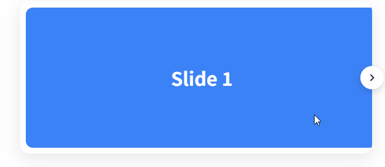
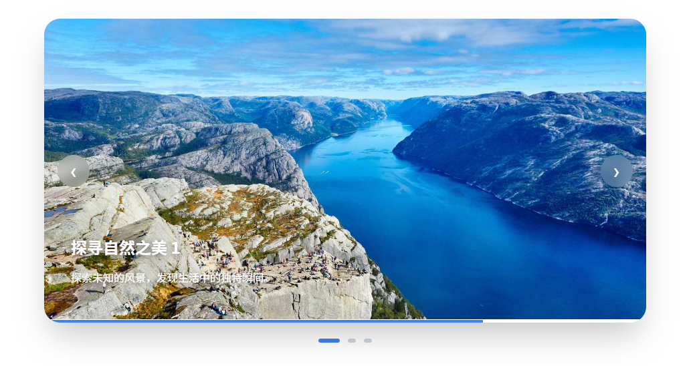
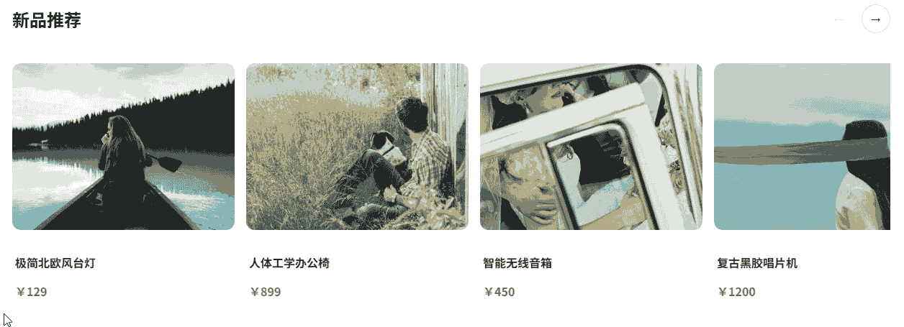
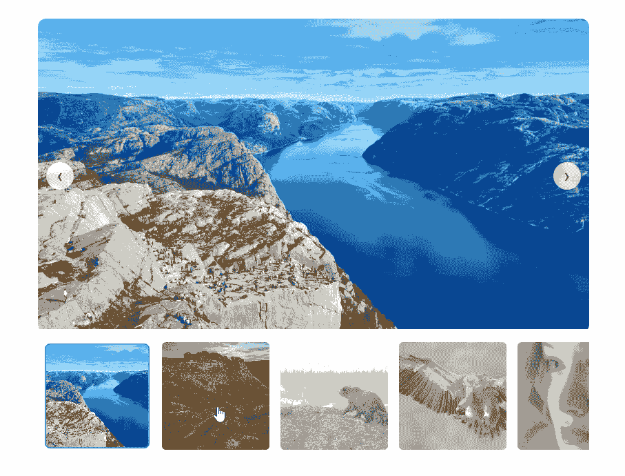

# Embla Carousel

Embla Carousel是一个轻量级、无依赖的轮播图库，专为流畅的动画和精准的滑动而设计。它与框架无关，完全开源，旨在为您提供完全的控制权，而不会增加不必要的臃肿。

- [官网地址](https://github.com/davidjerleke/embla-carousel)


## 基础配置

**安装依赖**

```
pnpm add embla-carousel@8.6.0 embla-carousel-vue@8.6.0 embla-carousel-autoplay@8.6.0
```


## 基础轮播

```vue
<script setup lang="ts">
import emblaCarouselVue from 'embla-carousel-vue'
import type { EmblaOptionsType } from 'embla-carousel'

/**
 * emblaCarouselVue 的返回值说明：
 * emblaRef: 用于绑定到 HTML 元素的引用
 * emblaApi: (可选) 用于在代码中手动控制轮播(如 next/prev)
 */
const options: EmblaOptionsType = {
  loop: true,
  align: 'center',
}

// 初始化钩子 (自带生命周期管理)
const [emblaRef, emblaApi] = emblaCarouselVue(options)

// 如果你需要手动控制，可以这样做：
// const scrollNext = () => emblaApi.value?.scrollNext()
</script>

<template>
  <div class="carousel-wrapper">
    <div class="embla" ref="emblaRef">
      <div class="embla__container">
        <div v-for="n in 5" :key="n" class="embla__slide">
          <div class="slide-content">
            Slide {{ n }}
          </div>
        </div>
      </div>
    </div>

    <p class="status">基础轮播：已支持手势拖拽</p>
  </div>
</template>

<style scoped>
.carousel-wrapper {
  max-width: 600px;
  margin: 40px auto;
}

/* 根容器：必须设置 overflow: hidden */
.embla {
  overflow: hidden;
  background: #f0f2f5;
  border-radius: 12px;
}

/* 滑动容器：Flex 布局 */
.embla__container {
  display: flex;
}

/* Slide 项：决定宽度 */
.embla__slide {
  flex: 0 0 100%; /* 每次展示 1 个 */
  min-width: 0;   /* 确保 Flex 子项在宽度超限时能正常收缩 */
  padding: 20px;
}

.slide-content {
  height: 250px;
  background: linear-gradient(135deg, #667eea 0%, #764ba2 100%);
  color: white;
  font-size: 36px;
  font-weight: bold;
  display: flex;
  align-items: center;
  justify-content: center;
  border-radius: 12px;
  box-shadow: 0 4px 12px rgba(0,0,0,0.1);
  user-select: none; /* 防止文字被意外选中 */
}

.status {
  text-align: center;
  margin-top: 16px;
  color: #666;
  font-size: 14px;
}
</style>
```


## 上一页 / 下一页按钮

```vue
<script setup lang="ts">
import { ref } from 'vue' // 实际上 emblaApi 本身就是响应式的，配合 onInit 即可
import emblaCarouselVue from 'embla-carousel-vue'
import type { EmblaOptionsType } from 'embla-carousel'

const options: EmblaOptionsType = { loop: false }

// 1. 初始化，解构出 emblaRef 和 emblaApi
const [emblaRef, emblaApi] = emblaCarouselVue(options)

// 2. 定义按钮状态
const canScrollPrev = ref(false)
const canScrollNext = ref(false)

// 3. 更新状态的方法
const updateButtons = () => {
  const api = emblaApi.value
  if (!api) return
  canScrollPrev.value = api.canScrollPrev()
  canScrollNext.value = api.canScrollNext()
}

// 4. 监听 API 事件
// 当 API 可用时，绑定 select 和 reInit 事件
import { watch } from 'vue'
watch(emblaApi, (api) => {
  if (!api) return

  api.on('select', updateButtons)
  api.on('reInit', updateButtons)
  updateButtons() // 初始化调用
})

// 5. 交互方法
const scrollPrev = () => emblaApi.value?.scrollPrev()
const scrollNext = () => emblaApi.value?.scrollNext()
</script>

<template>
  <div class="embla">
    <div class="embla__viewport" ref="emblaRef">
      <div class="embla__container">
        <div v-for="n in 5" :key="n" class="embla__slide">
          <div class="slide-content">Slide {{ n }}</div>
        </div>
      </div>
    </div>

    <button
        class="embla__button prev"
        :disabled="!canScrollPrev"
        @click="scrollPrev"
        aria-label="Previous Slide"
    >
      <svg viewBox="0 0 24 24"><path fill="currentColor" d="M15.41,16.58L10.83,12L15.41,7.41L14,6L8,12L14,18L15.41,16.58Z" /></svg>
    </button>

    <button
        class="embla__button next"
        :disabled="!canScrollNext"
        @click="scrollNext"
        aria-label="Next Slide"
    >
      <svg viewBox="0 0 24 24"><path fill="currentColor" d="M8.59,16.58L13.17,12L8.59,7.41L10,6L16,12L10,18L8.59,16.58Z" /></svg>
    </button>
  </div>
</template>

<style scoped>
.embla {
  position: relative;
  max-width: 600px;
  margin: auto;
  --btn-size: 40px;
}

.embla__viewport {
  overflow: hidden;
  border-radius: 16px;
  box-shadow: 0 8px 30px rgba(0,0,0,0.1);
}

.embla__container {
  display: flex;
}

.embla__slide {
  flex: 0 0 100%;
  padding: 10px;
}

.slide-content {
  height: 240px;
  background: #3b82f6;
  color: #fff;
  font-size: 32px;
  font-weight: bold;
  display: flex;
  align-items: center;
  justify-content: center;
  border-radius: 12px;
}

/* 按钮样式优化 */
.embla__button {
  position: absolute;
  top: 50%;
  transform: translateY(-50%);
  width: var(--btn-size);
  height: var(--btn-size);
  border-radius: 50%;
  border: none;
  background: #fff;
  color: #1e293b;
  display: flex;
  align-items: center;
  justify-content: center;
  cursor: pointer;
  box-shadow: 0 4px 12px rgba(0,0,0,0.15);
  transition: all 0.2s ease;
  z-index: 10;
}

.embla__button svg { width: 24px; height: 24px; }

.embla__button:hover:not(:disabled) {
  background: #f8fafc;
  transform: translateY(-50%) scale(1.1);
}

.embla__button:active:not(:disabled) {
  transform: translateY(-50%) scale(0.95);
}

.embla__button:disabled {
  opacity: 0; /* 隐藏不可点击的按钮更显高级 */
  pointer-events: none;
}

.prev { left: calc(var(--btn-size) / -2); }
.next { right: calc(var(--btn-size) / -2); }
</style>
```



## 分页圆点与导航

```vue
<script setup lang="ts">
import { ref, watch } from 'vue'
import emblaCarouselVue from 'embla-carousel-vue'
import type { EmblaOptionsType } from 'embla-carousel'

const options: EmblaOptionsType = { loop: false }
const [emblaRef, emblaApi] = emblaCarouselVue(options)

// --- 状态定义 ---
const canScrollPrev = ref(false)
const canScrollNext = ref(false)
const selectedIndex = ref(0)
const scrollSnaps = ref<number[]>([])

// --- 逻辑处理 ---
const onSelect = () => {
  if (!emblaApi.value) return
  selectedIndex.value = emblaApi.value.selectedScrollSnap()
  canScrollPrev.value = emblaApi.value.canScrollPrev()
  canScrollNext.value = emblaApi.value.canScrollNext()
}

const onInit = () => {
  if (!emblaApi.value) return
  scrollSnaps.value = emblaApi.value.scrollSnapList()
  onSelect()
}

// 监听 API 初始化
watch(emblaApi, (api) => {
  if (!api) return

  api.on('reInit', onInit)
  api.on('select', onSelect)
  onInit() // 首次执行
})

// --- 交互方法 ---
const scrollPrev = () => emblaApi.value?.scrollPrev()
const scrollNext = () => emblaApi.value?.scrollNext()
const scrollTo = (index: number) => emblaApi.value?.scrollTo(index)
</script>

<template>
  <div class="embla-wrapper">
    <div class="embla">
      <div class="embla__viewport" ref="emblaRef">
        <div class="embla__container">
          <div v-for="n in 5" :key="n" class="embla__slide">
            <div class="slide-content">Slide {{ n }}</div>
          </div>
        </div>
      </div>

      <button class="nav-btn prev" :disabled="!canScrollPrev" @click="scrollPrev">‹</button>
      <button class="nav-btn next" :disabled="!canScrollNext" @click="scrollNext">›</button>
    </div>

    <div class="embla__dots">
      <button
          v-for="(_, index) in scrollSnaps"
          :key="index"
          class="dot"
          :class="{ 'is-active': selectedIndex === index }"
          @click="scrollTo(index)"
          :aria-label="'Go to slide ' + (index + 1)"
      />
    </div>
  </div>
</template>

<style scoped>
.embla-wrapper {
  max-width: 600px;
  margin: 2rem auto;
}

.embla {
  position: relative;
  padding: 10px;
}

.embla__viewport {
  overflow: hidden;
  border-radius: 12px;
}

.embla__container {
  display: flex;
}

.embla__slide {
  flex: 0 0 100%;
  padding: 0 10px;
}

.slide-content {
  height: 200px;
  background: #409eff;
  color: white;
  font-size: 2rem;
  font-weight: bold;
  display: flex;
  align-items: center;
  justify-content: center;
  border-radius: 8px;
}

/* 导航按钮美化 */
.nav-btn {
  position: absolute;
  top: 50%;
  transform: translateY(-50%);
  width: 40px;
  height: 40px;
  border-radius: 50%;
  border: none;
  background: white;
  box-shadow: 0 4px 12px rgba(0,0,0,0.1);
  font-size: 24px;
  cursor: pointer;
  transition: all 0.2s;
  z-index: 2;
  display: flex;
  align-items: center;
  justify-content: center;
}

.nav-btn:disabled {
  opacity: 0.4;
  cursor: not-allowed;
}

.prev { left: -10px; }
.next { right: -10px; }

/* 分页圆点美化 */
.embla__dots {
  display: flex;
  justify-content: center;
  align-items: center;
  gap: 8px;
  margin-top: 16px;
}

.dot {
  width: 10px;
  height: 10px;
  padding: 0;
  border-radius: 50%;
  background-color: #dcdfe6;
  border: 2px solid transparent;
  cursor: pointer;
  transition: all 0.3s cubic-bezier(0.4, 0, 0.2, 1);
}

.dot.is-active {
  background-color: #409eff;
  /* 现代感设计：激活时圆点变长 */
  width: 24px;
  border-radius: 5px;
}

.dot:hover:not(.is-active) {
  background-color: #a0cfff;
}
</style>
```


## 图片轮播

```vue
<script setup lang="ts">
import { ref, watch } from 'vue'
import emblaCarouselVue from 'embla-carousel-vue'
import type { EmblaOptionsType } from 'embla-carousel'

const images = ref<string[]>([
  'https://picsum.photos/id/1015/1200/600',
  'https://picsum.photos/id/1016/1200/600',
  'https://picsum.photos/id/1020/1200/600',
])

const options: EmblaOptionsType = { loop: true }
const [emblaRef, emblaApi] = emblaCarouselVue(options)

// --- 状态逻辑 ---
const canScrollPrev = ref(false)
const canScrollNext = ref(false)
const selectedIndex = ref(0)
const scrollSnaps = ref<number[]>([])

const onSelect = () => {
  if (!emblaApi.value) return
  selectedIndex.value = emblaApi.value.selectedScrollSnap()
  canScrollPrev.value = emblaApi.value.canScrollPrev()
  canScrollNext.value = emblaApi.value.canScrollNext()
}

const onInit = () => {
  if (!emblaApi.value) return
  scrollSnaps.value = emblaApi.value.scrollSnapList()
  onSelect()
}

watch(emblaApi, (api) => {
  if (!api) return
  api.on('reInit', onInit)
  api.on('select', onSelect)
  onInit()
})

const scrollPrev = () => emblaApi.value?.scrollPrev()
const scrollNext = () => emblaApi.value?.scrollNext()
const scrollTo = (index: number) => emblaApi.value?.scrollTo(index)
</script>

<template>
  <div class="carousel-wrapper">
    <div class="embla-card">
      <div class="embla" ref="emblaRef">
        <div class="embla__container">
          <div v-for="(img, index) in images" :key="index" class="embla__slide">
            <div class="image-inner">
              
              <div class="image-overlay"></div>
              <span class="image-counter">{{ index + 1 }} / {{ images.length }}</span>
            </div>
          </div>
        </div>
      </div>

      <button class="nav-btn prev" @click="scrollPrev" v-show="canScrollPrev || options.loop">
        <svg viewBox="0 0 24 24"><path fill="currentColor" d="M15.41,16.58L10.83,12L15.41,7.41L14,6L8,12L14,18L15.41,16.58Z" /></svg>
      </button>
      <button class="nav-btn next" @click="scrollNext" v-show="canScrollNext || options.loop">
        <svg viewBox="0 0 24 24"><path fill="currentColor" d="M8.59,16.58L13.17,12L8.59,7.41L10,6L16,12L10,18L8.59,16.58Z" /></svg>
      </button>

      <div class="embla__dots">
        <button
            v-for="(_, index) in scrollSnaps"
            :key="index"
            class="dot"
            :class="{ 'is-active': selectedIndex === index }"
            @click="scrollTo(index)"
        />
      </div>
    </div>
  </div>
</template>

<style scoped>
.carousel-wrapper {
  max-width: 1000px;
  margin: 40px auto;
  padding: 0 20px;
}

.embla-card {
  position: relative;
  background: #000;
  border-radius: 20px;
  overflow: hidden; /* 裁剪圆点和图片边界 */
  box-shadow: 0 20px 40px rgba(0,0,0,0.2);
}

.embla {
  overflow: hidden;
}

.embla__container {
  display: flex;
}

.embla__slide {
  flex: 0 0 100%;
  min-width: 0;
}

.image-inner {
  position: relative;
  /* 使用 aspect-ratio 代替 padding-top 技巧，代码更清晰 */
  aspect-ratio: 16 / 9;
  width: 100%;
}

.carousel-img {
  width: 100%;
  height: 100%;
  object-fit: cover;
  display: block;
}

/* 渐变遮罩：让分页点和文字更清晰 */
.image-overlay {
  position: absolute;
  inset: 0;
  background: linear-gradient(to top, rgba(0,0,0,0.4) 0%, transparent 30%);
  pointer-events: none;
}

/* 数字指示器 */
.image-counter {
  position: absolute;
  top: 16px;
  right: 16px;
  background: rgba(0, 0, 0, 0.5);
  color: white;
  padding: 4px 10px;
  border-radius: 20px;
  font-size: 12px;
  backdrop-filter: blur(4px);
}

/* 导航按钮：毛玻璃效果 */
.nav-btn {
  position: absolute;
  top: 50%;
  transform: translateY(-50%);
  width: 44px;
  height: 44px;
  border-radius: 50%;
  border: none;
  background: rgba(255, 255, 255, 0.2);
  backdrop-filter: blur(8px);
  color: white;
  display: flex;
  align-items: center;
  justify-content: center;
  cursor: pointer;
  transition: all 0.3s ease;
}

.nav-btn:hover { background: rgba(255, 255, 255, 0.4); }
.nav-btn svg { width: 28px; height: 28px; }
.prev { left: 16px; }
.next { right: 16px; }

/* 分页圆点：悬浮底端 */
.embla__dots {
  position: absolute;
  bottom: 16px;
  left: 50%;
  transform: translateX(-50%);
  display: flex;
  gap: 8px;
}

.dot {
  width: 8px;
  height: 8px;
  border-radius: 50%;
  background: rgba(255, 255, 255, 0.4);
  border: none;
  cursor: pointer;
  transition: all 0.3s;
}

.dot.is-active {
  background: #fff;
  transform: scale(1.3);
}
</style>
```


## 自动播放

```vue
<script setup lang="ts">
import { ref, watch } from 'vue'
import emblaCarouselVue from 'embla-carousel-vue'
import Autoplay from 'embla-carousel-autoplay'
import type { EmblaOptionsType } from 'embla-carousel'

const images = ref([
  'https://picsum.photos/id/1015/1200/600',
  'https://picsum.photos/id/1016/1200/600',
  'https://picsum.photos/id/1020/1200/600',
])

const options: EmblaOptionsType = { loop: true }

// 1. 初始化插件：在 Hook 参数中直接定义
const [emblaRef, emblaApi] = emblaCarouselVue(options, [
  Autoplay({
    delay: 4000,
    stopOnInteraction: false,
    stopOnMouseEnter: true
  })
])

// --- 状态逻辑 ---
const selectedIndex = ref(0)
const scrollSnaps = ref<number[]>([])

const onSelect = () => {
  if (!emblaApi.value) return
  selectedIndex.value = emblaApi.value.selectedScrollSnap()
}

const onInit = () => {
  if (!emblaApi.value) return
  scrollSnaps.value = emblaApi.value.scrollSnapList()
  onSelect()
}

watch(emblaApi, (api) => {
  if (!api) return
  api.on('reInit', onInit)
  api.on('select', onSelect)
  onInit()
})

// --- 交互方法 ---
const scrollPrev = () => emblaApi.value?.scrollPrev()
const scrollNext = () => emblaApi.value?.scrollNext()
const scrollTo = (index: number) => emblaApi.value?.scrollTo(index)
</script>

<template>
  <div class="carousel-container">
    <div class="embla-frame">
      <div class="embla" ref="emblaRef">
        <div class="embla__container">
          <div v-for="(img, index) in images" :key="index" class="embla__slide">
            <div class="image-box">
              
              <div class="slide-caption">
                <h3>探寻自然之美 {{ index + 1 }}</h3>
                <p>探索未知的风景，发现生活中的独特瞬间。</p>
              </div>
            </div>
          </div>
        </div>
      </div>

      <button class="arrow-btn left" @click="scrollPrev">‹</button>
      <button class="arrow-btn right" @click="scrollNext">›</button>

      <div class="autoplay-progress">
        <div
            class="progress-bar"
            :key="selectedIndex"
            :style="{ '--duration': '4000ms' }"
        ></div>
      </div>
    </div>

    <div class="dots-nav">
      <button
          v-for="(_, index) in scrollSnaps"
          :key="index"
          class="dot-item"
          :class="{ 'active': selectedIndex === index }"
          @click="scrollTo(index)"
      />
    </div>
  </div>
</template>

<style scoped>
.carousel-container {
  max-width: 900px;
  margin: 50px auto;
  padding: 0 20px;
}

.embla-frame {
  position: relative;
  border-radius: 24px;
  overflow: hidden;
  box-shadow: 0 25px 50px -12px rgba(0, 0, 0, 0.25);
}

.embla { overflow: hidden; }
.embla__container { display: flex; }
.embla__slide { flex: 0 0 100%; min-width: 0; }

.image-box {
  position: relative;
  aspect-ratio: 2 / 1;
}

.slide-img {
  width: 100%;
  height: 100%;
  object-fit: cover;
}

/* 文字介绍样式 */
.slide-caption {
  position: absolute;
  bottom: 40px;
  left: 40px;
  color: white;
  text-shadow: 0 2px 10px rgba(0,0,0,0.5);
}
.slide-caption h3 { font-size: 24px; margin-bottom: 8px; }

/* 进度条动画 */
.autoplay-progress {
  position: absolute;
  bottom: 0;
  left: 0;
  width: 100%;
  height: 4px;
  background: rgba(255, 255, 255, 0.2);
}

.progress-bar {
  height: 100%;
  background: #3b82f6;
  width: 0;
  /* 只有当 active 状态时触发动画 */
  animation: progress linear forwards;
  animation-duration: var(--duration);
}

@keyframes progress {
  from { width: 0; }
  to { width: 100%; }
}

/* 导航箭头美化 */
.arrow-btn {
  position: absolute;
  top: 50%;
  transform: translateY(-50%);
  width: 48px;
  height: 48px;
  border-radius: 50%;
  border: none;
  background: rgba(255, 255, 255, 0.15);
  backdrop-filter: blur(10px);
  color: white;
  font-size: 30px;
  cursor: pointer;
  transition: all 0.3s;
  z-index: 10;
}
.arrow-btn:hover { background: rgba(255, 255, 255, 0.3); }
.left { left: 20px; }
.right { right: 20px; }

/* 分页点样式 */
.dots-nav {
  display: flex;
  justify-content: center;
  gap: 12px;
  margin-top: 24px;
}
.dot-item {
  width: 12px;
  height: 6px;
  border-radius: 3px;
  background: #cbd5e1;
  border: none;
  cursor: pointer;
  transition: all 0.4s cubic-bezier(0.175, 0.885, 0.32, 1.275);
}
.dot-item.active {
  background: #3b82f6;
  width: 32px;
}
</style>
```



## 响应式多列

**Embla 不关心“几列”，它只关心 slide 的宽度**
 👉 响应式 = **纯 CSS 控制 `flex-basis`**

```vue
<script setup lang="ts">
import { ref, watch } from 'vue'
import emblaCarouselVue from 'embla-carousel-vue'
import type { EmblaOptionsType } from 'embla-carousel'

interface Item {
  title: string
  img: string
  price: string
}

const items = ref<Item[]>([
  { title: '极简北欧风台灯', price: '￥129', img: 'https://picsum.photos/id/1011/400/300' },
  { title: '人体工学办公椅', price: '￥899', img: 'https://picsum.photos/id/1012/400/300' },
  { title: '智能无线音箱', price: '￥450', img: 'https://picsum.photos/id/1013/400/300' },
  { title: '复古黑胶唱片机', price: '￥1200', img: 'https://picsum.photos/id/1014/400/300' },
  { title: '手作陶泥花瓶', price: '￥88', img: 'https://picsum.photos/id/1015/400/300' },
  { title: '便携式咖啡机', price: '￥299', img: 'https://picsum.photos/id/1016/400/300' },
])

// 1. 响应式配置：通过 breakpoints 属性
const options: EmblaOptionsType = {
  align: 'start',
  containScroll: 'trimSnaps', // 关键：防止末尾出现空白
  dragFree: true,             // 自由滚动手感
  breakpoints: {
    '(min-width: 1024px)': { loop: false }, // 大屏不循环
    '(max-width: 768px)': { loop: true }    // 手机端循环
  }
}

const [emblaRef, emblaApi] = emblaCarouselVue(options)

// --- 状态逻辑 ---
const canScrollPrev = ref(false)
const canScrollNext = ref(false)

const onSelect = () => {
  if (!emblaApi.value) return
  canScrollPrev.value = emblaApi.value.canScrollPrev()
  canScrollNext.value = emblaApi.value.canScrollNext()
}

watch(emblaApi, (api) => {
  if (!api) return
  api.on('select', onSelect)
  api.on('reInit', onSelect)
  onSelect()
})

const scrollPrev = () => emblaApi.value?.scrollPrev()
const scrollNext = () => emblaApi.value?.scrollNext()
</script>

<template>
  <div class="carousel-container">
    <div class="section-header">
      <h2>新品推荐</h2>
      <div class="nav-group">
        <button class="icon-btn" :disabled="!canScrollPrev" @click="scrollPrev">←</button>
        <button class="icon-btn" :disabled="!canScrollNext" @click="scrollNext">→</button>
      </div>
    </div>

    <div class="embla" ref="emblaRef">
      <div class="embla__container">
        <div v-for="(item, index) in items" :key="index" class="embla__slide">
          <div class="product-card">
            <div class="img-wrapper">
              
            </div>
            <div class="info">
              <h4>{{ item.title }}</h4>
              <p class="price">{{ item.price }}</p>
            </div>
          </div>
        </div>
      </div>
    </div>
  </div>
</template>

<style scoped>
.carousel-container {
  max-width: 1280px;
  margin: 60px auto;
  padding: 0 24px;
}

.section-header {
  display: flex;
  justify-content: space-between;
  align-items: center;
  margin-bottom: 24px;
}

.section-header h2 { font-size: 24px; color: #1a1a1a; }

.nav-group { display: flex; gap: 12px; }

.icon-btn {
  width: 40px;
  height: 40px;
  border-radius: 50%;
  border: 1px solid #e5e5e5;
  background: white;
  cursor: pointer;
  display: flex;
  align-items: center;
  justify-content: center;
  transition: all 0.2s;
}

.icon-btn:hover:not(:disabled) {
  border-color: #1a1a1a;
  background: #1a1a1a;
  color: white;
}

.icon-btn:disabled { opacity: 0.3; cursor: not-allowed; }

/* Embla 布局控制 */
.embla { overflow: hidden; cursor: grab; }
.embla:active { cursor: grabbing; }

.embla__container {
  display: flex;
  margin-left: -16px; /* 抵消 slide 的 padding */
}

.embla__slide {
  flex: 0 0 25%;    /* 默认 PC：4 列 */
  padding-left: 16px;
  min-width: 0;
}

/* 响应式断点控制 */
@media (max-width: 1200px) { .embla__slide { flex: 0 0 33.33%; } } /* 3 列 */
@media (max-width: 768px) { .embla__slide { flex: 0 0 50%; } }    /* 2 列 */
@media (max-width: 480px) { .embla__slide { flex: 0 0 85%; } }    /* 1.15 列，露出一部分提示可滑动 */

/* 卡片设计 */
.product-card {
  background: #fff;
  border-radius: 12px;
  transition: transform 0.3s ease;
}

.product-card:hover { transform: translateY(-5px); }

.img-wrapper {
  aspect-ratio: 4 / 3;
  overflow: hidden;
  border-radius: 12px;
  background: #f5f5f5;
}

.img-wrapper img {
  width: 100%;
  height: 100%;
  object-fit: cover;
}

.info { padding: 12px 4px; }
.info h4 { font-size: 16px; margin-bottom: 4px; color: #333; }
.price { color: #f43f5e; font-weight: 700; }
</style>
```




## 主图 + 缩略图

- 上方：主图轮播（大图）
- 下方：缩略图横向列表
- 点击缩略图 → 主图跳转
- 主图滑动 → 缩略图自动高亮 + 滚动到可视区

```vue
<script setup lang="ts">
import { ref, watch } from 'vue'
import emblaCarouselVue from 'embla-carousel-vue'

const images = [
  'https://picsum.photos/id/1015/1200/600',
  'https://picsum.photos/id/1016/1200/600',
  'https://picsum.photos/id/1020/1200/600',
  'https://picsum.photos/id/1024/1200/600',
  'https://picsum.photos/id/1027/1200/600',
]

// 1. 初始化两套轮播
const [mainRef, mainApi] = emblaCarouselVue({ loop: true })
const [thumbRef, thumbApi] = emblaCarouselVue({
  containScroll: 'keepSnaps',
  dragFree: true
})

const selectedIndex = ref(0)

// 2. 联动逻辑：主图滚动时，同步缩略图
const onSelect = () => {
  if (!mainApi.value || !thumbApi.value) return
  const index = mainApi.value.selectedScrollSnap()
  selectedIndex.value = index
  thumbApi.value.scrollTo(index)
}

// 3. 监听 API 挂载情况
watch([mainApi, thumbApi], ([mApi, tApi]) => {
  if (!mApi || !tApi) return

  mApi.on('select', onSelect)
  mApi.on('reInit', onSelect)
  onSelect() // 初始对齐
})

// 4. 交互方法
const onThumbClick = (index: number) => {
  mainApi.value?.scrollTo(index)
}
</script>

<template>
  <div class="gallery-container">
    <div class="embla-main-wrapper">
      <div class="embla" ref="mainRef">
        <div class="embla__container">
          <div v-for="(img, index) in images" :key="index" class="embla__slide">
            <div class="main-image-container">
              
            </div>
          </div>
        </div>
      </div>
      <button class="nav-btn prev" @click="mainApi?.scrollPrev()">‹</button>
      <button class="nav-btn next" @click="mainApi?.scrollNext()">›</button>
    </div>

    <div class="embla-thumbs-wrapper">
      <div class="embla" ref="thumbRef">
        <div class="embla__container">
          <div
              v-for="(img, index) in images"
              :key="index"
              class="embla__slide thumb-slide"
              :class="{ 'is-active': selectedIndex === index }"
              @click="onThumbClick(index)"
          >
            <div class="thumb-inner">
              
            </div>
          </div>
        </div>
      </div>
    </div>
  </div>
</template>

<style scoped>
.gallery-container {
  max-width: 800px;
  margin: 40px auto;
  user-select: none;
}

/* --- 主图样式 --- */
.embla-main-wrapper {
  position: relative;
  margin-bottom: 12px;
}
.embla-main-wrapper .embla { overflow: hidden; border-radius: 12px; }
.embla__container { display: flex; }
.embla__slide { flex: 0 0 100%; min-width: 0; }

.main-image-container {
  aspect-ratio: 16 / 9;
  background: #f1f5f9;
}
.main-img {
  width: 100%;
  height: 100%;
  object-fit: cover;
}

/* 按钮设计 */
.nav-btn {
  position: absolute;
  top: 50%;
  transform: translateY(-50%);
  width: 40px;
  height: 40px;
  background: rgba(255, 255, 255, 0.8);
  backdrop-filter: blur(4px);
  border: none;
  border-radius: 50%;
  cursor: pointer;
  box-shadow: 0 4px 12px rgba(0,0,0,0.1);
  font-size: 24px;
  z-index: 2;
}
.prev { left: 12px; }
.next { right: 12px; }

/* --- 缩略图样式 --- */
.embla-thumbs-wrapper .embla { overflow: hidden; }

.thumb-slide {
  flex: 0 0 20%; /* 展示 5 个缩略图 */
  padding: 0 6px;
  cursor: pointer;
  transition: transform 0.2s ease;
}

.thumb-inner {
  aspect-ratio: 1;
  border-radius: 8px;
  overflow: hidden;
  border: 2px solid transparent;
  transition: all 0.3s;
  background: #f1f5f9;
}

.thumb-inner img {
  width: 100%;
  height: 100%;
  object-fit: cover;
}

/* 激活状态 */
.thumb-slide.is-active .thumb-inner {
  border-color: #3b82f6;
  transform: scale(0.95);
}

.thumb-slide:not(.is-active) {
  opacity: 0.6;
}

.thumb-slide:hover:not(.is-active) {
  opacity: 0.9;
}
</style>
```



## 虚拟按需加载轮播

```java
<template>
  <div class="carousel-container">
    <div class="embla-viewport" ref="emblaRef">
      <div class="embla__container">
        <div
            v-for="(item, index) in allItems"
            :key="index"
            class="embla__slide"
        >
          <div class="slide-content">
            <template v-if="shouldRender(index)">
              
            </template>

            <div v-else class="skeleton-box">
              <div class="loading-spinner"></div>
            </div>
          </div>
        </div>
      </div>

      <button
          class="nav-btn prev"
          :class="{ 'hidden': !canScrollPrev }"
          @click="scrollPrev"
      >
        <svg viewBox="0 0 24 24" fill="none" stroke="currentColor" stroke-width="2"><path d="M15 18l-6-6 6-6"/></svg>
      </button>
      <button
          class="nav-btn next"
          :class="{ 'hidden': !canScrollNext }"
          @click="scrollNext"
      >
        <svg viewBox="0 0 24 24" fill="none" stroke="currentColor" stroke-width="2"><path d="M9 18l6-6-6-6"/></svg>
      </button>
    </div>
  </div>
</template>

<script setup lang="ts">
import { ref, watch, nextTick } from 'vue'
import emblaCarouselVue from 'embla-carousel-vue'
import type { EmblaOptionsType } from 'embla-carousel'

// 模拟 50 条数据
const allItems = Array.from({ length: 50 }, (_, i) => ({
  url: `https://picsum.photos/id/${i + 20}/1200/800`
}))

const options: EmblaOptionsType = {
  loop: false,
  align: 'center',
  containScroll: 'trimSnaps'
}

const [emblaRef, emblaApi] = emblaCarouselVue(options)

// --- 状态 ---
const slidesInView = ref<number[]>([0]) // 初始默认加载第 1 张
const canScrollPrev = ref(false)
const canScrollNext = ref(false)

// --- 逻辑：计算当前视口需渲染的 Slide ---
const updateElements = () => {
  const api = emblaApi.value
  if (!api) return

  const inView = api.slidesInView()
  if (inView.length === 0) return

  // 预加载当前页的前后各 1 张
  const buffer = 1
  const extended = new Set<number>()
  inView.forEach(index => {
    for (let i = index - buffer; i <= index + buffer; i++) {
      if (i >= 0 && i < allItems.length) extended.add(i)
    }
  })

  slidesInView.value = Array.from(extended)
  canScrollPrev.value = api.canScrollPrev()
  canScrollNext.value = api.canScrollNext()
}

// --- 生命周期与事件监听 ---
watch(emblaApi, (api) => {
  if (!api) return

  api.on('init', updateElements)
  api.on('select', updateElements)
  api.on('reInit', updateElements)
  api.on('scroll', updateElements)

  // 解决首屏加载 Bug 的三重保险
  nextTick(() => {
    updateElements()
    setTimeout(updateElements, 50)  // 补丁 1
    setTimeout(updateElements, 150) // 补丁 2 (应对极慢渲染)
  })
})

const scrollPrev = () => emblaApi.value?.scrollPrev()
const scrollNext = () => emblaApi.value?.scrollNext()
const shouldRender = (index: number) => slidesInView.value.includes(index)
</script>

<style scoped>
/* 容器 */
.carousel-container {
  max-width: 1000px;
  margin: 2rem auto;
  padding: 0 1rem;
}

.embla-viewport {
  position: relative;
  overflow: hidden;
  border-radius: 1rem;
  background: #f4f4f5;
}

.embla__container {
  display: flex;
}

/* Slide 宽度设置 */
.embla__slide {
  flex: 0 0 100%; /* 每次展示 1 个 */
  min-width: 0;
  padding: 0.5rem;
}

.slide-content {
  position: relative;
  aspect-ratio: 16 / 9;
  background: #fff;
  border-radius: 0.75rem;
  overflow: hidden;
  display: flex;
  align-items: center;
  justify-content: center;
  box-shadow: 0 4px 6px -1px rgba(0, 0, 0, 0.1);
}

.slide-img {
  width: 100%;
  height: 100%;
  object-fit: cover;
  display: block;
  animation: fadeIn 0.4s ease;
}

/* 骨架屏 */
.skeleton-box {
  display: flex;
  align-items: center;
  justify-content: center;
}

.loading-spinner {
  width: 2rem;
  height: 2rem;
  border: 3px solid #e4e4e7;
  border-top-color: #3b82f6;
  border-radius: 50%;
  animation: spin 0.8s linear infinite;
}

/* 导航按钮 */
.nav-btn {
  position: absolute;
  top: 50%;
  transform: translateY(-50%);
  width: 3rem;
  height: 3rem;
  border-radius: 50%;
  border: none;
  background: rgba(255, 255, 255, 0.9);
  color: #1f2937;
  display: flex;
  align-items: center;
  justify-content: center;
  cursor: pointer;
  box-shadow: 0 10px 15px -3px rgba(0, 0, 0, 0.1);
  transition: all 0.3s;
  z-index: 10;
}

.nav-btn svg { width: 1.5rem; height: 1.5rem; }
.nav-btn:hover { background: #fff; transform: translateY(-50%) scale(1.05); }
.nav-btn.hidden { opacity: 0; pointer-events: none; }

.prev { left: 1rem; }
.next { right: 1rem; }

@keyframes spin { to { transform: rotate(360deg); } }
@keyframes fadeIn { from { opacity: 0; } to { opacity: 1; } }

/* 移动端适配 */
@media (max-width: 640px) {
  .embla__slide { flex: 0 0 90%; } /* 露出一点下一张 */
  .nav-btn { width: 2.5rem; height: 2.5rem; }
}
</style>
```

------

## 垂直按需加载轮播

```vue
<template>
  <div class="vertical-carousel-wrapper">
    <div class="embla-viewport" ref="emblaRef">
      <div class="embla__container">
        <div
            v-for="(item, index) in allItems"
            :key="index"
            class="embla__slide"
        >
          <div class="slide-card">
            <template v-if="shouldRender(index)">
              
              <div class="slide-overlay">
                <span>作品 #{{ index + 1 }}</span>
              </div>
            </template>

            <div v-else class="skeleton">
              <div class="loading-dot"></div>
            </div>
          </div>
        </div>
      </div>

      <div class="controls">
        <button class="nav-btn up" :disabled="!canScrollPrev" @click="scrollPrev">
          <svg viewBox="0 0 24 24" fill="none" stroke="currentColor" stroke-width="3"><path d="M18 15l-6-6-6 6"/></svg>
        </button>
        <button class="nav-btn down" :disabled="!canScrollNext" @click="scrollNext">
          <svg viewBox="0 0 24 24" fill="none" stroke="currentColor" stroke-width="3"><path d="M6 9l6 6 6-6"/></svg>
        </button>
      </div>
    </div>
  </div>
</template>

<script setup lang="ts">
import { ref, watch, nextTick } from 'vue'
import emblaCarouselVue from 'embla-carousel-vue'
import type { EmblaOptionsType } from 'embla-carousel'

const allItems = Array.from({ length: 20 }, (_, i) => ({
  url: `https://picsum.photos/id/${i + 40}/800/1200`
}))

// 【关键配置】：axis: 'y' 开启垂直模式
const options: EmblaOptionsType = {
  axis: 'y',
  loop: false,
  align: 'start'
}

const [emblaRef, emblaApi] = emblaCarouselVue(options)

// --- 状态与逻辑 ---
const slidesInView = ref<number[]>([0])
const canScrollPrev = ref(false)
const canScrollNext = ref(false)

const updateElements = () => {
  const api = emblaApi.value
  if (!api) return

  const inView = api.slidesInView()
  if (inView.length === 0) return

  // 预加载当前及上下各 1 条
  const buffer = 1
  const extended = new Set<number>()
  inView.forEach(index => {
    for (let i = index - buffer; i <= index + buffer; i++) {
      if (i >= 0 && i < allItems.length) extended.add(i)
    }
  })

  slidesInView.value = Array.from(extended)
  canScrollPrev.value = api.canScrollPrev()
  canScrollNext.value = api.canScrollNext()
}

watch(emblaApi, (api) => {
  if (!api) return

  api.on('init', updateElements)
  api.on('select', updateElements)
  api.on('reInit', updateElements)
  api.on('scroll', updateElements)

  nextTick(() => {
    updateElements()
    // 延迟探测，确保容器高度已由 CSS 渲染完成
    setTimeout(updateElements, 100)
  })
})

const scrollPrev = () => emblaApi.value?.scrollPrev()
const scrollNext = () => emblaApi.value?.scrollNext()
const shouldRender = (index: number) => slidesInView.value.includes(index)
</script>

<style scoped>
/* 1. 外部约束：必须给高度 */
.vertical-carousel-wrapper {
  max-width: 500px;
  margin: 2rem auto;
  height: 600px; /* 垂直模式必须显式定义高度 */
  padding: 0 1rem;
}

.embla-viewport {
  position: relative;
  height: 100%;
  overflow: hidden;
  border-radius: 1.5rem;
  background: #111; /* 黑色底色，适合展示图片 */
}

/* 2. 容器：flex-direction 改为 column */
.embla__container {
  display: flex;
  flex-direction: column;
  height: 100%; /* 继承视口高度 */
}

/* 3. 每一页高度占比 */
.embla__slide {
  flex: 0 0 100%; /* 每页占满视口高度 */
  min-height: 0;
  padding: 10px;
}

.slide-card {
  position: relative;
  width: 100%;
  height: 100%;
  border-radius: 1rem;
  overflow: hidden;
  background: #222;
  display: flex;
  align-items: center;
  justify-content: center;
}

.slide-img {
  width: 100%;
  height: 100%;
  object-fit: cover;
  animation: slideUpIn 0.5s cubic-bezier(0.2, 0.8, 0.2, 1);
}

.slide-overlay {
  position: absolute;
  bottom: 20px;
  left: 20px;
  color: white;
  background: rgba(0, 0, 0, 0.4);
  backdrop-filter: blur(8px);
  padding: 6px 16px;
  border-radius: 30px;
  font-size: 14px;
}

/* 垂直控制按钮 */
.controls {
  position: absolute;
  right: 20px;
  top: 50%;
  transform: translateY(-50%);
  display: flex;
  flex-direction: column;
  gap: 12px;
  z-index: 10;
}

.nav-btn {
  width: 40px;
  height: 40px;
  border-radius: 50%;
  border: none;
  background: rgba(255, 255, 255, 0.15);
  backdrop-filter: blur(10px);
  color: white;
  cursor: pointer;
  display: flex;
  align-items: center;
  justify-content: center;
  transition: all 0.3s;
}

.nav-btn:hover:not(:disabled) {
  background: rgba(255, 255, 255, 0.3);
  transform: scale(1.1);
}

.nav-btn:disabled {
  opacity: 0;
  pointer-events: none;
}

/* 骨架屏动画 */
.loading-dot {
  width: 10px;
  height: 10px;
  background: #3b82f6;
  border-radius: 50%;
  animation: pulse 1.5s infinite ease-in-out;
}

@keyframes pulse {
  0%, 100% { transform: scale(1); opacity: 0.5; }
  50% { transform: scale(2); opacity: 1; }
}

@keyframes slideUpIn {
  from { opacity: 0; transform: translateY(20px); }
  to { opacity: 1; transform: translateY(0); }
}

.nav-btn svg { width: 20px; height: 20px; }
</style>
```


## Vertical 垂直滑动 \+ 自动滚动公告

### 安装依赖

```
pnpm add embla-carousel-wheel-gestures@8.1.0
```

### 单行公告

```vue
<script setup lang="ts">
import emblaCarouselVue from 'embla-carousel-vue'
import Autoplay from 'embla-carousel-autoplay'
import WheelGestures from 'embla-carousel-wheel-gestures'
import type { EmblaOptionsType } from 'embla-carousel'

interface Notice {
  id: number;
  content: string;
  tag: string;
  type: 'warning' | 'info' | 'success';
}

const notices: Notice[] = [
  { id: 1, tag: '热议', type: 'warning', content: 'Vue 3.5 版本正式发布，支持滚轮切换！' },
  { id: 2, tag: '活动', type: 'success', content: '鼠标滚轮滑动即可上下翻阅公告内容。' },
  { id: 3, tag: '通知', type: 'info', content: '系统将于今晚 02:00 进行例行维护，请知悉。' },
]

// Embla 配置
const options: EmblaOptionsType = {
  loop: true,
  axis: 'y',
  duration: 30 // 让滚动动画更平滑
}

const [emblaRef] = emblaCarouselVue(options, [
  Autoplay({ delay: 4000, stopOnInteraction: false }),
  // 关键点：使用 as any 解决插件类型不匹配报错
  WheelGestures() as any
])
</script>

<template>
  <div class="page-wrapper">
    <div class="notice-card">
      <div class="icon-box">
        <svg viewBox="0 0 24 24" class="sound-icon">
          <path fill="currentColor" d="M14,3.23V5.29C16.89,6.15 19,8.83 19,12C19,15.17 16.89,17.84 14,18.7V20.77C18,19.86 21,16.28 21,12C21,7.72 18,4.14 14,3.23M16.5,12C16.5,10.23 15.5,8.71 14,7.97V16.03C15.5,15.29 16.5,13.77 16.5,12M3,9V15H7L12,20V4L7,9H3Z" />
        </svg>
      </div>

      <div class="embla" ref="emblaRef">
        <div class="embla__container">
          <div v-for="item in notices" :key="item.id" class="embla__slide">
            <div class="content-wrapper">
              <span :class="['tag', `tag-${item.type}`]">{{ item.tag }}</span>
              <span class="text">{{ item.content }}</span>
            </div>
          </div>
        </div>
      </div>

      <button class="arrow-btn">
        <span>更多</span>
        <svg viewBox="0 0 24 24" class="arrow-icon"><path fill="currentColor" d="M8.59,16.58L13.17,12L8.59,7.41L10,6L16,12L10,18L8.59,16.58Z" /></svg>
      </button>
    </div>
    <p class="hint">💡 试试滚轮上下滑动或拖拽</p>
  </div>
</template>

<style scoped>
/* 容器居中展示 */
.page-wrapper {
  display: flex;
  flex-direction: column;
  align-items: center;
  padding: 40px;
  font-family: 'Inter', -apple-system, sans-serif;
}

/* 公告卡片主样式 */
.notice-card {
  display: flex;
  align-items: center;
  width: 500px;
  height: 48px;
  background: #ffffff;
  border-radius: 12px;
  padding: 0 4px 0 16px;
  box-shadow: 0 4px 20px rgba(0, 0, 0, 0.08);
  border: 1px solid #f0f0f0;
  transition: all 0.3s ease;
}

.notice-card:hover {
  box-shadow: 0 6px 24px rgba(0, 0, 0, 0.12);
  transform: translateY(-1px);
}

/* 图标样式 */
.icon-box {
  color: #3b82f6;
  display: flex;
  align-items: center;
  margin-right: 12px;
}
.sound-icon { width: 20px; height: 20px; }

/* Embla 视口 */
.embla {
  flex: 1;
  overflow: hidden;
  height: 100%;
}

.embla__container {
  display: flex;
  flex-direction: column;
  height: 100%;
}

.embla__slide {
  flex: 0 0 100%;
  min-height: 0;
  display: flex;
  align-items: center;
}

.content-wrapper {
  display: flex;
  align-items: center;
  width: 100%;
  cursor: grab;
}

/* 标签设计 */
.tag {
  font-size: 11px;
  font-weight: 600;
  padding: 2px 8px;
  border-radius: 6px;
  margin-right: 12px;
  text-transform: uppercase;
  letter-spacing: 0.5px;
}
.tag-warning { background: #fff7ed; color: #ea580c; }
.tag-success { background: #f0fdf4; color: #16a34a; }
.tag-info { background: #eff6ff; color: #2563eb; }

/* 文字样式 */
.text {
  font-size: 14px;
  color: #374151;
  white-space: nowrap;
  overflow: hidden;
  text-overflow: ellipsis;
  flex: 1;
}

/* 更多按钮 */
.arrow-btn {
  display: flex;
  align-items: center;
  background: transparent;
  border: none;
  color: #9ca3af;
  font-size: 13px;
  padding: 8px 12px;
  cursor: pointer;
  border-radius: 8px;
  transition: all 0.2s;
}

.arrow-btn:hover {
  background: #f9fafb;
  color: #3b82f6;
}

.arrow-icon { width: 18px; height: 18px; }

.hint {
  margin-top: 12px;
  font-size: 12px;
  color: #9ca3af;
}
</style>
```


### 多行公告

```vue
<script setup lang="ts">
import emblaCarouselVue from 'embla-carousel-vue'
import Autoplay from 'embla-carousel-autoplay'
import WheelGestures from 'embla-carousel-wheel-gestures'
import type { EmblaOptionsType } from 'embla-carousel'

interface Notice {
  id: number;
  content: string;
  tag: string;
}

const notices: Notice[] = [
  { id: 1, tag: '活动', content: '京东 618 大促即将开启，预付定金翻倍！' },
  { id: 2, tag: '通知', content: '关于 2026 年春节放假安排的正式通知。' },
  { id: 3, tag: '热议', content: 'Vue 3.5 新特性：更简洁的响应式系统。' },
  { id: 4, tag: '安全', content: '提醒：请定期更换您的账户登录密码。' },
  { id: 5, tag: '升级', content: '系统内核已升级至 v4.0，加载速度提升 50%。' },
  { id: 6, tag: '天气', content: '今日雷阵雨，出门请记得携带雨具。' },
]

// Embla 配置
const options: EmblaOptionsType = {
  loop: true,
  axis: 'y',
  align: 'start', // 确保对齐起始位置
  containScroll: 'trimSnaps' // 优化滚动边缘
}

const [emblaRef] = emblaCarouselVue(options, [
  Autoplay({
    delay: 3000,
    stopOnInteraction: false,
    stopOnMouseEnter: true
  }),
  WheelGestures() as any
])
</script>

<template>
  <div class="page-wrapper">
    <div class="list-notice-card">
      <div class="list-header">
        <div class="title-group">
          <span class="main-title">公告中心</span>
          <span class="sub-title">NEWS</span>
        </div>
        <button class="more-btn">查看全部</button>
      </div>

      <div class="embla" ref="emblaRef">
        <div class="embla__container">
          <div v-for="item in notices" :key="item.id" class="embla__slide">
            <div class="slide-item">
              <span class="dot">•</span>
              <span class="tag">{{ item.tag }}</span>
              <span class="text">{{ item.content }}</span>
              <span class="time">02-09</span>
            </div>
          </div>
        </div>
      </div>
    </div>
  </div>
</template>

<style scoped>
.page-wrapper {
  padding: 40px;
  background: #f0f2f5;
  display: flex;
  justify-content: center;
}

/* 卡片容器 */
.list-notice-card {
  width: 500px;
  background: #ffffff;
  border-radius: 12px;
  box-shadow: 0 4px 12px rgba(0,0,0,0.05);
  padding: 20px;
}

/* 头部样式 */
.list-header {
  display: flex;
  justify-content: space-between;
  align-items: flex-end;
  margin-bottom: 16px;
  padding-bottom: 12px;
  border-bottom: 1px solid #f0f0f0;
}
.main-title { font-size: 18px; font-weight: 700; color: #262626; margin-right: 8px; }
.sub-title { font-size: 12px; color: #bfbfbf; font-family: Arial; }
.more-btn { font-size: 13px; color: #1890ff; background: none; border: none; cursor: pointer; }

/* --- Embla 核心样式 (多行关键) --- */
.embla {
  overflow: hidden;
  height: 120px; /* 【关键】设置固定高度，决定你想展示几行 */
}

.embla__container {
  display: flex;
  flex-direction: column;
  height: 100%;
}

.embla__slide {
  /* 【关键】
     如果你想展示 3 行，设置 flex: 0 0 33.33%
     如果你想展示 4 行，设置 flex: 0 0 25%
  */
  flex: 0 0 33.33%;
  min-height: 0;
  display: flex;
  align-items: center;
}

/* 单行内容样式 */
.slide-item {
  display: flex;
  align-items: center;
  width: 100%;
  padding: 4px 0;
  font-size: 14px;
}

.dot { color: #1890ff; font-weight: bold; margin-right: 8px; }
.tag { color: #8c8c8c; margin-right: 12px; white-space: nowrap; }
.text {
  flex: 1;
  color: #434343;
  white-space: nowrap;
  overflow: hidden;
  text-overflow: ellipsis;
}
.time { color: #bfbfbf; font-size: 12px; margin-left: 12px; }

/* 鼠标滑过整体容器暂停，手势变为抓取 */
.embla:hover { cursor: grab; }
.embla:active { cursor: grabbing; }
</style>
```


