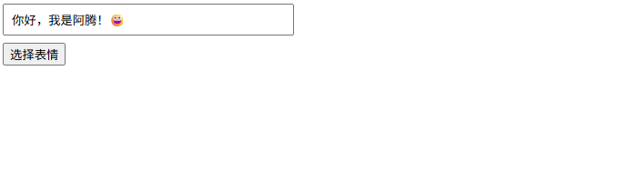

# emoji-picker-element

一款适用于现代网页的轻量级表情符号选择器。

- [官网地址](https://github.com/nolanlawson/emoji-picker-element)


## 基础配置

**安装依赖**

```
pnpm add emoji-picker-element@1.28.1
```


## 使用示例

### 基本使用

```vue
<template>
  <div class="emoji-container">
    <input
        v-model="content"
        type="text"
        placeholder="输入内容..."
        class="input"
    />

    <button @click="togglePicker" class="btn">
      选择表情
    </button>

    <emoji-picker
        v-show="showPicker"
        @emoji-click="onEmojiClick"
        class="picker"
    />
  </div>
</template>

<script setup lang="ts">
import { ref } from 'vue';

const content = ref<string>('');
const showPicker = ref<boolean>(false);

const togglePicker = () => {
  showPicker.value = !showPicker.value;
};

const onEmojiClick = (event: any) => {
  const emoji = event.detail.unicode;
  content.value += emoji;
  showPicker.value = false;
};
</script>

<style scoped>
.emoji-container {
  position: relative;
  width: 300px;
}

.input {
  width: 100%;
  padding: 8px;
}

.btn {
  margin-top: 8px;
}

.picker {
  position: absolute;
  top: 70px;
  left: 0;
  z-index: 999;
}
</style>
```



### 插入到光标位置

```vue
<template>
  <div>
    <textarea
        ref="textareaRef"
        v-model="content"
        class="textarea"
        placeholder="请输入内容..."
    />
    <emoji-picker @emoji-click="onEmojiClick" />
  </div>
</template>

<script setup lang="ts">
import { ref } from 'vue';

const content = ref('');
const textareaRef = ref<HTMLTextAreaElement>();

const onEmojiClick = (event: any) => {
  const emoji = event.detail.unicode;
  const textarea = textareaRef.value;
  if (!textarea) {
    content.value += emoji;
    return;
  }

  const start = textarea.selectionStart;
  const end = textarea.selectionEnd;

  content.value =
      content.value.slice(0, start) +
      emoji +
      content.value.slice(end);

  // 重新设置光标位置
  requestAnimationFrame(() => {
    textarea.selectionStart = textarea.selectionEnd = start + emoji.length;
    textarea.focus();
  });
};
</script>
```


### 组件封装

`src/components/EmojiInput.vue`

```vue
<template>
  <div class="emoji-input">
    <input
        :value="modelValue"
        @input="onInput"
        class="input"
    />
    <button @click="show = !show" class="btn">😀</button>
    <emoji-picker
        v-show="show"
        @emoji-click="onEmojiClick"
        class="picker"
    />
  </div>
</template>

<script setup lang="ts">
import { ref } from 'vue';

const props = defineProps<{
  modelValue: string;
}>();

const emit = defineEmits<{
  (e: 'update:modelValue', value: string): void;
}>();

const show = ref(false);

const onInput = (e: Event) => {
  const value = (e.target as HTMLInputElement).value;
  emit('update:modelValue', value);
};

const onEmojiClick = (event: any) => {
  const emoji = event.detail.unicode;
  emit('update:modelValue', props.modelValue + emoji);
  show.value = false;
};
</script>

<style scoped>
.emoji-input {
  position: relative;
  display: flex;
  gap: 6px;
}

.input {
  flex: 1;
  padding: 6px 8px;
}

.btn {
  cursor: pointer;
}

.picker {
  position: absolute;
  top: 40px;
  right: 0;
  z-index: 999;
}
</style>
```

使用示例

```vue
<template>
  <div class="page">
    <div class="card">
      <h3 class="title">Emoji 输入示例</h3>

      <EmojiInput v-model="content" />

      <p class="label">当前内容：</p>
      <div class="preview">
        {{ content }}
      </div>
    </div>
  </div>
</template>

<script setup lang="ts">
import { ref } from 'vue';
import EmojiInput from '@/components/EmojiInput.vue';

const content = ref<string>('');
</script>

<style scoped>
.page {
  width: 100%;
  height: 100vh;
  display: flex;
  justify-content: center;
  align-items: center;
  background: #f5f7fa;
}

.card {
  width: 360px;
  padding: 20px;
  background: #ffffff;
  border-radius: 8px;
  box-shadow: 0 4px 12px rgba(0, 0, 0, 0.08);
}

.title {
  margin-bottom: 12px;
  font-size: 16px;
  font-weight: 600;
  text-align: center;
}

.label {
  margin-top: 12px;
  font-size: 14px;
  color: #606266;
}

.preview {
  margin-top: 6px;
  padding: 8px;
  border: 1px solid #dcdfe6;
  border-radius: 4px;
  min-height: 32px;
  background: #fafafa;
  word-break: break-all;
}
</style>
```

