# 自定义指令


## 输入框自动聚焦

**功能描述**

**输入框自动聚焦**：页面渲染时，指定输入框自动获取焦点，常用于表单初始化。

------

1️⃣ 自定义指令定义（`v-focus`）

```ts
// src/directives/focus.ts
import type { Directive } from 'vue'

/**
 * v-focus 指令
 * 用法：<el-input v-focus />
 * 页面渲染后，元素自动获得焦点
 */
const focus: Directive = {
  // 元素挂载完成后触发
  mounted(el: HTMLElement) {
    // 如果是 input 或 textarea，直接 focus
    if (el instanceof HTMLInputElement || el instanceof HTMLTextAreaElement) {
      el.focus()
    } else {
      // 如果是自定义组件（如 ElementPlus Input），尝试查找 input 并 focus
      const input = el.querySelector('input') as HTMLInputElement
      if (input) input.focus()
    }
  }
}

export default focus
```

------

2️⃣ 在全局注册指令

```ts
// src/main.ts
import { createApp } from 'vue'
import App from './App.vue'
import ElementPlus from 'element-plus'
import 'element-plus/dist/index.css'

import focusDirective from './directives/focus'

const app = createApp(App)

app.use(ElementPlus)

// 全局注册指令 v-focus
app.directive('focus', focusDirective)

app.mount('#app')
```

------

3️⃣ 使用示例

```vue
<template>
  <div class="form-wrapper">
    <h3>登录表单</h3>
    <!-- 页面加载后，用户名输入框自动聚焦 -->
    <el-form>
      <el-form-item prop="username" label="用户名">
        <el-input v-model="username" v-focus placeholder="请输入用户名" />
      </el-form-item>
      <el-form-item prop="password" label="密码">
        <el-input v-model="password" type="password" placeholder="请输入密码" />
      </el-form-item>
    </el-form>
  </div>
</template>

<script lang="ts" setup>
import {ref} from "vue";

const username = ref('');
const password = ref('');
</script>

<style lang="scss" scoped>
.form-wrapper {
  width: 300px;           // 宽度限制
  margin: 50px auto;      // 居中显示
}
</style>
```

------

✅ **效果**

- 页面加载完成后，用户名输入框会自动获取焦点。
- 兼容原生 input、textarea 以及 ElementPlus Input 组件。

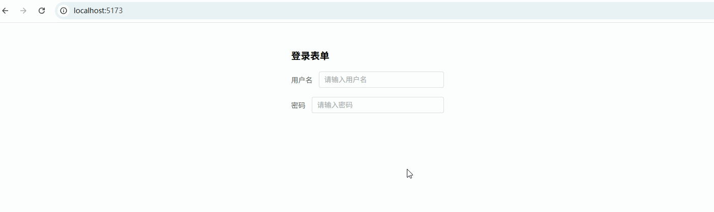

## 权限按钮显示/隐藏

**功能描述**

**权限按钮显示 / 隐藏**：根据用户权限控制按钮或组件是否显示，常用于后台系统的权限控制。

------

1️⃣ 自定义指令定义（`v-permission`）

```ts
// src/directives/permission.ts
import type { Directive } from 'vue'

/**
 * v-permission 指令
 * 用法：v-permission="['user:add']"
 * 如果当前用户没有权限，则移除元素
 */
const permission: Directive = {
  mounted(el: HTMLElement, binding) {
    const userPermissions: string[] = [
      'user:add',
      'user:edit'
    ] // 模拟当前用户权限（实际项目一般来自 Pinia / Vuex）

    const needPermissions: string[] = binding.value // 指令绑定的权限数组

    if (!Array.isArray(needPermissions)) {
      console.error('v-permission value must be an array') // 权限必须是数组
      return
    }

    // 判断是否包含权限
    const hasPermission = needPermissions.some(permission =>
      userPermissions.includes(permission)
    )

    // 如果没有权限，则移除元素
    if (!hasPermission) {
      el.parentNode?.removeChild(el)
    }
  }
}

export default permission
```

------

2️⃣ 全局注册指令

```ts
// src/main.ts
import permissionDirective from './directives/permission'

// 注册权限指令
app.directive('permission', permissionDirective)
```

------

3️⃣ 使用示例

```vue
<template>
  <div class="page">
    <h3>用户管理</h3>

    <!-- 只有 user:add 权限才会显示 -->
    <el-button
      type="primary"
      v-permission="['user:add']"
    >
      新增用户
    </el-button>

    <!-- 只有 user:edit 权限才会显示 -->
    <el-button
      type="warning"
      v-permission="['user:edit']"
    >
      编辑用户
    </el-button>

    <!-- 需要 user:delete 权限（当前用户没有） -->
    <el-button
      type="danger"
      v-permission="['user:delete']"
    >
      删除用户
    </el-button>
  </div>
</template>

<script lang="ts" setup>
// 示例页面
</script>

<style lang="scss" scoped>
.page {
  padding: 20px;        // 页面内边距
  display: flex;        // 使用 flex 布局
  gap: 10px;            // 按钮间距
}
</style>
```

------

✅ **效果**

假设当前用户权限：

```
user:add
user:edit
```

页面最终显示：

```
新增用户
编辑用户
```

不会显示：

```
删除用户
```

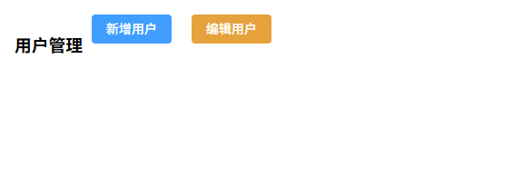

------

## 点击外部关闭弹窗 / 下拉菜单 ！！有问题

**功能描述**

**点击外部关闭弹窗 / 下拉菜单**：当点击组件外部区域时触发回调，常用于 **Dropdown、Select、自定义弹窗、菜单等组件关闭逻辑**。

------

1️⃣ 自定义指令定义（`v-click-outside`）

```ts
// src/directives/clickOutside.ts
import type { Directive, DirectiveBinding } from 'vue'

type Handler = (e: Event) => void

interface ElType extends HTMLElement {
    __clickOutside__?: {
        handler: Handler
        listener: EventListener
    }
}

const clickOutside: Directive = {
    mounted(el: ElType, binding: DirectiveBinding<Handler>) {
        const listener = (event: Event) => {
            const target = event.target as Node

            // 1️⃣ 点击自身内部
            if (el.contains(target)) return

            // 2️⃣ 支持 teleport（关键）
            const path = (event as any).composedPath?.() || []
            if (path.includes(el)) return

            // 执行回调
            binding.value?.(event)
        }

        el.__clickOutside__ = {
            handler: binding.value,
            listener
        }

        // ✅ 用 mousedown，避免 click 时机问题
        document.addEventListener('mousedown', listener)
        document.addEventListener('touchstart', listener)
    },

    updated(el: ElType, binding: DirectiveBinding<Handler>) {
        if (el.__clickOutside__) {
            el.__clickOutside__.handler = binding.value
        }
    },

    unmounted(el: ElType) {
        const instance = el.__clickOutside__
        if (!instance) return

        document.removeEventListener('mousedown', instance.listener)
        document.removeEventListener('touchstart', instance.listener)

        delete el.__clickOutside__
    }
}

export default clickOutside
```

------

2️⃣ 全局注册指令

```ts
// src/main.ts
import clickOutsideDirective from './directives/clickOutside'

// 注册指令
app.directive('click-outside', clickOutsideDirective)
```

------

3️⃣ 使用示例

```vue
<template>
  <div class="page">
    <el-button type="primary" @click="open">
      打开弹窗
    </el-button>

    <div v-if="visible" class="mask">
      <div class="dialog" v-click-outside="close">
        <h3>自定义弹窗</h3>
        <p>点击外部关闭</p>
        <el-button @click="close">关闭</el-button>
      </div>
    </div>
  </div>
</template>

<script lang="ts" setup>
import { ref } from 'vue'

const visible = ref(false)

const open = () => {
  visible.value = true
}

const close = () => {
  visible.value = false
}
</script>

<style scoped>
.mask {
  position: fixed;
  inset: 0;
  background: rgba(0,0,0,0.4);
}

.dialog {
  width: 300px;
  padding: 20px;
  background: #fff;
  margin: 100px auto;
  border-radius: 8px;
}
</style>
```

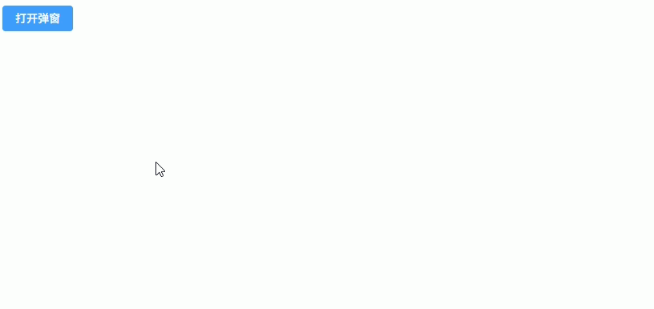

------

## 复制文本到剪贴板

**功能描述**

**复制文本到剪贴板（v-copy）**：点击元素时复制指定文本到剪贴板，并提示复制成功，常用于复制 **ID、订单号、Token、接口地址等**。

------

1️⃣ 自定义指令定义（`v-copy`）

```ts
// src/directives/copy.ts
import type { Directive, DirectiveBinding } from 'vue'
import { ElMessage } from 'element-plus'

/**
 * v-copy 指令
 * 用法：v-copy="text"
 * 点击元素时复制指定文本到剪贴板
 */

const copy: Directive = {
  mounted(el: HTMLElement, binding: DirectiveBinding) {
    // 点击事件
    const handler = async () => {
      const text = binding.value // 要复制的内容

      if (!text) {
        ElMessage.warning('没有可复制的内容') // 没有内容提示
        return
      }

      try {
        // 使用 Clipboard API 复制
        await navigator.clipboard.writeText(text)

        ElMessage.success('复制成功') // 成功提示
      } catch (err) {
        // 兼容旧浏览器方式
        const textarea = document.createElement('textarea')
        textarea.value = text
        textarea.style.position = 'fixed'
        textarea.style.opacity = '0'

        document.body.appendChild(textarea)
        textarea.select()
        document.execCommand('copy')
        document.body.removeChild(textarea)

        ElMessage.success('复制成功')
      }
    }

    // 绑定点击事件
    el.addEventListener('click', handler)

    // 保存事件引用（用于卸载）
    ;(el as any)._copyHandler = handler
  },

  // 组件卸载时移除事件
  unmounted(el: HTMLElement) {
    const handler = (el as any)._copyHandler
    if (handler) {
      el.removeEventListener('click', handler)
    }
  }
}

export default copy
```

------

2️⃣ 全局注册指令

```ts
// src/main.ts
import copyDirective from './directives/copy'

// 注册 v-copy 指令
app.directive('copy', copyDirective)
```

------

3️⃣ 使用示例

```vue
<template>
  <div class="page">
    <h3>复制示例</h3>

    <!-- 点击按钮复制文本 -->
    <el-button
      type="primary"
      v-copy="userId"
    >
      复制用户ID
    </el-button>

    <!-- 点击文本复制 -->
    <div
      class="copy-text"
      v-copy="orderNo"
    >
      订单号：{{ orderNo }}
    </div>
  </div>
</template>

<script lang="ts" setup>
import { ref } from 'vue'

const userId = ref('USER_10001')     // 用户ID
const orderNo = ref('ORDER_20260301') // 订单号
</script>

<style lang="scss" scoped>
.page {
  padding: 20px;           // 页面内边距
  display: flex;           // flex布局
  flex-direction: column;  // 垂直排列
  gap: 16px;               // 元素间距
}

.copy-text {
  cursor: pointer;         // 鼠标手型
  color: #409eff;          // ElementPlus 主色
}
</style>
```

------

✅ **效果**

点击元素：

```
复制用户ID
订单号：ORDER_20260301
```

会自动：

1. 复制文本到剪贴板
2. 弹出提示

```
复制成功
```

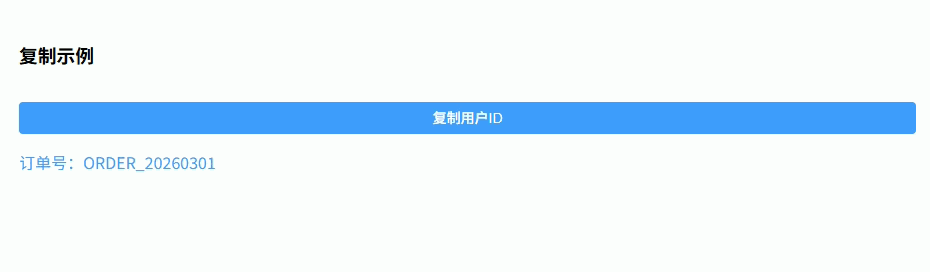

------

## 图片懒加载

**功能描述**

**图片懒加载（v-lazy）**：图片进入可视区域后才加载真实图片，减少页面初始加载资源，提高列表或图片墙性能。

------

1️⃣ 自定义指令定义（`v-lazy`）

```ts
// src/directives/lazy.ts
import type { Directive, DirectiveBinding } from 'vue'

/**
 * v-lazy 指令
 * 用法：v-lazy="imageUrl"
 * 图片进入可视区域时才加载真实图片
 */

const lazy: Directive = {
  mounted(el: HTMLImageElement, binding: DirectiveBinding) {
    const imageUrl = binding.value // 真实图片地址

    // 占位图（可替换为项目中的默认图片）
    el.src =
      'data:image/svg+xml;base64,PHN2ZyB3aWR0aD0iMTAwIiBoZWlnaHQ9IjYwIiB4bWxucz0iaHR0cDovL3d3dy53My5vcmcvMjAwMC9zdmciPjxyZWN0IHdpZHRoPSIxMDAiIGhlaWdodD0iNjAiIGZpbGw9IiNlZWUiIC8+PC9zdmc+' // 占位图

    // 创建 IntersectionObserver 监听元素是否进入视口
    const observer = new IntersectionObserver((entries) => {
      const entry = entries[0]

      // 如果图片进入视口
      if (entry.isIntersecting) {
        el.src = imageUrl // 加载真实图片

        observer.unobserve(el) // 停止监听
      }
    })

    // 开始监听
    observer.observe(el)

    // 保存 observer 用于卸载
    ;(el as any)._lazyObserver = observer
  },

  // 元素卸载时取消监听
  unmounted(el: HTMLImageElement) {
    const observer = (el as any)._lazyObserver
    if (observer) {
      observer.disconnect()
    }
  }
}

export default lazy
```

------

2️⃣ 全局注册指令

```ts
// src/main.ts
import lazyDirective from './directives/lazy'

// 注册 v-lazy 指令
app.directive('lazy', lazyDirective)
```

------

3️⃣ 使用示例

```vue
<template>
  <div class="page">
    <h3>图片懒加载</h3>

    <div class="image-list">
      <!-- 图片进入可视区域才加载 -->
      
    </div>
  </div>
</template>

<script lang="ts" setup>
// 生成 100 张图片
const images = Array.from({ length: 100 }, (_, index) => {
  return `https://picsum.photos/300/200?${index + 1}`
})
</script>

<style lang="scss" scoped>
.page {
  padding: 20px;              // 页面内边距
}

.image-list {
  display: grid;              // 使用 grid 布局
  grid-template-columns: repeat(3, 1fr); // 三列布局
  gap: 16px;                  // 图片间距
}

.image {
  width: 100%;                // 图片宽度
  height: 200px;              // 图片高度
  object-fit: cover;          // 图片裁剪方式
  border-radius: 6px;         // 圆角
}
</style>
```

------

✅ **效果**

页面初始状态：

```
只加载占位图
```

当图片进入视口：

```
才加载真实图片
```

优点：

- 减少首屏请求
- 提升列表性能
- 常用于 **商品列表 / 图片墙 / 瀑布流**


---

## 防抖输入

**功能描述**

**防抖输入（v-debounce）**：输入事件触发时延迟执行函数，在指定时间内如果再次触发则重新计时，常用于 **搜索框 / 远程查询 / 自动请求接口**，避免频繁请求。

------

1️⃣ 自定义指令定义（`v-debounce`）

```ts
// src/directives/debounce.ts
import type { Directive, DirectiveBinding } from 'vue'

/**
 * v-debounce 指令
 * 用法：v-debounce="handler"
 * 可传参数：v-debounce:500="handler" （500ms 防抖）
 */

const debounce: Directive = {
  mounted(el: HTMLElement, binding: DirectiveBinding) {
    const delay = Number(binding.arg) || 300 // 防抖时间，默认300ms
    let timer: number | null = null          // 定时器

    const handler = (event: Event) => {
      if (timer) {
        clearTimeout(timer) // 清除上一次定时器
      }

      timer = window.setTimeout(() => {
        binding.value(event) // 执行绑定方法
      }, delay)
    }

    // 查找 input（兼容 ElementPlus Input）
    const input =
      el.tagName === 'INPUT'
        ? el
        : (el.querySelector('input') as HTMLInputElement)

    if (input) {
      input.addEventListener('input', handler) // 监听输入事件
      ;(el as any)._debounceHandler = handler   // 保存事件引用
    }
  },

  // 卸载时移除事件
  unmounted(el: HTMLElement) {
    const handler = (el as any)._debounceHandler
    const input =
      el.tagName === 'INPUT'
        ? el
        : (el.querySelector('input') as HTMLInputElement)

    if (input && handler) {
      input.removeEventListener('input', handler)
    }
  }
}

export default debounce
```

------

2️⃣ 全局注册指令

```ts
// src/main.ts
import debounceDirective from './directives/debounce'

// 注册 v-debounce
app.directive('debounce', debounceDirective)
```

------

3️⃣ 使用示例

```vue
<template>
  <div class="page">
    <h3>防抖搜索</h3>

    <!-- 输入停止500ms后才触发搜索 -->
    <el-input
      v-model="keyword"
      placeholder="请输入关键字搜索"
      v-debounce:500="handleSearch"
    />

    <div class="result">
      搜索关键字：{{ keyword }}
    </div>
  </div>
</template>

<script lang="ts" setup>
import { ref } from 'vue'

const keyword = ref('') // 搜索关键字

// 搜索方法
const handleSearch = (event: Event) => {
  const target = event.target as HTMLInputElement
  keyword.value = target.value

  console.log('执行搜索:', keyword.value) // 模拟接口请求
}
</script>

<style lang="scss" scoped>
.page {
  padding: 20px;           // 页面内边距
  width: 300px;            // 宽度
}

.result {
  margin-top: 16px;        // 上边距
  color: #666;             // 文本颜色
}
</style>
```

------

✅ **效果**

用户输入：

```
a
ab
abc
abcd
```

如果 **500ms 内持续输入**：

```
只触发一次搜索
```

避免：

```
输入一次请求一次接口
```

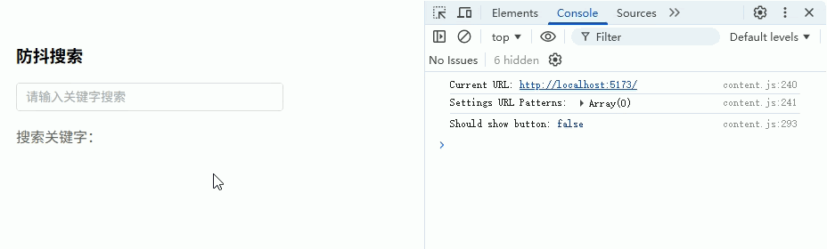

------

## 节流点击

**功能描述**

**节流点击（v-throttle）**：限制事件在指定时间内只执行一次，常用于 **按钮防重复提交 / 防止接口重复调用 / 高频点击控制**。

------

1️⃣ 自定义指令定义（`v-throttle`）

```ts
// src/directives/throttle.ts
import type { Directive, DirectiveBinding } from 'vue'

/**
 * v-throttle 指令
 * 用法：v-throttle="handler"
 * 可传参数：v-throttle:1000="handler" （1000ms 节流）
 */

const throttle: Directive = {
  mounted(el: HTMLElement, binding: DirectiveBinding) {
    const delay = Number(binding.arg) || 1000 // 节流时间，默认1000ms
    let lastTime = 0                           // 上次触发时间

    const handler = (event: Event) => {
      const now = Date.now()                   // 当前时间

      // 如果未到节流时间则不执行
      if (now - lastTime < delay) {
        return
      }

      lastTime = now                           // 更新触发时间
      binding.value(event)                     // 执行绑定方法
    }

    // 绑定点击事件
    el.addEventListener('click', handler)

    // 保存 handler 用于卸载
    ;(el as any)._throttleHandler = handler
  },

  // 组件卸载时移除事件
  unmounted(el: HTMLElement) {
    const handler = (el as any)._throttleHandler
    if (handler) {
      el.removeEventListener('click', handler)
    }
  }
}

export default throttle
```

------

2️⃣ 全局注册指令

```ts
// src/main.ts
import throttleDirective from './directives/throttle'

// 注册 v-throttle
app.directive('throttle', throttleDirective)
```

------

3️⃣ 使用示例

```vue
<template>
  <div class="page">
    <h3>按钮节流</h3>

    <!-- 1秒内只允许点击一次 -->
    <el-button
      type="primary"
      v-throttle:1000="handleSubmit"
    >
      提交订单
    </el-button>

    <div class="log">
      点击次数：{{ count }}
    </div>
  </div>
</template>

<script lang="ts" setup>
import { ref } from 'vue'

const count = ref(0) // 点击次数

// 模拟提交接口
const handleSubmit = () => {
  count.value++

  console.log('提交接口请求')
}
</script>

<style lang="scss" scoped>
.page {
  padding: 20px;          // 页面内边距
  display: flex;          // flex布局
  flex-direction: column; // 垂直排列
  gap: 16px;              // 元素间距
}

.log {
  color: #666;            // 文本颜色
}
</style>
```

------

✅ **效果**

用户快速点击：

```
点击 10 次
```

实际执行：

```
1 秒内只执行 1 次
```

适用于：

- **表单提交**
- **支付按钮**
- **分页按钮**
- **接口触发按钮**

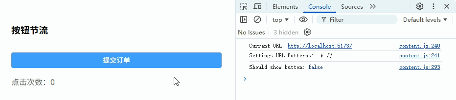

------

## 页面水印

**功能描述**

**页面水印（v-watermark）**：在页面或容器上添加半透明文字水印，常用于 **后台系统、防截图、防数据泄露**。

------

1️⃣ 自定义指令定义（`v-watermark`）

```ts
// src/directives/watermark.ts
import type { Directive, DirectiveBinding } from 'vue'

/**
 * v-watermark 指令
 * 用法：v-watermark="'内部资料'"
 * 或：v-watermark="{ text: 'admin', color: '#000', size: 16 }"
 */

interface WatermarkOptions {
  text: string       // 水印文字
  color?: string     // 文字颜色
  size?: number      // 字体大小
  rotate?: number    // 旋转角度
  gap?: number       // 水印间距
}

const watermark: Directive = {
  mounted(el: HTMLElement, binding: DirectiveBinding) {
    const options: WatermarkOptions =
      typeof binding.value === 'string'
        ? { text: binding.value }
        : binding.value

    const text = options.text || 'watermark'   // 默认水印
    const color = options.color || 'rgba(0,0,0,0.15)' // 颜色
    const size = options.size || 16            // 字体大小
    const rotate = options.rotate || -20       // 旋转角度
    const gap = options.gap || 200             // 水印间距

    // 创建 canvas
    const canvas = document.createElement('canvas')
    const ctx = canvas.getContext('2d')!

    canvas.width = gap
    canvas.height = gap

    // 设置水印样式
    ctx.fillStyle = color
    ctx.font = `${size}px sans-serif`
    ctx.rotate((rotate * Math.PI) / 180)
    ctx.fillText(text, 20, gap / 2)

    // 生成水印图片
    const base64 = canvas.toDataURL()

    // 创建水印层
    const watermarkDiv = document.createElement('div')
    watermarkDiv.style.position = 'absolute' // 绝对定位
    watermarkDiv.style.top = '0'
    watermarkDiv.style.left = '0'
    watermarkDiv.style.right = '0'
    watermarkDiv.style.bottom = '0'
    watermarkDiv.style.pointerEvents = 'none' // 不影响点击
    watermarkDiv.style.backgroundImage = `url(${base64})`
    watermarkDiv.style.backgroundRepeat = 'repeat'

    // 确保父元素可定位
    if (getComputedStyle(el).position === 'static') {
      el.style.position = 'relative'
    }

    el.appendChild(watermarkDiv) // 添加水印层

    ;(el as any)._watermark = watermarkDiv
  },

  // 卸载时移除水印
  unmounted(el: HTMLElement) {
    const watermarkDiv = (el as any)._watermark
    if (watermarkDiv) {
      el.removeChild(watermarkDiv)
    }
  }
}

export default watermark
```

------

2️⃣ 全局注册指令

```ts
// src/main.ts
import watermarkDirective from './directives/watermark'

// 注册 v-watermark
app.directive('watermark', watermarkDirective)
```

------

3️⃣ 使用示例

```vue
<template>
  <div
    class="page"
    v-watermark="{
      text: 'Admin 2026',
      color: 'rgba(0,0,0,0.1)',
      size: 18,
      rotate: -25
    }"
  >
    <h2>用户数据管理</h2>

    <el-table :data="tableData">
      <el-table-column prop="name" label="姓名" />
      <el-table-column prop="email" label="邮箱" />
    </el-table>
  </div>
</template>

<script lang="ts" setup>
const tableData = [
  { name: 'Tom', email: 'tom@test.com' },
  { name: 'Jerry', email: 'jerry@test.com' }
] // 模拟数据
</script>

<style lang="scss" scoped>
.page {
  padding: 20px;     // 页面内边距
  min-height: 400px; // 最小高度
  background: #fff;  // 背景色
}
</style>
```

------

✅ **效果**

页面会出现类似：

```
Admin 2026
Admin 2026
Admin 2026
```

斜向平铺的透明水印。

特点：

- 不影响点击（`pointer-events: none`）
- 支持自定义
  - 文本
  - 颜色
  - 字体大小
  - 旋转角度
- 可用于 **整个页面 / 表格区域 / 卡片区域**

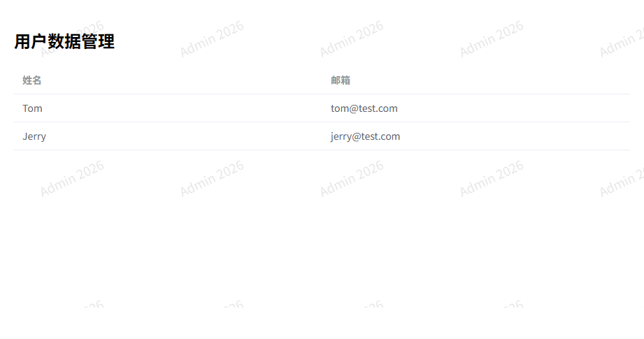

------

## 拖拽移动元素

**功能描述**

**拖拽移动元素（v-draggable）**：允许用户拖拽元素改变位置，常用于 **可拖拽 Dialog / 卡片 / 浮动工具栏 / 自定义面板**。

------

1️⃣ 自定义指令定义（`v-draggable`）

```ts
// src/directives/draggable.ts
import type { Directive } from 'vue'

/**
 * v-draggable 指令
 * 用法：v-draggable
 * 让元素支持鼠标拖拽移动
 */

const draggable: Directive = {
  mounted(el: HTMLElement) {
    let startX = 0       // 鼠标按下时 X 坐标
    let startY = 0       // 鼠标按下时 Y 坐标
    let startLeft = 0    // 元素初始 left
    let startTop = 0     // 元素初始 top

    // 鼠标按下
    const handleMouseDown = (event: MouseEvent) => {
      startX = event.clientX
      startY = event.clientY

      const rect = el.getBoundingClientRect() // 获取当前位置

      startLeft = rect.left
      startTop = rect.top

      document.addEventListener('mousemove', handleMouseMove)
      document.addEventListener('mouseup', handleMouseUp)
    }

    // 鼠标移动
    const handleMouseMove = (event: MouseEvent) => {
      const moveX = event.clientX - startX // 移动距离X
      const moveY = event.clientY - startY // 移动距离Y

      const left = startLeft + moveX
      const top = startTop + moveY

      el.style.position = 'fixed' // 固定定位
      el.style.left = `${left}px`
      el.style.top = `${top}px`
    }

    // 鼠标松开
    const handleMouseUp = () => {
      document.removeEventListener('mousemove', handleMouseMove)
      document.removeEventListener('mouseup', handleMouseUp)
    }

    // 监听鼠标按下
    el.addEventListener('mousedown', handleMouseDown)

    // 保存事件引用
    ;(el as any)._dragMouseDown = handleMouseDown
  },

  // 卸载时移除事件
  unmounted(el: HTMLElement) {
    const handler = (el as any)._dragMouseDown
    if (handler) {
      el.removeEventListener('mousedown', handler)
    }
  }
}

export default draggable
```

------

2️⃣ 全局注册指令

```ts
// src/main.ts
import draggableDirective from './directives/draggable'

// 注册 v-draggable
app.directive('draggable', draggableDirective)
```

------

3️⃣ 使用示例

```vue
<template>
  <div class="page">
    <h3>拖拽卡片示例</h3>

    <!-- 可拖拽卡片 -->
    <div class="card" v-draggable>
      <div class="card-title">拖拽卡片</div>
      <div class="card-content">
        按住卡片即可拖动
      </div>
    </div>
  </div>
</template>

<script lang="ts" setup>
// 示例页面
</script>

<style lang="scss" scoped>
.page {
  padding: 40px;          // 页面内边距
}

.card {
  width: 240px;           // 卡片宽度
  padding: 16px;          // 内边距
  border-radius: 8px;     // 圆角
  background: #fff;       // 背景色
  border: 1px solid #ebeef5; // 边框
  box-shadow: 0 2px 8px rgba(0,0,0,0.1); // 阴影
  cursor: move;           // 鼠标拖拽样式
}

.card-title {
  font-weight: bold;      // 标题加粗
  margin-bottom: 10px;    // 下间距
}

.card-content {
  color: #666;            // 内容颜色
}
</style>
```

------

✅ **效果**

用户：

```
按住卡片
拖动鼠标
```

卡片会：

```
跟随鼠标移动
```

常见应用：

- **拖拽 Dialog**
- **拖拽卡片**
- **浮动工具栏**
- **看板布局组件**

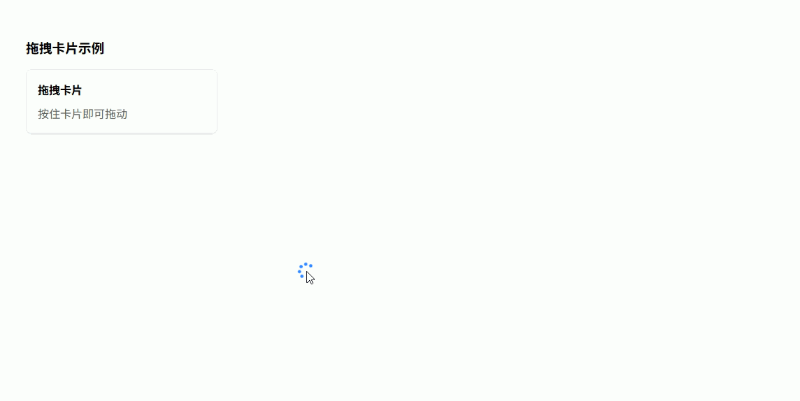

------

## 元素进入视口触发动画

**功能描述**

**元素进入视口触发动画（v-intersect）**：当元素进入可视区域时触发回调或添加动画类，常用于 **滚动动画 / 懒加载组件 / 数据加载触发**。

------

1️⃣ 自定义指令定义（`v-intersect`）

```ts
// src/directives/intersect.ts
import type { Directive, DirectiveBinding } from 'vue'

/**
 * v-intersect 指令
 * 用法：v-intersect="handler"
 * 或：v-intersect="{ handler, once: true }"
 */

interface IntersectOptions {
    handler?: () => void // 进入视口回调
    once?: boolean       // 是否只触发一次
}

const intersect: Directive = {
    mounted(el: HTMLElement, binding: DirectiveBinding) {
        const options: IntersectOptions =
            typeof binding.value === 'function'
                ? { handler: binding.value }
                : binding.value

        const once = options.once ?? true // 默认只触发一次

        const observer = new IntersectionObserver((entries) => {
            const entry = entries[0]

            // 元素进入视口
            if (entry?.isIntersecting) {
                // 执行回调
                options.handler?.()

                // 添加动画类
                el.classList.add('intersect-active')

                // 如果只触发一次则取消监听
                if (once) {
                    observer.unobserve(el)
                }
            }
        })

        // 开始监听
        observer.observe(el)

        // 保存 observer
        ;(el as any)._intersectObserver = observer
    },

    // 卸载时取消监听
    unmounted(el: HTMLElement) {
        const observer = (el as any)._intersectObserver
        if (observer) {
            observer.disconnect()
        }
    }
}

export default intersect
```

------

2️⃣ 全局注册指令

```ts
// src/main.ts
import intersectDirective from './directives/intersect'

// 注册 v-intersect
app.directive('intersect', intersectDirective)
```

------

3️⃣ 使用示例

```vue
<template>
  <div class="page">
    <h2>滚动触发动画示例</h2>

    <div
      v-for="item in 6"
      :key="item"
      class="card"
      v-intersect="handleVisible"
    >
      卡片 {{ item }}
    </div>
  </div>
</template>

<script lang="ts" setup>
const handleVisible = () => {
  console.log('元素进入视口') // 可用于加载数据或触发逻辑
}
</script>

<style lang="scss" scoped>
.page {
  padding: 20px;              // 页面内边距
  display: flex;              // flex布局
  flex-direction: column;     // 垂直排列
  gap: 40px;                  // 卡片间距
}

.card {
  height: 120px;              // 卡片高度
  background: #f5f7fa;        // 背景色
  border-radius: 8px;         // 圆角
  display: flex;              // flex布局
  align-items: center;        // 垂直居中
  justify-content: center;    // 水平居中
  font-size: 20px;            // 字体大小

  opacity: 0;                 // 初始透明
  transform: translateY(40px); // 初始位移
  transition: all 0.6s ease;  // 动画过渡
}

.intersect-active {
  opacity: 1;                 // 显示
  transform: translateY(0);   // 回到原位置
}
</style>
```

------

✅ **效果**

页面滚动时：

```
卡片进入视口
```

会触发：

```
淡入 + 上移动画
```

同时执行：

```
handler 回调
```

常见用途：

- **滚动动画**
- **数据懒加载**
- **组件延迟渲染**
- **统计曝光**

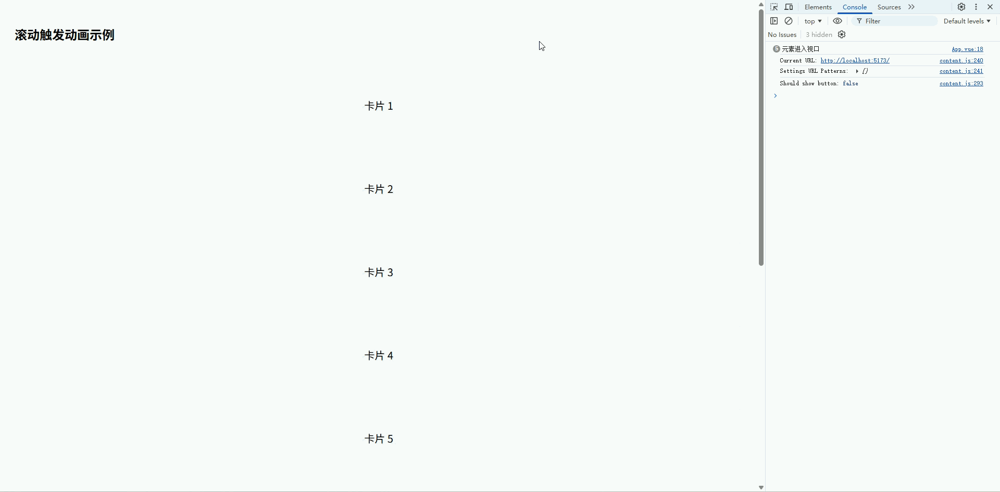

------

## 滚动到底部自动加载

**功能描述**

**滚动到底部自动加载（v-scroll-bottom）**：当容器滚动到底部时触发回调函数，常用于 **无限滚动列表 / 聊天记录加载 / 表格分页加载更多**。

------

1️⃣ 自定义指令定义（`v-scroll-bottom`）

```ts
// src/directives/scrollBottom.ts
import type { Directive, DirectiveBinding } from 'vue'

/**
 * v-scroll-bottom 指令
 * 用法：v-scroll-bottom="handler"
 * 当滚动到底部时触发 handler
 */

const scrollBottom: Directive = {
  mounted(el: HTMLElement, binding: DirectiveBinding) {
    const handler = () => {
      const scrollTop = el.scrollTop           // 当前滚动距离
      const clientHeight = el.clientHeight     // 容器可视高度
      const scrollHeight = el.scrollHeight     // 内容总高度

      // 判断是否滚动到底部
      if (scrollTop + clientHeight >= scrollHeight - 2) {
        binding.value() // 执行回调函数
      }
    }

    // 监听滚动事件
    el.addEventListener('scroll', handler)

    // 保存事件引用
    ;(el as any)._scrollBottomHandler = handler
  },

  // 卸载时移除事件
  unmounted(el: HTMLElement) {
    const handler = (el as any)._scrollBottomHandler
    if (handler) {
      el.removeEventListener('scroll', handler)
    }
  }
}

export default scrollBottom
```

------

2️⃣ 全局注册指令

```ts
// src/main.ts
import scrollBottomDirective from './directives/scrollBottom'

// 注册 v-scroll-bottom
app.directive('scroll-bottom', scrollBottomDirective)
```

------

3️⃣ 使用示例

```vue
<template>
  <div class="page">
    <h3>无限滚动列表示例</h3>

    <!-- 滚动容器 -->
    <div
      class="list-container"
      v-scroll-bottom="loadMore"
    >
      <div
        v-for="item in list"
        :key="item"
        class="list-item"
      >
        列表项 {{ item }}
      </div>

      <div class="loading" v-if="loading">
        加载中...
      </div>
    </div>
  </div>
</template>

<script lang="ts" setup>
import { ref } from 'vue'

const list = ref<number[]>([]) // 列表数据
const loading = ref(false)     // 加载状态
let page = 1                   // 当前页

// 初始化数据
for (let i = 1; i <= 20; i++) {
  list.value.push(i)
}

// 加载更多数据
const loadMore = () => {
  if (loading.value) return // 防止重复加载

  loading.value = true

  setTimeout(() => {
    const start = page * 20

    for (let i = 1; i <= 20; i++) {
      list.value.push(start + i)
    }

    page++
    loading.value = false
  }, 800)
}
</script>

<style lang="scss" scoped>
.page {
  padding: 20px;              // 页面内边距
}

.list-container {
  height: 300px;              // 固定高度
  overflow-y: auto;           // 启用滚动
  border: 1px solid #ebeef5;  // 边框
  border-radius: 6px;         // 圆角
}

.list-item {
  padding: 12px;              // 内边距
  border-bottom: 1px solid #f0f0f0; // 分割线
}

.loading {
  padding: 12px;              // 内边距
  text-align: center;         // 居中
  color: #999;                // 文本颜色
}
</style>
```

------

✅ **效果**

滚动列表：

```
滚动到底部
```

自动触发：

```
loadMore()
```

实现：

```
无限加载列表数据
```

常见应用：

- **商品列表**
- **聊天记录**
- **数据表格分页**
- **消息列表**

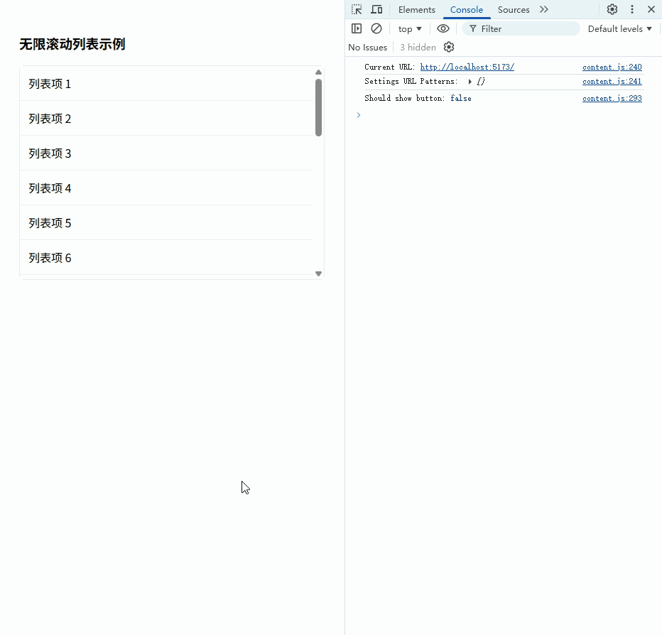

------

## 监听元素尺寸变化

**功能描述**

**元素尺寸变化监听（v-resize）**：监听元素大小变化并触发回调，常用于 **表格 / 图表 / 卡片布局自适应**，避免窗口缩放或容器变化导致布局错乱。

------

1️⃣ 自定义指令定义（`v-resize`）

```ts
// src/directives/resize.ts
import type { Directive, DirectiveBinding } from 'vue'

/**
 * v-resize 指令
 * 用法：v-resize="handler"
 * 当元素尺寸变化时触发 handler
 */

const resize: Directive = {
  mounted(el: HTMLElement, binding: DirectiveBinding) {
    // 创建 ResizeObserver
    const observer = new ResizeObserver(() => {
      binding.value() // 执行回调
    })

    observer.observe(el) // 开始观察

    // 保存 observer 引用
    ;(el as any)._resizeObserver = observer
  },

  // 卸载时断开观察
  unmounted(el: HTMLElement) {
    const observer = (el as any)._resizeObserver
    if (observer) {
      observer.disconnect()
    }
  }
}

export default resize
```

------

2️⃣ 全局注册指令

```ts
// src/main.ts
import resizeDirective from './directives/resize'

// 注册 v-resize
app.directive('resize', resizeDirective)
```

------

3️⃣ 使用示例

```vue
<template>
  <div class="page">
    <h3>元素尺寸变化监听</h3>

    <!-- 可调整大小的容器 -->
    <div
      class="resizable-box"
      v-resize="handleResize"
    >
      容器宽度：{{ width }}px
    </div>
  </div>
</template>

<script lang="ts" setup>
import { ref, onMounted } from 'vue'

const width = ref(0)
const height = ref(0)

const handleResize = () => {
  const box = document.querySelector('.resizable-box') as HTMLElement
  width.value = box.offsetWidth
  height.value = box.offsetHeight

  console.log('尺寸变化:', width.value, height.value)
}

onMounted(() => {
  handleResize() // 初始化尺寸
})
</script>

<style lang="scss" scoped>
.page {
  padding: 20px;           // 页面内边距
}

.resizable-box {
  width: 50%;               // 初始宽度
  height: 150px;            // 初始高度
  background: #f0f2f5;      // 背景色
  border: 1px solid #dcdfe6; // 边框
  resize: both;             // 可调整大小
  overflow: auto;           // 显示滚动条
  padding: 10px;            // 内边距
}
</style>
```

------

✅ **效果**

- 用户拖动右下角调整元素大小
- 指令监听变化触发 `handleResize`
- 可用于实时计算布局、图表大小或表格自适应

常见应用：

- **表格列宽自动计算**
- **图表容器 resize 触发重绘**
- **卡片或浮动面板大小自适应**

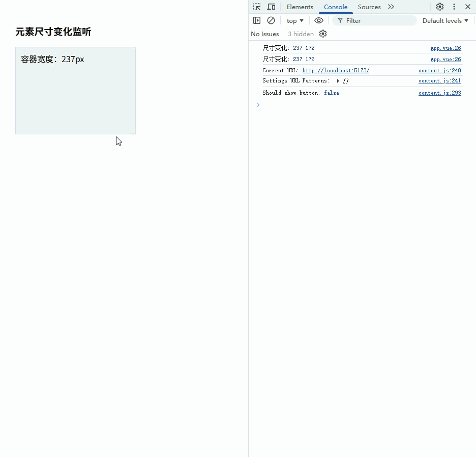

------

## 统一 Hover 交互效果

**功能描述**

**统一 Hover 交互效果（v-hover）**：给元素添加统一的 Hover 样式或动画，常用于 **按钮、表格行、卡片、列表项**，避免每处都写重复样式。

------

1️⃣ 自定义指令定义（`v-hover`）

```ts
// src/directives/hover.ts
import type { Directive, DirectiveBinding } from 'vue'

/**
 * v-hover 指令
 * 用法：v-hover
 * 可选参数：v-hover="{ className: 'hover-effect' }"
 */

interface HoverOptions {
  className?: string // 自定义 hover 类名
}

const hover: Directive = {
  mounted(el: HTMLElement, binding: DirectiveBinding) {
    const options: HoverOptions =
      typeof binding.value === 'object' ? binding.value : {}

    const className = options.className || 'hover-active'

    // 鼠标移入
    const handleMouseEnter = () => {
      el.classList.add(className)
    }

    // 鼠标移出
    const handleMouseLeave = () => {
      el.classList.remove(className)
    }

    el.addEventListener('mouseenter', handleMouseEnter)
    el.addEventListener('mouseleave', handleMouseLeave)

    // 保存引用用于卸载
    ;(el as any)._hoverEnter = handleMouseEnter
    ;(el as any)._hoverLeave = handleMouseLeave
  },

  unmounted(el: HTMLElement) {
    const enter = (el as any)._hoverEnter
    const leave = (el as any)._hoverLeave
    if (enter && leave) {
      el.removeEventListener('mouseenter', enter)
      el.removeEventListener('mouseleave', leave)
    }
  }
}

export default hover
```

------

2️⃣ 全局注册指令

```ts
// src/main.ts
import hoverDirective from './directives/hover'

app.directive('hover', hoverDirective)
```

------

3️⃣ 使用示例

```vue
<template>
  <div class="page">
    <h3>Hover 效果示例</h3>

    <el-button type="primary" v-hover>
      按钮 Hover
    </el-button>

    <div class="card" v-hover>
      卡片 Hover
    </div>
  </div>
</template>

<script lang="ts" setup>
// 示例页面，无逻辑
</script>

<style lang="scss" scoped>
.page {
  padding: 20px;
  display: flex;
  flex-direction: column;
  gap: 20px;
}

.card {
  width: 200px;
  padding: 20px;
  background: #fff;
  border: 1px solid #ebeef5;
  border-radius: 6px;
  transition: all 0.3s ease;
}

/* 默认 hover 效果 */
.hover-active {
  transform: translateY(-4px);
  box-shadow: 0 4px 12px rgba(0,0,0,0.15);
}
</style>
```

------

✅ **效果**

- 鼠标移入按钮或卡片
- 添加统一 Hover 样式：上浮 + 阴影
- 鼠标移出时移除样式

优势：

- 统一管理项目 Hover 样式
- 避免重复写 CSS
- 支持自定义类名

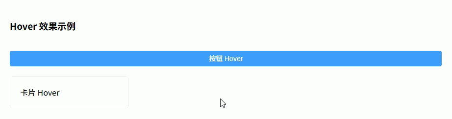

------

## 输入限制指令

**功能描述**

**输入限制（v-input-limit）**：限制输入框内容类型和长度，常用于 **数字、金额、字符长度限制、表单输入规范化**。

------

1️⃣ 自定义指令定义（`v-input-limit`）

```ts
// src/directives/inputLimit.ts
import type { Directive, DirectiveBinding } from 'vue'

/**
 * v-input-limit 指令
 * 用法：
 * <input v-input-limit="{ type: 'number', max: 5 }" />
 * type: 'number' | 'float' | 'text' | 'length'
 * max: 最大长度或最大数值
 */

interface InputLimitOptions {
  type?: 'number' | 'float' | 'text' | 'length'
  max?: number
}

const inputLimit: Directive = {
  mounted(el: HTMLElement, binding: DirectiveBinding) {
    const options: InputLimitOptions = binding.value || {}

    const input =
      el.tagName === 'INPUT'
        ? (el as HTMLInputElement)
        : (el.querySelector('input') as HTMLInputElement)

    if (!input) return

    const handleInput = () => {
      let value = input.value

      switch (options.type) {
        case 'number':
          value = value.replace(/[^\d]/g, '') // 只允许整数
          break
        case 'float':
          value = value
            .replace(/[^\d.]/g, '')       // 允许数字和小数点
            .replace(/\.{2,}/g, '.')      // 多个点替换为一个
            .replace(/^(\d+)\.(\d{0,2}).*$/, '$1.$2') // 保留两位小数
          break
        case 'length':
          if (options.max) {
            value = value.slice(0, options.max)
          }
          break
        case 'text':
        default:
          break
      }

      input.value = value
      input.dispatchEvent(new Event('input')) // 保证 v-model 同步
    }

    input.addEventListener('input', handleInput)
    ;(el as any)._inputLimitHandler = handleInput
  },

  unmounted(el: HTMLElement) {
    const input =
      el.tagName === 'INPUT'
        ? (el as HTMLInputElement)
        : (el.querySelector('input') as HTMLInputElement)

    const handler = (el as any)._inputLimitHandler
    if (input && handler) {
      input.removeEventListener('input', handler)
    }
  }
}

export default inputLimit
```

------

2️⃣ 全局注册指令

```ts
// src/main.ts
import inputLimitDirective from './directives/inputLimit'

app.directive('input-limit', inputLimitDirective)
```

------

3️⃣ 使用示例

```vue
<template>
  <div class="page">
    <h3>输入限制示例</h3>

    <el-input
      placeholder="只允许整数"
      v-input-limit="{ type: 'number' }"
      v-model="numberValue"
    />

    <el-input
      placeholder="允许浮点数（最多两位小数）"
      v-input-limit="{ type: 'float' }"
      v-model="floatValue"
    />

    <el-input
      placeholder="限制长度 5"
      v-input-limit="{ type: 'length', max: 5 }"
      v-model="textValue"
    />
  </div>
</template>

<script lang="ts" setup>
import { ref } from 'vue'

const numberValue = ref('')
const floatValue = ref('')
const textValue = ref('')
</script>

<style lang="scss" scoped>
.page {
  padding: 20px;
  display: flex;
  flex-direction: column;
  gap: 16px;
}
</style>
```

------

✅ **效果**

- 输入框只允许符合规则的内容
  - 整数
  - 浮点数（保留两位）
  - 最大长度
- 保证 `v-model` 实时同步
- 后台表单常用，避免用户输入非法字符

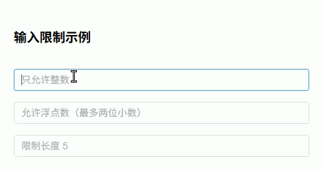

------

