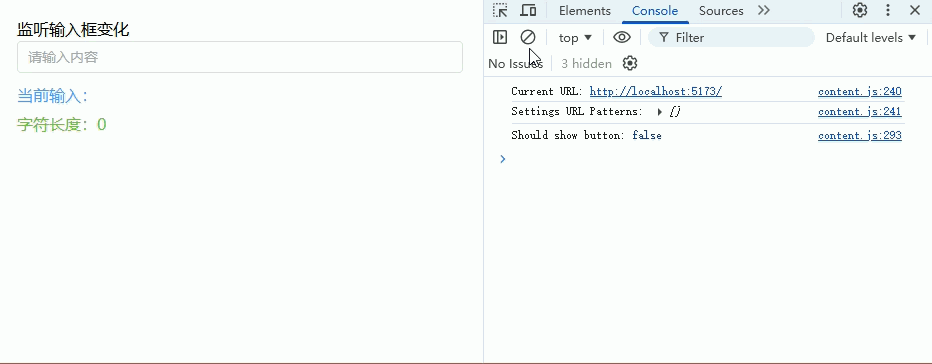
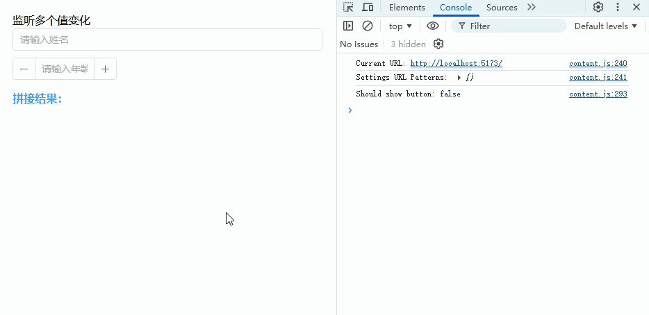
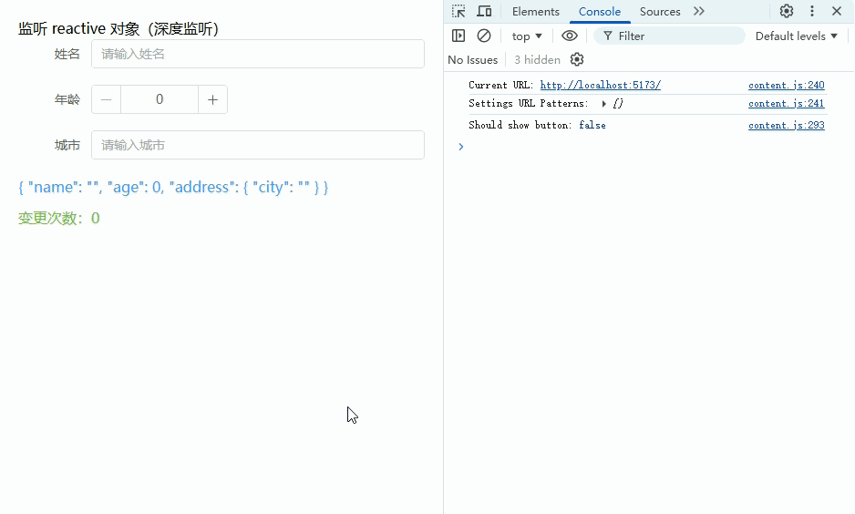
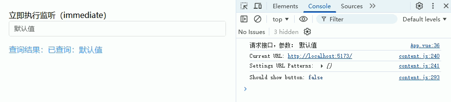
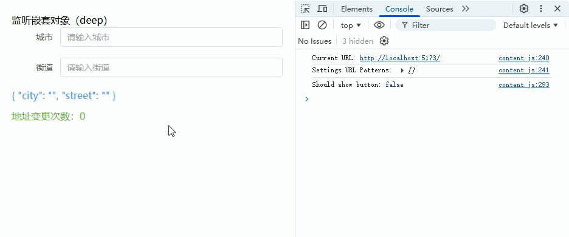
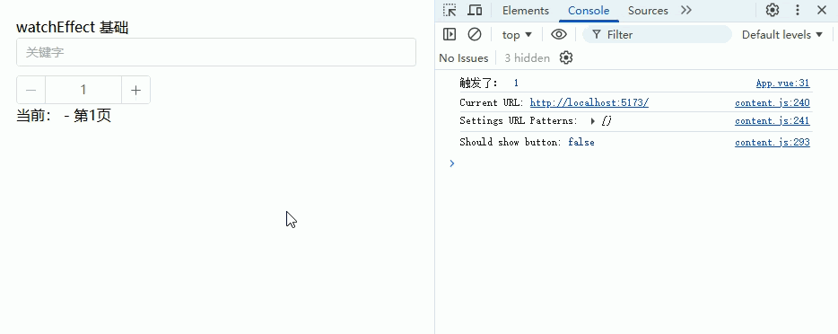

# 数据监听

## 监听单个 ref 值变化（输入框实时响应）

通过 `watch` 监听输入框绑定的 `ref` 值，实现输入时实时响应（如提示长度、联动处理等）

```vue
<template>
  <div class="page">
    <h3>监听输入框变化</h3>

    <!-- 输入框 -->
    <el-input
      v-model="inputValue"
      placeholder="请输入内容"
      clearable
    />

    <!-- 实时展示 -->
    <div class="result">
      当前输入：{{ inputValue }}
    </div>

    <div class="length">
      字符长度：{{ length }}
    </div>
  </div>
</template>

<script setup lang="ts">
import { ref, watch } from 'vue'

/**
 * 输入框的值
 */
const inputValue = ref<string>('')

/**
 * 字符长度
 */
const length = ref<number>(0)

/**
 * 监听 inputValue 变化
 * newVal：新值
 * oldVal：旧值
 */
watch(inputValue, (newVal, oldVal) => {
  console.log('新值：', newVal) // 打印新值
  console.log('旧值：', oldVal) // 打印旧值

  // 更新长度
  length.value = newVal.length
})
</script>

<style scoped lang="scss">
.page {
  padding: 20px;
}

.result {
  margin-top: 10px;
  color: #409eff;
}

.length {
  margin-top: 5px;
  color: #67c23a;
}
</style>
```



## 监听多个值（数组写法）

使用 `watch` 的数组写法，同时监听多个 `ref`，适用于多个字段联动（如姓名+年龄拼接、表单组合判断等）

```vue
<template>
  <div class="page">
    <h3>监听多个值变化</h3>

    <!-- 姓名输入 -->
    <el-input
      v-model="name"
      placeholder="请输入姓名"
      style="margin-bottom: 10px;"
      clearable
    />

    <!-- 年龄输入 -->
    <el-input-number
      v-model="age"
      :min="0"
      placeholder="请输入年龄"
    />

    <!-- 实时结果 -->
    <div class="result">
      拼接结果：{{ result }}
    </div>
  </div>
</template>

<script setup lang="ts">
import { ref, watch } from 'vue'

/**
 * 姓名
 */
const name = ref<string>('')

/**
 * 年龄
 */
const age = ref<number | undefined>(undefined)

/**
 * 拼接结果
 */
const result = ref<string>('')

/**
 * 同时监听多个值
 * newValues：新值数组
 * oldValues：旧值数组
 */
watch([name, age], (newValues, oldValues) => {
  const [newName, newAge] = newValues // 解构新值
  const [oldName, oldAge] = oldValues // 解构旧值

  console.log('新值：', newName, newAge)
  console.log('旧值：', oldName, oldAge)

  // 拼接逻辑
  if (newName && newAge !== undefined) {
    result.value = `${newName} - ${newAge}岁`
  } else {
    result.value = ''
  }
})
</script>

<style scoped lang="scss">
.page {
  padding: 20px;
}

.result {
  margin-top: 15px;
  color: #409eff;
  font-weight: bold;
}
</style>
```



## 监听 reactive 对象（深度监听）

使用 `watch` 监听 `reactive` 对象，默认就是深度监听（可监听对象内部属性变化），适用于复杂表单、对象数据联动等场景

```vue
<template>
  <div class="page">
    <h3>监听 reactive 对象（深度监听）</h3>

    <!-- 表单 -->
    <el-form label-width="80px">
      <el-form-item label="姓名">
        <el-input v-model="form.name" placeholder="请输入姓名" />
      </el-form-item>

      <el-form-item label="年龄">
        <el-input-number v-model="form.age" :min="0" />
      </el-form-item>

      <el-form-item label="城市">
        <el-input v-model="form.address.city" placeholder="请输入城市" />
      </el-form-item>
    </el-form>

    <!-- 实时展示 -->
    <div class="result">
      {{ form }}
    </div>

    <div class="log">
      变更次数：{{ changeCount }}
    </div>
  </div>
</template>

<script setup lang="ts">
import { reactive, ref, watch } from 'vue'

/**
 * 表单对象（reactive）
 */
const form = reactive({
  name: '',
  age: 0,
  address: {
    city: ''
  }
})

/**
 * 记录变更次数
 */
const changeCount = ref<number>(0)

/**
 * 监听 reactive 对象
 * 注意：直接监听 reactive，会自动开启深度监听
 */
watch(
  form,
  (newVal, oldVal) => {
    console.log('新值：', newVal)
    console.log('旧值：', oldVal)

    // 每次任意字段变化，计数 +1
    changeCount.value++
  }
)
</script>

<style scoped lang="scss">
.page {
  padding: 20px;
}

.result {
  margin-top: 15px;
  color: #409eff;
}

.log {
  margin-top: 10px;
  color: #67c23a;
}
</style>
```



## 立即执行监听（immediate）

使用 `watch` 的 `immediate: true`，在组件初始化时立即执行一次监听，常用于**页面初始化请求数据 / 默认计算逻辑**

```vue
<template>
  <div class="page">
    <h3>立即执行监听（immediate）</h3>

    <!-- 输入框 -->
    <el-input
      v-model="keyword"
      placeholder="请输入关键字"
      clearable
    />

    <!-- 模拟请求结果 -->
    <div class="result">
      查询结果：{{ result }}
    </div>
  </div>
</template>

<script setup lang="ts">
import { ref, watch } from 'vue'

/**
 * 搜索关键字
 */
const keyword = ref<string>('默认值')

/**
 * 查询结果
 */
const result = ref<string>('')

/**
 * 模拟接口请求方法
 */
const fetchData = (key: string) => {
  console.log('请求接口，参数：', key)

  // 模拟返回数据
  result.value = `已查询：${key}`
}

/**
 * 监听 keyword
 * immediate: true 表示初始化时立即执行一次
 */
watch(
  keyword,
  (newVal) => {
    fetchData(newVal)
  },
  {
    immediate: true // 关键点：初始化就执行
  }
)
</script>

<style scoped lang="scss">
.page {
  padding: 20px;
}

.result {
  margin-top: 15px;
  color: #409eff;
}
</style>
```



## 监听嵌套对象（deep）

使用 `watch + deep: true` 监听对象中的某个嵌套属性（而不是整个对象），适用于**只关心局部字段变化**的场景

```vue
<template>
  <div class="page">
    <h3>监听嵌套对象（deep）</h3>

    <!-- 表单 -->
    <el-form label-width="80px">
      <el-form-item label="城市">
        <el-input v-model="form.address.city" placeholder="请输入城市" />
      </el-form-item>

      <el-form-item label="街道">
        <el-input v-model="form.address.street" placeholder="请输入街道" />
      </el-form-item>
    </el-form>

    <!-- 展示 -->
    <div class="result">
      {{ form.address }}
    </div>

    <div class="log">
      地址变更次数：{{ count }}
    </div>
  </div>
</template>

<script setup lang="ts">
import { reactive, ref, watch } from 'vue'

/**
 * 表单对象
 */
const form = reactive({
  address: {
    city: '',
    street: ''
  }
})

/**
 * 变更次数
 */
const count = ref<number>(0)

/**
 * 监听嵌套对象 address
 * 注意：这里监听的是 form.address（子对象）
 * 必须开启 deep 才能监听内部字段变化
 */
watch(
  () => form.address, // 监听子对象
  (newVal, oldVal) => {
    console.log('新值：', newVal)
    console.log('旧值：', oldVal)

    count.value++
  },
  {
    deep: true // 关键：深度监听
  }
)
</script>

<style scoped lang="scss">
.page {
  padding: 20px;
}

.result {
  margin-top: 15px;
  color: #409eff;
}

.log {
  margin-top: 10px;
  color: #67c23a;
}
</style>
```



## watchEffect 基础使用

自动监听依赖（无需手动指定），适用于多个变量联动

```vue
<template>
  <div class="page">
    <h3>watchEffect 基础</h3>

    <el-input v-model="keyword" placeholder="关键字" style="margin-bottom:10px" />
    <el-input-number v-model="page" :min="1" />

    <div class="result">
      当前：{{ keyword }} - 第{{ page }}页
    </div>
  </div>
</template>

<script setup lang="ts">
import { ref, watchEffect } from 'vue'

/**
 * 搜索关键字
 */
const keyword = ref('')

/**
 * 页码
 */
const page = ref(1)

/**
 * 自动收集依赖（keyword、page）
 */
watchEffect(() => {
  console.log('触发了：', keyword.value, page.value)
})
</script>

<style scoped lang="scss">
.page {
  padding: 20px;
}
</style>
```

