# 动态样式


## 动态 class 切换

**动态 class 切换：点击按钮切换激活样式**

```vue
<template>
  <div class="container">
    <div :class="['box', { active: isActive }]">
      动态 Class 示例
    </div>

    <el-button type="primary" @click="toggle">
      切换状态
    </el-button>
  </div>
</template>

<script setup lang="ts">
import { ref } from "vue"

const isActive = ref(false)

const toggle = () => {
  isActive.value = !isActive.value
}
</script>

<style lang="scss" scoped>
.container {
  display: flex;                 // 使用 flex 布局
  flex-direction: column;        // 垂直排列
  align-items: flex-start;       // 左对齐
  gap: 16px;                     // 元素间距
  padding: 20px;                 // 内边距
}

.box {
  width: 200px;                  // 盒子宽度
  height: 100px;                 // 盒子高度
  display: flex;                 // flex布局
  align-items: center;           // 垂直居中
  justify-content: center;       // 水平居中
  border-radius: 8px;            // 圆角
  background: #dcdfe6;           // 默认背景色
  color: #333;                   // 文字颜色
  transition: all 0.3s ease;     // 动画过渡
}

.active {
  background: #409eff;           // 激活背景色
  color: #fff;                   // 激活文字颜色
  transform: scale(1.05);        // 轻微放大
}
</style>
```

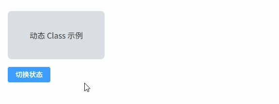

## 动态 style 绑定

根据数据动态控制元素的样式（例如宽度和背景颜色），常用于 **进度条、状态颜色、动态尺寸** 等场景。

```vue
<template>
  <div class="container">
    <div
      class="progress-bar"
      :style="{
        width: progress + '%',
        backgroundColor: progressColor
      }"
    >
      {{ progress }}%
    </div>

    <el-slider v-model="progress" :max="100" />
  </div>
</template>

<script setup lang="ts">
import { ref, computed } from "vue"

const progress = ref(30)

const progressColor = computed(() => {
  if (progress.value < 40) return "#f56c6c"
  if (progress.value < 70) return "#e6a23c"
  return "#67c23a"
})
</script>

<style lang="scss" scoped>
.container {
  width: 400px;              // 容器宽度
  padding: 20px;             // 内边距
  display: flex;             // 使用flex布局
  flex-direction: column;    // 垂直排列
  gap: 20px;                 // 元素间距
}

.progress-bar {
  height: 40px;              // 进度条高度
  border-radius: 8px;        // 圆角
  display: flex;             // flex布局
  align-items: center;       // 垂直居中
  justify-content: center;   // 水平居中
  color: #fff;               // 文字颜色
  font-weight: 600;          // 字体加粗
  transition: all 0.3s;      // 动画过渡
}
</style>
```

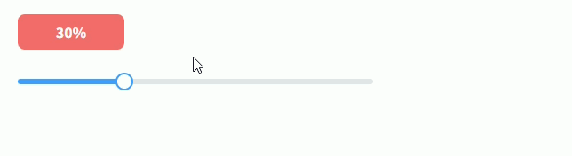

## 列表选中高亮

点击列表项时，当前项会高亮显示，常用于 **菜单列表、选择列表、数据列表选中状态** 等场景。

```vue
<template>
  <div class="container">
    <div
      v-for="item in list"
      :key="item.id"
      :class="['list-item', { active: selectedId === item.id }]"
      @click="selectItem(item.id)"
    >
      {{ item.name }}
    </div>
  </div>
</template>

<script setup lang="ts">
import { ref } from "vue"

interface Item {
  id: number
  name: string
}

const list = ref<Item[]>([
  { id: 1, name: "Vue" },
  { id: 2, name: "React" },
  { id: 3, name: "Angular" },
  { id: 4, name: "Svelte" }
])

const selectedId = ref<number | null>(null)

const selectItem = (id: number) => {
  selectedId.value = id
}
</script>

<style lang="scss" scoped>
.container {
  width: 300px;               // 容器宽度
  padding: 10px;              // 内边距
  display: flex;              // flex布局
  flex-direction: column;     // 垂直排列
  gap: 8px;                   // 列表项间距
}

.list-item {
  padding: 12px 16px;         // 内边距
  border-radius: 6px;         // 圆角
  background: #f5f7fa;        // 默认背景
  cursor: pointer;            // 鼠标指针
  transition: all 0.25s;      // 动画过渡
}

.list-item:hover {
  background: #ecf5ff;        // hover背景
}

.active {
  background: #409eff;        // 选中背景
  color: #fff;                // 选中文字颜色
  font-weight: 600;           // 字体加粗
}
</style>
```

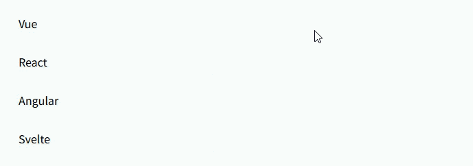

## 表格行动态颜色

根据数据状态动态改变 `ElementPlus Table` 行颜色，例如 **成功 / 警告 / 错误状态行高亮**，常用于 **任务状态、订单状态、告警列表** 等场景。

```vue
<template>
  <div class="container">
    <el-table
      :data="tableData"
      :row-class-name="getRowClass"
      border
      style="width: 100%"
    >
      <el-table-column prop="name" label="任务名称" />
      <el-table-column prop="status" label="状态" />
      <el-table-column prop="owner" label="负责人" />
    </el-table>
  </div>
</template>

<script setup lang="ts">
interface Task {
  name: string
  status: string
  owner: string
}

const tableData: Task[] = [
  { name: "数据同步", status: "success", owner: "Tom" },
  { name: "订单处理", status: "warning", owner: "Lucy" },
  { name: "日志清理", status: "error", owner: "Jack" },
  { name: "备份任务", status: "success", owner: "Mike" }
]

const getRowClass = ({ row }: { row: Task }) => {
  if (row.status === "success") return "row-success"
  if (row.status === "warning") return "row-warning"
  if (row.status === "error") return "row-error"
  return ""
}
</script>

<style lang="scss" scoped>
.container {
  padding: 20px;                      // 容器内边距
}

:deep(.row-success) {
  background: #f0f9eb;                // 成功行背景色
}

:deep(.row-warning) {
  background: #fdf6ec;                // 警告行背景色
}

:deep(.row-error) {
  background: #fef0f0;                // 错误行背景色
}
</style>
```

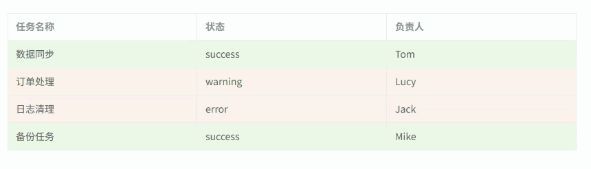

## Tag 动态颜色

根据数据状态动态设置 `ElementPlus Tag` 的类型颜色，例如 **成功 / 处理中 / 失败** 等状态展示，常用于 **订单状态、任务状态、审核状态**。

```vue
<template>
  <div class="container">
    <div class="tag-list">
      <div
        class="tag-item"
        v-for="item in list"
        :key="item.id"
      >
        <span class="name">{{ item.name }}</span>

        <el-tag :type="getTagType(item.status)">
          {{ item.status }}
        </el-tag>
      </div>
    </div>
  </div>
</template>

<script setup lang="ts">
interface Item {
  id: number
  name: string
  status: string
}

const list: Item[] = [
  { id: 1, name: "订单A", status: "成功" },
  { id: 2, name: "订单B", status: "处理中" },
  { id: 3, name: "订单C", status: "失败" },
  { id: 4, name: "订单D", status: "成功" }
]

const getTagType = (status: string) => {
  switch (status) {
    case "成功":
      return "success"
    case "处理中":
      return "warning"
    case "失败":
      return "danger"
    default:
      return "info"
  }
}
</script>

<style lang="scss" scoped>
.container {
  padding: 20px;                  // 容器内边距
}

.tag-list {
  display: flex;                  // 使用flex布局
  flex-direction: column;         // 垂直排列
  gap: 12px;                      // 项目间距
}

.tag-item {
  display: flex;                  // flex布局
  align-items: center;            // 垂直居中
  justify-content: space-between; // 两端对齐
  padding: 10px 14px;             // 内边距
  background: #f5f7fa;            // 背景色
  border-radius: 6px;             // 圆角
}

.name {
  font-weight: 500;               // 字体粗细
  color: #303133;                 // 字体颜色
}
</style>
```

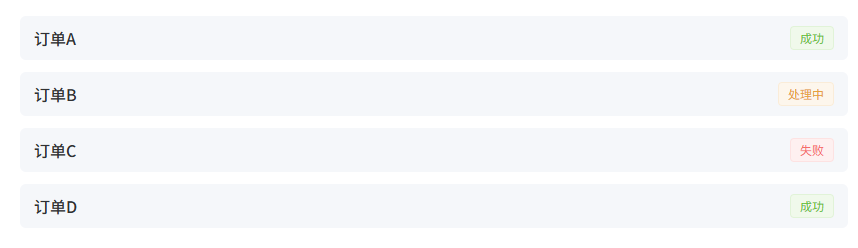

## 按钮激活样式

点击按钮时切换激活状态，高亮当前按钮，常用于 **筛选条件、分类选择、工具栏模式切换** 等场景。

```vue
<template>
  <div class="container">
    <div class="btn-group">
      <div
        v-for="item in buttons"
        :key="item"
        :class="['btn-item', { active: activeBtn === item }]"
        @click="activeBtn = item"
      >
        {{ item }}
      </div>
    </div>
  </div>
</template>

<script setup lang="ts">
import { ref } from "vue"

const buttons = ["全部", "进行中", "已完成", "已取消"]

const activeBtn = ref("全部")
</script>

<style lang="scss" scoped>
.container {
  padding: 20px;                  // 容器内边距
}

.btn-group {
  display: flex;                  // flex布局
  gap: 12px;                      // 按钮间距
}

.btn-item {
  padding: 8px 16px;              // 内边距
  border-radius: 6px;             // 圆角
  background: #f2f3f5;            // 默认背景色
  color: #606266;                 // 默认文字颜色
  cursor: pointer;                // 鼠标手型
  transition: all 0.25s;          // 过渡动画
  user-select: none;              // 禁止选中文字
}

.btn-item:hover {
  background: #e4e7ed;            // hover背景
}

.active {
  background: #409eff;            // 激活背景色
  color: #fff;                    // 激活文字颜色
  font-weight: 600;               // 字体加粗
}
</style>
```

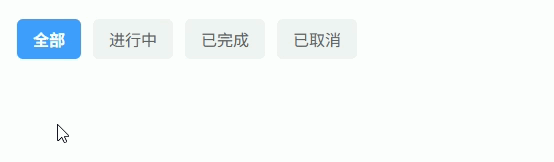

## 进度条动态颜色

根据进度值动态改变 `ElementPlus Progress` 的颜色，例如 **低进度红色 / 中进度橙色 / 高进度绿色**，常用于 **任务进度、资源使用率、上传进度**。

```vue
<template>
  <div class="container">
    <el-progress
      :percentage="progress"
      :color="progressColor"
      :stroke-width="20"
    />

    <el-slider v-model="progress" :max="100" />
  </div>
</template>

<script setup lang="ts">
import { ref, computed } from "vue"

const progress = ref(35)

const progressColor = computed(() => {
  if (progress.value < 40) return "#f56c6c"
  if (progress.value < 70) return "#e6a23c"
  return "#67c23a"
})
</script>

<style lang="scss" scoped>
.container {
  width: 420px;            // 容器宽度
  padding: 20px;           // 内边距
  display: flex;           // flex布局
  flex-direction: column;  // 垂直排列
  gap: 20px;               // 元素间距
}
</style>
```

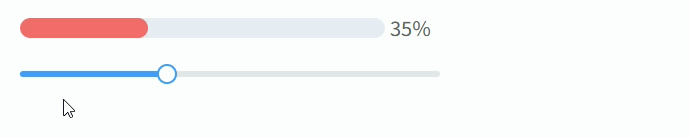

## Badge 状态颜色

根据数据状态动态改变 `ElementPlus Badge` 的颜色，常用于 **通知数量、消息提醒、任务状态提示** 等场景。

```vue
<template>
  <div class="container">
    <div
      class="item"
      v-for="msg in messages"
      :key="msg.id"
    >
      <span class="name">{{ msg.title }}</span>

      <el-badge
        :value="msg.count"
        :type="getBadgeType(msg.count)"
      />
    </div>
  </div>
</template>

<script setup lang="ts">
interface Message {
  id: number
  title: string
  count: number
}

const messages: Message[] = [
  { id: 1, title: "系统通知", count: 2 },
  { id: 2, title: "订单消息", count: 8 },
  { id: 3, title: "告警信息", count: 15 }
]

const getBadgeType = (count: number) => {
  if (count < 5) return "success"
  if (count < 10) return "warning"
  return "danger"
}
</script>

<style lang="scss" scoped>
.container {
  width: 320px;              // 容器宽度
  padding: 20px;             // 内边距
  display: flex;             // flex布局
  flex-direction: column;    // 垂直排列
  gap: 14px;                 // 项目间距
}

.item {
  display: flex;             // flex布局
  justify-content: space-between; // 两端对齐
  align-items: center;       // 垂直居中
  padding: 10px 14px;        // 内边距
  background: #f5f7fa;       // 背景色
  border-radius: 6px;        // 圆角
}

.name {
  color: #303133;            // 文字颜色
  font-weight: 500;          // 字体粗细
}
</style>
```

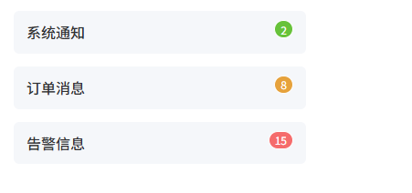

## 动态卡片选中

点击卡片时切换选中状态，高亮当前卡片，常用于 **套餐选择、模板选择、商品选择、布局选择** 等场景。

```vue
<template>
  <div class="container">
    <div class="card-list">
      <div
        v-for="item in cards"
        :key="item.id"
        :class="['card', { active: selectedId === item.id }]"
        @click="selectedId = item.id"
      >
        <div class="title">{{ item.title }}</div>
        <div class="desc">{{ item.desc }}</div>
      </div>
    </div>
  </div>
</template>

<script setup lang="ts">
import { ref } from "vue"

interface Card {
  id: number
  title: string
  desc: string
}

const cards: Card[] = [
  { id: 1, title: "基础版", desc: "适合个人用户" },
  { id: 2, title: "专业版", desc: "适合团队使用" },
  { id: 3, title: "企业版", desc: "适合大型企业" }
]

const selectedId = ref<number | null>(null)
</script>

<style lang="scss" scoped>
.container {
  padding: 20px;                 // 容器内边距
}

.card-list {
  display: grid;                 // 使用grid布局
  grid-template-columns: repeat(3, 1fr); // 三列布局
  gap: 16px;                     // 卡片间距
}

.card {
  padding: 20px;                 // 内边距
  border-radius: 8px;            // 圆角
  background: #f5f7fa;           // 默认背景
  cursor: pointer;               // 鼠标指针
  border: 2px solid transparent; // 默认边框
  transition: all 0.25s;         // 动画过渡
}

.card:hover {
  transform: translateY(-4px);   // hover上移
}

.title {
  font-size: 16px;               // 字体大小
  font-weight: 600;              // 字体加粗
  color: #303133;                // 字体颜色
}

.desc {
  margin-top: 8px;               // 上边距
  font-size: 14px;               // 字体大小
  color: #606266;                // 描述文字颜色
}

.active {
  border-color: #409eff;         // 激活边框
  background: #ecf5ff;           // 激活背景
}
</style>
```

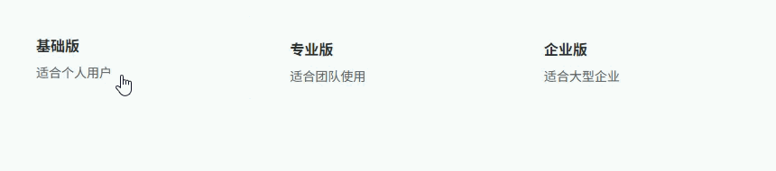

## 动态 Grid 布局

通过数据动态控制 `Grid` 的列数，实现卡片布局自适应变化，常用于 **仪表盘组件布局、卡片列表布局、组件拖拽面板** 等场景。

```vue
<template>
  <div class="container">
    <div class="toolbar">
      <span>列数：</span>
      <el-slider
        v-model="columns"
        :min="2"
        :max="6"
        style="width: 200px"
      />
    </div>

    <div
      class="grid"
      :style="{ gridTemplateColumns: `repeat(${columns}, 1fr)` }"
    >
      <el-card
        v-for="item in list"
        :key="item.id"
        class="card"
      >
        <div class="title">{{ item.title }}</div>
        <div class="desc">{{ item.desc }}</div>
      </el-card>
    </div>
  </div>
</template>

<script setup lang="ts">
import { ref } from "vue"

interface Item {
  id: number
  title: string
  desc: string
}

const columns = ref(3)

const list: Item[] = [
  { id: 1, title: "组件1", desc: "示例内容" },
  { id: 2, title: "组件2", desc: "示例内容" },
  { id: 3, title: "组件3", desc: "示例内容" },
  { id: 4, title: "组件4", desc: "示例内容" },
  { id: 5, title: "组件5", desc: "示例内容" },
  { id: 6, title: "组件6", desc: "示例内容" }
]
</script>

<style lang="scss" scoped>
.container {
  padding: 20px;                     // 容器内边距
}

.toolbar {
  display: flex;                     // flex布局
  align-items: center;               // 垂直居中
  gap: 10px;                         // 元素间距
  margin-bottom: 20px;               // 下边距
}

.grid {
  display: grid;                     // grid布局
  gap: 16px;                         // 卡片间距
  transition: all 0.3s ease;         // 布局变化动画
}

.card {
  border-radius: 8px;                // 圆角
}

.title {
  font-size: 16px;                   // 字体大小
  font-weight: 600;                  // 字体加粗
  color: #303133;                    // 文字颜色
}

.desc {
  margin-top: 8px;                   // 上边距
  font-size: 14px;                   // 字体大小
  color: #606266;                    // 描述颜色
}
</style>
```

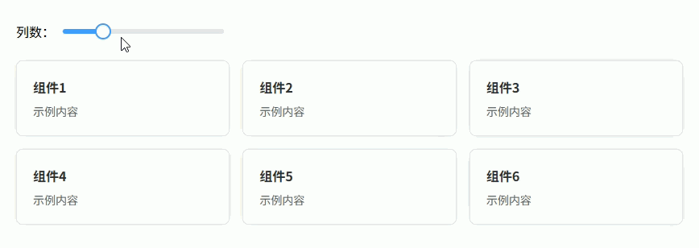

## 侧边栏折叠宽度

点击按钮动态切换侧边栏宽度，实现 **后台管理系统常见的菜单折叠 / 展开效果**。

```vue
<template>
  <div class="layout">
    <div
      class="sidebar"
      :style="{ width: isCollapse ? '64px' : '200px' }"
    >
      <el-menu
        :collapse="isCollapse"
        class="menu"
        default-active="1"
      >
        <el-menu-item index="1">
          <span>首页</span>
        </el-menu-item>

        <el-menu-item index="2">
          <span>用户管理</span>
        </el-menu-item>

        <el-menu-item index="3">
          <span>系统设置</span>
        </el-menu-item>
      </el-menu>
    </div>

    <div class="main">
      <div class="toolbar">
        <el-button type="primary" @click="toggle">
          切换侧边栏
        </el-button>
      </div>

      <div class="content">
        内容区域
      </div>
    </div>
  </div>
</template>

<script setup lang="ts">
import { ref } from "vue"

const isCollapse = ref(false)

const toggle = () => {
  isCollapse.value = !isCollapse.value
}
</script>

<style lang="scss" scoped>
.layout {
  display: flex;                 // 使用flex布局
  height: 100vh;                 // 页面高度
}

.sidebar {
  background: #304156;           // 侧边栏背景
  transition: width 0.3s ease;   // 宽度过渡动画
  overflow: hidden;              // 隐藏溢出内容
}

.menu {
  border-right: none;            // 去除默认边框
}

.main {
  flex: 1;                       // 占满剩余空间
  display: flex;                 // flex布局
  flex-direction: column;        // 垂直布局
}

.toolbar {
  padding: 16px;                 // 内边距
  border-bottom: 1px solid #ebeef5; // 底部边框
  background: #fff;              // 背景颜色
}

.content {
  flex: 1;                       // 填充剩余空间
  padding: 20px;                 // 内边距
  background: #f5f7fa;           // 内容背景
}
</style>
```

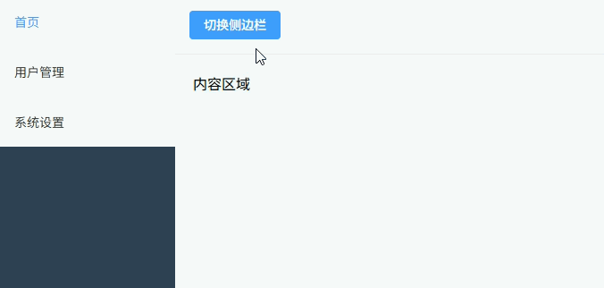

## 深色模式切换

**深色模式切换**

通过动态切换 `class` 控制全局主题，实现 **浅色 / 深色模式切换**，常用于 **后台系统、文档系统、开发工具界面**。

```vue
<template>
  <div :class="['container', { dark: isDark }]">
    <div class="toolbar">
      <el-switch
        v-model="isDark"
        active-text="深色模式"
        inactive-text="浅色模式"
      />
    </div>

    <el-card class="card">
      <h3>系统面板</h3>
      <p>这里是示例内容区域</p>

      <el-button type="primary">
        操作按钮
      </el-button>
    </el-card>
  </div>
</template>

<script setup lang="ts">
import { ref } from "vue"

const isDark = ref(false)
</script>

<style lang="scss" scoped>
.container {
  min-height: 100vh;                // 最小高度
  padding: 24px;                    // 内边距
  background: #f5f7fa;              // 默认背景
  color: #303133;                   // 默认文字颜色
  transition: all 0.3s ease;        // 过渡动画
}

.toolbar {
  margin-bottom: 20px;              // 下边距
}

.card {
  max-width: 420px;                 // 卡片最大宽度
}

.dark {
  background: #1e1e1e;              // 深色背景
  color: #e5eaf3;                   // 深色文字颜色
}

.dark :deep(.el-card) {
  background: #2b2b2b;              // 深色卡片背景
  border-color: #444;               // 深色边框
}

.dark :deep(.el-button) {
  background: #409eff;              // 按钮背景
  border-color: #409eff;            // 按钮边框
}
</style>
```

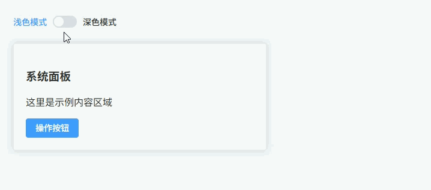

## CSS 变量主题

**CSS 变量主题**

通过动态修改 `CSS 变量` 实现主题色切换，所有组件统一使用变量控制颜色，常用于 **系统主题切换、品牌色定制、后台系统换肤**。

```vue
<template>
  <div class="container">
    <div class="toolbar">
      <span>主题色：</span>

      <el-color-picker
        v-model="themeColor"
        @change="changeTheme"
      />
    </div>

    <el-card class="card">
      <h3>主题示例</h3>

      <p>所有颜色由 CSS 变量控制</p>

      <el-button type="primary">
        操作按钮
      </el-button>
    </el-card>
  </div>
</template>

<script setup lang="ts">
import { ref } from "vue"

const themeColor = ref("#409eff")

const changeTheme = (color: string) => {
  document.documentElement.style.setProperty("--theme-color", color)
}
</script>

<style lang="scss" scoped>
.container {
  padding: 24px;                      // 容器内边距
}

.toolbar {
  display: flex;                      // flex布局
  align-items: center;                // 垂直居中
  gap: 10px;                          // 元素间距
  margin-bottom: 20px;                // 下边距
}

.card {
  max-width: 420px;                   // 卡片最大宽度
  border-top: 4px solid var(--theme-color); // 主题边框
}

:deep(.el-button--primary) {
  background: var(--theme-color);     // 按钮背景色
  border-color: var(--theme-color);   // 按钮边框
}
</style>

<style lang="scss">
:root {
  --theme-color: #409eff;             // 默认主题色
}
</style>
```

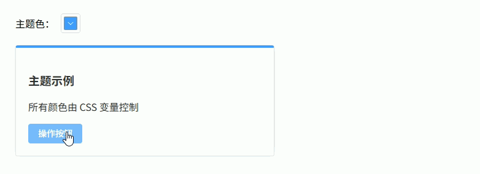

## Hover 动态效果

鼠标悬停元素时触发动态样式变化，例如 **卡片悬浮、列表 hover 高亮、商品展示卡片动画**。

```vue
<template>
  <div class="container">
    <div class="card-list">
      <el-card
        v-for="item in list"
        :key="item.id"
        class="card"
      >
        <div class="title">{{ item.title }}</div>
        <div class="desc">{{ item.desc }}</div>

        <el-button type="primary" size="small">
          查看详情
        </el-button>
      </el-card>
    </div>
  </div>
</template>

<script setup lang="ts">
interface Item {
  id: number
  title: string
  desc: string
}

const list: Item[] = [
  { id: 1, title: "Vue3", desc: "渐进式前端框架" },
  { id: 2, title: "React", desc: "组件化UI库" },
  { id: 3, title: "Angular", desc: "企业级框架" },
  { id: 4, title: "Svelte", desc: "编译型框架" }
]
</script>

<style lang="scss" scoped>
.container {
  padding: 20px;                       // 容器内边距
}

.card-list {
  display: grid;                       // grid布局
  grid-template-columns: repeat(4, 1fr); // 四列布局
  gap: 16px;                           // 卡片间距
}

.card {
  border-radius: 8px;                  // 圆角
  transition: all 0.25s ease;          // 过渡动画
  cursor: pointer;                     // 鼠标手型
}

.card:hover {
  transform: translateY(-6px);         // 悬浮上移
  box-shadow: 0 10px 25px rgba(0,0,0,0.12); // 阴影效果
}

.title {
  font-size: 16px;                     // 字体大小
  font-weight: 600;                    // 字体加粗
  color: #303133;                      // 文字颜色
}

.desc {
  margin: 8px 0 12px 0;                // 外边距
  font-size: 14px;                     // 字体大小
  color: #606266;                      // 描述颜色
}
</style>
```

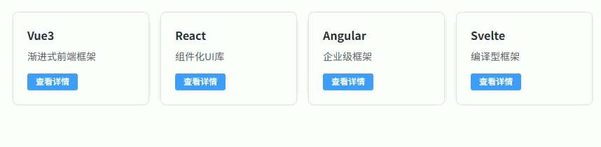

## 展开折叠动画

点击按钮展开或折叠内容区域，通过 `Vue Transition` 实现平滑动画，常用于 **折叠面板、详情展开、FAQ列表**。

```vue
<template>
  <div class="container">
    <el-button type="primary" @click="toggle">
      {{ visible ? "收起内容" : "展开内容" }}
    </el-button>

    <transition name="collapse">
      <el-card v-if="visible" class="panel">
        <h3>详细信息</h3>
        <p>这里是可展开的内容区域。</p>
        <p>在很多后台系统中用于显示额外信息。</p>
      </el-card>
    </transition>
  </div>
</template>

<script setup lang="ts">
import { ref } from "vue"

const visible = ref(false)

const toggle = () => {
  visible.value = !visible.value
}
</script>

<style lang="scss" scoped>
.container {
  padding: 20px;                     // 容器内边距
  display: flex;                     // flex布局
  flex-direction: column;            // 垂直排列
  gap: 16px;                         // 元素间距
}

.panel {
  max-width: 420px;                  // 卡片最大宽度
}

.collapse-enter-active,
.collapse-leave-active {
  transition: all 0.3s ease;         // 过渡动画
}

.collapse-enter-from,
.collapse-leave-to {
  opacity: 0;                        // 初始透明
  transform: translateY(-10px);      // 初始位置偏移
}

.collapse-enter-to,
.collapse-leave-from {
  opacity: 1;                        // 完全显示
  transform: translateY(0);          // 归位
}
</style>
```

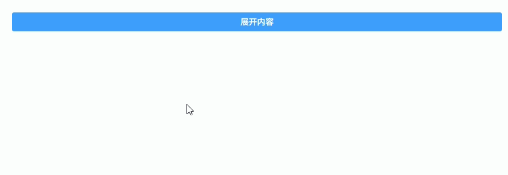