# 表单布局

## 基础表单布局

常见用户信息编辑：Input、Select、DatePicker 等基础字段。

```vue
<template>
  <div class="form-page">
    <el-card class="form-card">
      <el-form
          ref="formRef"
          :model="form"
          label-width="100px"
          class="user-form"
      >
        <el-form-item prop="username" label="用户名">
          <el-input v-model="form.username" placeholder="请输入用户名" />
        </el-form-item>

        <el-form-item prop="email" label="邮箱">
          <el-input v-model="form.email" placeholder="请输入邮箱" />
        </el-form-item>

        <el-form-item prop="gender" label="性别">
          <el-select v-model="form.gender" placeholder="请选择性别" style="width:100%">
            <el-option label="男" value="male" />
            <el-option label="女" value="female" />
          </el-select>
        </el-form-item>

        <el-form-item prop="birthDate" label="出生日期">
          <el-date-picker
              v-model="form.birthDate"
              type="date"
              placeholder="选择日期"
              style="width:100%"
          />
        </el-form-item>

        <el-form-item prop="address" label="地址">
          <el-input
              v-model="form.address"
              type="textarea"
              :rows="3"
              placeholder="请输入地址"
          />
        </el-form-item>

        <el-form-item class="form-actions">
          <el-button type="primary" @click="submitForm">提交</el-button>
          <el-button @click="resetForm">重置</el-button>
        </el-form-item>

      </el-form>
    </el-card>
  </div>
</template>

<script setup lang="ts">
import { ref, reactive } from 'vue'
import type { FormInstance } from 'element-plus'

const formRef = ref<FormInstance>()

const form = reactive({
  username: '',
  email: '',
  gender: '',
  birthDate: '',
  address: ''
})

const submitForm = () => {
  console.log('提交数据', form)
}

const resetForm = () => {
  formRef.value?.resetFields()
}
</script>

<style lang="scss" scoped>
.form-page {
  padding: 24px; // 页面内边距
  background: #f5f7fa; // 页面背景色
  min-height: 100vh; // 页面最小高度
}

.form-card {
  max-width: 600px; // 表单最大宽度
  margin: 0 auto; // 水平居中
}

.user-form {
  width: 100%; // 表单宽度
}

.form-actions {
  margin-top: 20px; // 操作按钮上边距
}
</style>
```

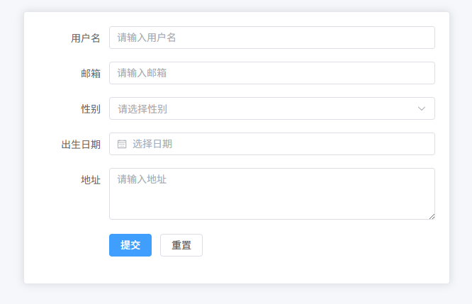

## 栅格表单布局（Row + Col）

后台编辑页常见布局，通过 `el-row + el-col` 将表单分成多列（常见 2 列 / 3 列），提高页面信息密度，减少滚动。

```vue
<template>
  <div class="form-page">
    <el-card class="form-card">
      <el-form
          ref="formRef"
          :model="form"
          label-width="100px"
          class="grid-form"
      >
        <el-row :gutter="20">
          <el-col :span="12">
            <el-form-item prop="username" label="用户名">
              <el-input v-model="form.username" placeholder="请输入用户名" />
            </el-form-item>
          </el-col>

          <el-col :span="12">
            <el-form-item prop="email" label="邮箱">
              <el-input v-model="form.email" placeholder="请输入邮箱" />
            </el-form-item>
          </el-col>

          <el-col :span="12">
            <el-form-item prop="gender" label="性别">
              <el-select v-model="form.gender" placeholder="请选择性别" style="width:100%">
                <el-option label="男" value="male" />
                <el-option label="女" value="female" />
              </el-select>
            </el-form-item>
          </el-col>

          <el-col :span="12">
            <el-form-item prop="birthDate" label="出生日期">
              <el-date-picker
                  v-model="form.birthDate"
                  type="date"
                  placeholder="选择日期"
                  style="width:100%"
              />
            </el-form-item>
          </el-col>

          <el-col :span="24">
            <el-form-item prop="address" label="地址">
              <el-input
                  v-model="form.address"
                  type="textarea"
                  :rows="3"
                  placeholder="请输入地址"
              />
            </el-form-item>
          </el-col>
        </el-row>

        <el-form-item class="form-actions">
          <el-button type="primary" @click="submitForm">提交</el-button>
          <el-button @click="resetForm">重置</el-button>
        </el-form-item>

      </el-form>
    </el-card>
  </div>
</template>

<script setup lang="ts">
import { ref, reactive } from 'vue'
import type { FormInstance } from 'element-plus'

const formRef = ref<FormInstance>()

const form = reactive({
  username: '',
  email: '',
  gender: '',
  birthDate: '',
  address: ''
})

const submitForm = () => {
  console.log('提交数据', form)
}

const resetForm = () => {
  formRef.value?.resetFields()
}
</script>

<style lang="scss" scoped>
.form-page {
  padding: 24px; // 页面内边距
  background: #f5f7fa; // 页面背景色
  min-height: 100vh; // 页面最小高度
}

.form-card {
  max-width: 900px; // 表单最大宽度
  margin: 0 auto; // 水平居中
}

.grid-form {
  width: 100%; // 表单宽度
}

.form-actions {
  margin-top: 20px; // 操作区域上边距
}
</style>
```

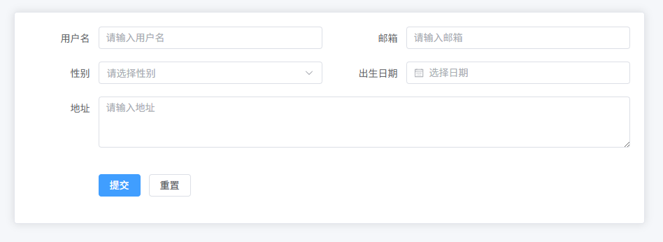


## 查询条件表单（列表页搜索）

列表页顶部常见的查询条件区域，用于筛选表格数据，一般包含多个查询字段 + 查询按钮 + 重置按钮。

```vue
<template>
  <div class="search-page">
    <el-card class="search-card">

      <el-form
          ref="formRef"
          :model="form"
          label-width="80px"
          class="search-form"
      >
        <el-row :gutter="20">

          <el-col :span="6">
            <el-form-item prop="username" label="用户名">
              <el-input v-model="form.username" placeholder="请输入用户名" clearable />
            </el-form-item>
          </el-col>

          <el-col :span="6">
            <el-form-item prop="email" label="邮箱">
              <el-input v-model="form.email" placeholder="请输入邮箱" clearable />
            </el-form-item>
          </el-col>

          <el-col :span="6">
            <el-form-item prop="status" label="状态">
              <el-select v-model="form.status" placeholder="请选择状态" clearable style="width:100%">
                <el-option label="启用" value="1" />
                <el-option label="禁用" value="0" />
              </el-select>
            </el-form-item>
          </el-col>

          <el-col :span="6">
            <el-form-item prop="dateRange" label="创建时间">
              <el-date-picker
                  v-model="form.dateRange"
                  type="daterange"
                  range-separator="-"
                  start-placeholder="开始日期"
                  end-placeholder="结束日期"
                  style="width:100%"
              />
            </el-form-item>
          </el-col>

        </el-row>

        <div class="search-actions">
          <el-button type="primary" @click="handleSearch">查询</el-button>
          <el-button @click="handleReset">重置</el-button>
        </div>

      </el-form>

    </el-card>
  </div>
</template>

<script setup lang="ts">
import { ref, reactive } from 'vue'
import type { FormInstance } from 'element-plus'

const formRef = ref<FormInstance>()

const form = reactive({
  username: '',
  email: '',
  status: '',
  dateRange: []
})

const handleSearch = () => {
  console.log('查询参数', form)
}

const handleReset = () => {
  formRef.value?.resetFields()
}
</script>

<style lang="scss" scoped>
.search-page {
  padding: 20px; // 页面内边距
  background: #f5f7fa; // 页面背景色
}

.search-card {
  margin-bottom: 20px; // 卡片底部间距
}

.search-form {
  width: 100%; // 表单宽度
}

.search-actions {
  margin-top: 10px; // 按钮区域上边距
  text-align: right; // 按钮右对齐
}
</style>
```

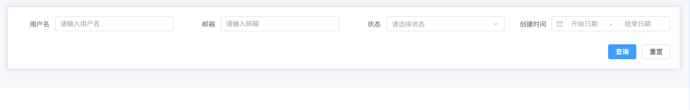

## 查询表单展开 / 收起

列表页查询条件较多时，为避免页面过长，默认显示部分字段，点击“展开”显示更多条件，“收起”返回简洁模式。

```vue
<template>
  <div class="search-page">
    <el-card class="search-card">

      <el-form
          ref="formRef"
          :model="form"
          label-width="80px"
          class="search-form"
      >
        <el-row :gutter="20">

          <el-col :span="6">
            <el-form-item prop="username" label="用户名">
              <el-input v-model="form.username" placeholder="请输入用户名" clearable />
            </el-form-item>
          </el-col>

          <el-col :span="6">
            <el-form-item prop="email" label="邮箱">
              <el-input v-model="form.email" placeholder="请输入邮箱" clearable />
            </el-form-item>
          </el-col>

          <el-col :span="6">
            <el-form-item prop="status" label="状态">
              <el-select v-model="form.status" placeholder="请选择状态" clearable style="width:100%">
                <el-option label="启用" value="1" />
                <el-option label="禁用" value="0" />
              </el-select>
            </el-form-item>
          </el-col>

          <el-col :span="6" v-if="expand">
            <el-form-item prop="role" label="角色">
              <el-select v-model="form.role" placeholder="请选择角色" clearable style="width:100%">
                <el-option label="管理员" value="admin" />
                <el-option label="普通用户" value="user" />
              </el-select>
            </el-form-item>
          </el-col>

          <el-col :span="6" v-if="expand">
            <el-form-item prop="dateRange" label="创建时间">
              <el-date-picker
                  v-model="form.dateRange"
                  type="daterange"
                  range-separator="-"
                  start-placeholder="开始日期"
                  end-placeholder="结束日期"
                  style="width:100%"
              />
            </el-form-item>
          </el-col>

        </el-row>

        <div class="search-actions">
          <el-button type="primary" @click="handleSearch">查询</el-button>
          <el-button @click="handleReset">重置</el-button>
          <el-button link @click="expand = !expand">
            {{ expand ? '收起' : '展开' }}
            <el-icon>
              <component :is="expand ? ArrowUp : ArrowDown"></component>
            </el-icon>
          </el-button>
        </div>

      </el-form>

    </el-card>
  </div>
</template>

<script setup lang="ts">
import { ref, reactive } from 'vue'
import type { FormInstance } from 'element-plus'
import { ArrowDown, ArrowUp } from "@element-plus/icons-vue";

const formRef = ref<FormInstance>()

const expand = ref(false)

const form = reactive({
  username: '',
  email: '',
  status: '',
  role: '',
  dateRange: []
})

const handleSearch = () => {
  console.log('查询参数', form)
}

const handleReset = () => {
  formRef.value?.resetFields()
}
</script>

<style lang="scss" scoped>
.search-page {
  padding: 20px; // 页面内边距
  background: #f5f7fa; // 页面背景色
}

.search-card {
  margin-bottom: 20px; // 卡片底部间距
}

.search-form {
  width: 100%; // 表单宽度
}

.search-actions {
  margin-top: 10px; // 按钮区域上边距
  text-align: right; // 按钮右对齐
}
</style>
```


## 行内表单（Inline Form）

适用于列表页顶部简单搜索条件，所有表单项在同一行排列，占用空间少、操作快捷。

```vue
<template>
  <div class="inline-form-page">
    <el-card class="inline-form-card">
      <el-form
          ref="formRef"
          :model="form"
          label-width="0"
          class="inline-form"
          inline
      >
        <el-form-item prop="username">
          <el-input
              v-model="form.username"
              placeholder="用户名"
              clearable
              size="small"
          />
        </el-form-item>

        <el-form-item prop="email">
          <el-input
              v-model="form.email"
              placeholder="邮箱"
              clearable
              size="small"
          />
        </el-form-item>

        <el-form-item  prop="status">
          <el-select v-model="form.status" placeholder="状态" size="small" style="width:120px">
            <el-option label="启用" value="1" />
            <el-option label="禁用" value="0" />
          </el-select>
        </el-form-item>

        <el-form-item>
          <el-button type="primary" @click="handleSearch" size="small">查询</el-button>
          <el-button @click="handleReset" size="small">重置</el-button>
        </el-form-item>

      </el-form>
    </el-card>
  </div>
</template>

<script setup lang="ts">
import { ref, reactive } from 'vue'
import type { FormInstance } from 'element-plus'

const formRef = ref<FormInstance>()

const form = reactive({
  username: '',
  email: '',
  status: ''
})

const handleSearch = () => {
  console.log('查询参数', form)
}

const handleReset = () => {
  formRef.value?.resetFields()
}
</script>

<style lang="scss" scoped>
.inline-form-page {
  padding: 16px; // 页面内边距
  background: #f5f7fa; // 页面背景色
}

.inline-form-card {
  padding: 12px 16px; // 卡片内边距
}

.inline-form {
  display: flex; // 行内布局
  flex-wrap: wrap; // 可换行
  gap: 8px; // 间距
}
</style>
```

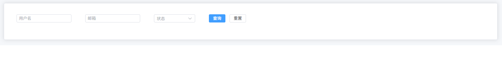

## 表单分组布局（Card 分组）

适用于大型表单，将表单内容按业务模块分组，常见分为“基础信息 / 配置信息 / 高级设置”，提高可读性和操作性。

```vue
<template>
  <div class="form-page">
    <!-- 基础信息分组 -->
    <el-card class="form-card">
      <div class="card-title">基础信息</div>
      <el-form ref="formRef" :model="form" label-width="120px" class="group-form">
        <el-form-item prop="username" label="用户名">
          <el-input v-model="form.username" placeholder="请输入用户名" />
        </el-form-item>
        <el-form-item prop="email" label="邮箱">
          <el-input v-model="form.email" placeholder="请输入邮箱" />
        </el-form-item>
        <el-form-item prop="gender" label="性别">
          <el-select v-model="form.gender" placeholder="请选择性别" style="width:100%">
            <el-option label="男" value="male" />
            <el-option label="女" value="female" />
          </el-select>
        </el-form-item>
      </el-form>
    </el-card>

    <!-- 配置信息分组 -->
    <el-card class="form-card">
      <div class="card-title">配置信息</div>
      <el-form ref="formRef" :model="form" label-width="120px" class="group-form">
        <el-form-item prop="role" label="角色">
          <el-select v-model="form.role" placeholder="请选择角色" style="width:100%">
            <el-option label="管理员" value="admin" />
            <el-option label="普通用户" value="user" />
          </el-select>
        </el-form-item>
        <el-form-item prop="status" label="状态">
          <el-select v-model="form.status" placeholder="请选择状态" style="width:100%">
            <el-option label="启用" value="1" />
            <el-option label="禁用" value="0" />
          </el-select>
        </el-form-item>
      </el-form>
    </el-card>

    <!-- 高级设置分组 -->
    <el-card class="form-card">
      <div class="card-title">高级设置</div>
      <el-form ref="formRef" :model="form" label-width="120px" class="group-form">
        <el-form-item prop="remark" label="备注">
          <el-input
              v-model="form.remark"
              type="textarea"
              :rows="3"
              placeholder="请输入备注"
          />
        </el-form-item>
      </el-form>
    </el-card>

    <!-- 操作按钮 -->
    <div class="form-actions">
      <el-button type="primary" @click="submitForm">提交</el-button>
      <el-button @click="resetForm">重置</el-button>
    </div>
  </div>
</template>

<script setup lang="ts">
import { ref, reactive } from 'vue'
import type { FormInstance } from 'element-plus'

const formRef = ref<FormInstance>()

const defaultForm = reactive({
  username: '',
  email: '',
  gender: '',
  role: '',
  status: '',
  remark: ''
})

const form = reactive({ ...defaultForm })

const submitForm = () => {
  console.log('提交数据', form)
}

const resetForm = () => {
  Object.assign(form, defaultForm)
}
</script>

<style lang="scss" scoped>
.form-page {
  padding: 24px; // 页面内边距
  background: #f5f7fa; // 页面背景色
}

.form-card {
  margin-bottom: 20px; // 卡片底部间距
  padding: 16px; // 卡片内边距
}

.card-title {
  font-weight: 600; // 分组标题加粗
  font-size: 16px; // 分组标题字号
  margin-bottom: 12px; // 标题与表单间距
}

.group-form {
  width: 100%; // 分组表单宽度
}

.form-actions {
  margin-top: 20px; // 按钮区域上边距
  text-align: center; // 按钮居中
}
</style>
```

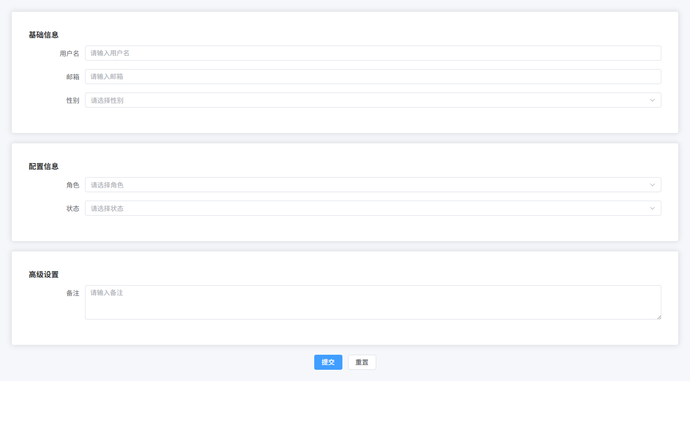


## 表单分区布局（Divider 分区）

适用于中型表单，通过 `Divider` 对不同业务模块进行视觉分隔，例如：基础信息 / 联系信息 / 其他信息，比 Card 更轻量。

```vue
<template>
  <div class="form-page">
    <el-card class="form-card">

      <el-form
          ref="formRef"
          :model="form"
          label-width="110px"
          class="divider-form"
      >

        <el-divider content-position="left">基础信息</el-divider>

        <el-row :gutter="20">

          <el-col :span="12">
            <el-form-item prop="username" label="用户名">
              <el-input v-model="form.username" placeholder="请输入用户名"/>
            </el-form-item>
          </el-col>

          <el-col :span="12">
            <el-form-item prop="email" label="邮箱">
              <el-input v-model="form.email" placeholder="请输入邮箱"/>
            </el-form-item>
          </el-col>

          <el-col :span="12">
            <el-form-item prop="gender" label="性别">
              <el-select v-model="form.gender" placeholder="请选择性别" style="width:100%">
                <el-option label="男" value="male"/>
                <el-option label="女" value="female"/>
              </el-select>
            </el-form-item>
          </el-col>

        </el-row>

        <el-divider content-position="left">联系信息</el-divider>

        <el-row :gutter="20">

          <el-col :span="12">
            <el-form-item prop="phone" label="手机号">
              <el-input v-model="form.phone" placeholder="请输入手机号"/>
            </el-form-item>
          </el-col>

          <el-col :span="12">
            <el-form-item prop="address" label="地址">
              <el-input v-model="form.address" placeholder="请输入地址"/>
            </el-form-item>
          </el-col>

        </el-row>

        <el-divider content-position="left">其他信息</el-divider>

        <el-form-item prop="remark" label="备注">
          <el-input
              v-model="form.remark"
              type="textarea"
              :rows="3"
              placeholder="请输入备注"
          />
        </el-form-item>

        <div class="form-actions">
          <el-button type="primary" @click="submitForm">提交</el-button>
          <el-button @click="resetForm">重置</el-button>
        </div>

      </el-form>

    </el-card>
  </div>
</template>

<script setup lang="ts">
import { ref, reactive } from 'vue'
import type { FormInstance } from 'element-plus'

const formRef = ref<FormInstance>()

const form = reactive({
  username: '',
  email: '',
  gender: '',
  phone: '',
  address: '',
  remark: ''
})

const submitForm = () => {
  console.log('提交数据', form)
}

const resetForm = () => {
  formRef.value?.resetFields()
}
</script>

<style lang="scss" scoped>
.form-page {
  padding: 24px; // 页面内边距
  background: #f5f7fa; // 页面背景色
}

.form-card {
  max-width: 900px; // 表单最大宽度
  margin: 0 auto; // 居中
}

.divider-form {
  width: 100%; // 表单宽度
}

.form-actions {
  margin-top: 20px; // 按钮区域上边距
  text-align: center; // 按钮居中
}
</style>
```

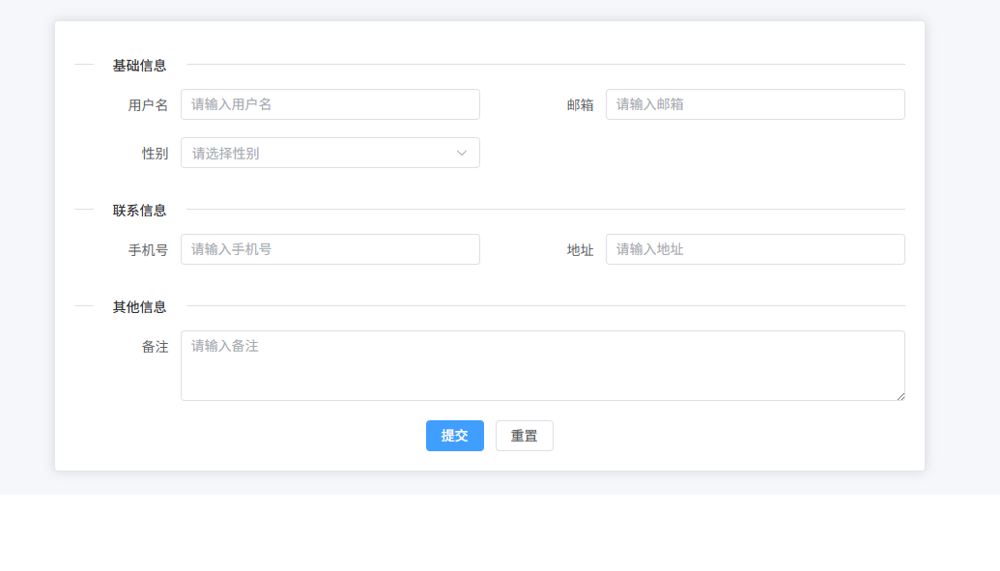


## 多列表单布局（2列 / 3列 / 4列）

适用于复杂编辑页，将表单项按列分布，减少滚动，提高页面的信息密度。可以根据需求调整列数（如 2 列 / 3 列 / 4 列）。

```vue
<template>
  <div class="form-page">
    <el-card class="form-card">

      <el-form
        ref="formRef"
        :model="form"
        label-width="110px"
        class="multi-column-form"
      >

        <el-row :gutter="20">

          <!-- 第一列 -->
          <el-col :span="8">
            <el-form-item label="用户名" prop="username">
              <el-input v-model="form.username" placeholder="请输入用户名" />
            </el-form-item>
          </el-col>

          <el-col :span="8">
            <el-form-item label="邮箱" prop="email">
              <el-input v-model="form.email" placeholder="请输入邮箱" />
            </el-form-item>
          </el-col>

          <el-col :span="8">
            <el-form-item label="性别" prop="gender">
              <el-select v-model="form.gender" placeholder="请选择性别" style="width:100%">
                <el-option label="男" value="male" />
                <el-option label="女" value="female" />
              </el-select>
            </el-form-item>
          </el-col>

          <!-- 第二列 -->
          <el-col :span="8">
            <el-form-item label="手机号" prop="phone">
              <el-input v-model="form.phone" placeholder="请输入手机号" />
            </el-form-item>
          </el-col>

          <el-col :span="8">
            <el-form-item label="地址" prop="address">
              <el-input v-model="form.address" placeholder="请输入地址" />
            </el-form-item>
          </el-col>

          <el-col :span="8">
            <el-form-item label="角色" prop="role">
              <el-select v-model="form.role" placeholder="请选择角色" style="width:100%">
                <el-option label="管理员" value="admin" />
                <el-option label="普通用户" value="user" />
              </el-select>
            </el-form-item>
          </el-col>

          <!-- 第三列 -->
          <el-col :span="8">
            <el-form-item label="状态" prop="status">
              <el-select v-model="form.status" placeholder="请选择状态" style="width:100%">
                <el-option label="启用" value="1" />
                <el-option label="禁用" value="0" />
              </el-select>
            </el-form-item>
          </el-col>

          <el-col :span="8">
            <el-form-item label="创建时间" prop="createTime">
              <el-date-picker
                v-model="form.createTime"
                type="date"
                placeholder="选择日期"
                style="width:100%"
              />
            </el-form-item>
          </el-col>

          <el-col :span="8">
            <el-form-item label="备注" prop="remark">
              <el-input
                v-model="form.remark"
                type="textarea"
                :rows="3"
                placeholder="请输入备注"
              />
            </el-form-item>
          </el-col>

        </el-row>

        <div class="form-actions">
          <el-button type="primary" @click="submitForm">提交</el-button>
          <el-button @click="resetForm">重置</el-button>
        </div>

      </el-form>

    </el-card>
  </div>
</template>

<script setup lang="ts">
import { ref, reactive } from 'vue'
import type { FormInstance } from 'element-plus'

const formRef = ref<FormInstance>()

const form = reactive({
  username: '',
  email: '',
  gender: '',
  phone: '',
  address: '',
  role: '',
  status: '',
  createTime: '',
  remark: ''
})

const submitForm = () => {
  console.log('提交数据', form)
}

const resetForm = () => {
  formRef.value?.resetFields()
}
</script>

<style lang="scss" scoped>
.form-page {
  padding: 24px; // 页面内边距
  background: #f5f7fa; // 页面背景色
}

.form-card {
  max-width: 1000px; // 表单最大宽度
  margin: 0 auto; // 居中
}

.multi-column-form {
  width: 100%; // 表单宽度
}

.form-actions {
  margin-top: 20px; // 按钮区域上边距
  text-align: center; // 按钮居中
}
</style>
```

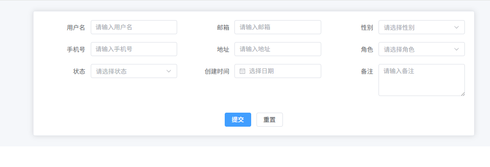


## 表单底部操作栏

在编辑页或新增页中，表单底部通常会放置统一的操作按钮区域，例如：提交 / 重置 / 取消，保持页面交互一致性。

```vue
<template>
  <div class="form-page">
    <el-card class="form-card">

      <el-form
        ref="formRef"
        :model="form"
        label-width="110px"
        class="form-content"
      >

        <el-row :gutter="20">

          <el-col :span="12">
            <el-form-item label="用户名" prop="username">
              <el-input v-model="form.username" placeholder="请输入用户名" />
            </el-form-item>
          </el-col>

          <el-col :span="12">
            <el-form-item label="邮箱" prop="email">
              <el-input v-model="form.email" placeholder="请输入邮箱" />
            </el-form-item>
          </el-col>

          <el-col :span="12">
            <el-form-item label="角色" prop="role">
              <el-select v-model="form.role" placeholder="请选择角色" style="width:100%">
                <el-option label="管理员" value="admin" />
                <el-option label="普通用户" value="user" />
              </el-select>
            </el-form-item>
          </el-col>

          <el-col :span="12">
            <el-form-item label="状态" prop="status">
              <el-select v-model="form.status" placeholder="请选择状态" style="width:100%">
                <el-option label="启用" value="1" />
                <el-option label="禁用" value="0" />
              </el-select>
            </el-form-item>
          </el-col>

        </el-row>

      </el-form>

      <div class="form-footer">
        <el-button type="primary" @click="submitForm">提交</el-button>
        <el-button @click="resetForm">重置</el-button>
        <el-button @click="cancelForm">取消</el-button>
      </div>

    </el-card>
  </div>
</template>

<script setup lang="ts">
import { ref, reactive } from 'vue'
import type { FormInstance } from 'element-plus'

const formRef = ref<FormInstance>()

const form = reactive({
  username: '',
  email: '',
  role: '',
  status: ''
})

const submitForm = () => {
  console.log('提交数据', form)
}

const resetForm = () => {
  formRef.value?.resetFields()
}

const cancelForm = () => {
  console.log('取消操作')
}
</script>

<style lang="scss" scoped>
.form-page {
  padding: 24px; // 页面内边距
  background: #f5f7fa; // 页面背景色
}

.form-card {
  max-width: 900px; // 表单最大宽度
  margin: 0 auto; // 水平居中
}

.form-content {
  width: 100%; // 表单宽度
}

.form-footer {
  margin-top: 20px; // 与表单内容间距
  padding-top: 16px; // 顶部内边距
  border-top: 1px solid #ebeef5; // 顶部分隔线
  text-align: center; // 按钮居中
}
</style>
```

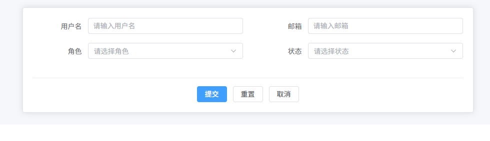

## 固定底部按钮表单

当表单内容很多、页面很长时，将提交 / 重置 / 取消按钮固定在页面底部，用户滚动到任何位置都可以操作。

```vue
<template>
  <div class="form-page">

    <el-card class="form-card">

      <el-form
        ref="formRef"
        :model="form"
        label-width="110px"
        class="form-content"
      >

        <el-row :gutter="20">

          <el-col :span="12">
            <el-form-item label="用户名" prop="username">
              <el-input v-model="form.username" placeholder="请输入用户名"/>
            </el-form-item>
          </el-col>

          <el-col :span="12">
            <el-form-item label="邮箱" prop="email">
              <el-input v-model="form.email" placeholder="请输入邮箱"/>
            </el-form-item>
          </el-col>

          <el-col :span="12">
            <el-form-item label="手机号" prop="phone">
              <el-input v-model="form.phone" placeholder="请输入手机号"/>
            </el-form-item>
          </el-col>

          <el-col :span="12">
            <el-form-item label="角色" prop="role">
              <el-select v-model="form.role" placeholder="请选择角色" style="width:100%">
                <el-option label="管理员" value="admin"/>
                <el-option label="普通用户" value="user"/>
              </el-select>
            </el-form-item>
          </el-col>

          <el-col :span="12">
            <el-form-item label="状态" prop="status">
              <el-select v-model="form.status" placeholder="请选择状态" style="width:100%">
                <el-option label="启用" value="1"/>
                <el-option label="禁用" value="0"/>
              </el-select>
            </el-form-item>
          </el-col>

          <el-col :span="24">
            <el-form-item label="备注" prop="remark">
              <el-input
                v-model="form.remark"
                type="textarea"
                :rows="4"
                placeholder="请输入备注"
              />
            </el-form-item>
          </el-col>

        </el-row>

      </el-form>

    </el-card>

    <!-- 固定底部操作栏 -->
    <div class="form-fixed-footer">
      <el-button type="primary" @click="submitForm">提交</el-button>
      <el-button @click="resetForm">重置</el-button>
      <el-button @click="cancelForm">取消</el-button>
    </div>

  </div>
</template>

<script setup lang="ts">
import { ref, reactive } from 'vue'
import type { FormInstance } from 'element-plus'

const formRef = ref<FormInstance>()

const form = reactive({
  username: '',
  email: '',
  phone: '',
  role: '',
  status: '',
  remark: ''
})

const submitForm = () => {
  console.log('提交数据', form)
}

const resetForm = () => {
  formRef.value?.resetFields()
}

const cancelForm = () => {
  console.log('取消操作')
}
</script>

<style lang="scss" scoped>
.form-page {
  padding: 24px; // 页面内边距
  background: #f5f7fa; // 页面背景色
  padding-bottom: 90px; // 给固定底部按钮预留空间
}

.form-card {
  max-width: 900px; // 表单最大宽度
  margin: 0 auto; // 水平居中
}

.form-content {
  width: 100%; // 表单宽度
}

.form-fixed-footer {
  position: fixed; // 固定定位
  left: 0; // 左侧贴边
  bottom: 0; // 底部贴边
  width: 100%; // 宽度铺满
  padding: 14px 0; // 内边距
  background: #ffffff; // 背景色
  border-top: 1px solid #ebeef5; // 顶部分割线
  text-align: center; // 按钮居中
  box-shadow: 0 -2px 8px rgba(0,0,0,0.05); // 顶部阴影
}
</style>
```

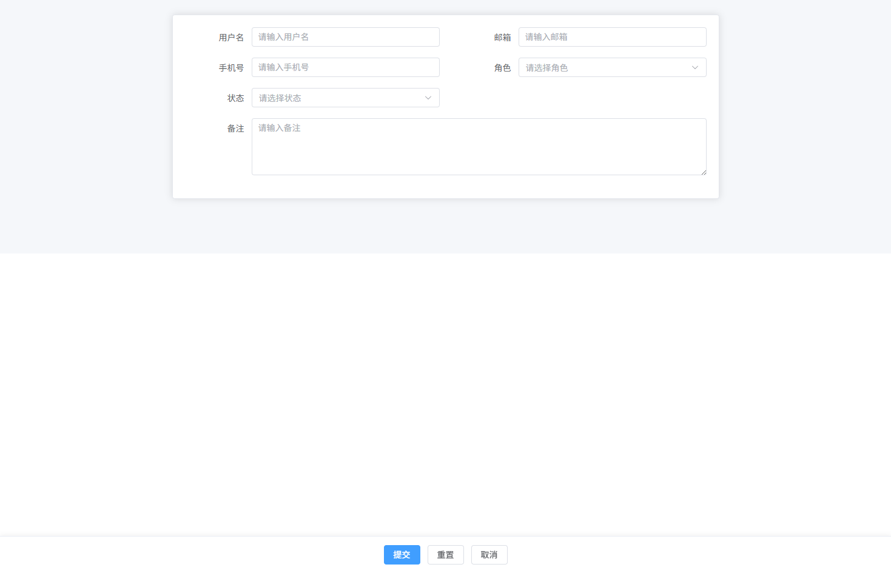


## Dialog 表单（新增 / 编辑）

在列表页中点击“新增 / 编辑”时，通过 `Dialog` 弹出表单进行数据填写或修改，是后台系统最常见的交互方式。

```vue
<template>
  <div class="page">

    <el-button type="primary" @click="openAddDialog">新增用户</el-button>

    <el-dialog
      v-model="dialogVisible"
      :title="isEdit ? '编辑用户' : '新增用户'"
      width="600px"
    >

      <el-form
        ref="formRef"
        :model="form"
        label-width="100px"
        class="dialog-form"
      >

        <el-row :gutter="20">

          <el-col :span="12">
            <el-form-item label="用户名" prop="username">
              <el-input v-model="form.username" placeholder="请输入用户名"/>
            </el-form-item>
          </el-col>

          <el-col :span="12">
            <el-form-item label="邮箱" prop="email">
              <el-input v-model="form.email" placeholder="请输入邮箱"/>
            </el-form-item>
          </el-col>

          <el-col :span="12">
            <el-form-item label="角色" prop="role">
              <el-select v-model="form.role" placeholder="请选择角色" style="width:100%">
                <el-option label="管理员" value="admin"/>
                <el-option label="普通用户" value="user"/>
              </el-select>
            </el-form-item>
          </el-col>

          <el-col :span="12">
            <el-form-item label="状态" prop="status">
              <el-select v-model="form.status" placeholder="请选择状态" style="width:100%">
                <el-option label="启用" value="1"/>
                <el-option label="禁用" value="0"/>
              </el-select>
            </el-form-item>
          </el-col>

          <el-col :span="24">
            <el-form-item label="备注" prop="remark">
              <el-input
                v-model="form.remark"
                type="textarea"
                :rows="3"
                placeholder="请输入备注"
              />
            </el-form-item>
          </el-col>

        </el-row>

      </el-form>

      <template #footer>
        <div class="dialog-footer">
          <el-button @click="dialogVisible=false">取消</el-button>
          <el-button type="primary" @click="submitForm">提交</el-button>
        </div>
      </template>

    </el-dialog>

  </div>
</template>

<script setup lang="ts">
import { ref, reactive } from 'vue'
import type { FormInstance } from 'element-plus'

const dialogVisible = ref(false)
const isEdit = ref(false)

const formRef = ref<FormInstance>()

const form = reactive({
  username: '',
  email: '',
  role: '',
  status: '',
  remark: ''
})

const openAddDialog = () => {
  isEdit.value = false
  dialogVisible.value = true
}

const submitForm = () => {
  console.log('提交数据', form)
  dialogVisible.value = false
}
</script>

<style lang="scss" scoped>
.page {
  padding: 24px; // 页面内边距
}

.dialog-form {
  width: 100%; // 表单宽度
}

.dialog-footer {
  text-align: right; // 按钮右对齐
}
</style>
```

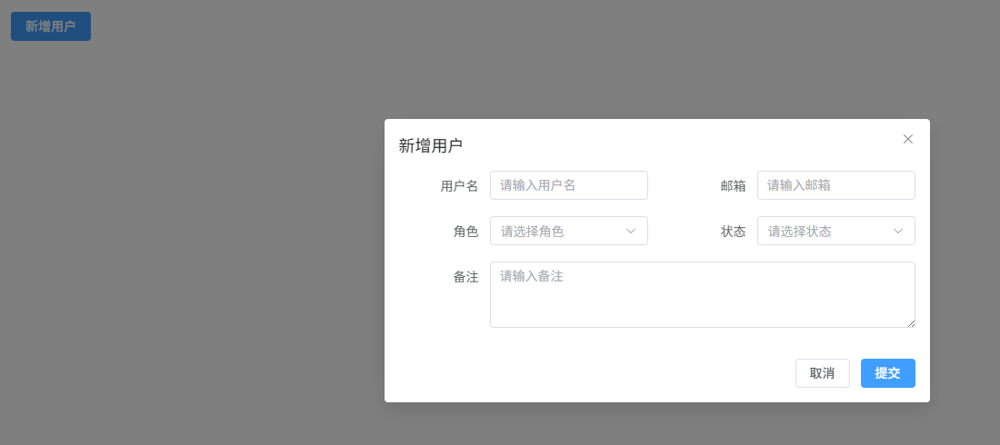

## Drawer 表单（侧边编辑）

使用 `Drawer` 从页面右侧滑出表单，适合在列表页中进行详情编辑，不会打断当前页面上下文。

```vue
<template>
  <div class="page">

    <el-button type="primary" @click="openDrawer">编辑用户</el-button>

    <el-drawer
      v-model="drawerVisible"
      title="编辑用户"
      size="500px"
    >

      <el-form
        ref="formRef"
        :model="form"
        label-width="100px"
        class="drawer-form"
      >

        <el-row :gutter="20">

          <el-col :span="24">
            <el-form-item label="用户名" prop="username">
              <el-input v-model="form.username" placeholder="请输入用户名"/>
            </el-form-item>
          </el-col>

          <el-col :span="24">
            <el-form-item label="邮箱" prop="email">
              <el-input v-model="form.email" placeholder="请输入邮箱"/>
            </el-form-item>
          </el-col>

          <el-col :span="24">
            <el-form-item label="角色" prop="role">
              <el-select v-model="form.role" placeholder="请选择角色" style="width:100%">
                <el-option label="管理员" value="admin"/>
                <el-option label="普通用户" value="user"/>
              </el-select>
            </el-form-item>
          </el-col>

          <el-col :span="24">
            <el-form-item label="状态" prop="status">
              <el-select v-model="form.status" placeholder="请选择状态" style="width:100%">
                <el-option label="启用" value="1"/>
                <el-option label="禁用" value="0"/>
              </el-select>
            </el-form-item>
          </el-col>

          <el-col :span="24">
            <el-form-item label="备注" prop="remark">
              <el-input
                v-model="form.remark"
                type="textarea"
                :rows="3"
                placeholder="请输入备注"
              />
            </el-form-item>
          </el-col>

        </el-row>

      </el-form>

      <template #footer>
        <div class="drawer-footer">
          <el-button @click="drawerVisible=false">取消</el-button>
          <el-button type="primary" @click="submitForm">提交</el-button>
        </div>
      </template>

    </el-drawer>

  </div>
</template>

<script setup lang="ts">
import { ref, reactive } from 'vue'
import type { FormInstance } from 'element-plus'

const drawerVisible = ref(false)

const formRef = ref<FormInstance>()

const form = reactive({
  username: '',
  email: '',
  role: '',
  status: '',
  remark: ''
})

const openDrawer = () => {
  drawerVisible.value = true
}

const submitForm = () => {
  console.log('提交数据', form)
  drawerVisible.value = false
}
</script>

<style lang="scss" scoped>
.page {
  padding: 24px; // 页面内边距
}

.drawer-form {
  width: 100%; // 表单宽度
}

.drawer-footer {
  text-align: right; // 按钮右对齐
}
</style>
```

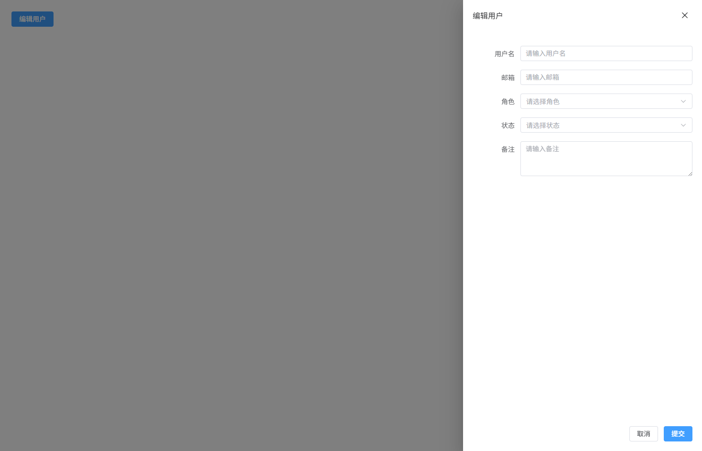


## 动态表单字段（可新增 / 删除）

用于配置类或列表类表单，例如：联系人列表、服务器配置项等，支持动态新增或删除表单行。

```vue
<template>
  <div class="form-page">

    <el-card class="form-card">

      <el-form
        ref="formRef"
        :model="form"
        label-width="100px"
        class="dynamic-form"
      >

        <div
          v-for="(item,index) in form.contacts"
          :key="index"
          class="contact-row"
        >

          <el-row :gutter="20">

            <el-col :span="8">
              <el-form-item
                label="姓名"
                :prop="`contacts.${index}.name`"
              >
                <el-input v-model="item.name" placeholder="联系人姓名"/>
              </el-form-item>
            </el-col>

            <el-col :span="8">
              <el-form-item
                label="电话"
                :prop="`contacts.${index}.phone`"
              >
                <el-input v-model="item.phone" placeholder="联系电话"/>
              </el-form-item>
            </el-col>

            <el-col :span="6">
              <el-form-item
                label="邮箱"
                :prop="`contacts.${index}.email`"
              >
                <el-input v-model="item.email" placeholder="邮箱"/>
              </el-form-item>
            </el-col>

            <el-col :span="2" class="action-col">
              <el-button
                type="danger"
                link
                @click="removeContact(index)"
              >
                删除
              </el-button>
            </el-col>

          </el-row>

        </div>

        <div class="add-btn">
          <el-button type="primary" plain @click="addContact">
            新增联系人
          </el-button>
        </div>

      </el-form>

    </el-card>

  </div>
</template>

<script setup lang="ts">
import { ref, reactive } from 'vue'
import type { FormInstance } from 'element-plus'

interface Contact {
  name: string
  phone: string
  email: string
}

const formRef = ref<FormInstance>()

const form = reactive({
  contacts: [
    {
      name: '',
      phone: '',
      email: ''
    }
  ] as Contact[]
})

const addContact = () => {
  form.contacts.push({
    name: '',
    phone: '',
    email: ''
  })
}

const removeContact = (index:number) => {
  form.contacts.splice(index,1)
}
</script>

<style lang="scss" scoped>
.form-page {
  padding: 24px; // 页面内边距
  background: #f5f7fa; // 页面背景
}

.form-card {
  max-width: 900px; // 卡片最大宽度
  margin: 0 auto; // 水平居中
}

.dynamic-form {
  width: 100%; // 表单宽度
}

.contact-row {
  margin-bottom: 12px; // 每行联系人间距
  padding: 12px; // 行内边距
  border: 1px dashed #e4e7ed; // 虚线边框
  border-radius: 6px; // 圆角
}

.action-col {
  display: flex; // flex布局
  align-items: center; // 垂直居中
  justify-content: center; // 水平居中
}

.add-btn {
  margin-top: 12px; // 按钮上边距
}
</style>
```

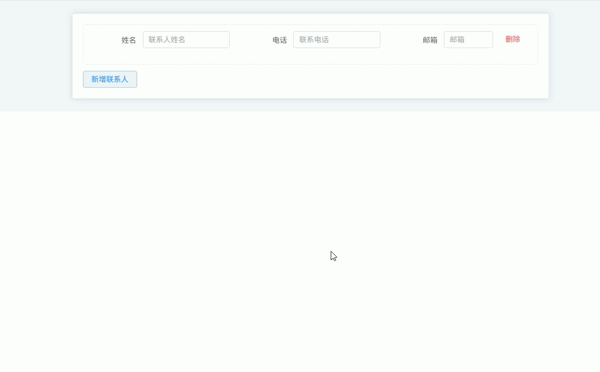


## 表单字段联动

当用户选择某个字段后，根据其值动态改变其他字段，例如：选择“用户类型”后显示不同的配置字段。

```vue
<template>
  <div class="form-page">

    <el-card class="form-card">

      <el-form
        ref="formRef"
        :model="form"
        label-width="110px"
        class="linkage-form"
      >

        <el-row :gutter="20">

          <el-col :span="12">
            <el-form-item label="用户类型" prop="userType">
              <el-select
                v-model="form.userType"
                placeholder="请选择用户类型"
                style="width:100%"
              >
                <el-option label="普通用户" value="normal"/>
                <el-option label="企业用户" value="company"/>
              </el-select>
            </el-form-item>
          </el-col>

          <el-col :span="12">
            <el-form-item label="用户名" prop="username">
              <el-input v-model="form.username" placeholder="请输入用户名"/>
            </el-form-item>
          </el-col>

          <el-col :span="12" v-if="form.userType === 'company'">
            <el-form-item label="公司名称" prop="companyName">
              <el-input v-model="form.companyName" placeholder="请输入公司名称"/>
            </el-form-item>
          </el-col>

          <el-col :span="12" v-if="form.userType === 'company'">
            <el-form-item label="公司地址" prop="companyAddress">
              <el-input v-model="form.companyAddress" placeholder="请输入公司地址"/>
            </el-form-item>
          </el-col>

          <el-col :span="12" v-if="form.userType === 'normal'">
            <el-form-item label="昵称" prop="nickname">
              <el-input v-model="form.nickname" placeholder="请输入昵称"/>
            </el-form-item>
          </el-col>

        </el-row>

        <div class="form-actions">
          <el-button type="primary" @click="submitForm">提交</el-button>
          <el-button @click="resetForm">重置</el-button>
        </div>

      </el-form>

    </el-card>

  </div>
</template>

<script setup lang="ts">
import { ref, reactive } from 'vue'
import type { FormInstance } from 'element-plus'

const formRef = ref<FormInstance>()

const form = reactive({
  userType: '',
  username: '',
  nickname: '',
  companyName: '',
  companyAddress: ''
})

const submitForm = () => {
  console.log('提交数据', form)
}

const resetForm = () => {
  formRef.value?.resetFields()
}
</script>

<style lang="scss" scoped>
.form-page {
  padding: 24px; // 页面内边距
  background: #f5f7fa; // 页面背景
}

.form-card {
  max-width: 900px; // 表单最大宽度
  margin: 0 auto; // 水平居中
}

.linkage-form {
  width: 100%; // 表单宽度
}

.form-actions {
  margin-top: 20px; // 按钮区域上边距
  text-align: center; // 按钮居中
}
</style>
```

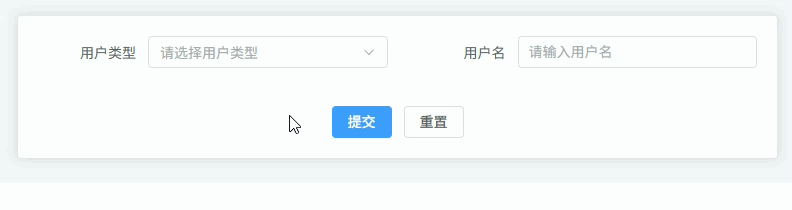

## 表单校验规则

在表单中配置校验规则，包括：必填校验、格式校验（如邮箱）、以及异步校验（例如用户名是否已存在）。

```vue
<template>
  <div class="form-page">

    <el-card class="form-card">

      <el-form
          ref="formRef"
          :model="form"
          :rules="rules"
          label-width="110px"
          class="validate-form"
      >

        <el-row :gutter="20">

          <el-col :span="12">
            <el-form-item label="用户名" prop="username">
              <el-input v-model="form.username" placeholder="请输入用户名"/>
            </el-form-item>
          </el-col>

          <el-col :span="12">
            <el-form-item label="邮箱" prop="email">
              <el-input v-model="form.email" placeholder="请输入邮箱"/>
            </el-form-item>
          </el-col>

          <el-col :span="12">
            <el-form-item label="年龄" prop="age">
              <el-input v-model="form.age" placeholder="请输入年龄"/>
            </el-form-item>
          </el-col>

        </el-row>

        <div class="form-actions">
          <el-button type="primary" @click="submitForm">提交</el-button>
          <el-button @click="resetForm">重置</el-button>
        </div>

      </el-form>

    </el-card>

  </div>
</template>

<script setup lang="ts">
import { ref, reactive } from 'vue'
import type { FormInstance, FormRules } from 'element-plus'

const formRef = ref<FormInstance>()

const form = reactive({
  username: '',
  email: '',
  age: ''
})

const checkUsername = (_rule: any, value: string, callback: any) => {
  if (!value) {
    callback()
    return
  }

  setTimeout(() => {
    if (value === 'admin') {
      callback(new Error('用户名已存在'))
    } else {
      callback()
    }
  }, 800)
}

const rules: FormRules = {
  username: [
    { required: true, message: '请输入用户名', trigger: 'blur' },
    { validator: checkUsername, trigger: 'blur' }
  ],
  email: [
    { required: true, message: '请输入邮箱', trigger: 'blur' },
    { type: 'email', message: '邮箱格式不正确', trigger: ['blur','change'] }
  ],
  age: [
    { required: true, message: '请输入年龄', trigger: 'blur' },
    { pattern: /^[0-9]+$/, message: '年龄必须为数字', trigger: 'blur' }
  ]
}

const submitForm = () => {
  formRef.value?.validate((valid) => {
    if (valid) {
      console.log('提交数据', form)
    }
  })
}

const resetForm = () => {
  formRef.value?.resetFields()
}
</script>

<style lang="scss" scoped>
.form-page {
  padding: 24px; // 页面内边距
  background: #f5f7fa; // 页面背景
}

.form-card {
  max-width: 900px; // 表单最大宽度
  margin: 0 auto; // 居中
}

.validate-form {
  width: 100%; // 表单宽度
}

.form-actions {
  margin-top: 20px; // 按钮区域上边距
  text-align: center; // 按钮居中
}
</style>
```

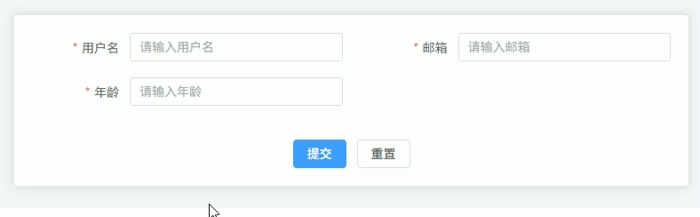

## 文件上传表单

用于上传附件或文件，例如：合同文件、文档资料等，常见于表单提交时附带文件。

```vue
<template>
  <div class="form-page">

    <el-card class="form-card">

      <el-form
        ref="formRef"
        :model="form"
        label-width="110px"
        class="upload-form"
      >

        <el-row :gutter="20">

          <el-col :span="12">
            <el-form-item label="标题" prop="title">
              <el-input v-model="form.title" placeholder="请输入标题"/>
            </el-form-item>
          </el-col>

          <el-col :span="24">
            <el-form-item label="附件上传" prop="files">
              <el-upload
                class="upload-area"
                action="#"
                :auto-upload="false"
                multiple
                :limit="5"
                v-model:file-list="fileList"
              >
                <el-button type="primary">选择文件</el-button>
                <template #tip>
                  <div class="upload-tip">
                    支持上传多个文件，最多5个
                  </div>
                </template>
              </el-upload>
            </el-form-item>
          </el-col>

        </el-row>

        <div class="form-actions">
          <el-button type="primary" @click="submitForm">提交</el-button>
          <el-button @click="resetForm">重置</el-button>
        </div>

      </el-form>

    </el-card>

  </div>
</template>

<script setup lang="ts">
import { ref, reactive } from 'vue'
import type { FormInstance, UploadUserFile } from 'element-plus'

const formRef = ref<FormInstance>()

const fileList = ref<UploadUserFile[]>([])

const form = reactive({
  title: '',
  files: []
})

const submitForm = () => {
  form.files = fileList.value
  console.log('提交数据', form)
}

const resetForm = () => {
  formRef.value?.resetFields()
  fileList.value = []
}
</script>

<style lang="scss" scoped>
.form-page {
  padding: 24px; // 页面内边距
  background: #f5f7fa; // 页面背景
}

.form-card {
  max-width: 900px; // 卡片最大宽度
  margin: 0 auto; // 居中
}

.upload-form {
  width: 100%; // 表单宽度
}

.upload-area {
  width: 100%; // 上传区域宽度
}

.upload-tip {
  font-size: 12px; // 提示文字大小
  color: #909399; // 提示文字颜色
  margin-top: 6px; // 提示上边距
}

.form-actions {
  margin-top: 20px; // 按钮区域上边距
  text-align: center; // 按钮居中
}
</style>
```

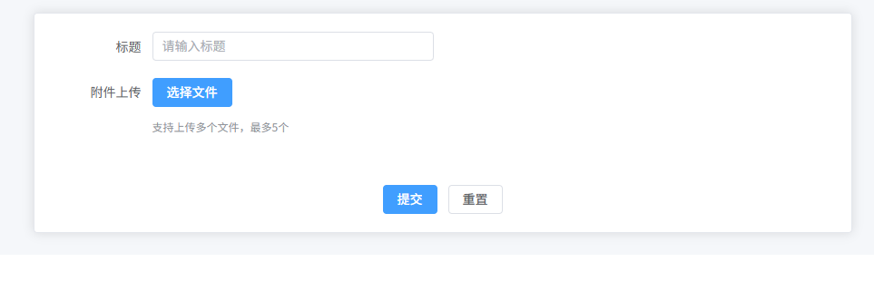

## 图片上传 + 预览表单

用于上传头像、商品图片等，支持图片列表展示和预览查看。

```vue
<template>
  <div class="form-page">

    <el-card class="form-card">

      <el-form
        ref="formRef"
        :model="form"
        label-width="110px"
        class="image-form"
      >

        <el-row :gutter="20">

          <el-col :span="12">
            <el-form-item label="商品名称" prop="name">
              <el-input v-model="form.name" placeholder="请输入商品名称"/>
            </el-form-item>
          </el-col>

          <el-col :span="24">
            <el-form-item label="商品图片" prop="images">
              <el-upload
                class="image-upload"
                action="#"
                list-type="picture-card"
                :auto-upload="false"
                v-model:file-list="fileList"
                :on-preview="handlePreview"
              >
                <el-icon class="upload-icon">
                  <Plus />
                </el-icon>
              </el-upload>

              <el-dialog v-model="previewVisible" width="500px">
                
              </el-dialog>

            </el-form-item>
          </el-col>

        </el-row>

        <div class="form-actions">
          <el-button type="primary" @click="submitForm">提交</el-button>
          <el-button @click="resetForm">重置</el-button>
        </div>

      </el-form>

    </el-card>

  </div>
</template>

<script setup lang="ts">
import { ref, reactive } from 'vue'
import type { FormInstance, UploadUserFile } from 'element-plus'
import { Plus } from '@element-plus/icons-vue'

const formRef = ref<FormInstance>()

const previewVisible = ref(false)
const previewImage = ref('')

const fileList = ref<UploadUserFile[]>([])

const form = reactive({
  name: '',
  images: []
})

const handlePreview = (file: UploadUserFile) => {
  previewImage.value = file.url || ''
  previewVisible.value = true
}

const submitForm = () => {
  form.images = fileList.value
  console.log('提交数据', form)
}

const resetForm = () => {
  formRef.value?.resetFields()
  fileList.value = []
}
</script>

<style lang="scss" scoped>
.form-page {
  padding: 24px; // 页面内边距
  background: #f5f7fa; // 页面背景色
}

.form-card {
  max-width: 900px; // 卡片最大宽度
  margin: 0 auto; // 水平居中
}

.image-form {
  width: 100%; // 表单宽度
}

.image-upload {
  width: 100%; // 上传区域宽度
}

.upload-icon {
  font-size: 20px; // 上传图标大小
}

.preview-image {
  width: 100%; // 预览图片宽度
  display: block; // 块级显示
}

.form-actions {
  margin-top: 20px; // 上边距
  text-align: center; // 按钮居中
}
</style>
```

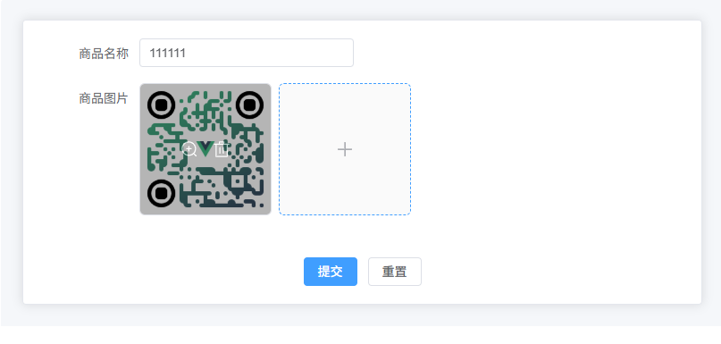

## 日期区间表单

用于选择时间范围，例如：列表查询时间范围、活动有效期设置等。

```vue
<template>
  <div class="form-page">

    <el-card class="form-card">

      <el-form
        ref="formRef"
        :model="form"
        label-width="110px"
        class="date-range-form"
      >

        <el-row :gutter="20">

          <el-col :span="12">
            <el-form-item label="活动名称" prop="name">
              <el-input v-model="form.name" placeholder="请输入活动名称"/>
            </el-form-item>
          </el-col>

          <el-col :span="12">
            <el-form-item label="负责人" prop="owner">
              <el-input v-model="form.owner" placeholder="请输入负责人"/>
            </el-form-item>
          </el-col>

          <el-col :span="24">
            <el-form-item label="活动时间" prop="dateRange">
              <el-date-picker
                v-model="form.dateRange"
                type="daterange"
                range-separator="至"
                start-placeholder="开始日期"
                end-placeholder="结束日期"
                style="width:100%"
              />
            </el-form-item>
          </el-col>

        </el-row>

        <div class="form-actions">
          <el-button type="primary" @click="submitForm">提交</el-button>
          <el-button @click="resetForm">重置</el-button>
        </div>

      </el-form>

    </el-card>

  </div>
</template>

<script setup lang="ts">
import { ref, reactive } from 'vue'
import type { FormInstance } from 'element-plus'

const formRef = ref<FormInstance>()

const form = reactive({
  name: '',
  owner: '',
  dateRange: []
})

const submitForm = () => {
  console.log('提交数据', form)
}

const resetForm = () => {
  formRef.value?.resetFields()
}
</script>

<style lang="scss" scoped>
.form-page {
  padding: 24px; // 页面内边距
  background: #f5f7fa; // 页面背景
}

.form-card {
  max-width: 900px; // 表单最大宽度
  margin: 0 auto; // 居中
}

.date-range-form {
  width: 100%; // 表单宽度
}

.form-actions {
  margin-top: 20px; // 按钮区域上边距
  text-align: center; // 按钮居中
}
</style>
```

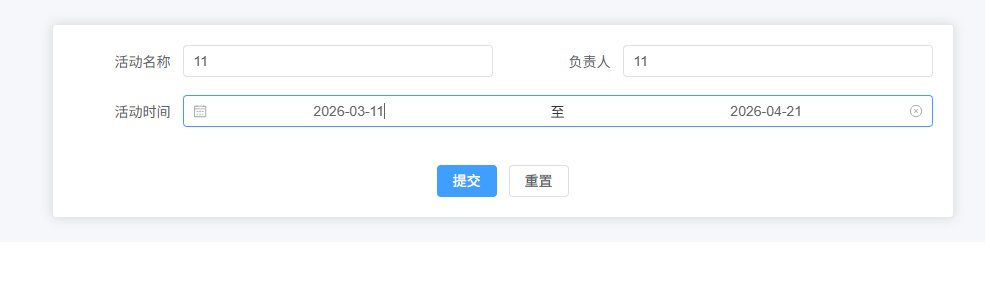

## 远程搜索 Select 表单

用于数据量较大的下拉选择，通过远程接口动态加载数据，例如：选择用户、部门、商品等。

```vue
<template>
  <div class="form-page">

    <el-card class="form-card">

      <el-form
        ref="formRef"
        :model="form"
        label-width="110px"
        class="remote-select-form"
      >

        <el-row :gutter="20">

          <el-col :span="12">
            <el-form-item label="订单名称" prop="name">
              <el-input v-model="form.name" placeholder="请输入订单名称"/>
            </el-form-item>
          </el-col>

          <el-col :span="12">
            <el-form-item label="选择用户" prop="userId">
              <el-select
                v-model="form.userId"
                filterable
                remote
                clearable
                reserve-keyword
                placeholder="请输入关键词搜索用户"
                :remote-method="remoteSearch"
                :loading="loading"
                style="width:100%"
              >
                <el-option
                  v-for="item in userOptions"
                  :key="item.id"
                  :label="item.name"
                  :value="item.id"
                />
              </el-select>
            </el-form-item>
          </el-col>

        </el-row>

        <div class="form-actions">
          <el-button type="primary" @click="submitForm">提交</el-button>
          <el-button @click="resetForm">重置</el-button>
        </div>

      </el-form>

    </el-card>

  </div>
</template>

<script setup lang="ts">
import { ref, reactive } from 'vue'
import type { FormInstance } from 'element-plus'

interface User {
  id: number
  name: string
}

const formRef = ref<FormInstance>()

const loading = ref(false)

const userOptions = ref<User[]>([])

const form = reactive({
  name: '',
  userId: ''
})

const remoteSearch = (query: string) => {
  if (!query) {
    userOptions.value = []
    return
  }

  loading.value = true

  setTimeout(() => {
    const data: User[] = [
      { id: 1, name: '张三' },
      { id: 2, name: '李四' },
      { id: 3, name: '王五' }
    ]

    userOptions.value = data.filter(item =>
      item.name.includes(query)
    )

    loading.value = false
  }, 500)
}

const submitForm = () => {
  console.log('提交数据', form)
}

const resetForm = () => {
  formRef.value?.resetFields()
}
</script>

<style lang="scss" scoped>
.form-page {
  padding: 24px; // 页面内边距
  background: #f5f7fa; // 页面背景
}

.form-card {
  max-width: 900px; // 表单最大宽度
  margin: 0 auto; // 居中
}

.remote-select-form {
  width: 100%; // 表单宽度
}

.form-actions {
  margin-top: 20px; // 按钮区域上边距
  text-align: center; // 按钮居中
}
</style>
```

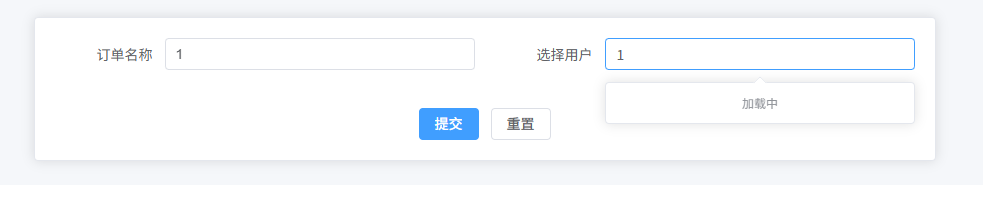

## 大型表单滚动布局

适用于字段很多的编辑页面（如：商品管理、系统配置、项目配置），页面内部滚动并按模块分区展示，减少页面跳转。

```vue
<template>
  <div class="form-page">

    <el-card class="form-card">

      <el-form
        ref="formRef"
        :model="form"
        label-width="120px"
        class="large-form"
      >

        <div class="form-scroll">

          <el-divider content-position="left">基础信息</el-divider>

          <el-row :gutter="20">

            <el-col :span="12">
              <el-form-item label="项目名称" prop="name">
                <el-input v-model="form.name" placeholder="请输入项目名称" />
              </el-form-item>
            </el-col>

            <el-col :span="12">
              <el-form-item label="负责人" prop="owner">
                <el-input v-model="form.owner" placeholder="请输入负责人" />
              </el-form-item>
            </el-col>

            <el-col :span="12">
              <el-form-item label="项目类型" prop="type">
                <el-select v-model="form.type" placeholder="请选择类型">
                  <el-option label="Web系统" value="web"/>
                  <el-option label="后台系统" value="admin"/>
                  <el-option label="移动端" value="mobile"/>
                </el-select>
              </el-form-item>
            </el-col>

          </el-row>


          <el-divider content-position="left">配置信息</el-divider>

          <el-row :gutter="20">

            <el-col :span="12">
              <el-form-item label="访问地址" prop="url">
                <el-input v-model="form.url" placeholder="请输入访问地址" />
              </el-form-item>
            </el-col>

            <el-col :span="12">
              <el-form-item label="端口" prop="port">
                <el-input-number v-model="form.port" :min="1" :max="65535" />
              </el-form-item>
            </el-col>

            <el-col :span="12">
              <el-form-item label="状态" prop="status">
                <el-switch v-model="form.status"/>
              </el-form-item>
            </el-col>

          </el-row>


          <el-divider content-position="left">高级设置</el-divider>

          <el-row :gutter="20">

            <el-col :span="24">
              <el-form-item label="备注" prop="remark">
                <el-input
                  v-model="form.remark"
                  type="textarea"
                  :rows="4"
                  placeholder="请输入备注"
                />
              </el-form-item>
            </el-col>

          </el-row>

        </div>


        <div class="form-actions">
          <el-button type="primary" @click="submitForm">提交</el-button>
          <el-button @click="resetForm">重置</el-button>
        </div>

      </el-form>

    </el-card>

  </div>
</template>

<script setup lang="ts">
import { ref, reactive } from 'vue'
import type { FormInstance } from 'element-plus'

const formRef = ref<FormInstance>()

const form = reactive({
  name: '',
  owner: '',
  type: '',
  url: '',
  port: 8080,
  status: true,
  remark: ''
})

const submitForm = () => {
  console.log('提交数据', form)
}

const resetForm = () => {
  formRef.value?.resetFields()
}
</script>

<style lang="scss" scoped>
.form-page {
  padding: 20px; // 页面内边距
  background: #f5f7fa; // 页面背景色
  height: 100vh; // 页面高度
}

.form-card {
  height: 100%; // 卡片高度
  display: flex; // flex布局
  flex-direction: column; // 垂直排列
}

.large-form {
  display: flex; // 表单使用flex
  flex-direction: column; // 垂直排列
  height: 100%; // 表单高度
}

.form-scroll {
  flex: 1; // 占据剩余空间
  overflow-y: auto; // 纵向滚动
  padding-right: 10px; // 右侧间距
}

.form-actions {
  padding-top: 16px; // 上内边距
  border-top: 1px solid #ebeef5; // 顶部分割线
  text-align: center; // 按钮居中
  background: #fff; // 背景色
}
</style>
```

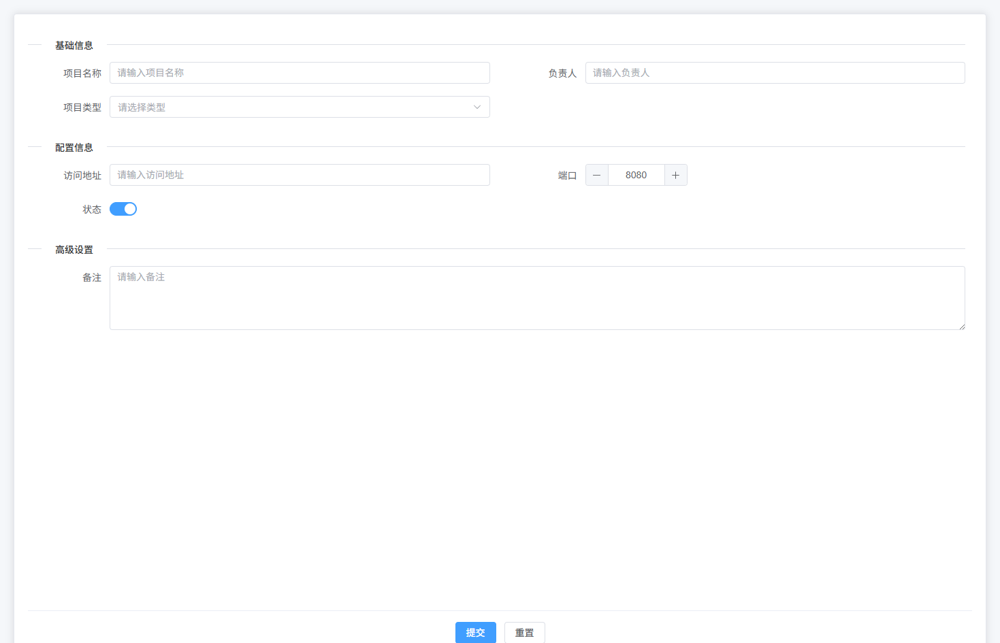