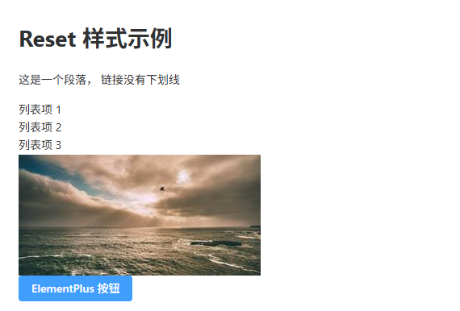
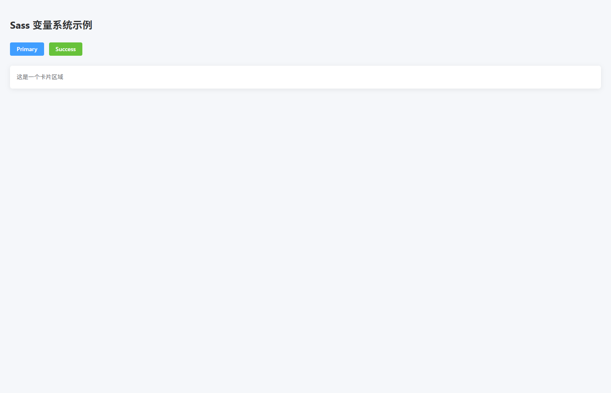
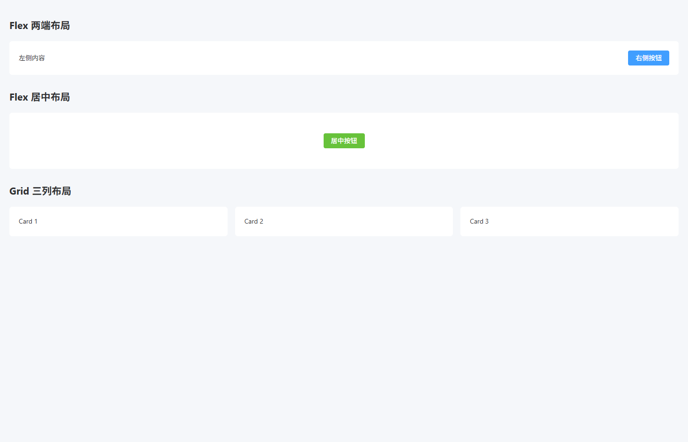
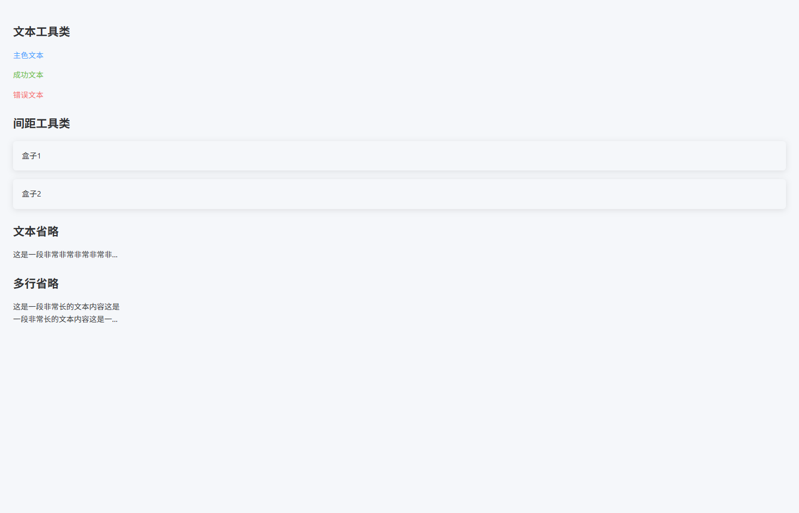
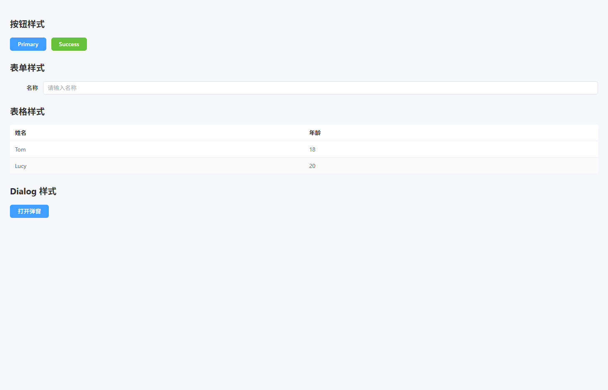
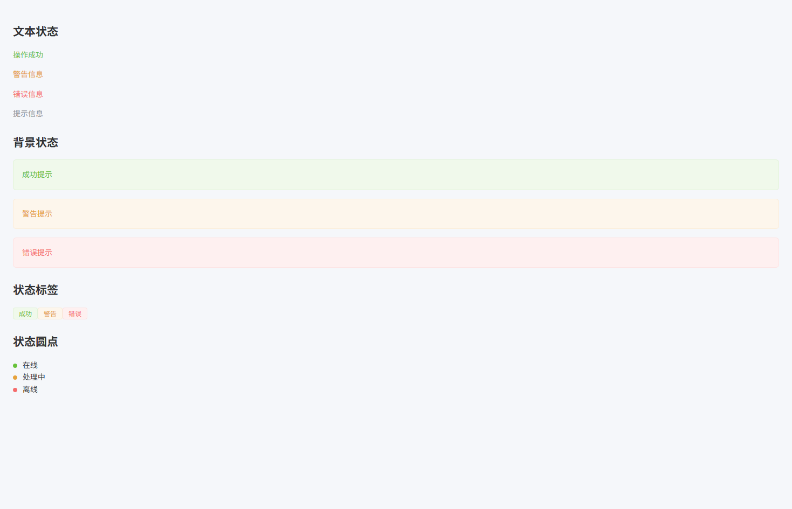
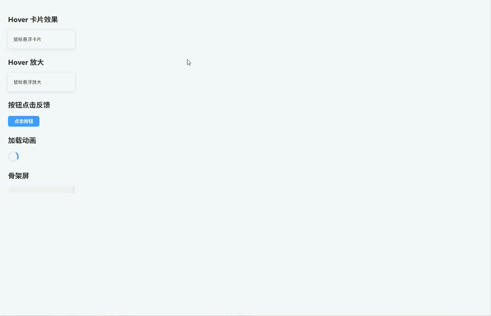
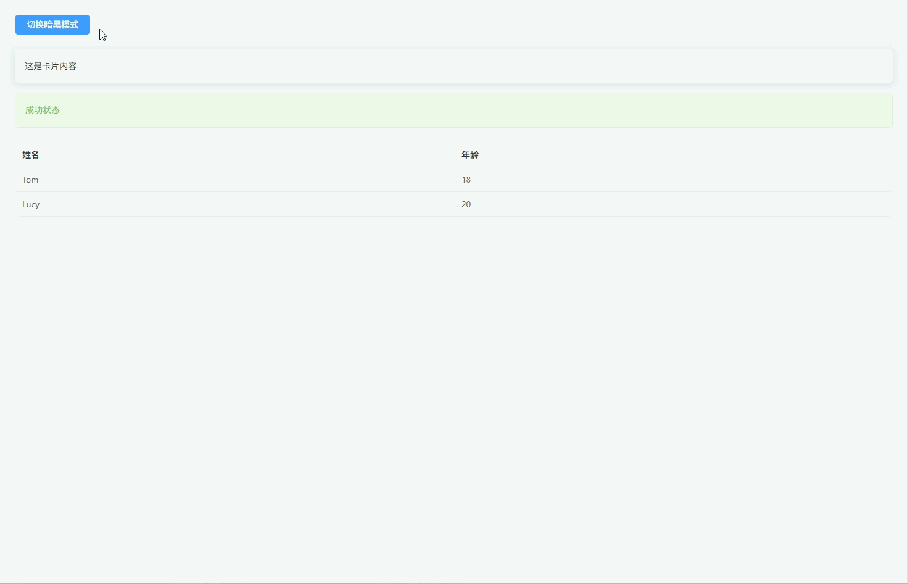

# 全局样式


## Reset + 基础样式

**全局 Reset + 基础样式（统一浏览器默认样式并在项目中全局生效）**

**src/styles/reset.scss**

```scss
/* src/styles/reset.scss */

*,
*::before,
*::after {
  box-sizing: border-box; // 统一盒模型
}

html,
body {
  margin: 0; // 去除默认外边距
  padding: 0; // 去除默认内边距
  height: 100%; // 允许子元素使用100%高度
  font-family: -apple-system, BlinkMacSystemFont, "Segoe UI", Roboto, "Helvetica Neue", Arial, sans-serif; // 全局字体
  font-size: 14px; // 基础字体大小
  line-height: 1.6; // 基础行高
  color: #303133; // 默认文字颜色
  background-color: #f5f7fa; // 页面背景色
  -webkit-font-smoothing: antialiased; // mac字体抗锯齿
  -moz-osx-font-smoothing: grayscale; // mac字体渲染优化
}

#app {
  height: 100%; // Vue根节点高度
}

a {
  text-decoration: none; // 去除下划线
  color: inherit; // 继承父元素颜色
}

ul,
ol {
  margin: 0; // 去除默认外边距
  padding: 0; // 去除默认内边距
  list-style: none; // 去除列表符号
}

img {
  max-width: 100%; // 图片最大宽度
  height: auto; // 自适应高度
  display: block; // 防止底部空隙
}

button {
  border: none; // 去除默认边框
  outline: none; // 去除点击轮廓
  background: none; // 去除默认背景
  cursor: pointer; // 鼠标手型
  font-family: inherit; // 继承字体
}

input,
textarea,
select {
  font-family: inherit; // 继承字体
  font-size: inherit; // 继承字号
  outline: none; // 去除点击轮廓
}

table {
  border-collapse: collapse; // 合并表格边框
  border-spacing: 0; // 去除间距
  width: 100%; // 表格宽度100%
}

th,
td {
  text-align: left; // 默认左对齐
  padding: 0; // 去除默认内边距
}

hr {
  border: none; // 去除默认边框
  border-top: 1px solid #e4e7ed; // 自定义分割线
  margin: 20px 0; // 上下间距
}

::selection {
  background: #409eff; // 选中文本背景色
  color: #fff; // 选中文本颜色
}
```

------

**src/main.ts**

```ts
import { createApp } from "vue"
import App from "./App.vue"
import ElementPlus from "element-plus"
import "element-plus/dist/index.css"
import "@/styles/reset.scss" // 引入全局 reset 样式

createApp(App)
  .use(ElementPlus)
  .mount("#app")
```

------

**src/views/reset-demo.vue**

```vue
<template>
  <div class="page">
    <h1>Reset 样式示例</h1>

    <p>
      这是一个段落，
      <a href="#">链接没有下划线</a>
    </p>

    <ul>
      <li>列表项 1</li>
      <li>列表项 2</li>
      <li>列表项 3</li>
    </ul>

    

    <el-button type="primary">ElementPlus 按钮</el-button>
  </div>
</template>

<style lang="scss" scoped>
.page {
  padding: 30px; // 页面内边距
  background: #fff; // 内容背景
  border-radius: 6px; // 圆角
}
</style>
```



---

## Sass 变量系统

**Sass 变量系统（统一管理项目颜色、字体、间距等设计变量）**

**src/styles/variables.scss**

```scss
$color-primary: #409eff; // 主色
$color-success: #67c23a; // 成功色
$color-warning: #e6a23c; // 警告色
$color-danger: #f56c6c; // 错误色
$color-info: #909399; // 信息色

$text-color-primary: #303133; // 主文本颜色
$text-color-regular: #606266; // 常规文本颜色
$text-color-secondary: #909399; // 次级文本颜色

$bg-color-page: #f5f7fa; // 页面背景
$bg-color-card: #ffffff; // 卡片背景

$font-size-small: 12px; // 小字体
$font-size-base: 14px; // 默认字体
$font-size-large: 18px; // 大字体
$font-size-title: 24px; // 标题字体

$spacing-xs: 4px; // 超小间距
$spacing-sm: 8px; // 小间距
$spacing-md: 16px; // 中间距
$spacing-lg: 24px; // 大间距
$spacing-xl: 32px; // 超大间距

$border-radius-small: 4px; // 小圆角
$border-radius-base: 6px; // 默认圆角
$border-radius-large: 10px; // 大圆角

$shadow-card: 0 2px 12px rgba(0, 0, 0, 0.08); // 卡片阴影
```

------

**src/main.ts**

```ts
import { createApp } from "vue"
import App from "./App.vue"
import ElementPlus from "element-plus"
import "element-plus/dist/index.css"
import "@/styles/reset.scss" // 全局reset
import "@/styles/variables.scss" // 全局变量

createApp(App)
  .use(ElementPlus)
  .mount("#app")
```

------

**src/views/sass-variable-demo.vue**

```vue
<template>
  <div class="page">
    <h1 class="title">Sass 变量系统示例</h1>

    <el-button type="primary">Primary</el-button>
    <el-button type="success">Success</el-button>

    <div class="card">
      这是一个卡片区域
    </div>
  </div>
</template>

<style lang="scss" scoped>
@use "@/styles/variables.scss" as *; // 引入变量

.page {
  padding: $spacing-lg; // 使用间距变量
  background: $bg-color-page; // 页面背景
}

.title {
  font-size: $font-size-title; // 标题字号
  color: $text-color-primary; // 文本颜色
  margin-bottom: $spacing-lg; // 下间距
}

.card {
  padding: $spacing-md; // 内边距
  background: $bg-color-card; // 卡片背景
  border-radius: $border-radius-base; // 圆角
  box-shadow: $shadow-card; // 阴影
  color: $text-color-regular; // 文本颜色
  margin-top: $spacing-lg; // 上间距
}
</style>
```



---

## 布局工具类

**布局工具类（提供常用 Flex / Grid / 容器布局的全局工具类）**

**src/styles/layout.scss**

```scss
.flex {
  display: flex; // 启用flex布局
}

.inline-flex {
  display: inline-flex; // 行内flex布局
}

.flex-center {
  display: flex; // flex布局
  align-items: center; // 垂直居中
  justify-content: center; // 水平居中
}

.flex-between {
  display: flex; // flex布局
  align-items: center; // 垂直居中
  justify-content: space-between; // 两端对齐
}

.flex-around {
  display: flex; // flex布局
  align-items: center; // 垂直居中
  justify-content: space-around; // 环绕分布
}

.flex-column {
  display: flex; // flex布局
  flex-direction: column; // 垂直排列
}

.flex-wrap {
  flex-wrap: wrap; // 允许换行
}

.flex-1 {
  flex: 1; // 占满剩余空间
}

.grid {
  display: grid; // 启用grid布局
}

.grid-2 {
  display: grid; // grid布局
  grid-template-columns: repeat(2, 1fr); // 两列
  gap: 16px; // 间距
}

.grid-3 {
  display: grid; // grid布局
  grid-template-columns: repeat(3, 1fr); // 三列
  gap: 16px; // 间距
}

.grid-4 {
  display: grid; // grid布局
  grid-template-columns: repeat(4, 1fr); // 四列
  gap: 16px; // 间距
}

.container {
  max-width: 1200px; // 最大宽度
  margin: 0 auto; // 居中
  padding: 0 20px; // 两侧间距
}

.page {
  padding: 20px; // 页面内边距
}

.section {
  margin-bottom: 24px; // 模块间距
}

.card-container {
  background: #fff; // 卡片背景
  border-radius: 6px; // 圆角
  padding: 20px; // 内边距
}
```

------

**src/main.ts**

```ts
import { createApp } from "vue"
import App from "./App.vue"
import ElementPlus from "element-plus"
import "element-plus/dist/index.css"

import "@/styles/reset.scss"
import "@/styles/layout.scss"

createApp(App)
  .use(ElementPlus)
  .mount("#app")
```

------

**src/views/layout-demo.vue**

```vue
<template>
  <div class="page">

    <div class="section">
      <h2>Flex 两端布局</h2>

      <div class="flex-between card-container">
        <span>左侧内容</span>
        <el-button type="primary">右侧按钮</el-button>
      </div>
    </div>

    <div class="section">
      <h2>Flex 居中布局</h2>

      <div class="flex-center card-container" style="height:120px">
        <el-button type="success">居中按钮</el-button>
      </div>
    </div>

    <div class="section">
      <h2>Grid 三列布局</h2>

      <div class="grid-3">
        <div class="card-container">Card 1</div>
        <div class="card-container">Card 2</div>
        <div class="card-container">Card 3</div>
      </div>
    </div>

  </div>
</template>

<script setup lang="ts">
</script>

<style scoped lang="scss">
.section {
  margin-bottom: 30px; // 模块间距
}
</style>
```



---

## 常用 Utility 类

**常用 Utility 类（提供常见间距、文本、宽高、显示等工具类）**

**src/styles/utilities.scss**

```scss
.m-0 { margin: 0; } // 外边距0
.mt-8 { margin-top: 8px; } // 上外边距
.mt-16 { margin-top: 16px; } // 上外边距
.mt-24 { margin-top: 24px; } // 上外边距
.mb-8 { margin-bottom: 8px; } // 下外边距
.mb-16 { margin-bottom: 16px; } // 下外边距
.mb-24 { margin-bottom: 24px; } // 下外边距

.p-8 { padding: 8px; } // 内边距
.p-16 { padding: 16px; } // 内边距
.p-24 { padding: 24px; } // 内边距

.text-left { text-align: left; } // 左对齐
.text-center { text-align: center; } // 居中
.text-right { text-align: right; } // 右对齐

.text-primary { color: #409eff; } // 主色文本
.text-success { color: #67c23a; } // 成功文本
.text-warning { color: #e6a23c; } // 警告文本
.text-danger { color: #f56c6c; } // 错误文本
.text-info { color: #909399; } // 信息文本

.w-full { width: 100%; } // 宽度100%
.w-200 { width: 200px; } // 固定宽度

.h-full { height: 100%; } // 高度100%
.h-100 { height: 100px; } // 固定高度

.rounded { border-radius: 6px; } // 默认圆角
.rounded-lg { border-radius: 12px; } // 大圆角

.shadow { box-shadow: 0 2px 12px rgba(0,0,0,0.1); } // 阴影

.cursor-pointer { cursor: pointer; } // 鼠标手型

.hidden { display: none; } // 隐藏元素
.block { display: block; } // 块元素
.inline-block { display: inline-block; } // 行内块元素

.ellipsis {
  overflow: hidden; // 超出隐藏
  white-space: nowrap; // 单行文本
  text-overflow: ellipsis; // 文本省略
}

.line-clamp-2 {
  display: -webkit-box; // 弹性盒子
  -webkit-line-clamp: 2; // 显示两行
  -webkit-box-orient: vertical; // 垂直排列
  overflow: hidden; // 超出隐藏
}
```

------

**src/main.ts**

```ts
import { createApp } from "vue"
import App from "./App.vue"
import ElementPlus from "element-plus"
import "element-plus/dist/index.css"

import "@/styles/reset.scss"
import "@/styles/layout.scss"
import "@/styles/utilities.scss"

createApp(App)
  .use(ElementPlus)
  .mount("#app")
```

------

**src/views/util-demo.vue**

```vue
<template>
  <div class="p-24">

    <h2 class="mb-16">文本工具类</h2>

    <p class="text-primary">主色文本</p>
    <p class="text-success">成功文本</p>
    <p class="text-danger">错误文本</p>

    <h2 class="mt-24 mb-16">间距工具类</h2>

    <div class="p-16 shadow rounded mb-16">
      盒子1
    </div>

    <div class="p-16 shadow rounded">
      盒子2
    </div>

    <h2 class="mt-24 mb-16">文本省略</h2>

    <div class="w-200 ellipsis">
      这是一段非常非常非常非常非常长的文本内容
    </div>

    <h2 class="mt-24 mb-16">多行省略</h2>

    <div class="w-200 line-clamp-2">
      这是一段非常长的文本内容这是一段非常长的文本内容这是一段非常长的文本内容这是一段非常长的文本内容
    </div>

  </div>
</template>

<script setup lang="ts">
</script>

<style scoped lang="scss">
</style>
```



---

## ElementPlus 覆盖样式

**ElementPlus 全局覆盖样式（统一按钮、表格、表单、Dialog 等组件样式）**

**src/styles/element.scss**

```scss
.el-button {
  border-radius: 6px; // 按钮圆角
  font-weight: 500; // 字体粗细
  padding: 8px 18px; // 内边距
}

.el-button--primary {
  background: #409eff; // 主按钮背景
  border-color: #409eff; // 主按钮边框
}

.el-button--primary:hover {
  background: #66b1ff; // hover背景
  border-color: #66b1ff; // hover边框
}

.el-table {
  border-radius: 6px; // 表格圆角
  overflow: hidden; // 防止边框溢出
}

.el-table th {
  background: #f5f7fa; // 表头背景
  color: #303133; // 表头文字
  font-weight: 600; // 字体粗细
}

.el-table__row:hover > td {
  background: #f0f9ff; // 行hover背景
}

.el-table--striped .el-table__row:nth-child(2n) td {
  background: #fafafa; // 斑马纹背景
}

.el-form-item__label {
  font-weight: 500; // label字体
  color: #303133; // label颜色
}

.el-input__wrapper {
  border-radius: 6px; // 输入框圆角
}

.el-input__wrapper.is-focus {
  box-shadow: 0 0 0 1px #409eff inset; // focus边框
}

.el-dialog {
  border-radius: 8px; // 弹窗圆角
}

.el-dialog__header {
  border-bottom: 1px solid #ebeef5; // 头部边框
  padding-bottom: 10px; // 下内边距
}

.el-dialog__body {
  padding: 20px; // 内容区内边距
}

.el-card {
  border-radius: 6px; // 卡片圆角
  box-shadow: 0 2px 12px rgba(0,0,0,0.08); // 卡片阴影
}

.el-tag {
  border-radius: 4px; // tag圆角
}

.el-pagination {
  margin-top: 20px; // 分页上间距
  justify-content: center; // 分页居中
}
```

------

**src/main.ts**

```ts
import { createApp } from "vue"
import App from "./App.vue"
import ElementPlus from "element-plus"
import "element-plus/dist/index.css"

import "@/styles/reset.scss"
import "@/styles/layout.scss"
import "@/styles/utilities.scss"
import "@/styles/element.scss"

createApp(App)
  .use(ElementPlus)
  .mount("#app")
```

------

**src/views/element-demo.vue**

```vue
<template>
  <div class="p-24">

    <h2 class="mb-16">按钮样式</h2>

    <el-button type="primary">Primary</el-button>
    <el-button type="success">Success</el-button>

    <h2 class="mt-24 mb-16">表单样式</h2>

    <el-form label-width="80px">
      <el-form-item label="名称">
        <el-input placeholder="请输入名称" />
      </el-form-item>
    </el-form>

    <h2 class="mt-24 mb-16">表格样式</h2>

    <el-table :data="tableData" stripe style="width:100%">
      <el-table-column prop="name" label="姓名" />
      <el-table-column prop="age" label="年龄" />
    </el-table>

    <h2 class="mt-24 mb-16">Dialog 样式</h2>

    <el-button type="primary" @click="visible = true">
      打开弹窗
    </el-button>

    <el-dialog v-model="visible" title="示例弹窗">
      内容区域
    </el-dialog>

  </div>
</template>

<script setup lang="ts">
import { ref } from "vue"

const visible = ref(false)

const tableData = [
  { name: "Tom", age: 18 },
  { name: "Lucy", age: 20 }
]
</script>

<style scoped lang="scss">
</style>
```



---

## 状态样式

**状态样式（统一成功、警告、错误、信息等状态展示）**

**src/styles/status.scss**

```scss
.status-success {
  color: #67c23a; // 成功文字颜色
}

.status-warning {
  color: #e6a23c; // 警告文字颜色
}

.status-danger {
  color: #f56c6c; // 错误文字颜色
}

.status-info {
  color: #909399; // 信息文字颜色
}

.bg-success {
  background: #f0f9eb; // 成功背景
  color: #67c23a; // 成功文字
  border: 1px solid #e1f3d8; // 成功边框
}

.bg-warning {
  background: #fdf6ec; // 警告背景
  color: #e6a23c; // 警告文字
  border: 1px solid #faecd8; // 警告边框
}

.bg-danger {
  background: #fef0f0; // 错误背景
  color: #f56c6c; // 错误文字
  border: 1px solid #fde2e2; // 错误边框
}

.bg-info {
  background: #f4f4f5; // 信息背景
  color: #909399; // 信息文字
  border: 1px solid #e9e9eb; // 信息边框
}

.status-badge {
  display: inline-block; // 行内块
  padding: 4px 10px; // 内边距
  border-radius: 4px; // 圆角
  font-size: 12px; // 字号
  line-height: 1; // 行高
}

.status-dot {
  display: inline-block; // 行内块
  width: 8px; // 圆点宽
  height: 8px; // 圆点高
  border-radius: 50%; // 圆形
  margin-right: 6px; // 右间距
}

.dot-success {
  background: #67c23a; // 成功圆点
}

.dot-warning {
  background: #e6a23c; // 警告圆点
}

.dot-danger {
  background: #f56c6c; // 错误圆点
}

.dot-info {
  background: #909399; // 信息圆点
}
```

------

**src/main.ts**

```ts
import { createApp } from "vue"
import App from "./App.vue"
import ElementPlus from "element-plus"
import "element-plus/dist/index.css"

import "@/styles/reset.scss"
import "@/styles/layout.scss"
import "@/styles/utilities.scss"
import "@/styles/element.scss"
import "@/styles/status.scss"

createApp(App)
  .use(ElementPlus)
  .mount("#app")
```

------

**src/views/status-demo.vue**

```vue
<template>
  <div class="p-24">

    <h2 class="mb-16">文本状态</h2>

    <p class="status-success">操作成功</p>
    <p class="status-warning">警告信息</p>
    <p class="status-danger">错误信息</p>
    <p class="status-info">提示信息</p>

    <h2 class="mt-24 mb-16">背景状态</h2>

    <div class="bg-success p-16 rounded mb-16">
      成功提示
    </div>

    <div class="bg-warning p-16 rounded mb-16">
      警告提示
    </div>

    <div class="bg-danger p-16 rounded mb-16">
      错误提示
    </div>

    <h2 class="mt-24 mb-16">状态标签</h2>

    <span class="status-badge bg-success">成功</span>
    <span class="status-badge bg-warning">警告</span>
    <span class="status-badge bg-danger">错误</span>

    <h2 class="mt-24 mb-16">状态圆点</h2>

    <div>
      <span class="status-dot dot-success"></span>
      在线
    </div>

    <div>
      <span class="status-dot dot-warning"></span>
      处理中
    </div>

    <div>
      <span class="status-dot dot-danger"></span>
      离线
    </div>

  </div>
</template>

<script setup lang="ts">
</script>

<style scoped lang="scss">
</style>
```



---

## 动画与交互

**动画与交互（提供常用 Hover、点击反馈、加载动画等交互效果）**

**src/styles/animation.scss**

```scss
.hover-up {
  transition: all 0.2s ease; // 过渡动画
}

.hover-up:hover {
  transform: translateY(-4px); // 上移效果
  box-shadow: 0 6px 20px rgba(0,0,0,0.12); // 悬浮阴影
}

.hover-scale {
  transition: transform 0.2s ease; // 过渡动画
}

.hover-scale:hover {
  transform: scale(1.05); // 放大效果
}

.btn-click {
  transition: transform 0.1s ease; // 点击动画
}

.btn-click:active {
  transform: scale(0.95); // 点击缩小
}

.fade-enter-active,
.fade-leave-active {
  transition: opacity 0.3s ease; // 透明度过渡
}

.fade-enter-from,
.fade-leave-to {
  opacity: 0; // 初始透明
}

.rotate-loading {
  width: 32px; // 宽度
  height: 32px; // 高度
  border: 4px solid #e4e7ed; // 外圈颜色
  border-top-color: #409eff; // 顶部颜色
  border-radius: 50%; // 圆形
  animation: rotate 1s linear infinite; // 旋转动画
}

@keyframes rotate {
  from {
    transform: rotate(0deg); // 起始角度
  }
  to {
    transform: rotate(360deg); // 结束角度
  }
}

.skeleton {
  background: linear-gradient(
    90deg,
    #f2f2f2 25%,
    #e6e6e6 37%,
    #f2f2f2 63%
  ); // 渐变背景
  background-size: 400% 100%; // 背景尺寸
  animation: skeleton-loading 1.4s ease infinite; // 骨架屏动画
  border-radius: 4px; // 圆角
}

@keyframes skeleton-loading {
  0% {
    background-position: 100% 50%; // 起始位置
  }
  100% {
    background-position: 0 50%; // 结束位置
  }
}
```

------

**src/main.ts**

```ts
import { createApp } from "vue"
import App from "./App.vue"
import ElementPlus from "element-plus"
import "element-plus/dist/index.css"

import "@/styles/reset.scss"
import "@/styles/layout.scss"
import "@/styles/utilities.scss"
import "@/styles/element.scss"
import "@/styles/status.scss"
import "@/styles/animation.scss"

createApp(App)
  .use(ElementPlus)
  .mount("#app")
```

------

**src/views/animation-demo.vue**

```vue
<template>
  <div class="p-24">

    <h2 class="mb-16">Hover 卡片效果</h2>

    <div class="card hover-up p-16 rounded shadow w-200 mb-16">
      鼠标悬浮卡片
    </div>

    <h2 class="mt-24 mb-16">Hover 放大</h2>

    <div class="card hover-scale p-16 rounded shadow w-200">
      鼠标悬浮放大
    </div>

    <h2 class="mt-24 mb-16">按钮点击反馈</h2>

    <el-button class="btn-click" type="primary">
      点击按钮
    </el-button>

    <h2 class="mt-24 mb-16">加载动画</h2>

    <div class="rotate-loading"></div>

    <h2 class="mt-24 mb-16">骨架屏</h2>

    <div class="skeleton" style="width:200px;height:20px"></div>

  </div>
</template>

<script setup lang="ts">
</script>

<style scoped lang="scss">
.card {
  background: #fff; // 卡片背景
}
</style>
```



---

## 暗黑模式

**暗黑模式（通过 `dark` 类切换全局 Dark Mode 主题）**

**src/styles/dark.scss**

```scss
.dark {
  background: #141414; // 页面背景
  color: #e5eaf3; // 默认文字颜色
}

.dark body {
  background: #141414; // body背景
}

.dark .card {
  background: #1d1e1f; // 卡片背景
  color: #e5eaf3; // 卡片文字
}

.dark .section {
  background: #1d1e1f; // 区块背景
}

.dark .el-card {
  background: #1d1e1f; // ElementPlus Card背景
  border-color: #303030; // 边框颜色
  color: #e5eaf3; // 文字颜色
}

.dark .el-table {
  background: #1d1e1f; // 表格背景
  color: #e5eaf3; // 表格文字
}

.dark .el-table th {
  background: #1a1a1a; // 表头背景
  color: #e5eaf3; // 表头文字
}

.dark .el-table__row:hover > td {
  background: #262727; // hover背景
}

.dark .el-input__wrapper {
  background: #1d1e1f; // 输入框背景
  border-color: #3a3a3a; // 输入框边框
}

.dark .el-dialog {
  background: #1d1e1f; // 弹窗背景
}

.dark .el-button {
  border-color: #3a3a3a; // 按钮边框
}

.dark .bg-success {
  background: rgba(103,194,58,0.15); // 成功背景
}

.dark .bg-warning {
  background: rgba(230,162,60,0.15); // 警告背景
}

.dark .bg-danger {
  background: rgba(245,108,108,0.15); // 错误背景
}
```

------

**src/main.ts**

```ts
import { createApp } from "vue"
import App from "./App.vue"
import ElementPlus from "element-plus"
import "element-plus/dist/index.css"

import "@/styles/reset.scss"
import "@/styles/layout.scss"
import "@/styles/utilities.scss"
import "@/styles/element.scss"
import "@/styles/status.scss"
import "@/styles/animation.scss"
import "@/styles/dark.scss"

createApp(App)
  .use(ElementPlus)
  .mount("#app")
```

------

**src/views/dark-demo.vue**

```vue
<template>
  <div class="p-24">

    <el-button type="primary" @click="toggleDark">
      切换暗黑模式
    </el-button>

    <div class="card p-16 rounded shadow mt-24">
      这是卡片内容
    </div>

    <div class="bg-success p-16 rounded mt-16">
      成功状态
    </div>

    <el-table :data="tableData" stripe class="mt-24">
      <el-table-column prop="name" label="姓名" />
      <el-table-column prop="age" label="年龄" />
    </el-table>

  </div>
</template>

<script setup lang="ts">
import { ref } from "vue"

const isDark = ref(false)

const toggleDark = () => {
  isDark.value = !isDark.value
  document.documentElement.classList.toggle("dark") // 切换dark类
}

const tableData = [
  { name: "Tom", age: 18 },
  { name: "Lucy", age: 20 }
]
</script>

<style scoped lang="scss">
.card {
  background: #fff; // 卡片背景
}
</style>
```

