# Vue Router

------

## 一、基础能力（必须掌握）

### 基础路由配置（createRouter）

**功能描述：**
创建 Vue3 项目的基础路由，包含首页和关于页，并完成 Router 挂载。

------

#### 1. 项目结构（简化）

```
src/
 ├─ router/
 │   └─ index.ts
 ├─ views/
 │   ├─ Home.vue
 │   └─ About.vue
 ├─ App.vue
 └─ main.ts
```

------

#### 2. 路由配置（router/index.ts）

```ts
// 引入 Vue Router 核心方法
import { createRouter, createWebHistory, type RouteRecordRaw } from 'vue-router'

// 路由组件（也可以使用懒加载）
import Home from '@/views/Home.vue'
import About from '@/views/About.vue'

// 路由表（TypeScript 推荐使用 RouteRecordRaw 类型）
const routes: Array<RouteRecordRaw> = [
    {
        path: '/', // 路径
        name: 'Home', // 路由名称（建议唯一）
        component: Home, // 对应组件
    },
    {
        path: '/about',
        name: 'About',
        component: About,
    },
]

// 创建路由实例
const router = createRouter({
    history: createWebHistory(), // 使用 H5 history 模式（推荐）
    routes, // 挂载路由表
})

export default router
```

------

#### 3. 挂载路由（main.ts）

```ts
import { createApp } from 'vue'
import App from './App.vue'

// 引入路由
import router from './router'

// ElementPlus
import ElementPlus from 'element-plus'
import 'element-plus/dist/index.css'

const app = createApp(App)

// 使用插件
app.use(router)
app.use(ElementPlus)

// 挂载
app.mount('#app')
```

------

#### 4. 页面组件（views/Home.vue）

```vue
<template>
  <div>
    <h2>首页</h2>

    <!-- 路由跳转 -->
    <el-button type="primary" @click="goAbout">
      去关于页
    </el-button>
  </div>
</template>

<script setup lang="ts">
import { useRouter } from 'vue-router'

// 获取路由实例
const router = useRouter()

// 跳转方法
const goAbout = () => {
  router.push('/about')
}
</script>
```

------

#### 5. 页面组件（views/About.vue）

```vue
<template>
  <div>
    <h2>关于页</h2>

    <el-button @click="goHome">
      返回首页
    </el-button>
  </div>
</template>

<script setup lang="ts">
import { useRouter } from 'vue-router'

const router = useRouter()

const goHome = () => {
  router.push('/')
}
</script>
```

------

#### 6. 根组件（App.vue）

```vue
<template>
  <!-- 路由出口（页面切换位置） -->
  <router-view />
</template>

<script setup lang="ts">
// 根组件一般无需逻辑
</script>
```

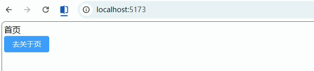

------

### 路由跳转（编程式 / 声明式）

**功能描述：**
实现 Vue Router 中最常用的两种跳转方式：

- 编程式跳转（JS 控制，常用于逻辑处理）
- 声明式跳转（模板中直接使用，适合简单跳转）

------

#### 1. 声明式跳转（router-link）（Home.vue）

```vue
<template>
  <div>
    <h2>声明式跳转</h2>

    <!-- 方式1：字符串路径 -->
    <router-link to="/about">
      <el-button type="primary">去关于页</el-button>
    </router-link>

    <!-- 方式2：对象写法（推荐，方便扩展） -->
    <router-link :to="{ name: 'About' }">
      <el-button type="success">通过 name 跳转</el-button>
    </router-link>

    <!-- 方式3：携带 query 参数 -->
    <router-link
      :to="{ name: 'About', query: { id: 1, name: 'vue' } }"
    >
      <el-button type="warning">带参数跳转</el-button>
    </router-link>
  </div>
</template>

<script setup lang="ts">
// 声明式跳转无需 JS 逻辑
</script>
```

------

#### 2. 编程式跳转（useRouter）（Home.vue）

```vue
<template>
  <div>
    <h2>编程式跳转</h2>

    <el-button type="primary" @click="goAbout">
      普通跳转
    </el-button>

    <el-button type="success" @click="goByName">
      name 跳转
    </el-button>

    <el-button type="warning" @click="goWithQuery">
      携带参数
    </el-button>

    <el-button type="danger" @click="replacePage">
      替换当前页面
    </el-button>

    <el-button @click="goBack">
      返回上一页
    </el-button>
  </div>
</template>

<script setup lang="ts">
import { useRouter } from 'vue-router'

// 获取 router 实例
const router = useRouter()

// 1. 普通路径跳转
const goAbout = () => {
  router.push('/about')
}

// 2. 通过 name 跳转（推荐，避免路径变更影响）
const goByName = () => {
  router.push({ name: 'About' })
}

// 3. 携带 query 参数（URL 会显示 ?id=1）
const goWithQuery = () => {
  router.push({
    name: 'About',
    query: {
      id: '1',
      keyword: 'vue3',
    },
  })
}

// 4. 替换当前页面（不会留下历史记录）
const replacePage = () => {
  router.replace('/about')
}

// 5. 返回上一页（类似浏览器后退）
const goBack = () => {
  router.back()
  // 等价写法：
  // router.go(-1)
}
</script>
```

------

#### 3. 接收参数（About.vue）

```vue
<template>
  <div>
    <h2>关于页</h2>

    <p>id: {{ route.query.id }}</p>
    <p>keyword: {{ route.query.keyword }}</p>
  </div>
</template>

<script setup lang="ts">
import { useRoute } from 'vue-router'

// 获取当前路由信息
const route = useRoute()

// route.query 用于获取 query 参数
</script>
```

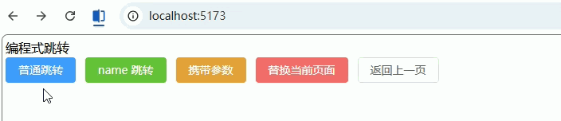

------

### 路由参数（params / query）

**功能描述：**
实现两种常见参数传递方式：

- `query`：URL 显示 `?id=1`（常用于查询条件）
- `params`：URL 显示 `/user/1`（常用于资源标识）

------

#### 1. 路由配置（router/index.ts）

```ts
import { createRouter, createWebHistory, type RouteRecordRaw } from 'vue-router'

// 页面组件（建议懒加载，这里先直引方便理解）
import Home from '@/views/Home.vue'
import User from '@/views/User.vue'

const routes: Array<RouteRecordRaw> = [
  {
    path: '/',
    name: 'Home',
    component: Home,
  },
  {
    // params 必须在 path 中声明占位符
    path: '/user/:id',
    name: 'User',
    component: User,
  },
]

const router = createRouter({
  history: createWebHistory(),
  routes,
})

export default router
```

------

#### 2. 发送参数（Home.vue）

```vue
<!-- 文件：src/views/Home.vue -->
<template>
  <div>
    <h2>首页</h2>

    <!-- ===== query 方式 ===== -->
    <el-button type="primary" @click="goWithQuery">
      query 参数跳转
    </el-button>

    <!-- ===== params 方式 ===== -->
    <el-button type="success" @click="goWithParams">
      params 参数跳转
    </el-button>
  </div>
</template>

<script setup lang="ts">
import { useRouter } from 'vue-router'

const router = useRouter()

// 1. query 参数（URL: /user?id=1）
const goWithQuery = () => {
  router.push({
    path: '/user/1', // 注意：这里仍然需要 path
    query: {
      name: 'vue3',
      age: '18',
    },
  })
}

// 2. params 参数（URL: /user/1）
const goWithParams = () => {
  router.push({
    name: 'User', // ⚠️ params 必须使用 name
    params: {
      id: '1',
    },
  })
}
</script>
```

------

#### 3. 接收参数（User.vue）

```vue
<!-- 文件：src/views/User.vue -->
<template>
  <div>
    <h2>用户页</h2>

    <el-card>
      <p><b>params.id：</b>{{ route.params.id }}</p>
      <p><b>query.name：</b>{{ route.query.name }}</p>
      <p><b>query.age：</b>{{ route.query.age }}</p>
    </el-card>
  </div>
</template>

<script setup lang="ts">
import { useRoute } from 'vue-router'

// 获取当前路由
const route = useRoute()

// params：动态路径参数
// query：URL 查询参数
</script>
```

------

#### 4. 声明式传参（补充）

```vue
<!-- 文件：任意组件 -->
<template>
  <div>
    <!-- query 方式 -->
    <router-link
      :to="{ path: '/user/1', query: { name: 'vue3' } }"
    >
      query 跳转
    </router-link>

    <!-- params 方式 -->
    <router-link
      :to="{ name: 'User', params: { id: '2' } }"
    >
      params 跳转
    </router-link>
  </div>
</template>
```

------

### 路由重定向（redirect）

**功能描述：**
将某个路径自动跳转到指定路由，常用于：默认首页、旧地址兼容、简化路径等。

------

#### 1. 基础重定向（router/index.ts）

```ts
// 文件：src/router/index.ts

import { createRouter, createWebHistory, type RouteRecordRaw } from 'vue-router'

// 页面组件
import Home from '@/views/Home.vue'
import About from '@/views/About.vue'

const routes: Array<RouteRecordRaw> = [
  {
    path: '/',
    // 访问根路径时，自动跳转到 /home
    redirect: '/home',
  },
  {
    path: '/home',
    name: 'Home',
    component: Home,
  },
  {
    path: '/about',
    name: 'About',
    component: About,
  },
]

const router = createRouter({
  history: createWebHistory(),
  routes,
})

export default router
```

------

#### 2. 通过 name 重定向（推荐）

```ts
// 文件：src/router/index.ts

{
  path: '/',
  redirect: { name: 'Home' }, // 推荐写法（更安全）
}
```

------

#### 3. 动态重定向（函数写法）

```ts
// 文件：src/router/index.ts

{
  path: '/old-user/:id',
  // 根据参数动态跳转
  redirect: (to) => {
    return {
      name: 'User',
      params: { id: to.params.id },
    }
  },
}
```

------

#### 4. 嵌套路由默认重定向（后台常用）

```ts
// 文件：src/router/index.ts

{
  path: '/system',
  component: () => import('@/layouts/Layout.vue'),
  redirect: '/system/user', // 进入 /system 默认跳到子路由
  children: [
    {
      path: 'user',
      name: 'UserManage',
      component: () => import('@/views/system/User.vue'),
    },
    {
      path: 'role',
      name: 'RoleManage',
      component: () => import('@/views/system/Role.vue'),
    },
  ],
}
```

------

#### 5. 页面示例（Home.vue）

```vue
<!-- 文件：src/views/Home.vue -->
<template>
  <div>
    <h2>首页</h2>

    <el-button @click="goRoot">
      跳转到 /
    </el-button>
  </div>
</template>

<script setup lang="ts">
import { useRouter } from 'vue-router'

const router = useRouter()

// 实际会被重定向到 /home
const goRoot = () => {
  router.push('/')
}
</script>
```

------

### 404 页面（兜底路由）

**功能描述：**
当用户访问不存在的路径时，统一跳转到 404 页面（企业项目必备）。

------

#### 1. 路由配置（router/index.ts）

```ts
// 文件：src/router/index.ts

import { createRouter, createWebHistory, type RouteRecordRaw } from 'vue-router'

import Home from '@/views/Home.vue'
import NotFound from '@/views/404.vue'

const routes: Array<RouteRecordRaw> = [
  {
    path: '/',
    redirect: '/home',
  },
  {
    path: '/home',
    name: 'Home',
    component: Home,
  },

  // ===== 404 页面 =====
  {
    path: '/404',
    name: 'NotFound',
    component: NotFound,
  },

  // ===== 兜底路由（必须放最后）=====
  {
    path: '/:pathMatch(.*)*', // Vue Router4 写法
    redirect: '/404',
  },
]

const router = createRouter({
  history: createWebHistory(),
  routes,
})

export default router
```

------

#### 2. 404 页面（404.vue）

```vue
<!-- 文件：src/views/404.vue -->
<template>
  <div class="not-found">
    <el-result
      icon="error"
      title="404"
      sub-title="页面不存在"
    >
      <template #extra>
        <el-button type="primary" @click="goHome">
          返回首页
        </el-button>
      </template>
    </el-result>
  </div>
</template>

<script setup lang="ts">
import { useRouter } from 'vue-router'

const router = useRouter()

// 返回首页
const goHome = () => {
  router.push('/home')
}
</script>

<style scoped>
.not-found {
  height: 100vh;
  display: flex;
  justify-content: center;
  align-items: center;
}
</style>
```

------

#### 3. 测试示例（任意页面）

```vue
<!-- 文件：src/views/Home.vue -->
<template>
  <div>
    <h2>首页</h2>

    <el-button @click="go404">
      跳转不存在页面
    </el-button>
  </div>
</template>

<script setup lang="ts">
import { useRouter } from 'vue-router'

const router = useRouter()

// 随便跳一个不存在的路径
const go404 = () => {
  router.push('/xxx/yyy')
}
</script>
```

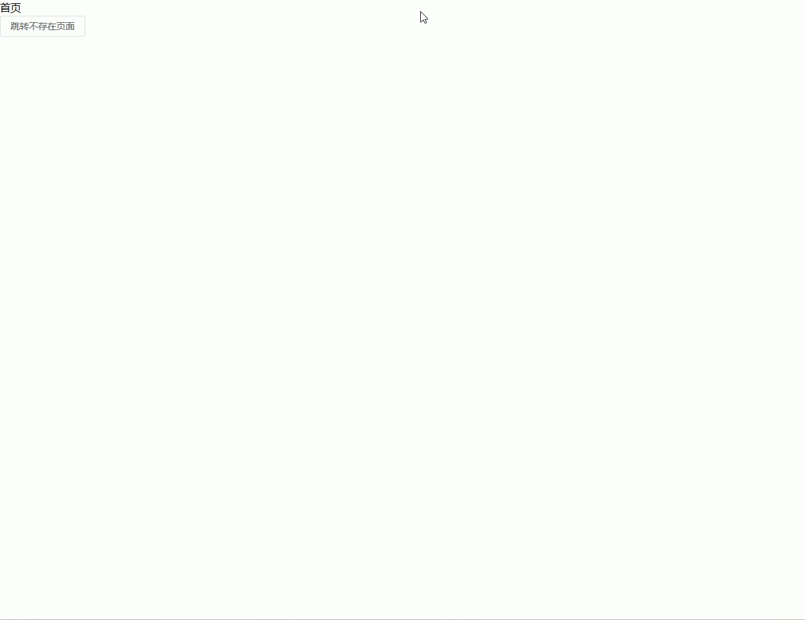

------

## 二、布局与结构（后台系统核心）

### 嵌套路由（Layout + 子页面）

**功能描述：**
实现后台管理系统经典布局：

- 外层 `Layout`（头部 + 侧边栏）
- 内层子页面通过 `<router-view>` 切换

------

#### 1. 路由配置（router/index.ts）

```ts
// 文件：src/router/index.ts

import { createRouter, createWebHistory, type RouteRecordRaw } from 'vue-router'

// Layout 组件（外层框架）
import Layout from '@/layouts/Layout.vue'

// 子页面
import Dashboard from '@/views/Dashboard.vue'
import User from '@/views/system/User.vue'
import Role from '@/views/system/Role.vue'

const routes: Array<RouteRecordRaw> = [
  {
    path: '/',
    component: Layout, // 外层布局
    redirect: '/dashboard', // 默认进入首页
    children: [
      {
        path: 'dashboard',
        name: 'Dashboard',
        component: Dashboard,
      },
      {
        path: 'system/user',
        name: 'UserManage',
        component: User,
      },
      {
        path: 'system/role',
        name: 'RoleManage',
        component: Role,
      },
    ],
  },
]

const router = createRouter({
  history: createWebHistory(),
  routes,
})

export default router
```

------

#### 2. 布局组件（Layout.vue）

```vue
<!-- 文件：src/layouts/Layout.vue -->
<template>
  <div class="layout">
    <!-- 头部 -->
    <div class="header">
      <h2>后台管理系统</h2>
    </div>

    <div class="container">
      <!-- 侧边栏 -->
      <div class="sidebar">
        <el-menu
          :default-active="activePath"
          router
        >
          <el-menu-item index="/dashboard">首页</el-menu-item>
          <el-menu-item index="/system/user">用户管理</el-menu-item>
          <el-menu-item index="/system/role">角色管理</el-menu-item>
        </el-menu>
      </div>

      <!-- 内容区域（子路由出口） -->
      <div class="content">
        <router-view />
      </div>
    </div>
  </div>
</template>

<script setup lang="ts">
import { useRoute } from 'vue-router'

// 当前路由（用于菜单高亮）
const route = useRoute()

// 当前路径
const activePath = route.path
</script>

<style scoped>
.layout {
  height: 100vh;
  display: flex;
  flex-direction: column;
}

.header {
  height: 60px;
  background: #409eff;
  color: #fff;
  display: flex;
  align-items: center;
  padding: 0 20px;
}

.container {
  flex: 1;
  display: flex;
}

.sidebar {
  width: 200px;
  border-right: 1px solid #eee;
}

.content {
  flex: 1;
  padding: 20px;
}
</style>
```

------

#### 3. 子页面（Dashboard.vue）

```vue
<!-- 文件：src/views/Dashboard.vue -->
<template>
  <div>
    <h2>首页</h2>
    <el-card>欢迎进入后台管理系统</el-card>
  </div>
</template>

<script setup lang="ts"></script>
```

------

#### 4. 子页面（User.vue）

```vue
<!-- 文件：src/views/system/User.vue -->
<template>
  <div>
    <h2>用户管理</h2>
    <el-card>用户列表</el-card>
  </div>
</template>

<script setup lang="ts"></script>
```

------

#### 5. 子页面（Role.vue）

```vue
<!-- 文件：src/views/system/Role.vue -->
<template>
  <div>
    <h2>角色管理</h2>
    <el-card>角色列表</el-card>
  </div>
</template>

<script setup lang="ts"></script>
```

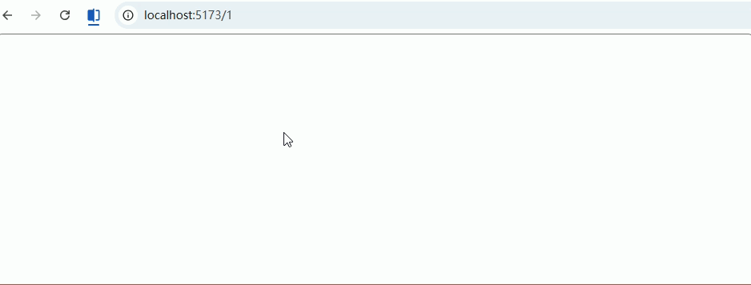

------

### 多级菜单路由结构（侧边栏）

**功能描述：**
根据路由 `children` 自动生成多级侧边栏菜单（递归渲染），适用于后台管理系统。

------

#### 1. 路由配置（带 meta）（router/index.ts）

```ts
// 文件：src/router/index.ts

import { createRouter, createWebHistory, type RouteRecordRaw } from 'vue-router'
import Layout from '@/layouts/Layout.vue'

const routes: Array<RouteRecordRaw> = [
  {
    path: '/',
    component: Layout,
    redirect: '/dashboard',
    meta: { title: '首页', icon: 'House' },
    children: [
      {
        path: 'dashboard',
        name: 'Dashboard',
        component: () => import('@/views/Dashboard.vue'),
        meta: { title: '仪表盘', icon: 'DataAnalysis' },
      },
      {
        path: 'system',
        name: 'System',
        meta: { title: '系统管理', icon: 'Setting' },
        children: [
          {
            path: 'user',
            name: 'UserManage',
            component: () => import('@/views/system/User.vue'),
            meta: { title: '用户管理', icon: 'User' },
          },
          {
            path: 'role',
            name: 'RoleManage',
            component: () => import('@/views/system/Role.vue'),
            meta: { title: '角色管理', icon: 'Lock' },
          },
        ],
      },
    ],
  },
]

const router = createRouter({
  history: createWebHistory(),
  routes,
})

export default router
```

------

#### 2. Layout 使用菜单组件（Layout.vue）

```vue
<!-- 文件：src/layouts/Layout.vue -->
<template>
  <div class="layout">
    <div class="sidebar">
      <!-- 递归菜单组件 -->
      <SideMenu :routes="menuRoutes" />
    </div>

    <div class="content">
      <router-view />
    </div>
  </div>
</template>

<script setup lang="ts">
import { computed } from 'vue'
import router from '@/router'
import SideMenu from '@/components/SideMenu.vue'

// 获取路由表（只取 Layout 下的 children）
const menuRoutes = computed(() => {
  return router.options.routes[0]?.children || []
})
</script>
```

------

#### 3. 递归菜单组件（核心）（SideMenu.vue）

```vue
<!-- 文件：src/components/SideMenu.vue -->
<template>
  <el-menu
    :default-active="activePath"
    router
    unique-opened
  >
    <!-- 递归渲染 -->
    <template v-for="route in routes" :key="route.path">
      <MenuItem :route="route" :base-path="basePath" />
    </template>
  </el-menu>
</template>

<script setup lang="ts">
import { useRoute } from 'vue-router'
import MenuItem from './MenuItem.vue'

// 接收路由数据
defineProps<{
  routes: any[]
  basePath?: string
}>()

const route = useRoute()
const activePath = route.path
</script>
```

------

#### 4. 菜单项递归组件（MenuItem.vue）

```vue
<!-- 文件：src/components/MenuItem.vue -->
<template>
  <!-- 有子菜单 -->
  <el-sub-menu v-if="hasChildren" :index="fullPath">
    <template #title>
      <span>{{ route.meta?.title }}</span>
    </template>

    <!-- 递归子菜单 -->
    <MenuItem
      v-for="child in route.children"
      :key="child.path"
      :route="child"
      :base-path="fullPath"
    />
  </el-sub-menu>

  <!-- 无子菜单 -->
  <el-menu-item v-else :index="fullPath">
    <span>{{ route.meta?.title }}</span>
  </el-menu-item>
</template>

<script setup lang="ts">
import { computed } from 'vue'

// 接收参数
const props = defineProps<{
  route: any
  basePath?: string
}>()

// 判断是否有子路由
const hasChildren = computed(() => {
  return props.route.children && props.route.children.length > 0
})

// 拼接完整路径（关键）
const fullPath = computed(() => {
  if (!props.basePath) return `/${props.route.path}`
  return `${props.basePath}/${props.route.path}`
})
</script>
```

------

#### 5. 页面示例（User.vue）

```vue
<!-- 文件：src/views/system/User.vue -->
<template>
  <div>
    <h2>用户管理</h2>
    <el-card>用户列表</el-card>
  </div>
</template>

<script setup lang="ts"></script>
```

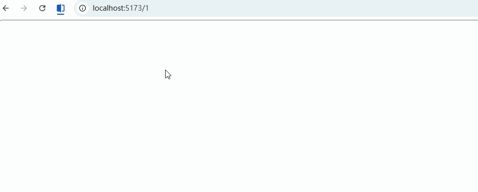

------

### 路由懒加载（动态 import）

**功能描述：**
按需加载页面组件（访问时才加载），减少首屏体积，提高性能（后台系统必备）。

------

#### 1. 基础懒加载写法（router/index.ts）

```ts
// 文件：src/router/index.ts

import { createRouter, createWebHistory, type RouteRecordRaw } from 'vue-router'
import Layout from '@/layouts/Layout.vue'

const routes: Array<RouteRecordRaw> = [
  {
    path: '/',
    component: Layout,
    redirect: '/dashboard',
    children: [
      {
        path: 'dashboard',
        name: 'Dashboard',
        // ✅ 懒加载（核心）
        component: () => import('@/views/Dashboard.vue'),
      },
      {
        path: 'system/user',
        name: 'UserManage',
        component: () => import('@/views/system/User.vue'),
      },
      {
        path: 'system/role',
        name: 'RoleManage',
        component: () => import('@/views/system/Role.vue'),
      },
    ],
  },
]

const router = createRouter({
  history: createWebHistory(),
  routes,
})

export default router
```

------

#### 2. 对比：普通引入 vs 懒加载

```ts
// ❌ 普通引入（会打包到主 bundle）
import User from '@/views/system/User.vue'

// ✅ 懒加载（访问时才加载）
component: () => import('@/views/system/User.vue')
```

------

#### 3. Layout 一般不做懒加载（说明）

```ts
// ❌ 不推荐
component: () => import('@/layouts/Layout.vue')

// ✅ 推荐（主框架直接加载）
import Layout from '@/layouts/Layout.vue'
```

------

#### 4. 页面示例（User.vue）

```vue
<!-- 文件：src/views/system/User.vue -->
<template>
  <div>
    <h2>用户管理</h2>
    <el-card>只有访问该页面时才会加载</el-card>
  </div>
</template>

<script setup lang="ts">
// 懒加载对页面代码无侵入
</script>
```

------

## 三、权限与控制（企业必备）

### 全局路由守卫（登录校验）

**功能描述：**
通过全局前置守卫 `beforeEach` 实现登录校验：

- 未登录 → 跳转登录页
- 已登录 → 放行
- 防止重复进入登录页

------

#### 1. 路由配置（添加 meta）（router/index.ts）

```ts
// 文件：src/router/index.ts

import { createRouter, createWebHistory, type RouteRecordRaw } from 'vue-router'
import Layout from '@/layouts/Layout.vue'

const routes: Array<RouteRecordRaw> = [
  {
    path: '/login',
    name: 'Login',
    component: () => import('@/views/Login.vue'),
    meta: { public: true }, // ✅ 白名单页面（无需登录）
  },
  {
    path: '/',
    component: Layout,
    redirect: '/dashboard',
    children: [
      {
        path: 'dashboard',
        name: 'Dashboard',
        component: () => import('@/views/Dashboard.vue'),
        meta: { requiresAuth: true }, // ✅ 需要登录
      },
      {
        path: 'system/user',
        name: 'UserManage',
        component: () => import('@/views/system/User.vue'),
        meta: { requiresAuth: true },
      },
    ],
  },
]

const router = createRouter({
  history: createWebHistory(),
  routes,
})

export default router
```

------

#### 2. 全局守卫实现（router/index.ts）

```ts
// 文件：src/router/index.ts（接上）

// 模拟获取 token（实际项目可用 Pinia / localStorage）
const getToken = (): string | null => {
  return localStorage.getItem('token')
}

// 全局前置守卫
router.beforeEach((to, from, next) => {
  const token = getToken()

  // 1. 白名单（无需登录）
  if (to.meta.public) {
    return next()
  }

  // 2. 已登录 → 放行
  if (token) {
    // 已登录访问 login，跳回首页
    if (to.path === '/login') {
      return next('/dashboard')
    }
    return next()
  }

  // 3. 未登录 → 跳转登录页
  next({
    path: '/login',
    query: { redirect: to.fullPath }, // ✅ 记录原路径
  })
})
```

------

#### 3. 登录页面（Login.vue）

```vue
<!-- 文件：src/views/Login.vue -->
<template>
  <div class="login">
    <el-card class="login-card">
      <h2>登录</h2>

      <el-button type="primary" @click="handleLogin">
        模拟登录
      </el-button>
    </el-card>
  </div>
</template>

<script setup lang="ts">
import { useRouter, useRoute } from 'vue-router'

const router = useRouter()
const route = useRoute()

// 登录逻辑
const handleLogin = () => {
  // 模拟存 token
  localStorage.setItem('token', '123456')

  // 登录后跳回原页面（核心）
  const redirect = (route.query.redirect as string) || '/dashboard'
  router.replace(redirect)
}
</script>

<style scoped>
.login {
  height: 100vh;
  display: flex;
  justify-content: center;
  align-items: center;
}
.login-card {
  width: 300px;
  text-align: center;
}
</style>
```

------

#### 4. 退出登录示例（任意页面）

```vue
<!-- 文件：src/views/Dashboard.vue -->
<template>
  <div>
    <h2>首页</h2>

    <el-button type="danger" @click="logout">
      退出登录
    </el-button>
  </div>
</template>

<script setup lang="ts">
import { useRouter } from 'vue-router'

const router = useRouter()

// 退出登录
const logout = () => {
  localStorage.removeItem('token')
  router.push('/login')
}
</script>
```

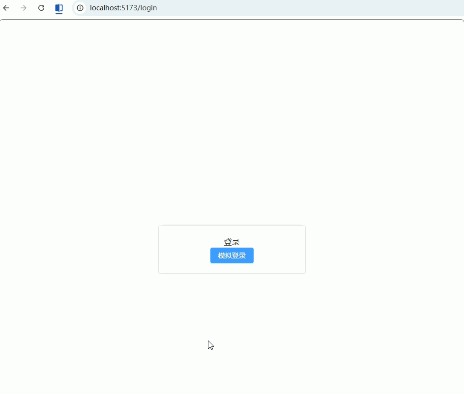

------

### 基于角色的动态路由（RBAC）！！！有问题

**功能描述：**
根据用户角色（admin / user）动态加载可访问路由，实现权限控制：

- 登录后 → 获取角色
- 根据角色 → 动态添加路由
- 菜单同步过滤

------

#### 1. 路由拆分（静态 + 动态）

```ts
// 文件：src/router/modules/staticRoutes.ts（固定路由）

import { type RouteRecordRaw } from 'vue-router'
import Layout from '@/layouts/Layout.vue'

export const staticRoutes: RouteRecordRaw[] = [
  {
    path: '/login',
    name: 'Login',
    component: () => import('@/views/Login.vue'),
    meta: { public: true },
  },
  {
    path: '/',
    component: Layout,
    redirect: '/dashboard',
    children: [
      {
        path: 'dashboard',
        name: 'Dashboard',
        component: () => import('@/views/Dashboard.vue'),
        meta: { title: '首页', roles: ['admin', 'user'] },
      },
    ],
  },
]
```

------

```ts
// 文件：src/router/modules/asyncRoutes.ts（权限路由）

import { type RouteRecordRaw } from 'vue-router'

export const asyncRoutes: RouteRecordRaw[] = [
  {
    path: '/system',
    name: 'System',
    meta: { title: '系统管理', roles: ['admin'] }, // 只有 admin 可访问
    children: [
      {
        path: 'user',
        name: 'UserManage',
        component: () => import('@/views/system/User.vue'),
        meta: { title: '用户管理', roles: ['admin'] },
      },
      {
        path: 'role',
        name: 'RoleManage',
        component: () => import('@/views/system/Role.vue'),
        meta: { title: '角色管理', roles: ['admin'] },
      },
    ],
  },
]
```

------

#### 2. 权限过滤工具（核心）

```ts
// 文件：src/utils/permission.ts

import { type RouteRecordRaw } from 'vue-router'

// 判断是否有权限
const hasPermission = (roles: string[], route: RouteRecordRaw) => {
  if (route.meta?.roles) {
    return roles.some(role => route.meta!.roles!.includes(role))
  }
  return true
}

// 递归过滤路由
export const filterRoutes = (
  routes: RouteRecordRaw[],
  roles: string[]
): RouteRecordRaw[] => {
  const res: RouteRecordRaw[] = []

  routes.forEach(route => {
    const tmp = { ...route }

    if (hasPermission(roles, tmp)) {
      if (tmp.children) {
        tmp.children = filterRoutes(tmp.children, roles)
      }
      res.push(tmp)
    }
  })

  return res
}
```

------

#### 3. 动态添加路由（router/index.ts）

```ts
// 文件：src/router/index.ts

import { createRouter, createWebHistory } from 'vue-router'
import { staticRoutes } from './modules/staticRoutes'

const router = createRouter({
  history: createWebHistory(),
  routes: staticRoutes,
})

export default router
```

------

#### 4. 在守卫中加载权限路由（核心）

```ts
// 文件：src/router/index.ts（补充）

import { asyncRoutes } from './modules/asyncRoutes'
import { filterRoutes } from '@/utils/permission'

// 模拟获取用户角色
const getUserRoles = (): string[] => {
  // 实际项目从接口获取
  return JSON.parse(localStorage.getItem('roles') || '[]')
}

let isRouteAdded = false

router.beforeEach((to, from, next) => {
  const token = localStorage.getItem('token')

  // 未登录
  if (!token && !to.meta.public) {
    return next('/login')
  }

  // 已登录但未加载动态路由
  if (token && !isRouteAdded) {
    const roles = getUserRoles()

    // 过滤路由
    const accessRoutes = filterRoutes(asyncRoutes, roles)

    // 动态添加
    accessRoutes.forEach(route => {
      router.addRoute(route)
    })

    isRouteAdded = true

    // 关键：重新进入当前路由
    return next({ ...to, replace: true })
  }

  next()
})
```

------

#### 5. 登录时设置角色（Login.vue）

```vue
<!-- 文件：src/views/Login.vue -->
<script setup lang="ts">
import { useRouter } from 'vue-router'

const router = useRouter()

const handleLogin = (role: string) => {
  // 存 token
  localStorage.setItem('token', '123')

  // 存角色（模拟）
  localStorage.setItem('roles', JSON.stringify([role]))

  router.replace('/dashboard')
}
</script>

<template>
  <div>
    <el-button @click="handleLogin('admin')">管理员登录</el-button>
    <el-button @click="handleLogin('user')">普通用户登录</el-button>
  </div>
</template>
```

------

#### 6. 菜单同步过滤（Layout.vue）

```ts
// 只展示有权限的路由（核心思路）

const menuRoutes = computed(() => {
  return router.getRoutes().filter(route => route.meta?.title)
})
```

------

### 按钮级权限控制（配合路由 meta）

**功能描述：**
根据用户权限控制按钮是否显示/可操作（常见：新增 / 删除 / 编辑），通过 **自定义指令 + 路由 meta/权限数据** 实现。

------

#### 1. 路由中定义按钮权限（router/index.ts）

```ts
// 文件：src/router/index.ts

import { createRouter, createWebHistory, type RouteRecordRaw } from 'vue-router'
import Layout from '@/layouts/Layout.vue'

const routes: Array<RouteRecordRaw> = [
  {
    path: '/login',
    name: 'Login',
    component: () => import('@/views/Login.vue'),
    meta: { public: true },
  },
  {
    path: '/',
    component: Layout,
    redirect: '/system/user',
    children: [
      {
        path: 'system/user',
        name: 'UserManage',
        component: () => import('@/views/system/User.vue'),
        meta: {
          title: '用户管理',
          permissions: ['user:add', 'user:edit'], // ✅ 按钮权限标识
        },
      },
    ],
  },
]

const router = createRouter({
  history: createWebHistory(),
  routes,
})

export default router
```

```vue
<!-- 文件：src/layouts/Layout.vue -->
<template>
  <div class="layout">
    <div class="sidebar">
      <!-- 递归菜单组件 -->
      <SideMenu :routes="menuRoutes" />
    </div>

    <div class="content">
      <router-view />
    </div>
  </div>
</template>

<script setup lang="ts">
import { computed } from 'vue'
import router from '@/router'
import SideMenu from '@/components/SideMenu.vue'

// 获取路由表（只取 Layout 下的 children）
const menuRoutes = computed(() => {
  return router.options.routes[0]?.children || []
})
</script>
```

------

#### 2. 权限工具（permission.ts）

```ts
// 文件：src/utils/permission.ts

// 获取当前用户权限（实际项目从接口获取）
export const getUserPermissions = (): string[] => {
  return JSON.parse(localStorage.getItem('permissions') || '[]')
}

// 判断是否有权限
export const hasPermission = (value: string | string[]): boolean => {
  const permissions = getUserPermissions()

  if (!value) return true

  if (Array.isArray(value)) {
    // 满足任意一个即可
    return value.some(v => permissions.includes(v))
  }

  return permissions.includes(value)
}
```

------

#### 3. 自定义指令（核心）（v-permission.ts）

```ts
// 文件：src/directives/v-permission.ts

import { type Directive } from 'vue'
import { hasPermission } from '@/utils/permission'

// 自定义指令：v-permission
export const permissionDirective: Directive = {
  mounted(el, binding) {
    const value = binding.value

    if (!hasPermission(value)) {
      // ❌ 没权限 → 移除元素
      el.parentNode && el.parentNode.removeChild(el)
    }
  },
}
```

------

#### 4. 注册全局指令（main.ts）

```ts
// 文件：src/main.ts

import { createApp } from 'vue'
import App from './App.vue'
import router from './router'

import ElementPlus from 'element-plus'
import 'element-plus/dist/index.css'

// 引入权限指令
import { permissionDirective } from '@/directives/v-permission'

const app = createApp(App)

app.use(router)
app.use(ElementPlus)

// 注册全局指令
app.directive('permission', permissionDirective)

app.mount('#app')
```

------

#### 5. 页面使用（User.vue）

```vue
<!-- 文件：src/views/system/User.vue -->
<template>
  <div>
    <h2>用户管理</h2>

    <el-card>
      <!-- 有权限才显示 -->
      <el-button
        type="primary"
        v-permission="'user:add'"
      >
        新增用户
      </el-button>

      <!-- 多权限（满足一个即可） -->
      <el-button
        type="success"
        v-permission="['user:add', 'user:edit']"
      >
        编辑用户
      </el-button>

      <!-- 无权限（不会显示） -->
      <el-button
        type="danger"
        v-permission="'user:delete'"
      >
        删除用户
      </el-button>
    </el-card>
  </div>
</template>

<script setup lang="ts"></script>
```

------

#### 6. 登录时设置权限（Login.vue）

```vue
<!-- 文件：src/views/Login.vue -->
<template>
  <div>
    <h2>登录</h2>

    <el-button @click="loginAdmin">
      管理员登录
    </el-button>

    <el-button @click="loginUser">
      普通用户登录
    </el-button>
  </div>
</template>

<script setup lang="ts">
import { useRouter } from 'vue-router'

const router = useRouter()

// 管理员：全部权限
const loginAdmin = () => {
  localStorage.setItem('token', '123')
  localStorage.setItem(
    'permissions',
    JSON.stringify(['user:add', 'user:edit', 'user:delete'])
  )
  router.replace('/system/user')
}

// 普通用户：部分权限
const loginUser = () => {
  localStorage.setItem('token', '123')
  localStorage.setItem(
    'permissions',
    JSON.stringify(['user:add'])
  )
  router.replace('/system/user')
}
</script>
```

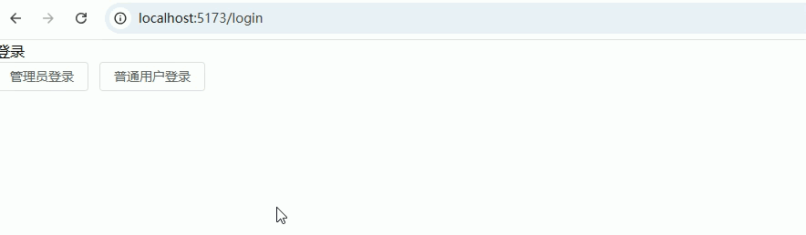

------

## 四、增强体验（高频实战）

### 路由缓存（keep-alive）

**功能描述：**
缓存页面状态（如表单/滚动位置），避免来回切换时重新加载（后台系统高频需求）。

------

#### 1. 路由配置（添加缓存标识）（router/index.ts）

```ts
// 文件：src/router/index.ts

import { createRouter, createWebHistory, type RouteRecordRaw } from 'vue-router'
import Layout from '@/layouts/Layout.vue'

const routes: Array<RouteRecordRaw> = [
    {
        path: '/',
        component: Layout,
        redirect: '/dashboard',
        children: [
            {
                path: 'dashboard',
                name: 'Dashboard',
                component: () => import('@/views/Dashboard.vue'),
                meta: { keepAlive: true },
            },
            {
                path: 'system/user',
                name: 'UserManage',
                component: () => import('@/views/system/User.vue'),
                meta: { keepAlive: true },
            },
            {
                path: 'system/role',
                name: 'RoleManage',
                component: () => import('@/views/system/Role.vue'),
                meta: { keepAlive: false },
            },
        ],
    },
]

const router = createRouter({
    history: createWebHistory(),
    routes,
})

export default router
```

------

#### 2. Layout 中使用 keep-alive（核心）

```vue
<!-- 文件：src/layouts/Layout.vue -->
<template>
  <div class="layout">
    <div class="sidebar">
      <!-- 模拟菜单 -->
      <el-menu router>
        <el-menu-item index="/dashboard">首页</el-menu-item>
        <el-menu-item index="/system/user">用户管理</el-menu-item>
        <el-menu-item index="/system/role">角色管理</el-menu-item>
      </el-menu>
    </div>

    <div class="content">
      <router-view v-slot="{ Component, route }">
        <!-- ✅ 关键：统一入口 -->
        <keep-alive>
          <component
              v-if="route.meta.keepAlive"
              :is="Component"
              :key="route.fullPath"
          />
        </keep-alive>

        <!-- ❗ 不缓存页面 -->
        <component
            v-if="!route.meta.keepAlive"
            :is="Component"
            :key="route.fullPath"
        />
      </router-view>
    </div>
  </div>
</template>

<script setup lang="ts">
</script>

<style scoped>
.layout {
  display: flex;
}

.sidebar {
  width: 200px;
}

.content {
  flex: 1;
  padding: 16px;
}
</style>
```

------

#### 3. Dashboard 页面（Dashboard.vue）

```
<!-- 文件：src/views/Dashboard.vue -->
<template>
  <div>
    <h2>首页（缓存）</h2>

    <el-card>
      <p>输入内容后切换页面，再回来不会丢失 👇</p>

      <el-input v-model="text" placeholder="输入点内容试试" />
    </el-card>
  </div>
</template>

<script setup lang="ts">
import { ref, onActivated, onDeactivated } from 'vue'

const text = ref('')

onActivated(() => {
  console.log('Dashboard 激活（缓存恢复）')
})

onDeactivated(() => {
  console.log('Dashboard 被缓存（未销毁）')
})
</script>
```

------

#### 4. 页面必须设置 name（非常关键）

```vue
<!-- 文件：src/views/system/User.vue -->
<template>
  <div>
    <h2>用户管理（缓存）</h2>

    <el-input v-model="keyword" placeholder="输入不会丢失" />
  </div>
</template>

<script setup lang="ts">
import { ref, onActivated, onDeactivated } from 'vue'

const keyword = ref('')

onActivated(() => {
  console.log('User 激活')
})

onDeactivated(() => {
  console.log('User 缓存')
})
</script>
```

------

#### 5. 测试页面（Role.vue，不缓存）

```vue
<!-- 文件：src/views/system/Role.vue -->
<template>
  <div>
    <h2>角色管理（不缓存）</h2>

    <el-input v-model="keyword" placeholder="切换会清空" />
  </div>
</template>

<script setup lang="ts">
import { ref, onUnmounted } from 'vue'

const keyword = ref('')

onUnmounted(() => {
  console.log('Role 已销毁')
})
</script>
```

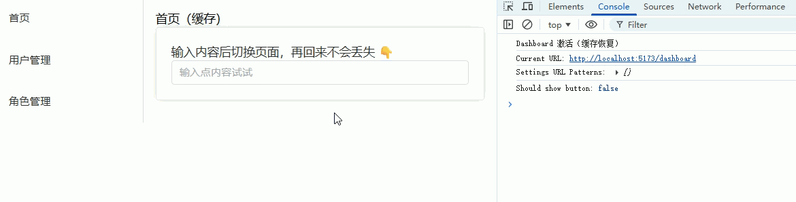

------

### 页面标题动态设置（meta.title）

**功能描述：**
根据路由 `meta.title` 动态修改浏览器标题（后台系统必备）。

------

#### 1. 路由配置（添加 title）（router/index.ts）

```ts
// 文件：src/router/index.ts

import { createRouter, createWebHistory, type RouteRecordRaw } from 'vue-router'
import Layout from '@/layouts/Layout.vue'

const routes: Array<RouteRecordRaw> = [
  {
    path: '/',
    component: Layout,
    redirect: '/dashboard',
    children: [
      {
        path: 'dashboard',
        name: 'Dashboard',
        component: () => import('@/views/Dashboard.vue'),
        meta: { title: '首页' },
      },
      {
        path: 'system/user',
        name: 'UserManage',
        component: () => import('@/views/system/User.vue'),
        meta: { title: '用户管理' },
      },
      {
        path: 'system/role',
        name: 'RoleManage',
        component: () => import('@/views/system/Role.vue'),
        meta: { title: '角色管理' },
      },
    ],
  },
  {
    path: '/login',
    name: 'Login',
    component: () => import('@/views/Login.vue'),
    meta: { title: '登录' },
  },
]

const router = createRouter({
  history: createWebHistory(),
  routes,
})

/**
 * ✅ 全局后置守卫：设置页面标题
 */
router.afterEach((to) => {
  const title = to.meta.title as string
  const baseTitle = '后台管理系统'

  document.title = title
    ? `${title} - ${baseTitle}`
    : baseTitle
})

export default router
```

------

#### 2. Layout.vue（完整）

```vue
<!-- 文件：src/layouts/Layout.vue -->
<template>
  <div class="layout">
    <div class="sidebar">
      <el-menu router :default-active="route.path">
        <el-menu-item index="/dashboard">首页</el-menu-item>
        <el-menu-item index="/system/user">用户管理</el-menu-item>
        <el-menu-item index="/system/role">角色管理</el-menu-item>
      </el-menu>
    </div>

    <div class="content">
      <router-view />
    </div>
  </div>
</template>

<script setup lang="ts">
import { useRoute } from 'vue-router'

const route = useRoute()
</script>

<style scoped>
.layout {
  display: flex;
  height: 100vh;
}

.sidebar {
  width: 200px;
  border-right: 1px solid #eee;
}

.content {
  flex: 1;
  padding: 20px;
}
</style>
```

------

#### 3. Dashboard.vue（带跳转测试）

```vue
<!-- 文件：src/views/Dashboard.vue -->
<template>
  <div>
    <h2>首页</h2>

    <el-space>
      <el-button type="primary" @click="goUser">
        去用户管理
      </el-button>

      <el-button type="success" @click="goRole">
        去角色管理
      </el-button>
    </el-space>
  </div>
</template>

<script setup lang="ts">
import { useRouter } from 'vue-router'

const router = useRouter()

const goUser = () => {
  router.push('/system/user')
}

const goRole = () => {
  router.push('/system/role')
}
</script>
```

------

#### 4. User.vue

```vue
<!-- 文件：src/views/system/User.vue -->
<template>
  <div>
    <h2>用户管理</h2>

    <el-button @click="goDashboard">
      返回首页
    </el-button>
  </div>
</template>

<script setup lang="ts">
import { useRouter } from 'vue-router'

const router = useRouter()

const goDashboard = () => {
  router.push('/dashboard')
}
</script>
```

------

#### 5. Role.vue

```vue
<!-- 文件：src/views/system/Role.vue -->
<template>
  <div>
    <h2>角色管理</h2>

    <el-button @click="goDashboard">
      返回首页
    </el-button>
  </div>
</template>

<script setup lang="ts">
import { useRouter } from 'vue-router'

const router = useRouter()

const goDashboard = () => {
  router.push('/dashboard')
}
</script>
```

------

#### 6. Login.vue

```vue
<!-- 文件：src/views/Login.vue -->
<template>
  <div>
    <h2>登录页</h2>

    <el-button type="primary" @click="goHome">
      登录进入首页
    </el-button>
  </div>
</template>

<script setup lang="ts">
import { useRouter } from 'vue-router'

const router = useRouter()

const goHome = () => {
  router.push('/dashboard')
}
</script>
```

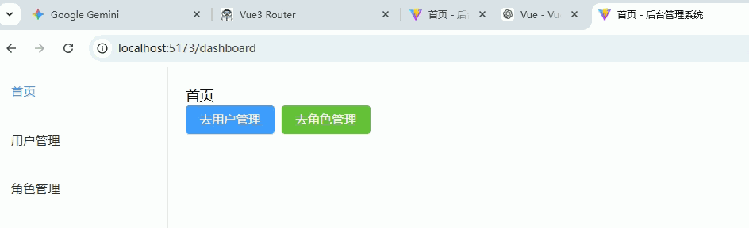

---

### 面包屑导航（根据路由生成）

**功能描述：**
根据当前路由路径和 `meta.title` 自动生成面包屑，支持多级路由。

------

#### 1. 路由配置（添加多级 title）（router/index.ts）

```ts
// 文件：src/router/index.ts

import { createRouter, createWebHistory, type RouteRecordRaw } from 'vue-router'
import Layout from '@/layouts/Layout.vue'

const routes: Array<RouteRecordRaw> = [
  {
    path: '/',
    component: Layout,
    redirect: '/dashboard',
    children: [
      {
        path: 'dashboard',
        name: 'Dashboard',
        component: () => import('@/views/Dashboard.vue'),
        meta: { title: '首页' },
      },
      {
        path: 'system',
        name: 'System',
        meta: { title: '系统管理' },
        component: () => import('@/views/system/System.vue'),
        children: [
          {
            path: 'user',
            name: 'UserManage',
            component: () => import('@/views/system/User.vue'),
            meta: { title: '用户管理' },
          },
          {
            path: 'role',
            name: 'RoleManage',
            component: () => import('@/views/system/Role.vue'),
            meta: { title: '角色管理' },
          },
        ],
      },
    ],
  },
  {
    path: '/login',
    name: 'Login',
    component: () => import('@/views/Login.vue'),
    meta: { title: '登录' },
  },
]

const router = createRouter({
  history: createWebHistory(),
  routes,
})

export default router
```

------

#### 2. Layout.vue（带面包屑组件）

```vue
<!-- 文件：src/layouts/Layout.vue -->
<template>
  <div class="layout">
    <div class="sidebar">
      <el-menu router :default-active="route.path">
        <el-menu-item index="/dashboard">首页</el-menu-item>
        <el-sub-menu index="/system" v-if="true">
          <template #title>系统管理</template>
          <el-menu-item index="/system/user">用户管理</el-menu-item>
          <el-menu-item index="/system/role">角色管理</el-menu-item>
        </el-sub-menu>
      </el-menu>
    </div>

    <div class="content">
      <!-- 面包屑 -->
      <el-breadcrumb separator="/">
        <el-breadcrumb-item v-for="item in breadcrumbs" :key="item.path">
          <router-link :to="item.path">{{ item.meta.title }}</router-link>
        </el-breadcrumb-item>
      </el-breadcrumb>

      <router-view />
    </div>
  </div>
</template>

<script setup lang="ts">
import { computed } from 'vue'
import { useRoute, useRouter } from 'vue-router'

const route = useRoute()
const router = useRouter()

/**
 * 根据路由 path 生成面包屑
 */
const breadcrumbs = computed(() => {
  const paths = route.matched // 当前路由匹配的所有父级
  return paths.filter(r => r.meta?.title) // 只显示有 title 的路由
})
</script>

<style scoped>
.layout {
  display: flex;
  height: 100vh;
}

.sidebar {
  width: 200px;
  border-right: 1px solid #eee;
}

.content {
  flex: 1;
  padding: 20px;
}
</style>
```

------

#### 3. System.vue（中间父级页面）

```vue
<!-- 文件：src/views/system/System.vue -->
<template>
  <router-view />
</template>

<script setup lang="ts">
defineOptions({ name: 'System' })
</script>
```

------

#### 4. User.vue & Role.vue（子页面示例）

```vue
<!-- 文件：src/views/system/User.vue -->
<template>
  <div>
    <h2>用户管理</h2>
    <el-input v-model="keyword" placeholder="输入不会丢失" />
  </div>
</template>

<script setup lang="ts">
defineOptions({ name: 'UserManage' })
import { ref } from 'vue'
const keyword = ref('')
</script>
<!-- 文件：src/views/system/Role.vue -->
<template>
  <div>
    <h2>角色管理</h2>
    <el-input v-model="keyword" placeholder="输入会清空" />
  </div>
</template>

<script setup lang="ts">
defineOptions({ name: 'RoleManage' })
import { ref } from 'vue'
const keyword = ref('')
</script>
```

------

#### 5. Dashboard.vue（首页示例）

```vue
<!-- 文件：src/views/Dashboard.vue -->
<template>
  <div>
    <h2>首页</h2>
    <el-button type="primary" @click="goUser">去用户管理</el-button>
    <el-button type="success" @click="goRole">去角色管理</el-button>
  </div>
</template>

<script setup lang="ts">
defineOptions({ name: 'Dashboard' })
import { useRouter } from 'vue-router'

const router = useRouter()
const goUser = () => router.push('/system/user')
const goRole = () => router.push('/system/role')
</script>
```

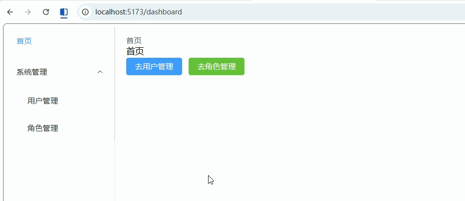

------

### 标签页（多页签 Tab 管理）

**功能描述：**
实现后台系统常见的“多页签”：

- 路由切换自动新增 Tab
- 点击 Tab 切换页面
- 关闭 Tab

------

#### 1. 路由配置（必须有 title）（router/index.ts）

```ts
// 文件：src/router/index.ts

import { createRouter, createWebHistory, type RouteRecordRaw } from 'vue-router'
import Layout from '@/layouts/Layout.vue'

const routes: Array<RouteRecordRaw> = [
  {
    path: '/',
    component: Layout,
    redirect: '/dashboard',
    children: [
      {
        path: 'dashboard',
        name: 'Dashboard',
        component: () => import('@/views/Dashboard.vue'),
        meta: { title: '首页' },
      },
      {
        path: 'system/user',
        name: 'UserManage',
        component: () => import('@/views/system/User.vue'),
        meta: { title: '用户管理' },
      },
      {
        path: 'system/role',
        name: 'RoleManage',
        component: () => import('@/views/system/Role.vue'),
        meta: { title: '角色管理' },
      },
    ],
  },
]

const router = createRouter({
  history: createWebHistory(),
  routes,
})

export default router
```

------

#### 2. Tabs 管理（Layout.vue 完整实现）

```vue
<!-- 文件：src/layouts/Layout.vue -->
<template>
  <div class="layout">
    <!-- 侧边栏 -->
    <div class="sidebar">
      <el-menu router :default-active="route.path">
        <el-menu-item index="/dashboard">首页</el-menu-item>
        <el-menu-item index="/system/user">用户管理</el-menu-item>
        <el-menu-item index="/system/role">角色管理</el-menu-item>
      </el-menu>
    </div>

    <div class="content">
      <!-- Tabs -->
      <el-tabs
        v-model="activeTab"
        type="card"
        closable
        @tab-click="handleClick"
        @tab-remove="handleRemove"
      >
        <el-tab-pane
          v-for="tab in tabs"
          :key="tab.path"
          :label="tab.title"
          :name="tab.path"
        />
      </el-tabs>

      <!-- 页面 -->
      <router-view />
    </div>
  </div>
</template>

<script setup lang="ts">
import { ref, watch } from 'vue'
import { useRoute, useRouter } from 'vue-router'

interface TabItem {
  title: string
  path: string
}

const route = useRoute()
const router = useRouter()

// 当前激活 tab
const activeTab = ref(route.path)

// tab 列表
const tabs = ref<TabItem[]>([
  { title: '首页', path: '/dashboard' }, // 默认首页
])

/**
 * 监听路由变化 → 添加 tab
 */
watch(
  () => route.path,
  () => {
    activeTab.value = route.path

    const exists = tabs.value.find(t => t.path === route.path)

    if (!exists) {
      tabs.value.push({
        title: route.meta.title as string,
        path: route.path,
      })
    }
  },
  { immediate: true }
)

/**
 * 点击 tab
 */
const handleClick = (tab: any) => {
  router.push(tab.props.name)
}

/**
 * 关闭 tab
 */
const handleRemove = (targetPath: string) => {
  // 首页不允许关闭
  if (targetPath === '/dashboard') return

  const index = tabs.value.findIndex(t => t.path === targetPath)

  tabs.value.splice(index, 1)

  // 如果关闭的是当前页 → 跳到最后一个
  if (activeTab.value === targetPath) {
    const lastTab = tabs.value[tabs.value.length - 1]
    router.push(lastTab.path)
  }
}
</script>

<style scoped>
.layout {
  display: flex;
  height: 100vh;
}

.sidebar {
  width: 200px;
  border-right: 1px solid #eee;
}

.content {
  flex: 1;
  padding: 10px;
}
</style>
```

------

#### 3. Dashboard.vue（测试入口）

```vue
<!-- 文件：src/views/Dashboard.vue -->
<template>
  <div>
    <h2>首页</h2>

    <el-space>
      <el-button type="primary" @click="goUser">
        打开用户管理
      </el-button>

      <el-button type="success" @click="goRole">
        打开角色管理
      </el-button>
    </el-space>
  </div>
</template>

<script setup lang="ts">
defineOptions({ name: 'Dashboard' })

import { useRouter } from 'vue-router'

const router = useRouter()

const goUser = () => router.push('/system/user')
const goRole = () => router.push('/system/role')
</script>
```

------

#### 4. User.vue

```vue
<!-- 文件：src/views/system/User.vue -->
<template>
  <div>
    <h2>用户管理</h2>
  </div>
</template>

<script setup lang="ts">
defineOptions({ name: 'UserManage' })
</script>
```

------

#### 5. Role.vue

```vue
<!-- 文件：src/views/system/Role.vue -->
<template>
  <div>
    <h2>角色管理</h2>
  </div>
</template>

<script setup lang="ts">
defineOptions({ name: 'RoleManage' })
</script>
```

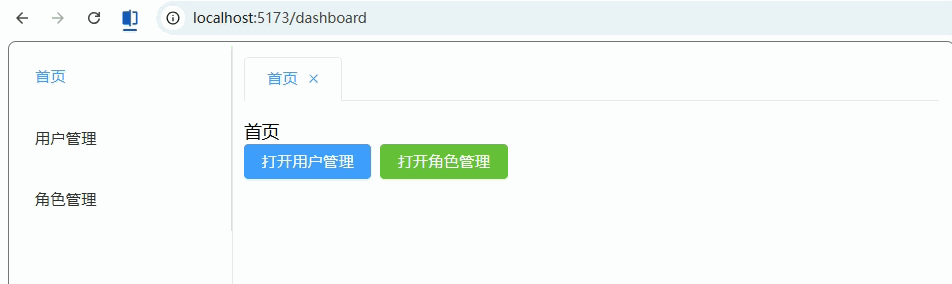

------

## 五、进阶能力（中大型项目）

### 动态添加路由（addRoute）

**功能描述：**
在运行时动态注册路由（常用于权限系统 / 后端返回菜单）。

------

#### 1. 基础路由（router/index.ts）

```ts
// 文件：src/router/index.ts

import { createRouter, createWebHistory, type RouteRecordRaw } from 'vue-router'
import Layout from '@/layouts/Layout.vue'

// 静态路由（固定存在）
const staticRoutes: Array<RouteRecordRaw> = [
  {
    path: '/login',
    name: 'Login',
    component: () => import('@/views/Login.vue'),
  },
  {
    path: '/',
    component: Layout,
    redirect: '/dashboard',
    children: [
      {
        path: 'dashboard',
        name: 'Dashboard',
        component: () => import('@/views/Dashboard.vue'),
        meta: { title: '首页' },
      },
    ],
  },
]

const router = createRouter({
  history: createWebHistory(),
  routes: staticRoutes,
})

export default router
```

------

#### 2. 动态路由数据（模拟后端返回）

```ts
// 文件：src/router/dynamicRoutes.ts

import { type RouteRecordRaw } from 'vue-router'

// 模拟后端返回
export const dynamicRoutes: RouteRecordRaw[] = [
  {
    path: 'system/user',
    name: 'UserManage',
    component: () => import('@/views/system/User.vue'),
    meta: { title: '用户管理' },
  },
  {
    path: 'system/role',
    name: 'RoleManage',
    component: () => import('@/views/system/Role.vue'),
    meta: { title: '角色管理' },
  },
]
```

------

#### 3. 动态添加路由（核心逻辑）

```ts
// 文件：src/router/permission.ts

import router from './index'
import { dynamicRoutes } from './dynamicRoutes'

// 是否已添加
let isAdded = false

export const setupDynamicRoutes = () => {
    if (isAdded) return

    dynamicRoutes.forEach(route => {
        // 添加到 Layout 下
        router.addRoute('Layout', route)
    })

    isAdded = true
    return true
}

export const hasAddedRoutes = () => isAdded
```

------

#### 4. 在守卫中调用（router/index.ts）

```ts
// 文件：src/router/index.ts（补充）

import { setupDynamicRoutes, hasAddedRoutes } from './permission'

router.beforeEach((to, from, next) => {
    const token = localStorage.getItem('token')

    // 未登录
    if (!token && to.path !== '/login') {
        return next('/login')
    }

    // 已登录 → 动态添加路由
    if (token) {
        // ❗ 只在第一次加路由时，才重定向
        if (!hasAddedRoutes()) {
            const added = setupDynamicRoutes()

            if (added) {
                // 关键：重新匹配路由
                return next({ ...to, replace: true })
            }
        }

    }

    next()
})

```

------

#### 5. Layout.vue（菜单自动显示）

```vue
<!-- 文件：src/layouts/Layout.vue -->
<template>
  <div class="layout">
    <div class="sidebar">
      <el-menu router :default-active="route.path">
        <el-menu-item index="/dashboard">首页</el-menu-item>

        <!-- 动态菜单 -->
        <el-menu-item
            v-for="r in dynamicMenus"
            :key="r.path"
            :index="r.path"
        >
          {{ r.meta.title }}
        </el-menu-item>
      </el-menu>
    </div>

    <div class="content">
      <router-view />
    </div>
  </div>
</template>

<script setup lang="ts">
import router from '@/router'
import { useRoute } from 'vue-router'
import { computed } from 'vue'

const route = useRoute()

// 获取动态路由（简单过滤）
const dynamicMenus = computed(() => {
  return router
      .getRoutes()
      .filter(r => r.meta?.title && r.path.includes('system'))
})
</script>

<style scoped>
.layout {
  display: flex;
  height: 100vh;
}
.sidebar {
  width: 200px;
}
.content {
  flex: 1;
  padding: 20px;
}
</style>
```

------

#### 6. Dashboard.vue（触发测试）

```vue
<!-- 文件：src/views/Dashboard.vue -->
<template>
  <div>
    <h2>首页</h2>

    <el-button type="primary" @click="goUser">
      去用户管理（动态路由）
    </el-button>
  </div>
</template>

<script setup lang="ts">
defineOptions({ name: 'Dashboard' })

import { useRouter } from 'vue-router'

const router = useRouter()

const goUser = () => {
  router.push('/system/user')
}
</script>
```

------

#### 7. Login.vue（登录触发）

```vue
<!-- 文件：src/views/Login.vue -->
<template>
  <div>
    <h2>登录</h2>

    <el-button type="primary" @click="login">
      登录
    </el-button>
  </div>
</template>

<script setup lang="ts">
import { useRouter } from 'vue-router'

const router = useRouter()

const login = () => {
  localStorage.setItem('token', '123')
  router.replace('/dashboard')
}
</script>
```

------

#### 8. User.vue / Role.vue

```vue
<!-- 文件：src/views/system/User.vue -->
<template>
  <div><h2>用户管理</h2></div>
</template>

<script setup lang="ts">
defineOptions({ name: 'UserManage' })
</script>
<!-- 文件：src/views/system/Role.vue -->
<template>
  <div><h2>角色管理</h2></div>
</template>

<script setup lang="ts">
defineOptions({ name: 'RoleManage' })
</script>
```

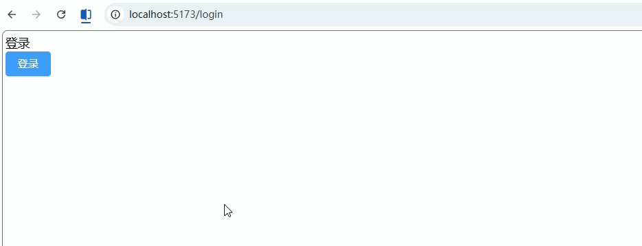

------

### 路由滚动行为（scrollBehavior）

**功能描述：**
自定义路由切换时页面滚动行为，比如：

- 新页面滚动到顶部
- 返回历史记录恢复滚动位置
- 某些页面固定滚动位置

------

#### 1. router/index.ts（配置 scrollBehavior）

```ts
import { createRouter, createWebHistory, type RouteRecordRaw } from 'vue-router'
import Layout from '@/layouts/Layout.vue'

const routes: Array<RouteRecordRaw> = [
  {
    path: '/',
    component: Layout,
    redirect: '/dashboard',
    children: [
      {
        path: 'dashboard',
        name: 'Dashboard',
        component: () => import('@/views/Dashboard.vue'),
        meta: { title: '首页' },
      },
      {
        path: 'system/user',
        name: 'UserManage',
        component: () => import('@/views/system/User.vue'),
        meta: { title: '用户管理' },
      },
      {
        path: 'system/role',
        name: 'RoleManage',
        component: () => import('@/views/system/Role.vue'),
        meta: { title: '角色管理' },
      },
    ],
  },
  {
    path: '/login',
    name: 'Login',
    component: () => import('@/views/Login.vue'),
    meta: { title: '登录' },
  },
]

const router = createRouter({
  history: createWebHistory(),
  routes,
  scrollBehavior(to, from, savedPosition) {
    // 1️⃣ 浏览器前进/后退，恢复滚动
    if (savedPosition) {
      return savedPosition
    }

    // 2️⃣ 新路由，滚动到顶部
    if (to.hash) {
      // 如果有锚点，滚动到对应位置
      return {
        el: to.hash,
        behavior: 'smooth',
      }
    }

    // 默认滚动到顶部
    return { top: 0 }
  },
})

export default router
```

------

#### 2. Dashboard.vue（带长内容测试滚动）

```vue
<!-- 文件：src/views/Dashboard.vue -->
<template>
  <div style="height:2000px">
    <h2>首页（滚动测试）</h2>

    <el-space>
      <el-button type="primary" @click="goUser">
        去用户管理
      </el-button>
      <el-button type="success" @click="goRole">
        去角色管理
      </el-button>
    </el-space>

    <p style="margin-top:1500px">页面底部，用于测试滚动恢复</p>
  </div>
</template>

<script setup lang="ts">
defineOptions({ name: 'Dashboard' })
import { useRouter } from 'vue-router'
const router = useRouter()
const goUser = () => router.push('/system/user')
const goRole = () => router.push('/system/role')
</script>
```

------

#### 3. User.vue（长内容示例）

```vue
<!-- 文件：src/views/system/User.vue -->
<template>
  <div style="height:1500px">
    <h2>用户管理（滚动测试）</h2>
    <p style="margin-top:1400px">页面底部，用于测试滚动恢复</p>
  </div>
</template>

<script setup lang="ts">
defineOptions({ name: 'UserManage' })
</script>
```

------

#### 4. Role.vue（长内容示例）

```vue
<!-- 文件：src/views/system/Role.vue -->
<template>
  <div style="height:1500px">
    <h2>角色管理（滚动测试）</h2>
    <p style="margin-top:1400px">页面底部，用于测试滚动恢复</p>
  </div>
</template>

<script setup lang="ts">
defineOptions({ name: 'RoleManage' })
</script>
```

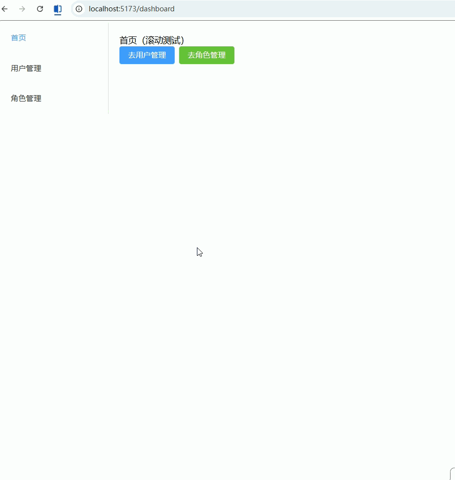

------

### 路由过渡动画（transition）

**功能描述：**
为页面切换添加过渡动画，使后台系统页面切换更加流畅和可视化。

------

#### 1. App.vue（包裹 `<router-view>` 并添加 `<transition>`）

```vue
<!-- 文件：src/App.vue -->
<template>
  <router-view v-slot="{ Component }">
    <transition name="fade-slide" mode="out-in">
      <component :is="Component" :key="route.path" />
    </transition>
  </router-view>
</template>

<script setup lang="ts">
import { useRoute } from 'vue-router'
const route = useRoute()
</script>

<style scoped>
/* 淡入淡出 + 滑动效果 */
.fade-slide-enter-active,
.fade-slide-leave-active {
  transition: all 0.3s ease;
}

.fade-slide-enter-from {
  opacity: 0;
  transform: translateX(50px);
}

.fade-slide-enter-to {
  opacity: 1;
  transform: translateX(0);
}

.fade-slide-leave-from {
  opacity: 1;
  transform: translateX(0);
}

.fade-slide-leave-to {
  opacity: 0;
  transform: translateX(-50px);
}
</style>
```

------

#### 2. Layout.vue（保持不变，只渲染 `<router-view>`）

```vue
<!-- 文件：src/layouts/Layout.vue -->
<template>
  <div class="layout">
    <div class="sidebar">
      <el-menu router :default-active="route.path">
        <el-menu-item index="/dashboard">首页</el-menu-item>
        <el-menu-item index="/system/user">用户管理</el-menu-item>
        <el-menu-item index="/system/role">角色管理</el-menu-item>
      </el-menu>
    </div>

    <div class="content">
      <router-view />
    </div>
  </div>
</template>

<script setup lang="ts">
import { useRoute } from 'vue-router'
const route = useRoute()
</script>

<style scoped>
.layout {
  display: flex;
  height: 100vh;
}

.sidebar {
  width: 200px;
  border-right: 1px solid #eee;
}

.content {
  flex: 1;
  padding: 20px;
}
</style>
```

------

#### 3. Dashboard.vue / User.vue / Role.vue（内容示例，保持不变）

```vue
<!-- 文件：src/views/Dashboard.vue -->
<template>
  <div>
    <h2>首页</h2>
    <el-space>
      <el-button type="primary" @click="goUser">去用户管理</el-button>
      <el-button type="success" @click="goRole">去角色管理</el-button>
    </el-space>
  </div>
</template>

<script setup lang="ts">
import { useRouter } from 'vue-router'
const router = useRouter()
const goUser = () => router.push('/system/user')
const goRole = () => router.push('/system/role')
</script>
<!-- 文件：src/views/system/User.vue -->
<template>
  <div>
    <h2>用户管理</h2>
  </div>
</template>

<script setup lang="ts">
defineOptions({ name: 'UserManage' })
</script>
<!-- 文件：src/views/system/Role.vue -->
<template>
  <div>
    <h2>角色管理</h2>
  </div>
</template>

<script setup lang="ts">
defineOptions({ name: 'RoleManage' })
</script>
```

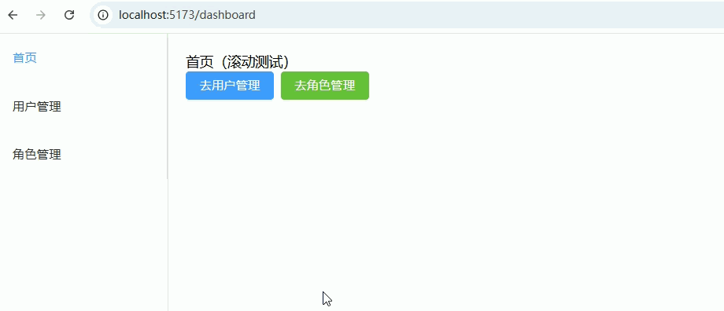


