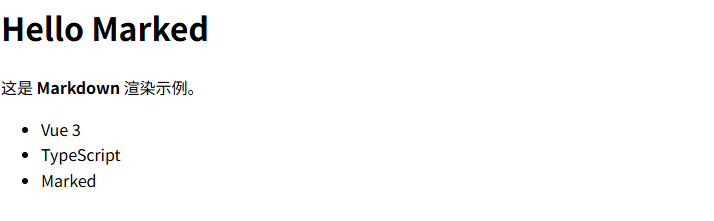

# Marked

一款 Markdown 解析器和编译器，速度极快。

- [官网地址](https://marked.js.org/)


## 基础配置

**安装依赖**

```
pnpm add marked@17.0.1 highlight.js@11.11.1 github-markdown-css
```

**全局makedown样式**

`src/main.ts`

```ts
import 'github-markdown-css/github-markdown-light.css'
import 'highlight.js/styles/github.css'
```

## 最简示例

```vue
<template>
  <div class="markdown" v-html="html"></div>
</template>

<script setup lang="ts">
import { computed } from 'vue'
import { marked } from 'marked'

const markdown = `
# Hello Marked

这是 **Markdown** 渲染示例。

- Vue 3
- TypeScript
- Marked
`

const html = computed(() => marked(markdown))
</script>

<style scoped>
.markdown {
  line-height: 1.6;
}
</style>
```



## 展示更多数据

```vue
<template>
  <div class="markdown-body" v-html="html"></div>
</template>

<script setup lang="ts">
import { computed } from 'vue'
import { marked } from 'marked'

const markdown = `
# 表格示例

| 名称 | 年龄 | 职业 |
| ---- | ---- | ---- |
| 张三 | 18 | 前端 |
| 李四 | 20 | 后端 |

## 列表示例

- Vue3
- TypeScript
- Marked

## 引用示例

> 这是一段引用文字

## 代码示例

\`\`\`ts
const a: number = 1
\`\`\`
`

const html = computed(() => marked(markdown))
</script>

<style scoped>

</style>
```

## 代码高亮

```vue
<template>
  <div class="markdown-body" v-html="html"></div>
</template>

<script setup lang="ts">
import { computed } from 'vue'
import {marked, type Tokens} from 'marked'
import hljs from 'highlight.js'

marked.use({
  gfm: true,
  breaks: true,
  walkTokens(token) {
    if (token.type !== 'code') {
      return
    }

    const codeToken = token as Tokens.Code
    const lang = codeToken.lang
    const code = codeToken.text

    if (lang && hljs.getLanguage(lang)) {
      codeToken.text = hljs.highlight(code, { language: lang }).value
      codeToken.escaped = true
      return
    }

    codeToken.text = hljs.highlightAuto(code).value
    codeToken.escaped = true
  }
})

const markdown = `
# Marked + highlight.js

## 表格

| 名称 | 技术 |
| ---- | ---- |
| 前端 | Vue3 |
| 后端 | Spring Boot |

## 代码高亮（TS）

\`\`\`ts
interface User {
  id: number
  name: string
}

const user: User = {
  id: 1,
  name: 'Ateng'
}
\`\`\`

## 代码高亮（Java）

\`\`\`java
public class Demo {
    public static void main(String[] args) {
        System.out.println("Hello Marked");
    }
}
\`\`\`
`

const html = computed(() => marked(markdown))
</script>
```


## 流式输出

```vue
<template>
  <div class="markdown" v-html="html"></div>
</template>

<script setup lang="ts">
import { ref, computed, onMounted } from 'vue'
import { marked } from 'marked'

/**
 * 当前已接收的 Markdown 内容
 */
const markdown = ref('')

/**
 * 模拟后端“流式输出”的 markdown 片段
 * 注意：刻意拆得比较细，接近真实大模型输出
 */
const streamChunks: string[] = [
  '# Marked 流式渲染示例\n\n',

  '> 这是一个 **模拟流式输出** 的 Markdown 示例，\n',
  '> 内容会一段一段渲染出来。\n\n',

  '## 一、基础能力\n\n',
  '- 支持 **粗体 / 斜体 / 删除线**\n',
  '- 支持 `inline code`\n',
  '- 支持多级列表\n',
  '  - 子项 A\n',
  '  - 子项 B\n\n',

  '## 二、表格（GFM）\n\n',
  '| 模块 | 技术栈 | 说明 |\n',
  '| ---- | ------ | ---- |\n',
  '| 前端 | Vue 3 | Composition API |\n',
  '| 构建 | Vite | 极速开发 |\n',
  '| 渲染 | Marked | Markdown 解析 |\n\n',

  '## 三、代码块\n\n',
  '```ts\n',
  'interface User {\n',
  '  id: number\n',
  '  name: string\n',
  '}\n\n',
  'const user: User = {\n',
  '  id: 1,\n',
  "  name: 'Ateng'\n",
  '}\n',
  '```\n\n',

  '## 四、引用 + 分隔线\n\n',
  '> 流式渲染的关键在于：\n',
  '> **不断追加原始 markdown 字符串**。\n\n',
  '---\n\n',

  '## 五、链接\n\n',
  '- 官网：[https://marked.js.org](https://marked.js.org)\n',
  '- 项目中常用于：**AI 输出 / 日志 / 文档预览**\n\n',

  '✅ **流式输出完成**'
]

/**
 * HTML 渲染结果
 */
const html = computed(() => marked(markdown.value))

/**
 * 模拟流式接收
 */
onMounted(() => {
  let index = 0

  const timer = setInterval(() => {
    if (index >= streamChunks.length) {
      clearInterval(timer)
      return
    }

    markdown.value += streamChunks[index]
    index++
  }, 400)
})
</script>

<style scoped>
.markdown {
  line-height: 1.7;
}
</style>
```

## 代码块复制

```vue
<template>
  <div class="markdown-body">
    <div v-html="html"></div>
  </div>
</template>

<script setup lang="ts">
import { computed, nextTick, onMounted } from 'vue'
import { marked, type Tokens } from 'marked'
import hljs from 'highlight.js'

// 配置marked
marked.use({
  gfm: true,
  breaks: true,
  walkTokens(token) {
    if (token.type !== 'code') {
      return
    }

    const codeToken = token as Tokens.Code
    const lang = codeToken.lang
    const code = codeToken.text

    if (lang && hljs.getLanguage(lang)) {
      codeToken.text = hljs.highlight(code, { language: lang }).value
      codeToken.escaped = true
      return
    }

    codeToken.text = hljs.highlightAuto(code).value
    codeToken.escaped = true
  }
})

const markdown = `
# Marked + highlight.js

## 表格

| 名称 | 技术 |
| ---- | ---- |
| 前端 | Vue3 |
| 后端 | Spring Boot |

## 代码高亮（TS）

\`\`\`ts
interface User {
  id: number
  name: string
}

const user: User = {
  id: 1,
  name: 'Ateng'
}
\`\`\`

## 代码高亮（Java）

\`\`\`java
public class Demo {
    public static void main(String[] args) {
        System.out.println("Hello Marked");
    }
}
\`\`\`

## 代码高亮（Python）

\`\`\`python
def hello_world():
    print("Hello, World!")
    return True
\`\`\`

## 代码高亮（JavaScript）

\`\`\`js
function greet(name) {
  return \`Hello, \${name}!\`;
}

console.log(greet('Vue'));
\`\`\`
`

const html = computed(() => marked(markdown))

// 添加复制功能
const addCopyButtons = async () => {
  await nextTick()

  // 移除之前添加的按钮（避免重复）
  const existingButtons = document.querySelectorAll('.copy-button')
  existingButtons.forEach(button => button.remove())

  // 获取所有代码块
  const codeBlocks = document.querySelectorAll('pre code')

  codeBlocks.forEach((codeBlock, index) => {
    // 创建容器
    const container = document.createElement('div')
    container.className = 'code-container'
    codeBlock.parentNode?.insertBefore(container, codeBlock)
    container.appendChild(codeBlock)

    // 获取语言信息
    const language = codeBlock.getAttribute('class')?.split(' ')[0]?.replace('language-', '') || 'text'

    // 创建语言标签
    const langLabel = document.createElement('div')
    langLabel.className = 'language-label'
    langLabel.textContent = language.toUpperCase()

    // 创建复制按钮
    const copyButton = document.createElement('button')
    copyButton.className = 'copy-button'
    copyButton.innerHTML = '📋 复制'
    copyButton.title = '复制代码'

    // 添加点击事件
    copyButton.addEventListener('click', async () => {
      try {
        await navigator.clipboard.writeText(codeBlock.textContent || '')
        copyButton.innerHTML = '✅ 已复制'
        setTimeout(() => {
          copyButton.innerHTML = '📋 复制'
        }, 2000)
      } catch (err) {
        console.error('复制失败:', err)
        copyButton.innerHTML = '❌ 复制失败'
        setTimeout(() => {
          copyButton.innerHTML = '📋 复制'
        }, 2000)
      }
    })

    // 将语言标签和复制按钮添加到容器
    const header = document.createElement('div')
    header.className = 'code-header'
    header.appendChild(langLabel)
    header.appendChild(copyButton)
    container.insertBefore(header, codeBlock)
  })
}

onMounted(() => {
  addCopyButtons()
})
</script>

<style scoped>
.markdown-body {
  line-height: 1.6;
  padding: 20px;
  font-family: -apple-system, BlinkMacSystemFont, 'Segoe UI', Roboto, Oxygen, Ubuntu, Cantarell, 'Open Sans', 'Helvetica Neue', sans-serif;
}

.code-container {
  position: relative;
  margin: 16px 0;
  border-radius: 8px;
  overflow: hidden;
  box-shadow: 0 4px 12px rgba(0, 0, 0, 0.1);
}

.code-header {
  display: flex;
  justify-content: space-between;
  align-items: center;
  padding: 8px 12px;
  background: #f6f8fa;
  border-bottom: 1px solid #d0d7de;
  font-size: 12px;
  color: #57606a;
}

.language-label {
  font-weight: 600;
  text-transform: uppercase;
  letter-spacing: 0.5px;
}

.copy-button {
  background: #f6f8fa;
  border: 1px solid #d0d7de;
  border-radius: 6px;
  padding: 4px 8px;
  font-size: 12px;
  cursor: pointer;
  transition: all 0.2s ease;
}

.copy-button:hover {
  background: #f3f4f6;
  border-color: #c5c9ce;
}

.copy-button:active {
  transform: translateY(1px);
}

pre {
  margin: 0 !important;
  border-radius: 0 !important;
  border-top-left-radius: 0 !important;
  border-top-right-radius: 0 !important;
}

code {
  font-family: 'SFMono-Regular', Consolas, 'Liberation Mono', Menlo, monospace;
  font-size: 14px;
  line-height: 1.5;
  padding: 16px !important;
}
</style>

<style>
/* 添加全局样式以确保代码块样式正确 */
.markdown-body :deep(pre code) {
  background: #ffffff !important;
}
</style>
```

