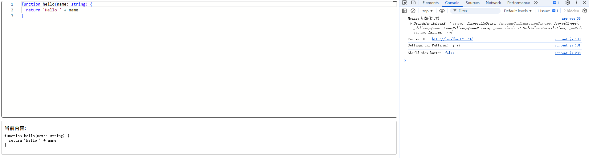

# Monaco Editor

基于浏览器的代码编辑器

- [官网地址](https://github.com/microsoft/monaco-editor)


## 基础配置

**安装依赖**

```
pnpm add monaco-editor@0.55.1
```

**配置 `vite.config.ts`**

```ts
import { defineConfig } from 'vite';
import vue from '@vitejs/plugin-vue';
import path from 'path';

export default defineConfig({
    plugins: [
        vue()
    ],
    resolve: {
        alias: {
            '@': path.resolve(__dirname, 'src'),
        }
    },
    worker: {
        format: 'es'
    },
    optimizeDeps: {
        include: ['monaco-editor']
    },
    build: {
        rollupOptions: {
            output: {
                manualChunks: {
                    monaco: ['monaco-editor']
                }
            }
        }
    }
});
```

**配置 Worker 映射**

在 `src/monaco-worker.ts` 新建一个文件：

```ts
// src/monaco-worker.ts
import editorWorker from 'monaco-editor/esm/vs/editor/editor.worker?worker'
import jsonWorker from 'monaco-editor/esm/vs/language/json/json.worker?worker'
import cssWorker from 'monaco-editor/esm/vs/language/css/css.worker?worker'
import htmlWorker from 'monaco-editor/esm/vs/language/html/html.worker?worker'
import tsWorker from 'monaco-editor/esm/vs/language/typescript/ts.worker?worker'

self.MonacoEnvironment = {
  getWorker(_: string, label: string) {
    if (label === 'json') return new jsonWorker()
    if (label === 'css') return new cssWorker()
    if (label === 'html') return new htmlWorker()
    if (label === 'typescript' || label === 'javascript') return new tsWorker()
    return new editorWorker()
  }
}
```

 `main.ts` 添加加

```
import './monaco-worker'
```


## 创建 Editor 组件

`src/components/CodeEditor.vue`

```vue
<template>
  <div class="monaco-container" ref="containerRef"></div>
</template>

<script setup lang="ts">
import { ref, onMounted, onBeforeUnmount, watch } from 'vue'
import * as monaco from 'monaco-editor'

// ======================================
// Props
// ======================================
interface Props {
  mode?: 'normal' | 'diff'
  modelValue?: string          // normal 或 diff 新内容
  original?: string            // diff 原始内容
  language?: MonacoLang
  theme?: MonacoTheme
  readOnly?: boolean
  lineNumbers?: 'on' | 'off'
  minimap?: boolean
}

type MonacoLang = 'typescript' | 'javascript' | 'json' | 'html' | 'css'
type MonacoTheme = 'vs' | 'vs-dark' | 'hc-black'

const props = withDefaults(defineProps<Props>(), {
  mode: 'normal',
  modelValue: '',
  original: '',
  language: 'typescript',
  theme: 'vs-dark',
  readOnly: false,
  lineNumbers: 'on',
  minimap: true
})

const emits = defineEmits<{
  (e: 'update:modelValue', value: string): void
  (e: 'ready', editor: monaco.editor.IStandaloneCodeEditor | monaco.editor.IStandaloneDiffEditor): void
}>()

// ======================================
// State
// ======================================
const containerRef = ref<HTMLElement | null>(null)

let editor: monaco.editor.IStandaloneCodeEditor | null = null
let diffEditor: monaco.editor.IStandaloneDiffEditor | null = null
let originalModel: monaco.editor.ITextModel | null = null
let modifiedModel: monaco.editor.ITextModel | null = null
let resizeObserver: ResizeObserver | null = null

// ======================================
// Init
// ======================================
onMounted(() => {
  if (!containerRef.value) return

  if (props.mode === 'diff') {
    // ---------- diff 模式 ----------
    originalModel = monaco.editor.createModel(props.original, props.language)
    modifiedModel = monaco.editor.createModel(props.modelValue, props.language)

    diffEditor = monaco.editor.createDiffEditor(containerRef.value, {
      theme: props.theme,
      readOnly: props.readOnly,
      renderSideBySide: true,
      automaticLayout: false,
      smoothScrolling: true,
      lineNumbers: props.lineNumbers,
      minimap: { enabled: props.minimap },
      scrollBeyondLastLine: false,
    })

    diffEditor.setModel({
      original: originalModel,
      modified: modifiedModel
    })

    /** diff 模式只关注 modified 内容 */
    modifiedModel.onDidChangeContent(() => {
      const val = modifiedModel!.getValue()
      if (val !== props.modelValue) emits('update:modelValue', val)
    })

    emits('ready', diffEditor)
  } else {
    // ---------- normal 模式 ----------
    editor = monaco.editor.create(containerRef.value, {
      value: props.modelValue,
      language: props.language,
      theme: props.theme,
      readOnly: props.readOnly,
      lineNumbers: props.lineNumbers,
      minimap: { enabled: props.minimap },
      automaticLayout: false,
      scrollBeyondLastLine: false,
      smoothScrolling: true,
      renderLineHighlight: 'line',
    })

    editor.onDidChangeModelContent(() => {
      const val = editor!.getValue()
      if (val !== props.modelValue) {
        emits('update:modelValue', val)
      }
    })

    emits('ready', editor)
  }

  // ---------- 外部更新 modelValue ----------
  watch(
      () => props.modelValue,
      (val) => {
        if (props.mode === 'diff') {
          if (modifiedModel && modifiedModel.getValue() !== val) {
            modifiedModel.setValue(val || '')
          }
        } else if (editor && editor.getValue() !== val) {
          editor.setValue(val || '')
        }
      }
  )

  // ---------- 外部更新 original（仅 diff） ----------
  watch(
      () => props.original,
      (val) => {
        if (props.mode === 'diff' && originalModel && originalModel.getValue() !== val) {
          originalModel.setValue(val || '')
        }
      }
  )

  // ---------- 语言切换 ----------
  watch(
      () => props.language,
      lang => {
        if (props.mode === 'diff') {
          originalModel && monaco.editor.setModelLanguage(originalModel, lang)
          modifiedModel && monaco.editor.setModelLanguage(modifiedModel, lang)
        } else {
          const model = editor?.getModel()
          model && monaco.editor.setModelLanguage(model, lang)
        }
      }
  )

  // ---------- 主题切换 ----------
  watch(
      () => props.theme,
      theme => monaco.editor.setTheme(theme)
  )

  // ---------- ResizeObserver（生产推荐） ----------
  resizeObserver = new ResizeObserver(() => {
    editor?.layout()
    diffEditor?.layout()
  })
  resizeObserver.observe(containerRef.value)
})

// ======================================
// Dispose
// ======================================
onBeforeUnmount(() => {
  resizeObserver?.disconnect()

  if (editor) {
    const model = editor.getModel()
    editor.dispose()
    model?.dispose()
  }

  if (diffEditor) {
    diffEditor.dispose()
    originalModel?.dispose()
    modifiedModel?.dispose()
  }
})
</script>

<style scoped>
.monaco-container {
  width: 100%;
  height: 100%;
  min-height: 300px;
  border-radius: 6px;
  overflow: hidden;
  border: 1px solid #2a2a2a;
}
</style>
```


## 编辑器示例

```vue
<template>
  <div style="height: 500px; display: flex; flex-direction: column; gap: 12px;">

    <!-- 编辑器区域 -->
    <div style="flex: 1; min-height: 300px;">
      <CodeEditor
          v-model="code"
          language="typescript"
          theme="vs"
          :read-only="false"
          line-numbers="on"
          :minimap="false"
          @ready="onEditorReady"
      />
    </div>

    <!-- 输出区 -->
    <div style="border: 1px solid #ccc; border-radius: 4px; padding: 10px; white-space: pre-wrap;">
      <strong>当前内容:</strong>
      <pre style="margin-top: 6px;">{{ code }}</pre>
    </div>

  </div>
</template>

<script setup lang="ts">
import { ref } from 'vue'
import CodeEditor from '@/components/CodeEditor.vue'
import * as monaco from 'monaco-editor'

const code = ref(`function hello(name: string) {
  return 'Hello ' + name
}`)

function onEditorReady(
    editor: monaco.editor.IStandaloneCodeEditor | monaco.editor.IStandaloneDiffEditor
) {
  console.log('Monaco 初始化完成', editor)
}

</script>
```




## Diff编辑器示例

```vue
<template>
  <div style="height: 600px; display: flex; flex-direction: column; gap: 12px;">

    <!-- Diff Editor -->
    <CodeEditor
        mode="diff"
        :original="oldCode"
        v-model="newCode"
        language="typescript"
        theme="vs"
        @ready="onDiffReady"
    />

    <!-- 输出部分用来展示两份文本 -->
    <div style="display: flex; gap: 16px;">
      <div style="flex: 1; border:1px solid #bbb; padding: 6px; white-space: pre-wrap;">
        <strong>旧版本:</strong>
        <pre>{{ oldCode }}</pre>
      </div>
      <div style="flex: 1; border:1px solid #bbb; padding: 6px; white-space: pre-wrap;">
        <strong>新版本:</strong>
        <pre>{{ newCode }}</pre>
      </div>
    </div>

  </div>
</template>

<script setup lang="ts">
import { ref } from 'vue'
import CodeEditor from '@/components/CodeEditor.vue'
import * as monaco from 'monaco-editor'

const oldCode = ref(`
function sum(a: number, b: number) {
  return a + b;
}
`)

const newCode = ref(`
function sum(a: number, b: number, log = false) {
  const result = a + b;
  if (log) console.log('Result:', result);
  return result;
}
`)

function onDiffReady(editor: monaco.editor.IStandaloneCodeEditor | monaco.editor.IStandaloneDiffEditor) {
  console.log('Diff Editor ready:', editor)
}
</script>
```

