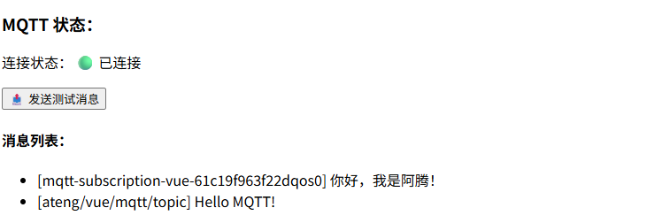

# MQTT

MQTT 是一种基于发布/订阅模式的轻量级消息传输协议，专为低带宽、高延迟和不稳定网络环境设计，具有高性能、低功耗、强解耦等特点，广泛应用于物联网、实时监控、大屏系统和消息推送场景。

- [官网地址](https://mqtt.org)


## 服务端

参考 [安装RabbitMQ](https://atengk.github.io/ops/#/work/service/rabbitmq/) 文档，然后开启 MQTT 插件

```
rabbitmq-plugins enable rabbitmq_mqtt
rabbitmq-plugins enable rabbitmq_web_mqtt
```

| 端口  | 说明                |
| ----- | ------------------- |
| 1883  | MQTT TCP            |
| 8883  | MQTT SSL            |
| 15675 | MQTT over WebSocket |
| 15672 | RabbitMQ 管理后台   |

MQTT 客户端通过唯一的 `clientId` 标识连接，每个客户端 `subscribe(topic)` 时订阅的是 MQTT Topic（不是 Queue），RabbitMQ 的 MQTT 插件会基于每个不同的 `clientId` 自动创建独立 Queue 并按该 Topic（斜杠转点）绑定到 `amq.topic`，因此只要多个客户端订阅同一个 Topic 且 `clientId` 各不相同，它们就可以互相通过 `publish(topic)` 实现消息广播，而无需自行管理 Queue 或路由。


## 基础配置

**安装依赖**

```
pnpm add mqtt@5.14.1
```


## 组合式函数

`src/composables/useMqttClient.ts`

```ts
import { ref, onBeforeUnmount } from 'vue'
import mqtt, { MqttClient, type IClientOptions } from 'mqtt'

interface ConnectOptions extends IClientOptions {
    url: string
}

export function useMqttClient() {
    const client = ref<MqttClient | null>(null)
    const isConnected = ref(false)

    const connect = (options: ConnectOptions) => {
        client.value = mqtt.connect(options.url, options)

        client.value.on('connect', () => {
            isConnected.value = true
            console.log('[MQTT] connected')
        })

        client.value.on('error', (err) => {
            console.error('[MQTT] error:', err)
        })

        client.value.on('close', () => {
            isConnected.value = false
            console.warn('[MQTT] disconnected')
        })
    }

    const publish = (topic: string, message: string | Buffer) => {
        if (client.value && isConnected.value) {
            client.value.publish(topic, message)
        }
    }

    const subscribe = (topic: string) => {
        if (client.value && isConnected.value) {
            client.value.subscribe(topic)
        }
    }

    const onMessage = (cb: (topic: string, payload: string) => void) => {
        if (!client.value) return
        client.value.on('message', (topic, message) => {
            cb(topic, message.toString())
        })
    }

    const disconnect = () => {
        client.value?.end()
    }

    onBeforeUnmount(() => disconnect())

    return {
        connect,
        publish,
        subscribe,
        onMessage,
        disconnect,
        isConnected,
    }
}
```

## 创建 Provider

`src/composables/useMqttClientProvider.ts`

```ts
import { provide, inject, type InjectionKey } from 'vue'
import { useMqttClient } from './useMqttClient'

/**
 * 定义 MQTT Provider 类型（包含 useMqttClient 返回的内容）
 */
export type MqttClientContext = ReturnType<typeof useMqttClient>

/**
 * 创建全局唯一的 MQTT 注入 Key
 */
export const MQTT_KEY: InjectionKey<MqttClientContext> = Symbol('MQTT_KEY')

/**
 * Provider：在父级组件执行，用于全局提供 MQTT 客户端
 */
export function provideMqttClient() {
    const mqtt = useMqttClient()
    provide(MQTT_KEY, mqtt)
    return mqtt
}

/**
 * Inject：在任意子组件调用，用于获取 MQTT 客户端
 */
export function useMqttClientInject(): MqttClientContext {
    const mqtt = inject(MQTT_KEY)
    if (!mqtt) {
        throw new Error('[MQTT] inject 失败：请确保父级已调用 provideMqttClient()')
    }
    return mqtt
}
```


## 基本使用

### 创建 `views/MqttDemo.vue`

```vue
<script setup lang="ts">
import { onMounted, ref } from 'vue'
import { useMqttClientInject } from '@/composables/useMqttClientProvider'

// inject 全局 MQTT
const mqtt = useMqttClientInject()

const list = ref<string[]>([])

onMounted(() => {
  mqtt.subscribe('ateng/vue/topic')

  mqtt.onMessage((topic, payload) => {
    list.value.unshift(`[${topic}] ${payload}`)
  })
})

const send = () => {
  mqtt.publish('ateng/vue/topic', 'Hello MQTT!')
}
</script>

<template>
  <div>
    <h3>MQTT 状态：</h3>
    <p>
      连接状态：
      <span v-if="mqtt.isConnected">🟢 已连接</span>
      <span v-else>🔴 未连接</span>
    </p>

    <button @click="send" :disabled="!mqtt.isConnected">
      📤 发送测试消息
    </button>

    <h4>消息列表：</h4>
    <ul>
      <li v-for="(item, i) in list" :key="i">{{ item }}</li>
    </ul>
  </div>
</template>
```

### App.vue

```vue
<script setup lang="ts">
import { onMounted } from 'vue'
import { provideMqttClient } from '@/composables/useMqttClientProvider'
import MqttDemo from "@/views/MqttDemo.vue";

// 创建并 provide 全局 MQTT
const mqtt = provideMqttClient()

onMounted(() => {
  mqtt.connect({
    url: 'ws://175.178.193.128:20014/ws',
    username: 'admin',
    password: 'Admin@123',
    clientId: 'vue-' + Math.random().toString(16).slice(2),
    clean: true,
  })
})
</script>

<template>
  <MqttDemo />
</template>
```

