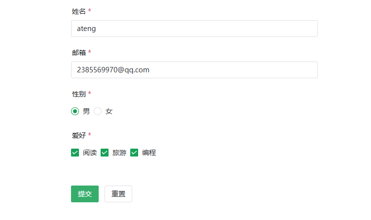

# Naive UI

一个 Vue 3 组件库，TypeScript 友好，主题系统强大，按需天然支持。

- [官网地址](https://www.naiveui.com/)

------

## 基础配置

**安装依赖**

```bash
pnpm add naive-ui@2.43.2
```

------

**全局注册**

在 `main.ts` 中：

```ts
import { createApp } from 'vue'
import App from './App.vue'
import naive from 'naive-ui'

const app = createApp(App)

app.use(naive)

app.mount('#app')
```

------

## 按需引入

安装插件

```
pnpm add -D unplugin-vue-components@30.0.0 unplugin-auto-import@20.3.0
```

配置 vite.config.ts

```ts
import { defineConfig } from 'vite'
import AutoImport from 'unplugin-auto-import/vite'
import Components from 'unplugin-vue-components/vite'
import { NaiveUiResolver } from 'unplugin-vue-components/resolvers'

export default defineConfig({
  plugins: [
    AutoImport({
      resolvers: [NaiveUiResolver()]
    }),
    Components({
      resolvers: [NaiveUiResolver()]
    })
  ]
})
```

## 按需引入（可选）

如果你想手动按需引入：

```ts
import { createApp } from 'vue'
import App from './App.vue'
import { create, NButton, NForm, NInput } from 'naive-ui'

const naive = create({
  components: [NButton, NForm, NInput]
})

createApp(App).use(naive).mount('#app')
```

通常不需要额外插件（不像 Element Plus 需要 resolver）。

------

# 使用示例

------

## 基础按钮示例

```vue
<template>
  <div class="button-demo">
    <n-button type="primary">主要按钮</n-button>
    <n-button type="success">成功按钮</n-button>
    <n-button type="warning">警告按钮</n-button>
    <n-button type="error">危险按钮</n-button>
    <n-button type="info">信息按钮</n-button>
    <n-button quaternary>朴素按钮</n-button>
    <n-button round>圆角按钮</n-button>
    <n-button>
      <template #icon>
        🔍
      </template>
      带图标按钮
    </n-button>
  </div>
</template>

<script setup lang="ts">

</script>

<style scoped>
.button-demo {
  display: flex;
  flex-wrap: wrap;
  gap: 12px;
  padding: 16px;
}
</style>
```


------

## 表单示例

Naive UI 表单 API 和 Element Plus 有明显差异。

```vue
<template>
  <n-form
      ref="formRef"
      :model="form"
      :rules="rules"
      label-width="100"
  >
    <n-form-item label="姓名" path="name">
      <n-input v-model:value="form.name" placeholder="请输入姓名" />
    </n-form-item>

    <n-form-item label="邮箱" path="email">
      <n-input v-model:value="form.email" placeholder="请输入邮箱" />
    </n-form-item>

    <n-form-item label="性别" path="gender">
      <n-radio-group v-model:value="form.gender">
        <n-radio value="male">男</n-radio>
        <n-radio value="female">女</n-radio>
      </n-radio-group>
    </n-form-item>

    <n-form-item label="爱好" path="hobby">
      <n-checkbox-group v-model:value="form.hobby">
        <n-checkbox value="reading">阅读</n-checkbox>
        <n-checkbox value="traveling">旅游</n-checkbox>
        <n-checkbox value="coding">编程</n-checkbox>
      </n-checkbox-group>
    </n-form-item>

    <n-form-item>
      <n-button type="primary" @click="submitForm">提交</n-button>
      <n-button @click="resetForm" style="margin-left: 12px">重置</n-button>
    </n-form-item>
  </n-form>
</template>

<script setup lang="ts">
import { ref } from 'vue'
import { type FormInst, type FormRules } from 'naive-ui'

interface FormModel {
  name: string
  email: string
  gender: string
  hobby: string[]
}

const formRef = ref<FormInst | null>(null)

const form = ref<FormModel>({
  name: '',
  email: '',
  gender: '',
  hobby: [],
})

const rules: FormRules = {
  name: [
    { required: true, message: '请输入姓名', trigger: 'blur' },
    { min: 2, max: 10, message: '长度在 2 到 10 个字符', trigger: 'blur' },
  ],
  email: [
    { required: true, message: '请输入邮箱', trigger: 'blur' },
    { type: 'email', message: '请输入正确的邮箱地址', trigger: 'blur' },
  ],
  gender: {
    required: true,
    message: '请选择性别',
    trigger: 'change',
  },
  hobby: {
    type: 'array',
    required: true,
    message: '请选择爱好',
    trigger: 'change',
  },
}

const submitForm = async () => {
  try {
    await formRef.value?.validate()
  } catch (err) {
  }
}

const resetForm = () => {
  formRef.value?.restoreValidation()
  form.value = {
    name: '',
    email: '',
    gender: '',
    hobby: [],
  }
}
</script>

<style scoped>
.n-form {
  max-width: 500px;
  margin: 20px auto;
}
</style>
```



------

