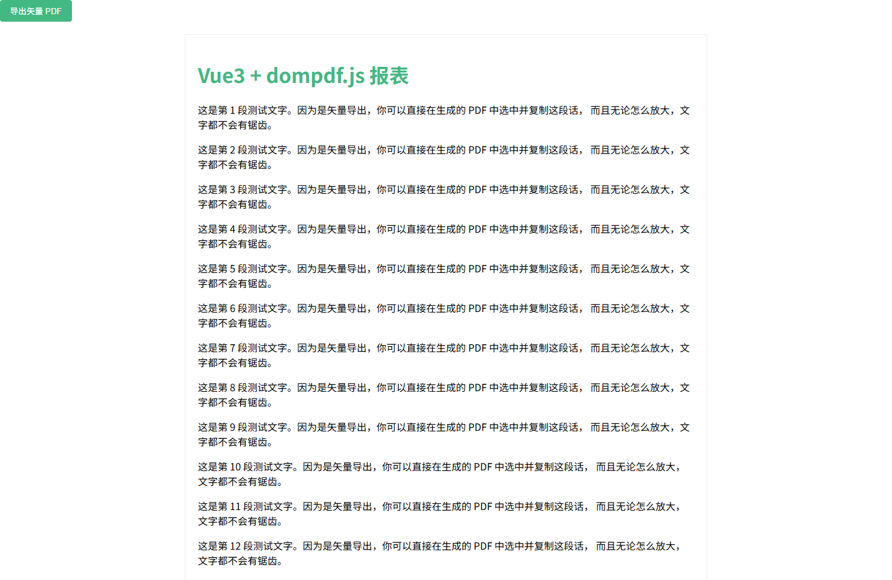
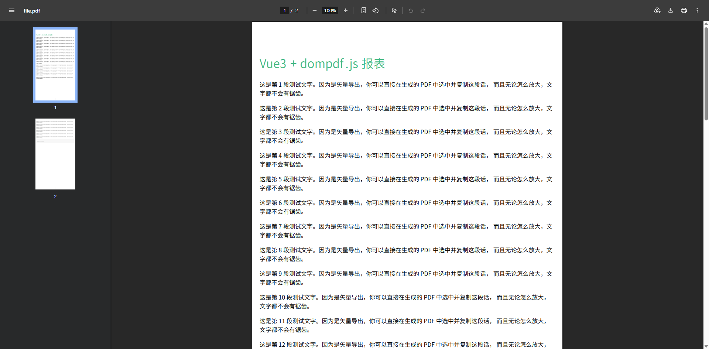
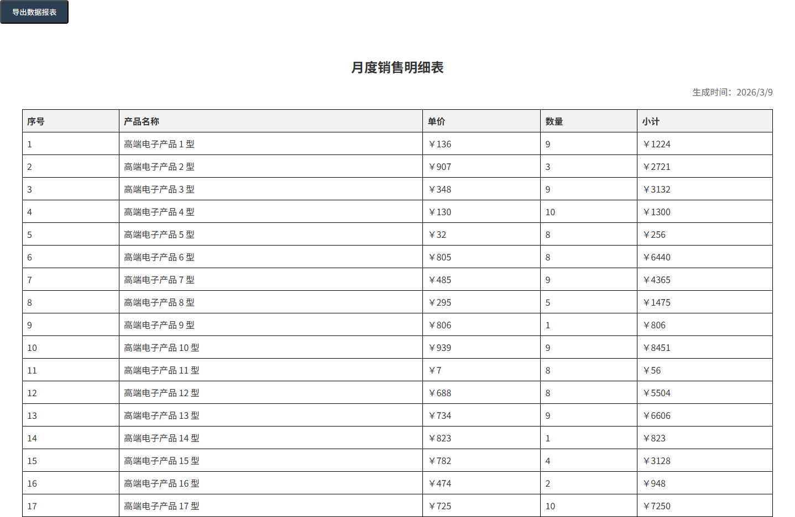
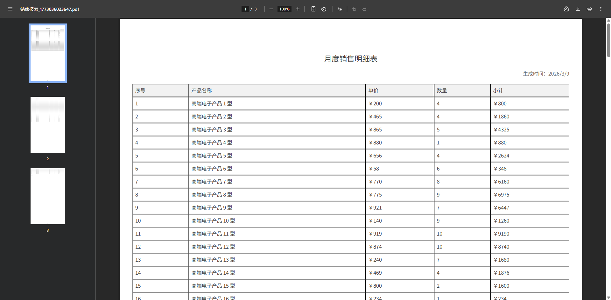

# dompdf

**dompdf.js** 是一个 **纯前端 HTML → PDF 生成库**，可以直接把页面 DOM 转成 **可编辑的矢量 PDF**。 

核心特点：

- 纯前端运行（浏览器生成 PDF）
- 不需要服务器
- 生成 **矢量 PDF（不是图片）**
- 文本可以：
  - 选中
  - 搜索
  - 复制
- 支持复杂 DOM
- 支持自动分页
- 可以生成 **上千页 PDF** 

一句话总结：

> **dompdf.js = HTML → DOM解析 → jsPDF指令 → 矢量PDF**

- [官网地址](https://github.com/lmn1919/dompdf.js)


## 基础配置

**安装依赖**

```
pnpm add dompdf.js@1.1.1
```


## 使用示例

### 示例 1：基础文本与自动分页

```vue
<template>
  <div class="p-4">
    <button @click="exportPDF" class="btn-primary">导出矢量 PDF</button>

    <div ref="pdfContent" class="pdf-container">
      <h1 style="color: #42b883;">Vue3 + dompdf.js 报表</h1>
      <p v-for="i in 20" :key="i">
        这是第 {{ i }} 段测试文字。因为是矢量导出，你可以直接在生成的 PDF 中选中并复制这段话，
        而且无论怎么放大，文字都不会有锯齿。
      </p>
      <div style="background: #f0f0f0; border-radius: 8px; padding: 15px;">
        <p>支持圆角和背景颜色</p>
      </div>
    </div>
  </div>
</template>

<script setup lang="ts">
import { ref } from 'vue';
import dompdf from 'dompdf.js';
import "@/assets/fonts/SourceHanSansSC-Normal-Min-normal.js"

const pdfContent = ref<HTMLElement | null>(null);

const exportPDF = async () => {
  if (!pdfContent.value) return;

  // 初始化配置
  const blob = await dompdf(pdfContent.value, {
    useCORS: true,           // 如果有外部图片需要开启
    fontConfig: {
      fontFamily: "SourceHanSansSC-Normal-Min", // 字体名称
      fontBase64: (window as any).fontBase64,   // 字体 Base64
      fontStyle: "normal",                       // 字体样式
      fontWeight: 400                            // 字重
    }
  })

  try {
    const url = URL.createObjectURL(blob)
    const a = document.createElement("a")
    a.href = url
    a.download = "user.pdf"
    a.click()
    console.log('导出成功');
  } catch (error) {
    console.error('导出失败:', error);
  }
};
</script>

<style scoped>
.pdf-container {
  padding: 20px;
  background: white;
  width: 800px;
  margin: 20px auto;
  border: 1px solid #eee;
}
.btn-primary {
  padding: 8px 16px;
  background: #42b883;
  color: white;
  border: none;
  border-radius: 4px;
  cursor: pointer;
}
</style>
```





### 示例 2：动态数据表格与多页布局

这个示例展示了在 Vue3 中如何处理动态生成的报表表格。这种场景通常需要处理 `border` 的还原以及长表格的自动分页。

```vue
<template>
  <div class="p-6">
    <div class="flex gap-4 mb-4">
      <button @click="generateTablePDF" class="btn-export">导出数据报表</button>
    </div>

    <div ref="reportRef" class="report-wrapper">
      <h2 class="title">月度销售明细表</h2>
      <p class="subtitle">生成时间：{{ new Date().toLocaleDateString() }}</p>

      <table class="data-table">
        <thead>
          <tr>
            <th>序号</th>
            <th>产品名称</th>
            <th>单价</th>
            <th>数量</th>
            <th>小计</th>
          </tr>
        </thead>
        <tbody>
          <tr v-for="(item, index) in tableData" :key="index">
            <td>{{ index + 1 }}</td>
            <td>{{ item.name }}</td>
            <td>￥{{ item.price }}</td>
            <td>{{ item.count }}</td>
            <td>￥{{ item.price * item.count }}</td>
          </tr>
        </tbody>
      </table>
      
      <div class="footer">
        <p>审批人：_____________</p>
      </div>
    </div>
  </div>
</template>

<script setup lang="ts">
import { ref } from 'vue';
import dompdf from 'dompdf.js';
// 假设你已经将字体 Base64 挂载到了 window 或导出
import "@/assets/fonts/SourceHanSansSC-Normal-Min-normal.js";

interface Product {
  name: string;
  price: number;
  count: number;
}

const reportRef = ref<HTMLElement | null>(null);

// 模拟 50 条数据，触发自动分页
const tableData = ref<Product[]>(
  Array.from({ length: 50 }, (_, i) => ({
    name: `高端电子产品 ${i + 1} 型`,
    price: Math.floor(Math.random() * 1000),
    count: Math.floor(Math.random() * 10) + 1
  }))
);

const generateTablePDF = async () => {
  if (!reportRef.value) return;

  const blob = await dompdf(reportRef.value, {
    useCORS: true,
    fontConfig: {
      fontFamily: "SourceHanSansSC-Normal-Min",
      fontBase64: (window as any).fontBase64,
      fontStyle: "normal",
      fontWeight: 400
    }
  });

  const url = URL.createObjectURL(blob);
  const link = document.createElement("a");
  link.href = url;
  link.download = `销售报表_${Date.now()}.pdf`;
  link.click();
  URL.revokeObjectURL(url);
};
</script>

<style scoped>
.report-wrapper {
  padding: 40px;
  background: #fff;
  color: #333;
  font-family: "SourceHanSansSC-Normal-Min", sans-serif;
}
.title { text-align: center; font-size: 24px; margin-bottom: 10px; }
.subtitle { text-align: right; margin-bottom: 20px; color: #666; }

.data-table {
  width: 100%;
  border-collapse: collapse; /* 重要：dompdf 对合并边框支持较好 */
  margin-bottom: 30px;
}
.data-table th, .data-table td {
  border: 1px solid #000;
  padding: 8px;
  text-align: left;
}
.data-table th { background-color: #f2f2f2; }
.footer { margin-top: 50px; }
.btn-export {
  padding: 10px 20px;
  background: #2c3e50;
  color: white;
  border-radius: 4px;
  cursor: pointer;
}
</style>
```





------

