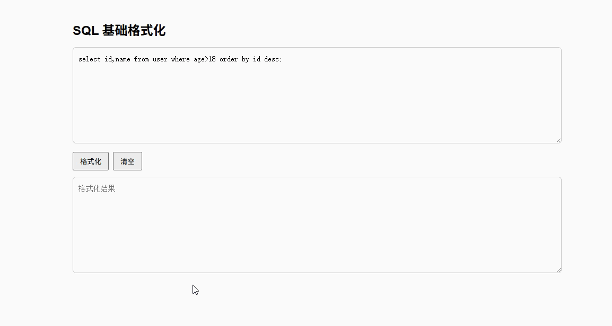
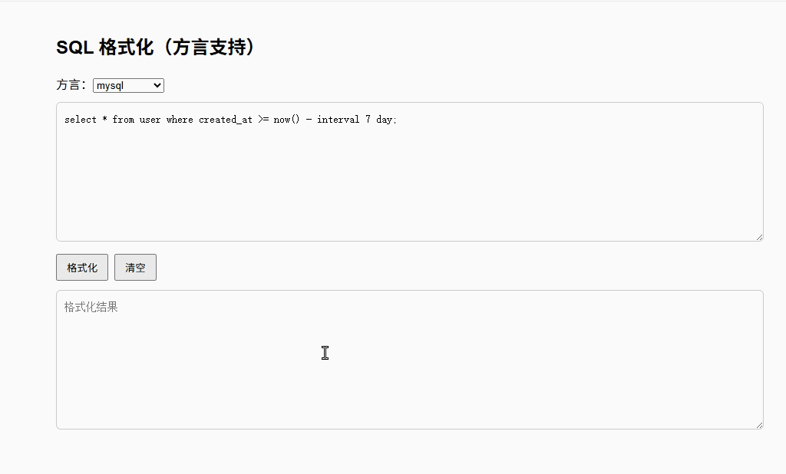
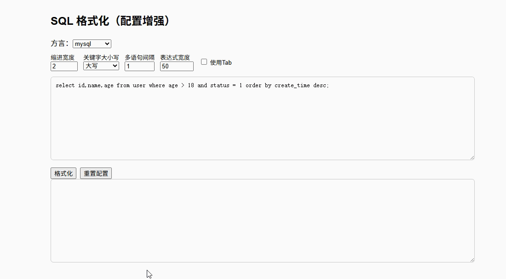
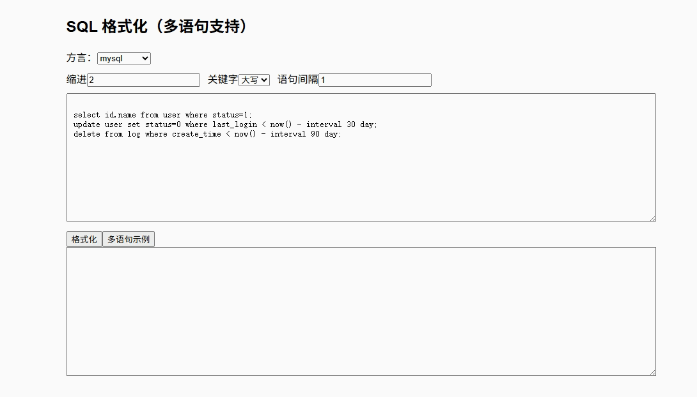
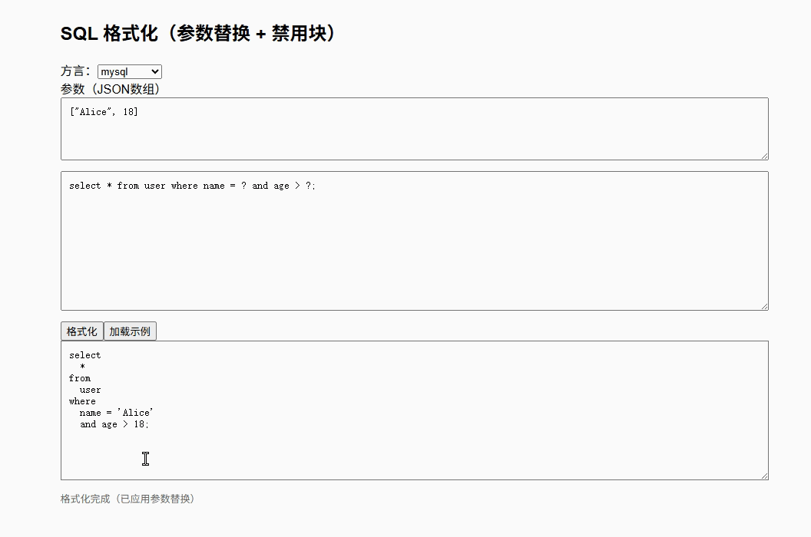

# SQL formatter

SQL 格式化工具是一个用于美化打印 SQL 查询语句的 JavaScript 库。

- [GitHub](https://github.com/sql-formatter-org/sql-formatter)


## 基础配置

**安装依赖**

```
pnpm add sql-formatter@15.7.3
```

## 基础格式化

```vue
<template>
  <div class="container">
    <h2>SQL 基础格式化</h2>

    <textarea
        v-model="inputSql"
        class="textarea"
        placeholder="请输入SQL，例如：select * from user where id=1"
    />

    <div class="actions">
      <button @click="handleFormat">格式化</button>
      <button @click="handleClear">清空</button>
    </div>

    <textarea
        v-model="outputSql"
        class="textarea output"
        readonly
        placeholder="格式化结果"
    />
  </div>
</template>

<script setup lang="ts">
import { ref } from 'vue'
import { format } from 'sql-formatter'

// 输入 SQL
const inputSql = ref(`select id,name from user where age>18 order by id desc;`)

// 输出 SQL
const outputSql = ref('')

// 格式化
const handleFormat = () => {
  try {
    outputSql.value = format(inputSql.value)
  } catch (e) {
    outputSql.value = '格式化失败: ' + (e as Error).message
  }
}

// 清空
const handleClear = () => {
  inputSql.value = ''
  outputSql.value = ''
}
</script>

<style scoped>
.container {
  max-width: 900px;
  margin: 40px auto;
  font-family: Arial, sans-serif;
}

h2 {
  margin-bottom: 16px;
}

.textarea {
  width: 100%;
  min-height: 160px;
  margin-bottom: 12px;
  padding: 10px;
  border: 1px solid #ccc;
  border-radius: 6px;
  resize: vertical;
  font-size: 14px;
  line-height: 1.6;
}

.output {
  background: #f5f5f5;
}

.actions {
  margin-bottom: 12px;
}

button {
  margin-right: 8px;
  padding: 6px 12px;
  cursor: pointer;
}
</style>
```



## 方言切换

```vue
<template>
  <div class="container">
    <h2>SQL 格式化（方言支持）</h2>

    <!-- 方言选择 -->
    <div class="toolbar">
      <label>方言：</label>
      <select v-model="language">
        <option value="sql">sql（通用）</option>
        <option value="mysql">mysql</option>
        <option value="postgresql">postgresql</option>
        <option value="sqlite">sqlite</option>
        <option value="bigquery">bigquery</option>
      </select>
    </div>

    <textarea
        v-model="inputSql"
        class="textarea"
        placeholder="请输入SQL"
    />

    <div class="actions">
      <button @click="handleFormat">格式化</button>
      <button @click="handleClear">清空</button>
    </div>

    <textarea
        v-model="outputSql"
        class="textarea output"
        readonly
        placeholder="格式化结果"
    />
  </div>
</template>

<script setup lang="ts">
import { ref } from 'vue'
import { format } from 'sql-formatter'

// 输入 SQL
const inputSql = ref(`select * from user where created_at >= now() - interval 7 day;`)

// 输出 SQL
const outputSql = ref('')

// 当前方言（默认 mysql）
const language = ref<'sql' | 'mysql' | 'postgresql' | 'sqlite' | 'bigquery'>('mysql')

// 格式化
const handleFormat = () => {
  try {
    outputSql.value = format(inputSql.value, {
      language: language.value
    })
  } catch (e) {
    outputSql.value = '格式化失败: ' + (e as Error).message
  }
}

// 清空
const handleClear = () => {
  inputSql.value = ''
  outputSql.value = ''
}
</script>

<style scoped>
.container {
  max-width: 900px;
  margin: 40px auto;
  font-family: Arial, sans-serif;
}

.toolbar {
  margin-bottom: 12px;
}

.textarea {
  width: 100%;
  min-height: 160px;
  margin-bottom: 12px;
  padding: 10px;
  border: 1px solid #ccc;
  border-radius: 6px;
  resize: vertical;
  font-size: 14px;
  line-height: 1.6;
}

.output {
  background: #f5f5f5;
}

.actions {
  margin-bottom: 12px;
}

button {
  margin-right: 8px;
  padding: 6px 12px;
  cursor: pointer;
}
</style>
```

**切换方言测试**

MySQL

```
select * from t where created_at >= now() - interval 7 day;
```

PostgreSQL

```
select * from t where created_at >= now() - interval '7 days';
```



## 格式配置

```vue
<template>
  <div class="container">
    <h2>SQL 格式化（配置增强）</h2>

    <!-- 方言 -->
    <div class="toolbar">
      <label>方言：</label>
      <select v-model="language">
        <option value="sql">sql</option>
        <option value="mysql">mysql</option>
        <option value="postgresql">postgresql</option>
        <option value="sqlite">sqlite</option>
      </select>
    </div>

    <!-- 配置项 -->
    <div class="config">
      <div class="item">
        <label>缩进宽度</label>
        <input type="number" v-model.number="config.tabWidth" min="0" max="8" />
      </div>

      <div class="item">
        <label>关键字大小写</label>
        <select v-model="config.keywordCase">
          <option value="preserve">保持</option>
          <option value="upper">大写</option>
          <option value="lower">小写</option>
        </select>
      </div>

      <div class="item">
        <label>多语句间隔</label>
        <input type="number" v-model.number="config.linesBetweenQueries" min="0" max="3" />
      </div>

      <div class="item">
        <label>表达式宽度</label>
        <input type="number" v-model.number="config.expressionWidth" min="20" max="120" />
      </div>

      <div class="item inline">
        <label>
          <input type="checkbox" v-model="config.useTabs" />
          使用Tab
        </label>
      </div>
    </div>

    <textarea v-model="inputSql" class="textarea" />

    <div class="actions">
      <button @click="handleFormat">格式化</button>
      <button @click="handleReset">重置配置</button>
    </div>

    <textarea v-model="outputSql" class="textarea output" readonly />
  </div>
</template>

<script setup lang="ts">
import { ref, reactive } from 'vue'
import { format } from 'sql-formatter'

// SQL
const inputSql = ref(`select id,name,age from user where age > 18 and status = 1 order by create_time desc;`)
const outputSql = ref('')

// 方言
const language = ref<'sql' | 'mysql' | 'postgresql' | 'sqlite'>('mysql')

// 配置
const defaultConfig = {
  tabWidth: 2,
  useTabs: false,
  keywordCase: 'upper' as 'upper' | 'lower' | 'preserve',
  linesBetweenQueries: 1,
  expressionWidth: 50
}

const config = reactive({ ...defaultConfig })

// 格式化
const handleFormat = () => {
  try {
    outputSql.value = format(inputSql.value, {
      language: language.value,
      tabWidth: config.tabWidth,
      useTabs: config.useTabs,
      keywordCase: config.keywordCase,
      linesBetweenQueries: config.linesBetweenQueries,
      expressionWidth: config.expressionWidth
    })
  } catch (e) {
    outputSql.value = '格式化失败: ' + (e as Error).message
  }
}

// 重置配置
const handleReset = () => {
  Object.assign(config, defaultConfig)
}
</script>

<style scoped>
.container {
  max-width: 900px;
  margin: 40px auto;
  font-family: Arial, sans-serif;
}

.toolbar {
  margin-bottom: 10px;
}

.config {
  display: flex;
  flex-wrap: wrap;
  gap: 12px;
  margin-bottom: 12px;
}

.item {
  display: flex;
  flex-direction: column;
  font-size: 13px;
}

.item.inline {
  justify-content: center;
}

.textarea {
  width: 100%;
  min-height: 160px;
  margin-bottom: 12px;
  padding: 10px;
  border: 1px solid #ccc;
  border-radius: 6px;
}

.output {
  background: #f5f5f5;
}

.actions button {
  margin-right: 8px;
}
</style>
```



## 多语句支持

```vue
<template>
  <div class="container">
    <h2>SQL 格式化（多语句支持）</h2>

    <!-- 方言 -->
    <div class="toolbar">
      <label>方言：</label>
      <select v-model="language">
        <option value="sql">sql</option>
        <option value="mysql">mysql</option>
        <option value="postgresql">postgresql</option>
        <option value="sqlite">sqlite</option>
      </select>
    </div>

    <!-- 配置 -->
    <div class="config">
      <div class="item">
        <label>缩进</label>
        <input type="number" v-model.number="config.tabWidth" />
      </div>

      <div class="item">
        <label>关键字</label>
        <select v-model="config.keywordCase">
          <option value="preserve">保持</option>
          <option value="upper">大写</option>
          <option value="lower">小写</option>
        </select>
      </div>

      <div class="item">
        <label>语句间隔</label>
        <input type="number" v-model.number="config.linesBetweenQueries" />
      </div>
    </div>

    <!-- 输入 -->
    <textarea v-model="inputSql" class="textarea" />

    <div class="actions">
      <button @click="handleFormat">格式化</button>
      <button @click="loadMultiExample">多语句示例</button>
    </div>

    <!-- 输出 -->
    <textarea v-model="outputSql" class="textarea output" readonly />
  </div>
</template>

<script setup lang="ts">
import { ref, reactive } from 'vue'
import { format } from 'sql-formatter'

// 多语句默认示例
const defaultMultiSql = `
select id,name from user where status=1;
update user set status=0 where last_login < now() - interval 30 day;
delete from log where create_time < now() - interval 90 day;
`

const inputSql = ref(defaultMultiSql)
const outputSql = ref('')

// 方言
const language = ref<'sql' | 'mysql' | 'postgresql' | 'sqlite'>('mysql')

// 配置
const config = reactive({
  tabWidth: 2,
  keywordCase: 'upper' as 'upper' | 'lower' | 'preserve',
  linesBetweenQueries: 1
})

// 格式化（关键：库自动处理多语句）
const handleFormat = () => {
  try {
    outputSql.value = format(inputSql.value, {
      language: language.value,
      tabWidth: config.tabWidth,
      keywordCase: config.keywordCase,
      linesBetweenQueries: config.linesBetweenQueries
    })
  } catch (e) {
    outputSql.value = '格式化失败: ' + (e as Error).message
  }
}

// 加载示例
const loadMultiExample = () => {
  inputSql.value = defaultMultiSql
}
</script>

<style scoped>
.container {
  max-width: 900px;
  margin: 40px auto;
  font-family: Arial;
}

.toolbar {
  margin-bottom: 10px;
}

.config {
  display: flex;
  gap: 12px;
  margin-bottom: 10px;
}

.textarea {
  width: 100%;
  min-height: 180px;
  margin-bottom: 10px;
  padding: 10px;
}

.output {
  background: #f5f5f5;
}
</style>
```



## 参数替换 + 禁用块

```vue
<template>
  <div class="container">
    <h2>SQL 格式化（参数替换 + 禁用块）</h2>

    <!-- 方言 -->
    <div class="toolbar">
      <label>方言：</label>
      <select v-model="language">
        <option value="sql">sql</option>
        <option value="mysql">mysql</option>
        <option value="postgresql">postgresql</option>
      </select>
    </div>

    <!-- 参数 -->
    <div>
      <label>参数（JSON数组）</label>
      <textarea
          v-model="paramsText"
          class="textarea small"
          placeholder='["Alice", 18]'
      />
    </div>

    <!-- SQL -->
    <textarea v-model="inputSql" class="textarea" />

    <div class="actions">
      <button @click="handleFormat">格式化</button>
      <button @click="loadExample">加载示例</button>
    </div>

    <!-- 输出 -->
    <textarea v-model="outputSql" class="textarea output" readonly />

    <div class="tip">{{ tip }}</div>
  </div>
</template>

<script setup lang="ts">
import { ref, onMounted } from 'vue'
import { format } from 'sql-formatter'

// SQL
const inputSql = ref(`select * from user where name = ? and age > ?;`)

// 输出
const outputSql = ref('')

// 方言
const language = ref<'sql' | 'mysql' | 'postgresql'>('mysql')

// 参数 JSON
const paramsText = ref(`["Alice", 18]`)

// 提示
const tip = ref('')

// 解析参数（增强版）
const parseParams = (): string[] | undefined => {
  if (!paramsText.value.trim()) return undefined

  try {
    const parsed = JSON.parse(paramsText.value)

    if (!Array.isArray(parsed)) {
      tip.value = '参数必须是数组'
      return undefined
    }

    // 关键：全部转成 string
    return parsed.map(item => {
      if (item === null || item === undefined) return 'NULL'

      // 字符串自动加引号（可选增强）
      if (typeof item === 'string') {
        return `'${item}'`
      }

      return String(item)
    })

  } catch {
    tip.value = '参数 JSON 解析失败'
    return undefined
  }
}

// 格式化
const handleFormat = () => {
  try {
    tip.value = ''

    const params = parseParams()

    outputSql.value = format(inputSql.value, {
      language: language.value,
      ...(params ? { params } : {})
    })

    if (params) {
      tip.value = '格式化完成（已应用参数替换）'
    } else {
      tip.value = '格式化完成'
    }
  } catch (e) {
    outputSql.value = ''
    tip.value = '格式化失败: ' + (e as Error).message
  }
}

// 示例（避免方言冲突）
const loadExample = () => {
  inputSql.value = `
/* sql-formatter-disable */
select * from raw_table where a = 1;
/* sql-formatter-enable */

select * from user where name = ? and age > ?;
`
  paramsText.value = `["Bob", 25]`
}

// 初始自动格式化
onMounted(() => {
  handleFormat()
})
</script>

<style scoped>
.container {
  max-width: 900px;
  margin: 40px auto;
  font-family: Arial;
}

.textarea {
  width: 100%;
  min-height: 160px;
  margin-bottom: 10px;
  padding: 10px;
}

.small {
  min-height: 60px;
}

.output {
  background: #f5f5f5;
}

.tip {
  color: #666;
  font-size: 13px;
}
</style>
```


