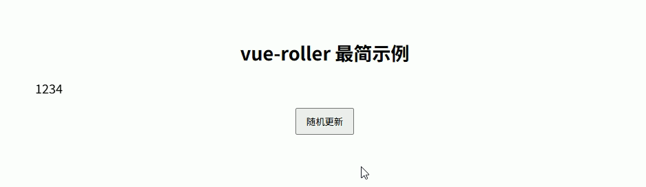

# vue-roller

Vue.js的流畅滚动动画

- [官网地址](https://www.npmjs.com/package/vue-roller)


## 基础配置

**安装依赖**

```
pnpm add vue-roller@2.1.0
```


## 使用示例

```vue
<script setup lang="ts">
import { ref } from 'vue'
import { Roller } from 'vue-roller'
import 'vue-roller/dist/style.css'

const value = ref(1234)

const changeValue = () => {
  value.value = Math.floor(Math.random() * 9999)
}
</script>

<template>
  <div class="box">
    <h2>vue-roller 最简示例</h2>

    <Roller
        :value="String(value)"
        :duration="1000"
    />

    <button @click="changeValue">
      随机更新
    </button>
  </div>
</template>

<style scoped>
.box {
  padding: 40px;
  text-align: center;
  font-size: 18px;
}

button {
  margin-top: 20px;
  padding: 8px 14px;
  cursor: pointer;
}
</style>
```




## 综合示例

```vue
<script setup lang="ts">
import { ref, computed } from 'vue'
import { Roller } from 'vue-roller'
import 'vue-roller/dist/style.css'

/** ===== 数据 ===== */
const num = ref(1234)
const text = ref('ABCD')
const emoji = ref('😀😃😄')

/** ===== string 转换（必须） ===== */
const numStr = computed(() => String(num.value))
const textStr = computed(() => text.value)
const emojiStr = computed(() => emoji.value)

/** ===== 更新 ===== */
const changeNum = () => {
  num.value = Math.floor(Math.random() * 9999)
}

const changeText = () => {
  const chars = 'ABCDEFGHJKMNPQRSTUVWXYZ'
  text.value = Array.from({ length: 4 })
      .map(() => chars[Math.floor(Math.random() * chars.length)])
      .join('')
}

const changeEmoji = () => {
  const pool = ['😀', '😃', '😄', '😁', '😆', '😎']
  emoji.value = Array.from({ length: 3 })
      .map(() => pool[Math.floor(Math.random() * pool.length)])
      .join('')
}
</script>

<template>
  <div class="page">

    <h1>🎰 vue-roller </h1>

    <div class="grid">

      <!-- 🔢 数字 -->
      <div class="card">
        <h3>🔢 number</h3>

        <Roller
            :value="numStr"
            char-set="number"
            :duration="1200"
        />

        <button @click="changeNum">更新数字</button>
      </div>

      <!-- 🔤 字母 -->
      <div class="card">
        <h3>🔤 alphabet</h3>

        <Roller
            :value="textStr"
            char-set="alphabet"
            :duration="1200"
        />

        <button @click="changeText">更新字母</button>
      </div>

      <!-- 😀 emoji -->
      <div class="card">
        <h3>😀 自定义字符集</h3>

        <Roller
            :value="emojiStr"
            :char-set="['😀','😃','😄','😁','😆','😎']"
            :duration="1400"
        />

        <button @click="changeEmoji">更新表情</button>
      </div>

    </div>
  </div>
</template>

<style scoped>
.page {
  padding: 40px;
  min-height: 100vh;
  background: #0b1220;
  color: #e5e7eb;
  font-family: system-ui;
}

h1 {
  text-align: center;
  margin-bottom: 30px;
}

.grid {
  display: grid;
  grid-template-columns: repeat(3, 1fr);
  gap: 16px;
}

.card {
  background: #111827;
  border: 1px solid #1f2937;
  border-radius: 14px;
  padding: 20px;
  text-align: center;
}

.card h3 {
  margin-bottom: 12px;
  color: #93c5fd;
}

/* 放大 roller */
.card :deep(.roller) {
  font-size: 34px;
  font-weight: bold;
  color: #38bdf8;
}

button {
  margin-top: 12px;
  padding: 8px 12px;
  border-radius: 8px;
  border: none;
  cursor: pointer;
  background: #2563eb;
  color: white;
}

button:hover {
  background: #1d4ed8;
}
</style>
```

