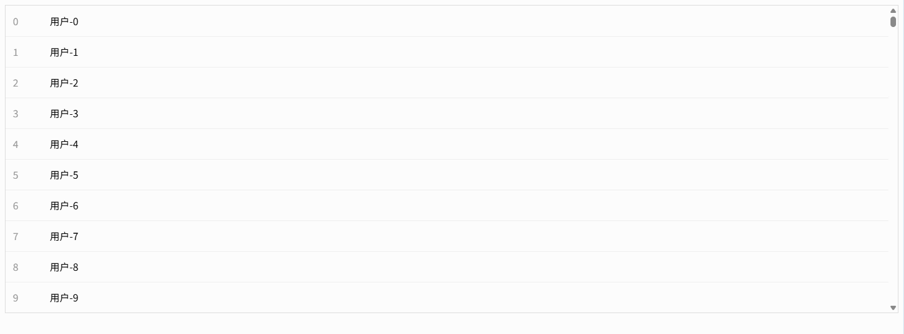
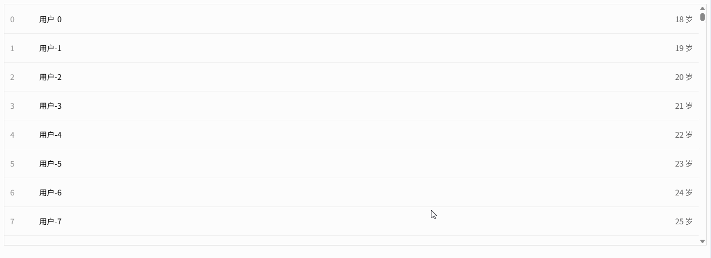
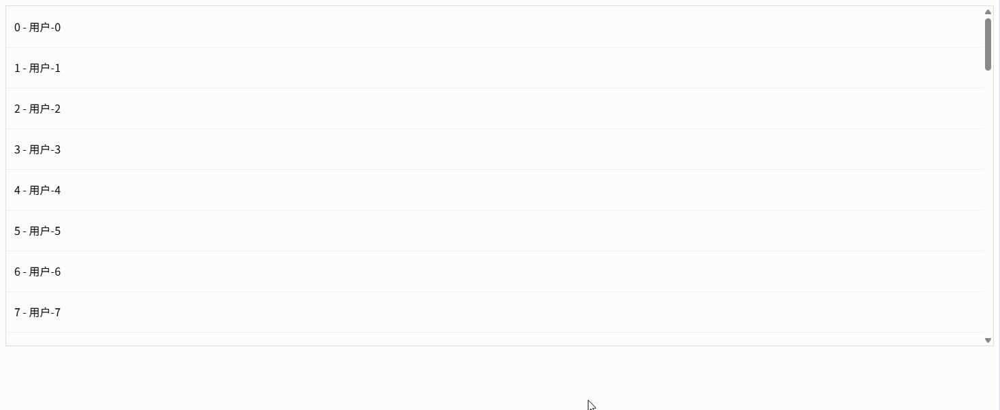
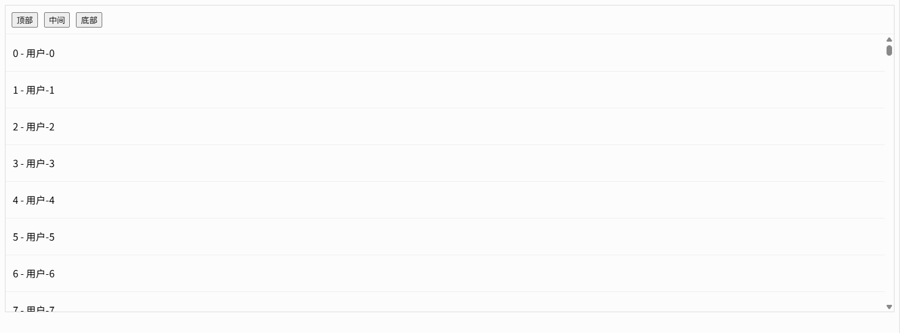
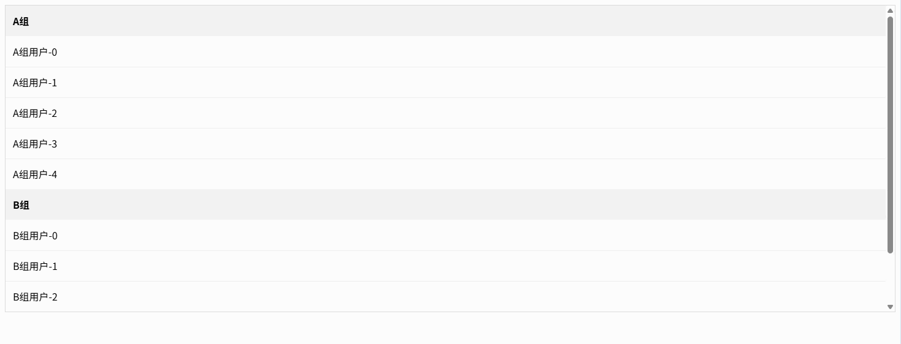
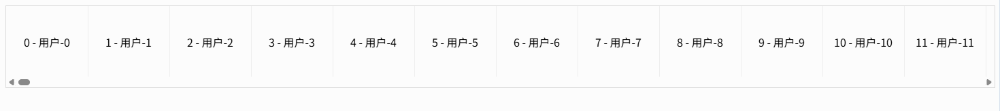

# Vue Virtual Scroller

vue-virtual-scroller 是由 Guillaume Chau 开发的高性能 Vue 虚拟滚动组件库。它通过只渲染可视区域内的列表项，大幅降低 DOM 数量与渲染开销，适用于大数据量列表（如上万条数据）的流畅展示。支持动态高度、网格布局与复用组件，兼容 Vue2 和 Vue3，是前端性能优化中的常用方案。

- [GitHub](https://github.com/Akryum/vue-virtual-scroller)


## 基础配置

**安装依赖**

```
pnpm add vue-virtual-scroller@2.0.1
```


## 基础虚拟列表（RecycledScroller 基本使用）

```vue
<!--
基础虚拟列表示例：使用 RecycledScroller 渲染大数据列表
@author Ateng
@since 2026-04-09
-->
<template>
  <div class="container">
    <!--
      RecycleScroller 核心参数说明：
      items：数据源
      item-size：每一项的固定高度（必须准确，否则会出现滚动错位）
      key-field：每一项的唯一标识字段
      v-slot：作用域插槽，获取 item 和 index
    -->
    <RecycleScroller
        class="scroller"
        :items="list"
        :item-size="50"
        key-field="id"
        v-slot="{ item, index }"
    >
      <!-- 每一项的渲染 -->
      <div class="item">
        <span class="index">{{ index }}</span>
        <span class="text">{{ item.name }}</span>
      </div>
    </RecycleScroller>
  </div>
</template>

<script setup>
/**
 * 引入 RecycledScroller 组件
 */
import { RecycleScroller } from 'vue-virtual-scroller'
import 'vue-virtual-scroller/dist/vue-virtual-scroller.css'

/**
 * 构造大数据列表（10000条）
 */
const list = Array.from({ length: 10000 }).map((_, i) => ({
  id: i,
  name: `用户-${i}`
}))
</script>

<style scoped>
.container {
  height: 500px;
  border: 1px solid #ddd;
}

/* 必须设置高度，否则不会出现滚动 */
.scroller {
  height: 100%;
}

.item {
  display: flex;
  align-items: center;
  height: 50px;
  padding: 0 12px;
  border-bottom: 1px solid #f0f0f0;
}

.index {
  width: 60px;
  color: #999;
}

.text {
  flex: 1;
}
</style>
```



## 动态高度列表（DynamicScroller）

```vue
<!--
动态高度列表示例：使用 DynamicScroller + DynamicScrollerItem 支持不固定高度
@author Ateng
@since 2026-04-09
-->
<template>
  <div class="container">
    <!--
      DynamicScroller 核心参数：
      items：数据源
      min-item-size：最小高度（用于初始估算，提高滚动性能）
      key-field：唯一标识
    -->
    <DynamicScroller
        class="scroller"
        :items="list"
        :min-item-size="50"
        key-field="id"
        v-slot="{ item, index }"
    >
      <!--
        DynamicScrollerItem：
        必须包裹每一项，用于自动计算真实高度
        :size-dependencies 用于监听内容变化（重要）
      -->
      <DynamicScrollerItem
          :item="item"
          :active="true"
          :size-dependencies="[item.content]"
          :data-index="index"
      >
        <div class="item">
          <div class="title">
            {{ index }} - {{ item.title }}
          </div>
          <div class="content">
            {{ item.content }}
          </div>
        </div>
      </DynamicScrollerItem>
    </DynamicScroller>
  </div>
</template>

<script setup>
/**
 * 引入 DynamicScroller 相关组件
 */
import {
  DynamicScroller,
  DynamicScrollerItem
} from 'vue-virtual-scroller'
import 'vue-virtual-scroller/dist/vue-virtual-scroller.css'

/**
 * 构造动态高度数据（内容长度不一致）
 */
const list = Array.from({ length: 1000 }).map((_, i) => {
  const length = Math.floor(Math.random() * 200) + 20
  return {
    id: i,
    title: `标题-${i}`,
    content: '内容'.repeat(length) // 内容长度不同 -> 高度不同
  }
})
</script>

<style scoped>
.container {
  height: 500px;
  border: 1px solid #ddd;
}

.scroller {
  height: 100%;
}

.item {
  padding: 12px;
  border-bottom: 1px solid #f0f0f0;
  box-sizing: border-box;
}

.title {
  font-weight: bold;
  margin-bottom: 6px;
}

.content {
  line-height: 1.6;
  color: #666;
  word-break: break-all;
}
</style>
```


## 列表项组件封装（item slot + 独立组件）

**列表项组件封装（item slot + 独立组件）**

```vue
<!--
父组件：通过 item slot 渲染独立的列表项组件（解耦结构与逻辑）
@author Ateng
@since 2026-04-09
-->
<template>
  <div class="container">
    <RecycleScroller
      class="scroller"
      :items="list"
      :item-size="60"
      key-field="id"
      v-slot="{ item, index }"
    >
      <!-- 使用独立组件 -->
      <ListItem :item="item" :index="index" />
    </RecycleScroller>
  </div>
</template>

<script setup>
/**
 * 引入虚拟列表组件
 */
import { RecycleScroller } from 'vue-virtual-scroller'
import 'vue-virtual-scroller/dist/vue-virtual-scroller.css'

/**
 * 引入自定义列表项组件
 */
import ListItem from './ListItem.vue'

/**
 * 模拟数据
 */
const list = Array.from({ length: 10000 }).map((_, i) => ({
  id: i,
  name: `用户-${i}`,
  age: 18 + (i % 10)
}))
</script>

<style scoped>
.container {
  height: 500px;
  border: 1px solid #ddd;
}

.scroller {
  height: 100%;
}
</style>
```

ListItem.vue

```vue
<!--
子组件：列表项组件（可复用、可维护）
@author Ateng
@since 2026-04-09
-->
<template>
  <div class="item">
    <span class="index">{{ index }}</span>
    <span class="name">{{ item.name }}</span>
    <span class="age">{{ item.age }} 岁</span>
  </div>
</template>

<script setup>
/**
 * 定义 props
 */
defineProps({
  item: {
    type: Object,
    required: true
  },
  index: {
    type: Number,
    required: true
  }
})
</script>

<style scoped>
.item {
  display: flex;
  align-items: center;
  height: 60px;
  padding: 0 12px;
  border-bottom: 1px solid #f0f0f0;
}

.index {
  width: 60px;
  color: #999;
}

.name {
  flex: 1;
}

.age {
  color: #666;
}
</style>
```



## 无限滚动加载（结合分页接口）

```vue
<!--
无限滚动列表示例：滚动到底部自动加载下一页数据（模拟分页接口）
@author Ateng
@since 2026-04-09
-->
<template>
  <div class="container">
    <RecycleScroller
      class="scroller"
      :items="list"
      :item-size="60"
      key-field="id"
      :buffer="200"
      @scroll="handleScroll"
      v-slot="{ item, index }"
    >
      <div class="item">
        <span>{{ index }} - {{ item.name }}</span>
      </div>
    </RecycleScroller>

    <!-- 加载状态 -->
    <div class="loading" v-if="loading">加载中...</div>
    <div class="no-more" v-if="finished">没有更多数据了</div>
  </div>
</template>

<script setup>
import { ref } from 'vue'
import { RecycleScroller } from 'vue-virtual-scroller'
import 'vue-virtual-scroller/dist/vue-virtual-scroller.css'

/**
 * 列表数据
 */
const list = ref([])

/**
 * 分页参数
 */
const page = ref(1)
const pageSize = 50
const loading = ref(false)
const finished = ref(false)

/**
 * 模拟分页接口
 */
const fetchData = async () => {
  if (loading.value || finished.value) return

  loading.value = true

  // 模拟接口延迟
  await new Promise(resolve => setTimeout(resolve, 500))

  // 模拟总数据 500 条
  const total = 500
  const start = (page.value - 1) * pageSize
  const end = start + pageSize

  const newList = Array.from({
    length: Math.min(pageSize, total - start)
  }).map((_, i) => ({
    id: start + i,
    name: `用户-${start + i}`
  }))

  if (newList.length === 0) {
    finished.value = true
  } else {
    list.value = list.value.concat(newList)
    page.value++
  }

  loading.value = false
}

/**
 * 滚动监听：接近底部时加载下一页
 */
const handleScroll = (event) => {
  const { scrollTop, clientHeight, scrollHeight } = event.target

  // 距离底部 100px 时触发加载
  if (scrollTop + clientHeight >= scrollHeight - 100) {
    fetchData()
  }
}

/**
 * 初始化加载第一页
 */
fetchData()
</script>

<style scoped>
.container {
  height: 500px;
  border: 1px solid #ddd;
  position: relative;
}

.scroller {
  height: 100%;
}

.item {
  height: 60px;
  display: flex;
  align-items: center;
  padding: 0 12px;
  border-bottom: 1px solid #f0f0f0;
}

.loading,
.no-more {
  text-align: center;
  padding: 10px;
  color: #999;
}
</style>
```



## 滚动到指定位置（scrollToIndex）

```vue
<!--
滚动到指定位置：只使用 scrollToPosition（工程稳定方案）
@author Ateng
@since 2026-04-09
-->
<template>
  <div class="container">
    <div class="toolbar">
      <button @click="scrollToIndex(0)">顶部</button>
      <button @click="scrollToIndex(5000)">中间</button>
      <button @click="scrollToIndex(list.length - 1)">底部</button>
    </div>

    <RecycleScroller
        ref="scrollerRef"
        class="scroller"
        :items="list"
        :item-size="ITEM_SIZE"
        key-field="id"
        v-slot="{ item, index }"
    >
      <div class="item">
        {{ index }} - {{ item.name }}
      </div>
    </RecycleScroller>
  </div>
</template>

<script setup>
import { ref, nextTick } from 'vue'
import { RecycleScroller } from 'vue-virtual-scroller'
import 'vue-virtual-scroller/dist/vue-virtual-scroller.css'

/**
 * 每项高度（必须与 item-size 一致）
 */
const ITEM_SIZE = 60

/**
 * scroller 引用
 */
const scrollerRef = ref(null)

/**
 * 数据
 */
const list = Array.from({ length: 10000 }).map((_, i) => ({
  id: i,
  name: `用户-${i}`
}))

/**
 * 统一封装滚动方法（推荐项目中这样写）
 * 原理：index -> 像素位置 -> scrollTop
 */
const scrollToIndex = async (index) => {
  await nextTick()

  // 边界保护
  if (index < 0) index = 0
  if (index >= list.length) index = list.length - 1

  const position = index * ITEM_SIZE

  // 核心：唯一可靠 API
  scrollerRef.value.scrollToPosition(position)
}
</script>

<style scoped>
.container {
  height: 500px;
  border: 1px solid #ddd;
  display: flex;
  flex-direction: column;
}

.toolbar {
  padding: 10px;
  border-bottom: 1px solid #eee;
}

button {
  margin-right: 10px;
}

.scroller {
  flex: 1;
}

.item {
  height: 60px;
  display: flex;
  align-items: center;
  padding: 0 12px;
  border-bottom: 1px solid #f0f0f0;
}
</style>
```



## 复杂列表（分组/分段渲染）

```vue
<!--
分组列表示例：将分组头 + 子项扁平化后交给 RecycleScroller 渲染
@author Ateng
@since 2026-04-09
-->
<template>
  <div class="container">
    <RecycleScroller
      class="scroller"
      :items="flatList"
      :item-size="ITEM_SIZE"
      key-field="key"
      v-slot="{ item }"
    >
      <!-- 分组头 -->
      <div v-if="item.type === 'group'" class="group">
        {{ item.title }}
      </div>

      <!-- 普通项 -->
      <div v-else class="item">
        {{ item.name }}
      </div>
    </RecycleScroller>
  </div>
</template>

<script setup>
import { computed } from 'vue'
import { RecycleScroller } from 'vue-virtual-scroller'
import 'vue-virtual-scroller/dist/vue-virtual-scroller.css'

/**
 * 每项高度（分组头/子项统一高度，简单处理）
 */
const ITEM_SIZE = 50

/**
 * 原始分组数据
 */
const groupList = [
  {
    title: 'A组',
    children: Array.from({ length: 5 }).map((_, i) => ({
      id: `A-${i}`,
      name: `A组用户-${i}`
    }))
  },
  {
    title: 'B组',
    children: Array.from({ length: 5 }).map((_, i) => ({
      id: `B-${i}`,
      name: `B组用户-${i}`
    }))
  }
]

/**
 * 扁平化数据（核心）
 * type: group / item
 */
const flatList = computed(() => {
  const result = []

  groupList.forEach(group => {
    // 分组头
    result.push({
      type: 'group',
      key: `group-${group.title}`,
      title: group.title
    })

    // 子项
    group.children.forEach(item => {
      result.push({
        type: 'item',
        key: item.id,
        name: item.name
      })
    })
  })

  return result
})
</script>

<style scoped>
.container {
  height: 500px;
  border: 1px solid #ddd;
}

.scroller {
  height: 100%;
}

.group {
  height: 50px;
  line-height: 50px;
  padding: 0 12px;
  background: #f5f5f5;
  font-weight: bold;
}

.item {
  height: 50px;
  line-height: 50px;
  padding: 0 12px;
  border-bottom: 1px solid #f0f0f0;
}
</style>
```



## 横向滚动列表（horizontal 模式）

```vue
<!--
横向虚拟列表示例：使用 horizontal + item-size 控制宽度
@author Ateng
@since 2026-04-09
-->
<template>
  <div class="container">
    <RecycleScroller
      class="scroller"
      :items="list"
      :item-size="ITEM_WIDTH"
      key-field="id"
      direction="horizontal"
      v-slot="{ item, index }"
    >
      <div class="item">
        {{ index }} - {{ item.name }}
      </div>
    </RecycleScroller>
  </div>
</template>

<script setup>
import { RecycleScroller } from 'vue-virtual-scroller'
import 'vue-virtual-scroller/dist/vue-virtual-scroller.css'

/**
 * 每项宽度（必须固定）
 */
const ITEM_WIDTH = 120

/**
 * 数据
 */
const list = Array.from({ length: 1000 }).map((_, i) => ({
  id: i,
  name: `用户-${i}`
}))
</script>

<style scoped>
.container {
  width: 100%;
  height: 120px;
  border: 1px solid #ddd;
}

/* 横向滚动容器 */
.scroller {
  width: 100%;
  height: 100%;
  white-space: nowrap;
}

.item {
  display: inline-flex;
  justify-content: center;
  align-items: center;
  width: 120px;
  height: 100%;
  border-right: 1px solid #f0f0f0;
}
</style>
```



