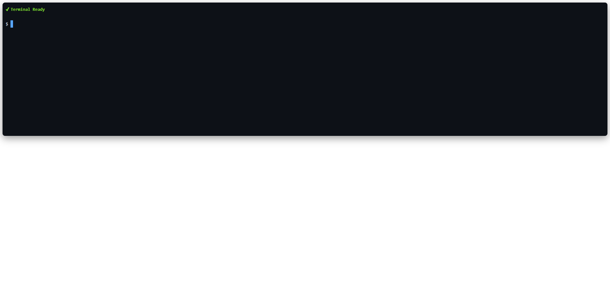
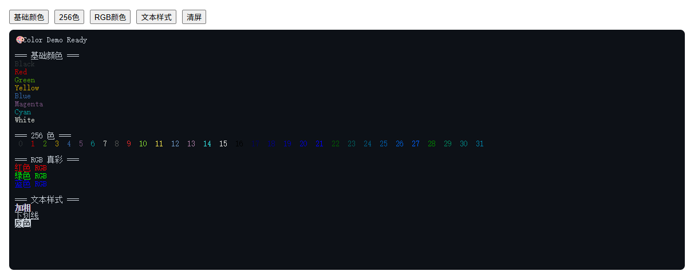
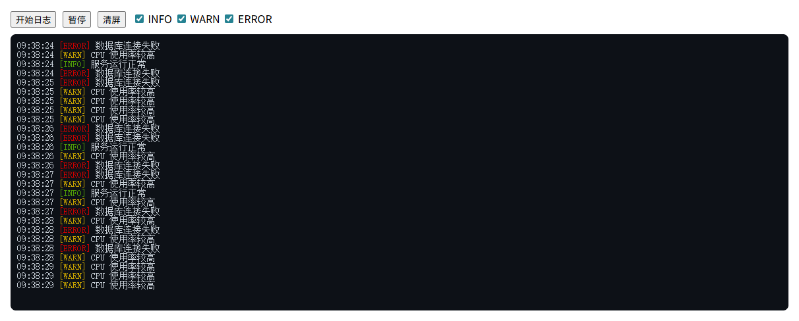
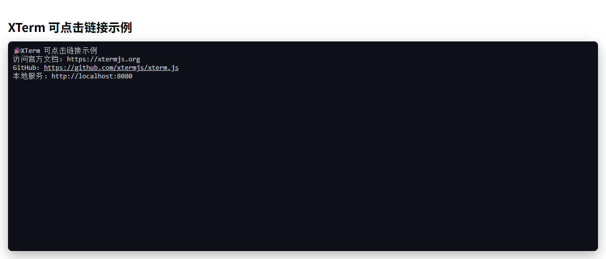
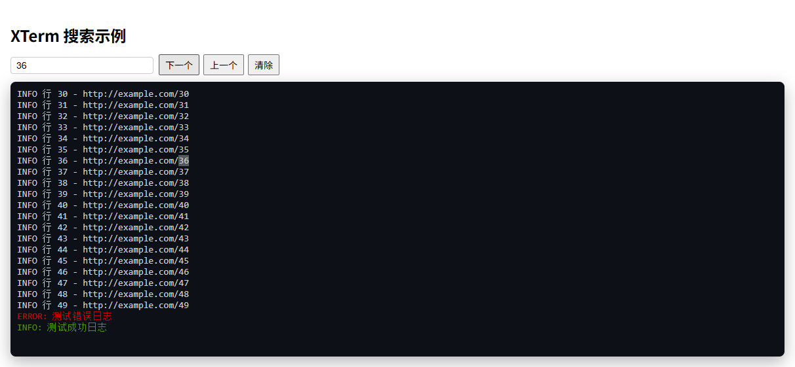

# Xterm.js

Xterm.js是一个用TypeScript编写的前端组件，它可以让应用程序在浏览器中为用户提供功能齐全的终端。它被流行的项目如VS Code、Hyper和Theia所使用。

- [官网地址](https://xtermjs.org/)


## 基础配置

**安装依赖**

```
pnpm add @xterm/xterm@6.0.0 
```

**安装插件**

```
pnpm add @xterm/addon-fit@0.11.0 @xterm/addon-web-links@0.12.0 @xterm/addon-search@0.16.0 @xterm/addon-clipboard@0.2.0 @xterm/addon-unicode11@0.9.0
```


## 使用示例

```vue
<template>
  <div class="terminal-wrapper">
    <div ref="el" class="terminal"></div>
  </div>
</template>

<script setup>
import { ref, onMounted, onBeforeUnmount } from 'vue'

import { Terminal } from '@xterm/xterm'
import { FitAddon } from '@xterm/addon-fit'
import '@xterm/xterm/css/xterm.css'

const el = ref(null)

let term
let fitAddon
let resizeHandler

onMounted(() => {
  term = new Terminal({
    cursorBlink: true,

    // ✅ 更像真实终端的配置
    fontSize: 14,
    lineHeight: 1.4,
    fontFamily: 'Menlo, Monaco, Consolas, "Courier New", monospace',

    theme: {
      background: '#0d1117',   // GitHub dark
      foreground: '#c9d1d9',
      cursor: '#58a6ff',

      black: '#484f58',
      red: '#ff7b72',
      green: '#3fb950',
      yellow: '#d29922',
      blue: '#58a6ff',
      magenta: '#bc8cff',
      cyan: '#39c5cf',
      white: '#b1bac4'
    }
  })

  fitAddon = new FitAddon()
  term.loadAddon(fitAddon)

  term.open(el.value)

  // ✅ 初始适配
  fitAddon.fit()

  // ✅ resize 防抖（优化点）
  let timer
  resizeHandler = () => {
    clearTimeout(timer)
    timer = setTimeout(() => {
      fitAddon.fit()
    }, 100)
  }

  window.addEventListener('resize', resizeHandler)

  // 示例输出
  term.writeln('\x1b[1;32m✔ Terminal Ready\x1b[0m')
  term.write('\r\n$ ')
})

onBeforeUnmount(() => {
  window.removeEventListener('resize', resizeHandler)
  term?.dispose()
})
</script>

<style scoped>
/* 外层容器（让它像一个终端窗口） */
.terminal-wrapper {
  background: #0d1117;
  border-radius: 8px;
  padding: 10px;
  box-shadow: 0 8px 24px rgba(0, 0, 0, 0.4);
}

/* xterm 容器 */
.terminal {
  width: 100%;
  height: 400px;
}

/* 可选：让光标更明显 */
:deep(.xterm-cursor) {
  background-color: #58a6ff !important;
}
</style>
```




## 终端输入交互（模拟本地终端）

```

```


## 终端彩色输出

```vue
<template>
  <div class="page">
    <div class="toolbar">
      <button @click="demoBasic">基础颜色</button>
      <button @click="demo256">256色</button>
      <button @click="demoRGB">RGB颜色</button>
      <button @click="demoStyle">文本样式</button>
      <button @click="clear">清屏</button>
    </div>

    <div class="terminal-wrapper">
      <div ref="el" class="terminal"></div>
    </div>
  </div>
</template>

<script setup>
import { ref, onMounted } from 'vue'
import { Terminal } from '@xterm/xterm'
import { FitAddon } from '@xterm/addon-fit'
import '@xterm/xterm/css/xterm.css'

const el = ref(null)

let term

onMounted(() => {
  term = new Terminal({
    cursorBlink: true,
    fontSize: 14,
    scrollback: 2000,
    theme: {
      background: '#0d1117',
      foreground: '#c9d1d9'
    }
  })

  const fitAddon = new FitAddon()
  term.loadAddon(fitAddon)

  term.open(el.value)
  fitAddon.fit()

  term.writeln('🎨 Color Demo Ready')
})

/* ================= 基础颜色 ================= */
function demoBasic() {
  term.writeln('\r\n=== 基础颜色 ===')

  term.writeln('\x1b[30mBlack\x1b[0m')
  term.writeln('\x1b[31mRed\x1b[0m')
  term.writeln('\x1b[32mGreen\x1b[0m')
  term.writeln('\x1b[33mYellow\x1b[0m')
  term.writeln('\x1b[34mBlue\x1b[0m')
  term.writeln('\x1b[35mMagenta\x1b[0m')
  term.writeln('\x1b[36mCyan\x1b[0m')
  term.writeln('\x1b[37mWhite\x1b[0m')
}

/* ================= 256色 ================= */
function demo256() {
  term.writeln('\r\n=== 256 色 ===')

  for (let i = 0; i < 32; i++) {
    term.write(`\x1b[38;5;${i}m ${i} \x1b[0m`)
  }
  term.writeln('')
}

/* ================= RGB 真彩 ================= */
function demoRGB() {
  term.writeln('\r\n=== RGB 真彩 ===')

  term.writeln('\x1b[38;2;255;0;0m红色 RGB\x1b[0m')
  term.writeln('\x1b[38;2;0;255;0m绿色 RGB\x1b[0m')
  term.writeln('\x1b[38;2;0;0;255m蓝色 RGB\x1b[0m')
}

/* ================= 文本样式 ================= */
function demoStyle() {
  term.writeln('\r\n=== 文本样式 ===')

  term.writeln('\x1b[1m加粗\x1b[0m')
  term.writeln('\x1b[4m下划线\x1b[0m')
  term.writeln('\x1b[7m反色\x1b[0m')
}

/* ================= 清屏 ================= */
function clear() {
  term.clear()
}
</script>

<style scoped>
.page {
  padding: 16px;
}

.toolbar {
  margin-bottom: 10px;
}

button {
  margin-right: 10px;
}

.terminal-wrapper {
  background: #0d1117;
  padding: 10px;
  border-radius: 8px;
}

.terminal {
  height: 400px;
}
</style>
```



## 日志终端模式

```vue
<template>
  <div class="page">
    <!-- 工具栏 -->
    <div class="toolbar">
      <button @click="start">开始日志</button>
      <button @click="stop">暂停</button>
      <button @click="clear">清屏</button>

      <label>
        <input type="checkbox" v-model="filter.info" /> INFO
      </label>
      <label>
        <input type="checkbox" v-model="filter.warn" /> WARN
      </label>
      <label>
        <input type="checkbox" v-model="filter.error" /> ERROR
      </label>
    </div>

    <!-- 终端 -->
    <div class="terminal-wrapper">
      <div ref="el" class="terminal"></div>
    </div>
  </div>
</template>

<script setup>
import { ref, onMounted, onBeforeUnmount } from 'vue'

import { Terminal } from '@xterm/xterm'
import { FitAddon } from '@xterm/addon-fit'
import '@xterm/xterm/css/xterm.css'

const el = ref(null)

let term
let fitAddon
let timer = null

// 日志过滤
const filter = ref({
  info: true,
  warn: true,
  error: true
})

// 是否暂停自动滚动
let isPaused = false

onMounted(() => {
  term = new Terminal({
    cursorBlink: false,
    scrollback: 10000, // ✅ 大数据量
    fontSize: 14,
    convertEol: true,
    theme: {
      background: '#0d1117',
      foreground: '#c9d1d9'
    }
  })

  fitAddon = new FitAddon()
  term.loadAddon(fitAddon)

  term.open(el.value)
  fitAddon.fit()

  window.addEventListener('resize', () => fitAddon.fit())

  printHeader()
})

onBeforeUnmount(() => {
  stop()
  term?.dispose()
})

/* ================= 日志输出 ================= */

function printHeader() {
  term.writeln('\x1b[36m=== 日志终端模式 ===\x1b[0m')
  term.writeln('\x1b[33m支持：过滤 / 暂停 / 自动滚动\x1b[0m')
}

/* ================= 日志生成 ================= */

function start() {
  if (timer) return

  timer = setInterval(() => {
    const log = generateLog()
    printLog(log)
  }, 200)
}

function stop() {
  clearInterval(timer)
  timer = null
}

/* ================= 日志核心 ================= */

function printLog(log) {
  // 过滤
  if (!filter.value[log.level]) return

  const text = formatLog(log)

  term.writeln(text)

  // 自动滚动（未暂停时）
  if (!isPaused) {
    term.scrollToBottom()
  }
}

/* ================= 日志格式 ================= */

function formatLog({ time, level, message }) {
  const levelMap = {
    info: '\x1b[32m[INFO]\x1b[0m',
    warn: '\x1b[33m[WARN]\x1b[0m',
    error: '\x1b[31m[ERROR]\x1b[0m'
  }

  return `${time} ${levelMap[level]} ${message}`
}

/* ================= 模拟日志 ================= */

function generateLog() {
  const levels = ['info', 'warn', 'error']
  const level = levels[Math.floor(Math.random() * 3)]

  return {
    time: new Date().toLocaleTimeString(),
    level,
    message: getRandomMessage(level)
  }
}

function getRandomMessage(level) {
  if (level === 'info') return '服务运行正常'
  if (level === 'warn') return 'CPU 使用率较高'
  return '数据库连接失败'
}

/* ================= 工具 ================= */

function clear() {
  term.clear()
}

// 用户滚动时暂停自动滚动
term?.onScroll(() => {
  const { viewportY, baseY } = term.buffer.active
  isPaused = viewportY + term.rows < baseY
})
</script>

<style scoped>
.page {
  padding: 16px;
}

.toolbar {
  margin-bottom: 10px;
}

button {
  margin-right: 10px;
}

label {
  margin-right: 10px;
}

.terminal-wrapper {
  background: #0d1117;
  padding: 10px;
  border-radius: 8px;
}

.terminal {
  height: 400px;
}
</style>
```



## 可点击链接（web-links 插件）

```vue
<template>
  <div class="page">
    <h2>XTerm 可点击链接示例</h2>
    <div class="terminal-wrapper">
      <div ref="el" class="terminal"></div>
    </div>
  </div>
</template>

<script setup>
import { ref, onMounted, onBeforeUnmount, nextTick } from 'vue'
import { Terminal } from '@xterm/xterm'
import { FitAddon } from '@xterm/addon-fit'
import { WebLinksAddon } from '@xterm/addon-web-links'

import '@xterm/xterm/css/xterm.css'

const el = ref(null)

let term
let fitAddon
let resizeHandler

onMounted(async () => {
  // 等待 DOM 渲染完成
  await nextTick()

  if (!el.value) {
    console.error('Terminal container not found!')
    return
  }

  // 初始化终端
  term = new Terminal({
    cursorBlink: true,
    fontSize: 14,
    scrollback: 5000,
    convertEol: true,
    fontFamily: 'Menlo, Monaco, Consolas, monospace',
    theme: {
      background: '#0d1117',
      foreground: '#c9d1d9',
      cursor: '#58a6ff'
    }
  })

  fitAddon = new FitAddon()
  term.loadAddon(fitAddon)

  // WebLinks 插件（可点击链接）
  term.loadAddon(
      new WebLinksAddon((event, uri) => {
        event.preventDefault()
        console.log('Clicked link:', uri)
        window.open(uri, '_blank') // 打开新窗口
      })
  )

  term.open(el.value)

  // 自动适配大小
  fitAddon.fit()

  // 窗口 resize 重新适配
  resizeHandler = () => fitAddon.fit()
  window.addEventListener('resize', resizeHandler)

  // 输出示例内容
  term.writeln('🎉 XTerm 可点击链接示例')
  term.writeln('访问官方文档：https://xtermjs.org')
  term.writeln('GitHub：https://github.com/xtermjs/xterm.js')
  term.writeln('本地服务：http://localhost:8080')
})

onBeforeUnmount(() => {
  window.removeEventListener('resize', resizeHandler)
  term?.dispose()
})
</script>

<style scoped>
.page {
  padding: 16px;
}

h2 {
  margin-bottom: 12px;
}

.terminal-wrapper {
  background: #0d1117;
  padding: 10px;
  border-radius: 8px;
  box-shadow: 0 8px 24px rgba(0, 0, 0, 0.3);
}

.terminal {
  width: 100%;
  height: 400px;
}

/* 强化链接可见性 */
:deep(.xterm a) {
  color: #58a6ff;
  text-decoration: underline;
}
</style>
```



## 终端搜索

```vue
<template>
  <div class="page">
    <h2>XTerm 搜索示例</h2>

    <!-- 搜索栏 -->
    <div class="search-bar">
      <input
          v-model="keyword"
          placeholder="输入关键词或正则"
          @keydown.enter.prevent="searchNext"
      />
      <button @click="searchNext">下一个</button>
      <button @click="searchPrev">上一个</button>
      <button @click="clearSearch">清除</button>
    </div>

    <!-- 终端 -->
    <div class="terminal-wrapper">
      <div ref="el" class="terminal"></div>
    </div>
  </div>
</template>

<script setup>
import { ref, onMounted, onBeforeUnmount, nextTick } from 'vue'
import { Terminal } from '@xterm/xterm'
import { FitAddon } from '@xterm/addon-fit'
import { SearchAddon } from '@xterm/addon-search'
import { WebLinksAddon } from '@xterm/addon-web-links'
import '@xterm/xterm/css/xterm.css'

const el = ref(null)
let term
let fitAddon
let searchAddon
let resizeHandler

const keyword = ref('')

// 初始化终端
onMounted(async () => {
  await nextTick()
  if (!el.value) return

  term = new Terminal({
    cursorBlink: true,
    fontSize: 14,
    scrollback: 5000,
    convertEol: true,
    fontFamily: 'Menlo, Monaco, Consolas, monospace',
    theme: {
      background: '#0d1117',
      foreground: '#c9d1d9',
      cursor: '#58a6ff'
    }
  })

  fitAddon = new FitAddon()
  searchAddon = new SearchAddon()

  term.loadAddon(fitAddon)
  term.loadAddon(searchAddon)
  term.loadAddon(
      new WebLinksAddon((e, uri) => {
        e.preventDefault()
        window.open(uri, '_blank')
      })
  )

  term.open(el.value)
  fitAddon.fit()
  resizeHandler = () => fitAddon.fit()
  window.addEventListener('resize', resizeHandler)

  // 输出示例日志 / 彩色文本
  term.writeln('🎉 XTerm 搜索示例')
  for (let i = 0; i < 50; i++) {
    term.writeln(`INFO 行 ${i} - http://example.com/${i}`)
  }
  term.writeln('\x1b[31mERROR: 测试错误日志\x1b[0m')
  term.writeln('\x1b[32mINFO: 测试成功日志\x1b[0m')
})

onBeforeUnmount(() => {
  window.removeEventListener('resize', resizeHandler)
  term?.dispose()
})

// 搜索功能
function searchNext() {
  if (!keyword.value) return
  searchAddon.findNext(keyword.value, { caseSensitive: false, regex: false })
}

function searchPrev() {
  if (!keyword.value) return
  searchAddon.findPrevious(keyword.value, { caseSensitive: false, regex: false })
}

function clearSearch() {
  searchAddon.clearDecorations()
  keyword.value = ''
}
</script>

<style scoped>
.page {
  padding: 16px;
}

h2 {
  margin-bottom: 12px;
}

.search-bar {
  margin-bottom: 10px;
}

.search-bar input {
  padding: 4px 8px;
  font-size: 14px;
  width: 200px;
  margin-right: 8px;
  border-radius: 4px;
  border: 1px solid #ccc;
}

.search-bar button {
  margin-right: 6px;
  padding: 4px 8px;
  font-size: 14px;
  cursor: pointer;
}

.terminal-wrapper {
  background: #0d1117;
  padding: 10px;
  border-radius: 8px;
  box-shadow: 0 8px 24px rgba(0, 0, 0, 0.3);
}

.terminal {
  width: 100%;
  height: 400px;
}

/* 链接高亮 */
:deep(.xterm a) {
  color: #58a6ff;
  text-decoration: underline;
}
</style>
```



## 复制粘贴增强（clipboard）

```vue

```

## 大数据量终端优化

```vue

```

## 自动滚动到底部

```vue

```

## Unicode / 中文优化

```vue

```

## 终端主题切换

```vue

```

