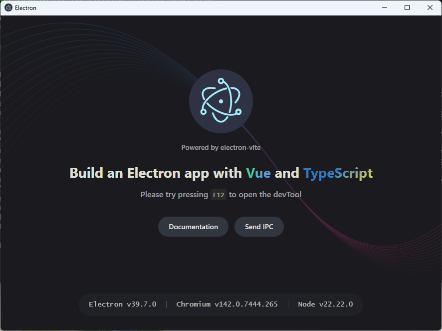
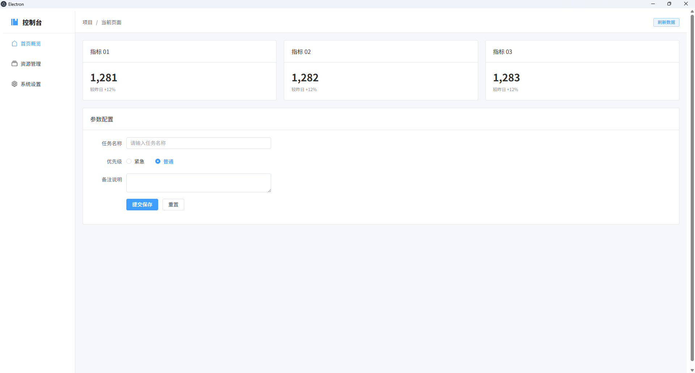
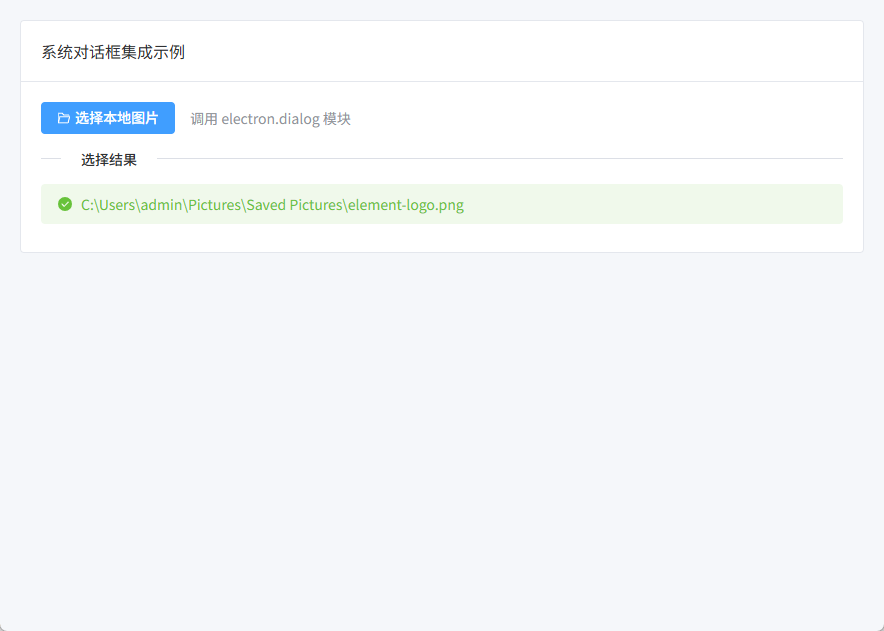
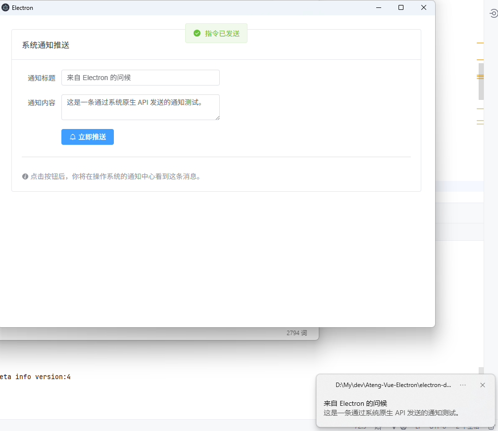
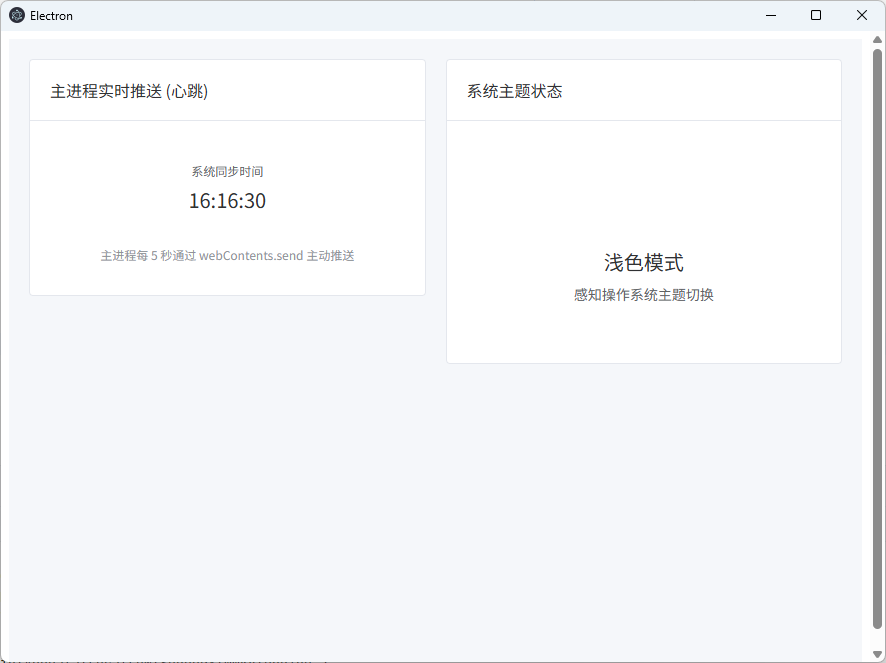

# Electron

Electron 是一个基于 **Chromium + Node.js** 的跨平台桌面应用开发框架。

**三层架构模型**

要把指令发给操作系统，必须经过这条路径：

1. **渲染进程 (Renderer)**：Vue 界面，负责“发号施令”（如：点击按钮）。
2. **预加载脚本 (Preload)**：中间人，负责“传话”。基于安全考虑，它是唯一能同时接触到 Vue 和 Node.js 的地方。
3. **主进程 (Main)**：真正的执行者，负责“干活”（如：读写文件、弹对话框）。

**官网链接**

- 官方网站：https://www.electronjs.org/
- 推荐工程化方案：https://electron-vite.org/


## 快速创建项目

**创建项目**

```
pnpm view @quick-start/create-electron versions
pnpm create @quick-start/electron@1.0.30 electron-demo
```

选择：

```
√ Select a framework: » vue
√ Add TypeScript? ... No / Yes
√ Add Electron updater plugin? ... No / Yes
√ Enable Electron download mirror proxy? ... No / Yes
```

**安装依赖**

```
cd electron-demo
pnpm install
```

**启动开发环境**

```
pnpm run dev
```




## 集成 ElementPlus

**安装 ElementPlus**

```bash
pnpm add element-plus@2.13.0
```

**在 Vue 项目中全局引入 ElementPlus**

编辑 `src/renderer/main.ts`：

```ts
import { createApp } from 'vue'
import App from './App.vue'

// 引入 ElementPlus 样式和组件
import ElementPlus from 'element-plus'
import 'element-plus/dist/index.css'

const app = createApp(App)
app.use(ElementPlus)  // 全局注册 ElementPlus
app.mount('#app')
```

**使用示例**

在 `src/renderer/App.vue` 中使用 ElementPlus 组件：

```vue
<template>
  <el-container class="app-wrapper">
    <el-aside width="200px" class="aside">
      <div class="brand">
        <el-icon color="#409EFF" :size="24"><Management /></el-icon>
        <span>控制台</span>
      </div>
      <el-menu default-active="1" class="border-none">
        <el-menu-item index="1">
          <el-icon><House /></el-icon>
          <span>首页概览</span>
        </el-menu-item>
        <el-menu-item index="2">
          <el-icon><Files /></el-icon>
          <span>资源管理</span>
        </el-menu-item>
        <el-menu-item index="3">
          <el-icon><Setting /></el-icon>
          <span>系统设置</span>
        </el-menu-item>
      </el-menu>
    </el-aside>

    <el-container>
      <el-header class="header">
        <el-breadcrumb separator="/">
          <el-breadcrumb-item>项目</el-breadcrumb-item>
          <el-breadcrumb-item>当前页面</el-breadcrumb-item>
        </el-breadcrumb>
        <div class="user-info">
          <el-button type="primary" plain size="small" @click="handleRefresh">刷新数据</el-button>
        </div>
      </el-header>

      <el-main class="main">
        <el-row :gutter="20" class="margin-b-20">
          <el-col :span="8" v-for="i in 3" :key="i">
            <el-card shadow="never">
              <template #header>指标 0{{ i }}</template>
              <div class="card-value">1,28{{ i }}</div>
              <el-text size="small" type="info">较昨日 +12%</el-text>
            </el-card>
          </el-col>
        </el-row>

        <el-card shadow="never" header="参数配置">
          <el-form :model="form" label-width="100px" style="max-width: 500px">
            <el-form-item label="任务名称">
              <el-input v-model="form.name" placeholder="请输入任务名称" />
            </el-form-item>
            <el-form-item label="优先级">
              <el-radio-group v-model="form.priority">
                <el-radio label="紧急" />
                <el-radio label="普通" />
              </el-radio-group>
            </el-form-item>
            <el-form-item label="备注说明">
              <el-input v-model="form.desc" type="textarea" />
            </el-form-item>
            <el-form-item>
              <el-button type="primary" @click="onSubmit">提交保存</el-button>
              <el-button @click="onReset">重置</el-button>
            </el-form-item>
          </el-form>
        </el-card>
      </el-main>
    </el-container>
  </el-container>
</template>

<script setup>
import { ref, reactive } from 'vue'
import { Management, House, Files, Setting } from '@element-plus/icons-vue'
import { ElMessage } from 'element-plus'

const form = reactive({
  name: '',
  priority: '普通',
  desc: ''
})

const onSubmit = () => {
  ElMessage.success('配置已成功同步')
}

const onReset = () => {
  form.name = ''
  form.priority = '普通'
  form.desc = ''
}

const handleRefresh = () => {
  ElMessage('正在同步最新数据...')
}
</script>

<style scoped>
/* 基础布局控制 */
.app-wrapper {
  height: 100vh;
  background-color: #f5f7fa; /* 淡淡的底色让白色卡片更立体 */
}

/* 侧边栏 */
.aside {
  background-color: #ffffff;
  border-right: 1px solid #e6e6e6;
}

.brand {
  height: 60px;
  display: flex;
  align-items: center;
  padding: 0 20px;
  gap: 10px;
  font-weight: bold;
  font-size: 18px;
  border-bottom: 1px solid #f0f0f0;
}

.border-none {
  border: none;
}

/* 顶部栏 */
.header {
  background-color: #ffffff;
  border-bottom: 1px solid #e6e6e6;
  display: flex;
  align-items: center;
  justify-content: space-between;
  padding: 0 20px;
}

/* 内容区 */
.main {
  padding: 20px;
}

.margin-b-20 {
  margin-bottom: 20px;
}

.card-value {
  font-size: 28px;
  font-weight: bold;
  color: #303133;
}

/* 统一卡片样式：去除圆角阴影，走极简风 */
:deep(.el-card) {
  border-radius: 4px;
  border: 1px solid #e6e6e6;
}
</style>
```




## 调用操作系统

### 系统对话框（选择文件/保存）

这是最常见的需求，比如让用户选择一个文件夹或图片。

**主进程 (`src/main/index.ts`)：**

在主进程中监听渲染进程发来的 `select-file` 请求，并调用系统对话框。

```ts
import { app, shell, BrowserWindow, ipcMain, dialog } from 'electron'
import { join } from 'path'
// ... 其他默认引入

function createWindow(): void {
  const mainWindow = new BrowserWindow({
    width: 900,
    height: 670,
    show: false,
    autoHideMenuBar: true,
    webPreferences: {
      preload: join(__dirname, '../preload/index.js'),
      sandbox: false
    }
  })

  // --- 核心代码：处理文件选择请求 ---
  ipcMain.handle('select-file', async () => {
    const result = await dialog.showOpenDialog({
      title: '请选择图片文件',
      properties: ['openFile', 'multiSelections'],
      filters: [{ name: 'Images', extensions: ['jpg', 'png', 'gif'] }]
    })
    
    if (result.canceled) {
      return [] 
    } else {
      return result.filePaths // 返回路径数组
    }
  })
  // ------------------------------

  mainWindow.on('ready-to-show', () => {
    mainWindow.show()
  })
  // ... 其他加载逻辑
}
```

**预加载脚本 (`src/preload/index.ts`)：**

这是安全屏障。我们在这里把主进程的能力暴露给 `window` 对象。

```ts
import { contextBridge, ipcRenderer } from 'electron'

if (process.contextIsolated) {
  try {
    contextBridge.exposeInMainWorld('electronAPI', {
      // 暴露一个名为 selectFile 的方法供 Vue 调用
      selectFile: () => ipcRenderer.invoke('select-file')
    })
  } catch (error) {
    console.error(error)
  }
}
```

类型声明 `src/preload/index.d.ts`

```ts
declare global {
  interface Window {
    electronAPI: {
      selectFile: () => Promise<string[]>
    }
  }
}
```

**渲染进程：Vue 界面实现 (`src/renderer/src/App.vue`)：**

这里我们使用 ElementPlus 做一个干净的白色界面，展示选择结果。

```vue
<template>
  <el-container class="app-container">
    <el-main>
      <el-card shadow="never" header="系统对话框集成示例">
        <div class="action-bar">
          <el-button type="primary" @click="handleOpenFile">
            <el-icon style="margin-right: 4px;"><FolderOpened /></el-icon>
            选择本地图片
          </el-button>
          <el-text class="hint" type="info">调用 electron.dialog 模块</el-text>
        </div>

        <el-divider content-position="left">选择结果</el-divider>

        <div v-if="fileList.length > 0" class="result-list">
          <el-alert
            v-for="(path, index) in fileList"
            :key="index"
            :title="path"
            type="success"
            :closable="false"
            show-icon
            style="margin-bottom: 8px;"
          />
        </div>
        <el-empty v-else description="暂未选择任何文件" :image-size="100" />
      </el-card>
    </el-main>
  </el-container>
</template>

<script setup lang="ts">
import { ref } from 'vue'
import { FolderOpened } from '@element-plus/icons-vue'
import { ElMessage } from 'element-plus'

const fileList = ref<string[]>([])

const handleOpenFile = async () => {
  try {
    // 调用 preload 中暴露的接口
    const paths = await window.electronAPI.selectFile()
    
    if (paths && paths.length > 0) {
      fileList.value = paths
      ElMessage.success(`成功选择 ${paths.length} 个文件`)
    } else {
      ElMessage.info('取消了选择')
    }
  } catch (error) {
    ElMessage.error('调用系统对话框失败')
    console.error(error)
  }
}
</script>

<style>
/* 全局清除默认边距，确保填充 */
html, body, #app {
  margin: 0;
  padding: 0;
  height: 100%;
  background-color: #f5f7fa;
}

.app-container {
  height: 100vh;
}

.action-bar {
  display: flex;
  align-items: center;
  gap: 15px;
  margin-bottom: 10px;
}

.result-list {
  max-height: 400px;
  overflow-y: auto;
}
</style>
```



------

### 系统信息与内存监控

这个示例演示如何从操作系统获取硬件状态，并在 Vue 界面中以图形化方式展示。

1. 主进程 (`src/main/index.ts`)

我们引入 Node.js 的 `os` 模块，通过 `ipcMain` 定时或按需返回内存数据。

TypeScript

```ts
import { ipcMain, app } from 'electron'
import os from 'os'

// 处理获取系统静态信息的请求
ipcMain.handle('get-system-info', () => {
  return {
    platform: os.platform(), // 操作系统平台
    arch: os.arch(),         // 架构
    cpuModel: os.cpus()[0].model,
    totalMem: (os.totalmem() / 1024 / 1024 / 1024).toFixed(2) + ' GB'
  }
})

// 处理获取动态内存占用情况
ipcMain.handle('get-memory-usage', () => {
  const free = os.freemem()
  const total = os.totalmem()
  const usedPercentage = ((total - free) / total * 100).toFixed(1)
  return parseFloat(usedPercentage)
})
```

------

2. 预加载脚本 (`src/preload/index.ts`)

将这两个新方法暴露给渲染进程。

TypeScript

```ts
import { contextBridge, ipcRenderer } from 'electron'

if (process.contextIsolated) {
  try {
    contextBridge.exposeInMainWorld('electronAPI', {
      selectFile: () => ipcRenderer.invoke('select-file'),
      // 新增：获取静态系统信息
      getSystemInfo: () => ipcRenderer.invoke('get-system-info'),
      // 新增：获取动态内存百分比
      getMemoryUsage: () => ipcRenderer.invoke('get-memory-usage')
    })
  } catch (error) {
    console.error(error)
  }
}
```

------

3. 类型声明 (`src/preload/index.d.ts`)

补充接口定义，保证 VS Code 里的代码补全和类型检查。

TypeScript

```ts
declare global {
  interface Window {
    electronAPI: {
      selectFile: () => Promise<string[]>,
      getSystemInfo: () => Promise<{
        platform: string,
        arch: string,
        cpuModel: string,
        totalMem: string
      }>,
      getMemoryUsage: () => Promise<number>
    }
  }
}
```

------

4. 渲染进程 (`src/renderer/src/App.vue`)

利用 Element Plus 的 `el-descriptions` 展示信息，用 `el-progress` 制作内存监控仪表盘。

代码段

```vue
<template>
  <el-container class="app-container">
    <el-main>
      <el-row :gutter="20">
        <el-col :span="14">
          <el-card shadow="never" header="硬件配置">
            <el-descriptions :column="1" border>
              <el-descriptions-item label="操作系统">{{ sysInfo.platform }} ({{ sysInfo.arch }})</el-descriptions-item>
              <el-descriptions-item label="处理器">{{ sysInfo.cpuModel }}</el-descriptions-item>
              <el-descriptions-item label="物理内存">{{ sysInfo.totalMem }}</el-descriptions-item>
            </el-descriptions>
          </el-card>
        </el-col>

        <el-col :span="10">
          <el-card shadow="never" header="内存占用率">
            <div class="gauge-container">
              <el-progress 
                type="dashboard" 
                :percentage="memoryUsage" 
                :color="customColors"
              />
              <p class="monitor-text">每 2 秒实时刷新</p>
            </div>
          </el-card>
        </el-col>
      </el-row>
    </el-main>
  </el-container>
</template>

<script setup lang="ts">
import { ref, onMounted, onUnmounted } from 'vue'

const sysInfo = ref({ platform: '', arch: '', cpuModel: '', totalMem: '' })
const memoryUsage = ref(0)
let timer: any = null

// 进度条颜色分段
const customColors = [
  { color: '#67c23a', percentage: 40 },
  { color: '#e6a23c', percentage: 70 },
  { color: '#f56c6c', percentage: 100 },
]

onMounted(async () => {
  // 1. 初始化获取静态信息
  sysInfo.value = await window.electronAPI.getSystemInfo()

  // 2. 开启定时轮询获取内存
  updateMemory()
  timer = setInterval(updateMemory, 2000)
})

const updateMemory = async () => {
  memoryUsage.value = await window.electronAPI.getMemoryUsage()
}

onUnmounted(() => {
  if (timer) clearInterval(timer)
})
</script>

<style scoped>
.gauge-container {
  display: flex;
  flex-direction: column;
  align-items: center;
  padding: 10px 0;
}
.monitor-text {
  font-size: 12px;
  color: #909399;
  margin-top: 10px;
}
</style>
```


------

### 系统原生通知发送

1. 主进程 (`src/main/index.ts`)

我们引入 `Notification` 模块。注意：某些系统（如 Windows）发送通知需要设置 `AppUserModelId`。

TypeScript

```
import { ipcMain, Notification } from 'electron'

// 处理发送通知的请求
ipcMain.on('send-os-notification', (_event, title, body) => {
  // 检查系统是否支持通知
  if (Notification.isSupported()) {
    const notice = new Notification({
      title: title,      // 通知标题
      body: body,        // 通知内容
      silent: false,     // 是否静音
      timeoutType: 'default'
    })

    notice.show()

    // 也可以监听点击事件
    notice.on('click', () => {
      console.log('用户点击了通知')
    })
  }
})
```

------

2. 预加载脚本 (`src/preload/index.ts`)

由于发送通知通常不需要等待返回值，我们使用 `send` 而不是 `invoke`。

TypeScript

```
import { contextBridge, ipcRenderer } from 'electron'

if (process.contextIsolated) {
  try {
    contextBridge.exposeInMainWorld('electronAPI', {
      selectFile: () => ipcRenderer.invoke('select-file'),
      getSystemInfo: () => ipcRenderer.invoke('get-system-info'),
      getMemoryUsage: () => ipcRenderer.invoke('get-memory-usage'),
      // 新增：向主进程发送通知指令
      sendNotification: (title: string, body: string) => 
        ipcRenderer.send('send-os-notification', title, body)
    })
  } catch (error) {
    console.error(error)
  }
}
```

------

3. 类型声明 (`src/preload/index.d.ts`)

在接口中添加该方法的定义。

TypeScript

```
declare global {
  interface Window {
    electronAPI: {
      selectFile: () => Promise<string[]>,
      getSystemInfo: () => Promise<{
        platform: string,
        arch: string,
        cpuModel: string,
        totalMem: string
      }>,
      getMemoryUsage: () => Promise<number>,
      // 新增声明
      sendNotification: (title: string, body: string) => void
    }
  }
}
```

------

4. 渲染进程 (`src/renderer/src/App.vue`)

在 Vue 中，我们做一个简单的表单，让用户可以自定义通知内容。

代码段

```
<template>
  <el-container class="app-container">
    <el-main>
      <el-card shadow="never" header="系统通知推送">
        <el-form label-width="80px" style="max-width: 400px">
          <el-form-item label="通知标题">
            <el-input v-model="noticeForm.title" placeholder="请输入标题" />
          </el-form-item>
          
          <el-form-item label="通知内容">
            <el-input 
              v-model="noticeForm.body" 
              type="textarea" 
              placeholder="请输入想要推送的详细内容" 
            />
          </el-form-item>

          <el-form-item>
            <el-button type="primary" @click="pushNotification">
              <el-icon style="margin-right: 4px;"><Bell /></el-icon>
              立即推送
            </el-button>
          </el-form-item>
        </el-form>

        <el-divider />
        
        <el-text type="info">
          <el-icon><InfoFilled /></el-icon>
          点击按钮后，你将在操作系统的通知中心看到这条消息。
        </el-text>
      </el-card>
    </el-main>
  </el-container>
</template>

<script setup lang="ts">
import { reactive } from 'vue'
import { Bell, InfoFilled } from '@element-plus/icons-vue'
import { ElMessage } from 'element-plus'

const noticeForm = reactive({
  title: '来自 Electron 的问候',
  body: '这是一条通过系统原生 API 发送的通知测试。'
})

const pushNotification = () => {
  if (!noticeForm.title || !noticeForm.body) {
    ElMessage.warning('标题和内容不能为空')
    return
  }
  
  // 调用 preload 中的接口
  window.electronAPI.sendNotification(noticeForm.title, noticeForm.body)
  
  ElMessage.success('指令已发送')
}
</script>
```

------




### 外壳操作 (Shell) 集成

1. 主进程 (`src/main/index.ts`)

我们引入 `shell` 模块。主进程负责处理打开外部链接和定位文件的逻辑。

TypeScript

```
import { ipcMain, shell } from 'electron'

// 监听打开外部链接的请求
ipcMain.on('open-external-url', (_event, url: string) => {
  shell.openExternal(url)
})

// 监听在文件夹中显示文件的请求
ipcMain.on('show-item-in-folder', (_event, filePath: string) => {
  shell.showItemInFolder(filePath)
})
```

------

2. 预加载脚本 (`src/preload/index.ts`)

将这两个 Shell 操作安全地暴露给 Vue。

TypeScript

```
import { contextBridge, ipcRenderer } from 'electron'

if (process.contextIsolated) {
  try {
    contextBridge.exposeInMainWorld('electronAPI', {
      selectFile: () => ipcRenderer.invoke('select-file'),
      getSystemInfo: () => ipcRenderer.invoke('get-system-info'),
      getMemoryUsage: () => ipcRenderer.invoke('get-memory-usage'),
      sendNotification: (title: string, body: string) => ipcRenderer.send('send-os-notification', title, body),
      
      // 新增：Shell 相关操作
      openUrl: (url: string) => ipcRenderer.send('open-external-url', url),
      showFile: (path: string) => ipcRenderer.send('show-item-in-folder', path)
    })
  } catch (error) {
    console.error(error)
  }
}
```

------

3. 类型声明 (`src/preload/index.d.ts`)

补充接口定义，让开发环境不报错。

TypeScript

```
declare global {
  interface Window {
    electronAPI: {
      selectFile: () => Promise<string[]>,
      getSystemInfo: () => Promise<{ platform: string, arch: string, cpuModel: string, totalMem: string }>,
      getMemoryUsage: () => Promise<number>,
      sendNotification: (title: string, body: string) => void,
      // 新增声明
      openUrl: (url: string) => void,
      showFile: (path: string) => void
    }
  }
}
```

------

4. 渲染进程 (`src/renderer/src/App.vue`)

我们结合之前的“文件选择”示例，实现一个功能：选中文件后，点击按钮可以直接在 Windows 资源管理器（或 Mac Finder）中定位到它。

代码段

```
<template>
  <el-container class="app-container">
    <el-main>
      <el-card shadow="never" header="外壳操作 (Shell) 示例">
        
        <div class="section">
          <el-text size="large" strong>1. 外部链接</el-text>
          <p class="description">在系统默认浏览器中打开指定网址：</p>
          <el-button type="primary" plain @click="handleOpenLink">
            <el-icon style="margin-right: 4px;"><Link /></el-icon>
            访问 Electron 官网
          </el-button>
        </div>

        <el-divider />

        <div class="section">
          <el-text size="large" strong>2. 文件定位</el-text>
          <p class="description">先选择一个文件，然后尝试在文件夹中显示它：</p>
          
          <el-space direction="vertical" alignment="start">
            <el-button type="success" @click="handlePickFile">
              第一步：选择文件
            </el-button>
            
            <div v-if="targetPath" class="path-box">
              <el-tag closable @close="targetPath = ''">{{ targetPath }}</el-tag>
              <el-button 
                type="info" 
                link 
                style="margin-left: 10px;" 
                @click="handleShowInFolder"
              >
                <el-icon><Position /></el-icon> 在文件夹中显示
              </el-button>
            </div>
          </el-space>
        </div>

      </el-card>
    </el-main>
  </el-container>
</template>

<script setup lang="ts">
import { ref } from 'vue'
import { Link, Position } from '@element-plus/icons-vue'
import { ElMessage } from 'element-plus'

const targetPath = ref('')

// 打开网页
const handleOpenLink = () => {
  window.electronAPI.openUrl('https://www.electronjs.org/')
}

// 选择文件（复用之前的逻辑）
const handlePickFile = async () => {
  const paths = await window.electronAPI.selectFile()
  if (paths && paths.length > 0) {
    targetPath.value = paths[0]
  }
}

// 在资源管理器中打开并选中
const handleShowInFolder = () => {
  if (!targetPath.value) return
  window.electronAPI.showFile(targetPath.value)
  ElMessage.info('已请求系统打开目录')
}
</script>

<style scoped>
.section {
  margin-bottom: 20px;
}
.description {
  font-size: 14px;
  color: #606266;
  margin: 10px 0;
}
.path-box {
  margin-top: 15px;
  padding: 10px;
  background-color: #f0f2f5;
  border-radius: 4px;
  display: flex;
  align-items: center;
}
</style>
```


------

### 剪贴板与电源状态监控

1. 主进程 (`src/main/index.ts`)

我们引入 `clipboard` 和 `powerMonitor` 模块。注意：电量信息可以通过 Web 标准 API 获取，但主进程可以监控系统休眠、锁屏等更底层的事件。

TypeScript

```
import { ipcMain, clipboard, powerMonitor } from 'electron'

// --- 剪贴板处理 ---
ipcMain.handle('read-clipboard', () => {
  return clipboard.readText()
})

ipcMain.on('write-clipboard', (_event, text: string) => {
  clipboard.writeText(text)
})

// --- 电源/系统状态监控 ---
// 监听系统休眠（这是一个主动推送的例子，也可以通过 invoke 获取）
ipcMain.handle('get-system-idle-state', () => {
  return powerMonitor.getSystemIdleState(1) // 获取当前是否为空闲
})

// 监听锁屏事件（示例：发送给渲染进程）
powerMonitor.on('lock-screen', () => {
  // 可以通过 mainWindow.webContents.send 通知前端
  console.log('系统已锁屏')
})
```

------

2. 预加载脚本 (`src/preload/index.ts`)

将剪贴板的读写方法和电源状态查询暴露给 Vue。

TypeScript

```
import { contextBridge, ipcRenderer } from 'electron'

if (process.contextIsolated) {
  try {
    contextBridge.exposeInMainWorld('electronAPI', {
      // 剪贴板
      copyText: (text: string) => ipcRenderer.send('write-clipboard', text),
      readText: () => ipcRenderer.invoke('read-clipboard'),
      
      // 电源状态
      getIdleState: () => ipcRenderer.invoke('get-system-idle-state'),
      
      // 复用之前的接口...
      selectFile: () => ipcRenderer.invoke('select-file'),
    })
  } catch (error) {
    console.error(error)
  }
}
```

------

3. 类型声明 (`src/preload/index.d.ts`)

定义接口，确保 TypeScript 的严谨性。

TypeScript

```
declare global {
  interface Window {
    electronAPI: {
      copyText: (text: string) => void,
      readText: () => Promise<string>,
      getIdleState: () => Promise<string>,
      // ... 其他已有的声明
    }
  }
}
```

------

4. 渲染进程 (`src/renderer/src/App.vue`)

在界面上，我们实现一个剪贴板管理器，并利用浏览器原生的 `navigator.getBattery()` 配合 Electron 的状态查询。

代码段

```
<template>
  <el-container class="app-container">
    <el-main>
      <el-row :gutter="20">
        <el-col :span="12">
          <el-card shadow="never" header="剪贴板助手">
            <el-input
              v-model="copyInput"
              placeholder="输入要复制的内容"
              class="margin-b-10"
            >
              <template #append>
                <el-button @click="handleCopy">复制</el-button>
              </template>
            </el-input>

            <el-divider>读取测试</el-divider>
            
            <div class="clipboard-box">
              <el-button type="success" plain @click="handleRead">
                从系统剪贴板读取
              </el-button>
              <p class="result-text">内容：{{ clipboardContent || '暂无内容' }}</p>
            </div>
          </el-card>
        </el-col>

        <el-col :span="12">
          <el-card shadow="never" header="电源与状态">
            <div class="battery-info">
              <el-statistic title="当前电量" :value="batteryLevel * 100" suffix="%">
                <template #prefix>
                  <el-icon :color="batteryLevel > 0.2 ? '#67c23a' : '#f56c6c'">
                    <Lightning />
                  </el-icon>
                </template>
              </el-statistic>
              
              <el-divider direction="vertical" />
              
              <el-tag :type="isCharging ? 'success' : 'info'">
                {{ isCharging ? '正在充电' : '使用电池中' }}
              </el-tag>
            </div>

            <div class="system-state margin-t-20">
              <el-button size="small" @click="checkIdle">检查系统是否空闲</el-button>
            </div>
          </el-card>
        </el-col>
      </el-row>
    </el-main>
  </el-container>
</template>

<script setup lang="ts">
import { ref, onMounted } from 'vue'
import { Lightning } from '@element-plus/icons-vue'
import { ElMessage } from 'element-plus'

// 剪贴板逻辑
const copyInput = ref('')
const clipboardContent = ref('')

const handleCopy = () => {
  if (!copyInput.value) return
  window.electronAPI.copyText(copyInput.value)
  ElMessage.success('已写入剪贴板')
}

const handleRead = async () => {
  clipboardContent.value = await window.electronAPI.readText()
  ElMessage.info('读取成功')
}

// 电源逻辑 (结合 Web API)
const batteryLevel = ref(0)
const isCharging = ref(false)

onMounted(async () => {
  // 获取电池对象 (浏览器原生 API 在 Electron 中同样适用)
  const battery: any = await (navigator as any).getBattery()
  batteryLevel.value = battery.level
  isCharging.value = battery.charging

  // 监听电池变化
  battery.addEventListener('levelchange', () => {
    batteryLevel.value = battery.level
  })
})

const checkIdle = async () => {
  const state = await window.electronAPI.getIdleState()
  ElMessage(`当前系统状态: ${state}`)
}
</script>

<style scoped>
.margin-b-10 { margin-bottom: 10px; }
.margin-t-20 { margin-top: 20px; }

.clipboard-box {
  background: #f8f9fa;
  padding: 15px;
  border-radius: 4px;
}

.result-text {
  margin-top: 10px;
  font-size: 13px;
  color: #606266;
  word-break: break-all;
}

.battery-info {
  display: flex;
  align-items: center;
  justify-content: space-around;
}
</style>
```


### 自定义窗口控制 (无边框窗口)

1. 主进程 (`src/main/index.ts`)

在创建窗口时设置 `frame: false` 以隐藏系统边框。同时通过 `ipcMain` 监听来自前端的窗口指令（最小化、最大化、关闭）。

TypeScript

```
import { app, BrowserWindow, ipcMain } from 'electron'
import { join } from 'path'

function createWindow(): void {
  const mainWindow = new BrowserWindow({
    width: 900,
    height: 670,
    frame: false,       // 核心：隐藏系统默认标题栏和边框
    show: false,
    autoHideMenuBar: true,
    webPreferences: {
      preload: join(__dirname, '../preload/index.js'),
      sandbox: false
    }
  })

  // --- 核心代码：窗口控制逻辑 ---
  ipcMain.on('window-control', (_event, action: 'minimize' | 'maximize' | 'close') => {
    const win = BrowserWindow.getFocusedWindow()
    if (!win) return

    switch (action) {
      case 'minimize':
        win.minimize()
        break
      case 'maximize':
        // 切换最大化与还原状态
        win.isMaximized() ? win.unmaximize() : win.maximize()
        break
      case 'close':
        win.close()
        break
    }
  })
  // ------------------------------

  mainWindow.on('ready-to-show', () => {
    mainWindow.show()
  })
}
```

------

2. 预加载脚本 (`src/preload/index.ts`)

将窗口控制指令安全地暴露给 `window.electronAPI`。

TypeScript

```
import { contextBridge, ipcRenderer } from 'electron'

if (process.contextIsolated) {
  try {
    contextBridge.exposeInMainWorld('electronAPI', {
      // 暴露窗口控制方法
      controlWindow: (action: 'minimize' | 'maximize' | 'close') => 
        ipcRenderer.send('window-control', action),
      
      // 保持之前的接口...
      readText: () => ipcRenderer.invoke('read-clipboard')
    })
  } catch (error) {
    console.error(error)
  }
}
```

------

3. 类型声明 (`src/preload/index.d.ts`)

更新 TypeScript 定义，确保开发时的代码补全。

TypeScript

```
declare global {
  interface Window {
    electronAPI: {
      controlWindow: (action: 'minimize' | 'maximize' | 'close') => void,
      readText: () => Promise<string>
      // ... 其他已有的声明
    }
  }
}
```

------

4. 渲染进程 (`src/renderer/src/App.vue`)

在 Vue 中手动构建标题栏。**注意：CSS 中的 `-webkit-app-region` 属性是实现拖拽的关键。**

代码段

```
<template>
  <div class="window-wrapper">
    <header class="custom-title-bar">
      <div class="drag-area">
        <el-icon class="app-logo"><Platform /></el-icon>
        <span class="app-title">我的桌面应用</span>
      </div>

      <div class="control-group">
        <div class="btn minimize" @click="handleAction('minimize')">
          <el-icon><SemiSelect /></el-icon>
        </div>
        <div class="btn maximize" @click="handleAction('maximize')">
          <el-icon><FullScreen /></el-icon>
        </div>
        <div class="btn close" @click="handleAction('close')">
          <el-icon><Close /></el-icon>
        </div>
      </div>
    </header>

    <el-main class="page-body">
      <el-card shadow="never">
        <template #header>无边框模式已开启</template>
        <el-result icon="success" title="自定义标题栏" sub-title="现在你可以完全控制窗口的外观了">
          <template #extra>
            <el-button type="primary">开始探索</el-button>
          </template>
        </el-result>
      </el-card>
    </el-main>
  </div>
</template>

<script setup lang="ts">
import { Platform, SemiSelect, FullScreen, Close } from '@element-plus/icons-vue'

const handleAction = (action: 'minimize' | 'maximize' | 'close') => {
  window.electronAPI.controlWindow(action)
}
</script>

<style>
/* 确保应用铺满整个窗口 */
html, body, #app {
  margin: 0;
  padding: 0;
  height: 100%;
  overflow: hidden;
}

.window-wrapper {
  display: flex;
  flex-direction: column;
  height: 100vh;
  /* 加上淡淡的边框，防止无边框窗口在纯白背景下看不见边缘 */
  border: 1px solid #ebeef5;
  box-sizing: border-box;
}

/* 标题栏样式 */
.custom-title-bar {
  height: 32px;
  background-color: #ffffff;
  display: flex;
  justify-content: space-between;
  align-items: center;
  user-select: none; /* 禁止选中文本 */
}

/* 核心：可拖拽区域 */
.drag-area {
  flex: 1;
  height: 100%;
  display: flex;
  align-items: center;
  padding-left: 12px;
  font-size: 12px;
  color: #606266;
  -webkit-app-region: drag; /* 标记为可拖动窗口区域 */
}

.app-logo {
  margin-right: 8px;
  color: #409EFF;
}

/* 核心：操作按钮区域必须设为 no-drag */
.control-group {
  display: flex;
  height: 100%;
  -webkit-app-region: no-drag; /* 恢复点击，否则无法触发 click 事件 */
}

.btn {
  width: 46px;
  height: 100%;
  display: flex;
  justify-content: center;
  align-items: center;
  cursor: pointer;
  transition: all 0.2s;
  color: #909399;
}

.btn:hover {
  background-color: #f5f7fa;
}

/* 关闭按钮通常使用红色高亮 */
.btn.close:hover {
  background-color: #f56c6c;
  color: #ffffff;
}

.page-body {
  flex: 1;
  background-color: #f5f7fa;
  padding: 20px;
}
</style>
```

------

**实现原理与避坑**

1. **`-webkit-app-region: drag`**：这个 CSS 属性让操作系统认为该 HTML 元素是窗口的“非客户区”，从而响应鼠标的拖拽操作。
2. **`-webkit-app-region: no-drag`**：这是最容易忽略的点。如果没有在按钮上设置它，按钮会被拖拽层“覆盖”，导致无法响应 `click` 事件。
3. **双击行为**：在设置了 `drag` 的区域，Windows 和 macOS 默认都会支持双击最大化/还原窗口。
4. **边框重要性**：由于去掉了系统阴影和边框，建议在最外层 CSS 加一个 `1px` 的边框或阴影，否则你的应用在白色桌面背景下会变得“隐形”。


### 本地配置持久化 (electron-store)

0. 安装依赖

在项目根目录运行：

Bash

```
pnpm add electron-store@11.0.2
```

1. 主进程 (`src/main/index.ts`)

在主进程中初始化 Store，并监听读写配置的请求。

TypeScript

```
import { app, BrowserWindow, ipcMain } from 'electron'
import { join } from 'path'

// 定义全局 store 变量
let store: any

// 核心：异步初始化 Store
async function initStore() {
  const { default: Store } = await import('electron-store')
  store = new Store({
    defaults: {
      'user-settings': {
        username: '新用户',
        darkMode: false
      }
    }
  })
}

function createWindow(): void {
  const mainWindow = new BrowserWindow({
    width: 900,
    height: 670,
    webPreferences: {
      preload: join(__dirname, '../preload/index.js'),
      sandbox: false
    }
  })

  // --- 核心逻辑：确保 store 已初始化再监听 ---
  ipcMain.on('set-config', (_event, key: string, value: any) => {
    store?.set(key, value)
  })

  ipcMain.handle('get-config', (_event, key: string) => {
    return store?.get(key)
  })
  // ------------------------------------

  mainWindow.on('ready-to-show', () => {
    mainWindow.show()
  })
}

// 修改 app 的启动逻辑
app.whenReady().then(async () => {
  await initStore() // 1. 先初始化 Store
  createWindow()    // 2. 再创建窗口
})
```

------

2. 预加载脚本 (`src/preload/index.ts`)

将配置操作接口通过桥接层暴露给 Vue。

TypeScript

```
import { contextBridge, ipcRenderer } from 'electron'

if (process.contextIsolated) {
  try {
    contextBridge.exposeInMainWorld('electronAPI', {
      // 写入配置
      setConfig: (key: string, value: any) => ipcRenderer.send('set-config', key, value),
      // 读取配置
      getConfig: (key: string) => ipcRenderer.invoke('get-config', key),
      // 重置配置
      resetConfig: () => ipcRenderer.send('reset-config'),
      
      // 保持之前的控制指令等...
      controlWindow: (action: string) => ipcRenderer.send('window-control', action)
    })
  } catch (error) {
    console.error(error)
  }
}
```

------

3. 类型声明 (`src/preload/index.d.ts`)

更新 TypeScript 定义，确保 `settings` 对象有正确的提示。

TypeScript

```
declare global {
  interface Window {
    electronAPI: {
      setConfig: (key: string, value: any) => void,
      getConfig: (key: string) => Promise<any>,
      resetConfig: () => void,
      controlWindow: (action: string) => void
    }
  }
}
```

------

4. 渲染进程 (`src/renderer/src/App.vue`)

在 Vue 中，我们实现一个设置表单。当用户修改设置时，实时同步到本地文件。

代码段

```
<template>
  <el-container class="app-container">
    <el-main>
      <el-card shadow="never" header="应用个性化设置">
        <el-form :model="settings" label-width="100px" style="max-width: 460px">
          
          <el-form-item label="用户昵称">
            <el-input 
              v-model="settings.username" 
              placeholder="请输入昵称" 
              @change="saveSettings"
            />
          </el-form-item>

          <el-form-item label="深色模式">
            <el-switch v-model="settings.darkMode" @change="saveSettings" />
          </el-form-item>

          <el-form-item label="界面字号">
            <el-slider 
              v-model="settings.fontSize" 
              :min="12" 
              :max="24" 
              @change="saveSettings" 
            />
          </el-form-item>

          <el-divider />

          <el-form-item>
            <el-button type="danger" plain @click="handleReset">
              <el-icon style="margin-right: 4px;"><RefreshRight /></el-icon>
              恢复默认设置
            </el-button>
          </el-form-item>

        </el-form>

        <div class="status-tip">
          <el-text type="info" size="small">
            * 修改将实时保存至本地 JSON 文件，重启应用不会丢失。
          </el-text>
        </div>
      </el-card>
    </el-main>
  </el-container>
</template>

<script setup lang="ts">
import { reactive, onMounted } from 'vue'
import { RefreshRight } from '@element-plus/icons-vue'
import { ElMessage, ElMessageBox } from 'element-plus'

// 使用 reactive 响应式对象存储设置
const settings = reactive({
  username: '',
  darkMode: false,
  fontSize: 14
})

// 组件挂载时读取本地保存的配置
onMounted(async () => {
  const saved = await window.electronAPI.getConfig('user-settings')
  if (saved) {
    // 将保存的值合并到响应式对象中
    Object.assign(settings, saved)
  }
})

// 保存配置到主进程
const saveSettings = () => {
  window.electronAPI.setConfig('user-settings', { ...settings })
  ElMessage.success('配置已自动保存')
}

// 重置配置逻辑
const handleReset = () => {
  ElMessageBox.confirm('确定要重置所有配置吗？', '警告', {
    type: 'warning'
  }).then(() => {
    window.electronAPI.resetConfig()
    // 重新获取默认值或刷新页面
    location.reload()
  })
}
</script>

<style scoped>
.app-container {
  height: 100vh;
  background-color: #f5f7fa;
}

.status-tip {
  margin-top: 20px;
  padding: 10px;
  background: #fff;
  border-radius: 4px;
}
</style>
```

------

实现原理与优势

1. **存储位置**：`electron-store` 默认会将数据存储在系统的 `userData` 目录中。
   - **Windows**: `C:\Users\用户名\AppData\Roaming\你的应用名\config.json`
   - **macOS**: `~/Library/Application Support/你的应用名/config.json`
2. **安全性**：比起 `localStorage`，这种方式更难被用户误删，且支持更复杂的 JS 对象结构。
3. **开发体验**：在开发过程中，你可以直接打开这个 `config.json` 文件查看数据，甚至手动修改它，应用读取时会自动同步。


### 主进程主动推送 (WebContents)

1. 主进程 (`src/main/index.ts`)

主进程使用 `mainWindow.webContents.send` 向渲染进程“发号施令”。我们以**网络状态监控**和**系统心跳**为例。

TypeScript

```
import { app, BrowserWindow, ipcMain, nativeTheme } from 'electron'

function createWindow(): void {
  const mainWindow = new BrowserWindow({
    // ... 基础配置
    webPreferences: {
      preload: join(__dirname, '../preload/index.js'),
      sandbox: false
    }
  })

  // --- 核心代码：主动推送逻辑 ---
  
  // 场景 A：定时发送系统信息（如心跳/时间）
  setInterval(() => {
    if (mainWindow) {
      const now = new Date().toLocaleTimeString()
      // 主动向渲染进程发送 'server-push-time' 消息
      mainWindow.webContents.send('server-push-time', now)
    }
  }, 5000)

  // 场景 B：监听系统事件（如深色模式切换）并推送
  nativeTheme.on('updated', () => {
    if (mainWindow) {
      mainWindow.webContents.send('theme-changed', nativeTheme.shouldUseDarkColors)
    }
  })
  // ------------------------------
}
```

------

2. 预加载脚本 (`src/preload/index.ts`)

预加载脚本不再是简单的调用，而是提供一个**“订阅器”**（监听器），让 Vue 能够绑定回调函数。

TypeScript

```
import { contextBridge, ipcRenderer } from 'electron'

if (process.contextIsolated) {
  try {
    contextBridge.exposeInMainWorld('electronAPI', {
      // 定义监听器：接收一个 callback 函数作为参数
      onUpdateTime: (callback: (time: string) => void) => {
        // 监听来自主进程的消息
        ipcRenderer.on('server-push-time', (_event, time) => callback(time))
      },
      
      // 定义监听器：接收深色模式状态
      onThemeChange: (callback: (isDark: boolean) => void) => {
        ipcRenderer.on('theme-changed', (_event, isDark) => callback(isDark))
      }
    })
  } catch (error) {
    console.error(error)
  }
}
```

------

3. 类型声明 (`src/preload/index.d.ts`)

为监听器函数定义类型，注意回调函数的参数类型。

TypeScript

```
declare global {
  interface Window {
    electronAPI: {
      // 监听器函数定义
      onUpdateTime: (callback: (time: string) => void) => void,
      onThemeChange: (callback: (isDark: boolean) => void) => void,
      // 保持之前的接口...
      setConfig: (key: string, value: any) => void
    }
  }
}
```

------

4. 渲染进程 (`src/renderer/src/App.vue`)

在 Vue 组件挂载时（`onMounted`）开启监听，并在卸载时（如有必要）移除监听。

代码段

```
<template>
  <el-container class="app-container">
    <el-main>
      <el-row :gutter="20">
        <el-col :span="12">
          <el-card shadow="never" header="主进程实时推送 (心跳)">
            <template #extra>
              <el-tag type="success" size="small">监听中</el-tag>
            </template>
            <div class="time-display">
              <el-statistic title="系统同步时间" :value="currentTime" />
            </div>
            <p class="hint">主进程每 5 秒通过 webContents.send 主动推送</p>
          </el-card>
        </el-col>

        <el-col :span="12">
          <el-card shadow="never" header="系统主题状态">
            <el-result
              :icon="isDark ? 'info' : 'warning'"
              :title="isDark ? '深色模式' : '浅色模式'"
              sub-title="感知操作系统主题切换"
            >
              <template #icon>
                <el-icon :size="48" :color="isDark ? '#409EFF' : '#E6A23C'">
                  <component :is="isDark ? 'Moon' : 'Sunny'" />
                </el-icon>
              </template>
            </el-result>
          </el-card>
        </el-col>
      </el-row>
    </el-main>
  </el-container>
</template>

<script setup lang="ts">
import { ref, onMounted } from 'vue'
import { Moon, Sunny } from '@element-plus/icons-vue'

const currentTime = ref('等待推送...')
const isDark = ref(false)

onMounted(() => {
  // 1. 订阅时间推送
  window.electronAPI.onUpdateTime((time: string) => {
    currentTime.value = time
  })

  // 2. 订阅主题变化推送
  window.electronAPI.onThemeChange((darkState: boolean) => {
    isDark.value = darkState
  })
})
</script>

<style scoped>
.app-container {
  height: 100vh;
  background-color: #f5f7fa;
}

.time-display {
  padding: 20px 0;
  text-align: center;
}

.hint {
  font-size: 12px;
  color: #909399;
  text-align: center;
}
</style>
```

------

💡 核心要点

1. **单向流动**：`webContents.send` 是主进程对渲染进程的“广播”或“定向投喂”。
2. **生命周期**：在 Vue 中，一旦你在 `onMounted` 开启了监听，它会一直运行。如果你有多个页面，记得在 `onUnmounted` 中清理监听器，防止重复绑定（通过 `ipcRenderer.removeAllListeners`）。
3. **应用场景**：除了示例中的心跳和主题，最常用的场景包括：**检查更新进度**、**文件下载进度条**、**网络连通性监听**（主进程检测 `online/offline` 并通知前端）。


