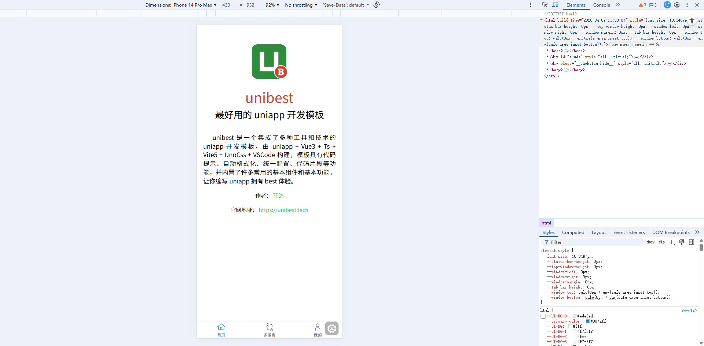

# unibest 

unibest 本质上不是一个“框架内核”，而是一个基于 uniapp 的工程化脚手架/最佳实践模板，定位类似你在 Web 端用的 Vue Admin / Vite Starter。

- [官网地址](https://unibest.tech/)


## 快速使用

### 创建项目

```
D:\Temp\2026\202604>pnpm create unibest@4.0.15 unibest-demo
T  create-unibest@v4.0.15 快速创建 unibest@v4.4.0 项目
|
*  请选择需要支持的平台（多选）[脚手架将根据所选平台生成对应的平台代码，请根据实际情况选择]
|  [+] H5
|  [+] 微信小程序
|  [+] APP
|  [+] 支付宝小程序（包含钉钉）
|  [+] 抖音小程序
|
*  请选择UI库
|    无UI库
|    wot-ui
|    uview-pro
|    sard-uniapp
|    uv-ui
|  > uview-plus
|    tdesign
|
*  是否需要登录策略（黑白名单、登录拦截等）？[暂不知道的，选No即可，项目生成后也可以加该策略]
|  > Yes /   No
|
*  是否需要多语言i18n？
|  > Yes /   No
|
*  请选择需要的图表库（多选）[默认会生成 pages-demo 示例页面]
|  [+] lime-echart
|  [+] ucharts
```

### 安装依赖

```
cd unibest-demo
pnpm install
```

### 启动 H5

```
pnpm dev:h5
```



### 启动小程序

```
pnpm dev:mp
```

### 启动APP

```
pnpm dev:app
```

