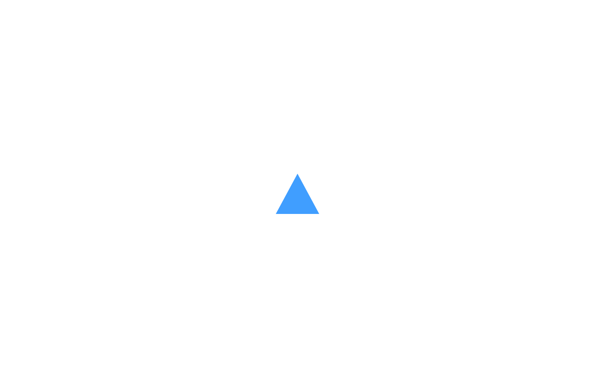
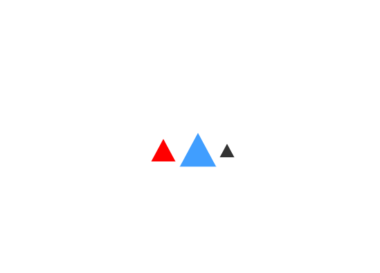
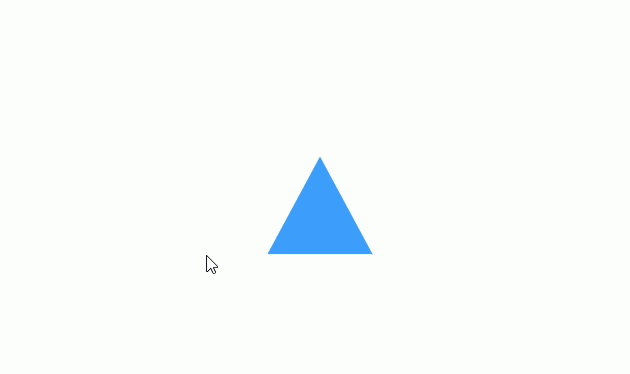
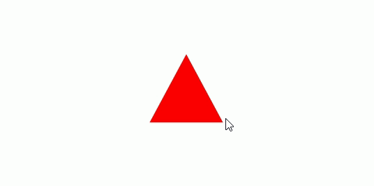
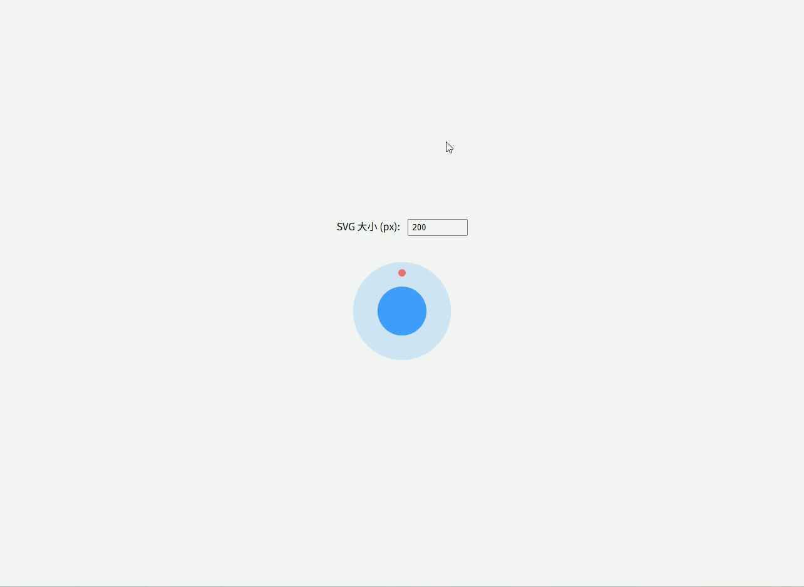
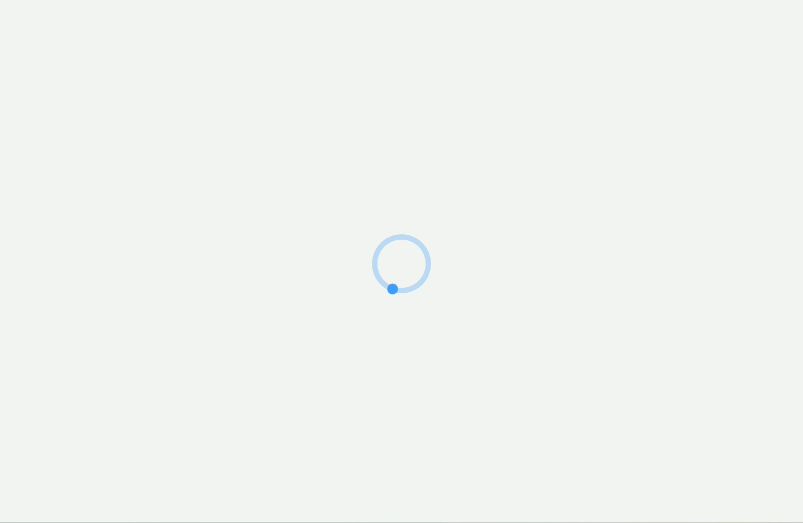
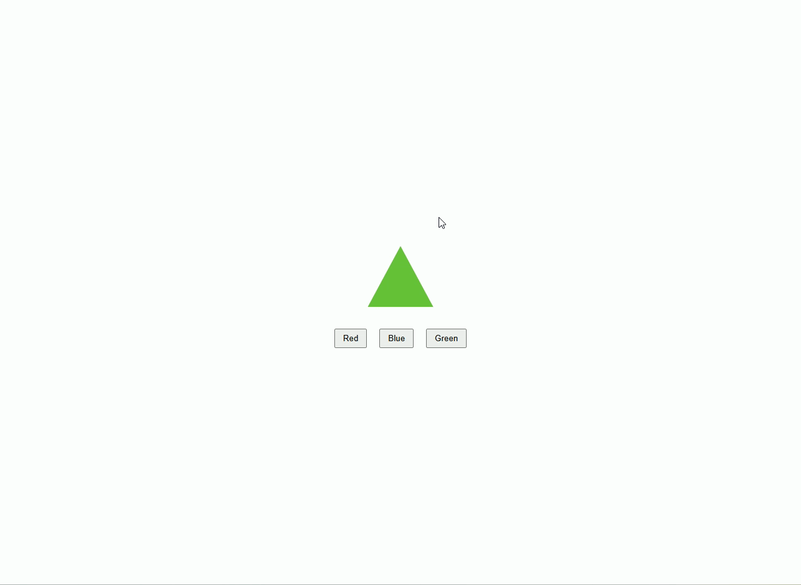

# SVG

**SVG（Scalable Vector Graphics）** 是一种基于 XML 的矢量图形标准，适合在网页中显示图标、图表、动画和各种可缩放图形。与位图不同，SVG 图像不会随着放大而失真，支持动态样式、颜色和动画，可以通过 `<svg>`、`<use>` 或封装组件的方式在 Vue3 项目中高复用地使用。


## 直接使用 `` 引入 SVG

最简单方式，把 SVG 当普通图片。

```vue
<script setup lang="ts">
import logo from '@/assets/1299642.svg'
</script>

<template>
  <div class="demo">
    
  </div>
</template>

<style scoped>

.demo {
  width: 100%;
  height: 100vh;
  display: flex;
  justify-content: center;
  align-items: center;
}

.logo {
  width: 200px;
  height: 200px;
}

</style>
```


## 直接内联 SVG（推荐）

把 SVG 代码直接写进 template。

```vue
<template>
  <div class="demo">
    <svg class="icon" viewBox="0 0 1024 1024">
      <path d="M512 64L64 896h896z"/>
    </svg>
  </div>
</template>

<style scoped>

.demo {
  height: 100vh;
  display: flex;
  justify-content: center;
  align-items: center;
}

.icon {
  width: 120px;
  height: 120px;
  fill: currentColor;
  color: #409eff;
  transition: color 0.3s;
}

.icon:hover {
  color: red;
}

</style>
```



## Vue3 SVG 组件（最推荐）

把 SVG 封装成组件。

`src/components/Icon.vue`

```vue
<script setup lang="ts">

interface Props {
  size?: number
  color?: string
}

const props = withDefaults(defineProps<Props>(), {
  size: 24,
  color: '#333'
})

</script>

<template>

  <svg
    class="icon"
    :style="{
      width: props.size + 'px',
      height: props.size + 'px',
      color: props.color
    }"
    viewBox="0 0 1024 1024"
  >
    <path d="M512 64L64 896h896z" />
  </svg>

</template>

<style scoped>

.icon {
  fill: currentColor;
  display: inline-block;
}

</style>
```

------

**使用**

```vue
<script setup lang="ts">
import Icon from '@/components/Icon.vue'
</script>

<template>

  <div class="demo">

  <Icon :size="40" color="red" />

  <Icon :size="60" color="#409eff" />

  <Icon />

  </div>

</template>
<style scoped>

.demo {
  height: 100vh;
  display: flex;
  justify-content: center;
  align-items: center;
}

</style>
```




## SVG Hover 动画 / 交互

- 鼠标悬停改变颜色、放大、旋转等
- 常用于按钮、菜单、收藏图标

示例：

```vue
<script setup lang="ts"></script>

<template>

  <div class="demo">

    <svg class="icon" viewBox="0 0 1024 1024">
      <path d="M512 64L64 896h896z" />
    </svg>

  </div>

</template>
<style scoped>

.demo {
  height: 100vh;
  display: flex;
  justify-content: center;
  align-items: center;
}

.icon {
  width: 120px;
  height: 120px;
  fill: currentColor;
  color: #409eff;
  transition: color 0.3s;
}

.icon:hover {
  color: #f56c6c;
  transform: scale(1.2);
  transition: 0.3s;
}
</style>
```



------

## SVG 点击状态切换（动态图标）

- 点击切换颜色或形状（收藏、点赞、展开/收起）
- 常用 `v-model` 或 `ref` 控制状态

```vue
<script setup lang="ts">
import { ref } from 'vue'

const active = ref(false)

</script>

<template>

  <div class="demo">

    <svg
        class="icon"
        viewBox="0 0 1024 1024"
        :style="{ color: active ? 'red' : '#409eff' }"
        @click="active = !active"
    >
      <path d="M512 64L64 896h896z" />
    </svg>

  </div>

</template>
<style scoped>

.demo {
  height: 100vh;
  display: flex;
  justify-content: center;
  align-items: center;
}

.icon {
  width: 120px;
  height: 120px;
  fill: currentColor;
}

</style>
```



------

## 响应式 SVG

```vue
<script setup lang="ts">
import { ref } from 'vue'

// 响应式大小，单位 px
const size = ref(200)
</script>

<template>
  <div class="demo">
    <!-- 输入框控制大小 -->
    <div class="controls">
      <label>SVG 大小 (px): </label>
      <input type="number" v-model.number="size" min="50" max="600"/>
    </div>

    <!-- SVG 随大小响应 -->
    <svg
        viewBox="0 0 1024 1024"
        :width="size || 100"
        :height="size || 100"
        class="responsive-svg"
    >
      <!-- 背景圆 -->
      <circle cx="512" cy="512" r="400" fill="#409eff" opacity="0.2"/>
      <!-- 内部圆 -->
      <circle cx="512" cy="512" r="200" fill="#409eff"/>
      <!-- 小球 -->
      <circle cx="512" cy="200" r="30" fill="#f56c6c"/>
    </svg>
  </div>
</template>

<style scoped>
.demo {
  width: 100%;
  min-height: 100vh;
  display: flex;
  flex-direction: column;
  justify-content: center;
  align-items: center;
  background-color: #f5f5f5;
}

/* 输入框样式 */
.controls {
  margin-bottom: 20px;
  font-size: 16px;
}

.controls input {
  width: 80px;
  padding: 4px 6px;
  margin-left: 8px;
}

/* SVG 居中 */
.responsive-svg {
  display: block;
  transition: width 0.3s, height 0.3s; /* 动态大小变化过渡 */
}
</style>
```



---

##  动画 SVG（旋转）

```css
<script setup lang="ts">
</script>

<template>
  <div class="demo">
    <!-- 外环旋转 -->
    <svg viewBox="0 0 50 50" class="loading-icon">
      <circle class="ring" cx="25" cy="25" r="20" fill="none" stroke-width="4" />
      <circle class="dot" cx="25" cy="5" r="4" />
    </svg>
  </div>
</template>

<style scoped>
/* 父容器全屏居中 */
.demo {
  width: 100%;
  height: 100vh;          /* 占满全屏高度 */
  display: flex;
  justify-content: center;
  align-items: center;
  background: #f5f5f5;
}

/* 外环半透明 */
.loading-icon .ring {
  stroke: #409eff;
  stroke-opacity: 0.3;
}

/* 顶部小球 */
.loading-icon .dot {
  fill: #409eff;
  transform-origin: 25px 25px;
  animation: spin 1s linear infinite;
}

/* 旋转动画 */
@keyframes spin {
  0% { transform: rotate(0deg); }
  100% { transform: rotate(360deg); }
}

/* SVG 大小 */
.loading-icon {
  width: 120px;
  height: 120px;
}
</style>
```



---

## SVG 响应式 + CSS Variables

- 颜色、大小、旋转都用 CSS 变量控制
- 大型系统中非常方便统一主题

```vue
<script setup lang="ts">
import { ref } from 'vue'

const color = ref('#409eff')
</script>

<template>
  <div class="demo">
    <svg
      class="icon-variable"
      :style="{
        '--icon-color': color,
        width: '120px',
        height: '120px'
      }"
      viewBox="0 0 1024 1024"
    >
      <path d="M512 64L64 896h896z" fill="var(--icon-color)" />
    </svg>

    <div class="buttons">
      <button @click="color = '#f56c6c'">Red</button>
      <button @click="color = '#409eff'">Blue</button>
      <button @click="color = '#67c23a'">Green</button>
    </div>
  </div>
</template>

<style scoped>
.demo {
  width: 100%;
  height: 100vh;
  display: flex;
  flex-direction: column;
  justify-content: center;
  align-items: center;
}

.icon-variable {
  margin-bottom: 20px;
}

.buttons button {
  margin: 0 10px;
  padding: 6px 12px;
  cursor: pointer;
}
</style>
```



---

## SVG Sprite / Symbol + Use（企业级图标系统，Vite 方式）

支持：

- 动态大小
- 动态颜色
- 高复用性
- 居中显示
- 可扩展大量图标

------

1️⃣ 安装插件

```bash
pnpm install vite-plugin-svg-icons@2.0.1 fast-glob@3.3.3 -D
```

在 `vite.config.ts` 中配置：

```ts
import { defineConfig } from 'vite'
import vue from '@vitejs/plugin-vue'
import { createSvgIconsPlugin } from 'vite-plugin-svg-icons'
import path from 'path'

export default defineConfig({
  plugins: [
    vue(),
    createSvgIconsPlugin({
        iconDirs: [path.resolve(process.cwd(), 'src/icons')], // 你的 svg 文件夹
        symbolId: 'icon-[name]', // 对应 <use href="#icon-xxx">
        inject: 'body-first',     // sprite 注入到 body 开头，确保页面加载时可用
    }),
  ],
})
```

**注入脚本**

在 `src/main.ts` 中引入插件生成的注册脚本，否则图标不会显示。

```ts
import { createApp } from 'vue'
import App from './App.vue'

// 必须引入，用于注册所有的 SVG 符号
import 'virtual:svg-icons-register'

createApp(App).mount('#app')
```

**创建类型声明文件**

在项目里创建一个 `src/types/svg-icons.d.ts`（或者 `src/types/global.d.ts`）：

```
declare module 'virtual:svg-icons-register'
```

------

2️⃣ 图标文件管理（`src/icons/`）

示例：`user.svg`、`home.svg`

**user.svg**

```xml
<svg viewBox="0 0 1024 1024" xmlns="http://www.w3.org/2000/svg">
  <path d="M512 512m-128 0a128 128 0 1 0 256 0 128 128 0 1 0-256 0Z" />
</svg>
```

**home.svg**

```xml
<svg viewBox="0 0 1024 1024" xmlns="http://www.w3.org/2000/svg">
  <path d="M512 128L128 512h128v384h192V640h128v256h192V512h128z" />
</svg>
```

> 注意：`vite-plugin-svg-icons` 会自动扫描 `src/icons` 目录并生成 sprite 文件

------

3️⃣ SvgIcon 组件（`src/components/SvgIcon.vue`）

```vue
<script setup lang="ts">
interface Props {
  name: string
  size?: number
  color?: string
}

const props = withDefaults(defineProps<Props>(), {
  size: 24,
  color: '#333'
})
</script>

<template>
  <svg
      class="icon"
      :style="{ width: props.size + 'px', height: props.size + 'px', color: props.color }"
  >
    <!-- 直接引用 symbol -->
    <use :href="`#icon-${props.name}`" />
  </svg>
</template>

<style scoped>
.icon {
  display: inline-block;
  vertical-align: middle;
  fill: currentColor;
}
</style>
```

✅ 优点：

- 不用 `require` 或 `import` 每个图标
- 所有图标统一由 `vite-plugin-svg-icons` 管理
- 支持动态大小、颜色
- sprite + symbol，复用性高，体积小

------

4️⃣ 使用示例页面

```vue
<script setup lang="ts">
import SvgIcon from '@/components/SvgIcon.vue'
</script>

<template>
  <div class="demo">
    <SvgIcon name="user" :size="40" color="red" />
    <SvgIcon name="home" :size="60" color="#409eff" />
    <SvgIcon name="user" :size="80" color="#67c23a" />
  </div>
</template>

<style scoped>
.demo {
  height: 100vh;
  display: flex;
  justify-content: center;
  align-items: center;
  gap: 40px;
  background-color: #f5f5f5;
}
</style>
```

------

5️⃣ 使用说明

- 新增图标 → 直接放入 `src/icons/` 目录 → 名称自动生成 symbolId
- `<SvgIcon name="xxx" />` → 动态渲染图标
- `size` 属性控制宽高
- `color` 属性控制填充颜色
- 高复用，适合企业项目图标系统

