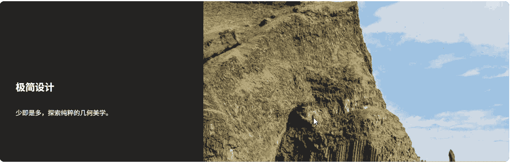
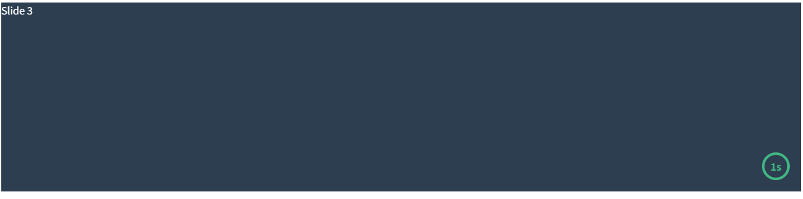

# Swiper

**Swiper** 是目前全球最流行、最现代化的**纯 JavaScript 触摸轮播库（Touch Slider）**。它专注于移动端体验，同时也完美适配桌面端，是开发响应式网站、移动 App 轮播图、H5 宣传页的首选工具。

- [官网地址](https://swiperjs.com/)


## 基础配置

**安装依赖**

```
pnpm add swiper@12.1.0
```


## 基础示例

```vue
<template>
  <div class="swiper-container">
    <swiper
        :modules="modules"
        :slides-per-view="1"
        :space-between="20"
        :loop="true"
        :pagination="{ clickable: true }"
        :navigation="true"
        :autoplay="{ delay: 3000, disableOnInteraction: false }"
        @swiper="onSwiper"
        @slideChange="onSlideChange"
        class="my-swiper"
    >
      <swiper-slide v-for="(item, index) in list" :key="index">
        <div class="slide-card">{{ item.title }}</div>
      </swiper-slide>
    </swiper>
  </div>
</template>

<script setup lang="ts">
// 1. 引入 Swiper 组件
import { Swiper, SwiperSlide } from 'swiper/vue';
// 2. 引入 Swiper 样式
import 'swiper/swiper-bundle.css'

// 3. 引入所需模块
import { Pagination, Navigation, Autoplay } from 'swiper/modules';

// 定义数据类型
interface SlideItem {
  title: string;
}

const list: SlideItem[] = [
  { title: 'Slide 1' },
  { title: 'Slide 2' },
  { title: 'Slide 3' },
];

// 注册模块
const modules = [Pagination, Navigation, Autoplay];

// 事件回调
const onSwiper = (swiper: any) => {
  console.log('Swiper 实例已就绪');
};

const onSlideChange = () => {
  console.log('幻灯片已切换');
};
</script>

<style scoped>
.swiper-container {
  width: 100%;
  max-width: 600px;
  margin: 0 auto;
}

.my-swiper {
  height: 300px;
  border-radius: 8px;
}

.slide-card {
  display: flex;
  justify-content: center;
  align-items: center;
  height: 100%;
  background-color: #42b883;
  color: white;
  font-size: 24px;
  font-weight: bold;
}

/* 调整导航按钮颜色（可选） */
:deep(.swiper-button-next),
:deep(.swiper-button-prev) {
  color: #fff;
}
</style>
```


## Thumbs 缩略图联动

```vue
<template>
  <div class="gallery-container">
    <swiper
        :modules="modules"
        :loop="true"
        :space-between="10"
        :navigation="true"
        :thumbs="{ swiper: thumbsSwiper }"
        class="main-swiper"
    >
      <swiper-slide v-for="(item, index) in images" :key="index">
        
      </swiper-slide>
    </swiper>

    <swiper
        @swiper="setThumbsSwiper"
        :modules="modules"
        :loop="false"
        :space-between="10"
        :slides-per-view="4"
        :free-mode="true"
        :watch-slides-progress="true"
        class="thumbs-swiper"
    >
      <swiper-slide v-for="(item, index) in images" :key="index">
        <div class="thumb-box">
          
        </div>
      </swiper-slide>
    </swiper>
  </div>
</template>

<script setup lang="ts">
import { ref } from 'vue';
import { Swiper, SwiperSlide } from 'swiper/vue';
// 直接引用 12.1.0 的全量样式
import 'swiper/swiper-bundle.css';

// 引入模块
import { Navigation, Thumbs, FreeMode } from 'swiper/modules';
// 引入类型
import type { Swiper as SwiperClass } from 'swiper/types';

// 注册模块
const modules = [Navigation, Thumbs, FreeMode];

// 模拟图片数据
const images = ref([
  'https://picsum.photos/800/600?random=1',
  'https://picsum.photos/800/600?random=2',
  'https://picsum.photos/800/600?random=3',
  'https://picsum.photos/800/600?random=4',
  'https://picsum.photos/800/600?random=5',
]);

// 存储缩略图 Swiper 实例的响应式变量
const thumbsSwiper = ref<SwiperClass | null>(null);

// 获取缩略图实例的方法
const setThumbsSwiper = (swiper: SwiperClass) => {
  thumbsSwiper.value = swiper;
};
</script>

<style scoped>
.gallery-container {
  width: 100%;
  max-width: 800px;
  margin: 0 auto;
}

/* 主图样式 */
.main-swiper {
  width: 100%;
  height: 400px;
  border-radius: 8px;
  background: #eee;
}
.main-swiper img {
  width: 100%;
  height: 100%;
  object-fit: cover;
}

/* 缩略图栏样式 */
.thumbs-swiper {
  margin-top: 10px;
  height: 80px;
  box-sizing: border-box;
  padding: 5px 0;
}
.thumbs-swiper .swiper-slide {
  width: 25%;
  height: 100%;
  opacity: 0.4;
  cursor: pointer;
  transition: opacity 0.3s;
}

/* 选中缩略图的样式（Swiper 自动添加的类名） */
.thumbs-swiper .swiper-slide-thumb-active {
  opacity: 1;
}

.thumb-box {
  width: 100%;
  height: 100%;
  border-radius: 4px;
  overflow: hidden;
  border: 2px solid transparent;
}
.swiper-slide-thumb-active .thumb-box {
  border-color: #42b883; /* Vue 绿色 */
}

.thumb-box img {
  width: 100%;
  height: 100%;
  object-fit: cover;
}
</style>
```


## Controller 双机联动

```vue
<template>
  <div class="controller-demo">
    <div class="text-section">
      <swiper
          @swiper="setFirstSwiper"
          :modules="modules"
          :controller="{ control: secondSwiper }"
          direction="vertical"
          class="text-swiper"
      >
        <swiper-slide v-for="item in data" :key="item.id">
          <div class="content">
            <h2>{{ item.title }}</h2>
            <p>{{ item.desc }}</p>
          </div>
        </swiper-slide>
      </swiper>
    </div>

    <div class="image-section">
      <swiper
          @swiper="setSecondSwiper"
          :modules="modules"
          :controller="{ control: firstSwiper }"
          effect="fade"
          class="image-swiper"
      >
        <swiper-slide v-for="item in data" :key="item.id">
          
        </swiper-slide>
      </swiper>
    </div>
  </div>
</template>

<script setup lang="ts">
import { ref } from 'vue';
import { Swiper, SwiperSlide } from 'swiper/vue';
import 'swiper/swiper-bundle.css';

// 引入 Controller 模块
import { Controller, EffectFade } from 'swiper/modules';
import type { Swiper as SwiperClass } from 'swiper/types';

const modules = [Controller, EffectFade];

// 核心逻辑：定义两个 ref 来存放彼此的实例
const firstSwiper = ref<SwiperClass | null>(null);
const secondSwiper = ref<SwiperClass | null>(null);

const setFirstSwiper = (swiper: SwiperClass) => {
  firstSwiper.value = swiper;
};
const setSecondSwiper = (swiper: SwiperClass) => {
  secondSwiper.value = swiper;
};

// 模拟数据
const data = [
  { id: 1, title: '极简设计', desc: '少即是多，探索纯粹的几何美学。', img: 'https://picsum.photos/600/600?random=11' },
  { id: 2, title: '自然光影', desc: '捕捉清晨的第一缕阳光。', img: 'https://picsum.photos/600/600?random=12' },
  { id: 3, title: '都市律动', desc: '在霓虹灯火中感受城市的脉搏。', img: 'https://picsum.photos/600/600?random=13' },
];
</script>

<style scoped>
.controller-demo {
  display: flex;
  height: 400px;
  background: #1a1a1a;
  color: white;
  border-radius: 12px;
  overflow: hidden;
}

.text-section { width: 40%; background: #222; }
.image-section { width: 60%; }

.text-swiper, .image-swiper { width: 100%; height: 100%; }

.content {
  padding: 40px;
  display: flex;
  flex-direction: column;
  justify-content: center;
  height: 100%;
}

.image-swiper img {
  width: 100%;
  height: 100%;
  object-fit: cover;
}
</style>
```



## Virtual Slides 虚拟滚动

```vue
<template>
  <div class="virtual-container">
    <div class="header">
      <h3>虚拟滚动 (1000条数据)</h3>
      <span class="badge">当前索引: {{ currentIndex }}</span>
    </div>

    <swiper
        :modules="modules"
        :slides-per-view="3"
        :space-between="20"
        :navigation="true"
        :virtual="true"
        @swiper="onSwiper"
        @slideChange="onSlideChange"
        class="my-virtual-swiper"
    >
      <swiper-slide
          v-for="(content, index) in slides"
          :key="index"
          :virtualIndex="index"
      >
        <div class="virtual-card">
          <span class="id">#{{ index }}</span>
          <p>{{ content }}</p>
        </div>
      </swiper-slide>
    </swiper>

    <div class="controls">
      <button @click="goTo(0)">回到开始</button>
      <button @click="goTo(499)">跳到中间 (#499)</button>
      <button @click="goTo(999)">跳到结尾 (#999)</button>
    </div>
  </div>
</template>

<script setup lang="ts">
import { ref } from 'vue';
import { Swiper, SwiperSlide } from 'swiper/vue';
import type { Swiper as SwiperClass } from 'swiper/types';

// Swiper 12.1.0 样式与模块
import 'swiper/swiper-bundle.css';
import { Navigation, Virtual } from 'swiper/modules';

const modules = [Navigation, Virtual];

// 1. 准备数据
const slides = ref(
    Array.from({ length: 1000 }).map((_, i) => `数据内容 ${i}`)
);

// 2. 核心：存储 Swiper 实例
const swiperInstance = ref<SwiperClass | null>(null);
const currentIndex = ref(0);

// 当 Swiper 初始化完成，捕获其实例
const onSwiper = (swiper: SwiperClass) => {
  swiperInstance.value = swiper;
  console.log('Swiper 实例已绑定，可以进行外部操作');
};

// 监听索引变化
const onSlideChange = () => {
  if (swiperInstance.value) {
    currentIndex.value = swiperInstance.value.activeIndex;
  }
};

// 3. 外部控制方法
const goTo = (index: number) => {
  if (swiperInstance.value) {
    // slideTo(索引, 速度ms)
    swiperInstance.value.slideTo(index, 400);
  }
};
</script>

<style scoped>
.virtual-container {
  max-width: 800px;
  margin: 40px auto;
  font-family: sans-serif;
}

.header {
  display: flex;
  justify-content: space-between;
  align-items: center;
  margin-bottom: 15px;
}

.badge {
  background: #42b883;
  color: white;
  padding: 4px 12px;
  border-radius: 20px;
  font-size: 14px;
}

.my-virtual-swiper {
  height: 180px;
  background: #eee;
  border-radius: 12px;
  padding: 20px;
}

.virtual-card {
  height: 100%;
  background: white;
  border-radius: 10px;
  display: flex;
  flex-direction: column;
  justify-content: center;
  align-items: center;
  box-shadow: 0 4px 6px rgba(0,0,0,0.1);
}

.id { font-size: 20px; font-weight: bold; color: #2c3e50; }

.controls {
  margin-top: 25px;
  display: flex;
  gap: 15px;
  justify-content: center;
}

button {
  padding: 10px 20px;
  background: #35495e;
  color: white;
  border: none;
  border-radius: 6px;
  cursor: pointer;
  transition: opacity 0.2s;
}

button:hover {
  opacity: 0.8;
}
</style>
```


## Fade/Cube/Coverflow/Flip

```vue
<template>
  <div class="effect-container">
    <div class="controls">
      <button v-for="e in effects" :key="e" @click="currentEffect = e" :class="{ active: currentEffect === e }">
        {{ e.toUpperCase() }}
      </button>
    </div>

    <swiper
        :key="currentEffect"
        :modules="modules"
        :effect="currentEffect"
        :grab-cursor="true"
        :cube-effect="{ shadow: true, slideShadows: true, shadowOffset: 20, shadowScale: 0.94 }"
        :coverflow-effect="{ rotate: 50, stretch: 0, depth: 100, modifier: 1, slideShadows: true }"
        :flip-effect="{ slideShadows: true }"
        class="my-effect-swiper"
    >
      <swiper-slide v-for="i in 5" :key="i" :style="{ backgroundColor: `hsl(${i * 60}, 70%, 50%)` }">
        <div class="slide-content">Slide {{ i }}</div>
      </swiper-slide>
    </swiper>
  </div>
</template>

<script setup lang="ts">
import { ref } from 'vue';
import { Swiper, SwiperSlide } from 'swiper/vue';
import 'swiper/swiper-bundle.css';

// 引入所有特效模块
import { EffectFade, EffectCube, EffectCoverflow, EffectFlip } from 'swiper/modules';

const modules = [EffectFade, EffectCube, EffectCoverflow, EffectFlip];
const effects = ['fade', 'cube', 'coverflow', 'flip'] as const;

// 当前选中的效果
const currentEffect = ref<typeof effects[number]>('cube');
</script>

<style scoped>
.effect-container {
  max-width: 500px;
  margin: 40px auto;
}

.controls {
  display: flex;
  justify-content: center;
  gap: 10px;
  margin-bottom: 30px;
}

button {
  padding: 6px 12px;
  cursor: pointer;
  border: 1px solid #ddd;
  background: white;
  border-radius: 4px;
}

button.active {
  background: #42b883;
  color: white;
  border-color: #42b883;
}

.my-effect-swiper {
  width: 300px;
  height: 300px;
}

.slide-content {
  width: 100%;
  height: 100%;
  display: flex;
  justify-content: center;
  align-items: center;
  font-size: 30px;
  font-weight: bold;
  color: white;
}

/* 特殊处理：Fade 效果通常需要容器宽度 100% */
.my-effect-swiper :deep(.swiper-slide) {
  background-position: center;
  background-size: cover;
}
</style>
```


## Creative Effect

```vue
<template>
  <div class="creative-container">
    <swiper
        :modules="modules"
        :grab-cursor="true"
        effect="creative"
        :creative-effect="{
        prev: {
          // 上一张 Slide 的状态：向左偏移 120%，旋转 -30度
          shadow: true,
          translate: ['-120%', 0, -500],
          rotate: [0, 0, -30],
        },
        next: {
          // 下一张 Slide 的状态：向右偏移 100%，缩放 0.6
          shadow: true,
          translate: ['100%', 0, 0],
          scale: 0.6,
        },
      }"
        class="my-creative-swiper"
    >
      <swiper-slide v-for="i in 5" :key="i" :style="{ backgroundColor: colors[i-1] }">
        <div class="card-content">
          <span>Creative</span>
          <h2>0{{ i }}</h2>
        </div>
      </swiper-slide>
    </swiper>
  </div>
</template>

<script setup lang="ts">
import { Swiper, SwiperSlide } from 'swiper/vue';
import 'swiper/swiper-bundle.css';
import { EffectCreative } from 'swiper/modules';

const modules = [EffectCreative];

const colors = ['#64748b', '#ef4444', '#f59e0b', '#10b981', '#3b82f6'];
</script>

<style scoped>
.creative-container {
  display: flex;
  justify-content: center;
  align-items: center;
  height: 400px;
  background: #0f172a;
}

.my-creative-swiper {
  width: 320px;
  height: 450px;
  overflow: visible; /* 有时为了看到堆叠效果需要设为 visible */
}

.swiper-slide {
  border-radius: 20px;
  display: flex;
  justify-content: center;
  align-items: center;
  color: white;
  box-shadow: 0 10px 30px rgba(0,0,0,0.5);
}

.card-content {
  text-align: center;
}

.card-content span {
  text-transform: uppercase;
  letter-spacing: 2px;
  font-size: 12px;
  opacity: 0.7;
}

.card-content h2 {
  font-size: 80px;
  margin: 0;
}
</style>
```


## Vertical 垂直滑动（公告类）

```vue
<template>
  <div class="vertical-demo">
    <div class="card-header">
      <h4>实时动态</h4>
    </div>

    <swiper
        :direction="'vertical'"
        :modules="modules"
        :slides-per-view="3"
        :space-between="10"
        :loop="true"
        :autoplay="{ delay: 2500, disableOnInteraction: false }"
        :mousewheel="true"
        class="news-swiper"
    >
      <swiper-slide v-for="(item, index) in newsList" :key="index">
        <div class="news-item">
          <span class="dot"></span>
          <p>{{ item }}</p>
        </div>
      </swiper-slide>
    </swiper>

    <div class="card-footer">
      <p>使用鼠标滚轮或滑动查看更多</p>
    </div>
  </div>
</template>

<script setup lang="ts">
import { ref } from 'vue';
import { Swiper, SwiperSlide } from 'swiper/vue';
import 'swiper/swiper-bundle.css';
import { Autoplay, Mousewheel } from 'swiper/modules';

const modules = [Autoplay, Mousewheel];

const newsList = ref([
  '系统将于凌晨 2:00 进行例行维护',
  '恭喜用户 138****0021 抽中一等奖',
  '新功能：支持 TS 强类型推断已上线',
  'Swiper 12.1.0 垂直模式使用指南',
  '关于春季促销活动的最新通知',
  '由于天气原因，部分地区配送可能延迟'
]);
</script>

<style scoped>
.vertical-demo {
  width: 350px;
  background: #ffffff;
  border-radius: 12px;
  box-shadow: 0 8px 24px rgba(0,0,0,0.1);
  overflow: hidden;
  border: 1px solid #eee;
}

.card-header {
  padding: 15px;
  background: #f8f9fa;
  border-bottom: 1px solid #eee;
}

.card-header h4 { margin: 0; color: #333; }

/* 关键：必须限制 Swiper 的容器高度 */
.news-swiper {
  height: 200px; /* 固定高度，刚好够显示 3 条（每条约 60px + 间距） */
  padding: 10px 0;
}

.news-item {
  height: 60px; /* 每项固定高度 */
  display: flex;
  align-items: center;
  padding: 0 20px;
  background: #fff;
  transition: background 0.3s;
}

.news-item:hover {
  background: #f0f7ff;
}

.dot {
  width: 6px;
  height: 6px;
  background: #42b883;
  border-radius: 50%;
  margin-right: 12px;
  flex-shrink: 0;
}

.news-item p {
  margin: 0;
  font-size: 14px;
  color: #666;
  white-space: nowrap;
  overflow: hidden;
  text-overflow: ellipsis;
}

.card-footer {
  padding: 10px;
  text-align: center;
  font-size: 12px;
  color: #999;
  background: #fafafa;
}
</style>
```


## 垂直缩略图画廊

```vue
<template>
  <div class="gallery-wrapper">
    <div class="thumbs-container">
      <swiper
          @swiper="setThumbsSwiper"
          :direction="'vertical'"
          :modules="modules"
          :slides-per-view="4"
          :space-between="10"
          :watch-slides-progress="true"
          class="thumbs-vertical-swiper"
      >
        <swiper-slide v-for="(img, i) in images" :key="i">
          <div class="thumb-card">
            
          </div>
        </swiper-slide>
      </swiper>
    </div>

    <div class="main-container">
      <swiper
          :modules="modules"
          :thumbs="{ swiper: thumbsSwiper }"
          :navigation="true"
          :effect="'fade'"
          class="main-display-swiper"
      >
        <swiper-slide v-for="(img, i) in images" :key="i">
          
        </swiper-slide>
      </swiper>
    </div>
  </div>
</template>

<script setup lang="ts">
import { ref } from 'vue';
import { Swiper, SwiperSlide } from 'swiper/vue';
import 'swiper/swiper-bundle.css';
import { Navigation, Thumbs, EffectFade } from 'swiper/modules';
import type { Swiper as SwiperClass } from 'swiper/types';

const modules = [Navigation, Thumbs, EffectFade];

const thumbsSwiper = ref<SwiperClass | null>(null);
const setThumbsSwiper = (swiper: SwiperClass) => {
  thumbsSwiper.value = swiper;
};

const images = [
  'https://picsum.photos/600/800?random=1',
  'https://picsum.photos/600/800?random=2',
  'https://picsum.photos/600/800?random=3',
  'https://picsum.photos/600/800?random=4',
  'https://picsum.photos/600/800?random=5',
];
</script>

<style scoped>
.gallery-wrapper {
  display: flex;
  width: 700px;
  height: 450px;
  gap: 15px;
  margin: 40px auto;
  background: #fff;
  padding: 10px;
  border-radius: 12px;
}

/* 缩略图区域 */
.thumbs-container {
  width: 100px;
  height: 100%;
}

.thumbs-vertical-swiper {
  height: 100%;
}

.thumb-card {
  width: 100%;
  height: 100%;
  border-radius: 6px;
  overflow: hidden;
  cursor: pointer;
  border: 2px solid transparent;
  transition: 0.3s;
}

.thumb-card img {
  width: 100%;
  height: 100%;
  object-fit: cover;
}

/* 选中状态 */
:deep(.swiper-slide-thumb-active) .thumb-card {
  border-color: #42b883;
}

/* 主图区域 */
.main-container {
  flex: 1;
  height: 100%;
  background: #f9f9f9;
  border-radius: 8px;
  overflow: hidden;
}

.main-display-swiper {
  width: 100%;
  height: 100%;
}

.main-img {
  width: 100%;
  height: 100%;
  object-fit: contain;
}
</style>
```


## 带进度条的自动播放

```vue
<template>
  <div class="autoplay-wrapper">
    <swiper
        :modules="modules"
        :autoplay="{ delay: 1000, disableOnInteraction: false }"
        @autoplayTimeLeft="onAutoplayTimeLeft"
        class="progress-swiper"
    >
      <swiper-slide v-for="i in 3" :key="i">Slide {{ i }}</swiper-slide>

      <template #container-end>
        <div class="autoplay-progress">
          <svg viewBox="0 0 48 48" ref="progressCircle">
            <circle cx="24" cy="24" r="20"></circle>
          </svg>
          <span ref="progressContent"></span>
        </div>
      </template>
    </swiper>
  </div>
</template>

<script setup lang="ts">
import { ref } from 'vue';
import { Swiper, SwiperSlide } from 'swiper/vue';
import 'swiper/swiper-bundle.css';
import { Autoplay } from 'swiper/modules';

const modules = [Autoplay];

const progressCircle = ref<SVGSVGElement | null>(null);
const progressContent = ref<HTMLElement | null>(null);

// 核心：利用 autoplayTimeLeft 回调实时更新进度条
const onAutoplayTimeLeft = (s: any, time: number, progress: number) => {
  if (progressCircle.value) {
    progressCircle.value.style.setProperty('--progress', String(1 - progress));
  }
  if (progressContent.value) {
    progressContent.value.textContent = `${Math.ceil(time / 1000)}s`;
  }
};
</script>

<style scoped>
.progress-swiper { height: 300px; background: #2c3e50; color: #fff; }

/* 进度条样式 */
.autoplay-progress {
  position: absolute;
  right: 16px;
  bottom: 16px;
  z-index: 10;
  width: 48px;
  height: 48px;
  display: flex;
  align-items: center;
  justify-content: center;
  font-weight: bold;
  color: #42b883;
}

.autoplay-progress svg {
  --progress: 0;
  position: absolute;
  left: 0;
  top: 0;
  width: 100%;
  height: 100%;
  stroke-width: 4px;
  stroke: #42b883;
  fill: none;
  stroke-dasharray: 125.6;
  stroke-dashoffset: calc(125.6 * var(--progress));
  transform: rotate(-90deg);
}
</style>
```

