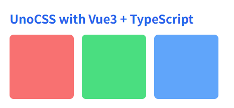

# UnoCSS

UnoCSS 是一种原子化的 CSS 引擎，采用按需生成样式的方式。它没有固定的预设类库，而是通过扫描代码来动态产出所需的 CSS。

由于无需在打包中保留未使用的样式，因此能显著减少文件体积。同时支持多种预设与自定义规则，适合 Vue、React 等框架，开发体验灵活高效。

- [官网地址](xxx/)


## 基础配置

**安装依赖**

```
pnpm add unocss@66.6.0
```

**在 Vite 中接入 UnoCSS**

`vite.config.ts`

```ts
import { defineConfig } from 'vite';
import vue from '@vitejs/plugin-vue';
import path from 'path';
import UnoCSS from 'unocss/vite';

export default defineConfig({
    plugins: [
        vue(),
        UnoCSS(),
    ],
    resolve: {
        alias: {
            '@': path.resolve(__dirname, 'src'),
        }
    }
});
```

**创建 UnoCSS 配置文件**

根目录新建：`uno.config.ts`

```ts
import { defineConfig, presetUno, presetAttributify, presetIcons } from 'unocss';

export default defineConfig({
  presets: [
    presetUno(),
    presetAttributify(),
    presetIcons(),
  ],
});
```

这三个 preset 是最常用组合：

| preset            | 作用                          |
| ----------------- | ----------------------------- |
| presetUno         | Tailwind 风格原子类           |
| presetAttributify | 属性写法，如 `text="red-500"` |
| presetIcons       | 图标支持                      |

**引入 UnoCSS 样式入口**

在 main.ts 中引入：

```ts
import { createApp } from 'vue';
import App from './App.vue';

import 'uno.css';

createApp(App).mount('#app');
```


## 最简示例

```vue
<template>
  <div class="p-6">
    <h1 class="text-2xl font-bold text-blue-600 mb-4">
      UnoCSS with Vue3 + TypeScript
    </h1>

    <div class="flex gap-4">
      <div class="w-32 h-32 bg-red-400 rounded-lg"></div>
      <div class="w-32 h-32 bg-green-400 rounded-lg"></div>
      <div class="w-32 h-32 bg-blue-400 rounded-lg"></div>
    </div>
  </div>
</template>
```



## 一、基础原子能力

### 布局与盒模型

```vue
<template>
  <!-- 页面整体容器 -->
  <div class="flex flex-col h-screen">

    <!-- 头部 -->
    <header class="flex items-center justify-between h-14 px-4 bg-gray-100">
      <span class="text-lg font-bold">Logo</span>
      <span class="text-sm text-gray-500">User</span>
    </header>

    <!-- 内容区 -->
    <main class="flex flex-row flex-1">
      <!-- 左侧菜单 -->
      <aside class="w-48 bg-gray-200 block">
        Menu
      </aside>

      <!-- 右侧内容 -->
      <section class="flex-1 grid place-items-center">
        <div class="inline-flex items-center justify-between w-64 h-20 bg-blue-500 text-white px-4">
          <span>Left</span>
          <span>Right</span>
        </div>
      </section>
    </main>

    <!-- 底部（可隐藏） -->
    <footer class="hidden h-10 bg-gray-300">
      Footer
    </footer>
  </div>
</template>
```

| 类名                 | 作用                       | 等价 CSS                                   |
| -------------------- | -------------------------- | ------------------------------------------ |
| `flex`               | 设置为弹性布局容器         | `display: flex;`                           |
| `inline-flex`        | 设置为行内弹性布局容器     | `display: inline-flex;`                    |
| `grid`               | 设置为网格布局容器         | `display: grid;`                           |
| `block`              | 块级元素显示               | `display: block;`                          |
| `inline-block`       | 行内块级元素显示           | `display: inline-block;`                   |
| `hidden`             | 隐藏元素                   | `display: none;`                           |
| `flex-row`           | 主轴方向为水平方向         | `flex-direction: row;`                     |
| `flex-col`           | 主轴方向为垂直方向         | `flex-direction: column;`                  |
| `flex-1`             | 子元素占据剩余空间         | `flex: 1 1 0%;`                            |
| `items-center`       | 交叉轴方向居中对齐         | `align-items: center;`                     |
| `justify-between`    | 主轴两端对齐，中间自动分配 | `justify-content: space-between;`          |
| `place-items-center` | Grid 中水平 + 垂直居中     | `place-items: center;`                     |
| `h-screen`           | 高度为视口高度             | `height: 100vh;`                           |
| `h-14`               | 固定高度（按 UnoCSS 标尺） | `height: 3.5rem;`                          |
| `h-10`               | 固定高度（按 UnoCSS 标尺） | `height: 2.5rem;`                          |
| `h-20`               | 固定高度（按 UnoCSS 标尺） | `height: 5rem;`                            |
| `w-48`               | 固定宽度（按 UnoCSS 标尺） | `width: 12rem;`                            |
| `w-64`               | 固定宽度（按 UnoCSS 标尺） | `width: 16rem;`                            |
| `px-4`               | 左右内边距                 | `padding-left: 1rem; padding-right: 1rem;` |

### 间距

```vue
<template>
  <!-- 外层容器：整体内边距 -->
  <div class="p-6 bg-gray-100">

    <!-- 标题：下外边距 -->
    <h2 class="text-xl font-bold mb-4">
      间距示例
    </h2>

    <!-- 卡片区域：左右内边距 + 上下内边距 -->
    <div class="px-4 py-3 bg-white rounded shadow">

      <!-- 列表容器：使用 gap 控制子项间距 -->
      <div class="flex flex-col gap-3">

        <!-- 单项：外边距控制项与项之间的额外距离 -->
        <div class="p-3 bg-blue-100">
          Item 1
        </div>

        <div class="p-3 bg-green-100 my-2">
          Item 2（带上下外边距）
        </div>

        <div class="p-3 bg-yellow-100 mx-4">
          Item 3（带左右外边距）
        </div>

      </div>
    </div>
  </div>
</template>
```

------

| 类名    | 作用             | 等价 CSS                                         | 说明                          |
| ------- | ---------------- | ------------------------------------------------ | ----------------------------- |
| `p-6`   | 四个方向内边距   | `padding: 1.5rem;`                               | 容器整体留白                  |
| `px-4`  | 左右内边距       | `padding-left: 1rem; padding-right: 1rem;`       | 常用于内容横向留白            |
| `py-3`  | 上下内边距       | `padding-top: 0.75rem; padding-bottom: 0.75rem;` | 常用于块高度控制              |
| `p-3`   | 四周内边距       | `padding: 0.75rem;`                              | 子项内容区留白                |
| `mb-4`  | 下外边距         | `margin-bottom: 1rem;`                           | 标题与内容分隔                |
| `my-2`  | 上下外边距       | `margin-top: 0.5rem; margin-bottom: 0.5rem;`     | 拉开块之间的垂直距离          |
| `mx-4`  | 左右外边距       | `margin-left: 1rem; margin-right: 1rem;`         | 横向错位或缩进效果            |
| `gap-3` | 子元素之间的间距 | `gap: 0.75rem;`                                  | 只对 `flex` / `grid` 容器生效 |

------

### 尺寸

```vue
<template>
  <div class="p-6 bg-gray-100">

    <!-- 固定尺寸 -->
    <div class="w-64 h-20 bg-blue-400 text-white flex items-center justify-center mb-4">
      固定宽高
    </div>

    <!-- 最小 / 最大宽度 -->
    <div class="min-w-48 max-w-96 bg-green-400 text-white p-4 mb-4">
      最小宽 12rem，最大宽 24rem
    </div>

    <!-- 最小 / 最大高度 -->
    <div class="min-h-24 max-h-48 bg-purple-400 text-white p-4 overflow-auto">
      <p>内容较少时保持最小高度</p>
      <p>内容较多时不超过最大高度</p>
      <p>多行内容示例</p>
      <p>多行内容示例</p>
      <p>多行内容示例</p>
    </div>

  </div>
</template>
```

| 类名            | 作用             | 等价 CSS               |
| --------------- | ---------------- | ---------------------- |
| `w-64`          | 固定宽度         | `width: 16rem;`        |
| `h-20`          | 固定高度         | `height: 5rem;`        |
| `min-w-48`      | 最小宽度         | `min-width: 12rem;`    |
| `max-w-96`      | 最大宽度         | `max-width: 24rem;`    |
| `min-h-24`      | 最小高度         | `min-height: 6rem;`    |
| `max-h-48`      | 最大高度         | `max-height: 12rem;`   |
| `p-6`           | 内边距           | `padding: 1.5rem;`     |
| `p-4`           | 内边距           | `padding: 1rem;`       |
| `mb-4`          | 下外边距         | `margin-bottom: 1rem;` |
| `overflow-auto` | 内容溢出自动滚动 | `overflow: auto;`      |

### 字体

```vue
<template>
  <div class="p-6 bg-gray-100">

    <!-- 标题 -->
    <h1 class="text-2xl font-bold leading-tight tracking-wide mb-4">
      主标题：字体大小 + 粗细 + 行高 + 字距
    </h1>

    <!-- 副标题 -->
    <h2 class="text-lg font-medium leading-snug tracking-normal mb-2">
      副标题：中等粗细 + 舒适行高
    </h2>

    <!-- 正文 -->
    <p class="text-base leading-relaxed tracking-normal text-gray-700">
      这是正文文本示例，用来展示 UnoCSS 在字体大小、行高、字间距上的控制能力。
      适合后台系统、文档系统、内容展示页面等各种场景。
    </p>

  </div>
</template>
```

| 类名              | 作用             | 等价 CSS                   |
| ----------------- | ---------------- | -------------------------- |
| `text-2xl`        | 字体大小：大标题 | `font-size: 1.5rem;`       |
| `text-lg`         | 字体大小：副标题 | `font-size: 1.125rem;`     |
| `text-base`       | 字体大小：正文   | `font-size: 1rem;`         |
| `font-bold`       | 字体加粗         | `font-weight: 700;`        |
| `font-medium`     | 中等粗细         | `font-weight: 500;`        |
| `leading-tight`   | 紧凑行高         | `line-height: 1.25;`       |
| `leading-snug`    | 稍紧行高         | `line-height: 1.375;`      |
| `leading-relaxed` | 宽松行高         | `line-height: 1.625;`      |
| `tracking-wide`   | 增大字间距       | `letter-spacing: 0.025em;` |
| `tracking-normal` | 默认字间距       | `letter-spacing: 0;`       |
| `mb-4`            | 下外边距         | `margin-bottom: 1rem;`     |
| `mb-2`            | 下外边距         | `margin-bottom: 0.5rem;`   |
| `p-6`             | 内边距           | `padding: 1.5rem;`         |

### 颜色

```vue
<template>
  <div class="p-6 bg-gray-100">

    <!-- 文本颜色 -->
    <p class="text-red-500 mb-4">
      这是红色文本（text-red-500）
    </p>

    <!-- 背景颜色 -->
    <div class="bg-blue-600 text-white p-4 mb-4 rounded">
      这是蓝色背景块（bg-blue-600）
    </div>

    <!-- 边框颜色 -->
    <div class="border border-gray-300 p-4 rounded bg-white">
      这是带灰色边框的容器（border-gray-300）
    </div>

  </div>
</template>
```

| 类名              | 作用                           | 等价 CSS                                  |
| ----------------- | ------------------------------ | ----------------------------------------- |
| `text-red-500`    | 设置文字颜色为红色（中等亮度） | `color: #ef4444;`                         |
| `bg-blue-600`     | 设置背景颜色为深蓝色           | `background-color: #2563eb;`              |
| `border-gray-300` | 设置边框颜色为浅灰色           | `border-color: #d1d5db;`                  |
| `border`          | 显示默认 1px 边框              | `border-width: 1px; border-style: solid;` |
| `text-white`      | 文字颜色为白色                 | `color: #ffffff;`                         |
| `bg-gray-100`     | 页面浅灰背景                   | `background-color: #f3f4f6;`              |
| `p-6`             | 内边距                         | `padding: 1.5rem;`                        |
| `p-4`             | 内边距                         | `padding: 1rem;`                          |
| `mb-4`            | 下外边距                       | `margin-bottom: 1rem;`                    |
| `rounded`         | 圆角                           | `border-radius: 0.25rem;`                 |

> 颜色命名规则速记：
> `颜色名-数值`
> 数值越小越浅，越大越深，例如：
> `gray-100`（非常浅） → `gray-300` → `gray-500` → `gray-700` → `gray-900`

### 边框与阴影

```vue
<template>
  <div class="p-6 bg-gray-100">

    <!-- 基础边框 -->
    <div class="border border-gray-300 p-4 mb-4">
      基础边框（border + border-gray-300）
    </div>

    <!-- 圆角边框 -->
    <div class="border border-blue-400 rounded-lg p-4 mb-4">
      圆角边框（rounded-lg）
    </div>

    <!-- 阴影卡片 -->
    <div class="bg-white rounded-md shadow-md p-4 mb-4">
      中等阴影卡片（shadow-md）
    </div>

    <!-- 强阴影强调块 -->
    <div class="bg-white rounded-xl shadow-xl p-4">
      强阴影强调块（shadow-xl）
    </div>

  </div>
</template>
```

| 类名              | 作用             | 等价 CSS                                    |
| ----------------- | ---------------- | ------------------------------------------- |
| `border`          | 显示默认边框     | `border-width: 1px; border-style: solid;`   |
| `border-gray-300` | 边框颜色为浅灰色 | `border-color: #d1d5db;`                    |
| `border-blue-400` | 边框颜色为蓝色   | `border-color: #60a5fa;`                    |
| `rounded-md`      | 中等圆角         | `border-radius: 0.375rem;`                  |
| `rounded-lg`      | 大圆角           | `border-radius: 0.5rem;`                    |
| `rounded-xl`      | 超大圆角         | `border-radius: 0.75rem;`                   |
| `shadow-sm`       | 小阴影           | `box-shadow: 0 1px 2px rgba(0,0,0,0.05);`   |
| `shadow-md`       | 中等阴影         | `box-shadow: 0 4px 6px rgba(0,0,0,0.1);`    |
| `shadow-lg`       | 大阴影           | `box-shadow: 0 10px 15px rgba(0,0,0,0.15);` |
| `shadow-xl`       | 强阴影           | `box-shadow: 0 20px 25px rgba(0,0,0,0.2);`  |
| `bg-white`        | 白色背景         | `background-color: #ffffff;`                |
| `p-6`             | 内边距           | `padding: 1.5rem;`                          |
| `p-4`             | 内边距           | `padding: 1rem;`                            |
| `mb-4`            | 下外边距         | `margin-bottom: 1rem;`                      |

------

## 二、交互状态控制

### Hover

```vue
<template>
  <div class="p-6 bg-gray-100 space-y-4">

    <!-- 背景色 Hover -->
    <button
      class="px-4 py-2 bg-blue-500 text-white rounded hover:bg-blue-600 transition"
    >
      Hover 改变背景色
    </button>

    <!-- 文字颜色 Hover -->
    <p
      class="text-gray-600 hover:text-red-500 transition cursor-pointer"
    >
      Hover 改变文字颜色
    </p>

    <!-- 阴影 Hover -->
    <div
      class="bg-white p-4 rounded shadow-sm hover:shadow-lg transition"
    >
      Hover 改变阴影强度
    </div>

  </div>
</template>
```

| 类名                 | 作用                 | 等价 CSS                                               |
| -------------------- | -------------------- | ------------------------------------------------------ |
| `hover:bg-blue-600`  | 悬停时背景变为深蓝色 | `:hover { background-color: #2563eb; }`                |
| `hover:text-red-500` | 悬停时文字变为红色   | `:hover { color: #ef4444; }`                           |
| `hover:shadow-lg`    | 悬停时显示大阴影     | `:hover { box-shadow: 0 10px 15px rgba(0,0,0,0.15); }` |
| `shadow-sm`          | 默认小阴影           | `box-shadow: 0 1px 2px rgba(0,0,0,0.05);`              |
| `bg-blue-500`        | 默认背景蓝色         | `background-color: #3b82f6;`                           |
| `text-gray-600`      | 默认文字灰色         | `color: #4b5563;`                                      |
| `rounded`            | 圆角                 | `border-radius: 0.25rem;`                              |
| `transition`         | 启用过渡动画         | `transition: all 0.15s ease-in-out;`                   |
| `cursor-pointer`     | 鼠标悬停为手型       | `cursor: pointer;`                                     |
| `px-4`               | 左右内边距           | `padding-left: 1rem; padding-right: 1rem;`             |
| `py-2`               | 上下内边距           | `padding-top: 0.5rem; padding-bottom: 0.5rem;`         |
| `p-4`                | 内边距               | `padding: 1rem;`                                       |
| `p-6`                | 内边距               | `padding: 1.5rem;`                                     |
| `space-y-4`          | 子元素垂直间距       | `> * + * { margin-top: 1rem; }`                        |

### Focus

```vue
<template>
  <div class="p-6 bg-gray-100 space-y-4">

    <!-- 输入框 Focus 示例 -->
    <input
      type="text"
      placeholder="获取焦点试试"
      class="w-64 px-3 py-2 border border-gray-300 rounded
             focus:outline-none focus:ring-2 focus:ring-blue-500"
    />

    <!-- 按钮 Focus 示例 -->
    <button
      class="px-4 py-2 bg-green-500 text-white rounded
             focus:outline-none focus:ring-2 focus:ring-green-400"
    >
      Focus 时显示 Ring
    </button>

  </div>
</template>
```

| 类名                   | 作用                          | 等价 CSS                                              |
| ---------------------- | ----------------------------- | ----------------------------------------------------- |
| `focus:outline-none`   | 获取焦点时移除默认外轮廓      | `:focus { outline: none; }`                           |
| `focus:ring-2`         | 获取焦点时显示 2px 的外发光环 | `:focus { box-shadow: 0 0 0 2px var(--ring-color); }` |
| `focus:ring-blue-500`  | 焦点环颜色为蓝色              | `--ring-color: #3b82f6;`                              |
| `focus:ring-green-400` | 焦点环颜色为浅绿色            | `--ring-color: #4ade80;`                              |
| `border`               | 显示默认边框                  | `border-width: 1px; border-style: solid;`             |
| `border-gray-300`      | 边框颜色为浅灰色              | `border-color: #d1d5db;`                              |
| `rounded`              | 圆角                          | `border-radius: 0.25rem;`                             |
| `px-3`                 | 左右内边距                    | `padding-left: 0.75rem; padding-right: 0.75rem;`      |
| `py-2`                 | 上下内边距                    | `padding-top: 0.5rem; padding-bottom: 0.5rem;`        |
| `p-6`                  | 内边距                        | `padding: 1.5rem;`                                    |
| `space-y-4`            | 子元素垂直间距                | `> * + * { margin-top: 1rem; }`                       |
| `w-64`                 | 固定宽度                      | `width: 16rem;`                                       |

### Active

```vue
<template>
  <div class="p-6 bg-gray-100 space-y-4">

    <!-- 点击缩放效果 -->
    <button
      class="px-4 py-2 bg-blue-500 text-white rounded
             transition active:scale-95"
    >
      点击时缩小
    </button>

    <!-- 点击透明度变化 -->
    <button
      class="px-4 py-2 bg-red-500 text-white rounded
             transition active:opacity-70"
    >
      点击时变透明
    </button>

    <!-- 同时使用缩放 + 透明度 -->
    <button
      class="px-4 py-2 bg-green-500 text-white rounded
             transition active:scale-90 active:opacity-80"
    >
      点击综合效果
    </button>

  </div>
</template>
```

| 类名                | 作用               | 等价 CSS                                       |
| ------------------- | ------------------ | ---------------------------------------------- |
| `active:scale-95`   | 点击时缩放到 95%   | `:active { transform: scale(0.95); }`          |
| `active:scale-90`   | 点击时缩放到 90%   | `:active { transform: scale(0.9); }`           |
| `active:opacity-70` | 点击时透明度为 70% | `:active { opacity: 0.7; }`                    |
| `active:opacity-80` | 点击时透明度为 80% | `:active { opacity: 0.8; }`                    |
| `transition`        | 启用平滑过渡动画   | `transition: all 0.15s ease-in-out;`           |
| `px-4`              | 左右内边距         | `padding-left: 1rem; padding-right: 1rem;`     |
| `py-2`              | 上下内边距         | `padding-top: 0.5rem; padding-bottom: 0.5rem;` |
| `p-6`               | 内边距             | `padding: 1.5rem;`                             |
| `space-y-4`         | 子元素垂直间距     | `> * + * { margin-top: 1rem; }`                |
| `rounded`           | 圆角               | `border-radius: 0.25rem;`                      |
| `bg-blue-500`       | 蓝色背景           | `background-color: #3b82f6;`                   |
| `bg-red-500`        | 红色背景           | `background-color: #ef4444;`                   |
| `bg-green-500`      | 绿色背景           | `background-color: #22c55e;`                   |
| `text-white`        | 白色文字           | `color: #ffffff;`                              |

> 在真实项目里，`active:scale-*` + `active:opacity-*` 几乎是所有按钮的标配手感反馈组合。

### Disabled

```vue
<template>
  <div class="p-6 bg-gray-100 space-y-4">

    <!-- 禁用按钮：透明度 + 禁止光标 -->
    <button
      disabled
      class="px-4 py-2 bg-blue-500 text-white rounded
             disabled:opacity-50 disabled:cursor-not-allowed"
    >
      禁用按钮
    </button>

    <!-- 禁用输入框 -->
    <input
      disabled
      type="text"
      value="不可输入"
      class="w-64 px-3 py-2 border border-gray-300 rounded
             disabled:opacity-40 disabled:cursor-not-allowed"
    />

    <!-- 对比：可用按钮 -->
    <button
      class="px-4 py-2 bg-green-500 text-white rounded"
    >
      可用按钮
    </button>

  </div>
</template>
```

| 类名                          | 作用                             | 等价 CSS                                         |
| ----------------------------- | -------------------------------- | ------------------------------------------------ |
| `disabled:opacity-50`         | 禁用状态下透明度为 50%           | `:disabled { opacity: 0.5; }`                    |
| `disabled:opacity-40`         | 禁用状态下透明度为 40%           | `:disabled { opacity: 0.4; }`                    |
| `disabled:cursor-not-allowed` | 禁用状态下显示禁止操作光标       | `:disabled { cursor: not-allowed; }`             |
| `disabled:*`                  | 仅在元素处于 disabled 状态时生效 | `:disabled { ... }`                              |
| `bg-blue-500`                 | 蓝色背景                         | `background-color: #3b82f6;`                     |
| `bg-green-500`                | 绿色背景                         | `background-color: #22c55e;`                     |
| `text-white`                  | 白色文字                         | `color: #ffffff;`                                |
| `border`                      | 默认边框                         | `border-width: 1px; border-style: solid;`        |
| `border-gray-300`             | 边框颜色为浅灰                   | `border-color: #d1d5db;`                         |
| `rounded`                     | 圆角                             | `border-radius: 0.25rem;`                        |
| `px-4`                        | 左右内边距                       | `padding-left: 1rem; padding-right: 1rem;`       |
| `py-2`                        | 上下内边距                       | `padding-top: 0.5rem; padding-bottom: 0.5rem;`   |
| `px-3`                        | 左右内边距                       | `padding-left: 0.75rem; padding-right: 0.75rem;` |
| `py-2`                        | 上下内边距                       | `padding-top: 0.5rem; padding-bottom: 0.5rem;`   |
| `p-6`                         | 内边距                           | `padding: 1.5rem;`                               |
| `space-y-4`                   | 子元素垂直间距                   | `> * + * { margin-top: 1rem; }`                  |

> 在实际项目中：
> `disabled:opacity-* + disabled:cursor-not-allowed` 基本是所有禁用态组件的标准组合，用来同时表达“不可用”和“不可操作”的视觉与交互语义。

### 过渡动画

```vue
<template>
  <div class="p-6 bg-gray-100 space-y-4">

    <!-- Hover + 过渡动画 -->
    <button
      class="px-4 py-2 bg-blue-500 text-white rounded
             transition duration-300 ease-in-out
             hover:bg-blue-600"
    >
      Hover 平滑变色
    </button>

    <!-- Active + 过渡动画 -->
    <button
      class="px-4 py-2 bg-green-500 text-white rounded
             transition duration-200 ease-in-out
             active:scale-95"
    >
      点击平滑缩放
    </button>

    <!-- 阴影过渡 -->
    <div
      class="bg-white p-4 rounded shadow-sm
             transition duration-300 ease-in-out
             hover:shadow-lg"
    >
      Hover 阴影平滑变化
    </div>

  </div>
</template>
```

| 类名                | 作用                               | 等价 CSS                                                |
| ------------------- | ---------------------------------- | ------------------------------------------------------- |
| `transition`        | 开启过渡效果（默认作用于常见属性） | `transition-property: all; transition-duration: 150ms;` |
| `duration-200`      | 过渡时间 200ms                     | `transition-duration: 200ms;`                           |
| `duration-300`      | 过渡时间 300ms                     | `transition-duration: 300ms;`                           |
| `ease-in-out`       | 过渡曲线：先慢后快再慢             | `transition-timing-function: ease-in-out;`              |
| `hover:bg-blue-600` | 悬停时背景色变化                   | `:hover { background-color: #2563eb; }`                 |
| `hover:shadow-lg`   | 悬停时阴影变大                     | `:hover { box-shadow: 0 10px 15px rgba(0,0,0,0.15); }`  |
| `active:scale-95`   | 点击时缩放为 95%                   | `:active { transform: scale(0.95); }`                   |
| `shadow-sm`         | 默认小阴影                         | `box-shadow: 0 1px 2px rgba(0,0,0,0.05);`               |
| `bg-blue-500`       | 默认蓝色背景                       | `background-color: #3b82f6;`                            |
| `bg-green-500`      | 默认绿色背景                       | `background-color: #22c55e;`                            |
| `rounded`           | 圆角                               | `border-radius: 0.25rem;`                               |
| `px-4`              | 左右内边距                         | `padding-left: 1rem; padding-right: 1rem;`              |
| `py-2`              | 上下内边距                         | `padding-top: 0.5rem; padding-bottom: 0.5rem;`          |
| `p-4`               | 内边距                             | `padding: 1rem;`                                        |
| `p-6`               | 内边距                             | `padding: 1.5rem;`                                      |
| `space-y-4`         | 子元素垂直间距                     | `> * + * { margin-top: 1rem; }`                         |

在实际项目里几乎所有“可交互组件”都会带上这三件套：

> ```
> transition + duration-* + ease-in-out
> ```

它们决定了 UI 的“手感好不好”，比颜色本身还重要。

------

## 三、响应式系统

### 断点前缀

```vue
<template>
  <div class="p-6 bg-gray-100">

    <!-- 响应式容器 -->
    <div
      class="
        bg-blue-400 text-white p-4 rounded
        sm:bg-green-400
        md:bg-yellow-400
        lg:bg-red-400
        xl:bg-purple-500
      "
    >
      根据屏幕尺寸改变背景颜色：
      <ul class="mt-2 list-disc pl-4">
        <li>默认：蓝色</li>
        <li>sm：绿色</li>
        <li>md：黄色</li>
        <li>lg：红色</li>
        <li>xl：紫色</li>
      </ul>
    </div>

    <!-- 响应式布局 -->
    <div
      class="
        mt-6 flex flex-col gap-4
        md:flex-row
      "
    >
      <div class="flex-1 bg-white p-4 rounded shadow">
        左侧内容
      </div>
      <div class="flex-1 bg-white p-4 rounded shadow">
        右侧内容
      </div>
    </div>

  </div>
</template>
```

| 类名               | 作用                  | 等价 CSS                                             |
| ------------------ | --------------------- | ---------------------------------------------------- |
| `sm:*`             | 屏幕宽度 ≥ sm 时生效  | `@media (min-width: 640px) { ... }`                  |
| `md:*`             | 屏幕宽度 ≥ md 时生效  | `@media (min-width: 768px) { ... }`                  |
| `lg:*`             | 屏幕宽度 ≥ lg 时生效  | `@media (min-width: 1024px) { ... }`                 |
| `xl:*`             | 屏幕宽度 ≥ xl 时生效  | `@media (min-width: 1280px) { ... }`                 |
| `sm:bg-green-400`  | ≥640px 时背景变绿     | `background-color: #4ade80;`                         |
| `md:bg-yellow-400` | ≥768px 时背景变黄     | `background-color: #facc15;`                         |
| `lg:bg-red-400`    | ≥1024px 时背景变红    | `background-color: #f87171;`                         |
| `xl:bg-purple-500` | ≥1280px 时背景变紫    | `background-color: #a855f7;`                         |
| `flex-col`         | 默认纵向排列          | `flex-direction: column;`                            |
| `md:flex-row`      | ≥768px 时改为横向排列 | `@media (min-width: 768px) { flex-direction: row; }` |
| `gap-4`            | 子元素间距            | `gap: 1rem;`                                         |
| `flex-1`           | 子元素平均占满空间    | `flex: 1 1 0%;`                                      |
| `p-4`              | 内边距                | `padding: 1rem;`                                     |
| `p-6`              | 内边距                | `padding: 1.5rem;`                                   |
| `mt-6`             | 上外边距              | `margin-top: 1.5rem;`                                |
| `rounded`          | 圆角                  | `border-radius: 0.25rem;`                            |
| `shadow`           | 默认阴影              | `box-shadow: 0 1px 3px rgba(0,0,0,0.1);`             |

> 响应式核心记忆法：
> **小屏写默认，大屏用前缀覆盖**
> 也就是：不写前缀 = 手机端样式，`sm/md/lg/xl` 逐级增强。

### 常见场景

```vue
<template>
  <div class="p-6 bg-gray-100 space-y-6">

    <!-- 1. 移动端列布局 / PC 端行布局 -->
    <div
      class="
        flex flex-col gap-4
        md:flex-row
      "
    >
      <div class="flex-1 bg-blue-400 text-white p-4 rounded">
        区块 A
      </div>
      <div class="flex-1 bg-green-400 text-white p-4 rounded">
        区块 B
      </div>
    </div>

    <!-- 2. 小屏隐藏 / 大屏显示 -->
    <div class="bg-white p-4 rounded shadow">
      <p class="text-gray-700">
        这个文本在所有屏幕可见
      </p>
      <p class="hidden md:block text-blue-600 mt-2">
        这个文本仅在中等及以上屏幕显示（md+）
      </p>
    </div>

    <!-- 3. 不同屏幕字号适配 -->
    <div class="bg-purple-500 text-white p-4 rounded">
      <p
        class="
          text-sm
          sm:text-base
          md:text-lg
          lg:text-xl
          xl:text-2xl
        "
      >
        根据屏幕尺寸自动变化字号的文本
      </p>
    </div>

  </div>
</template>
```

| 类名           | 作用                    | 等价 CSS                                             |
| -------------- | ----------------------- | ---------------------------------------------------- |
| `flex-col`     | 默认纵向布局（移动端）  | `flex-direction: column;`                            |
| `md:flex-row`  | ≥768px 时切换为横向布局 | `@media (min-width: 768px) { flex-direction: row; }` |
| `hidden`       | 隐藏元素                | `display: none;`                                     |
| `md:block`     | ≥768px 时显示为块级元素 | `@media (min-width: 768px) { display: block; }`      |
| `text-sm`      | 小字号                  | `font-size: 0.875rem;`                               |
| `sm:text-base` | ≥640px 时标准字号       | `font-size: 1rem;`                                   |
| `md:text-lg`   | ≥768px 时较大字号       | `font-size: 1.125rem;`                               |
| `lg:text-xl`   | ≥1024px 时大标题字号    | `font-size: 1.25rem;`                                |
| `xl:text-2xl`  | ≥1280px 时超大字号      | `font-size: 1.5rem;`                                 |
| `gap-4`        | 子元素间距              | `gap: 1rem;`                                         |
| `flex-1`       | 子元素平分容器空间      | `flex: 1 1 0%;`                                      |
| `p-6`          | 容器内边距              | `padding: 1.5rem;`                                   |
| `p-4`          | 内容内边距              | `padding: 1rem;`                                     |
| `mt-2`         | 上外边距                | `margin-top: 0.5rem;`                                |
| `rounded`      | 圆角                    | `border-radius: 0.25rem;`                            |
| `shadow`       | 默认阴影                | `box-shadow: 0 1px 3px rgba(0,0,0,0.1);`             |

这三种是后台系统和管理端页面中**使用频率最高的响应式组合场景**，基本覆盖了 90% 的适配需求。

------

## 四、Attributify 属性化模式

### 基础写法

- `p="4"`
- `m="2"`
- `text="red-500 xl"`
- `bg="gray-100"`

### 布局属性化

- `flex="~ col"`
- `grid="~ cols-3 gap-4"`

### 组合使用

- 模板更干净
- 适合复杂表单与后台页面

------

## 五、图标系统（preset-icons）

### Iconify 图标

- `i-mdi-home`
- `i-mdi-account`
- `i-carbon-search`

### 图标控制能力

- 颜色控制
- 大小控制
- 旋转与动画
- 与文字自然对齐

------

## 六、Shortcuts（语义化类名）

### 基础概念

- 把多个原子类合成一个业务类名

### 常见业务类

- `btn-primary`
- `btn-secondary`
- `card`
- `page-container`
- `form-item`

### 使用价值

- 统一样式规范
- 降低模板复杂度
- 强化项目结构感

------

## 七、Rules（自定义原子规则）

### 使用场景

- 设计稿有非标准尺寸
- 业务需要语义化原子类
- 特殊布局需求

### 常见语义

- `safe-top`
- `nav-height`
- `content-full`
- `header-offset-*`

------

## 八、主题系统（Design Token）

### 颜色体系

- 主色
- 成功色
- 警告色
- 错误色

### 尺寸体系

- 间距规范
- 圆角规范
- 字号规范

### 字体体系

- 主字体
- 标题字体
- 等宽字体

------

## 九、暗黑模式

### 模式前缀

- `dark:*`

### 常见用法

- `dark:bg-black`
- `dark:text-white`
- `dark:border-gray-700`

### 切换策略

- 跟随系统
- 手动切换
- 持久化存储

------

## 十、动画系统

### 内置动画

- `animate-spin`
- `animate-pulse`
- `animate-bounce`

### 过渡动画

- 弹窗出现消失
- 折叠展开
- 悬浮反馈

------

## 十一、与组件库混用策略

### 角色分工

- UnoCSS：布局 + 间距 + 结构
- 组件库：交互 + 复杂 UI

### 常见组合点

- 页面容器
- 弹窗 padding
- 表单项间距
- 表格外层布局

------

## 十二、工程级能力

### 构建特性

- 按需生成 CSS
- 零冗余样式
- 构建速度快

### 开发体验

- Vite 极速热更新
- 类名即样式
- 无需维护巨大 CSS 文件