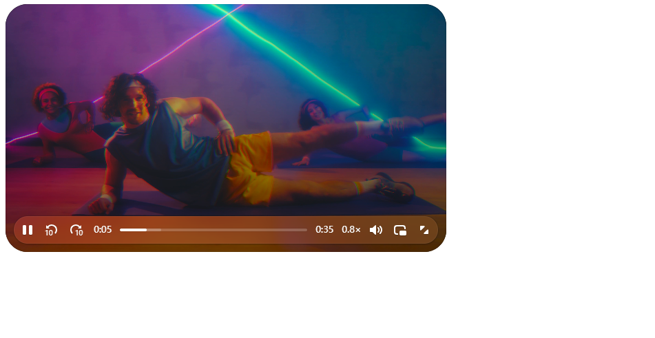

# VideoJS V10

Video.js 是一个开源 Web 视频播放器。
 自 v10 起，播放器进行了 **全面重构**，采用 **模块化 + 组件化 + Web Components** 架构，使播放器可以按需组合、按需打包。 

相比旧版本（v8），v10 主要变化：

- 不再只有 `videojs()` API
- 提供 **framework-friendly 组件**
- 支持 **Tree-shaking**
- 采用 **Composable Player**
- 构建体积更小（约 38kB vs 200kB） 

---

- [官网地址](https://videojs.org/)
- [Github](https://github.com/videojs/v10)

---


## 基础配置

**安装依赖**

```
pnpm add @videojs/html@10.0.0-beta.5
```

`@videojs/html` 提供：

- HTML Player
- Web Components
- 默认 skin
- video element wrapper


## 最简示例

```vue
<script setup lang="ts">

import '@videojs/html/video/player'
import '@videojs/html/video/skin'
import '@videojs/html/video/skin.css'

</script>

<template>
  <!-- 播放器容器 -->
  <div class="player-wrapper">

    <video-player>
      <video-skin>
        <video
            slot="media"
            src="https://stream.mux.com/BV3YZtogl89mg9VcNBhhnHm02Y34zI1nlMuMQfAbl3dM/highest.mp4"
        />
      </video-skin>
    </video-player>

  </div>
</template>

<style scoped>

.player-wrapper {
  width: 640px;
  height: 360px;
}

video-player {
  width: 100%;
  height: 100%;
}

</style>
```

| 组件           | 作用             |
| -------------- | ---------------- |
| `video-player` | 播放器容器       |
| `video-skin`   | 播放器 UI 控制层 |
| `video`        | 真实媒体元素     |
| `slot="media"` | 指定媒体内容     |



## 播放器基础属性配置

```vue
<script setup lang="ts">

import '@videojs/html/video/player'
import '@videojs/html/video/skin'
import '@videojs/html/video/skin.css'

</script>

<template>

  <div class="player-wrapper">

    <video-player>

      <video-skin>

        <video
          slot="media"
          preload="metadata"
          autoplay
          muted
          loop
          playsinline
          poster="https://peach.blender.org/wp-content/uploads/title_anouncement.jpg"
        >

          <source
            src="https://stream.mux.com/BV3YZtogl89mg9VcNBhhnHm02Y34zI1nlMuMQfAbl3dM/highest.mp4"
            type="video/mp4"
          />

        </video>

      </video-skin>

    </video-player>

  </div>

</template>

<style scoped>

.player-wrapper {
  width: 640px;
  aspect-ratio: 16 / 9;
}

video-player {
  width: 100%;
  height: 100%;
  display: block;
}

</style>
```

------

**属性说明**

| 属性          | 作用           | 常见使用场景      |
| ------------- | -------------- | ----------------- |
| `autoplay`    | 自动播放视频   | 首页 Banner 视频  |
| `muted`       | 静音播放       | 自动播放通常需要  |
| `loop`        | 循环播放       | 宣传视频          |
| `preload`     | 预加载策略     | 控制页面加载性能  |
| `poster`      | 视频封面图     | 视频未播放时显示  |
| `playsinline` | 移动端内联播放 | 避免 iOS 自动全屏 |

------

**preload 属性说明**

`preload` 控制浏览器在页面加载时的视频加载策略：

| 值         | 含义             |
| ---------- | ---------------- |
| `none`     | 不预加载视频     |
| `metadata` | 仅加载视频元数据 |
| `auto`     | 浏览器自动决定   |


## 多视频源与格式兼容

在实际项目中，不同浏览器支持的视频编码格式不同，因此通常需要提供 **多个视频源**，浏览器会自动选择可播放的格式。

HTML5 `<video>` 元素支持通过多个 `<source>` 标签声明不同格式的视频资源。

当浏览器无法播放当前格式时，会自动尝试下一个 `<source>`。

```vue
<script setup lang="ts">

import '@videojs/html/video/player'
import '@videojs/html/video/skin'
import '@videojs/html/video/skin.css'

</script>

<template>

  <div class="player-wrapper">

    <video-player>

      <video-skin>

        <video
          slot="media"
          preload="metadata"
          playsinline
          poster="https://peach.blender.org/wp-content/uploads/title_anouncement.jpg"
        >

          <!-- MP4（最常见格式） -->
          <source
            src="https://stream.mux.com/BV3YZtogl89mg9VcNBhhnHm02Y34zI1nlMuMQfAbl3dM/highest.mp4"
            type="video/mp4"
          />

          <!-- WebM 格式 -->
          <source
            src="https://interactive-examples.mdn.mozilla.net/media/cc0-videos/flower.webm"
            type="video/webm"
          />

        </video>

      </video-skin>

    </video-player>

  </div>

</template>

<style scoped>

.player-wrapper {
  width: 640px;
  aspect-ratio: 16 / 9;
}

video-player {
  width: 100%;
  height: 100%;
  display: block;
}

</style>
```

------

## 视频字幕（track）

在实际项目中，视频通常需要支持 **字幕功能**，例如：

- 教学视频字幕
- 多语言字幕
- 听障辅助字幕
- 会议记录字幕

HTML5 `<video>` 提供 `<track>` 标签用于加载字幕文件。

常见字幕格式：

- **VTT（WebVTT）** ⭐ 推荐
- SRT（需转换）
- TTML

------

**示例代码**

```vue
<script setup lang="ts">

import '@videojs/html/video/player'
import '@videojs/html/video/skin'
import '@videojs/html/video/skin.css'

</script>

<template>

  <div class="player-wrapper">

    <video-player>

      <video-skin>

        <video
          slot="media"
          preload="metadata"
          playsinline
        >

          <source
            src="https://stream.mux.com/BV3YZtogl89mg9VcNBhhnHm02Y34zI1nlMuMQfAbl3dM/highest.mp4"
            type="video/mp4"
          />

          <!-- 中文字幕 -->
          <track
            kind="subtitles"
            src="/subtitles/zh.vtt"
            srclang="zh"
            label="中文"
            default
          />

          <!-- 英文字幕 -->
          <track
            kind="subtitles"
            src="/subtitles/en.vtt"
            srclang="en"
            label="English"
          />

        </video>

      </video-skin>

    </video-player>

  </div>

</template>

<style scoped>

.player-wrapper {
  width: 640px;
  aspect-ratio: 16 / 9;
}

video-player {
  width: 100%;
  height: 100%;
  display: block;
}

</style>
```

------

**`<track>` 属性说明**

| 属性      | 作用         |
| --------- | ------------ |
| `kind`    | 字幕类型     |
| `src`     | 字幕文件地址 |
| `srclang` | 字幕语言     |
| `label`   | UI显示名称   |
| `default` | 默认启用     |

------

**kind 类型**

| 值             | 说明     |
| -------------- | -------- |
| `subtitles`    | 普通字幕 |
| `captions`     | 听障字幕 |
| `descriptions` | 音频描述 |
| `chapters`     | 视频章节 |
| `metadata`     | 元数据   |

实际项目常用：

```
subtitles
captions
```

------

**WebVTT 字幕示例**

`.vtt` 文件示例：

```text
WEBVTT

00:00:00.000 --> 00:00:03.000
欢迎来到 Video.js 教程

00:00:03.000 --> 00:00:06.000
这是字幕示例
```

结构：

```
时间 --> 时间
字幕内容
```

------

## 播放器事件监听（play / pause / ended）

Video.js v10 的 `<video>` 元素仍然是 **HTML5 原生 video**，所以支持所有标准事件：

- `play` → 播放开始
- `pause` → 播放暂停
- `ended` → 播放结束
- `timeupdate` → 播放进度更新
- `volumechange` → 音量变化
- `seeking` / `seeked` → 跳转事件

结合 Vue3 + `<video-player>`，可以通过 `@事件名` 或 `addEventListener` 来监听。

------

**示例代码**

```vue
<script setup lang="ts">

import { ref, onMounted } from 'vue'
import '@videojs/html/video/player'
import '@videojs/html/video/skin'
import '@videojs/html/video/skin.css'

const playerRef = ref<HTMLVideoElement | null>(null)
const status = ref('暂停状态')

onMounted(() => {
  if (!playerRef.value) return

  const video = playerRef.value

  video.addEventListener('play', () => {
    status.value = '播放中'
    console.log('视频开始播放')
  })

  video.addEventListener('pause', () => {
    status.value = '已暂停'
    console.log('视频已暂停')
  })

  video.addEventListener('ended', () => {
    status.value = '播放结束'
    console.log('视频播放结束')
  })

  video.addEventListener('timeupdate', () => {
    const current = video.currentTime.toFixed(1)
    const duration = video.duration.toFixed(1)
    console.log(`当前进度: ${current} / ${duration}`)
  })
})

</script>

<template>

  <div class="player-wrapper">

    <video-player>
      <video-skin>

        <video
          slot="media"
          ref="playerRef"
          preload="metadata"
          playsinline
          src="https://stream.mux.com/BV3YZtogl89mg9VcNBhhnHm02Y34zI1nlMuMQfAbl3dM/highest.mp4"
        />

      </video-skin>
    </video-player>

    <div class="player-status">
      当前状态：{{ status }}
    </div>

  </div>

</template>

<style scoped>

.player-wrapper {
  width: 640px;
  aspect-ratio: 16 / 9;
  position: relative;
}

video-player {
  width: 100%;
  height: 100%;
  display: block;
}

.player-status {
  margin-top: 8px;
  font-size: 0.875rem;
  color: #374151;
}

</style>
```

------

**属性 / 方法说明**

| 属性 / 事件   | 作用         | 场景                 |
| ------------- | ------------ | -------------------- |
| `play`        | 播放开始     | 点击播放、自动播放   |
| `pause`       | 播放暂停     | 用户点击暂停         |
| `ended`       | 播放结束     | 播放完成后触发下一集 |
| `timeupdate`  | 播放进度更新 | 显示时间、统计进度   |
| `currentTime` | 当前播放时间 | 手动跳转、进度条     |
| `duration`    | 视频总时长   | 进度条显示           |
| `volume`      | 当前音量     | 音量控制             |

------

