# VitePress

**VitePress** 是由 Vue.js 团队打造的一款**静态站点生成器（SSG）**，基于 Vite 和 Vue 3。

👉 核心定位：**写文档 / 博客 / 技术站点（极致轻量 + 超快）**

- [官网地址](https://vitejs.cn/vitepress/)
- [Markdown写法](https://vitejs.cn/vitepress/guide/markdown)


## 基础配置

**初始化项目**

```
pnpm dlx create-vite@7.1.3 my-docs --template vue-ts
cd my-docs
```

**安装 vitepress**

```
pnpm add -D vitepress@1.6.4
```

**初始化 docs**

```
pnpm vitepress init
```

交互日志

```
┌  Welcome to VitePress!
│
◇  Where should VitePress initialize the config?
│  ./docs
│
◇  Site title:
│  阿腾网站
│
◇  Site description:
│  阿腾网站描述
│
◇  Theme:
│  Default Theme
│
◇  Use TypeScript for config and theme files?
│  Yes
│
◇  Add VitePress npm scripts to package.json?
│  Yes
│
└  Done! Now run pnpm run docs:dev and start writing.
```

会自动生成：

```
.
├─ docs
│  ├─ .vitepress
│  │  └─ config.js
│  ├─ api-examples.md
│  ├─ markdown-examples.md
│  └─ index.md
└─ package.json
```

**启动项目**

```
pnpm run docs:dev
```

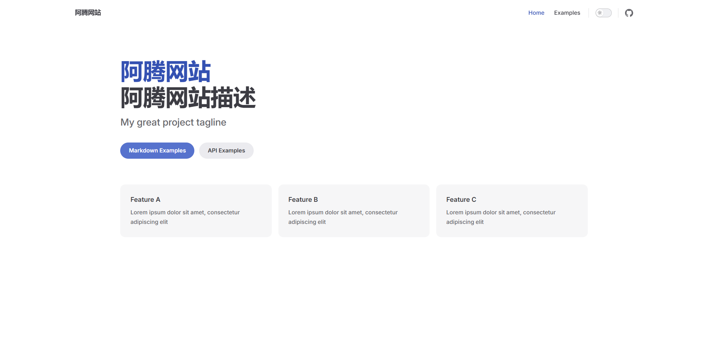

## 添加目录和文档

### 创建目录和文档

**创建目录 `docs/java`**

```
docs/
├─ java/
```

**创建入口页面 `docs/java/index.md`**

```
# Java

这里是 Java 学习笔记

## 内容
- 基础
- 集合
- 并发
```

**新增具体文章**

`docs/java/jdk8.md`

````
# JDK8 新特性

## Lambda 表达式

```java
list.forEach(item -> System.out.println(item));
```
````

`docs/java/concurrent.md`

```
# Java 并发

## 线程

- Thread
- Runnable
```


### 修改配置

修改配置文件 `.vitepress/config.ts`

**导航栏**

添加 `Java` 模块的导航栏

```
themeConfig: {
    nav: [
        {text: 'Home', link: '/'},
        {text: 'Examples', link: '/markdown-examples'},
        {text: 'Java', link: '/java/'}
    ],
}
```

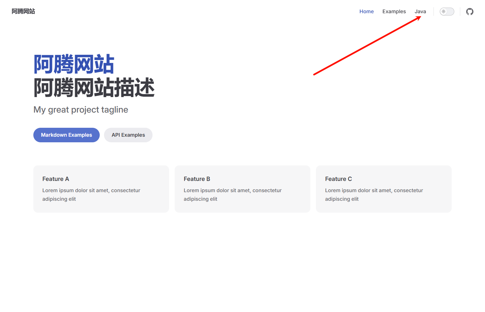

**添加侧边栏**

添加 `Java` 模块的侧边栏

```
sidebar: {
    '/java/': [
        {
            text: 'Java',
            items: [
                {text: 'JDK8', link: '/java/jdk8'},
                {text: '并发', link: '/java/concurrent'}
            ]
        },
        {
            text: 'Java_Copy',
            items: [
                {text: 'JDK8_Copy', link: '/java/jdk8'},
                {text: '并发_Copy', link: '/java/concurrent'}
            ]
        }
    ]
},
```

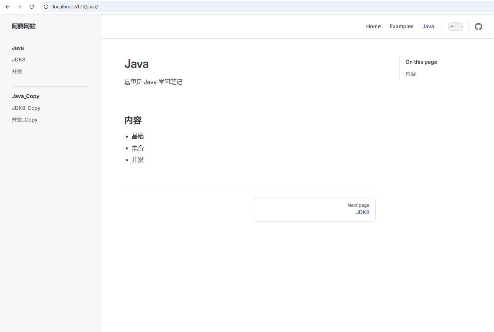

**完整的配置如下**

```ts
import {defineConfig} from 'vitepress'

// https://vitepress.dev/reference/site-config
export default defineConfig({
    title: "阿腾网站",
    description: "阿腾网站描述",
    themeConfig: {
        // https://vitepress.dev/reference/default-theme-config
        nav: [
            {text: 'Home', link: '/'},
            {text: 'Examples', link: '/markdown-examples'},
            {text: 'Java', link: '/java/'}
        ],

        sidebar: {
            '/markdown-examples': [
                {
                    text: 'Examples',
                    items: [
                        {text: 'Markdown Examples', link: '/markdown-examples'},
                        {text: 'Runtime API Examples', link: '/api-examples'}
                    ]
                }
            ],
            '/java/': [
                {
                    text: 'Java',
                    items: [
                        {text: 'JDK8', link: '/java/jdk8'},
                        {text: '并发', link: '/java/concurrent'}
                    ]
                },
                {
                    text: 'Java_Copy',
                    items: [
                        {text: 'JDK8_Copy', link: '/java/jdk8'},
                        {text: '并发_Copy', link: '/java/concurrent'}
                    ]
                }
            ]
        },

        socialLinks: [
            {icon: 'github', link: 'https://github.com/vuejs/vitepress'}
        ]
    }
})
```

---

### 修改 `index.md`

```markdown
---
# https://vitepress.dev/reference/default-theme-home-page
layout: home

hero:
  name: "阿腾技术文档"
  text: "Java · Vue · 中间件"
  tagline: 记录学习、沉淀经验、持续成长
  actions:
    - theme: brand
      text: 开始阅读
      link: /markdown-examples
    - theme: alt
      text: Java模块
      link: /java

features:
  - title: 🚀 后端
    details: Java / SpringBoot / MySQL / Redis 等技术总结
  - title: 🎨 前端
    details: Vue3 / Vite / Element Plus 实战经验
  - title: ⚙️ 中间件
    details: Redis / MQ / 分布式 / 高并发方案
---
```

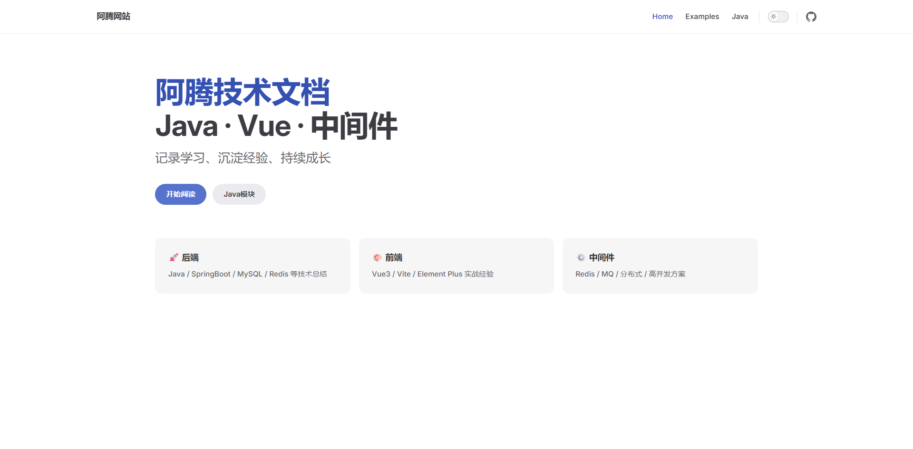

---

### 最终效果

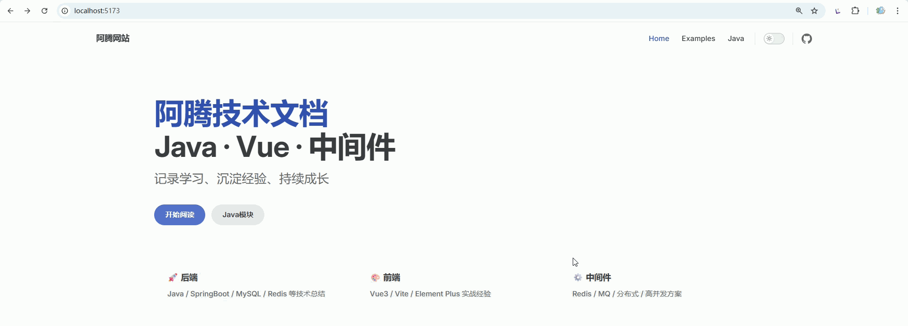

---


## 常用配置

官网配置：[链接](https://vitejs.cn/vitepress/reference/default-theme-config)

------

### 网站基础信息（必须有）

```ts
export default defineConfig({
  title: '阿腾技术文档',
  description: 'Java / Vue / 中间件学习笔记',
})
```

👉 作用：

- 浏览器标题
- SEO 描述

### base URL

站点将部署到的 base URL。如果计划在子路径例如 GitHub 页面下部署站点，则需要设置此项。如果计划将站点部署到 `https://foo.github.io/bar/`，那么应该将 `base` 设置为 `'/bar/'`。它应该始终以 `/` 开头和结尾。

```ts
export default {
  base: '/base/'
}
```

------

### 导航栏（nav）

```ts
themeConfig: {
  nav: [
    { text: '首页', link: '/' },
    { text: 'Java', link: '/java/' },
    { text: '前端', link: '/vue/' },
    { text: '关于', link: '/about' }
  ]
}
```

👉 核心作用：

- 顶部导航
- 控制模块入口

------

### 侧边栏（sidebar）【最重要】

```ts
sidebar: {
  '/java/': [
    {
      text: 'Java',
      items: [
        { text: '介绍', link: '/java/' },
        { text: 'JDK8', link: '/java/jdk8' },
        { text: '并发', link: '/java/concurrent' }
      ]
    }
  ]
}
```

👉 控制：

- 左侧菜单
- 文档结构

------

### 社交链接（右上角）

```ts
socialLinks: [
  { icon: 'github', link: 'https://github.com/xxx' }
]
```

👉 常见：

- GitHub
- Gitee

自定义 SVG（推荐）

```ts
socialLinks: [
    {
        icon: {
            svg: `<svg viewBox="0 0 100 100" xmlns="http://www.w3.org/2000/svg">
<circle cx="50" cy="50" r="30" fill="#6366f1"/>
</svg>`
        },
        link: 'https://gitee.com/xxx'
    }
]
```

------

### 页脚（footer）

```ts
footer: {
  message: 'Released under MIT License',
  copyright: 'Copyright © 2026 阿腾'
}
```

👉 放版权信息

------

### 上一页 / 下一页（Prev / Next）导航

```ts
themeConfig: {
  docFooter: {
    prev: '上一页',
    next: '下一页'
  }
}
```

---

### 编辑链接（非常实用）

```ts
editLink: {
  pattern: 'https://github.com/xxx/docs/:path',
  text: '在 GitHub 上编辑此页'
}
```

👉 每页底部会出现：

> ✏️ 编辑此页

------

### 文档目录（右侧大纲）

```ts
outline: {
  level: [2, 3],
  label: '目录'
}
```

👉 控制：

- 右侧 TOC（Table of Contents）
- 显示 h2 / h3

```
outline: 'deep'   // h2 ~ h6 全部显示
```

------

### 搜索（默认就有）

```ts
search: {
  provider: 'local'
}
```

👉 VitePress 内置本地搜索（够用了）

------

### 最后更新时间（Git）

```ts
lastUpdated: {
  text: '最后更新',
  formatOptions: {
    dateStyle: 'short',
    timeStyle: 'short' // short medium
  }
}
```

👉 页面会显示：

> Last updated: xxxx

------

### 侧边栏折叠

```ts
sidebarMenuLabel: '菜单'
```

------

### 代码块复制按钮（默认有）

👉 不用配置，但你要知道：
```java
System.out.println("Hello");
👉 会自动带复制按钮
```

### Markdown增强（稍微进阶）

和 themeConfig 配置同级

```ts
markdown: {
  lineNumbers: true
}
```

👉 代码行号：

```java
1  public class Test {}
```


### logo（网站 Logo）

文件放在 `docs/public/` 目录下

```ts
themeConfig: {
  logo: '/logo.png'
}
```

👉 显示在左上角
👉 支持深色模式：

```ts
logo: {
  light: '/logo-light.png',
  dark: '/logo-dark.png'
}
```

📌 官网明确支持 ([VitePress](https://vitepress.dev/reference/default-theme-config.html?utm_source=chatgpt.com))

------

### siteTitle（控制标题显示）

```ts
siteTitle: '阿腾文档'
```

👉 或者隐藏：

```ts
siteTitle: false
```

👉 用 logo 替代文字

------

### aside（右侧目录位置）

```ts
aside: true        // 默认右侧
aside: 'left'      // 左侧
aside: false       // 关闭
```

📌 控制右边“目录栏” ([VitePress](https://vitepress.dev/reference/default-theme-config?utm_source=chatgpt.com))

------

### sidebar 折叠（很实用）

```ts
sidebar: {
  '/java/': [
    {
      text: 'Java',
      collapsed: true, // 默认折叠
      items: [...]
    }
  ]
}
```

📌 官方支持 `collapsed` ([VitePress](https://vitepress.dev/reference/default-theme-config?utm_source=chatgpt.com))

------

### externalLinkIcon（外链图标）

```ts
externalLinkIcon: true
```

👉 Markdown 中外链显示小图标

------

### 导航与主题相关配置

```ts
themeConfig: {
    langMenuLabel: '多语言',
    returnToTopLabel: '回到顶部',
    sidebarMenuLabel: '菜单',
    darkModeSwitchLabel: '主题',
    lightModeSwitchTitle: '切换到浅色模式',
    darkModeSwitchTitle: '切换到深色模式'
}
```

### 404 页面定制

```
themeConfig: {
  notFound: {
    code: '404',
    title: '页面未找到',
    quote: '您访问的页面不存在',
    linkLabel: '返回首页',
    linkText: '点击这里返回主页'
  }
}
```


------


## 首页配置

`docs/index.md`

```markdown
---
layout: home

hero:
  name: "阿腾技术文档"
  text: "Java · Vue · 中间件"
  tagline: 记录学习、沉淀经验、持续成长
  image:
    src: /logo.svg
    alt: logo
    width: 400
    height: 400
  actions:
    - theme: brand
      text: 🚀 开始阅读
      link: /java/
    - theme: alt
      text: 🎨 前端模块
      link: /vue/

features:
  - title: 🚀 后端
    details: Java / SpringBoot / MySQL / Redis 等技术总结
    link: /java/

  - title: 🎨 前端
    details: Vue3 / Vite / Element Plus 实战经验
    link: /vue/

  - title: ⚙️ 中间件
    details: Redis / MQ / 分布式 / 高并发方案
    link: /middleware/
---

## 📚 快速导航

### 🚀 后端
- 👉 [Java 基础](/java/)
- 👉 [JDK8 新特性](/java/jdk8)
- 👉 [并发编程](/java/concurrent)

### 🎨 前端
- 👉 [Vue3 入门](/vue/)
- 👉 [响应式原理](/vue/reactivity)
- 👉 [Vue Router](/vue/router)

### ⚙️ 中间件
- 👉 [Redis](/middleware/redis)
- 👉 [消息队列](/middleware/mq)
- 👉 [分布式](/middleware/distributed)

---

## 🔥 最近更新

- 🆕 [JDK8 新特性](/java/jdk8)
- 🆕 [Vue3 响应式原理](/vue/reactivity)
- 🆕 [Redis 基础](/middleware/redis)

---

## ✨ 关于本站

这是一个用于记录技术成长的文档站点，涵盖：

- 后端：Java / Spring / 数据库
- 前端：Vue3 / Vite / UI 框架
- 架构：中间件 / 分布式 / 高并发

👉 持续更新中...
```

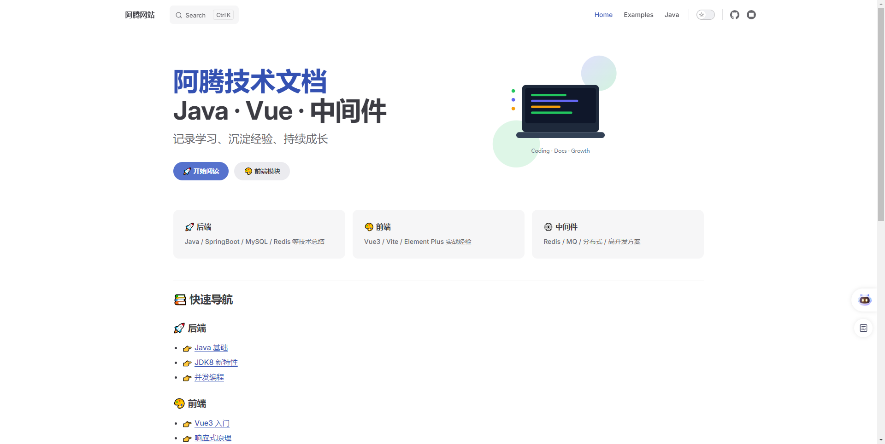


---


## 集成 Element Plus

### 安装依赖和配置

**安装依赖**

安装 Element Plus

```
pnpm add element-plus@2.13.0 @element-plus/icons-vue@2.3.2
```

安装 Sass

```
pnpm add -D sass@1.97.3
```

**扩展 VitePress 主题（.vitepress/theme/index.ts）**

```ts
import DefaultTheme from 'vitepress/theme'
import ElementPlus from 'element-plus'
import 'element-plus/dist/index.css'
import zhCn from 'element-plus/es/locale/lang/zh-cn'
import * as ElementPlusIconsVue from '@element-plus/icons-vue'

export default {
    ...DefaultTheme,
    enhanceApp({ app }) {
        app.use(ElementPlus, {
            locale: zhCn,
        })
        for (const [key, component] of Object.entries(ElementPlusIconsVue)) {
            app.component(key, component)
        }
    }
}
```

**按需引入**

安装插件

```
pnpm add -D unplugin-vue-components@30.0.0 unplugin-auto-import@20.3.0
```

配置vite.config.ts

```ts
import { defineConfig } from 'vite'
import AutoImport from 'unplugin-auto-import/vite'
import Components from 'unplugin-vue-components/vite'
import { ElementPlusResolver } from 'unplugin-vue-components/resolvers'

export default defineConfig({
  // ...
  plugins: [
    // ...
    AutoImport({
      resolvers: [ElementPlusResolver()],
    }),
    Components({
      resolvers: [ElementPlusResolver()],
    }),
  ],
})
```

### 使用示例

**在 Markdown 中直接用 Vue + Element Plus**

~~~markdown
# JDK8 新特性

## Lambda 表达式

```java
list.forEach(item -> System.out.println(item));
```

<script setup lang="ts">
import { ref } from 'vue'

const count = ref(0)
</script>

<el-button type="primary" @click="count++">
点击次数：{{ count }}
</el-button>
~~~

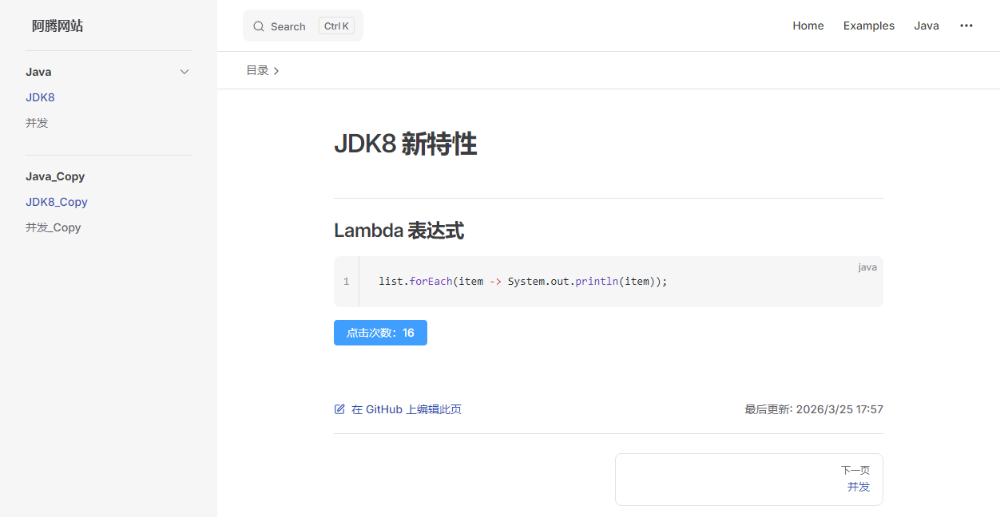

**混合内容示例**

```markdown
# 混合内容示例

## 动态列表 + 过渡动画

<script setup>
import { ref } from 'vue'

const list = ref(['Vue', 'VitePress', 'Element Plus'])

const addItem = () => {
  list.value.push('New Item ' + Date.now())
}
</script>

<div class="list-box">
  <el-button type="primary" @click="addItem">
    添加
  </el-button>
  
  <transition-group name="fade">
    <div v-for="item in list" :key="item" class="item">
      {{ item }}
    </div>
  </transition-group>
</div>

<style lang="scss">
.list-box {
  margin-top: 20px;

  .item {
    padding: 10px;
    margin-top: 10px;
    background: #f5f7fa;
    border-radius: 6px;
  }
}

.fade-enter-active,
.fade-leave-active {
  transition: all 0.3s;
}
.fade-enter-from {
  opacity: 0;
  transform: translateY(10px);
}
.fade-leave-to {
  opacity: 0;
  transform: translateY(-10px);
}
</style>
```

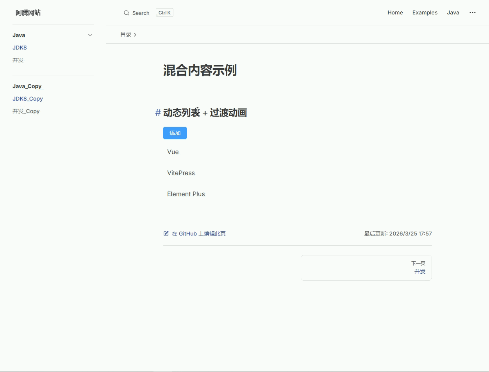


## 集成 Antdv Next

### 安装依赖和配置

**安装依赖**

安装 Antdv Next

```
pnpm add antdv-next@1.1.0
```

安装 Sass

```
pnpm add -D sass@1.97.3
```

**扩展 VitePress 主题（.vitepress/theme/index.ts）**

```ts
import DefaultTheme from 'vitepress/theme'
import AntdvNext from 'antdv-next'

export default {
    ...DefaultTheme,
    enhanceApp({ app }) {
        app.use(AntdvNext)
    }
}
```

**按需引入**

安装插件

```
pnpm add -D @antdv-next/auto-import-resolver unplugin-vue-components@30.0.0 unplugin-auto-import@20.3.0
```

配置vite.config.ts

```ts
import { defineConfig } from 'vite'
import AutoImport from 'unplugin-auto-import/vite'
import Components from 'unplugin-vue-components/vite'
import { AntdvNextResolver } from '@antdv-next/auto-import-resolver'

export default defineConfig({
  // ...
  plugins: [
    // ...
    AutoImport({
      resolvers: [AntdvNextResolver()]
    }),
    Components({
      resolvers: [AntdvNextResolver()]
    })
  ],
})
```

### 使用示例

**在 Markdown 中直接用 Vue + Element Plus**

~~~markdown
# JDK8 新特性

## Lambda 表达式

```java
list.forEach(item -> System.out.println(item));
```

<script setup lang="ts">
import { ref } from 'vue'

const count = ref(0)
</script>

<a-button type="primary" @click="count++">
点击次数：{{ count }}
</a-button>
~~~


**混合内容示例**

```markdown
# 混合内容示例

## 动态列表 + 过渡动画

<script setup>
import { ref } from 'vue'

const list = ref(['Vue', 'VitePress', 'Element Plus'])

const addItem = () => {
  list.value.push('New Item ' + Date.now())
}
</script>

<div class="list-box">
  <a-button type="primary" @click="addItem">
    添加
  </a-button>
  
  <transition-group name="fade">
    <div v-for="item in list" :key="item" class="item">
      {{ item }}
    </div>
  </transition-group>
</div>

<style lang="scss">
.list-box {
  margin-top: 20px;

  .item {
    padding: 10px;
    margin-top: 10px;
    background: #f5f7fa;
    border-radius: 6px;
  }
}

.fade-enter-active,
.fade-leave-active {
  transition: all 0.3s;
}
.fade-enter-from {
  opacity: 0;
  transform: translateY(10px);
}
.fade-leave-to {
  opacity: 0;
  transform: translateY(-10px);
}
</style>
```


## 部署 GitHub Pages

### 创建部署文件

在项目的 `.github/workflows` 目录中创建一个名为 `deploy.yml` 的文件，其中包含这样的内容：

```yaml
name: Deploy VitePress to GitHub Pages

on:
  push:
    branches: [main]
  workflow_dispatch:

permissions:
  contents: read
  pages: write
  id-token: write

concurrency:
  group: vitepress-pages
  cancel-in-progress: true

jobs:
  build:
    runs-on: ubuntu-latest

    steps:
      - name: Checkout
        uses: actions/checkout@v4
        with:
          fetch-depth: 0

      # 安装 pnpm
      - name: Setup pnpm
        uses: pnpm/action-setup@v3
        with:
          version: 8

      # Node + pnpm缓存
      - name: Setup Node
        uses: actions/setup-node@v4
        with:
          node-version: 20
          cache: pnpm

      - name: Setup Pages
        uses: actions/configure-pages@v4

      # 安装依赖
      - name: Install dependencies
        run: pnpm install

      # 构建
      - name: Build VitePress
        run: pnpm docs:build

      - name: Upload artifact
        uses: actions/upload-pages-artifact@v3
        with:
          path: docs/.vitepress/dist

  deploy:
    needs: build
    runs-on: ubuntu-latest

    environment:
      name: github-pages
      url: ${{ steps.deployment.outputs.page_url }}

    steps:
      - name: Deploy
        id: deployment
        uses: actions/deploy-pages@v4
```

- **分支**：当前只部署 `main` 分支，其他分支不会触发。
- **Node / pnpm 版本**：GitHub Actions 的版本要和本地一致，否则可能构建失败。
- **dist 目录**：确保 `docs/.vitepress/dist` 路径正确，和项目结构匹配。
- **依赖缓存**：使用 `pnpm` 缓存时，确保有 `pnpm-lock.yaml`，否则 `--frozen-lockfile` 会报错。
- **自定义域 / base URL**：VitePress 配置需要同步修改，否则页面路径可能错。
- **多文档 / 多分支**：如有测试分支或多个文档目录，需要单独配置 job 或 path。

### GitHub Pages 设置

构建和部署选择 `GitHub Actions`

`Settings` → `Pages` → `Build and deployment`  → `GitHub Actions`

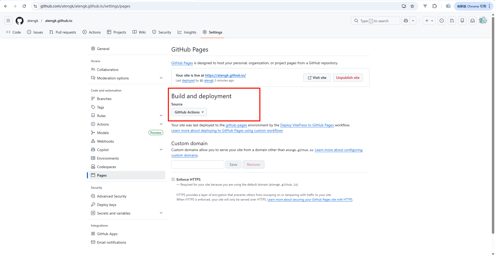

当推送代码到指定分支时，自动拉取代码、安装依赖、构建 VitePress，并将生成的静态文件部署到 GitHub Pages

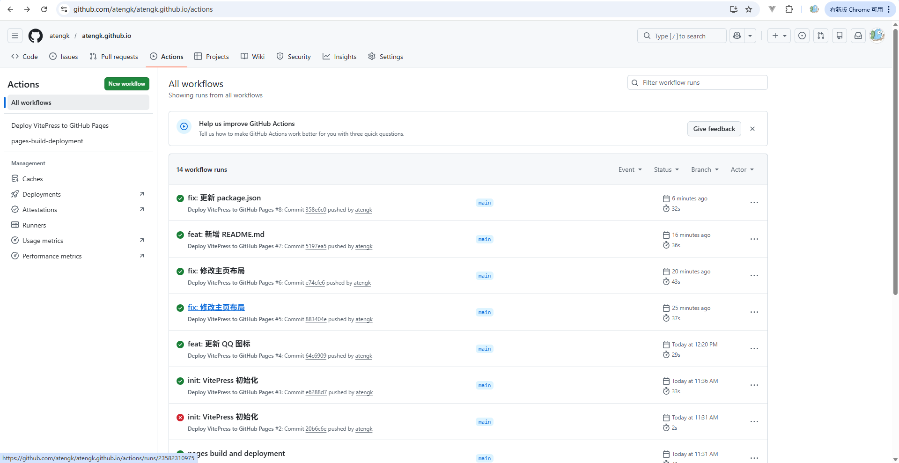

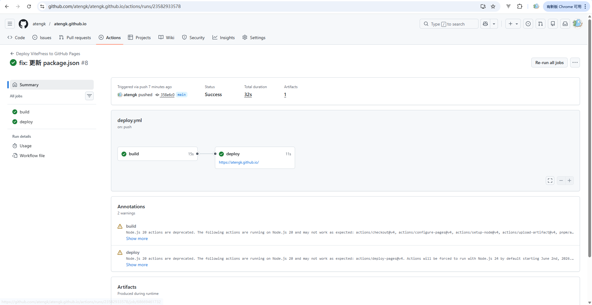
