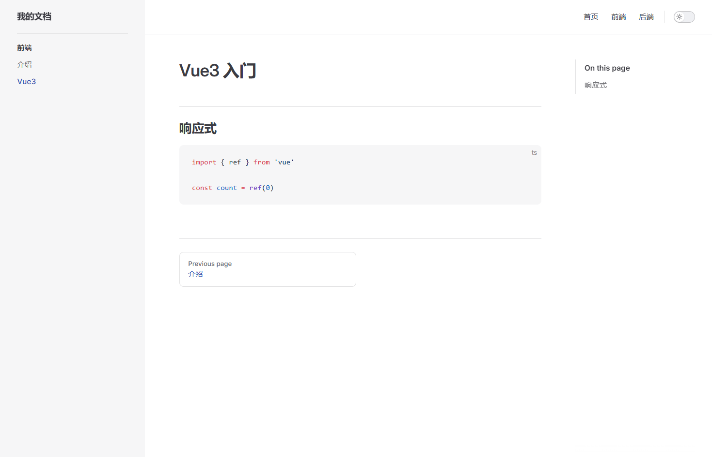

# VitePress

**VitePress** 是由 Vue.js 团队打造的一款**静态站点生成器（SSG）**，基于 Vite 和 Vue 3。

👉 核心定位：**写文档 / 博客 / 技术站点（极致轻量 + 超快）**

- [官网地址](https://vitejs.cn/vitepress/)
- [Markdown写法](https://vitejs.cn/vitepress/guide/markdown)


## 基础配置

**初始化项目**

```
pnpm dlx create-vite@7.1.3 my-docs --template vue-ts
cd my-docs
```

**安装 vitepress**

```
pnpm add -D vitepress@1.6.4
```

**初始化 docs**

```
pnpm vitepress init
```

交互日志

```
┌  Welcome to VitePress!
│
◇  Where should VitePress initialize the config?
│  ./docs
│
◇  Site title:
│  阿腾网站
│
◇  Site description:
│  阿腾网站描述
│
◇  Theme:
│  Default Theme
│
◇  Use TypeScript for config and theme files?
│  Yes
│
◇  Add VitePress npm scripts to package.json?
│  Yes
│
└  Done! Now run pnpm run docs:dev and start writing.
```

会自动生成：

```
.
├─ docs
│  ├─ .vitepress
│  │  └─ config.js
│  ├─ api-examples.md
│  ├─ markdown-examples.md
│  └─ index.md
└─ package.json
```

**启动项目**

```
pnpm run docs:dev
```


## 添加目录和文档

### 创建目录和文档

**创建目录 `docs/java`**

```
docs/
├─ java/
```

**创建入口页面 `docs/java/index.md`**

```
# Java

这里是 Java 学习笔记

## 内容
- 基础
- 集合
- 并发
```

**新增具体文章**

`docs/java/jdk8.md`

````
# JDK8 新特性

## Lambda 表达式

```java
list.forEach(item -> System.out.println(item));
```
````

`docs/java/concurrent.md`

```
# Java 并发

## 线程

- Thread
- Runnable
```


### 修改配置

修改配置文件 `.vitepress/config.ts`

**导航栏**

添加 `Java` 模块的导航栏

```
themeConfig: {
    nav: [
        {text: 'Home', link: '/'},
        {text: 'Examples', link: '/markdown-examples'},
        {text: 'Java', link: '/java/'}
    ],
}
```


**添加侧边栏**

添加 `Java` 模块的侧边栏

```
sidebar: {
    '/java/': [
        {
            text: 'Java',
            items: [
                {text: 'JDK8', link: '/java/jdk8'},
                {text: '并发', link: '/java/concurrent'}
            ]
        },
        {
            text: 'Java_Copy',
            items: [
                {text: 'JDK8_Copy', link: '/java/jdk8'},
                {text: '并发_Copy', link: '/java/concurrent'}
            ]
        }
    ]
},
```


**完整的配置如下**

```ts
import {defineConfig} from 'vitepress'

// https://vitepress.dev/reference/site-config
export default defineConfig({
    title: "阿腾网站",
    description: "阿腾网站描述",
    themeConfig: {
        // https://vitepress.dev/reference/default-theme-config
        nav: [
            {text: 'Home', link: '/'},
            {text: 'Examples', link: '/markdown-examples'},
            {text: 'Java', link: '/java/'}
        ],

        sidebar: {
            '/markdown-examples': [
                {
                    text: 'Examples',
                    items: [
                        {text: 'Markdown Examples', link: '/markdown-examples'},
                        {text: 'Runtime API Examples', link: '/api-examples'}
                    ]
                }
            ],
            '/java/': [
                {
                    text: 'Java',
                    items: [
                        {text: 'JDK8', link: '/java/jdk8'},
                        {text: '并发', link: '/java/concurrent'}
                    ]
                },
                {
                    text: 'Java_Copy',
                    items: [
                        {text: 'JDK8_Copy', link: '/java/jdk8'},
                        {text: '并发_Copy', link: '/java/concurrent'}
                    ]
                }
            ]
        },

        socialLinks: [
            {icon: 'github', link: 'https://github.com/vuejs/vitepress'}
        ]
    }
})
```

---

### 修改 `index.md`

```markdown
---
# https://vitepress.dev/reference/default-theme-home-page
layout: home

hero:
  name: "阿腾技术文档"
  text: "Java · Vue · 中间件"
  tagline: 记录学习、沉淀经验、持续成长
  actions:
    - theme: brand
      text: 开始阅读
      link: /markdown-examples
    - theme: alt
      text: Java模块
      link: /java

features:
  - title: 🚀 后端
    details: Java / SpringBoot / MySQL / Redis 等技术总结
  - title: 🎨 前端
    details: Vue3 / Vite / Element Plus 实战经验
  - title: ⚙️ 中间件
    details: Redis / MQ / 分布式 / 高并发方案
---
```


---

### 最终效果


---


## 编辑文章

### 第一步：先把首页改成你自己的（必须做）

打开：

```md
docs/index.md
```

改成这样👇（最简单实用版本）

```md
# 🚀 我的技术文档

欢迎来到我的 VitePress 网站！

## 📚 内容

- Java 后端
- Vue3 前端
- 中间件
- 实战项目

## 🔥 快速开始

👉 点击左侧菜单开始阅读
```

👉 保存后浏览器自动刷新

------

### 第二步：配置导航栏（顶部菜单）

打开：

```ts
docs/.vitepress/config.ts
```

找到 `themeConfig`，改成👇

```ts
import { defineConfig } from 'vitepress'

export default defineConfig({
  title: '我的文档',
  description: '学习笔记',

  themeConfig: {
    nav: [
      { text: '首页', link: '/' },
      { text: '前端', link: '/frontend/' },
      { text: '后端', link: '/backend/' }
    ]
  }
})
```

------

### 第三步：创建页面目录（核心）

在 `docs` 下新建结构：

```bash
docs/
├─ frontend/
│  └─ index.md
├─ backend/
│  └─ index.md
```

frontend/index.md

```md
# 前端

## Vue3
- 组合式 API
- 路由

## UI
- Element Plus
```

backend/index.md

```md
# 后端

## Java
- JDK8
- 并发

## 数据库
- MySQL
- Redis
```

------

### 第四步：配置侧边栏（重点）

继续改 `config.ts`：

```ts
themeConfig: {
  nav: [
    { text: '首页', link: '/' },
    { text: '前端', link: '/frontend/' },
    { text: '后端', link: '/backend/' }
  ],

  sidebar: {
    '/frontend/': [
      {
        text: '前端',
        items: [
          { text: '介绍', link: '/frontend/' }
        ]
      }
    ],
    '/backend/': [
      {
        text: '后端',
        items: [
          { text: '介绍', link: '/backend/' }
        ]
      }
    ]
  }
}
```

------

### 第五步：新增文章（你真正要做的事）

比如你要写 Vue3：

新建：

```bash
docs/frontend/vue3.md
```

内容：

~~~md
# Vue3 入门

## 响应式

```ts
import { ref } from 'vue'

const count = ref(0)
```
~~~

然后在 sidebar 加：

```
{
  text: 'Vue3',
  link: '/frontend/vue3'
}
```



------

