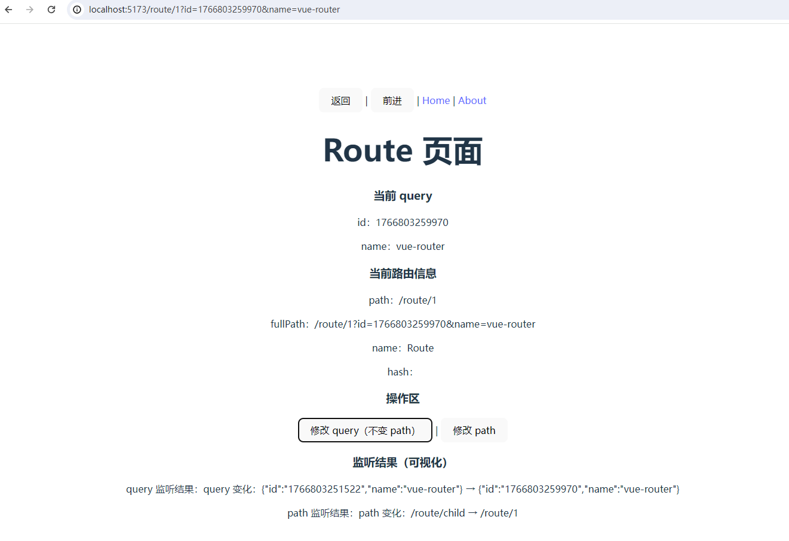

# Vue Router

Vue Router 是 Vue 3 官方提供的路由管理方案，用于构建单页面应用（SPA）。它通过 URL 与组件的映射关系，实现页面切换而无需整页刷新，提升用户体验与应用性能。

在 Vue 3 中，Vue Router 4 基于组合式 API 设计，支持动态路由、嵌套路由、路由守卫与懒加载，便于构建复杂且可维护的前端应用架构。

官网地址：https://router.vuejs.org/zh/

## 创建应用

按照首页工程化创建应用：apps/vue-router


## 基础配置

安装 vue-router 包

```
pnpm add vue-router@4.6.4 --filter @apps/vue-router
```

配置 main.ts

```typescript
import {createApp} from 'vue'
import './style.css'
import App from './App.vue'
import router from './router'

const app = createApp(App)

app.use(router)

app.mount('#app')
```

目录结构（实际项目开发可供参考）

```
src/
├─ router/
│  ├─ index.ts                 # 创建 Router 实例
│  ├─ routes/
│  │  ├─ static/
│  │  │  ├─ auth.ts            # 登录 / 注册 路由
│  │  │  ├─ error.ts           # 404 / 403 错误页路由
│  │  │  └─ index.ts           # 静态路由汇总出口
│  │  ├─ dynamic/
│  │  │  ├─ dashboard.ts       # 工作台 / 首页模块路由
│  │  │  ├─ system.ts          # 系统管理模块路由
│  │  │  ├─ report.ts          # 报表模块路由
│  │  │  └─ index.ts           # 动态路由汇总出口
│  │  └─ index.ts              # 路由总汇（static + dynamic）
│  └─ guard/
│     └─ permission.ts         # 路由守卫（登录态 / 权限校验）
│
├─ views/
│  ├─ dashboard/
│  │  └─ index.vue             # 工作台页面
│  ├─ user/
│  │  └─ index.vue             # 用户页面
│  ├─ system/
│  │  └─ index.vue             # 系统管理页面
│  └─ error/
│     └─ 404.vue               # 404 页面
│
├─ layout/
│  └─ index.vue                # 系统基础布局（Layout 外壳）
│
├─ components/
│  ├─ layout/
│  │  ├─ AppHeader.vue         # 顶部栏组件
│  │  ├─ AppSidebar.vue        # 侧边菜单组件
│  │  ├─ AppBreadcrumb.vue     # 面包屑组件（基于路由 meta）
│  │  └─ AppTabs.vue           # 多页签组件
│  ├─ common/
│  │  ├─ SvgIcon.vue           # 通用 SVG 图标
│  │  ├─ PageHeader.vue        # 页面通用头部组件
│  │  └─ Empty.vue             # 空状态组件
│  └─ index.ts                 # 公共组件统一导出
│
├─ App.vue                     # 根组件
└─ main.ts                     # 应用入口
```


## 路由跳转

### 创建路由

```typescript
// router/index.ts
import {createRouter, createWebHistory, type RouteRecordRaw} from 'vue-router'

const routes: RouteRecordRaw[] = [
    {
        name: 'Home',
        path: '/',
        component: () => import('@/views/Home.vue')
    },
    {
        name: 'About',
        path: '/about',
        component: () => import('@/views/About.vue')
    }
]

export default createRouter({
    history: createWebHistory(),
    routes
})
```

### 创建页面

#### Home.vue

src/views/Home.vue

```vue
<script setup lang="ts">
import {useRouter} from 'vue-router'

const router = useRouter()

function goAbout() {
  router.push('/about')
  /*router.push({
    name: 'About'
  })*/
}

function replaceAbout() {
  router.replace('/about')
  /*router.push({
    name: 'About',
    replace: true
  })*/
}

</script>

<template>
  <h1>Home 页面</h1>
  <button @click="goAbout">去 About</button>
  |
  <button @click="replaceAbout">
    replace 跳转 About
  </button>
</template>
```

#### About.vue

src/views/About.vue

```vue
<script setup lang="ts">
import { useRouter } from 'vue-router'

const router = useRouter()

function goHome() {
  router.push('/')
  /*router.push({
    name: 'Home'
  })*/
}
</script>

<template>
  <h1>About 页面</h1>
  <button @click="goHome">去 Home</button>
</template>
```

### 配置 App.vue

```vue
<script setup lang="ts">
import { useRouter } from 'vue-router'

const router = useRouter()

/**
 * 全局返回
 */
function handleBack() {
  router.back()
}

/**
 * 全局前进
 */
function handleForward() {
  router.go(1)
}
</script>

<template>
  <nav>
    <button @click="handleBack">
      返回
    </button>
    |
    <button @click="handleForward">
      前进
    </button>
    |
    <router-link to="/">Home</router-link> |
    <router-link to="/about">About</router-link>
  </nav>

  <router-view />
</template>
```


## 带Query参数跳转

### 添加路由

添加 Detail 路由

```typescript
// router/index.ts
import {createRouter, createWebHistory, type RouteRecordRaw} from 'vue-router'

const routes: RouteRecordRaw[] = [
    {
        name: 'Home',
        path: '/',
        component: () => import('@/views/Home.vue')
    },
    {
        name: 'About',
        path: '/about',
        component: () => import('@/views/About.vue')
    },
    {
        name: 'Detail',
        path: '/detail',
        component: () => import('@/views/Detail.vue')
    }
]

export default createRouter({
    history: createWebHistory(),
    routes
})
```

### 创建 Detail 页面

```vue
<script setup lang="ts">
import { computed } from 'vue'
import { useRoute } from 'vue-router'

interface DetailQuery {
  id?: string
  name?: string
}

const route = useRoute()

const query = route.query as DetailQuery

const id = computed<string>(() => query.id ?? '')
const name = computed<string>(() => query.name ?? '')
</script>

<template>
  <h1>Detail 页面</h1>

  <p>id：{{ id }}</p>
  <p>name：{{ name }}</p>
</template>
```

### 修改 Home 页面

```vue
<script setup lang="ts">
import {useRouter} from 'vue-router'
import {ref} from "vue";

const router = useRouter()

const id = ref<string>('')
const name = ref<string>('')

function goAbout() {
  router.push('/about')
  /*router.push({
    name: 'About'
  })*/
}

function replaceAbout() {
  router.replace('/about')
  /*router.push({
    name: 'About',
    replace: true
  })*/
}

function goDetail(): void {
  router.push({
    name: 'Detail',
    query: {
      id: id.value,
      name: name.value
    }
  })
}

</script>

<template>
  <h1>Home 页面</h1>
  <div>
    <input v-model="id" placeholder="请输入 id" />
    <input v-model="name" placeholder="请输入 name" />
    <button @click="goDetail">
      去 Detail（带参数）
    </button>
  </div>

  <hr />

  <button @click="goAbout">去 About</button>
  |
  <button @click="replaceAbout">
    replace 跳转 About
  </button>
</template>
```

### 路由跳转

路由跳转后页面链接：http://localhost:5173/detail?id=17623062936&name=ateng

## 带Params参数跳转

### 添加路由

添加 DetailById 路由

- `:id` 是 **params 占位符**
- 没有 `id`，这个路由就无法匹配

```typescript
// router/index.ts
import {createRouter, createWebHistory, type RouteRecordRaw} from 'vue-router'

const routes: RouteRecordRaw[] = [
    {
        name: 'Home',
        path: '/',
        component: () => import('@/views/Home.vue')
    },
    {
        name: 'About',
        path: '/about',
        component: () => import('@/views/About.vue')
    },
    {
        name: 'Detail',
        path: '/detail',
        component: () => import('@/views/Detail.vue')
    },
    {
        name: 'DetailById',
        path: '/detail/:id',
        component: () => import('@/views/DetailById.vue'),
        beforeEnter: (to) => {
            const {id} = to.params

            if (typeof id !== 'string') {
                return {name: 'Detail'}
            }

            const isNumber = /^\d+$/.test(id)
            if (!isNumber) {
                return {name: 'Detail'}
            }

            return true
        }
    }
]

export default createRouter({
    history: createWebHistory(),
    routes
})
```

### 创建 DetailById 页面

```vue
<script setup lang="ts">
import {computed} from 'vue'
import {useRoute} from 'vue-router'

const route = useRoute()

const id = computed<string>(() => {
  const param = route.params.id
  return typeof param === 'string' ? param : ''
})
</script>

<template>
  <h1>DetailById 页面（params）</h1>

  <p>当前 id：{{ id }}</p>
</template>
```

### 修改 Home 页面

```vue
<script setup lang="ts">
import {useRouter} from 'vue-router'
import {ref} from "vue";

const router = useRouter()

const id = ref<string>('')
const name = ref<string>('')

function goAbout() {
  router.push('/about')
  /*router.push({
    name: 'About'
  })*/
}

function replaceAbout() {
  router.replace('/about')
  /*router.push({
    name: 'About',
    replace: true
  })*/
}

function goDetail(): void {
  router.push({
    name: 'Detail',
    query: {
      id: id.value,
      name: name.value
    }
  })
}

const detailId = ref<string>('')

function goDetailById(): void {
  if (!detailId.value) {
    return
  }
  router.push({
    name: 'DetailById',
    params: {
      id: detailId.value
    }
  })
}

</script>

<template>
  <h1>Home 页面</h1>

  <div>
    <input v-model="detailId" placeholder="请输入 detail id"/>
    <button @click="goDetailById">
      去 DetailById（params）
    </button>
  </div>

  <div>
    <input v-model="id" placeholder="请输入 id"/>
    <input v-model="name" placeholder="请输入 name"/>
    <button @click="goDetail">
      去 Detail（带参数）
    </button>
  </div>

  <hr/>

  <button @click="goAbout">去 About</button>
  |
  <button @click="replaceAbout">
    replace 跳转 About
  </button>
</template>
```

### 路由跳转

路由跳转后页面链接：http://localhost:5173/detail/17623062936


## Route的使用

### 添加路由

```typescript
// router/index.ts
import {createRouter, createWebHistory, type RouteRecordRaw} from 'vue-router'

const routes: RouteRecordRaw[] = [
    {
        name: 'Home',
        path: '/',
        component: () => import('@/views/Home.vue')
    },
    // ...
    {
        name: 'Route',
        path: '/route/:id',
        component: () => import('@/views/Route.vue'),
        meta: {
            title: '详情页',
            requireAuth: true,
            showBack: true
        }
    }
]

export default createRouter({
    history: createWebHistory(),
    routes
})
```

### 创建 Route 页面

```vue
<script setup lang="ts">
import { computed } from 'vue'
import { useRoute } from 'vue-router'

interface DetailQuery {
  id?: string
  name?: string
}

const route = useRoute()

const query = route.query as DetailQuery

const id = computed<string>(() => query.id ?? '')
const name = computed<string>(() => query.name ?? '')
</script>

<template>
  <h1>Route 页面</h1>

  <p>id：{{ id }}</p>
  <p>name：{{ name }}</p>

  <p>path：{{ route.path }}</p>
  <p>fullPath：{{ route.fullPath }}</p>
  <p>name：{{ route.name }}</p>
  <p>hash：{{ route.hash }}</p>
  <p>meta.title：{{ route.meta.title }}</p>
  <p>meta.showBack：{{ route.meta.showBack }}</p>

</template>
```

### 修改 Home 页面

```vue
<script setup lang="ts">
// ..
function goRoute(): void {
  router.push({
    name: 'Route',
    query: {
      id: id.value,
      name: name.value
    },
    params: {
      id: detailId.value
    },
    hash: '#ateng'
  })
}

<template>
    
</script>

  <div>
    <input v-model="detailId" placeholder="请输入 detail id"/>
    <input v-model="id" placeholder="请输入 id"/>
    <input v-model="name" placeholder="请输入 name"/>
    <button @click="goRoute">
      去 Route
    </button>
  </div>

  <hr/>

</template>
```

### 路由跳转

路由跳转后页面链接：http://localhost:5173/route/1?id=1&name=1#ateng


## watch 的使用

### 添加路由

```typescript
// router/index.ts
import {createRouter, createWebHistory, type RouteRecordRaw} from 'vue-router'

const routes: RouteRecordRaw[] = [
    {
        name: 'Home',
        path: '/',
        component: () => import('@/views/Home.vue')
    },
    // ...
    {
        name: 'Route',
        path: '/route/:id',
        component: () => import('@/views/Route.vue'),
        meta: {
            title: '详情页',
            requireAuth: true,
            showBack: true
        }
    },
    {
        path: '/route/child',
        component: () => import('@/views/Route.vue')
    }
]

export default createRouter({
    history: createWebHistory(),
    routes
})
```

### 设置 Route 页面

```vue
<script setup lang="ts">
import {computed, ref, watch} from 'vue'
import {useRoute, useRouter} from 'vue-router'

const route = useRoute()
const router = useRouter()

/**
 * =============================
 * query（响应式读取）
 * =============================
 */
const id = computed<string>(() => {
  const value = route.query.id
  return typeof value === 'string' ? value : ''
})

const name = computed<string>(() => {
  const value = route.query.name
  return typeof value === 'string' ? value : ''
})

/**
 * =============================
 * 页面可见的监听结果
 * =============================
 */
const queryLog = ref<string>('')
const pathLog = ref<string>('')

/**
 * 监听 query 变化
 */
watch(
    () => route.query,
    (newQuery, oldQuery) => {
      queryLog.value = `query 变化：${JSON.stringify(oldQuery)} → ${JSON.stringify(newQuery)}`
      console.log(queryLog.value)
    }
)

/**
 * 监听 path 变化
 */
watch(
    () => route.path,
    (newPath, oldPath) => {
      pathLog.value = `path 变化：${oldPath} → ${newPath}`
      console.log(pathLog.value)
    }
)

/**
 * =============================
 * 操作按钮（制造变化）
 * =============================
 */

/**
 * 修改 query（不换页面）
 */
function changeQuery(): void {
  router.push({
    path: route.path,
    query: {
      id: String(Date.now()),
      name: 'vue-router'
    }
  })
}

/**
 * 修改 path（同组件不同路径）
 */
function changePath(): void {
  router.push('/route/child')
}
</script>

<template>
  <h1>Route 页面</h1>

  <section>
    <h3>当前 query</h3>
    <p>id：{{ id }}</p>
    <p>name：{{ name }}</p>
  </section>

  <section>
    <h3>当前路由信息</h3>
    <p>path：{{ route.path }}</p>
    <p>fullPath：{{ route.fullPath }}</p>
    <p>name：{{ route.name }}</p>
    <p>hash：{{ route.hash }}</p>
  </section>

  <section>
    <h3>操作区</h3>
    <button @click="changeQuery">
      修改 query（不变 path）
    </button>
    |
    <button @click="changePath">
      修改 path
    </button>
  </section>

  <section>
    <h3>监听结果（可视化）</h3>
    <p>query 监听结果：{{ queryLog }}</p>
    <p>path 监听结果：{{ pathLog }}</p>
  </section>
</template>
```

### 路由跳转



## 错误页

------

### 404 页面（路由不存在）

👉 **最基础、必配**

1️⃣ 创建 404 页面

```vue
<!-- src/views/error/NotFound.vue -->
<template>
  <div class="error-page">
    <h1>404</h1>
    <p>页面不存在</p>
  </div>
</template>
```

2️⃣ 路由配置（放在最后）

```ts
// src/router/index.ts
import { createRouter, createWebHistory } from 'vue-router'

const router = createRouter({
  history: createWebHistory(),
  routes: [
    // 其他正常路由...

    {
      path: '/:pathMatch(.*)*',
      name: 'NotFound',
      component: () => import('@/views/error/NotFound.vue')
    }
  ]
})

export default router
```

✅ 作用

- 访问不存在的路径
- 输入错误 URL
- 后端未配置 history 模式时的兜底

------

### 403 / 401 页面（无权限 / 未登录）

👉 **权限系统必备**

1️⃣ 错误页面

```vue
<!-- src/views/error/Forbidden.vue -->
<template>
  <div>
    <h1>403</h1>
    <p>没有访问权限</p>
  </div>
</template>
<!-- src/views/error/Unauthorized.vue -->
<template>
  <div>
    <h1>401</h1>
    <p>请先登录</p>
  </div>
</template>
```

------

2️⃣ 路由声明

```ts
{
  path: '/403',
  name: 'Forbidden',
  component: () => import('@/views/error/Forbidden.vue')
},
{
  path: '/401',
  name: 'Unauthorized',
  component: () => import('@/views/error/Unauthorized.vue')
}
```

------

3️⃣ 在路由守卫中跳转

```ts
router.beforeEach((to, from, next) => {
  const token = localStorage.getItem('token')

  // 未登录
  if (!token && to.meta.requiresAuth) {
    next('/401')
    return
  }

  // 无权限
  if (to.meta.roles && !hasPermission(to.meta.roles)) {
    next('/403')
    return
  }

  next()
})
```

------

### 500 / 系统异常页面（运行时错误）

👉 **系统级异常兜底**

1️⃣ 500 页面

```vue
<!-- src/views/error/ServerError.vue -->
<template>
  <div>
    <h1>500</h1>
    <p>系统异常，请稍后重试</p>
  </div>
</template>
```

2️⃣ 路由配置

```ts
{
  path: '/500',
  name: 'ServerError',
  component: () => import('@/views/error/ServerError.vue')
}
```

------

3️⃣ 在 Axios / 接口层统一跳转

```ts
axios.interceptors.response.use(
  res => res,
  error => {
    if (error.response?.status === 500) {
      router.push('/500')
    }
    return Promise.reject(error)
  }
)
```

------


## 重定向（Redirect）

### 重定向基础

1️⃣ path 重定向

```ts
{
  path: '/home',
  redirect: '/'
}
```

**解释**：

* `/home` → `/`
* URL 会被替换
* 组件会加载目标路由

---

2️⃣ name 重定向（推荐）

```ts
{
  path: '/index',
  redirect: { name: 'Home' }
}
```

**解释**：

* 目标路由通过 `name` 查找
* 企业项目更稳定（path 可能改，但 name 固定）

---

### 带 query / hash 的重定向

1️⃣ query

```ts
{
  path: '/old-search',
  redirect: to => ({ path: '/search', query: { q: to.query.q } })
}
```

**解释**：

* `to` 是目标路由对象
* 可以动态保留参数
* 常用于历史兼容路径 → 新列表页

---

2️⃣ hash

```ts
{
  path: '/help-old',
  redirect: to => ({ path: '/help', hash: '#faq' })
}
```

**解释**：

* 保留锚点
* 常用于文档 / 帮助页重定向

---

### 默认首页重定向

企业项目经常做：

```ts
{
  path: '/',
  redirect: '/dashboard'
}
```

**解释**：

* 用户访问 `/` 自动进入首页
* 配合登录态判断，可做二级路由默认页

---

### 动态路由刷新重定向

> 场景：动态路由在刷新前未加载 → 页面 404 → 自动跳到默认页

```ts
router.beforeEach(async (to) => {
  if (!router.hasRoute(to.name!)) {
    await loadAsyncRoutes()
    return { path: '/dashboard' }
  }
})
```

**解释**：

* 保证刷新不炸
* 企业项目刷新重定向必备

---

### 重定向实战页面（可直接验证）

1️⃣ 创建一个旧路径 `/old-about` → `/about`

```ts
{
  path: '/old-about',
  redirect: { name: 'About' }
}
```

2️⃣ 浏览器访问 `/old-about` → 会自动进入 `/about` 页面

---

3️⃣ 浏览器访问带 query `/old-about?foo=bar`

```ts
{
  path: '/old-about',
  redirect: to => ({
    name: 'About',
    query: to.query
  })
}
```

**解释**：

* query 保留
* hash 也可以同理
* 适合业务改版或老链接兼容

---


## 全局守卫

### 基础概念

1️⃣ beforeEach（前置守卫）

* 每次路由跳转**开始前**触发
* 可以决定是否放行、重定向、取消

```ts
router.beforeEach((to, from, next) => {
  // 必须调用 next() 或返回路由对象
})
```

2️⃣ afterEach（后置守卫）

* 路由跳转完成后触发
* 不能阻止跳转
* 常用于统计、修改 document.title

3️⃣ onError（全局异常守卫）

* 捕获路由加载失败，例如 chunk 加载失败
* 可用于刷新或跳转错误页

---

### 守卫实战（企业级模板）

1️⃣ router/guard/permission.ts

```ts
import type {RouteLocationNormalized, RouteLocationRaw, Router} from 'vue-router'
import {useUserStore} from '@/store/user'

/**
 * 全局守卫
 * @param router Router 实例
 */
export function setupRouterGuard(router: Router) {
    const userStore = useUserStore()

    /**
     * 前置守卫
     */
    router.beforeEach(async (to: RouteLocationNormalized, from: RouteLocationNormalized): Promise<boolean | RouteLocationRaw> => {
        // --------------------------
        // 登录态校验
        // --------------------------
        const requiresAuth = to.meta?.requiresAuth as boolean | undefined
        const token = userStore.token
        if (requiresAuth && !token) {
            return {
                name: 'Login',
                query: {redirect: to.fullPath}
            }
        }

        // --------------------------
        // 权限校验
        // --------------------------
        const requiresPermission = to.meta?.requiresPermission as boolean | undefined
        const permission = to.meta?.permission as string | undefined
        if (requiresPermission && permission && !userStore.hasPermission(permission)) {
            return {name: 'Forbidden'} // 403 页面
        }

        // --------------------------
        // 参数校验（示例：id 必须为字符串）
        // --------------------------
        const idParam = to.params?.id
        if (idParam !== undefined && typeof idParam !== 'string') {
            return {name: 'BadRequest'} // 参数错误页
        }

        // --------------------------
        // 动态路由刷新兜底
        // --------------------------
        if (to.name && !router.hasRoute(to.name)) {
            if (typeof userStore.loadAsyncRoutes === 'function') {
                await userStore.loadAsyncRoutes() // 动态路由注入
                return to.fullPath // 再次导航到目标
            }
        }

        // 兜底：路由仍不存在
        if (to.name && !router.hasRoute(to.name)) {
          return { name: 'NotFound' }
        }
        
        // --------------------------
        // 默认放行
        // --------------------------
        return true
    })

    /**
     * 后置守卫
     * - 设置 document.title
     * - 面包屑更新（可选）
     * - 滚动到顶部
     * - 全局 loading 关闭
     * - 页面访问统计
     */
    router.afterEach((to, from) => {
        // 页面标题
        document.title = (to.meta.title as string) || '系统默认标题'

        // 面包屑（如果项目有面包屑 store，可在这里更新）
        if (to.meta.breadcrumb && to.meta.breadcrumbStore) {
            to.meta.breadcrumbStore.setBreadcrumb(to.meta.breadcrumb)
        }

        // 滚动到顶部（适合单页面应用）
        window.scrollTo({
            top: 0,
            left: 0,
            behavior: 'smooth'
        })

        // 全局 loading 关闭（例如使用 pinia 或 store 维护）
        if (to.meta.loadingStore) {
            to.meta.loadingStore.setLoading(false)
        }

        // 页面访问统计（可埋点 PV、GA、Mixpanel 等）
        if (window.analytics) {
            window.analytics.page(to.fullPath)
        }

        console.log(`路由跳转完成：${from.fullPath} → ${to.fullPath}`)
    })

    /**
     * 全局路由加载错误处理
     */
    router.onError((error: unknown) => {
        console.error('[Router Error]', error)

        // 安全兜底，确保 error 是对象且有 message
        const message = error instanceof Error ? error.message : String(error)

        // chunk 加载失败
        if (message.includes('Loading chunk')) {
            console.warn('路由懒加载 chunk 失败，刷新页面...')
            window.location.reload()
            return
        }

        // 模块未找到 / 网络错误等
        // 可以根据需求跳转到统一错误页
        // router.replace({ name: 'BadRequest' })

        // 其他错误可做日志上报
        // sendErrorLog(error)
    })
}
```

---

### meta 配置示例

```ts
{
  path: '/dashboard',
  name: 'Dashboard',
  component: () => import('@/views/Dashboard.vue'),
  meta: {
    title: '工作台',
    requiresAuth: true
  }
},
{
  path: '/admin',
  name: 'Admin',
  component: () => import('@/views/Admin.vue'),
  meta: {
    title: '管理员页面',
    requiresAuth: true,
    requiresPermission: true,
    permission: 'admin'
  }
}
```

---

### 守卫调用示例

### router/index.ts

```ts
import { createRouter, createWebHistory } from 'vue-router'
import { setupRouterGuard } from './guard/permission'

const routes = [ /* 你的路由配置 */ ]

const router = createRouter({
  history: createWebHistory(),
  routes
})

// 注册全局守卫
setupRouterGuard(router)

export default router
```

---

### 实战场景

| 场景               | 页面 / 处理方式              |
| ------------------ | ---------------------------- |
| 未登录访问受限页面 | 跳 Login，并带 redirect      |
| 无权限访问页面     | 跳 Forbidden（403）          |
| 参数非法           | 跳 BadRequest                |
| 动态路由刷新       | 自动注入动态路由并跳回原页面 |
| 路由不存在         | 404 页面                     |
| 路由懒加载失败     | 刷新页面                     |

---


## 动态路由（手动）

### dashboard.ts（工作台模块）

```ts
// src/router/routes/dynamic/dashboard.ts
import type { RouteRecordRaw } from 'vue-router'

const dashboardRoutes: RouteRecordRaw = {
  path: '/dashboard',
  name: 'Dashboard',
  component: () => import('@/layout/index.vue'), // 基础布局
  meta: {
    title: '工作台',
    requiresAuth: true
  },
  children: [
    {
      path: '', // 默认子路由
      name: 'DashboardHome',
      component: () => import('@/views/dashboard/index.vue'),
      meta: { title: '首页', requiresAuth: true }
    },
    {
      path: 'stats',
      name: 'DashboardStats',
      component: () => import('@/views/dashboard/Stats.vue'),
      meta: { title: '统计', requiresAuth: true }
    }
  ]
}

export default [dashboardRoutes]
```

---

### system.ts（系统管理模块）

```ts
// src/router/routes/dynamic/system.ts
import type { RouteRecordRaw } from 'vue-router'

const systemRoutes: RouteRecordRaw = {
  path: '/system',
  name: 'System',
  component: () => import('@/layout/index.vue'),
  meta: { title: '系统管理', requiresAuth: true },
  children: [
    {
      path: 'user',
      name: 'SystemUser',
      component: () => import('@/views/system/User.vue'),
      meta: {
        title: '用户管理',
        requiresAuth: true,
        requiresPermission: true,
        permission: 'system:user'
      }
    },
    {
      path: 'role',
      name: 'SystemRole',
      component: () => import('@/views/system/Role.vue'),
      meta: {
        title: '角色管理',
        requiresAuth: true,
        requiresPermission: true,
        permission: 'system:role'
      }
    }
  ]
}

export default [systemRoutes]
```

---

### report.ts（报表模块）

```ts
// src/router/routes/dynamic/report.ts
import type { RouteRecordRaw } from 'vue-router'

const reportRoutes: RouteRecordRaw = {
  path: '/report',
  name: 'Report',
  component: () => import('@/layout/index.vue'),
  meta: { title: '报表中心', requiresAuth: true },
  children: [
    {
      path: 'sales',
      name: 'SalesReport',
      component: () => import('@/views/report/Sales.vue'),
      meta: {
        title: '销售报表',
        requiresAuth: true,
        requiresPermission: true,
        permission: 'report:sales'
      }
    },
    {
      path: 'finance',
      name: 'FinanceReport',
      component: () => import('@/views/report/Finance.vue'),
      meta: {
        title: '财务报表',
        requiresAuth: true,
        requiresPermission: true,
        permission: 'report:finance'
      }
    }
  ]
}

export default [reportRoutes]
```

---

### index.ts（动态路由汇总）

```ts
// src/router/routes/dynamic/index.ts
import dashboardRoutes from './dashboard'
import systemRoutes from './system'
import reportRoutes from './report'
import type { RouteRecordRaw } from 'vue-router'

const dynamicRoutes: RouteRecordRaw[] = [
  ...dashboardRoutes,
  ...systemRoutes,
  ...reportRoutes
]

export default dynamicRoutes
```

---

### routes/index.ts（静态 + 动态总汇）

```ts
// src/router/routes/index.ts
import staticRoutes from './static'
import dynamicRoutes from './dynamic'
import type { RouteRecordRaw } from 'vue-router'

const routes: RouteRecordRaw[] = [
  ...staticRoutes,
  ...dynamicRoutes
]

export default routes
```

---

### index.ts

```typescript
// src/router/index.ts
import {createRouter, createWebHistory} from 'vue-router'
import {setupRouterGuard} from "./guard/permission";
import routes from './routes' // 静态 + 动态总汇


const router = createRouter({
    history: createWebHistory(),
    routes
})

// 注册全局守卫
setupRouterGuard(router)

export default router
```


## 动态路由（请求后端）

### 整体流程（理论）

**核心流程只有 5 步：**

1. 登录成功 → 拿到 token
2. 调用 **后端接口** 获取“用户可访问路由数据”
3. 将后端路由数据 **转换为 Vue Router 的 `RouteRecordRaw`**
4. 使用 `router.addRoute()` **动态注入路由**
5. 刷新 / 直跳页面时由 **前置守卫兜底补注入**

> 本章后续内容，均围绕这 5 步展开与落地。

---

### 后端返回的路由数据示例（约定格式）

> 后端返回的路由数据是**整个系统的“单一事实源”**，
> 前端所有能力（菜单 / 权限 / 缓存）都基于 `meta`。

```json
[
  {
    "name": "Dashboard",
    "path": "/dashboard",
    "component": "layout",
    "meta": {
      "title": "工作台",
      "icon": "home",
      "requiresAuth": true,
      "order": 1,
      "keepAlive": false
    },
    "children": [
      {
        "name": "DashboardHome",
        "path": "",
        "component": "dashboard/index",
        "meta": {
          "title": "首页",
          "icon": "dashboard",
          "requiresAuth": true,
          "keepAlive": true
        }
      },
      {
        "name": "DashboardStats",
        "path": "stats",
        "component": "dashboard/stats",
        "meta": {
          "title": "统计分析",
          "icon": "chart",
          "requiresAuth": true,
          "permission": "dashboard:stats"
        }
      }
    ]
  }
]
```

---

### 定义后端路由类型（TypeScript）

```ts
// src/router/types.ts
export interface BackendRoute {
  name: string
  path: string
  component: string
  meta: {
    title: string
    icon?: string
    requiresAuth?: boolean
    requiresPermission?: boolean
    permission?: string
    keepAlive?: boolean
    hidden?: boolean
    order?: number
  }
  children?: BackendRoute[]
}
```

> 说明：
>
> * 后端 **只关心字符串 component**
> * 前端负责解释并加载真实组件
> * `meta` 字段统一承载页面行为配置

---

### 创建 Layout

```vue
<script setup lang="ts">
import { computed } from 'vue'
import { useRoute } from 'vue-router'
import { useTabsStore } from '@/store/modules/tabs'
import { generateBreadcrumbs } from '@/router/helper/breadcrumb'

const route = useRoute()
const tabsStore = useTabsStore()

/**
 * 面包屑
 */
const breadcrumbs = computed(() =>
    generateBreadcrumbs(route)
)

/**
 * keep-alive 缓存列表
 */
const cachedViews = computed(() =>
    tabsStore.tabs
        .filter(tab => tab.keepAlive)
        .map(tab => tab.name)
)
</script>

<template>
  <div class="layout">
    <!-- Header -->
    <header class="layout-header">
      <!-- 面包屑 -->
      <nav class="breadcrumb">
        <span
            v-for="(item, index) in breadcrumbs"
            :key="item.path"
        >
          {{ item.title }}
          <span v-if="index < breadcrumbs.length - 1"> / </span>
        </span>
      </nav>

      <!-- Tabs -->
      <div class="tabs">
        <span
            v-for="tab in tabsStore.tabs"
            :key="tab.path"
            class="tab"
        >
          {{ tab.title }}
        </span>
      </div>
    </header>

    <!-- 主体内容 -->
    <main class="layout-main">
      <router-view v-slot="{ Component }">
        <keep-alive :include="cachedViews">
          <component :is="Component" />
        </keep-alive>
      </router-view>
    </main>
  </div>
</template>

<style scoped>
.layout {
  display: flex;
  flex-direction: column;
  height: 100vh;
}

.layout-header {
  padding: 12px;
  border-bottom: 1px solid #e5e6eb;
}

.breadcrumb {
  font-size: 14px;
  margin-bottom: 8px;
}

.tabs {
  display: flex;
  gap: 8px;
}

.layout-main {
  flex: 1;
  padding: 16px;
  overflow: auto;
}
</style>
```


### 页面组件加载（views 自动映射）

```ts
// src/router/helper/loadComponent.ts
import Layout from '@/layout/index.vue'
import type { Component } from 'vue'

/**
 * 自动加载 views 下的所有页面
 */
const viewModules = import.meta.glob('@/views/**/*.vue')

export function loadComponent(component: string): Component {
  if (component === 'layout') {
    return Layout
  }

  const path = `/src/views/${component}.vue`
  const loader = viewModules[path]

  if (!loader) {
    throw new Error(`组件不存在: ${path}`)
  }

  return loader
}
```

> 作用说明：
>
> * 不维护 componentMap
> * 新增页面只需新增 `.vue` 文件
> * 后端返回路径即生效

---

### 后端路由 → Vue Router 路由转换

```ts
// src/router/helper/transform.ts
import type { RouteRecordRaw } from 'vue-router'
import type { BackendRoute } from '../types'
import { loadComponent } from './loadComponent'

export function transformRoutes(
    routes: BackendRoute[]
): RouteRecordRaw[] {
    return routes.map(route => {
        const record: RouteRecordRaw = {
            name: route.name,
            path: route.path,
            component: loadComponent(route.component),
            meta: route.meta,
            children: route.children?.length
                ? transformRoutes(route.children)
                : undefined
        }

        return record
    })
}

```

> 设计原则：
>
> * **只做一件事：字符串 → 组件**
> * `meta` 原样透传，供后续能力使用

---

### 请求后端路由并动态注入

```ts
// src/store/modules/user.ts
import {defineStore} from 'pinia'
import {ref} from 'vue'
import type {RouteRecordName} from 'vue-router'
import router from '@/router'
import {transformRoutes} from '@/router/helper/transform'
import type {BackendRoute} from '@/router/types'

export const useUserStore = defineStore('user', () => {
    /**
     * 登录凭证
     */
    const token = ref<string>('')

    /**
     * 动态路由是否已加载
     */
    const routesLoaded = ref<boolean>(false)

    /**
     * 已动态注入的路由 name 列表
     * 用于卸载
     */
    const addedRouteNames = ref<NonNullable<RouteRecordName>[]>([])
    
    /**
     * 加载并动态注入后端路由
     */
    async function loadAsyncRoutes() {
        if (routesLoaded.value) return

        // 1. 请求后端路由数据
        const res: BackendRoute[] = await fetchUserRoutes()

        // 2. 转换为 Vue Router 路由
        const routes = transformRoutes(res)

        // 3. 动态注入并记录 name
        routes.forEach(route => {
            router.addRoute(route)

            if (route.name) {
                addedRouteNames.value.push(route.name)
            }
        })

        routesLoaded.value = true
    }

    /**
     * 卸载所有动态路由
     * （退出登录 / 切换角色 / 权限变化）
     */
    function resetDynamicRoutes() {
        addedRouteNames.value.forEach(name => {
            if (router.hasRoute(name)) {
                router.removeRoute(name)
            }
        })

        addedRouteNames.value = []
        routesLoaded.value = false
    }

    return {
        token,
        routesLoaded,
        addedRouteNames,
        loadAsyncRoutes,
        resetDynamicRoutes
    }
})

// ----------------------------------
// 模拟后端接口
// ----------------------------------
async function fetchUserRoutes(): Promise<BackendRoute[]> {
    return Promise.resolve([
        {
            name: 'Dashboard',
            path: '/dashboard',
            component: 'layout',
            meta: {
                title: '工作台',
                icon: 'home',
                requiresAuth: true,
                order: 1
            },
            children: [
                {
                    name: 'DashboardHome',
                    path: '',
                    component: 'dashboard/index',
                    meta: {
                        title: '首页',
                        requiresAuth: true,
                        keepAlive: true
                    }
                }
            ]
        }
    ])
}
```

---

### 基于路由生成动态菜单（① 动态菜单）

```ts
// src/router/helper/menu.ts
import type {RouteRecordRaw} from 'vue-router'
import type {MenuItem} from '@/router/types'

/**
 * 根据路由配置生成菜单结构
 */
export function generateMenus(
    routes: readonly RouteRecordRaw[]
): MenuItem[] {
    return routes
        .filter(route => !route.meta?.hidden && route.meta?.title)
        .sort(
            (a, b) =>
                Number(a.meta?.order ?? 0) -
                Number(b.meta?.order ?? 0)
        )
        .map(route => {
            const menu: MenuItem = {
                title: String(route.meta?.title),
                icon: route.meta?.icon as string | undefined,
                path: route.path,
                children: []
            }

            if (route.children?.length) {
                menu.children = generateMenus(route.children)
            }

            return menu
        })
}
```

> 说明：
>
> * 菜单不单独维护
> * 路由即菜单
> * 后端通过 `meta` 控制显示与排序

---

### 基于 meta 控制页面缓存（② keep-alive）

```vue
<!-- Layout.vue -->
<router-view v-slot="{ Component, route }">
  <keep-alive v-if="route.meta.keepAlive">
    <component :is="Component" />
  </keep-alive>

  <component v-else :is="Component" />
</router-view>
```

> 说明：
>
> * 是否缓存完全由后端 `meta.keepAlive` 决定
> * 前端不关心业务语义

---

### 路由权限与按钮权限（③ 权限控制）

**路由层：**
通过 `meta.permission` 在前置守卫中校验是否可访问。

**按钮层：**

```vue
<button v-if="userStore.hasPermission('dashboard:stats')">
  查看统计
</button>
```

> 同一套 `permission`：
>
> * 控制页面访问
> * 控制按钮显示

---

### 刷新 / 直跳兜底（④ 动态路由保险）

```ts
router.beforeEach(async (to) => {
  const userStore = useUserStore()

  // 已登录但动态路由未加载
  if (userStore.token && !userStore.routesLoaded) {
    await userStore.loadAsyncRoutes()
    return to.fullPath
  }

  // 路由仍不存在，兜底
  if (to.name && !router.hasRoute(to.name)) {
    return { name: 'NotFound' }
  }

  return true
})
```

> 作用：
>
> * 页面刷新不丢路由
> * 直输 URL 可正常访问
> * 后端权限变更有兜底

---

很好，这一版**结构已经是“可当团队规范文档”的水准了**，我只做三件事来“完善”而不是推翻：

1. **补清“为什么这样设计”的关键点**
2. **补上企业级常用但你现在缺的能力**
3. **把 Breadcrumb / Tabs / keep-alive 的关系真正闭环**

我会**严格沿用你的原文结构与风格**，只在必要位置补充或优化。

---

## 面包屑（基于 meta）

### 设计原则（先讲清楚为什么）

1. **面包屑一定来源于路由**
2. **不单独维护面包屑数据**
3. **meta.title 是唯一可信来源**
4. **面包屑反映的是“路由结构”，而不是“访问历史”**

> 👉 面包屑 = 当前路由匹配链（`route.matched`）的可视化结果
> 👉 它解决的是「我现在在系统结构中的什么位置」

---

### 路由 meta 约定（复用现有）

```ts
meta: {
  title: '用户管理',
  icon: 'user',
  breadcrumb: true
}
```

> 说明：
>
> * `title`：面包屑展示文本（**必须**）
> * `breadcrumb`：是否参与面包屑（默认 `true`）
> * 没有 `title` 的路由，不参与面包屑

> 💡 常见场景：
> 编辑页 / 详情页只展示在 Tabs，不展示在面包屑中

---

### 获取面包屑数据（核心）

```ts
// src/router/helper/breadcrumb.ts
import type { RouteLocationNormalizedLoaded } from 'vue-router'

export interface BreadcrumbItem {
  title: string
  path: string
}

export function generateBreadcrumbs(
  route: RouteLocationNormalizedLoaded
): BreadcrumbItem[] {
  return route.matched
    .filter(r => r.meta?.title && r.meta.breadcrumb !== false)
    .map(r => ({
      title: r.meta.title as string,
      path: r.path
    }))
}
```

---

### 在 Layout 中使用

```vue
<script setup lang="ts">
import { useRoute } from 'vue-router'
import { computed } from 'vue'
import { generateBreadcrumbs } from '@/router/helper/breadcrumb'

const route = useRoute()

const breadcrumbs = computed(() =>
  generateBreadcrumbs(route)
)
</script>

<template>
  <nav>
    <span
      v-for="(item, index) in breadcrumbs"
      :key="item.path"
    >
      {{ item.title }}
      <span v-if="index < breadcrumbs.length - 1"> / </span>
    </span>
  </nav>
</template>
```

---

### 小结（为什么面包屑“必须存在”）

* `route.matched` 天然表达路由层级
* 面包屑 **不依赖用户操作**
* 刷新 / 直跳 / 深层页面都能正确定位
* 是**系统视角的导航提示**

---

## 多页签 Tabs（基于路由）

### 多页签的本质

> Tabs ≠ UI
> Tabs = **访问过的路由实例集合**

> 👉 Tabs 解决的是：
> 「我当前同时在操作哪些页面？」

---

### Tabs 的设计原则

1. **Tabs 一定是状态化的**
2. **Tabs 来源于路由切换**
3. **Tabs 与路由一一对应**
4. **Tabs 可以被关闭、清空、重建**

---

### Tab 数据结构定义

```ts
export interface TabItem {
  name: string
  title: string
  path: string
  keepAlive?: boolean
  affix?: boolean
}
```

> 说明：
>
> * `keepAlive`：是否参与缓存
> * `affix`：是否固定（如工作台）

---

### Tabs Store（Composition API，企业级常见）

```ts
// src/store/modules/tabs.ts
import { defineStore } from 'pinia'
import { ref } from 'vue'
import type { TabItem } from '@/router/types'

export const useTabsStore = defineStore('tabs', () => {
    const tabs = ref<TabItem[]>([])

    function addTab(tab: TabItem) {
        if (tabs.value.some(t => t.path === tab.path)) return
        tabs.value.push(tab)
    }

    function removeTab(path: string) {
        tabs.value = tabs.value.filter(t => t.path !== path)
    }

    function clearTabs() {
        tabs.value = []
    }

    return {
        tabs,
        addTab,
        removeTab,
        clearTabs
    }
})
```

---

### 路由切换时自动记录 Tab（推荐 afterEach）

```ts
router.afterEach((to) => {
  const tabsStore = useTabsStore()

  if (!to.meta?.title) return

  tabsStore.addTab({
    name: String(to.name),
    title: to.meta.title as string,
    path: to.fullPath,
    keepAlive: Boolean(to.meta.keepAlive),
    affix: Boolean(to.meta.affix)
  })
})
```

---

### Tabs 组件示例

```vue
<script setup lang="ts">
import { useTabsStore } from '@/store/modules/tabs'
import { useRouter } from 'vue-router'

const tabsStore = useTabsStore()
const router = useRouter()

function handleClick(path: string) {
  router.push(path)
}

function handleClose(path: string) {
  tabsStore.removeTab(path)
}
</script>

<template>
  <div>
    <span
      v-for="tab in tabsStore.tabs"
      :key="tab.path"
    >
      <span @click="handleClick(tab.path)">
        {{ tab.title }}
      </span>
      <button
        v-if="!tab.affix"
        @click="handleClose(tab.path)"
      >
        ×
      </button>
    </span>
  </div>
</template>
```

---

### Tabs 与 keep-alive 的关系（闭环）

* Tabs 决定：**页面是否存在**
* keep-alive 决定：**页面状态是否缓存**
* 是否缓存由 `meta.keepAlive` 控制

```vue
<keep-alive :include="cachedViews">
  <router-view />
</keep-alive>
```

```ts
const cachedViews = computed(() =>
  tabsStore.tabs
    .filter(t => t.keepAlive)
    .map(t => t.name)
)
```

---


