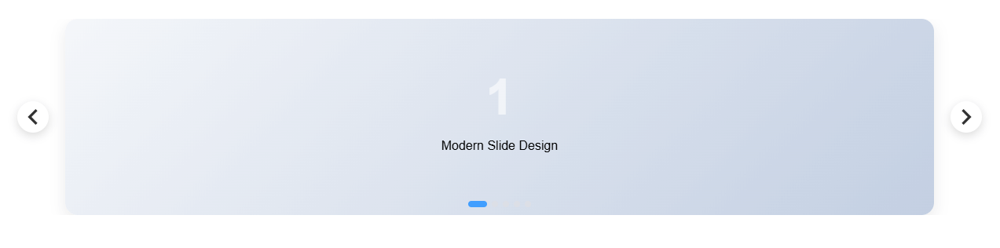
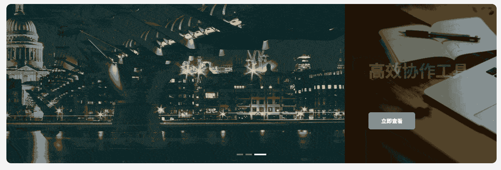
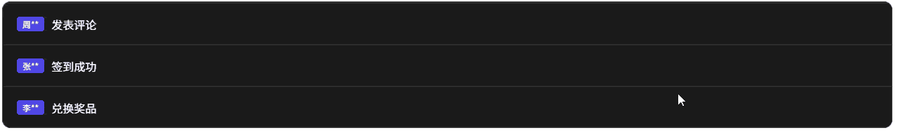

# Vue 3 Carousel

灵活、响应迅速且高度可定制的 Vue 轮播组件，几乎可以满足您的所有使用场景

- [官网地址](https://github.com/ismail9k/vue3-carousel)


## 基础配置

**安装依赖**

```
pnpm add vue3-carousel@0.17.0
```


## 基础示例

```vue
<script setup lang="ts">
import 'vue3-carousel/dist/carousel.css'
import { Carousel, Slide, Navigation, Pagination } from 'vue3-carousel'
</script>

<template>
  <div class="styled-carousel">
    <Carousel :items-to-show="1" wrap-around>
      <Slide v-for="n in 5" :key="n">
        <div class="slide-content">
          <span class="slide-number">{{ n }}</span>
          <p>Modern Slide Design</p>
        </div>
      </Slide>

      <template #addons>
        <Navigation />
        <Pagination />
      </template>
    </Carousel>
  </div>
</template>

<style scoped>
/* 1. 整体容器美化 */
.styled-carousel {
  padding: 20px;
  /* 使用组件提供的 CSS 变量进行统一配置 */
  --vc-nav-color: #333;
  --vc-nav-background: #ffffff;
  --vc-pgn-active-color: #409eff; /* 蓝色激活色 */
}

/* 2. 内容卡片美化 */
.slide-content {
  width: 90%; /* 给左右留点缝隙，看起来更灵动 */
  height: 250px;
  background: linear-gradient(135deg, #f5f7fa 0%, #c3cfe2 100%);
  border-radius: 16px;
  display: flex;
  flex-direction: column;
  justify-content: center;
  align-items: center;
  box-shadow: 0 8px 20px rgba(0, 0, 0, 0.08);
  font-family: 'Arial', sans-serif;
}

.slide-number {
  font-size: 4rem;
  font-weight: bold;
  color: rgba(255, 255, 255, 0.6);
}

/* 3. 左右箭头按钮重绘 */
:deep(.carousel__prev),
:deep(.carousel__next) {
  background-color: white;
  box-shadow: 0 4px 12px rgba(0,0,0,0.15);
  border-radius: 50%;
  width: 40px;
  height: 40px;
  transition: all 0.3s ease;
}

:deep(.carousel__prev:hover),
:deep(.carousel__next:hover) {
  transform: scale(1.1);
  color: #409eff;
}

/* 4. 分页器点位优化 */
:deep(.carousel__pagination) {
  margin-top: 15px;
}

:deep(.carousel__pagination-button) {
  width: 8px;
  height: 8px;
  border-radius: 4px;
  background-color: #dcdfe6;
  transition: all 0.3s;
}

:deep(.carousel__pagination-button--active) {
  width: 24px; /* 激活时变成长条 */
  background-color: var(--vc-pgn-active-color);
}
</style>
```



## 自动播放 + 悬停暂停（最常见 Banner）

**使用场景**：官网首页 Banner、活动轮播

```vue
<script setup lang="ts">
import 'vue3-carousel/dist/carousel.css'
import { Carousel, Slide, Pagination } from 'vue3-carousel'

// 模拟 Banner 数据
const banners = [
  { id: 1, title: '探索未来科技', subtitle: '解锁 AI 驱动的全新体验', img: 'https://picsum.photos/1200/400?random=1' },
  { id: 2, title: '设计驱动创新', subtitle: '让每一个像素都拥有生命力', img: 'https://picsum.photos/1200/400?random=2' },
  { id: 3, title: '高效协作工具', subtitle: '提升团队 200% 的生产效率', img: 'https://picsum.photos/1200/400?random=3' },
]
</script>

<template>
  <div class="banner-wrapper">
    <Carousel
        :items-to-show="1"
        :autoplay="1000"
        :pause-autoplay-on-hover="true"
        :transition="800"
        wrap-around
    >
      <Slide v-for="item in banners" :key="item.id">
        <div class="banner-item" :style="{ backgroundImage: `url(${item.img})` }">
          <div class="overlay">
            <div class="text-content">
              <h2 class="title">{{ item.title }}</h2>
              <p class="subtitle">{{ item.subtitle }}</p>
              <button class="action-btn">立即查看</button>
            </div>
          </div>
        </div>
      </Slide>

      <template #addons>
        <Pagination />
      </template>
    </Carousel>
  </div>
</template>

<style scoped>
/* 1. 容器高宽比例控制 */
.banner-wrapper {
  border-radius: 12px;
  overflow: hidden;
  margin: 20px;
  box-shadow: 0 20px 40px rgba(0,0,0,0.1);
  --vc-pgn-active-color: #fff;
}

.banner-item {
  width: 100%;
  height: 400px;
  background-size: cover;
  background-position: center;
  display: flex;
  align-items: center;
}

/* 2. 蒙版与文字排版 */
.overlay {
  width: 100%;
  height: 100%;
  background: linear-gradient(to right, rgba(0,0,0,0.7) 0%, rgba(0,0,0,0) 60%);
  display: flex;
  align-items: center;
  padding: 0 60px;
  text-align: left;
}

.text-content {
  color: #fff;
}

.title {
  font-size: 42px;
  font-weight: 700;
  margin-bottom: 12px;
  /* 初始动画状态 */
  transform: translateY(20px);
  opacity: 0;
  transition: all 0.8s ease;
}

.subtitle {
  font-size: 18px;
  opacity: 0;
  transform: translateY(20px);
  transition: all 0.8s ease 0.2s; /* 延迟显示 */
}

/* 3. 核心：利用组件状态类名触发动画 */
.carousel__slide--active .title,
.carousel__slide--active .subtitle {
  transform: translateY(0);
  opacity: 1;
}

/* 4. 按钮样式 */
.action-btn {
  margin-top: 30px;
  padding: 12px 32px;
  background: #409eff;
  border: none;
  color: white;
  border-radius: 6px;
  cursor: pointer;
  font-weight: bold;
  transition: background 0.3s;
}

.action-btn:hover {
  background: #66b1ff;
}

/* 5. 分页器魔改（悬浮感） */
:deep(.carousel__pagination) {
  position: absolute;
  bottom: 20px;
  left: 50%;
  transform: translateX(-50%);
}

:deep(.carousel__pagination-button) {
  background-color: rgba(255, 255, 255, 0.4);
}

:deep(.carousel__pagination-button--active) {
  background-color: #fff;
  width: 30px;
}
</style>
```

✅ 常用参数说明

- `autoplay="1000"`：1 秒轮播一次
- `pause-autoplay-on-hover`：鼠标悬停暂停
- `wrap-around`：循环播放



------

## 多图展示（商品 / 卡片列表）

**使用场景**：商品列表、推荐位、卡片横向滚动

```vue
<script setup lang="ts">
import 'vue3-carousel/dist/carousel.css'
import { Carousel, Slide, Navigation } from 'vue3-carousel'

// 模拟商品数据
const products = Array.from({ length: 10 }).map((_, i) => ({
  id: i + 1,
  name: `精选商品 ${i + 1}`,
  price: (Math.random() * 1000).toFixed(2),
  tag: i % 3 === 0 ? '新品' : '热卖'
}))
</script>

<template>
  <div class="product-carousel">
    <Carousel
        :items-to-show="2.5"
        :gap="20"
        :wrap-around="true"
        :breakpoints="{
        768: { itemsToShow: 3.5 },
        1024: { itemsToShow: 4 }
      }"
    >
      <Slide v-for="product in products" :key="product.id">
        <div class="card-wrapper">
          <div class="product-card">
            <div class="tag" :class="product.tag === '新品' ? 'new' : 'hot'">
              {{ product.tag }}
            </div>
            <div class="img-placeholder">
              <i class="icon-package"></i>
            </div>
            <div class="info">
              <div class="name">{{ product.name }}</div>
              <div class="price-row">
                <span class="currency">¥</span>
                <span class="price">{{ product.price }}</span>
              </div>
            </div>
          </div>
        </div>
      </Slide>

      <template #addons>
        <Navigation />
      </template>
    </Carousel>
  </div>
</template>

<style scoped>
.product-carousel {
  padding: 40px 10px;
  background: #fff;
  /* 自定义导航箭头颜色 */
  --vc-nav-color: #999;
  --vc-nav-background: #fff;
}

.card-wrapper {
  padding: 10px 5px; /* 给阴影留出空间 */
  width: 100%;
}

.product-card {
  position: relative;
  height: 200px;
  background: #ffffff;
  border: 1px solid #f0f0f0;
  border-radius: 12px;
  display: flex;
  flex-direction: column;
  padding: 16px;
  transition: all 0.3s cubic-bezier(0.25, 0.8, 0.25, 1);
  cursor: pointer;
  box-shadow: 0 2px 8px rgba(0,0,0,0.04);
}

/* 1. 悬停效果：卡片浮起 */
.product-card:hover {
  transform: translateY(-8px);
  box-shadow: 0 12px 24px rgba(0,0,0,0.1);
  border-color: #409eff;
}

/* 2. 标签样式 */
.tag {
  position: absolute;
  top: 10px;
  right: 10px;
  font-size: 12px;
  padding: 2px 8px;
  border-radius: 4px;
  color: white;
  z-index: 1;
}
.tag.new { background: #67c23a; }
.tag.hot { background: #f56c6c; }

/* 3. 内容布局 */
.img-placeholder {
  flex: 1;
  background: #f9fafb;
  border-radius: 8px;
  margin-bottom: 12px;
  display: flex;
  align-items: center;
  justify-content: center;
}

.info {
  text-align: left;
}

.name {
  font-size: 14px;
  color: #333;
  font-weight: 500;
  margin-bottom: 8px;
}

.price-row {
  color: #f56c6c;
}

.currency { font-size: 12px; }
.price { font-size: 18px; font-weight: bold; }

/* 4. 强化的导航按钮样式 */
:deep(.carousel__prev),
:deep(.carousel__next) {
  top: 50%;
  transform: translateY(-50%);
  width: 36px;
  height: 36px;
  border-radius: 50%;
  box-shadow: 0 4px 10px rgba(0,0,0,0.1);
  border: 1px solid #eee;
  margin: 0 -5px; /* 让按钮稍微往外扩一点 */
}

:deep(.carousel__prev:hover),
:deep(.carousel__next:hover) {
  background-color: #409eff;
  color: #fff;
  border-color: #409eff;
}
</style>
```

👉 **重点参数**

- `items-to-show`：一屏显示几个
- `gap`：slide 之间的间距（非常常用）


------

## 响应式断点（PC / Pad / Mobile）

**使用场景**：PC 显示 4 个，手机显示 1 个

```vue
<script setup lang="ts">
import 'vue3-carousel/dist/carousel.css'
// 1. 导入类型定义
import { Carousel, Slide, Navigation, type Breakpoints } from 'vue3-carousel'

// 2. 显式标注类型，这样 TS 就能识别数字键名了
const breakpoints: Breakpoints = {
  // 注意：vue3-carousel 的 0 通常代表默认配置（min-width: 0）
  0: {
    itemsToShow: 1.2,
    snapAlign: 'center',
  },
  768: {
    itemsToShow: 2.5,
    snapAlign: 'center',
  },
  1024: {
    itemsToShow: 4,
    snapAlign: 'start',
  },
}
</script>

<template>
  <div class="responsive-container">
    <Carousel :breakpoints="breakpoints" :gap="20" wrap-around>
      <Slide v-for="n in 8" :key="n">
        <div class="responsive-card">Item {{ n }}</div>
      </Slide>
      <template #addons>
        <Navigation />
      </template>
    </Carousel>
  </div>
</template>

<style scoped>
.responsive-container {
  padding: 40px 0;
  max-width: 1200px;
  margin: 0 auto;
}

/* 基础卡片样式 */
.responsive-card {
  width: 100%;
  height: 280px;
  background: white;
  border-radius: 20px;
  padding: 24px;
  display: flex;
  flex-direction: column;
  justify-content: space-between;
  text-align: left;
  border: 1px solid #eaeaea;
  transition: all 0.3s ease;
  background-image: radial-gradient(at 0% 0%, hsla(253,16%,7%,1) 0, transparent 50%),
  radial-gradient(at 50% 0%, hsla(225,39%,30%,1) 0, transparent 50%);
  background-color: #1a1a1a; /* 尝试一个暗色系高级感 */
  color: white;
}

.card-num {
  font-size: 32px;
  font-weight: 800;
  opacity: 0.3;
}

h4 { margin: 0 0 8px 0; font-size: 1.2rem; }
p { margin: 0; font-size: 0.9rem; opacity: 0.7; line-height: 1.5; }

/* 重点：针对移动端的微调 */
@media (max-width: 768px) {
  .responsive-card {
    height: 220px; /* 手机上矮一点 */
    padding: 16px;
  }
  h4 { font-size: 1rem; }
}

/* 悬停动画：卡片内部元素交互 */
.responsive-card:hover {
  border-color: #6366f1;
  box-shadow: 0 10px 30px rgba(99, 102, 241, 0.2);
}

/* 导航按钮美化 */
:deep(.carousel__prev),
:deep(.carousel__next) {
  background: white;
  border-radius: 12px; /* 方中带圆的现代感 */
  width: 44px;
  height: 44px;
  color: #1a1a1a;
  box-shadow: 0 4px 12px rgba(0,0,0,0.1);
}

/* 移动端隐藏按钮，改用纯手势滑动，让界面更清爽 */
@media (max-width: 768px) {
  :deep(.carousel__prev),
  :deep(.carousel__next) {
    display: none;
  }
}
</style>
```


------

## 自定义上一页 / 下一页（不用内置 Navigation）

**使用场景**：UI 需要和设计稿完全一致

```vue
<script setup lang="ts">
import 'vue3-carousel/dist/carousel.css'
import { Carousel, Slide } from 'vue3-carousel'
import { ref, computed } from 'vue'

// 1. 强类型声明：使用 InstanceType 获取组件接口类型
const carouselRef = ref<InstanceType<typeof Carousel> | null>(null)

// 2. 状态跟踪：用于控制按钮的禁用样式
const currentSlide = ref(0)

// 处理滑动后的回调
const handleSlide = (data: { currentSlideIndex: number }) => {
  currentSlide.value = data.currentSlideIndex
}

// 模拟数据长度
const totalSlides = 5
</script>

<template>
  <div class="custom-carousel-root">
    <div class="header-controls">
      <div class="title-group">
        <h3>精选案例</h3>
        <p>Selected Projects</p>
      </div>

      <div class="button-group">
        <button
            class="nav-btn"
            @click="carouselRef?.prev()"
            title="Previous"
        >
          <span class="icon">←</span>
        </button>
        <button
            class="nav-btn"
            @click="carouselRef?.next()"
            title="Next"
        >
          <span class="icon">→</span>
        </button>
      </div>
    </div>

    <Carousel
        ref="carouselRef"
        :items-to-show="1.5"
        :snap-align="'center'"
        :transition="600"
        @slide-start="handleSlide"
    >
      <Slide v-for="n in totalSlides" :key="n">
        <div class="slide-card">
          <div class="content-box">
            <div class="tag">0{{ n }}</div>
            <h4>Design Concept {{ n }}</h4>
            <div class="line"></div>
          </div>
        </div>
      </Slide>
    </Carousel>
  </div>
</template>

<style scoped>
.custom-carousel-root {
  padding: 40px;
  background: #fdfdfd;
}

/* 1. 顶部布局：标题与按钮分居两侧 */
.header-controls {
  display: flex;
  justify-content: space-between;
  align-items: flex-end;
  margin-bottom: 30px;
  max-width: 1200px;
  margin-inline: auto;
}

.title-group h3 {
  font-size: 28px;
  margin: 0;
  color: #1a1a1a;
}
.title-group p {
  margin: 4px 0 0 0;
  color: #999;
  letter-spacing: 2px;
  font-size: 12px;
  text-transform: uppercase;
}

/* 2. 按钮组美化：方正简约风 */
.button-group {
  display: flex;
  gap: 12px;
}

.nav-btn {
  width: 50px;
  height: 50px;
  border: 1px solid #e0e0e0;
  background: white;
  cursor: pointer;
  display: flex;
  align-items: center;
  justify-content: center;
  transition: all 0.3s cubic-bezier(0.4, 0, 0.2, 1);
  font-size: 20px;
}

.nav-btn:hover {
  background: #1a1a1a;
  color: white;
  border-color: #1a1a1a;
  transform: translateY(-2px);
}

.nav-btn:active {
  transform: translateY(0);
}

/* 3. Slide 内部精致化 */
.slide-card {
  width: 100%;
  padding: 15px;
}

.content-box {
  height: 300px;
  background: #fff;
  border: 1px solid #eee;
  border-radius: 4px; /* 极简风通常用小圆角或直角 */
  display: flex;
  flex-direction: column;
  justify-content: center;
  padding: 40px;
  text-align: left;
  position: relative;
  overflow: hidden;
  transition: 0.4s;
}

.slide-card:hover .content-box {
  border-color: #1a1a1a;
  box-shadow: 0 20px 40px rgba(0,0,0,0.05);
}

.tag {
  font-family: 'serif';
  font-size: 60px;
  font-weight: bold;
  color: #f0f0f0;
  position: absolute;
  top: 10px;
  right: 20px;
}

.line {
  width: 40px;
  height: 2px;
  background: #1a1a1a;
  margin-top: 20px;
  transition: width 0.4s;
}

.slide-card:hover .line {
  width: 80px;
}
</style>
```

📌 可调用的方法：

- `prev()`
- `next()`
- `slideTo(index)`


------

## 垂直轮播（公告 / 消息滚动）

### 单行消息

```vue
<script setup lang="ts">
import 'vue3-carousel/dist/carousel.css'
import { Carousel, Slide } from 'vue3-carousel'

// 模拟公告数据
const notices = [
  { id: 1, type: 'info', text: '系统将于今晚 24:00 进行例行维护' },
  { id: 2, type: 'success', text: '恭喜用户 138****8888 获得周年庆大奖' },
  { id: 3, type: 'warning', text: '您的账户余额不足，请及时充值' },
  { id: 4, type: 'info', text: '新功能“AI 智能分析”已上线，欢迎试用' },
]
</script>

<template>
  <div class="notice-bar-container">
    <div class="notice-icon">
      <span class="icon">🔔</span>
      <span class="divider"></span>
    </div>

    <Carousel
        dir="ttb"
        :items-to-show="1"
        :autoplay="1000"
        :height="50"
        :transition="600"
        :mouse-drag="false"
        :touch-drag="false"
        wrap-around
        class="notice-carousel"
    >
      <Slide v-for="item in notices" :key="item.id">
        <div class="notice-item" :class="item.type">
          <span class="notice-text">{{ item.text }}</span>
          <span class="more">详情 →</span>
        </div>
      </Slide>
    </Carousel>
  </div>
</template>

<style scoped>
/* 1. 容器：紧凑、圆角、背景色 */
.notice-bar-container {
  max-width: 600px;
  margin: 20px auto;
  height: 50px;
  background: #ffffff;
  border: 1px solid #e8e8e8;
  border-radius: 8px;
  display: flex;
  align-items: center;
  overflow: hidden;
  box-shadow: 0 2px 10px rgba(0,0,0,0.05);
}

/* 2. 固定图标区 */
.notice-icon {
  display: flex;
  align-items: center;
  padding: 0 15px;
  background: #fafafa;
  height: 100%;
}

.divider {
  width: 1px;
  height: 20px;
  background: #ddd;
  margin-left: 15px;
}

/* 3. 轮播项样式 */
.notice-carousel {
  flex: 1;
  height: 50px;
}

.notice-item {
  width: 100%;
  height: 50px; /* 必须与 Carousel 的 height 一致 */
  display: flex;
  align-items: center;
  justify-content: space-between;
  padding: 0 15px;
  font-size: 14px;
  color: #606266;
  text-align: left;
}

.notice-text {
  overflow: hidden;
  white-space: nowrap;
  text-overflow: ellipsis;
  flex: 1;
}

/* 4. 类型区分 */
.notice-item.warning .notice-text { color: #e6a23c; font-weight: bold; }
.notice-item.success .notice-text { color: #67c23a; }

.more {
  font-size: 12px;
  color: #409eff;
  margin-left: 10px;
  cursor: pointer;
  white-space: nowrap;
}

.more:hover {
  text-decoration: underline;
}

/* 优化垂直切换的平滑度 */
:deep(.carousel__track) {
  transition-timing-function: cubic-bezier(0.4, 0, 0.2, 1);
}
</style>
```


### 多行消息

```vue
<script setup lang="ts">
import 'vue3-carousel/dist/carousel.css'
import { Carousel, Slide } from 'vue3-carousel'
import { ref, onMounted } from 'vue'

const isReady = ref(false)

const logs = [
  { id: 1, user: '张**', action: '签到成功' },
  { id: 2, user: '李**', action: '兑换奖品' },
  { id: 3, user: '王**', action: '完成任务' },
  { id: 4, user: '赵**', action: '加入群组' },
  { id: 5, user: '周**', action: '发表评论' }
]

onMounted(() => {
  isReady.value = true
})
</script>

<template>
  <div class="vertical-fix-container">
    <Carousel
        v-if="isReady"
        dir="ttb"
        :items-to-show="3"
        :autoplay="2000"
        :height="180"
        :transition="600"
        :mouse-drag="true"
        :touch-drag="true"
        :wrap-around="true"
        pause-autoplay-on-hover
    >
      <Slide v-for="log in logs" :key="log.id">
        <div class="log-card">
          <span class="user-tag">{{ log.user }}</span>
          <span class="text">{{ log.action }}</span>
        </div>
      </Slide>
    </Carousel>
  </div>
</template>

<style scoped>
.vertical-fix-container {
  border: 1px solid #444;
  background: #1a1a1a;
  border-radius: 12px;
  overflow: hidden;
  /* 关键点 2: 给容器一个确定的高度 */
  height: 180px;
}

.log-card {
  /* 关键点 3: Slide 内部必须填满高度 (180px / 3 = 60px) */
  height: 60px;
  width: 100%;
  display: flex;
  align-items: center;
  padding: 0 20px;
  color: #fff;
  border-bottom: 1px solid #333;
  box-sizing: border-box; /* 必须加，否则高度计算溢出 */
}

.user-tag {
  background: #4f46e5;
  padding: 2px 8px;
  border-radius: 4px;
  margin-right: 10px;
  font-size: 12px;
}

/* 关键点 4: 强制覆盖内置样式，防止计算错位 */
:deep(.carousel__track) {
  display: flex;
  flex-direction: column !important;
  transform: none; /* 初始化时重置 */
}
</style>
```



------

