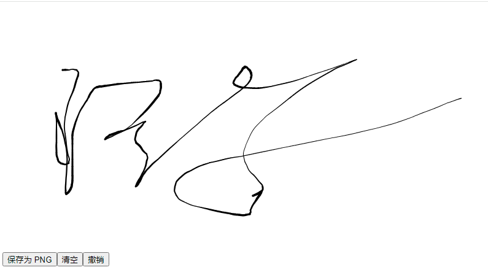

# Vue3 Signature

一个流畅优雅的 Vue 3 电子签名组件

基于 signature_pad - 最流行的 HTML5 Canvas 签名库

- [官网地址](https://github.com/WangShayne/vue3-signature/blob/main/README.zh-CN.md)


## 基础配置

**安装依赖**

```
pnpm add vue3-signature@0.4.4 signature_pad@5.1.3
```

**全局注册组件**

```ts
import { createApp } from 'vue'
import App from './App.vue'
import Vue3Signature from "vue3-signature";

const app = createApp(App);

app.use(Vue3Signature);

app.mount('#app')
```


## 最简示例

```vue
<template>
  <div>
    <Vue3Signature
        ref="signature"
        :sigOption="options"
        w="800px"
        h="400px"
    />

    <div class="buttons">
      <button @click="save">保存为 PNG</button>
      <button @click="clear">清空</button>
      <button @click="undo">撤销</button>
    </div>
  </div>
</template>

<script setup lang="ts">
import { ref, reactive } from 'vue'
import type { Options as SignaturePadOptions } from 'signature_pad'

/**
 * Vue3Signature 暴露的实例能力（与官方文档保持一致的子集）
 * 注意：这是“消费方最小可信接口”，不是重写库类型
 */
interface Vue3SignatureInstance {
  save: (format?: string, encoderOptions?: number) => string
  clear: () => void
  undo: (steps?: number) => void
  isEmpty: () => boolean
}

/**
 * 组件 ref
 */
const signature = ref<Vue3SignatureInstance | null>(null)

/**
 * 签名板配置
 * 完全对齐 signature_pad Options
 */
const options = reactive<SignaturePadOptions>({
  penColor: 'rgb(0, 0, 0)',
  backgroundColor: 'rgb(255, 255, 255)',
})

/**
 * 保存为 PNG（默认）
 */
const save = (): void => {
  if (!signature.value) {
    return
  }

  if (signature.value.isEmpty()) {
    console.warn('签名为空')
    return
  }

  const png: string = signature.value.save()
  console.log(png)
}

/**
 * 清空画布
 */
const clear = (): void => {
  signature.value?.clear()
}

/**
 * 撤销一步
 */
const undo = (): void => {
  signature.value?.undo()
}
</script>
```




## 使用组合式函数

### 创建组合式函数

`src/composables/useSignaturePad.ts`

```ts
import { ref } from 'vue'
import type SignaturePad from 'signature_pad'
import type {
    PointGroup,
    FromDataOptions,
    FromDataUrlOptions,
    ToSVGOptions,
} from 'signature_pad'

/* ===================== 官方能力类型 ===================== */

export interface WaterMarkOption {
    text?: string
    font?: string
    style?: 'all' | 'stroke' | 'fill'
    fillStyle?: string
    strokeStyle?: string
    x?: number
    y?: number
    sx?: number
    sy?: number
}

export interface TrimResult {
    canvas: HTMLCanvasElement
    dataUrl: string
    bounds: { x: number; y: number; width: number; height: number }
}

export interface TrimOptions {
    format?: string
    encoderOptions?: number
    backgroundColor?: string
}

/**
 * Vue3Signature 对外暴露的实例（官方 README 能力全集）
 */
export interface Vue3SignatureInstance {
    save(format?: string, encoderOptions?: number): string
    toDataURL(format?: string, encoderOptions?: number): string
    toSVG(options?: ToSVGOptions): string
    clear(): void
    redraw(): void
    isEmpty(): boolean
    undo(steps?: number): void
    toData(): PointGroup[]
    fromData(data: PointGroup[], options?: FromDataOptions): void
    fromDataURL(url: string, options?: FromDataUrlOptions): Promise<void>
    addWaterMark(options: WaterMarkOption): void
    trim(options?: TrimOptions): TrimResult | null
    toTrimmedDataURL(format?: string, encoderOptions?: number): string
    enable(): void
    disable(): void
    addEventListener(
        type: string,
        listener: EventListenerOrEventListenerObject,
    ): void
    removeEventListener(
        type: string,
        listener: EventListenerOrEventListenerObject,
    ): void
    getInstance(): SignaturePad | undefined
}

/* ===================== 组合式函数 ===================== */

export function useSignaturePad() {
    const signatureRef = ref<Vue3SignatureInstance | null>(null)

    /* ---------- 基础控制 ---------- */

    const clear = (): void => {
        signatureRef.value?.clear()
    }

    const undo = (steps = 1): void => {
        signatureRef.value?.undo(steps)
    }

    const isEmpty = (): boolean => {
        return signatureRef.value?.isEmpty() ?? true
    }

    const enable = (): void => {
        signatureRef.value?.enable()
    }

    const disable = (): void => {
        signatureRef.value?.disable()
    }

    /* ---------- 导出 ---------- */

    const savePNG = (): string | null => {
        if (!signatureRef.value || isEmpty()) {
            return null
        }
        return signatureRef.value.save()
    }

    const saveJPEG = (quality = 0.92): string | null => {
        if (!signatureRef.value || isEmpty()) {
            return null
        }
        return signatureRef.value.save('image/jpeg', quality)
    }

    const saveSVG = (): string | null => {
        if (!signatureRef.value || isEmpty()) {
            return null
        }
        return signatureRef.value.save('image/svg+xml')
    }

    const downloadPNG = (filename = 'signature.png'): void => {
        const dataUrl = savePNG()
        if (!dataUrl) {
            return
        }

        const link = document.createElement('a')
        link.href = dataUrl
        link.download = filename
        link.click()
    }

    const saveTrimmed = (
        format = 'image/png',
        encoderOptions?: number,
    ): string | null => {
        if (!signatureRef.value || isEmpty()) {
            return null
        }
        return signatureRef.value.toTrimmedDataURL(format, encoderOptions)
    }

    /* ---------- 数据导入 / 导出 ---------- */

    const toData = (): PointGroup[] => {
        return signatureRef.value?.toData() ?? []
    }

    const fromData = (
        data: PointGroup[],
        options?: FromDataOptions,
    ): void => {
        signatureRef.value?.fromData(data, options)
    }

    const fromDataURL = async (
        url: string,
        options?: FromDataUrlOptions,
    ): Promise<void> => {
        if (!signatureRef.value) {
            return
        }
        await signatureRef.value.fromDataURL(url, options)
    }

    /* ---------- 水印 / 裁剪 ---------- */

    const addWaterMark = (options: WaterMarkOption): void => {
        signatureRef.value?.addWaterMark(options)
    }

    const trim = (options?: TrimOptions): TrimResult | null => {
        return signatureRef.value?.trim(options) ?? null
    }

    /* ---------- 底层实例 ---------- */

    const getInstance = (): SignaturePad | undefined => {
        return signatureRef.value?.getInstance()
    }

    return {
        signatureRef,

        clear,
        undo,
        isEmpty,
        enable,
        disable,

        savePNG,
        saveJPEG,
        saveSVG,
        saveTrimmed,

        downloadPNG,

        toData,
        fromData,
        fromDataURL,

        addWaterMark,
        trim,

        getInstance,
    }
}

```

### 基本使用

```vue
<script setup lang="ts">
import { reactive } from 'vue'
import type { Options as SignaturePadOptions } from 'signature_pad'
import { useSignaturePad } from '@/composables/useSignaturePad'

const {
  signatureRef,
  downloadPNG,
  clear,
  undo,
  addWaterMark,
} = useSignaturePad()

const options = reactive<SignaturePadOptions>({
  penColor: '#000',
  backgroundColor: '#fff',
})

</script>

<template>
  <Vue3Signature
      ref="signatureRef"
      :sigOption="options"
      w="800px"
      h="400px"
  />

  <button @click="() => downloadPNG()">保存 PNG</button>
  <button @click="() => undo()">撤销</button>
  <button @click="clear">清空</button>
  <button @click="addWaterMark({ text: 'CONFIDENTIAL' })">
    水印
  </button>
</template>

```


### 导出 PNG / JPEG / SVG（格式全家桶）

```vue
<script setup lang="ts">
import { reactive } from 'vue'
import type { Options as SignaturePadOptions } from 'signature_pad'
import { useSignaturePad } from '@/composables/useSignaturePad'

const {
  signatureRef,
  savePNG,
  saveJPEG,
  saveSVG,
} = useSignaturePad()

const options = reactive<SignaturePadOptions>({
  penColor: '#000',
  backgroundColor: '#fff',
})

const log = (data: string | null) => {
  console.log(data)
}
</script>

<template>
  <Vue3Signature
    ref="signatureRef"
    :sigOption="options"
    w="800px"
    h="400px"
  />

  <button @click="log(savePNG())">PNG</button>
  <button @click="log(saveJPEG(0.8))">JPEG</button>
  <button @click="log(saveSVG())">SVG</button>
</template>
```

---

### 判断是否为空 + 启用 / 禁用（表单场景）

```vue
<script setup lang="ts">
import { reactive } from 'vue'
import type { Options as SignaturePadOptions } from 'signature_pad'
import { useSignaturePad } from '@/composables/useSignaturePad'

const {
  signatureRef,
  isEmpty,
  enable,
  disable,
} = useSignaturePad()

const options = reactive<SignaturePadOptions>({
  penColor: '#1976d2',
  backgroundColor: '#fff',
})

const check = () => {
  alert(isEmpty() ? '当前是空的' : '已有签名')
}
</script>

<template>
  <Vue3Signature
    ref="signatureRef"
    :sigOption="options"
    w="600px"
    h="300px"
  />

  <button @click="check">是否为空</button>
  <button @click="disable">禁用</button>
  <button @click="enable">启用</button>
</template>
```

---

### 数据导出 / 恢复（后端存储签名）

```vue
<script setup lang="ts">
import { reactive, ref } from 'vue'
import type { Options as SignaturePadOptions, PointGroup } from 'signature_pad'
import { useSignaturePad } from '@/composables/useSignaturePad'

const {
  signatureRef,
  toData,
  fromData,
  clear,
} = useSignaturePad()

const saved = ref<PointGroup[]>([])

const options = reactive<SignaturePadOptions>({
  penColor: '#000',
})

const save = () => {
  const data = toData()
  saved.value = data
}

const restore = () => {
  clear()
  fromData(saved.value)
}
</script>

<template>
  <Vue3Signature
      ref="signatureRef"
      :sigOption="options"
      w="700px"
      h="350px"
  />

  <button @click="save">保存数据</button>
  <button @click="restore">恢复数据</button>
</template>
```

---

### URL 导入（历史签名回显）

```vue
<script setup lang="ts">
import { reactive } from 'vue'
import type { Options as SignaturePadOptions } from 'signature_pad'
import { useSignaturePad } from '@/composables/useSignaturePad'

const {
  signatureRef,
  fromDataURL,
  clear,
} = useSignaturePad()

const options = reactive<SignaturePadOptions>({
  penColor: '#000',
})

const load = async () => {
  await fromDataURL(
    'https://dummyimage.com/600x300/ffffff/000000.png&text=Signature',
  )
}
</script>

<template>
  <Vue3Signature
    ref="signatureRef"
    :sigOption="options"
    w="600px"
    h="300px"
  />

  <button @click="load">加载远程签名</button>
  <button @click="clear">清空</button>
</template>
```

---

### 裁剪 & 导出（去白边）

```vue
<script setup lang="ts">
import { reactive } from 'vue'
import type { Options as SignaturePadOptions } from 'signature_pad'
import { useSignaturePad } from '@/composables/useSignaturePad'

const {
  signatureRef,
  saveTrimmed,
} = useSignaturePad()

const options = reactive<SignaturePadOptions>({
  penColor: '#000',
  backgroundColor: '#fff',
})

const exportTrimmed = () => {
  const data = saveTrimmed()
  console.log(data)
}
</script>

<template>
  <Vue3Signature
    ref="signatureRef"
    :sigOption="options"
    w="800px"
    h="400px"
  />

  <button @click="exportTrimmed">裁剪导出</button>
</template>
```

---

### 底层 SignaturePad 实例（高级定制）

```vue
<script setup lang="ts">
import { reactive } from 'vue'
import type { Options as SignaturePadOptions } from 'signature_pad'
import { useSignaturePad } from '@/composables/useSignaturePad'

const {
  signatureRef,
  getInstance,
} = useSignaturePad()

const options = reactive<SignaturePadOptions>({
  penColor: 'red',
  minWidth: 1,
  maxWidth: 3,
})

const tweak = () => {
  const pad = getInstance()
  if (!pad) return

  pad.minWidth = 2
  pad.maxWidth = 4
}
</script>

<template>
  <Vue3Signature
    ref="signatureRef"
    :sigOption="options"
    w="600px"
    h="300px"
  />

  <button @click="tweak">动态调整笔触</button>
</template>
```

---

