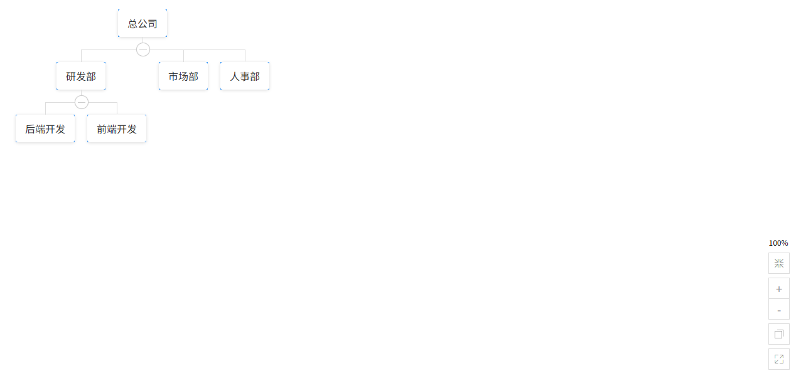

# vue3-tree-org

一个基于vue3.x的简易版组织架构图

- [官网地址](https://sangtian152.github.io/vue3-tree-org)


## 基础配置

**安装依赖**

```
pnpm add vue3-tree-org@4.2.2
```

**全局引入 (main.ts)**

```ts
import { createApp } from 'vue'
import App from './App.vue'
import vue3TreeOrg from 'vue3-tree-org';
import "vue3-tree-org/lib/vue3-tree-org.css";

const app = createApp(App);
app.use(vue3TreeOrg);
app.mount('#app');
```


## 最简示例

```vue
<template>
  <div style="height: 600px; border: 1px solid #eee">
    <vue3-tree-org
        :data="data"
        :horizontal="false"
        :collapsable="true"
        :label-style="style"
        :tool-bar="true"
        @on-node-click="handleNodeClick"
    />
  </div>
</template>

<script setup lang="ts">
import { ref } from 'vue';

// 定义节点的数据接口
interface TreeData {
  id: number;
  label: string;
  children?: TreeData[];
  expand?: boolean; // 是否展开
}

// 响应式数据
const data = ref<TreeData>({
  id: 1,
  label: "总公司",
  children: [
    {
      id: 2,
      label: "研发部",
      children: [
        { id: 5, label: "后端开发" },
        { id: 6, label: "前端开发" },
      ],
    },
    {
      id: 3,
      label: "市场部",
    },
    {
      id: 4,
      label: "人事部",
    },
  ],
});

// 自定义样式
const style = {
  background: "#fff",
  color: "#333",
  borderRadius: "4px",
};

// 事件处理
const handleNodeClick = (e: any, data: TreeData) => {
  console.log("点击了节点：", data.label);
};
</script>

<style>
/* 确保容器有高度，否则可能无法显示 */
.tree-org-node__content {
  background-color: #409eff !important;
  color: white !important;
}
</style>
```



## 自定义节点内容 (Slot 插槽方案)

```vue
<template>
  <div class="org-wrapper">
    <vue3-tree-org
        :data="treeData"
        :horizontal="false"
        :collapsable="true"
        :tool-bar="true"
        @on-node-click="handleNodeClick"
    >
      <!-- 关键：默认插槽自定义节点 -->
      <template #default="{ node }">
        <div class="custom-node">
          <div class="title">
            {{ node.label }}
          </div>

          <div class="desc">
            ID: {{ node.id }}
          </div>

          <div class="actions">
            <button @click.stop="edit(node)">编辑</button>
            <button @click.stop="remove(node)">删除</button>
          </div>
        </div>
      </template>
    </vue3-tree-org>
  </div>
</template>

<script setup lang="ts">
import { ref } from 'vue'

interface TreeNode {
  id: number
  label: string
  children?: TreeNode[]
  expand?: boolean
}

const treeData = ref<TreeNode>({
  id: 1,
  label: '总公司',
  expand: true,
  children: [
    {
      id: 2,
      label: '研发部',
      expand: true,
      children: [
        { id: 3, label: '后端开发' },
        { id: 4, label: '前端开发' }
      ]
    },
    {
      id: 5,
      label: '市场部'
    }
  ]
})

const handleNodeClick = (_: any, node: TreeNode) => {
  console.log('点击节点:', node)
}

const edit = (node: TreeNode) => {
  console.log('编辑:', node)
}

const remove = (node: TreeNode) => {
  console.log('删除:', node)
}
</script>

<style scoped>
.org-wrapper {
  height: 600px;
  border: 1px solid #eee;
  padding: 20px;
}

/* 自定义节点样式 */
.custom-node {
  min-width: 140px;
  padding: 10px;
  border-radius: 8px;
  background: #ffffff;
  box-shadow: 0 2px 10px rgba(0, 0, 0, 0.1);
  text-align: center;
}

.title {
  font-weight: bold;
  margin-bottom: 6px;
}

.desc {
  font-size: 12px;
  color: #888;
  margin-bottom: 8px;
}

.actions button {
  font-size: 12px;
  margin: 0 4px;
  cursor: pointer;
}
</style>
```


## 异步加载数据 (懒加载方案)

```vue
<template>
  <div class="org-wrapper">
    <vue3-tree-org
        :data="treeData"
        :collapsable="true"
        @on-node-click="handleNodeClick"
    >
      <!-- 自定义节点显示 loading 状态 -->
      <template #default="{ node }">
        <div class="custom-node">
          <div>{{ node.label }}</div>
          <div v-if="node.loading" class="loading">
            加载中...
          </div>
        </div>
      </template>
    </vue3-tree-org>
  </div>
</template>

<script setup lang="ts">
import { ref } from 'vue'

interface TreeNode {
  id: number
  label: string
  children?: TreeNode[]
  expand?: boolean
  hasChildren?: boolean
  loading?: boolean
  loaded?: boolean
}

/**
 * 初始只加载根节点
 */
const treeData = ref<TreeNode>({
  id: 1,
  label: '总公司',
  expand: false,
  hasChildren: true,
})

/**
 * 模拟接口请求
 */
const fetchChildren = (parentId: number): Promise<TreeNode[]> => {
  return new Promise((resolve) => {
    setTimeout(() => {
      resolve([
        {
          id: parentId * 10 + 1,
          label: `部门-${parentId}-A`,
          hasChildren: true,
        },
        {
          id: parentId * 10 + 2,
          label: `部门-${parentId}-B`,
        },
      ])
    }, 1000)
  })
}

/**
 * 点击节点时触发懒加载
 */
const handleNodeClick = async (_: any, node: TreeNode) => {
  // 已加载过 or 没有子节点
  if (node.loaded || !node.hasChildren) return

  node.loading = true

  try {
    const children = await fetchChildren(node.id)
    node.children = children
    node.loaded = true
    node.expand = true
  } finally {
    node.loading = false
  }
}
</script>

<style scoped>
.org-wrapper {
  height: 600px;
  border: 1px solid #eee;
  padding: 20px;
}

.custom-node {
  padding: 10px;
  background: #fff;
  border-radius: 6px;
  text-align: center;
}

.loading {
  font-size: 12px;
  color: #999;
  margin-top: 6px;
}
</style>
```


## 动态筛选与定位 (Search & Filter 方案)

```vue
<template>
  <div class="org-wrapper">
    <!-- 搜索框 -->
    <div class="search-bar">
      <input
          v-model="keyword"
          placeholder="请输入部门名称"
          @input="handleSearch"
      />
      <button @click="resetSearch">重置</button>
    </div>

    <vue3-tree-org
        :data="treeData"
        :collapsable="true"
    >
      <!-- 自定义节点高亮 -->
      <template #default="{ node }">
        <div
            class="custom-node"
            :class="{ highlight: node.highlight }"
        >
          {{ node.label }}
        </div>
      </template>
    </vue3-tree-org>
  </div>
</template>

<script setup lang="ts">
import { ref } from 'vue'

interface TreeNode {
  id: number
  label: string
  children?: TreeNode[]
  expand?: boolean
  highlight?: boolean
}

/**
 * 原始数据（不要直接改它）
 */
const originData: TreeNode = {
  id: 1,
  label: '总公司',
  expand: true,
  children: [
    {
      id: 2,
      label: '研发部',
      children: [
        { id: 3, label: '后端开发' },
        { id: 4, label: '前端开发' }
      ]
    },
    {
      id: 5,
      label: '市场部'
    }
  ]
}

/**
 * 页面绑定数据（深拷贝）
 */
const treeData = ref<TreeNode>(clone(originData))

const keyword = ref('')

/**
 * 搜索处理
 */
const handleSearch = () => {
  if (!keyword.value) {
    treeData.value = clone(originData)
    return
  }

  const newTree = clone(originData)
  filterTree(newTree, keyword.value.toLowerCase())
  treeData.value = newTree
}

/**
 * 递归筛选 + 自动展开
 */
const filterTree = (node: TreeNode, keyword: string): boolean => {
  let matched = node.label.toLowerCase().includes(keyword)

  if (node.children && node.children.length > 0) {
    const childrenMatch = node.children
        .map(child => filterTree(child, keyword))
        .some(Boolean)

    matched = matched || childrenMatch
  }

  node.expand = matched
  node.highlight = node.label.toLowerCase().includes(keyword)

  return matched
}

/**
 * 重置
 */
const resetSearch = () => {
  keyword.value = ''
  treeData.value = clone(originData)
}

/**
 * 简单深拷贝
 */
function clone<T>(data: T): T {
  return JSON.parse(JSON.stringify(data))
}
</script>

<style scoped>
.org-wrapper {
  height: 600px;
  border: 1px solid #eee;
  padding: 20px;
}

.search-bar {
  margin-bottom: 12px;
}

.search-bar input {
  padding: 6px 10px;
  margin-right: 8px;
}

.custom-node {
  padding: 8px 12px;
  background: #fff;
  border-radius: 6px;
  transition: all 0.2s;
}

/* 高亮样式 */
.highlight {
  background: #409eff;
  color: #fff;
  font-weight: bold;
}
</style>
```

