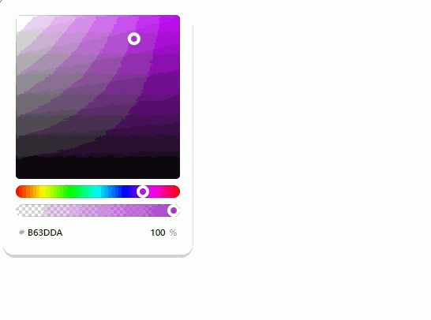
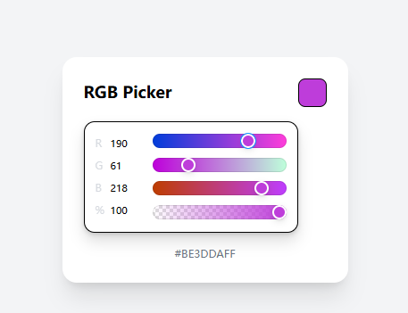
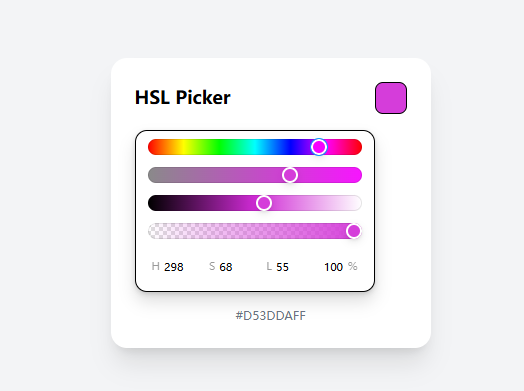
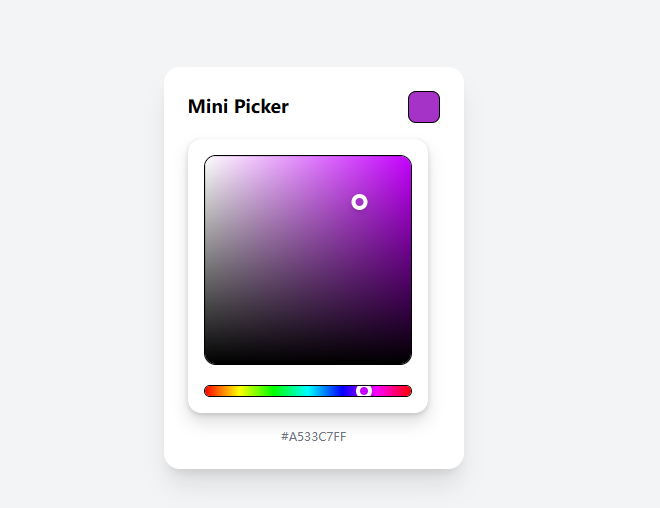

# Vuelor

一款真正灵活、易用且与 Tailwind 兼容的颜色选择器，充分考虑了开发者的体验。

- [官网地址](https://github.com/olekspolk/vuelor)


## 基础配置

**安装依赖**

```
pnpm add @vuelor/picker@0.4.0
```


## 基本使用

```vue
<script setup>
import '@vuelor/picker/style.css'

import { ref } from 'vue'
import {
  ColorPickerRoot,
  ColorPickerCanvas,
  ColorPickerSliderHue,
  ColorPickerSliderAlpha,
  ColorPickerInputHex
} from '@vuelor/picker'

const color = ref(null)
</script>

<template>
  <ColorPickerRoot
      v-model="color"
      styling="vanillacss"
  >
    <ColorPickerCanvas />
    <ColorPickerSliderHue />
    <ColorPickerSliderAlpha />
    <ColorPickerInputHex />
  </ColorPickerRoot>
</template>
```




## 基本使用2

```vue
<script lang="ts" setup>
import { ref } from 'vue'

import {
  ColorPickerRoot,
  ColorPickerInputRGB,
  ColorPickerSliderRed,
  ColorPickerSliderGreen,
  ColorPickerSliderBlue,
  ColorPickerSliderAlpha
} from '@vuelor/picker'

const color = ref(null)
</script>

<template>
  <div class="min-h-screen flex items-center justify-center bg-gray-100">
    <div class="bg-white p-6 rounded-2xl shadow-xl w-[320px] space-y-4">

      <!-- 标题 + 预览 -->
      <div class="flex items-center justify-between">
        <h2 class="text-lg font-semibold">RGB Picker</h2>
        <div
            class="w-8 h-8 rounded-lg border"
            :style="{ background: color || 'transparent' }"
        />
      </div>

      <ColorPickerRoot
          v-model="color"
          class="p-3 pl-2 rounded-xl border"
          :ui="{ shared: { thumb: 'border-2 border-white shadow' } }"
      >
        <div class="flex gap-3">

          <!-- RGB 输入 -->
          <ColorPickerInputRGB
              :ui="{
              group: 'flex-col w-14',
              item: 'bg-transparent last:flex-row-reverse',
              label: 'w-5 text-xs text-gray-400'
            }"
          />

          <!-- RGBA 滑块 -->
          <div class="flex flex-col justify-around flex-1 gap-2">
            <ColorPickerSliderRed class="h-2 rounded-full" />
            <ColorPickerSliderGreen class="h-2 rounded-full" />
            <ColorPickerSliderBlue class="h-2 rounded-full" />
            <ColorPickerSliderAlpha class="h-2 rounded-full" />
          </div>

        </div>
      </ColorPickerRoot>

      <!-- 当前值 -->
      <div class="text-xs text-gray-500 text-center break-all">
        {{ color || '未选择颜色' }}
      </div>

    </div>
  </div>
</template>
```



## 基本使用3

```vue
<script lang="ts" setup>
import { ref } from 'vue'

import {
  ColorPickerRoot,
  ColorPickerInputHSL,
  ColorPickerSliderHue,
  ColorPickerSliderSaturation,
  ColorPickerSliderLightness,
  ColorPickerSliderAlpha
} from '@vuelor/picker'

const color = ref(null)
</script>

<template>
  <div class="min-h-screen flex items-center justify-center bg-gray-100">
    <div class="bg-white p-6 rounded-2xl shadow-xl w-[320px] space-y-4">

      <!-- 标题 + 预览 -->
      <div class="flex items-center justify-between">
        <h2 class="text-lg font-semibold">HSL Picker</h2>
        <div
          class="w-8 h-8 rounded-lg border"
          :style="{ background: color || 'transparent' }"
        />
      </div>

      <ColorPickerRoot
        v-model="color"
        class="p-3 rounded-xl border space-y-3"
        :ui="{ shared: { thumb: 'border-2 border-white shadow' } }"
      >
        <!-- HSL 滑块 -->
        <ColorPickerSliderHue class="h-2 rounded-full" />
        <ColorPickerSliderSaturation class="h-2 rounded-full" />
        <ColorPickerSliderLightness class="h-2 rounded-full" />
        <ColorPickerSliderAlpha class="h-2 rounded-full" />

        <!-- 输入 -->
        <ColorPickerInputHSL
          :ui="{
            item: 'bg-transparent text-sm',
            group: 'gap-2'
          }"
        />
      </ColorPickerRoot>

      <!-- 当前值 -->
      <div class="text-xs text-gray-500 text-center break-all">
        {{ color || '未选择颜色' }}
      </div>

    </div>
  </div>
</template>
```



## 基本使用4

```vue
<script lang="ts" setup>
import { ref } from 'vue'

import {
  ColorPickerRoot,
  ColorPickerCanvas,
  ColorPickerSliderHue
} from '@vuelor/picker'

const color = ref(null)
</script>

<template>
  <div class="min-h-screen flex items-center justify-center bg-gray-100">
    <div class="bg-white p-6 rounded-2xl shadow-xl w-[300px] space-y-4">

      <!-- 标题 + 预览 -->
      <div class="flex items-center justify-between">
        <h2 class="text-lg font-semibold">Mini Picker</h2>
        <div
            class="w-8 h-8 rounded-lg border"
            :style="{ background: color || 'transparent' }"
        />
      </div>

      <ColorPickerRoot
          v-model="color"
          class="space-y-3"
      >
        <!-- 色盘 -->
        <div class="rounded-xl overflow-hidden border">
          <ColorPickerCanvas class="w-full h-[160px]" />
        </div>

        <!-- 色相 -->
        <div class="h-3 rounded-full overflow-hidden border">
          <ColorPickerSliderHue class="w-full h-full" />
        </div>
      </ColorPickerRoot>

      <!-- 当前值 -->
      <div class="text-xs text-gray-500 text-center break-all">
        {{ color || '未选择颜色' }}
      </div>

    </div>
  </div>
</template>
```

