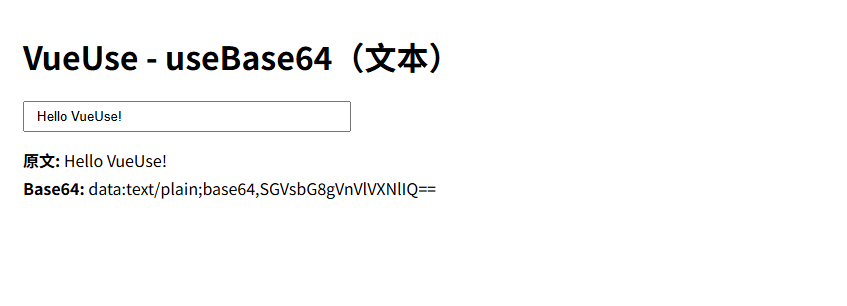
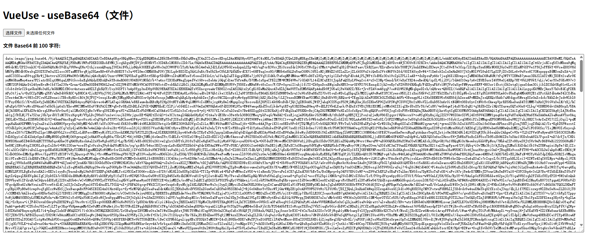
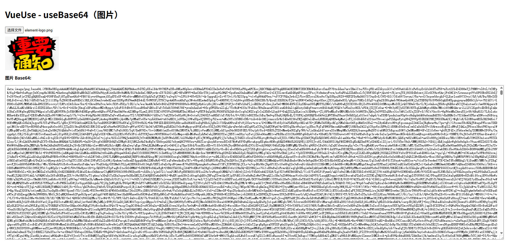

# VueUse Core

`VueUse` 是 Vue 3 生态中**最受欢迎、最实用的工具库之一**，基本是做 Vue3 + TypeScript 项目的“标配”。

`@vueuse/core` 是 Vue 生态中最常用的工具函数库之一，提供大量基于 Composition API 的 `useXxx()` 组合式函数，用来处理浏览器能力、异步、事件、状态管理、动画、网络、存储等常见逻辑。它能显著减少业务代码量，提升开发效率和可读性，支持 Vue2/3、TypeScript、SSR，函数设计一致性强，也易于拓展，是前端现代 Vue 项目必备的实用工具集。

- [官网地址](https://vueuse.org/)


## 基础配置

**安装依赖**

```
pnpm add @vueuse/core@14.1.0
```

## 常用方法

### 本地存储：`useLocalStorage`


演示如何用 `useLocalStorage` 实现一个**自动和 localStorage 同步的响应式数据**。

特点：

* 刷新页面数据不丢失
* 修改变量自动写入 localStorage
* 不需要 watch
* 不需要手写 localStorage API

```vue
<template>
  <div class="app">
    <h1>VueUse - useLocalStorage 示例</h1>

    <div class="card">
      <label>用户名：</label>
      <input v-model="username" placeholder="请输入用户名" />
    </div>

    <div class="card">
      <label>年龄：</label>
      <input type="number" v-model.number="age" />
    </div>

    <div class="card">
      <label>是否登录：</label>
      <input type="checkbox" v-model="isLogin" />
    </div>

    <div class="card">
      <button @click="reset">清空本地存储</button>
    </div>

    <div class="preview">
      <h3>当前状态（实时同步 localStorage）</h3>
      <pre>{{ state }}</pre>
    </div>
  </div>
</template>

<script setup lang="ts">
  import { computed } from 'vue'
  import { useLocalStorage } from '@vueuse/core'

  /**
   * useLocalStorage 会自动完成：
   * 1. 从 localStorage 读取初始值
   * 2. 变更时自动写入 localStorage
   * 3. 保持 Vue 响应式
   */

// 字符串
  const username = useLocalStorage<string>('demo-username', '')

  // 数字
  const age = useLocalStorage<number>('demo-age', 18)

  // 布尔
  const isLogin = useLocalStorage<boolean>('demo-isLogin', false)

  // 用于页面展示整体状态
  const state = computed(() => ({
    username: username.value,
    age: age.value,
    isLogin: isLogin.value,
  }))

  // 清空示例数据
  function reset() {
    username.value = ''
    age.value = 18
    isLogin.value = false
  }
</script>

<style scoped>
  .app {
    padding: 24px;
    font-family: sans-serif;
  }

  h1 {
    margin-bottom: 20px;
  }

  .card {
    margin-bottom: 12px;
  }

  .card label {
    display: inline-block;
    width: 80px;
  }

  .card input {
    padding: 4px 8px;
  }

  button {
    padding: 6px 12px;
    cursor: pointer;
  }

  .preview {
    margin-top: 20px;
    background: #f6f8fa;
    padding: 12px;
    border-radius: 6px;
  }

  pre {
    margin: 0;
  }
</style>
```

---

### 会话存储：`useSessionStorage`

`useSessionStorage` 和 `useLocalStorage` 的用法几乎一模一样，唯一的区别是：

> 数据只在**当前浏览器标签页会话**中有效，关闭标签页后数据自动清空。

非常适合用来存：

* 当前页面的筛选条件
* 临时表单草稿
* 多步骤表单进度
* 当前会话态登录信息

```vue
<template>
  <div class="app">
    <h1>VueUse - useSessionStorage 示例</h1>

    <p class="tip">
      提示：关闭当前浏览器标签页后重新打开，数据会消失；刷新页面数据仍然存在。
    </p>

    <div class="card">
      <label>搜索关键字：</label>
      <input v-model="keyword" placeholder="请输入搜索关键字" />
    </div>

    <div class="card">
      <label>当前页码：</label>
      <input type="number" v-model.number="page" />
    </div>

    <div class="card">
      <label>排序方式：</label>
      <select v-model="sort">
        <option value="default">默认</option>
        <option value="time">时间</option>
        <option value="hot">热度</option>
      </select>
    </div>

    <div class="card">
      <button @click="reset">清空会话数据</button>
    </div>

    <div class="preview">
      <h3>当前 Session 状态（实时同步 sessionStorage）</h3>
      <pre>{{ state }}</pre>
    </div>
  </div>
</template>

<script setup lang="ts">
  import { computed } from 'vue'
  import { useSessionStorage } from '@vueuse/core'

  /**
   * useSessionStorage 特点：
   * 1. 基于 sessionStorage
   * 2. 刷新页面数据仍然存在
   * 3. 关闭标签页后数据消失
   * 4. 与 Vue 响应式系统完全打通
   */

// 搜索关键字
  const keyword = useSessionStorage<string>('demo-keyword', '')

  // 当前页码
  const page = useSessionStorage<number>('demo-page', 1)

  // 排序方式
  const sort = useSessionStorage<string>('demo-sort', 'default')

  // 页面展示整体状态
  const state = computed(() => ({
    keyword: keyword.value,
    page: page.value,
    sort: sort.value,
  }))

  // 重置会话数据
  function reset() {
    keyword.value = ''
    page.value = 1
    sort.value = 'default'
  }
</script>

<style scoped>
  .app {
    padding: 24px;
    font-family: sans-serif;
  }

  h1 {
    margin-bottom: 12px;
  }

  .tip {
    color: #666;
    margin-bottom: 16px;
    font-size: 14px;
  }

  .card {
    margin-bottom: 12px;
  }

  .card label {
    display: inline-block;
    width: 100px;
  }

  .card input,
  .card select {
    padding: 4px 8px;
  }

  button {
    padding: 6px 12px;
    cursor: pointer;
  }

  .preview {
    margin-top: 20px;
    background: #f6f8fa;
    padding: 12px;
    border-radius: 6px;
  }

  pre {
    margin: 0;
  }
</style>
```

---

### 防抖 / 节流：`useDebounceFn`、`useThrottleFn`

* 防抖（Debounce）：停止操作一段时间后才执行
  → 适合搜索框、输入联想
* 节流（Throttle）：固定时间内只执行一次
  → 适合按钮点击、防止重复提交、滚动监听

```vue
<template>
  <div class="app">
    <h1>VueUse - 防抖 & 节流</h1>

    <!-- 防抖示例 -->
    <div class="card">
      <h2>防抖（useDebounceFn）</h2>
      <p>停止输入 800ms 后才会触发“搜索”</p>
      <input
          v-model="keyword"
          placeholder="输入搜索内容"
          @input="onInput"
      />
      <p>搜索触发次数：{{ debounceCount }}</p>
      <p>最后一次搜索内容：{{ lastSearch }}</p>
    </div>

    <!-- 节流示例 -->
    <div class="card">
      <h2>节流（useThrottleFn）</h2>
      <p>连续点击按钮，每 1000ms 只执行一次</p>
      <button @click="onClick">疯狂点击我</button>
      <p>实际执行次数：{{ throttleCount }}</p>
      <p>最后一次执行时间：{{ lastClickTime }}</p>
    </div>
  </div>
</template>

<script setup lang="ts">
  import { ref } from 'vue'
  import { useDebounceFn, useThrottleFn } from '@vueuse/core'

  /**
   * 防抖：
   * 连续触发时只会在最后一次触发结束后执行
   */
  const keyword = ref('')
  const debounceCount = ref(0)
  const lastSearch = ref('')

  const doSearch = () => {
    debounceCount.value++
    lastSearch.value = keyword.value
  }

  const onInput = useDebounceFn(doSearch, 800)

  /**
   * 节流：
   * 在固定时间间隔内只允许执行一次
   */
  const throttleCount = ref(0)
  const lastClickTime = ref('')

  const doClick = () => {
    throttleCount.value++
    lastClickTime.value = new Date().toLocaleTimeString()
  }

  const onClick = useThrottleFn(doClick, 1000)
</script>

<style scoped>
  .app {
    padding: 24px;
    font-family: sans-serif;
  }

  .card {
    padding: 16px;
    margin-bottom: 20px;
    border: 1px solid #ddd;
    border-radius: 8px;
  }

  input {
    padding: 6px 10px;
    width: 200px;
  }

  button {
    padding: 6px 12px;
    cursor: pointer;
  }
</style>
```

---

### 数字滚动：`useTransition`

数字滚动（类似大屏数字翻牌效果）

适用场景：

- 金额增长
- 统计数字动画
- 仪表盘数据变化

```vue
<template>
  <div class="counter">
    {{ Math.floor(displayValue) }}
  </div>

  <button @click="changeValue">变更数字</button>
</template>

<script setup lang="ts">
import { ref } from 'vue';
import { useTransition } from '@vueuse/core';

const source = ref(0);

const displayValue = useTransition(source, {
  duration: 1000,
  easing: [0.4, 0, 0.2, 1],
});

const changeValue = () => {
  source.value = Math.floor(Math.random() * 10000);
};
</script>

<style scoped>
.counter {
  font-size: 48px;
  font-weight: bold;
}
</style>
```

### 窗口大小：`useWindowSize`

这个 Hook 用来实时获取浏览器窗口的宽度和高度，是做：

* 响应式布局
* 大屏系统
* 移动端 / PC 适配
* 图表自适应

最核心的能力：不用写 `resize` 事件监听，宽高天然就是响应式的。

```vue
<template>
  <div class="app">
    <h1>VueUse - useWindowSize</h1>

    <div class="info">
      <p>窗口宽度：{{ width }} px</p>
      <p>窗口高度：{{ height }} px</p>
    </div>

    <div class="box" :class="layoutClass">
      <span>{{ layoutText }}</span>
    </div>

    <p class="tip">
      拖动浏览器窗口大小，观察上方数值与下方区域样式变化。
    </p>
  </div>
</template>

<script setup lang="ts">
  import { computed } from 'vue'
  import { useWindowSize } from '@vueuse/core'

  /**
   * useWindowSize 会返回两个响应式 Ref：
   * - width：窗口宽度
   * - height：窗口高度
   */
  const { width, height } = useWindowSize()

  /**
   * 根据窗口宽度动态切换布局状态
   */
  const layoutClass = computed(() => {
    if (width.value < 600) {
      return 'mobile'
    }
    if (width.value < 1024) {
      return 'tablet'
    }
    return 'desktop'
  })

  const layoutText = computed(() => {
    if (width.value < 600) {
      return '当前为：移动端布局'
    }
    if (width.value < 1024) {
      return '当前为：平板布局'
    }
    return '当前为：桌面端布局'
  })
</script>

<style scoped>
  .app {
    padding: 24px;
    font-family: sans-serif;
  }

  .info {
    background: #f6f8fa;
    padding: 12px;
    border-radius: 6px;
    margin-bottom: 16px;
  }

  .box {
    height: 120px;
    display: flex;
    align-items: center;
    justify-content: center;
    border-radius: 8px;
    font-size: 18px;
    color: white;
  }

  /* 移动端 */
  .mobile {
    background: #42b883;
  }

  /* 平板 */
  .tablet {
    background: #409eff;
  }

  /* 桌面端 */
  .desktop {
    background: #67c23a;
  }

  .tip {
    margin-top: 16px;
    color: #666;
  }
</style>
```

---

### 滚动监听：`useScroll`

`useScroll` 用来实时获取滚动容器的滚动位置，非常适合：

* 列表滚动加载
* 返回顶部按钮
* 滚动进度条
* 大屏滚动联动效果

下面是一个完整可运行的 `App.vue` 示例：

* 左侧是可滚动容器
* 右侧实时显示 `x / y` 滚动距离
* 滚动超过 200px 给出状态提示

```vue
<template>
  <div class="app">
    <h1>VueUse - useScroll</h1>

    <div class="container">
      <!-- 可滚动区域 -->
      <div ref="scrollRef" class="scroll-box">
        <div
            v-for="n in 50"
            :key="n"
            class="item"
        >
          列表项 {{ n }}
        </div>
      </div>

      <!-- 状态面板 -->
      <div class="panel">
        <p>横向滚动 x：{{ x }} px</p>
        <p>纵向滚动 y：{{ y }} px</p>
        <p>是否滚动超过 200px：{{ isOver200 ? '是' : '否' }}</p>
      </div>
    </div>

    <!-- 返回顶部按钮 -->
    <button
        v-if="isOver200"
        class="back-top"
        @click="scrollToTop"
    >
      ↑ 返回顶部
    </button>
  </div>
</template>

<script setup lang="ts">
  import { ref, computed } from 'vue'
  import { useScroll } from '@vueuse/core'

  /**
   * 1. 定义一个滚动容器 ref
   */
  const scrollRef = ref<HTMLElement | null>(null)

  /**
   * 2. useScroll 监听该容器的滚动
   *    x、y 都是响应式 Ref
   */
  const { x, y } = useScroll(scrollRef)

  /**
   * 3. 根据滚动距离派生业务状态
   */
  const isOver200 = computed(() => y.value > 200)

  /**
   * 4. 返回顶部
   */
  const scrollToTop = () => {
    scrollRef.value?.scrollTo({
      top: 0,
      behavior: "smooth",
    })
  }
</script>

<style scoped>
  .app {
    padding: 24px;
    font-family: sans-serif;
  }

  .container {
    display: flex;
    gap: 20px;
  }

  /* 可滚动区域 */
  .scroll-box {
    width: 300px;
    height: 400px;
    border: 1px solid #ddd;
    overflow-y: auto;
    padding: 8px;
    box-sizing: border-box;
  }

  /* 列表项 */
  .item {
    height: 40px;
    line-height: 40px;
    border-bottom: 1px solid #eee;
    padding-left: 8px;
  }

  /* 状态面板 */
  .panel {
    flex: 1;
    background: #f6f8fa;
    padding: 12px;
    border-radius: 6px;
  }

  /* 返回顶部 */
  .back-top {
    position: fixed;
    right: 40px;
    bottom: 40px;
    padding: 8px 14px;
    border: none;
    border-radius: 4px;
    background: #409eff;
    color: white;
    cursor: pointer;
  }
</style>
```

---

### 剪贴板：`useClipboard`

`useClipboard` 用于与系统剪贴板交互，最常见场景：

* 一键复制文本
* 复制链接
* 复制代码片段
* 显示复制成功状态

```vue
<template>
  <div class="app">
    <h1>VueUse - useClipboard</h1>

    <div class="card">
      <label>待复制内容：</label>
      <textarea
          v-model="text"
          placeholder="请输入要复制的内容"
      ></textarea>
    </div>

    <div class="card">
      <button @click="copyText">复制到剪贴板</button>
      <span
          v-if="copied"
          class="success"
      >
        复制成功！
      </span>
    </div>

    <div class="preview">
      <h3>当前剪贴板内容（只读）</h3>
      <pre>{{ clipboardText }}</pre>
    </div>
  </div>
</template>

<script setup lang="ts">
  import { ref } from 'vue'
  import { useClipboard } from '@vueuse/core'

  /**
   * useClipboard 提供：
   * - copy：写入剪贴板
   * - copied：复制成功的响应式状态
   * - text：当前剪贴板文本内容（只读）
   */
  const { copy, copied, text: clipboardText } = useClipboard()

  const text = ref('Hello VueUse! 这是一个剪贴板示例')

  /**
   * 复制文本到剪贴板
   */
  function copyText() {
    copy(text.value)
  }
</script>

<style scoped>
  .app {
    padding: 24px;
    font-family: sans-serif;
  }

  .card {
    margin-bottom: 16px;
  }

  label {
    display: block;
    margin-bottom: 6px;
  }

  textarea {
    width: 100%;
    height: 80px;
    padding: 6px;
    box-sizing: border-box;
  }

  button {
    padding: 6px 12px;
    cursor: pointer;
  }

  .success {
    margin-left: 12px;
    color: #67c23a;
    font-weight: bold;
  }

  .preview {
    margin-top: 20px;
    background: #f6f8fa;
    padding: 12px;
    border-radius: 6px;
  }

  pre {
    margin: 0;
  }
</style>
```

---

### 暗黑模式：`useDark`、`useToggle`

`useDark` 专门用来做暗黑模式状态管理，
`useToggle` 用来优雅地切换布尔值状态。
两个组合起来，几乎是 Vue3 项目暗黑模式的标准写法。

特点：

* 自动监听系统主题
* 自动给 `html` 添加 `class="dark"`
* 状态响应式
* 刷新页面仍然生效（默认走 localStorage）

```vue
<template>
  <div class="app" :class="{ dark: isDark }">
    <h1>VueUse - 暗黑模式</h1>

    <div class="card">
      <p>当前模式：{{ isDark ? '暗黑模式' : '明亮模式' }}</p>
      <button @click="toggle">
        切换模式
      </button>
    </div>

    <div class="box">
      这是一个根据暗黑模式自动变色的区域
    </div>
  </div>
</template>

<script setup lang="ts">
  import { useDark, useToggle } from '@vueuse/core'

  /**
   * useDark：
   * - 返回一个 Ref<boolean>
   * - true = 暗黑模式
   * - false = 明亮模式
   * - 默认使用 localStorage 持久化
   * - 默认在 html 上加 dark class
   */
  const isDark = useDark()

  /**
   * useToggle：
   * - 专门用来切换 boolean
   */
  const toggleDark = useToggle(isDark)

  const toggle = () => toggleDark()
</script>

<style scoped>
  .app {
    padding: 24px;
    min-height: 100vh;
    background: #ffffff;
    color: #333;
    transition: all 0.3s;
  }

  /* 暗黑模式 */
  .app.dark {
    background: #121212;
    color: #e5e5e5;
  }

  .card {
    margin-bottom: 16px;
  }

  button {
    padding: 6px 12px;
    cursor: pointer;
  }

  .box {
    padding: 20px;
    border-radius: 8px;
    background: #f0f0f0;
    transition: all 0.3s;
  }

  /* 暗黑下的盒子 */
  .app.dark .box {
    background: #1e1e1e;
  }
</style>
```

---

### 网络状态：`useNetwork`

`useNetwork` 用来获取当前设备的网络状态信息，常用于：

* 判断是否在线/离线
* 弱网提示
* 离线模式处理
* 大文件上传前的网络检测

注意：部分字段在不同浏览器中支持程度不同，但 `isOnline` 基本都可用。

```vue
<template>
  <div class="app">
    <h1>VueUse - useNetwork</h1>

    <div class="status" :class="{ offline: !isOnline }">
      当前网络状态：
      <strong>{{ isOnline ? '在线' : '离线' }}</strong>
    </div>

    <div class="card">
      <p>网络类型：{{ type || '未知' }}</p>
      <p>有效网络类型：{{ effectiveType || '未知' }}</p>
      <p>下行速度：{{ downlink ? downlink + ' Mb/s' : '未知' }}</p>
      <p>往返延迟 RTT：{{ rtt ? rtt + ' ms' : '未知' }}</p>
      <p>是否开启省流量模式：{{ saveData ? '是' : '否' }}</p>
    </div>

    <div class="tip">
      <p>提示：</p>
      <ul>
        <li>断开网络或切换网络类型，以上数据会实时变化</li>
        <li>某些字段在 Safari 或旧版浏览器中可能为 undefined</li>
      </ul>
    </div>
  </div>
</template>

<script setup lang="ts">
  import { useNetwork } from '@vueuse/core'

  /**
   * useNetwork 返回一个响应式对象，包含：
   * - isOnline：是否在线
   * - type：网络类型（wifi / cellular 等）
   * - effectiveType：网络质量（4g / 3g / slow-2g）
   * - downlink：下行速度（Mb/s）
   * - rtt：往返延迟（ms）
   * - saveData：是否开启省流量模式
   */
  const {
    isOnline,
    type,
    effectiveType,
    downlink,
    rtt,
    saveData,
  } = useNetwork()
</script>

<style scoped>
  .app {
    padding: 24px;
    font-family: sans-serif;
  }

  .status {
    padding: 12px;
    border-radius: 6px;
    margin-bottom: 16px;
    background: #f0f9eb;
    color: #67c23a;
    font-size: 18px;
  }

  /* 离线状态 */
  .status.offline {
    background: #fef0f0;
    color: #f56c6c;
  }

  .card {
    background: #f6f8fa;
    padding: 16px;
    border-radius: 6px;
    line-height: 1.8;
  }

  .tip {
    margin-top: 16px;
    color: #666;
    font-size: 14px;
  }
</style>
```

---

### 鼠标位置：`useMouse`

`useMouse` 用来实时获取鼠标在页面中的坐标位置，是做：

* 交互特效
* 悬浮提示
* 跟随动画
* 数据大屏鼠标联动

最直观的效果：
页面上有一个小圆点，始终跟着你的鼠标移动，同时实时显示坐标值。

```vue
<template>
  <div class="app">
    <h1>VueUse - useMouse</h1>

    <div class="info">
      <p><b>page</b>   X: {{ pageX }}   Y: {{ pageY }}</p>
      <p><b>client</b> X: {{ clientX }} Y: {{ clientY }}</p>
      <p><b>screen</b> X: {{ screenX }} Y: {{ screenY }}</p>
      <p><b>movement</b> X: {{ movX }}   Y: {{ movY }}</p>
    </div>

    <!-- 用 client 坐标跟随鼠标 -->
    <div
        class="cursor"
        :style="{
        left: clientX + 'px',
        top: clientY + 'px'
      }"
    ></div>

    <p class="tip">
      滚动页面、移动鼠标、切换窗口观察不同模式的差异。
    </p>
  </div>
</template>

<script setup lang="ts">
  import { useMouse } from '@vueuse/core'

  // page 相对于页面（受滚动影响）
  const { x: pageX, y: pageY } = useMouse({ type: 'page' })

  // client 相对于视口（不受滚动影响）
  const { x: clientX, y: clientY } = useMouse({ type: 'client' })

  // screen 相对于物理屏幕
  const { x: screenX, y: screenY } = useMouse({ type: 'screen' })

  // movement 相对上次事件的偏移量
  const { x: movX, y: movY } = useMouse({ type: 'movement' })
</script>

<style scoped>
  .app {
    padding: 24px;
    min-height: 200vh; /* 增加页面高度方便滚动 */
    font-family: sans-serif;
    position: relative;
  }

  .info {
    background: #f6f8fa;
    padding: 12px;
    border-radius: 6px;
    width: 280px;
    line-height: 1.6;
    margin-bottom: 20px;
  }

  /* 跟随鼠标的小圆点 */
  .cursor {
    position: fixed;
    width: 14px;
    height: 14px;
    background: #409eff;
    border-radius: 50%;
    transform: translate(-50%, -50%);
    pointer-events: none;
    z-index: 9999;
  }

  .tip {
    margin-top: 16px;
    color: #666;
  }
</style>
```

---

### Base64：`useBase64`

#### 文本 Base64：`useBase64`（字符串编码）

`useBase64` 可以将响应式字符串实时转换为 Base64，适用于：

- 数据加密展示
- API 调试
- 剪贴板操作
- 实时编码预览

```vue
<template>
  <div class="app">
    <h1>VueUse - useBase64（文本）</h1>

    <input v-model="text" placeholder="输入文本" />

    <div class="result">
      <p><b>原文:</b> {{ text }}</p>
      <p><b>Base64:</b> {{ base64 }}</p>
    </div>
  </div>
</template>

<script setup lang="ts">
import { ref } from 'vue'
import { useBase64 } from '@vueuse/core'

// 响应式文本
const text = ref('Hello VueUse!')

// 将文本转换为 Base64
const { base64 } = useBase64(text)
</script>

<style scoped>
.app {
  padding: 24px;
  font-family: sans-serif;
}
input {
  width: 300px;
  padding: 6px 12px;
  margin-bottom: 12px;
}
.result p {
  margin: 4px 0;
}
</style>
```



------

#### 文件 Base64：`useBase64`（File/Blob 编码）

可以将用户上传的文件转换成 Base64，常用于：

- 文件预览
- 上传前编码
- 图片剪贴板操作

```vue
<template>
  <div class="app">
    <h1>VueUse - useBase64（文件）</h1>

    <input type="file" @change="onFileChange" />
    <div class="result" v-if="base64">
      <p><b>文件 Base64:</b></p>
      <textarea :value="base64" rows="40" readonly></textarea>
    </div>
  </div>
</template>

<script setup lang="ts">
import { ref } from 'vue'
import { useBase64 } from '@vueuse/core'

// 这里用 Ref<File>，初始化为空对象，但保证 TS 不报错
const file = ref<File>({} as File)
const { base64, execute } = useBase64(file)

// 用户选择文件
const onFileChange = async (e: Event) => {
  const input = e.target as HTMLInputElement
  const selectedFile = input.files?.[0]
  if (!selectedFile) return

  // 更新 Ref
  file.value = selectedFile
  await execute()
}
</script>

<style scoped>
.app {
  padding: 24px;
  font-family: sans-serif;
}
textarea {
  width: 100%;
  padding: 6px;
  font-size: 12px;
}
</style>
```



------

#### 图片预览 Base64：`useBase64`（Image 元素）

可以将 `` 或 `<canvas>` 元素转 Base64，用于：

- 图片上传前预览
- 图像处理
- 保存到 localStorage

```vue
<template>
  <div class="app">
    <h1>VueUse - useBase64（图片）</h1>

    <input type="file" accept="image/*" @change="onImageChange" />
    

    <div class="result" v-if="base64">
      <p><b>图片 Base64:</b></p>
      <textarea :value="base64" rows="40" readonly></textarea>
    </div>
  </div>
</template>

<script setup lang="ts">
import { nextTick, ref } from 'vue'
import { useBase64 } from '@vueuse/core'

// 初始化为 {} as HTMLImageElement 保证 TS 不报错
const imgEl = ref<HTMLImageElement>({} as HTMLImageElement)
const { base64, execute } = useBase64(imgEl)

// 图片 src
const imgSrc = ref('')

// 图片选择事件
const onImageChange = async (e: Event) => {
  const input = e.target as HTMLInputElement
  const file = input.files?.[0]
  if (!file) return

  imgSrc.value = URL.createObjectURL(file)

  // 等待 img 渲染完成再执行 Base64
  await nextTick()
  // imgEl.value 已绑定到 template 中的 ref
  await execute()
}
</script>

<style scoped>
.app {
  padding: 24px;
  font-family: sans-serif;
}
.preview {
  display: block;
  max-width: 200px;
  margin: 12px 0;
}
textarea {
  width: 100%;
  padding: 6px;
  font-size: 12px;
}
</style>
```



------

### 请求封装：`useFetch`

`useFetch` 是 VueUse 中非常“工程化”的一个 Hook，用来做：

* HTTP 请求
* loading / error 状态管理
* GET / POST 请求
* 响应式数据绑定
* 请求链式配置

这里用一个**完整页面**演示三个点：

1. GET 请求获取数据
2. POST 请求提交数据
3. 显示 loading、error、result

```vue
<template>
  <div class="app">
    <h1>VueUse - useFetch</h1>

    <!-- GET 示例 -->
    <div class="card">
      <h2>GET 请求</h2>
      <button @click="loadGet">发送 GET 请求</button>

      <p v-if="getLoading">请求中...</p>
      <p v-if="getError" class="error">请求失败：{{ getError }}</p>

      <pre v-if="getData">{{ getData }}</pre>
    </div>

    <!-- POST 示例 -->
    <div class="card">
      <h2>POST 请求</h2>

      <div class="form">
        <input v-model="postTitle" placeholder="标题" />
        <input v-model="postBody" placeholder="内容" />
      </div>

      <button @click="loadPost">发送 POST 请求</button>

      <p v-if="postLoading">请求中...</p>
      <p v-if="postError" class="error">请求失败：{{ postError }}</p>

      <pre v-if="postData">{{ postData }}</pre>
    </div>
  </div>
</template>

<script setup lang="ts">
  import { ref } from 'vue'
  import { useFetch } from '@vueuse/core'

  /**
   * 这里使用公开测试接口：https://jsonplaceholder.typicode.com
   * 只用于演示，不依赖任何框架和额外库
   */

  /* ---------------- GET 请求 ---------------- */

  const {
    data: getData,
    error: getError,
    isFetching: getLoading,
    execute: executeGet,
  } = useFetch('https://jsonplaceholder.typicode.com/posts/1', {
    immediate: false,
  }).get().json()

  function loadGet() {
    executeGet()
  }

  /* ---------------- POST 请求 ---------------- */

  const postTitle = ref('')
  const postBody = ref('')

  const {
    data: postData,
    error: postError,
    isFetching: postLoading,
    execute: executePost,
  } = useFetch('https://jsonplaceholder.typicode.com/posts', {
    immediate: false,
  })
      .post({
        title: postTitle.value,
        body: postBody.value,
        userId: 1,
      })
      .json()

  function loadPost() {
    executePost()
  }
</script>

<style scoped>
  .app {
    padding: 24px;
    font-family: sans-serif;
  }

  .card {
    padding: 16px;
    margin-bottom: 24px;
    border: 1px solid #ddd;
    border-radius: 8px;
  }

  .form {
    display: flex;
    gap: 8px;
    margin-bottom: 12px;
  }

  input {
    padding: 6px 10px;
    flex: 1;
  }

  button {
    padding: 6px 12px;
    cursor: pointer;
  }

  .error {
    color: #f56c6c;
    font-weight: bold;
  }

  pre {
    background: #f6f8fa;
    padding: 12px;
    border-radius: 6px;
    overflow: auto;
  }
</style>
```

---

### WebSocket 响应式通信：`useWebSocket`

`useWebSocket` 是 VueUse 对原生 WebSocket 的**工程级封装**，把：

* 连接状态
* 收发消息
* 自动重连
* 心跳检测
* 错误处理

全部变成响应式数据和可控 API。

你不用再写一大堆：

```ts
const ws = new WebSocket(url)
ws.onopen = ...
ws.onmessage = ...
ws.onclose = ...
```

而是直接用：

```ts
const { status, data, send, open, close } = useWebSocket(url)
```

在真实项目中典型场景：

* 即时聊天
* 实时日志 / 监控
* 股票 / 行情推送
* AI 流式输出
* 后台系统实时通知

---

下面这个示例用的是 **公开 WebSocket 测试服务**：
`wss://ws.postman-echo.com/raw`
（它会把你发的消息原样返回，非常适合做 Demo）

#### 最简版

```vue
<script setup lang="ts">
  import { ref } from 'vue'
  import { useWebSocket } from '@vueuse/core'

  const WS_URL = 'wss://ws.postman-echo.com/raw'

  const message = ref('')
  const messages = ref<string[]>([])

  const {
    status,
    send,
    open,
    close,
  } = useWebSocket(WS_URL, {
    autoReconnect: {
      retries: 3,
      delay: 2000,
    },
    heartbeat: {
      message: 'ping',
      interval: 10000,
    },
    onMessage(_, event) {
      handleServerMessage(event.data)
    },
  })

  /**
   * 单独处理服务端消息的业务函数
   *
   * @param msg 服务端的消息
   */
  function handleServerMessage(msg: string) {
    messages.value.push(`服务端：${msg}`)
  }

  /**
   * 发送消息
   */
  const sendMessage = () => {
    if (!message.value) return
    send(message.value)
    messages.value.push(`我：${message.value}`)
    message.value = ''
  }

  /**
   * 主动断开
   */
  const handleDisconnect = () => {
    close(1000, 'manual close')
  }
</script>

<template>
  <div class="container">
    <h1>useWebSocket（WebSocket 响应式通信）</h1>

    <div class="card">
      <h2>连接状态</h2>
      <p>
        当前状态：
        <span :class="{ open: status === 'OPEN', close: status !== 'OPEN' }">
          {{ status }}
        </span>
      </p>
      <button @click="open">手动连接</button>
      <button @click="handleDisconnect">断开连接</button>
    </div>

    <div class="card">
      <h2>发送消息</h2>
      <input
          v-model="message"
          placeholder="输入要发送的内容"
          class="input"
          @keyup.enter="sendMessage"
      />
      <button @click="sendMessage">发送</button>
    </div>

    <div class="card">
      <h2>消息记录</h2>
      <div class="log">
        <div v-for="(item, index) in messages" :key="index" class="log-item">
          {{ item }}
        </div>
      </div>
    </div>
  </div>
</template>

<style scoped>
  .container {
    padding: 24px;
    font-family: Arial, Helvetica, sans-serif;
  }

  .card {
    border: 1px solid #dcdcdc;
    border-radius: 6px;
    padding: 16px;
    margin-bottom: 16px;
  }

  .open {
    color: #67c23a;
    font-weight: bold;
  }

  .close {
    color: #f56c6c;
    font-weight: bold;
  }

  .input {
    width: 70%;
    padding: 6px 10px;
    border: 1px solid #dcdcdc;
    border-radius: 4px;
    margin-right: 8px;
  }

  button {
    padding: 6px 14px;
    border: none;
    border-radius: 4px;
    background-color: #409eff;
    color: #ffffff;
    cursor: pointer;
  }

  button:hover {
    opacity: 0.9;
  }

  .log {
    max-height: 200px;
    overflow-y: auto;
    background-color: #f8f8f8;
    padding: 10px;
    border-radius: 4px;
  }

  .log-item {
    font-size: 14px;
    margin-bottom: 4px;
  }

  .tip {
    background-color: #f8f8f8;
  }
</style>
```

#### 详细版

```vue
<script setup lang="ts">
  import { ref, computed } from 'vue'
  import { useWebSocket } from '@vueuse/core'

  const WS_URL = 'wss://ws.postman-echo.com/raw'

  const message = ref('')
  const logs = ref<string[]>([])

  const {
    status,
    send,
    open,
    close,
  } = useWebSocket(WS_URL, {
    // 初始化自动连接（默认 true）
    immediate: true,

    // 指定 WebSocket 子协议（常用于 JWT 或消息订阅协议）
    // protocols: ['token-xxxx', 'v1'],
    protocols: [],

    // 断线自动重连策略
    autoReconnect: {
      retries: 5,       // 最大重连次数
      delay: 2000,      // 固定延迟
      // 以下可实现指数退避策略：
      // delay: retryCount => Math.min(2000 * retryCount, 10000),
      onFailed() {
        appendLog('重连失败：已超过最大次数')
      },
    },

    // 心跳机制（Ping-Pong）
    heartbeat: {
      message: 'ping',
      interval: 8000,
    },

    // 打开连接回调
    onConnected(_) {
      appendLog('WebSocket 连接成功！')
    },

    // 关闭连接回调
    onDisconnected(_, event) {
      appendLog(`连接断开：code=${event.code} reason=${event.reason}`)
    },

    // 错误回调
    onError(_, event) {
      appendLog(`WebSocket 错误：${event}`)
    },

    // 收到消息
    onMessage(_, event) {
      handleServerMessage(event.data)
    },
  })

  /** 处理服务端消息 */
  function handleServerMessage(msg: string) {
    if (msg === 'pong') {
      appendLog('收到心跳响应：pong')
      return
    }
    appendLog(`服务端：${msg}`)
  }

  /** 追加日志 */
  function appendLog(text: string) {
    const time = new Date().toLocaleTimeString()
    logs.value.push(`[${time}] ${text}`)
    // 自动滚动到底部（可选）
    requestAnimationFrame(() => {
      const el = document.querySelector('.log')
      el && (el.scrollTop = el.scrollHeight)
    })
  }

  /** 手动发送 */
  const sendMessage = () => {
    if (!message.value) return
    send(message.value)
    appendLog(`我：${message.value}`)
    message.value = ''
  }

  /** 手动断开 */
  const handleDisconnect = () => {
    close(1000, 'manual close')
  }

  /** 连接状态友好提示 */
  const statusText = computed(() => {
    switch (status.value) {
      case 'OPEN': return '🟢 已连接'
      case 'CONNECTING': return '🟡 连接中...'
      case 'CLOSED': return '🔴 已关闭'
      default: return status.value
    }
  })
</script>

<template>
  <div class="container">
    <h1>useWebSocket（高级配置版）</h1>

    <div class="card">
      <h2>连接状态</h2>
      <p>{{ statusText }}</p>
      <button @click="open">手动连接</button>
      <button @click="handleDisconnect">断开连接</button>
    </div>

    <div class="card">
      <h2>发送消息</h2>
      <input v-model="message" placeholder="输入内容 回车发送" @keyup.enter="sendMessage" class="input" />
      <button @click="sendMessage">发送</button>
    </div>

    <div class="card">
      <h2>消息日志</h2>
      <div class="log">
        <div v-for="(item, index) in logs" :key="index" class="log-item">
          {{ item }}
        </div>
      </div>
    </div>
  </div>
</template>

<style scoped>
  .container {
    padding: 24px;
    font-family: Arial, Helvetica, sans-serif;
  }
  .card {
    border: 1px solid #dcdcdc;
    border-radius: 6px;
    padding: 16px;
    margin-bottom: 16px;
  }
  .input {
    width: 70%;
    padding: 6px 10px;
    border: 1px solid #dcdcdc;
    margin-right: 8px;
  }
  button {
    padding: 6px 14px;
    border: none;
    border-radius: 4px;
    background-color: #409eff;
    color: #fff;
    cursor: pointer;
  }
  button:hover {
    opacity: 0.9;
  }
  .log {
    height: 220px;
    overflow-y: auto;
    background-color: #f6f6f6;
    padding: 8px;
  }
  .log-item {
    font-size: 13px;
    margin-bottom: 4px;
    font-family: monospace;
  }
</style>
```

#### 携带认证

✔ **1. URL Query 携带 Token**

```
useWebSocket(`wss://xxx.com/ws?token=${token}`)
```

✔ **2. 子协议携带 Token**

```
useWebSocket('wss://xxx.com/ws', {
  protocols: [`Bearer`, token]
})
```

✔ **3. 首包认证**

```
onConnected() {
  send(JSON.stringify({ type: 'AUTH', token }))
}
```

---

## 浏览器相关（非常常用）

### useEventListener（DOM 事件监听封装）

用于替代原生的：

```ts
window.addEventListener(...)
window.removeEventListener(...)
```

它的优势是：

* 自动在组件卸载时移除监听
* 支持 window / document / DOM / ref
* 与 Vue3 响应式系统天然结合
* 写法简洁，工程中极高频使用

常见场景：

* 监听鼠标、键盘事件
* 监听窗口 resize、scroll
* 监听自定义 DOM 行为
* 组件级事件管理

---

下面才是完整示例（App.vue 可直接运行）：

```vue
<script setup lang="ts">
  import { ref } from 'vue'
  import { useEventListener } from '@vueuse/core'

  const x = ref(0)
  const y = ref(0)
  const clickCount = ref(0)

  useEventListener(window, 'mousemove', (event: MouseEvent) => {
    x.value = event.clientX
    y.value = event.clientY
  })

  useEventListener(window, 'click', () => {
    clickCount.value++
  })
</script>

<template>
  <div class="container">
    <h1>useEventListener（DOM 事件监听封装）</h1>

    <div class="card">
      <h2>鼠标实时坐标</h2>
      <p>X：{{ x }}</p>
      <p>Y：{{ y }}</p>
    </div>

    <div class="card">
      <h2>全局点击次数</h2>
      <p>{{ clickCount }}</p>
      <button @click="clickCount = 0">重置计数</button>
    </div>
  </div>
</template>

<style scoped>
  .container {
    padding: 24px;
    font-family: Arial, Helvetica, sans-serif;
  }
  .card {
    border: 1px solid #dcdcdc;
    border-radius: 6px;
    padding: 16px;
    margin-bottom: 16px;
  }
  button {
    padding: 6px 14px;
    border: none;
    border-radius: 4px;
    background-color: #409eff;
    color: #ffffff;
    cursor: pointer;
  }
</style>
```

---

### useBreakpoints（响应式断点系统）

`useBreakpoints` 用来构建**工程级的响应式断点体系**，比单纯监听 `window.innerWidth` 更优雅、更语义化。
它的核心价值是：**把屏幕尺寸判断从“数值比较”升级为“业务语义判断”**。

你以后不会再写：

```ts
if (window.innerWidth < 768) { ... }
```

而是写：

```ts
if (isMobile.value) { ... }
```

这在真实项目里可读性和可维护性会高很多。

常见应用场景：

* 移动端 / PC 端布局切换
* 是否显示侧边栏
* 响应式组件尺寸
* 适配大屏、平板、手机
* UI 行为差异化处理

---

下面是完整示例（直接放到 `App.vue` 可运行）：

```vue
<script setup lang="ts">
  import { computed } from 'vue'
  import { useBreakpoints } from '@vueuse/core'

  /**
   * 定义断点规则（可以完全按你的项目设计稿来）
   */
  const breakpoints = useBreakpoints({
    mobile: 0,       // 0px 以上
    tablet: 768,     // 768px 以上
    laptop: 1024,    // 1024px 以上
    desktop: 1280,   // 1280px 以上
  })

  /**
   * 语义化断点状态
   */
  const isMobile = breakpoints.smaller('tablet')
  const isTablet = breakpoints.between('tablet', 'laptop')
  const isLaptop = breakpoints.between('laptop', 'desktop')
  const isDesktop = breakpoints.greater('desktop')

  /**
   * 当前设备类型描述
   */
  const deviceType = computed(() => {
    if (isMobile.value) return '手机'
    if (isTablet.value) return '平板'
    if (isLaptop.value) return '笔记本'
    if (isDesktop.value) return '桌面大屏'
    return '未知'
  })
</script>

<template>
  <div class="container">
    <h1>useBreakpoints（响应式断点系统）</h1>

    <div class="card">
      <h2>当前设备类型</h2>
      <p class="device">{{ deviceType }}</p>
    </div>

    <div class="card">
      <h2>断点状态</h2>
      <ul>
        <li>isMobile：{{ isMobile }}</li>
        <li>isTablet：{{ isTablet }}</li>
        <li>isLaptop：{{ isLaptop }}</li>
        <li>isDesktop：{{ isDesktop }}</li>
      </ul>
    </div>

    <div class="card layout">
      <h2>模拟响应式布局</h2>
      <div
          class="box"
          :class="{
          mobile: isMobile,
          tablet: isTablet,
          laptop: isLaptop,
          desktop: isDesktop
        }"
      >
        {{ deviceType }} 布局
      </div>
    </div>

    <div class="card tip">
      <h2>说明</h2>
      <ul>
        <li>useBreakpoints 把尺寸判断转成语义判断</li>
        <li>所有断点都是响应式的，窗口变化自动更新</li>
        <li>非常适合用来做布局、菜单、组件尺寸适配</li>
        <li>建议在真实项目中统一一份断点配置</li>
      </ul>
    </div>
  </div>
</template>

<style scoped>
  .container {
    padding: 24px;
    font-family: Arial, Helvetica, sans-serif;
  }

  h1 {
    margin-bottom: 20px;
  }

  .card {
    border: 1px solid #dcdcdc;
    border-radius: 6px;
    padding: 16px;
    margin-bottom: 16px;
  }

  .card h2 {
    margin: 0 0 12px 0;
    font-size: 16px;
  }

  .device {
    font-size: 22px;
    font-weight: bold;
    color: #409eff;
  }

  .layout .box {
    padding: 24px;
    border-radius: 6px;
    text-align: center;
    font-size: 18px;
    font-weight: bold;
    color: #fff;
  }

  .box.mobile {
    background-color: #67c23a;
  }

  .box.tablet {
    background-color: #e6a23c;
  }

  .box.laptop {
    background-color: #409eff;
  }

  .box.desktop {
    background-color: #f56c6c;
  }

  .tip {
    background-color: #f8f8f8;
  }
</style>
```

---

### useBrowserLocation（URL / Hash / Query 响应式）

`useBrowserLocation` 用来把浏览器地址栏里的所有信息变成**响应式数据源**，包括：

* `href`
* `protocol`
* `host`
* `pathname`
* `hash`
* `search`
* `state`

也就是说：
URL 不再只是路由工具，而是一个可以被 Vue 直接监听和驱动 UI 的状态源。

非常适合：

* 做调试面板
* 做页面参数驱动配置
* 不依赖 vue-router 的轻量参数系统
* H5 活动页参数控制
* 页面状态与 URL 同步

---

下面是完整示例（直接复制进 `App.vue` 可运行，无需 vue-router）：

```vue
<script setup lang="ts">
  import { watch } from 'vue'
  import { useBrowserLocation } from '@vueuse/core'

  /**
   * 获取浏览器地址的响应式对象
   */
  const location = useBrowserLocation()

  /**
   * 监听 hash 变化示例
   */
  watch(
      () => location.value.hash,
      (newHash) => {
        console.log('Hash changed:', newHash)
      }
  )
</script>

<template>
  <div class="container">
    <h1>useBrowserLocation（URL / Hash / Query 响应式）</h1>

    <div class="card">
      <h2>基础信息</h2>
      <ul>
        <li>完整地址：{{ location.href }}</li>
        <li>协议：{{ location.protocol }}</li>
        <li>主机：{{ location.host }}</li>
        <li>路径：{{ location.pathname }}</li>
      </ul>
    </div>

    <div class="card">
      <h2>Hash 信息</h2>
      <p>{{ location.hash || '（当前没有 hash）' }}</p>
      <button @click="location.hash = '#section-a'">设置 #section-a</button>
      <button @click="location.hash = '#section-b'">设置 #section-b</button>
      <button @click="location.hash = ''">清空 hash</button>
    </div>

    <div class="card">
      <h2>Query 参数</h2>
      <p>search：{{ location.search || '（无参数）' }}</p>
      <div class="btn-group">
        <button @click="location.search = '?page=1&size=10'">设置参数</button>
        <button @click="location.search = '?page=2&size=20'">切换参数</button>
        <button @click="location.search = ''">清空参数</button>
      </div>
    </div>

    <div class="card tip">
      <h2>说明</h2>
      <ul>
        <li>URL 的变化会立即触发视图更新</li>
        <li>手动修改地址栏也会同步到页面</li>
        <li>适合做无路由的参数驱动系统</li>
        <li>配合 useUrlSearchParams 能做更强的参数操作</li>
      </ul>
    </div>
  </div>
</template>

<style scoped>
  .container {
    padding: 24px;
    font-family: Arial, Helvetica, sans-serif;
  }

  .card {
    border: 1px solid #dcdcdc;
    border-radius: 6px;
    padding: 16px;
    margin-bottom: 16px;
  }

  .card h2 {
    margin: 0 0 12px 0;
    font-size: 16px;
  }

  button {
    padding: 6px 14px;
    border: none;
    border-radius: 4px;
    background-color: #409eff;
    color: #fff;
    cursor: pointer;
    margin-right: 8px;
  }

  button:hover {
    opacity: 0.9;
  }

  .btn-group button {
    margin-bottom: 8px;
  }

  .tip {
    background-color: #f8f8f8;
  }
</style>
```

---

### useCssVar（CSS 变量响应式控制）

`useCssVar` 用来把 **CSS 变量（--xxx）** 直接变成 Vue 的响应式数据。
你可以用 JS 改 CSS，用 CSS 驱动主题，用 Vue 控制动画与样式系统。

一句话总结：

> 让样式系统进入响应式世界

在真实项目里常用于：

* 主题色切换（主色 / 成功色 / 警告色）
* 暗黑模式配色
* 动态尺寸（高度、宽度、间距）
* 大屏系统主题配置
* 可视化系统皮肤配置

---

下面是完整示例（可直接放进 `App.vue` 运行）：

```vue
<script setup lang="ts">
  import {ref, computed, type Ref} from 'vue'
  import { useCssVar } from '@vueuse/core'

  /**
   * 目标 DOM 元素
   */
  const boxRef = ref<HTMLElement | null>(null)

  /**
   * CSS 变量绑定
   */
  const mainColor = useCssVar('--main-color', boxRef, {
    initialValue: '#409eff',
  })as Ref<string>

  const boxSize = useCssVar('--box-size', boxRef, {
    initialValue: '120px',
  })as Ref<string>

  /**
   * boxSize 用于 range 输入（纯数字）
   * 需要在 computed 里转换 px
   */
  const boxSizeValue = computed({
    get() {
      return parseInt(boxSize.value.replace('px', ''))
    },
    set(v: number) {
      boxSize.value = `${v}px`
    },
  })
</script>

<template>
  <div class="container">
    <h1>useCssVar（CSS 变量响应式控制）</h1>

    <div class="card">
      <h2>动态控制 CSS 变量</h2>

      <div class="form">
        <label>
          主题颜色：
          <input type="color" v-model="mainColor" />
          <span>{{ mainColor }}</span>
        </label>

        <label>
          盒子尺寸：
          <input type="range" min="60" max="200" v-model="boxSizeValue" />
          <span>{{ boxSizeValue }}px</span>
        </label>
      </div>
    </div>

    <div class="card">
      <h2>效果预览</h2>
      <div ref="boxRef" class="box">
        动态样式盒子
      </div>
    </div>

    <div class="card tip">
      <h2>说明</h2>
      <ul>
        <li>CSS 变量和 ref 是双向绑定的</li>
        <li>适合做主题系统与动态样式</li>
        <li>不需要操作 DOM 的 style</li>
      </ul>
    </div>
  </div>
</template>

<style scoped>
  .container {
    padding: 24px;
    font-family: Arial, Helvetica, sans-serif;
  }

  .card {
    border: 1px solid #dcdcdc;
    border-radius: 6px;
    padding: 16px;
    margin-bottom: 16px;
  }

  .form label {
    display: block;
    margin-bottom: 12px;
  }

  .box {
    --box-size: 120px;
    --main-color: #409eff;
    width: var(--box-size);
    height: var(--box-size);
    background-color: var(--main-color);
    color: #fff;
    display: flex;
    align-items: center;
    justify-content: center;
    border-radius: 8px;
    transition: all 0.3s ease;
  }

  .tip {
    background-color: #f8f8f8;
  }
</style>
```

---

这个 Hook 在工程里的真实价值是：

* 你再也不用写：

```ts
el.style.backgroundColor = xxx
```

而是：

```ts
themeColor.value = '#f56c6c'
```

CSS 变量 + VueUse = 一个完整主题系统的基础设施。

---

### useMediaQuery（媒体查询判断）

`useMediaQuery` 是把 CSS 里的 `@media` 查询规则直接搬到 JavaScript 里使用，
并且结果是一个**响应式布尔值**。

你在 CSS 里写：

```css
@media (max-width: 768px) { ... }
```

在 Vue 里就可以写成：

```ts
const isMobile = useMediaQuery('(max-width: 768px)')
```

这让“布局逻辑”和“业务逻辑”都能根据屏幕尺寸做精确控制，而不是只靠样式。

常见应用场景：

* 移动端 / PC 端组件切换
* 控制某些功能只在大屏展示
* 配合 useBreakpoints 做更细粒度判断
* H5 页面适配
* 数据大屏自适应

---

完整示例（直接放到 `App.vue` 运行）：

```vue
<script setup lang="ts">
  import { useMediaQuery } from '@vueuse/core'

  /**
   * 定义多个媒体查询
   */
  const isMobile = useMediaQuery('(max-width: 768px)')
  const isTablet = useMediaQuery('(min-width: 769px) and (max-width: 1024px)')
  const isDesktop = useMediaQuery('(min-width: 1025px)')
</script>

<template>
  <div class="container">
    <h1>useMediaQuery（媒体查询判断）</h1>

    <div class="card">
      <h2>当前设备类型</h2>
      <p class="device">
        <span v-if="isMobile">📱 手机端</span>
        <span v-else-if="isTablet">📲 平板端</span>
        <span v-else-if="isDesktop">🖥 桌面端</span>
        <span v-else>未知设备</span>
      </p>
    </div>

    <div class="card">
      <h2>媒体查询状态</h2>
      <ul>
        <li>isMobile：{{ isMobile }}</li>
        <li>isTablet：{{ isTablet }}</li>
        <li>isDesktop：{{ isDesktop }}</li>
      </ul>
    </div>

    <div class="card">
      <h2>模拟不同端展示不同内容</h2>

      <div v-if="isMobile" class="box mobile">
        这是手机端视图（布局更简单）
      </div>

      <div v-else-if="isTablet" class="box tablet">
        这是平板端视图（中等复杂度）
      </div>

      <div v-else class="box desktop">
        这是桌面端视图（完整功能）
      </div>
    </div>

    <div class="card tip">
      <h2>说明</h2>
      <ul>
        <li>useMediaQuery 本质是 JS 版本的 @media</li>
        <li>非常适合做“逻辑层”的响应式控制</li>
        <li>和 useBreakpoints 可以互补使用</li>
        <li>适合做组件级适配，而不只是样式适配</li>
      </ul>
    </div>
  </div>
</template>

<style scoped>
  .container {
    padding: 24px;
    font-family: Arial, Helvetica, sans-serif;
  }

  .card {
    border: 1px solid #dcdcdc;
    border-radius: 6px;
    padding: 16px;
    margin-bottom: 16px;
  }

  .device {
    font-size: 20px;
    font-weight: bold;
    color: #409eff;
  }

  .box {
    padding: 20px;
    border-radius: 6px;
    color: #fff;
    font-weight: bold;
  }

  .box.mobile {
    background-color: #67c23a;
  }

  .box.tablet {
    background-color: #e6a23c;
  }

  .box.desktop {
    background-color: #409eff;
  }

  .tip {
    background-color: #f8f8f8;
  }
</style>
```

---

### useTitle（动态 document.title）

`useTitle` 用来把浏览器标签页标题变成一个**可响应式控制的状态**。
你不再需要手动操作：

```ts
document.title = 'xxx'
```

而是只关心：

```ts
title.value = 'xxx'
```

在真实项目中常用于：

* 页面标题与业务状态联动
* 未读消息数量提示（如：`(3) 消息中心`）
* 页面切换时自动修改标题
* SEO 场景下的动态标题
* 后台系统模块名称显示

---

完整示例（可直接复制进 `App.vue` 运行）：

```vue
<script setup lang="ts">
  import { ref, watch } from 'vue'
  import { useTitle } from '@vueuse/core'

  /**
   * 创建一个响应式 title
   * 初始值会直接设置到 document.title
   */
  const title = useTitle('VueUse Demo')

  /**
   * 输入框绑定
   */
  const inputTitle = ref(title.value)

  /**
   * 同步输入框与 document.title
   */
  watch(inputTitle, (val) => {
    title.value = val || 'VueUse Demo'
  })

  /**
   * 模拟未读消息数量
   */
  const unreadCount = ref(0)

  watch(unreadCount, (count) => {
    if (count > 0) {
      title.value = `(${count}) 新消息 - VueUse Demo`
    } else {
      title.value = inputTitle.value || 'VueUse Demo'
    }
  })
</script>

<template>
  <div class="container">
    <h1>useTitle（动态 document.title）</h1>

    <div class="card">
      <h2>自定义页面标题</h2>
      <input
          v-model="inputTitle"
          placeholder="输入新的页面标题"
          class="input"
      />
    </div>

    <div class="card">
      <h2>模拟未读消息</h2>
      <p>当前未读数量：{{ unreadCount }}</p>
      <button @click="unreadCount++">+1</button>
      <button @click="unreadCount = 0">清空</button>
    </div>

    <div class="card tip">
      <h2>说明</h2>
      <ul>
        <li>useTitle 本质是 document.title 的响应式封装</li>
        <li>适合做通知数、页面状态提示</li>
        <li>多个地方修改 title 时要注意统一策略</li>
        <li>可与路由系统配合实现自动标题管理</li>
      </ul>
    </div>
  </div>
</template>

<style scoped>
  .container {
    padding: 24px;
    font-family: Arial, Helvetica, sans-serif;
  }

  .card {
    border: 1px solid #dcdcdc;
    border-radius: 6px;
    padding: 16px;
    margin-bottom: 16px;
  }

  .input {
    width: 100%;
    padding: 6px 10px;
    border: 1px solid #dcdcdc;
    border-radius: 4px;
    outline: none;
  }

  button {
    margin-right: 8px;
    padding: 6px 14px;
    border: none;
    border-radius: 4px;
    background-color: #409eff;
    color: #fff;
    cursor: pointer;
  }

  button:hover {
    opacity: 0.9;
  }

  .tip {
    background-color: #f8f8f8;
  }
</style>
```

---

### useUrlSearchParams（URL 参数读写）

`useUrlSearchParams` 是专门用来**操作 URL 中的 query 参数（?a=1&b=2）**的 Hook，
并且这些参数是**响应式的、可读可写的、自动同步到地址栏**。

你不再需要：

```ts
const params = new URLSearchParams(location.search)
params.set('page', '1')
history.replaceState(null, '', `?${params.toString()}`)
```

而是直接：

```ts
const params = useUrlSearchParams()
params.page = 1
```

非常适合：

* 分页参数（page / size）
* 搜索条件（keyword / type）
* 筛选条件（status / sort）
* 可分享链接状态
* “URL 即状态”的页面设计

---

完整示例（直接复制进 `App.vue` 可运行）：

```vue
<script setup lang="ts">
  import { computed } from 'vue'
  import { useUrlSearchParams } from '@vueuse/core'

  /**
   * 创建一个响应式的 URL 参数对象
   * 默认使用 history 模式（不会刷新页面）
   */
  const params = useUrlSearchParams('history')

  /**
   * 分页参数（做一层语义化封装）
   */
  const page = computed({
    get: () => Number(params.page || 1),
    set: (val: number) => {
      params.page = String(val)
    },
  })

  const size = computed({
    get: () => Number(params.size || 10),
    set: (val: number) => {
      params.size = String(val)
    },
  })

  /**
   * 搜索关键词
   */
  const keyword = computed({
    get: () => (params.keyword as string) || '',
    set: (val: string) => {
      if (val) {
        params.keyword = val
      } else {
        delete params.keyword
      }
    },
  })
</script>

<template>
  <div class="container">
    <h1>useUrlSearchParams（URL 参数读写）</h1>

    <div class="card">
      <h2>分页参数</h2>
      <p>当前页：{{ page }}</p>
      <p>每页条数：{{ size }}</p>
      <button @click="page--" :disabled="page <= 1">上一页</button>
      <button @click="page++">下一页</button>
      <button @click="size = 10">10 条</button>
      <button @click="size = 20">20 条</button>
      <button @click="size = 50">50 条</button>
    </div>

    <div class="card">
      <h2>搜索参数</h2>
      <input
          v-model="keyword"
          placeholder="请输入搜索关键词"
          class="input"
      />
      <p>当前 keyword：{{ keyword || '（无）' }}</p>
    </div>

    <div class="card">
      <h2>当前 URL 参数对象</h2>
      <pre>{{ params }}</pre>
    </div>

    <div class="card tip">
      <h2>说明</h2>
      <ul>
        <li>参数变化会自动同步到浏览器地址栏</li>
        <li>刷新页面后参数仍然存在</li>
        <li>非常适合分页、筛选、搜索条件管理</li>
        <li>建议业务层永远通过语义变量（page/size/keyword）操作</li>
        <li>URL 就是你的“轻量状态仓库”</li>
      </ul>
    </div>
  </div>
</template>

<style scoped>
  .container {
    padding: 24px;
    font-family: Arial, Helvetica, sans-serif;
  }

  .card {
    border: 1px solid #dcdcdc;
    border-radius: 6px;
    padding: 16px;
    margin-bottom: 16px;
  }

  .input {
    width: 100%;
    padding: 6px 10px;
    border: 1px solid #dcdcdc;
    border-radius: 4px;
    outline: none;
  }

  button {
    margin-right: 8px;
    margin-top: 6px;
    padding: 6px 14px;
    border: none;
    border-radius: 4px;
    background-color: #409eff;
    color: #fff;
    cursor: pointer;
  }

  button:disabled {
    background-color: #cccccc;
    cursor: not-allowed;
  }

  pre {
    background-color: #f8f8f8;
    padding: 12px;
    border-radius: 4px;
    overflow: auto;
  }

  .tip {
    background-color: #f8f8f8;
  }
</style>
```

---

### useFullscreen（全屏模式控制）

`useFullscreen` 是对浏览器原生 Fullscreen API 的响应式封装，用来非常优雅地控制：

* 进入全屏
* 退出全屏
* 判断当前是否处于全屏状态
* 指定某个元素全屏（而不是整个页面）

你不用再写一堆：

```ts
element.requestFullscreen()
document.exitFullscreen()
document.fullscreenElement
```

只关心：

```ts
const { isFullscreen, enter, exit, toggle } = useFullscreen(target)
```

在真实项目中非常常见于：

* 数据大屏 / 可视化系统
* 视频播放全屏
* 图片预览全屏
* 编辑器专注模式
* 监控面板放大查看

---

完整示例（直接放进 `App.vue` 可运行）：

```vue
<script setup lang="ts">
  import { ref } from 'vue'
  import { useFullscreen } from '@vueuse/core'

  /**
   * 需要全屏的目标元素
   */
  const boxRef = ref<HTMLElement | null>(null)

  /**
   * 使用 useFullscreen
   * 只让指定元素进入全屏，而不是整个 document
   */
  const {
    isFullscreen,
    enter,
    exit,
    toggle,
    isSupported,
  } = useFullscreen(boxRef)
</script>

<template>
  <div class="container">
    <h1>useFullscreen（全屏模式控制）</h1>

    <div class="card">
      <h2>全屏状态</h2>
      <p>
        浏览器是否支持：{{ isSupported ? '支持' : '不支持' }}
      </p>
      <p>
        当前是否全屏：{{ isFullscreen ? '是' : '否' }}
      </p>
    </div>

    <div class="card">
      <h2>操作</h2>
      <button @click="enter">进入全屏</button>
      <button @click="exit">退出全屏</button>
      <button @click="toggle">切换全屏</button>
    </div>

    <div class="card">
      <h2>全屏目标元素</h2>
      <div ref="boxRef" class="fullscreen-box">
        <p>这个区域会进入全屏</p>
        <p>当前状态：{{ isFullscreen ? '全屏中' : '普通模式' }}</p>
      </div>
    </div>

    <div class="card tip">
      <h2>说明</h2>
      <ul>
        <li>可以指定某个 DOM 元素进入全屏，而不是整个页面</li>
        <li>isFullscreen 是响应式状态，可驱动 UI</li>
        <li>toggle 在业务中非常常用（一个按钮搞定）</li>
        <li>适合大屏系统、可视化面板、播放器类页面</li>
      </ul>
    </div>
  </div>
</template>

<style scoped>
  .container {
    padding: 24px;
    font-family: Arial, Helvetica, sans-serif;
  }

  .card {
    border: 1px solid #dcdcdc;
    border-radius: 6px;
    padding: 16px;
    margin-bottom: 16px;
  }

  button {
    margin-right: 8px;
    margin-top: 6px;
    padding: 6px 14px;
    border: none;
    border-radius: 4px;
    background-color: #409eff;
    color: #ffffff;
    cursor: pointer;
  }

  button:hover {
    opacity: 0.9;
  }

  .fullscreen-box {
    height: 200px;
    border-radius: 8px;
    background: linear-gradient(135deg, #409eff, #67c23a);
    color: #ffffff;
    display: flex;
    flex-direction: column;
    align-items: center;
    justify-content: center;
    font-size: 18px;
    font-weight: bold;
  }

  .tip {
    background-color: #f8f8f8;
  }
</style>
```

---

### useBroadcastChannel（多标签页通信）

`useBroadcastChannel` 是基于浏览器原生 `BroadcastChannel API` 的封装，用来实现**同一站点下多个标签页 / 窗口 / iframe 之间的实时通信**。

一句话概括：

> 一个页面发消息，所有打开着的同域页面都会立刻收到。

非常适合这些真实场景：

* 多标签页登录状态同步（一个退出，全退出）
* Token 失效广播
* 主题色 / 暗黑模式同步
* 多窗口协同编辑
* 多页面实时通知

这类需求用 localStorage 轮询非常丑，而 `useBroadcastChannel` 是正解。

---

最小可运行示例（开两个浏览器标签页测试效果）

```vue
<script setup lang="ts">
  import { ref, watch } from 'vue'
  import { useBroadcastChannel } from '@vueuse/core'

  /**
   * 频道名：同一个名字的频道才能互相通信
   */
  const CHANNEL_NAME = 'demo-broadcast-channel'

  /**
   * 输入内容
   */
  const input = ref('')

  /**
   * 消息记录
   */
  const messages = ref<string[]>([])

  /**
   * 使用 useBroadcastChannel
   */
  const {
    data,
    post,
    close,
  } = useBroadcastChannel<string, string>({
    name: CHANNEL_NAME,
  })

  /**
   * 监听接收的消息
   */
  watch(data, (val) => {
    if (val) {
      messages.value.push(`收到：${val}`)
    }
  })

  /**
   * 发送消息
   */
  const sendMessage = () => {
    if (!input.value) return
    post(input.value)
    messages.value.push(`我发送：${input.value}`)
    input.value = ''
  }
</script>

<template>
  <div class="container">
    <h1>useBroadcastChannel（多标签页通信）</h1>

    <div class="card">
      <h2>发送消息</h2>
      <input
          v-model="input"
          class="input"
          placeholder="输入内容，在其他标签页会同步收到"
          @keyup.enter="sendMessage"
      />
      <button @click="sendMessage">发送</button>
      <button @click="close">关闭频道</button>
    </div>

    <div class="card">
      <h2>消息记录</h2>
      <div class="log">
        <div
            v-for="(item, index) in messages"
            :key="index"
            class="log-item"
        >
          {{ item }}
        </div>
      </div>
    </div>

    <div class="card tip">
      <h2>说明</h2>
      <ul>
        <li>同一域名下多个标签页共享同一个频道</li>
        <li>频道名必须一致，否则收不到消息</li>
        <li>通信是即时的，不需要刷新页面</li>
        <li>post 是广播，不是点对点</li>
        <li>close 用于主动关闭当前页面的频道监听</li>
      </ul>
    </div>
  </div>
</template>

<style scoped>
  .container {
    padding: 24px;
    font-family: Arial, Helvetica, sans-serif;
  }

  .card {
    border: 1px solid #dcdcdc;
    border-radius: 6px;
    padding: 16px;
    margin-bottom: 16px;
  }

  .input {
    width: 70%;
    padding: 6px 10px;
    border: 1px solid #dcdcdc;
    border-radius: 4px;
    margin-right: 8px;
  }

  button {
    padding: 6px 14px;
    border: none;
    border-radius: 4px;
    background-color: #409eff;
    color: #ffffff;
    cursor: pointer;
  }

  button:hover {
    opacity: 0.9;
  }

  .log {
    max-height: 200px;
    overflow-y: auto;
    background-color: #f8f8f8;
    padding: 10px;
    border-radius: 4px;
  }

  .log-item {
    font-size: 14px;
    margin-bottom: 4px;
  }

  .tip {
    background-color: #f8f8f8;
  }
</style>
```

---

## 时间 / 定时器 / 节流防抖（时间相关）

### useNow（实时 Date 对象，自动更新）

📌 **说明**：`useNow()` 会返回一个响应式的 `Date()` 对象，每秒自动更新。

示例：

```ts
import { useNow } from '@vueuse/core'

const now = useNow()

// now.value = Date 对象，例如：2026-01-11T13:26:30.000Z
```

在模板中：

```html
<div>{{ now }}</div>
```

或者格式化显示：

```html
<div>{{ now.toLocaleTimeString() }}</div>
```

### useTimestamp（实时毫秒时间戳）

📌 返回 `number`，每毫秒更新

```ts
import { useTimestamp } from '@vueuse/core'

const ts = useTimestamp()

// ts.value = 1700000000000（实时变化）
```

模板：

```html
<div>{{ ts }}</div>
```

------

### useDateFormat（格式化时间）

📌 类似 dayjs.format()

```ts
import { useDateFormat, useNow } from '@vueuse/core'

const now = useNow()
const formatted = useDateFormat(now, 'YYYY-MM-DD HH:mm:ss')

// formatted.value = '2026-01-11 13:45:30'
```

------

### useTimeAgo（多久以前）

📌 转换时间

```ts
import { useTimeAgo } from '@vueuse/core'

const ago = useTimeAgo(Date.now() - 5 * 60 * 1000)

// ago.value = '5 minutes ago'
```

转换成中文时间

```ts
import { useTimeAgo, type UseTimeAgoMessages } from '@vueuse/core'

const messages: UseTimeAgoMessages = {
    justNow: '刚刚',
    invalid: '无效时间',
    past: (v: string) => `${v}前`,
    future: (v: string) => `${v}后`,
    second: (v: number) => `${v}秒`,
    minute: (v: number) => `${v}分钟`,
    hour: (v: number) => `${v}小时`,
    day: (v: number) => `${v}天`,
    week: (v: number) => `${v}周`,
    month: (v: number) => `${v}个月`,
    year: (v: number) => `${v}年`,
}

const ago = useTimeAgo(Date.now() - 5 * 60 * 1000, {
    messages,
})
```

------

### useTimeout（延时执行一次）

📌 指定时间后 `ready = true`

```ts
import { useTimeout } from '@vueuse/core'

const ready = useTimeout(2000) // 2秒后变true

// ready.value: false → true
```

------

### useTimeoutFn（延时执行函数）

📌 指定时间后执行回调

```ts
import { useTimeoutFn } from '@vueuse/core'

const { start, stop } = useTimeoutFn(() => {
    console.log('2秒到了!')
}, 2000)

start()
```

------

### useInterval（固定间隔计数）

📌 `counter++` 间隔执行

```ts
import { useInterval } from '@vueuse/core'

const counter = useInterval(1000) // 每秒+1
```

------

### useIntervalFn（定时执行回调）

📌 类似 `setInterval`，可暂停

```ts
import { useIntervalFn } from '@vueuse/core'

const { pause, resume } = useIntervalFn(() => {
    console.log('tick')
}, 1000)

resume()
```

------

### useRafFn（requestAnimationFrame）

📌 高性能 UI 动画/渲染循环

```ts
import { useRafFn } from '@vueuse/core'

useRafFn(() => {
    // 每帧执行
    console.log('frame')
})
```

------

### useToNumber（值转数字）

📌 用于时间戳、输入框校验

```ts
import { ref } from 'vue'
import { useToNumber } from '@vueuse/core'

const input = ref('1700000000000')
const num = useToNumber(input)

// num.value = 1700000000000
```

------

### useToString（值转字符串）

📌 和上面相反

```ts
import { ref } from 'vue'
import { useToString } from '@vueuse/core'

const timestamp = ref(1700000000000)
const str = useToString(timestamp)

// str.value = "1700000000000"
```

### 时间倒计时

时间型倒计时（算还剩多少时间）

```vue
<template>
  <div class="countdown">
    剩余时间：{{ format }}
  </div>
</template>

<script setup lang="ts">
import { computed } from 'vue';
import { useNow } from '@vueuse/core';

// 结束时间：比如 1 分钟后
const endTime = Date.now() + 60 * 1000;

// 每秒更新一次当前时间
const now = useNow({ interval: 1000 });

// 剩余秒数
const remain = computed(() => {
  const diff = endTime - now.value.getTime();
  return Math.max(0, Math.ceil(diff / 1000));
});

// 格式化成 mm:ss
const format = computed(() => {
  const m = Math.floor(remain.value / 60);
  const s = remain.value % 60;
  return `${m.toString().padStart(2, '0')}:${s.toString().padStart(2, '0')}`;
});
</script>
```

### 倒计时

计数器型倒计时（减 1、减 1、减 1）

**基础使用**

```vue
<template>
  <div>
    剩余：{{ remaining }}
    <div>
      <button @click="start()">开始</button>
      <button @click="pause()">暂停</button>
      <button @click="resume()">继续</button>
      <button @click="reset()">重置</button>
      <button @click="stop()">停止</button>
    </div>
  </div>
</template>

<script setup lang="ts">
import { useCountdown } from '@vueuse/core';

const {
  remaining,
  start,
  pause,
  resume,
  reset,
  stop,
} = useCountdown(10); // 10 秒倒计时
</script>
```

**完整使用**

```vue
<template>
  <div class="panel">
    <h3>useCountdown 全量示例</h3>

    <div>剩余秒数：{{ remaining }}</div>
    <div>格式化：{{ format }}</div>
    <div>是否运行中：{{ isActive }}</div>

    <div class="buttons">
      <button @click="start()">start()</button>
      <button @click="start(20)">start(20)</button>

      <button @click="pause()">pause()</button>
      <button @click="resume()">resume()</button>

      <button @click="reset()">reset()</button>
      <button @click="reset(5)">reset(5)</button>

      <button @click="stop()">stop()</button>
    </div>
  </div>
</template>

<script setup lang="ts">
import { computed, ref } from 'vue';
import { useCountdown } from '@vueuse/core';

const tickCount = ref(0);

/**
 * useCountdown 完整参数示例
 */
const {
  remaining,
  start,
  pause,
  resume,
  reset,
  stop,
  isActive,
} = useCountdown(10, {
  interval: 1000,         // 每 1 秒递减一次（支持 ref / computed）
  immediate: false,      // 不自动启动，手动 start()
  onTick: () => {
    tickCount.value++;
    console.log(`⏱ tick：第 ${tickCount.value} 次，剩余 ${remaining.value}s`);
  },
  onComplete: () => {
    console.log('🎯 倒计时结束');
  },
});

/**
 * mm:ss 格式化
 */
const format = computed(() => {
  const m = Math.floor(remaining.value / 60);
  const s = remaining.value % 60;
  return `${m.toString().padStart(2, '0')}:${s.toString().padStart(2, '0')}`;
});
</script>

<style scoped>
.panel {
  padding: 16px;
  border: 1px solid #ccc;
  width: 300px;
}
.buttons {
  margin-top: 10px;
  display: grid;
  grid-template-columns: repeat(2, 1fr);
  gap: 6px;
}
button {
  padding: 4px 6px;
}
</style>
```


------

## 传感器 / 用户交互（UI 体验）

### onClickOutside（点击外部关闭组件）

`onClickOutside` 是 VueUse 里**使用频率极高**的一个 Hook，用来监听：

> 当用户点击某个元素“外部”时触发回调

这是所有弹层组件的灵魂：

* 下拉菜单
* 弹窗
* Popover
* Select 下拉框
* 右键菜单
* 模态层

几乎所有「点外面关闭」的交互，都靠它完成。

---

最小可运行示例（标准弹窗关闭）

```vue
<script setup lang="ts">
import { ref } from 'vue'
import { onClickOutside } from '@vueuse/core'

/**
 * 弹窗是否显示
 */
const visible = ref(false)

/**
 * 弹窗 DOM 引用
 */
const popupRef = ref<HTMLElement | null>(null)

/**
 * 监听点击弹窗外部
 */
onClickOutside(popupRef, () => {
  visible.value = false
})
</script>

<template>
  <div class="container">
    <h1>onClickOutside（点击外部关闭组件）</h1>

    <button @click="visible = true">打开弹窗</button>

    <div
      v-if="visible"
      ref="popupRef"
      class="popup"
    >
      <h3>我是弹窗</h3>
      <p>点击弹窗外部区域会自动关闭</p>
    </div>
  </div>
</template>

<style scoped>
.container {
  padding: 24px;
}

button {
  padding: 6px 14px;
  border: none;
  background-color: #409eff;
  color: #ffffff;
  border-radius: 4px;
  cursor: pointer;
}

.popup {
  width: 260px;
  margin-top: 16px;
  padding: 16px;
  border: 1px solid #dcdcdc;
  border-radius: 6px;
  background-color: #ffffff;
  box-shadow: 0 4px 12px rgba(0, 0, 0, 0.15);
}
</style>
```

### useIntersectionObserver（元素可见性监听 / 懒加载）

`useIntersectionObserver` 是对浏览器 `IntersectionObserver` 的响应式封装，用来判断：

> 一个元素是否进入了视口（可见区域）

这是实现以下功能的核心：

- 图片懒加载
- 列表懒加载 / 无限滚动
- 页面曝光埋点
- 组件进入视口才渲染
- 动画触发时机控制

------

完整可运行示例（模拟懒加载区块）

```vue
<script setup lang="ts">
import { ref } from 'vue'
import { useIntersectionObserver } from '@vueuse/core'

/**
 * 被监听的目标元素
 */
const targetRef = ref<HTMLElement | null>(null)

/**
 * 是否已经进入视口
 */
const isVisible = ref(false)

/**
 * 使用 useIntersectionObserver
 */
useIntersectionObserver(
  targetRef,
  ([{ isIntersecting }]) => {
    isVisible.value = isIntersecting
  },
  {
    threshold: 0.3,
  }
)
</script>

<template>
  <div class="container">
    <h1>useIntersectionObserver（元素可见性监听 / 懒加载）</h1>

    <p>向下滚动，当灰色区域进入视口时触发加载效果</p>

    <!-- 制造滚动空间 -->
    <div class="spacer">上方占位区域</div>

    <div ref="targetRef" class="observer-box">
      <template v-if="isVisible">
        <h2>内容已加载</h2>
        <p>这个内容是进入视口后才显示的</p>
      </template>
      <template v-else>
        <h2>等待进入视口...</h2>
      </template>
    </div>

    <div class="spacer">下方占位区域</div>
  </div>
</template>

<style scoped>
.container {
  padding: 24px;
}

.spacer {
  height: 500px;
  background: repeating-linear-gradient(
    45deg,
    #f2f2f2,
    #f2f2f2 10px,
    #e5e5e5 10px,
    #e5e5e5 20px
  );
  display: flex;
  align-items: center;
  justify-content: center;
  color: #888888;
}

.observer-box {
  height: 200px;
  margin: 40px 0;
  border-radius: 8px;
  background-color: #409eff;
  color: #ffffff;
  display: flex;
  flex-direction: column;
  align-items: center;
  justify-content: center;
}
</style>
```

### useElementSize（元素尺寸响应式）

`useElementSize` 是对 `ResizeObserver` 的高级封装，用来让某个 DOM 元素的：

- 宽度（width）
- 高度（height）

变成**响应式数据**。

这是做以下功能的核心能力：

- 图表组件自适应父容器
- 拖拽面板尺寸变化
- 自适应卡片布局
- 编辑器 / 大屏组件自动重算尺寸

------

完整可运行示例（元素尺寸实时监听）

```vue
<script setup lang="ts">
import { ref } from 'vue'
import { useElementSize } from '@vueuse/core'

/**
 * 目标元素
 */
const boxRef = ref<HTMLElement | null>(null)

/**
 * 使用 useElementSize
 */
const { width, height } = useElementSize(boxRef)
</script>

<template>
  <div class="container">
    <h1>useElementSize（元素尺寸响应式）</h1>

    <div ref="boxRef" class="resize-box">
      <p>拖动浏览器窗口改变这个区域大小</p>
      <p>宽度：{{ width }} px</p>
      <p>高度：{{ height }} px</p>
    </div>
  </div>
</template>

<style scoped>
.container {
  padding: 24px;
}

.resize-box {
  resize: both;
  overflow: auto;
  width: 300px;
  height: 200px;
  border: 2px dashed #409eff;
  border-radius: 6px;
  padding: 12px;
  box-sizing: border-box;
  background-color: #f5f9ff;
}
</style>
```

------

### useMouseInElement（鼠标在元素内的位置）

`useMouseInElement` 用来获取**鼠标相对于某个元素内部的位置坐标**，而不是相对于整个窗口。

它会给你一组非常实用的响应式数据：

- `elementX` / `elementY` → 鼠标在元素内部的坐标
- `elementWidth` / `elementHeight` → 元素尺寸
- `isOutside` → 鼠标是否已移出元素

典型应用：

- 图片放大镜
- hover 高亮区域
- 跟随鼠标的小提示
- 图表 tooltip 自定义定位
- 卡片 3D 跟随效果

------

完整可运行示例（鼠标跟随点）

```vue
<script setup lang="ts">
import { ref } from 'vue'
import { useMouseInElement } from '@vueuse/core'

/**
 * 目标元素
 */
const boxRef = ref<HTMLElement | null>(null)

/**
 * 使用 useMouseInElement
 */
const {
  elementX,
  elementY,
  isOutside,
} = useMouseInElement(boxRef)
</script>

<template>
  <div class="container">
    <h1>useMouseInElement（鼠标在元素内的位置）</h1>

    <div ref="boxRef" class="mouse-box">
      <div
        v-if="!isOutside"
        class="dot"
        :style="{
          left: elementX + 'px',
          top: elementY + 'px',
        }"
      ></div>
      <p class="info">
        X: {{ Math.round(elementX) }} ,
        Y: {{ Math.round(elementY) }}
      </p>
    </div>
  </div>
</template>

<style scoped>
.container {
  padding: 24px;
}

.mouse-box {
  position: relative;
  width: 400px;
  height: 260px;
  border: 2px solid #409eff;
  border-radius: 8px;
  background-color: #f0f6ff;
  overflow: hidden;
}

.dot {
  position: absolute;
  width: 10px;
  height: 10px;
  background-color: #f56c6c;
  border-radius: 50%;
  transform: translate(-50%, -50%);
  pointer-events: none;
}

.info {
  position: absolute;
  left: 10px;
  bottom: 10px;
  background: rgba(255, 255, 255, 0.8);
  padding: 4px 8px;
  border-radius: 4px;
  font-size: 12px;
}
</style>
```

------

### useResizeObserver（DOM 尺寸变化监听）

`useResizeObserver` 是对浏览器原生 `ResizeObserver` 的响应式封装，用来监听某个 DOM 元素尺寸变化时触发回调。

它比 `useElementSize` 更“底层”，适合这些场景：

- 你不只关心宽高，还要自己处理更多逻辑
- 图表组件 resize
- 虚拟列表重新计算布局
- 复杂容器尺寸变化联动
- 自定义自适应算法

一句话定位：

> useResizeObserver = ResizeObserver 的 Vue 响应式工程版

------

完整可运行示例（监听并显示元素尺寸变化）

```vue
<script setup lang="ts">
import { ref } from 'vue'
import { useResizeObserver } from '@vueuse/core'

/**
 * 目标元素
 */
const boxRef = ref<HTMLElement | null>(null)

/**
 * 当前尺寸信息
 */
const size = ref({
  width: 0,
  height: 0,
})

/**
 * 使用 useResizeObserver 监听尺寸变化
 */
useResizeObserver(boxRef, (entries) => {
  const entry = entries[0]
  if (!entry) return
  const { width, height } = entry.contentRect
  size.value.width = Math.round(width)
  size.value.height = Math.round(height)
})
</script>

<template>
  <div class="container">
    <h1>useResizeObserver（DOM 尺寸变化监听）</h1>

    <div ref="boxRef" class="resize-box">
      <p>拖动右下角改变大小</p>
      <p>当前宽度：{{ size.width }} px</p>
      <p>当前高度：{{ size.height }} px</p>
    </div>
  </div>
</template>

<style scoped>
.container {
  padding: 24px;
}

.resize-box {
  resize: both;
  overflow: auto;
  width: 300px;
  height: 200px;
  border: 2px solid #67c23a;
  border-radius: 6px;
  padding: 12px;
  box-sizing: border-box;
  background-color: #f0f9eb;
}
</style>
```

### useMagicKeys（键盘快捷键与组合键监听）

`useMagicKeys` 用来将**键盘按键状态变成响应式数据**，让你可以非常优雅地实现：

- 单键监听（Enter、Esc、Space…）
- 组合键（Ctrl + S、Ctrl + Shift + K…）
- 连续操作快捷键
- 全局快捷键系统

这是做：

- 编辑器类系统
- 后台管理系统快捷键
- 设计工具
- 大屏系统快捷操作

的必备 Hook。

------

完整可运行示例（监听常见快捷键）

```vue
<script setup lang="ts">
import { watch } from 'vue'
import { useMagicKeys } from '@vueuse/core'

/**
 * 使用 useMagicKeys
 */
const keys = useMagicKeys()

/**
 * 定义快捷键
 */
const ctrlS = keys['Ctrl+S']
const esc = keys.Escape
const enter = keys.Enter
const ctrlShiftK = keys['Ctrl+Shift+K']
</script>

<template>
  <div class="container">
    <h1>useMagicKeys（键盘快捷键与组合键监听）</h1>

    <div class="card">
      <p>按下：</p>
      <ul>
        <li><b>Ctrl + S</b> → 模拟保存</li>
        <li><b>Enter</b> → 确认操作</li>
        <li><b>Esc</b> → 取消操作</li>
        <li><b>Ctrl + Shift + K</b> → 组合操作</li>
      </ul>
    </div>

    <div class="card status">
      <p>Ctrl + S：{{ ctrlS ? '按下中' : '未按下' }}</p>
      <p>Enter：{{ enter ? '按下中' : '未按下' }}</p>
      <p>Esc：{{ esc ? '按下中' : '未按下' }}</p>
      <p>Ctrl + Shift + K：{{ ctrlShiftK ? '按下中' : '未按下' }}</p>
    </div>
  </div>
</template>

<style scoped>
.container {
  padding: 24px;
}

.card {
  border: 1px solid #dcdcdc;
  padding: 12px;
  border-radius: 6px;
  margin-bottom: 12px;
}

.status p {
  font-family: monospace;
}
</style>
```

------

更工程化写法（只在触发时执行一次逻辑）：

```ts
import { watch } from 'vue'

watch(ctrlS, (v) => {
  if (v) {
    console.log('触发保存逻辑')
  }
})

watch(esc, (v) => {
  if (v) {
    console.log('触发取消逻辑')
  }
})
```

------

### useIdle（用户闲置检测）

`useIdle` 用来检测用户是否在一段时间内**没有任何操作行为**，并将状态变成响应式数据。

它内部监听：

- 鼠标移动
- 键盘输入
- 点击
- 触摸
- 滚动等

常见业务场景：

- 后台系统自动退出登录
- 页面长时间无操作锁屏
- 重要操作前的活跃校验
- 提示“你还在吗？”

一句话定位：

> useIdle = 前端版“心跳检测”

------

完整可运行示例（10 秒无操作即进入闲置）

```vue
<script setup lang="ts">
import {useIdle} from '@vueuse/core'

/**
 * 10 秒无操作视为闲置
 */
const {
  idle,
  lastActive,
} = useIdle(10_000)
</script>

<template>
  <div class="container">
    <h1>useIdle（用户闲置检测）</h1>

    <div class="card">
      <p>状态：{{ idle ? '闲置中' : '活跃中' }}</p>
      <p>最后一次操作时间：{{ new Date(lastActive).toLocaleTimeString() }}</p>
    </div>

    <div class="tip">
      <p>尝试：</p>
      <ul>
        <li>保持不操作 10 秒 → 进入闲置</li>
        <li>移动鼠标或点击 → 立刻恢复活跃</li>
      </ul>
    </div>
  </div>
</template>

<style scoped>
.container {
  padding: 24px;
}

.card {
  border: 1px solid #dcdcdc;
  padding: 12px;
  border-radius: 6px;
  margin-bottom: 12px;
}

.tip {
  background-color: #f8f8f8;
  padding: 12px;
  border-radius: 6px;
}
</style>
```

---

## 状态 & 响应式增强（工程核心）

### useAsyncState（异步状态管理）

`useAsyncState` 是 VueUse 里最“工程化”的 Hook 之一，它把你平时手写的：

- loading
- error
- data
- retry
- 执行状态控制

全部封装成一个标准模型。

一句话定位：

> useAsyncState = async + loading + error 的标准化解决方案

在真实项目中，它几乎就是：

```ts
const { state, isLoading, error, execute } = useAsyncState(...)
```

替代你 10 多行样板代码。

------

完整可运行示例（模拟接口请求）

```vue
<script setup lang="ts">
import { useAsyncState } from '@vueuse/core'

/**
 * 模拟一个异步接口
 */
function mockRequest() {
  return new Promise<string>((resolve, reject) => {
    setTimeout(() => {
      if (Math.random() > 0.3) {
        resolve('请求成功：' + new Date().toLocaleTimeString())
      } else {
        reject(new Error('请求失败，请重试'))
      }
    }, 1500)
  })
}

/**
 * 使用 useAsyncState
 */
const {
  state,
  isLoading,
  error,
  execute,
} = useAsyncState(mockRequest, '', {
  immediate: false,
})
</script>

<template>
  <div class="container">
    <h1>useAsyncState（异步状态管理）</h1>

    <button @click="execute()" :disabled="isLoading">
      {{ isLoading ? '请求中...' : '发送请求' }}
    </button>

    <div class="card">
      <p v-if="isLoading">加载中...</p>
      <p v-else-if="error">错误：{{ error }}</p>
      <p v-else>结果：{{ state }}</p>
    </div>
  </div>
</template>

<style scoped>
.container {
  padding: 24px;
}

button {
  padding: 6px 14px;
  border: none;
  border-radius: 4px;
  background-color: #409eff;
  color: #ffffff;
  cursor: pointer;
}

button:disabled {
  background-color: #a0cfff;
  cursor: not-allowed;
}

.card {
  margin-top: 16px;
  padding: 12px;
  border: 1px solid #dcdcdc;
  border-radius: 6px;
}
</style>
```

------

### useRefHistory（状态历史 / 撤销重做）

`useRefHistory` 用来给任意一个 `ref` 增加“历史记录能力”，也就是：

- 记录每一次状态变化
- 支持撤销（undo）
- 支持重做（redo）
- 非常适合表单编辑、画布编辑、配置修改等场景

一句话定位：

> useRefHistory = 前端 Undo / Redo 的标准实现

------

完整可运行示例（文本编辑撤销/重做）

```vue
<script setup lang="ts">
import { ref } from 'vue'
import { useRefHistory } from '@vueuse/core'

/**
 * 被记录历史的状态
 */
const text = ref('Hello VueUse')

/**
 * 使用 useRefHistory
 */
const {
  history,
  undo,
  redo,
  canUndo,
  canRedo,
  clear,
} = useRefHistory(text, {
  capacity: 20,
})
</script>

<template>
  <div class="container">
    <h1>useRefHistory（状态历史 / 撤销重做）</h1>

    <textarea
      v-model="text"
      rows="4"
      class="input"
      placeholder="修改内容后尝试撤销 / 重做"
    ></textarea>

    <div class="actions">
      <button @click="undo" :disabled="!canUndo">撤销 Undo</button>
      <button @click="redo" :disabled="!canRedo">重做 Redo</button>
      <button @click="clear">清空历史</button>
    </div>

    <div class="card">
      <p>当前值：{{ text }}</p>
      <p>历史长度：{{ history.length }}</p>
      <p>可撤销：{{ canUndo }}</p>
      <p>可重做：{{ canRedo }}</p>
    </div>
  </div>
</template>

<style scoped>
.container {
  padding: 24px;
}

.input {
  width: 100%;
  padding: 8px;
  box-sizing: border-box;
  font-size: 14px;
}

.actions {
  margin-top: 12px;
}

.actions button {
  margin-right: 8px;
  padding: 6px 14px;
  border: none;
  border-radius: 4px;
  background-color: #409eff;
  color: #ffffff;
  cursor: pointer;
}

.actions button:disabled {
  background-color: #a0cfff;
  cursor: not-allowed;
}

.card {
  margin-top: 16px;
  padding: 12px;
  border: 1px solid #dcdcdc;
  border-radius: 6px;
}
</style>
```

------

### createGlobalState（全局状态容器）

`createGlobalState` 用来创建一个**真正的全局响应式状态**，
无论在多少个组件中调用，拿到的都是**同一份数据实例**。

它本质上就是 VueUse 给你提供的一个“轻量版全局 Store”。

一句话定位：

> createGlobalState = 不用 Pinia / Vuex 也能优雅管理全局状态

非常适合：

- 用户信息
- 主题设置
- 权限数据
- 全局配置
- 是否登录状态

------

完整可运行示例（在 App.vue 里模拟多个组件共享状态）

```vue
<script setup lang="ts">
import { ref } from 'vue'
import { createGlobalState } from '@vueuse/core'

/**
 * 创建一个全局状态
 * 只会初始化一次
 */
const useGlobalCounter = createGlobalState(() => {
  const count = ref(0)

  function increment() {
    count.value++
  }

  function decrement() {
    count.value--
  }

  function reset() {
    count.value = 0
  }

  return {
    count,
    increment,
    decrement,
    reset,
  }
})

/**
 * 模拟两个“组件”同时使用同一个全局状态
 */
const counterA = useGlobalCounter()
const counterB = useGlobalCounter()
</script>

<template>
  <div class="container">
    <h1>createGlobalState（全局状态容器）</h1>

    <div class="card">
      <h2>组件 A</h2>
      <p>count：{{ counterA.count }}</p>
      <button @click="counterA.increment">+1</button>
      <button @click="counterA.decrement">-1</button>
    </div>

    <div class="card">
      <h2>组件 B</h2>
      <p>count：{{ counterB.count }}</p>
      <button @click="counterB.increment">+1</button>
      <button @click="counterB.decrement">-1</button>
      <button @click="counterB.reset">重置</button>
    </div>

    <div class="card result">
      <h2>说明</h2>
      <p>无论操作 A 还是 B，本质都在修改同一个全局状态。</p>
      <p>这就是 createGlobalState 的核心价值。</p>
    </div>
  </div>
</template>

<style scoped>
.container {
  padding: 24px;
  font-family: Arial, Helvetica, sans-serif;
}

.card {
  border: 1px solid #dcdcdc;
  border-radius: 6px;
  padding: 16px;
  margin-bottom: 16px;
}

button {
  margin-right: 6px;
  padding: 6px 12px;
  border: none;
  border-radius: 4px;
  background-color: #409eff;
  color: #ffffff;
  cursor: pointer;
}

button:hover {
  opacity: 0.9;
}

.result {
  background-color: #f8f8f8;
}
</style>
```

------

### createSharedComposable（共享组合式函数）

`createSharedComposable` 用来让一个组合式函数在多个地方调用时，
**共享同一份内部状态，而不是每次都重新创建一份。**

一句话定位：

> createSharedComposable = 让普通 useXxx 变成“可共享状态”的 useXxx

适合场景：

- 多个组件共用一个请求结果
- 多个组件共用一个计时器
- 多个组件共用一份缓存数据
- 避免重复初始化副作用逻辑

------

完整可运行示例（在 App.vue 中模拟多个组件共享一个组合式函数）

```vue
<script setup lang="ts">
import { ref } from 'vue'
import { createSharedComposable, useIntervalFn } from '@vueuse/core'

/**
 * 普通组合式函数
 * 内部有状态和副作用
 */
function useSharedCounterBase() {
  const count = ref(0)

  // 每秒自增
  const { pause, resume } = useIntervalFn(() => {
    count.value++
  }, 1000)

  function reset() {
    count.value = 0
  }

  return {
    count,
    pause,
    resume,
    reset,
  }
}

/**
 * 通过 createSharedComposable 包装
 * 多个地方调用时共享同一个实例
 */
const useSharedCounter = createSharedComposable(useSharedCounterBase)

/**
 * 模拟两个“组件”同时使用
 */
const counterA = useSharedCounter()
const counterB = useSharedCounter()
</script>

<template>
  <div class="container">
    <h1>createSharedComposable（共享组合式函数）</h1>

    <div class="card">
      <h2>组件 A</h2>
      <p>count：{{ counterA.count }}</p>
      <button @click="counterA.resume">开始</button>
      <button @click="counterA.pause">暂停</button>
      <button @click="counterA.reset">重置</button>
    </div>

    <div class="card">
      <h2>组件 B</h2>
      <p>count：{{ counterB.count }}</p>
      <button @click="counterB.resume">开始</button>
      <button @click="counterB.pause">暂停</button>
      <button @click="counterB.reset">重置</button>
    </div>

    <div class="card result">
      <h2>说明</h2>
      <p>组件 A 和 组件 B 拿到的是同一个计数器实例。</p>
      <p>无论在哪个地方操作，count 都会同步变化。</p>
      <p>这就是 createSharedComposable 的核心作用。</p>
    </div>
  </div>
</template>

<style scoped>
.container {
  padding: 24px;
  font-family: Arial, Helvetica, sans-serif;
}

.card {
  border: 1px solid #dcdcdc;
  border-radius: 6px;
  padding: 16px;
  margin-bottom: 16px;
}

button {
  margin-right: 6px;
  padding: 6px 12px;
  border: none;
  border-radius: 4px;
  background-color: #409eff;
  color: #ffffff;
  cursor: pointer;
}

button:hover {
  opacity: 0.9;
}

.result {
  background-color: #f8f8f8;
}
</style>
```

------

## 实用工具（效率型）

### useEventBus（全局事件总线）

`useEventBus` 提供了一个**超轻量级的事件通信机制**，
用来在组件之间进行“发布-订阅”式通信，不需要父子关系、不用 props / emit。

一句话定位：

> useEventBus = Vue 里的小型 EventEmitter

适合场景：

- 跨组件通知（刷新列表、关闭弹窗）
- 解耦模块之间的通信
- 简单事件广播（不值得上 Pinia 的那种）

------

完整可运行示例（在 App.vue 中模拟多个组件通信）

```vue
<script setup lang="ts">
import { ref } from 'vue'
import { useEventBus } from '@vueuse/core'

/**
 * 创建一个事件总线
 * key 只要保证全局唯一即可
 */
type Message = {
  from: string
  text: string
}

const messageBus = useEventBus<Message>('global-message-bus')

/**
 * 模拟组件 A：发送消息
 */
function sendFromA() {
  messageBus.emit({
    from: '组件 A',
    text: 'Hello from A',
  })
}

/**
 * 模拟组件 B：发送消息
 */
function sendFromB() {
  messageBus.emit({
    from: '组件 B',
    text: 'Hi from B',
  })
}

/**
 * 模拟组件 C：接收消息
 */
const messages = ref<Message[]>([])

messageBus.on((event) => {
  messages.value.push(event)
})
</script>

<template>
  <div class="container">
    <h1>useEventBus（全局事件总线）</h1>

    <div class="card">
      <h2>组件 A</h2>
      <button @click="sendFromA">发送消息</button>
    </div>

    <div class="card">
      <h2>组件 B</h2>
      <button @click="sendFromB">发送消息</button>
    </div>

    <div class="card">
      <h2>组件 C（消息接收方）</h2>
      <ul>
        <li v-for="(item, index) in messages" :key="index">
          {{ item.from }}：{{ item.text }}
        </li>
      </ul>
    </div>

    <div class="card result">
      <h2>说明</h2>
      <p>组件 A 和 B 通过 useEventBus 发送消息。</p>
      <p>组件 C 订阅事件后，可以收到所有广播的数据。</p>
      <p>三者之间完全解耦，没有任何父子关系依赖。</p>
    </div>
  </div>
</template>

<style scoped>
.container {
  padding: 24px;
  font-family: Arial, Helvetica, sans-serif;
}

.card {
  border: 1px solid #dcdcdc;
  border-radius: 6px;
  padding: 16px;
  margin-bottom: 16px;
}

button {
  margin-right: 6px;
  padding: 6px 12px;
  border: none;
  border-radius: 4px;
  background-color: #409eff;
  color: #ffffff;
  cursor: pointer;
}

button:hover {
  opacity: 0.9;
}

.result {
  background-color: #f8f8f8;
}
</style>
```

------

### useCounter（计数器模型）

`useCounter` 是一个开箱即用的计数器 Hook，
帮你封装了「加 / 减 / 设值 / 重置」这些最常见的操作。

一句话定位：

> useCounter = 标准化的计数器状态模型

------

完整可运行示例（App.vue）

```vue
<script setup lang="ts">
import { useCounter } from '@vueuse/core'

/**
 * 初始化一个计数器
 * 默认值为 0
 * 可以传入初始值：useCounter(10)
 */
const {
  count,
  inc,
  dec,
  set,
  reset,
} = useCounter(0, {
  min: 0,
  max: 10,
})
</script>

<template>
  <div class="container">
    <h1>useCounter（计数器模型）</h1>

    <div class="card">
      <p>当前值：{{ count }}</p>

      <button @click="dec()">-1</button>
      <button @click="inc()">+1</button>
      <button @click="set(5)">设为 5</button>
      <button @click="reset()">重置</button>
    </div>

    <div class="card result">
      <h2>说明</h2>
      <p>这是一个带最小值 0、最大值 10 的计数器。</p>
      <p>超过范围时，值会被自动限制在区间内。</p>
      <p>适用于数量选择、页码控制、步进器等场景。</p>
    </div>
  </div>
</template>

<style scoped>
.container {
  padding: 24px;
  font-family: Arial, Helvetica, sans-serif;
}

.card {
  border: 1px solid #dcdcdc;
  border-radius: 6px;
  padding: 16px;
  margin-bottom: 16px;
}

button {
  margin-right: 6px;
  padding: 6px 12px;
  border: none;
  border-radius: 4px;
  background-color: #409eff;
  color: #ffffff;
  cursor: pointer;
}

button:hover {
  opacity: 0.9;
}

.result {
  background-color: #f8f8f8;
}
</style>
```

------

### useCycleList（循环切换值）

`useCycleList` 用来在一组固定值中**循环切换当前值**，
非常适合做主题切换、状态切换、模式轮询等功能。

一句话定位：

> useCycleList = 在一个数组里不断 next / prev 循环切换

------

完整可运行示例（App.vue）

```vue
<script setup lang="ts">
import { useCycleList } from '@vueuse/core'

/**
 * 定义一个循环列表
 * 可以是字符串、数字、对象等任意类型
 */
const {
  state,
  next,
  prev,
  index,
} = useCycleList(['春天', '夏天', '秋天', '冬天'])
</script>

<template>
  <div class="container">
    <h1>useCycleList（循环切换值）</h1>

    <div class="card">
      <p>当前索引：{{ index }}</p>
      <p>当前值：{{ state }}</p>

      <button @click="prev()">上一个</button>
      <button @click="next()">下一个</button>
    </div>

    <div class="card result">
      <h2>说明</h2>
      <p>点击“下一个”会在数组末尾自动回到开头。</p>
      <p>点击“上一个”会在数组开头自动回到末尾。</p>
      <p>整个过程是一个无限循环。</p>
    </div>
  </div>
</template>

<style scoped>
.container {
  padding: 24px;
  font-family: Arial, Helvetica, sans-serif;
}

.card {
  border: 1px solid #dcdcdc;
  border-radius: 6px;
  padding: 16px;
  margin-bottom: 16px;
}

button {
  margin-right: 6px;
  padding: 6px 12px;
  border: none;
  border-radius: 4px;
  background-color: #409eff;
  color: #ffffff;
  cursor: pointer;
}

button:hover {
  opacity: 0.9;
}

.result {
  background-color: #f8f8f8;
}
</style>
```

------

### useWebWorkerFn（Worker 多线程）

`useWebWorkerFn` 用来把一个**计算密集型函数放入 Web Worker**，
在后台线程运行而不会阻塞主线程，返回结果是 Promise 异步响应。

一句话定位：

> useWebWorkerFn = 前端计算密集任务“搬到后台线程”轻松处理

------

完整可运行示例（App.vue）

```vue
<script setup lang="ts">
import { ref } from 'vue'
import { useWebWorkerFn } from '@vueuse/core'

// 定义一个计算密集型函数（例如大数组求和）
function heavySum(n: number) {
  let sum = 0
  for (let i = 0; i < n; i++) {
    sum += i
  }
  return sum
}

// 将函数包装为 Web Worker 版本
const { workerFn } = useWebWorkerFn(heavySum)

const input = ref(100000000)
const result = ref<number | null>(null)
const loading = ref(false)

async function handleCompute() {
  loading.value = true
  result.value = await workerFn(input.value)
  loading.value = false
}
</script>

<template>
  <div class="container">
    <h1>useWebWorkerFn（Worker 多线程）</h1>

    <div class="card">
      <label>输入数字：</label>
      <input type="number" v-model.number="input" />

      <button @click="handleCompute" :disabled="loading">
        {{ loading ? '计算中...' : '开始计算' }}
      </button>

      <p v-if="result !== null">计算结果：{{ result }}</p>
    </div>

    <div class="card result">
      <h2>说明</h2>
      <p>heavySum 函数在 Web Worker 中执行，不阻塞主线程。</p>
      <p>即使计算大量数据，页面依然可以响应用户操作。</p>
    </div>
  </div>
</template>

<style scoped>
.container {
  padding: 24px;
  font-family: Arial, Helvetica, sans-serif;
}

.card {
  border: 1px solid #dcdcdc;
  border-radius: 6px;
  padding: 16px;
  margin-bottom: 16px;
}

input {
  width: 100%;
  padding: 6px 8px;
  margin: 8px 0;
  border-radius: 4px;
  border: 1px solid #dcdcdc;
}

button {
  margin-right: 6px;
  padding: 6px 12px;
  border: none;
  border-radius: 4px;
  background-color: #409eff;
  color: #ffffff;
  cursor: pointer;
}

button:disabled {
  background-color: #a0cfff;
  cursor: not-allowed;
}

.result {
  background-color: #f8f8f8;
}
</style>
```

