# 父子组件调用


## 父组件调用子组件方法

父组件可以通过 `ref` 获取子组件实例，然后调用子组件暴露的方法。

实现步骤：

1. **子组件使用 `defineExpose` 暴露方法**
    只有通过 `defineExpose` 暴露的方法，父组件才能调用。
2. **父组件使用 `ref` 获取子组件实例**
3. **父组件通过 `childRef.value.xxx()` 调用子组件方法**

这种方式常用于：

- 父组件控制子组件 **表单提交**
- 父组件触发子组件 **刷新数据**
- 父组件控制子组件 **弹窗打开**
- 父组件调用子组件 **校验方法**

------

**子组件 Child.vue**

```vue
<template>
  <el-card class="box-card" shadow="hover"> <!-- ElementPlus 卡片组件 -->
    <div>
      <p>子组件内容: {{ message }}</p> <!-- 显示消息 -->
      <el-button type="primary" @click="localAlert">本地按钮触发方法</el-button> <!-- 本地方法演示 -->
    </div>
  </el-card>
</template>

<script lang="ts">
import { defineComponent, ref } from 'vue'

export default defineComponent({
  name: 'Child',
  setup(_, { expose }) {
    const message = ref('Hello from Child') // 子组件内部状态

    // 子组件方法：可以被父组件调用
    const showAlert = (text: string) => {
      alert(`子组件方法被调用，传入: ${text}`) // 弹窗展示参数
    }

    const localAlert = () => {
      alert('子组件内部方法触发') // 本地按钮触发
    }

    expose({ showAlert }) // 将方法暴露给父组件调用

    return { message, localAlert }
  }
})
</script>

<style scoped>
.box-card {
  margin: 10px; /* 卡片外边距 */
  padding: 10px; /* 内边距 */
}
</style>
```

------

**父组件 Parent.vue**

```vue
<template>
  <div>
    <el-button type="success" @click="callChildMethod">调用子组件方法</el-button> <!-- 父组件按钮 -->
    <Child ref="childRef" /> <!-- 使用 ref 引用子组件 -->
  </div>
</template>

<script lang="ts">
import { defineComponent, ref } from 'vue'
import Child from './Child.vue' // 引入子组件

export default defineComponent({
  name: 'Parent',
  components: { Child },
  setup() {
    const childRef = ref<InstanceType<typeof Child>>() // 定义子组件引用类型

    const callChildMethod = () => {
      childRef.value?.showAlert('Hello from Parent') // 调用子组件暴露的方法
    }

    return { childRef, callChildMethod }
  }
})
</script>

<style scoped>
div {
  padding: 20px; /* 父组件内边距 */
}
</style>
```

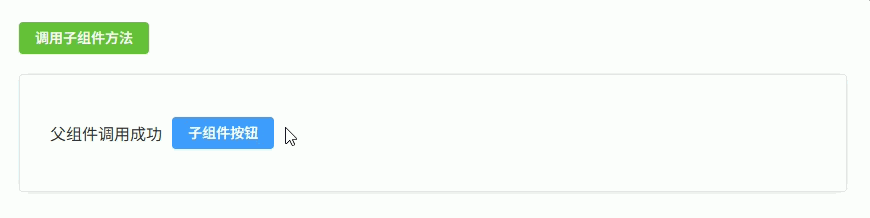

------

## 子组件向父组件传递数据（事件传递）

子组件可以通过 **`emit` 触发自定义事件**，并将数据传递给父组件。

实现步骤：

1. **子组件使用 `defineEmits` 定义事件**
2. **子组件通过 `emit('eventName', data)` 发送数据**
3. **父组件通过 `@eventName` 监听事件并接收数据**

常见使用场景：

- 子组件表单 **提交数据**
- 子组件表格 **点击操作按钮**
- 子组件 **选择数据返回**
- Dialog 组件 **点击确认返回数据**

------

**子组件 Child.vue**

```vue
<template>
  <div class="child"> <!-- 子组件容器 -->

    <el-input
      v-model="inputValue"
      placeholder="请输入内容"
      style="width: 200px"
    /> <!-- ElementPlus 输入框 -->

    <el-button type="primary" @click="sendData">提交数据</el-button> <!-- 点击发送数据 -->

  </div>
</template>

<script setup lang="ts">
import { ref } from 'vue' // 引入 ref

const inputValue = ref('') // 输入框数据

const emit = defineEmits<{ // 定义 emit 事件类型
  (e: 'submit', value: string): void // submit 事件，参数为 string
}>()

const sendData = () => { // 发送数据方法
  emit('submit', inputValue.value) // 向父组件发送 submit 事件并携带数据
}
</script>

<style scoped>
.child {
  display: flex; /* 使用 flex 布局 */
  gap: 10px; /* 子元素间距 */
  align-items: center; /* 垂直居中 */
  margin-top: 20px; /* 上外边距 */
}
</style>
```

------

**父组件 Parent.vue**

```vue
<template>
  <div class="container"> <!-- 父组件容器 -->

    <Child @submit="handleSubmit" /> <!-- 监听子组件 submit 事件 -->

    <el-card class="result-card"> <!-- 显示返回数据 -->
      接收到的数据：{{ result }}
    </el-card>

  </div>
</template>

<script setup lang="ts">
import { ref } from 'vue' // 引入 ref
import Child from './Child.vue' // 引入子组件

const result = ref('') // 接收子组件数据

const handleSubmit = (value: string) => { // 处理子组件事件
  result.value = value // 保存子组件传来的数据
}
</script>

<style scoped>
.container {
  padding: 20px; /* 容器内边距 */
}

.result-card {
  margin-top: 20px; /* 卡片上边距 */
}
</style>
```

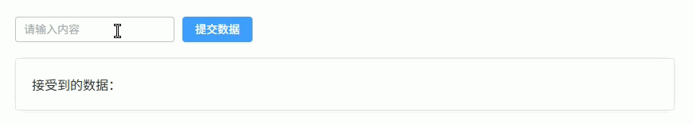

## 父组件向子组件传递 props

父组件可以通过 **props 向子组件传递数据**。

子组件通过 `defineProps` 接收数据。

常见传递类型：

1. **普通值**（string / number / boolean）
2. **对象**
3. **数组**
4. **函数（回调函数）**

实现步骤：

1. 父组件通过 `:propName="value"` 传递数据
2. 子组件通过 `defineProps` 接收
3. 子组件可以直接使用这些数据

常见使用场景：

- 表格组件传入 **数据列表**
- 表单组件传入 **默认值**
- Dialog组件传入 **标题**
- 子组件触发 **父组件回调函数**

------

**子组件 Child.vue**

```vue
<template>
  <div class="child"> <!-- 子组件容器 -->

    <el-card class="card"> <!-- ElementPlus 卡片 -->

      <p>用户名：{{ name }}</p> <!-- 普通值 -->

      <p>年龄：{{ age }}</p> <!-- number -->

      <p>城市：{{ userInfo.city }}</p> <!-- 对象 -->

      <p>标签：</p>
      <el-tag
        v-for="item in tags"
        :key="item"
        class="tag"
      >
        {{ item }}
      </el-tag> <!-- 数组 -->

      <div style="margin-top:10px">
        <el-button type="primary" @click="handleClick">
          调用父组件函数
        </el-button> <!-- 调用父组件函数 -->
      </div>

    </el-card>

  </div>
</template>

<script setup lang="ts">
interface UserInfo { // 定义对象类型
  city: string
}

const props = defineProps<{ // 定义 props 类型
  name: string
  age: number
  userInfo: UserInfo
  tags: string[]
  onAction: (msg: string) => void
}>()

const handleClick = () => { // 按钮点击
  props.onAction('子组件触发回调') // 调用父组件函数
}
</script>

<style scoped>
.child {
  margin-top: 20px; /* 上外边距 */
}

.card {
  padding: 10px; /* 内边距 */
}

.tag {
  margin-right: 6px; /* 右间距 */
}
</style>
```

------

**父组件 Parent.vue**

```vue
<template>
  <div class="container"> <!-- 父组件容器 -->

    <Child
      :name="name"
      :age="age"
      :userInfo="userInfo"
      :tags="tags"
      :onAction="handleAction"
    /> <!-- 向子组件传递 props -->

    <el-card class="result">
      父组件接收到回调：{{ result }}
    </el-card>

  </div>
</template>

<script setup lang="ts">
import { ref, reactive } from 'vue'
import Child from './Child.vue'

const name = ref('Tom') // 普通值

const age = ref(25) // number

const userInfo = reactive({ // 对象
  city: 'Shanghai'
})

const tags = ref(['Vue3', 'TypeScript', 'ElementPlus']) // 数组

const result = ref('') // 接收回调结果

const handleAction = (msg: string) => { // 子组件回调函数
  result.value = msg
}
</script>

<style scoped>
.container {
  padding: 20px; /* 内边距 */
}

.result {
  margin-top: 20px; /* 上边距 */
}
</style>
```

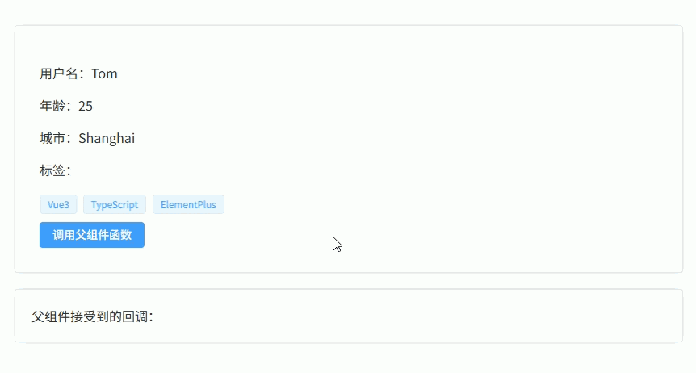

## v-model 父子组件双向绑定（modelValue）

Vue3 中 `v-model` 的本质是：

- 父组件传递 `modelValue`
- 子组件触发 `update:modelValue`

实现步骤：

1. **子组件使用 `defineProps` 接收 `modelValue`**
2. **子组件使用 `defineEmits` 触发 `update:modelValue`**
3. **父组件使用 `v-model` 绑定数据**

常见使用场景：

- **Dialog 弹窗组件**
- **自定义输入组件**
- **开关组件**
- **封装表单组件**

------

**子组件 Child.vue**

```vue
<template>
  <div class="child"> <!-- 子组件容器 -->

    <el-input
      :model-value="modelValue"
      @input="handleInput"
      placeholder="请输入内容"
      style="width: 220px"
    /> <!-- 输入框绑定 modelValue -->

  </div>
</template>

<script setup lang="ts">
const props = defineProps<{ // 接收父组件数据
  modelValue: string
}>()

const emit = defineEmits<{ // 定义事件
  (e: 'update:modelValue', value: string): void
}>()

const handleInput = (value: string) => { // 输入事件
  emit('update:modelValue', value) // 更新父组件数据
}
</script>

<style scoped>
.child {
  margin-top: 20px; /* 上边距 */
}
</style>
```

------

**父组件 Parent.vue**

```vue
<template>
  <div class="container"> <!-- 父组件容器 -->

    <Child v-model="text" /> <!-- v-model 双向绑定 -->

    <el-card class="result">
      当前值：{{ text }}
    </el-card>

  </div>
</template>

<script setup lang="ts">
import { ref } from 'vue'
import Child from './Child.vue'

const text = ref('Hello Vue3') // v-model 绑定数据
</script>

<style scoped>
.container {
  padding: 20px; /* 内边距 */
}

.result {
  margin-top: 20px; /* 上边距 */
}
</style>
```

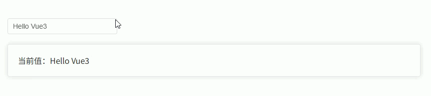

------

## 父组件控制子组件 Dialog（弹窗组件封装）

在实际项目中通常 **不会直接在页面写 `el-dialog`**，而是封装成组件，例如：

```
<UserDialog v-model="visible" />
```

实现方式：

1. **子组件接收 `modelValue` 控制 Dialog 显示**
2. **子组件通过 `update:modelValue` 关闭弹窗**
3. **父组件通过 `v-model` 控制弹窗打开关闭**

常见使用场景：

- **新增 / 编辑表单弹窗**
- **详情弹窗**
- **选择数据弹窗**
- **表单提交弹窗**

------

**子组件 UserDialog.vue**

```vue
<template>
  <el-dialog
    :model-value="modelValue"
    title="用户信息"
    width="400px"
    @close="handleClose"
  > <!-- ElementPlus Dialog -->

    <el-form :model="form"> <!-- 表单 -->

      <el-form-item label="用户名">
        <el-input v-model="form.name" /> <!-- 输入框 -->
      </el-form-item>

      <el-form-item label="年龄">
        <el-input v-model="form.age" /> <!-- 输入框 -->
      </el-form-item>

    </el-form>

    <template #footer> <!-- Dialog 底部 -->

      <el-button @click="handleClose">
        取消
      </el-button>

      <el-button type="primary" @click="handleSubmit">
        确定
      </el-button>

    </template>

  </el-dialog>
</template>

<script setup lang="ts">
import { reactive } from 'vue'

const props = defineProps<{ // 接收父组件控制
  modelValue: boolean
}>()

const emit = defineEmits<{ // 定义事件
  (e: 'update:modelValue', value: boolean): void
  (e: 'submit', data: any): void
}>()

const form = reactive({ // 表单数据
  name: '',
  age: ''
})

const handleClose = () => { // 关闭弹窗
  emit('update:modelValue', false)
}

const handleSubmit = () => { // 提交表单
  emit('submit', form)
  emit('update:modelValue', false)
}
</script>

<style scoped>
.el-form-item {
  margin-bottom: 18px; /* 表单间距 */
}
</style>
```

------

**父组件 Parent.vue**

```vue
<template>
  <div class="container"> <!-- 页面容器 -->

    <el-button type="primary" @click="openDialog">
      新增用户
    </el-button>

    <UserDialog
      v-model="visible"
      @submit="handleSubmit"
    /> <!-- 使用封装的 Dialog -->

    <el-card class="result">
      提交数据：{{ result }}
    </el-card>

  </div>
</template>

<script setup lang="ts">
import { ref } from 'vue'
import UserDialog from './UserDialog.vue'

const visible = ref(false) // 控制 Dialog 显示

const result = ref('') // 接收提交数据

const openDialog = () => { // 打开弹窗
  visible.value = true
}

const handleSubmit = (data: any) => { // 处理提交
  result.value = JSON.stringify(data)
}
</script>

<style scoped>
.container {
  padding: 20px; /* 页面内边距 */
}

.result {
  margin-top: 20px; /* 上边距 */
}
</style>
```

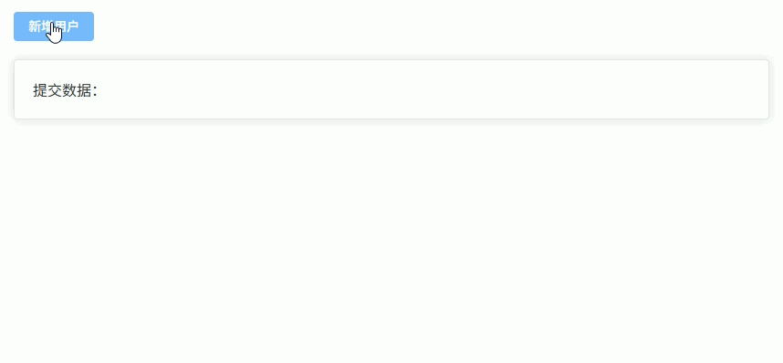

------

## 子组件调用父组件方法

子组件触发父组件逻辑有两种常见方式：

1. **emit 触发父组件事件（推荐方式）**
2. **父组件传入回调函数，子组件直接调用**

常见使用场景：

- 表格组件 **点击删除 / 编辑**
- 表单组件 **点击提交**
- 选择组件 **返回选中的数据**
- 子组件触发 **父组件刷新列表**

------

**子组件 Child.vue**

```vue
<template>
  <div class="child"> <!-- 子组件容器 -->

    <el-button type="primary" @click="handleEmit">
      emit 触发父组件
    </el-button> <!-- emit 方式 -->

    <el-button type="success" @click="handleCallback">
      回调函数触发父组件
    </el-button> <!-- 回调函数方式 -->

  </div>
</template>

<script setup lang="ts">
const props = defineProps<{ // 接收父组件传入的函数
  onAction: () => void
}>()

const emit = defineEmits<{ // 定义事件
  (e: 'action'): void
}>()

const handleEmit = () => { // emit 方式
  emit('action') // 触发父组件事件
}

const handleCallback = () => { // 回调函数方式
  props.onAction() // 调用父组件方法
}
</script>

<style scoped>
.child {
  display: flex; /* flex 布局 */
  gap: 10px; /* 元素间距 */
  margin-top: 20px; /* 上边距 */
}
</style>
```

------

**父组件 Parent.vue**

```vue
<template>
  <div class="container"> <!-- 父组件容器 -->

    <Child
      @action="handleEmitAction"
      :on-action="handleCallbackAction"
    /> <!-- 注册事件 + 传入回调函数 -->

    <el-card class="result">
      执行结果：{{ result }}
    </el-card>

  </div>
</template>

<script setup lang="ts">
import { ref } from 'vue'
import Child from './Child.vue'

const result = ref('') // 结果显示

const handleEmitAction = () => { // emit 方式触发
  result.value = 'emit 调用了父组件方法'
}

const handleCallbackAction = () => { // 回调函数方式触发
  result.value = '回调函数调用了父组件方法'
}
</script>

<style scoped>
.container {
  padding: 20px; /* 内边距 */
}

.result {
  margin-top: 20px; /* 上边距 */
}
</style>
```

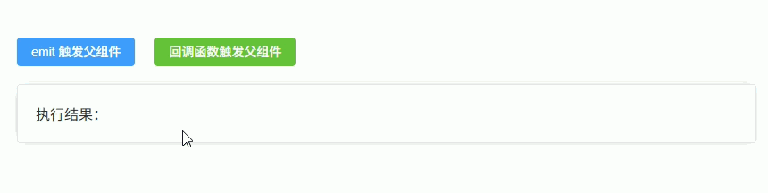

------

## 父组件控制子组件表单（提交 / 重置 / 校验）

在后台系统中，常把 **查询表单封装成子组件**，父组件负责：

- 触发 **提交查询**
- 触发 **重置表单**
- 触发 **表单校验**

实现方式：

1. 子组件通过 `defineExpose` 暴露方法
2. 父组件通过 `ref` 获取子组件实例
3. 父组件调用 `submit() / reset() / validate()`

典型结构：

```
page
 ├─ search-form
 └─ data-table
```

------

**子组件 SearchForm.vue**

```vue
<template>
  <el-form
    ref="formRef"
    :model="form"
    :rules="rules"
    label-width="80px"
    class="form"
  > <!-- ElementPlus 表单 -->

    <el-form-item label="用户名" prop="name">
      <el-input v-model="form.name" placeholder="请输入用户名" /> <!-- 输入框 -->
    </el-form-item>

    <el-form-item label="年龄" prop="age">
      <el-input v-model="form.age" placeholder="请输入年龄" /> <!-- 输入框 -->
    </el-form-item>

  </el-form>
</template>

<script setup lang="ts">
import { reactive, ref } from 'vue'
import type { FormInstance, FormRules } from 'element-plus'

const formRef = ref<FormInstance>() // 表单实例

const form = reactive({ // 表单数据
  name: '',
  age: ''
})

const rules: FormRules = { // 表单校验规则
  name: [
    { required: true, message: '请输入用户名', trigger: 'blur' }
  ],
  age: [
    { required: true, message: '请输入年龄', trigger: 'blur' }
  ]
}

const submit = async () => { // 提交方法
  await formRef.value?.validate() // 执行校验
  return { ...form } // 返回表单数据
}

const reset = () => { // 重置表单
  formRef.value?.resetFields()
}

const validate = async () => { // 单独校验方法
  return await formRef.value?.validate()
}

defineExpose({ // 暴露方法给父组件
  submit,
  reset,
  validate
})
</script>

<style scoped>
.form {
  display: flex; /* flex 布局 */
  gap: 20px; /* 表单间距 */
}
</style>
```

------

**父组件 Parent.vue**

```vue
<template>
  <div class="container"> <!-- 页面容器 -->

    <div class="toolbar"> <!-- 操作按钮区域 -->

      <el-button type="primary" @click="handleSearch">
        查询
      </el-button>

      <el-button @click="handleReset">
        重置
      </el-button>

      <el-button type="success" @click="handleValidate">
        校验
      </el-button>

    </div>

    <SearchForm ref="formRef" /> <!-- 引入子组件 -->

    <el-card class="result">
      查询数据：{{ result }}
    </el-card>

  </div>
</template>

<script setup lang="ts">
import { ref } from 'vue'
import SearchForm from './SearchForm.vue'

const formRef = ref<InstanceType<typeof SearchForm>>() // 子组件引用

const result = ref('') // 显示结果

const handleSearch = async () => { // 查询
  const data = await formRef.value?.submit() // 调用子组件 submit
  result.value = JSON.stringify(data)
}

const handleReset = () => { // 重置
  formRef.value?.reset() // 调用子组件 reset
}

const handleValidate = async () => { // 单独校验
  const valid = await formRef.value?.validate()
  result.value = valid ? '校验通过' : '校验失败'
}
</script>

<style scoped>
.container {
  padding: 20px; /* 内边距 */
}

.toolbar {
  margin-bottom: 20px; /* 下边距 */
}

.result {
  margin-top: 20px; /* 上边距 */
}
</style>
```

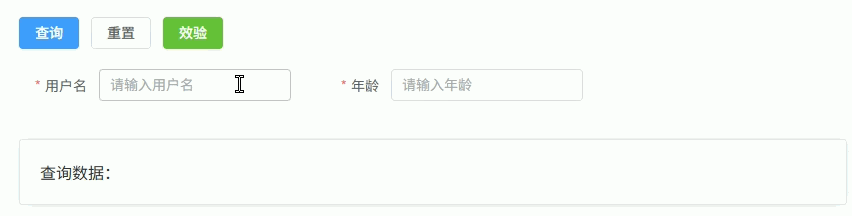

------

## 父子组件列表渲染与操作

在后台系统中，常见模式是：

- **父组件负责数据管理（CRUD）**
- **子组件负责列表展示**
- 子组件触发 **编辑 / 删除 / 查看** 等操作时，通过 `emit` 通知父组件
- 父组件接收事件后执行具体逻辑

常见于：

- 表格组件封装
- 列表组件封装
- 通用 CRUD 组件

实现方式：

1. 父组件 `props` 传入数据数组
2. 子组件 `v-for` 渲染列表
3. 子组件通过 `emit` 返回操作结果

------

**子组件 UserList.vue**

```vue
<template>
  <el-table
    :data="list"
    border
    style="width: 100%"
  > <!-- ElementPlus 表格 -->

    <el-table-column prop="id" label="ID" width="80" /> <!-- ID列 -->

    <el-table-column prop="name" label="用户名" /> <!-- 用户名列 -->

    <el-table-column label="操作" width="200"> <!-- 操作列 -->
      <template #default="scope"> <!-- 获取当前行数据 -->

        <el-button
          type="primary"
          size="small"
          @click="handleEdit(scope.row)"
        >
          编辑
        </el-button>

        <el-button
          type="danger"
          size="small"
          @click="handleDelete(scope.row)"
        >
          删除
        </el-button>

      </template>
    </el-table-column>

  </el-table>
</template>

<script setup lang="ts">
interface User { // 用户类型
  id: number
  name: string
}

defineProps<{ // 接收父组件数据
  list: User[]
}>()

const emit = defineEmits<{
  (e: 'edit', row: User): void
  (e: 'delete', row: User): void
}>() // 定义事件

const handleEdit = (row: User) => { // 编辑事件
  emit('edit', row)
}

const handleDelete = (row: User) => { // 删除事件
  emit('delete', row)
}
</script>
```

------

**父组件 Parent.vue**

```vue
<template>
  <div class="container"> <!-- 页面容器 -->

    <div class="toolbar"> <!-- 操作栏 -->

      <el-button type="primary" @click="handleAdd">
        新增
      </el-button>

    </div>

    <UserList
      :list="users"
      @edit="handleEdit"
      @delete="handleDelete"
    /> <!-- 列表组件 -->

  </div>
</template>

<script setup lang="ts">
import { ref } from 'vue'
import UserList from './UserList.vue'

interface User { // 用户类型
  id: number
  name: string
}

const users = ref<User[]>([ // 模拟数据
  { id: 1, name: 'Tom' },
  { id: 2, name: 'Jack' },
  { id: 3, name: 'Lucy' }
])

const handleAdd = () => { // 新增
  const id = users.value.length + 1
  users.value.push({
    id,
    name: 'NewUser' + id
  })
}

const handleEdit = (row: User) => { // 编辑
  row.name = row.name + '_edit'
}

const handleDelete = (row: User) => { // 删除
  users.value = users.value.filter(v => v.id !== row.id)
}
</script>

<style scoped>
.container {
  padding: 20px; /* 页面内边距 */
}

.toolbar {
  margin-bottom: 20px; /* 操作栏间距 */
}
</style>
```

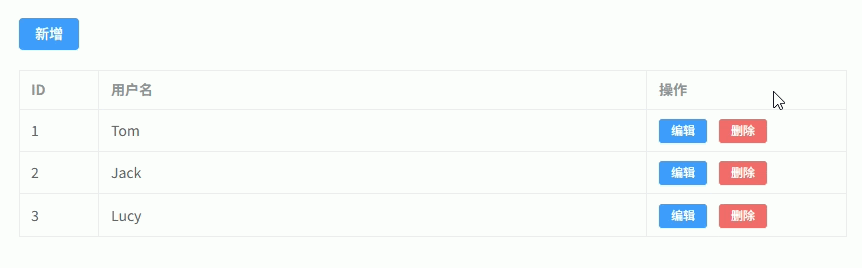

------

## 插槽传值（具名插槽 / 作用域插槽）

在组件封装中，经常需要 **父组件控制子组件部分内容的渲染**，这时使用 **slot 插槽**。

常见两种：

1. **具名插槽（Named Slot）**
   父组件传入 **模板内容**，子组件在指定位置渲染。
2. **作用域插槽（Scoped Slot）**
   子组件向父组件 **传递数据**，父组件决定如何渲染。

典型场景：

- Card组件（header / footer）
- Table组件（自定义列）
- Layout组件（header / sidebar / content）

------

**子组件 BaseCard.vue**

```vue
<template>
  <div class="card"> <!-- 卡片容器 -->

    <div class="card-header"> <!-- 头部区域 -->
      <slot name="header"></slot> <!-- 具名插槽 header -->
    </div>

    <div class="card-body"> <!-- 内容区域 -->
      <slot></slot> <!-- 默认插槽 -->
    </div>

    <div class="card-list"> <!-- 列表示例 -->
      <div
        v-for="item in list"
        :key="item.id"
        class="item"
      >
        <slot name="item" :row="item"></slot> <!-- 作用域插槽 -->
      </div>
    </div>

  </div>
</template>

<script setup lang="ts">
interface Item { // 列表类型
  id: number
  name: string
}

defineProps<{ // 接收父组件数据
  list: Item[]
}>()
</script>

<style scoped>
.card {
  border: 1px solid #ddd; /* 边框 */
  border-radius: 6px; /* 圆角 */
  padding: 16px; /* 内边距 */
}

.card-header {
  font-weight: bold; /* 字体加粗 */
  margin-bottom: 10px; /* 下边距 */
}

.card-body {
  margin-bottom: 10px; /* 下边距 */
}

.item {
  padding: 6px 0; /* 列表项内边距 */
}
</style>
```

------

**父组件 Parent.vue**

```vue
<template>
  <BaseCard :list="list"> <!-- 使用组件 -->

    <template #header> <!-- 具名插槽 -->
      用户列表
    </template>

    <template #default> <!-- 默认插槽 -->
      这里是卡片内容区域
    </template>

    <template #item="{ row }"> <!-- 作用域插槽 -->
      <span style="margin-right: 10px">{{ row.name }}</span>

      <el-button
        type="primary"
        size="small"
        @click="handleClick(row)"
      >
        操作
      </el-button>

    </template>

  </BaseCard>
</template>

<script setup lang="ts">
import { ref } from 'vue'
import BaseCard from './BaseCard.vue'

interface Item { // 数据类型
  id: number
  name: string
}

const list = ref<Item[]>([ // 模拟数据
  { id: 1, name: 'Tom' },
  { id: 2, name: 'Jack' },
  { id: 3, name: 'Lucy' }
])

const handleClick = (row: Item) => { // 操作事件
  console.log('点击', row)
}
</script>
```

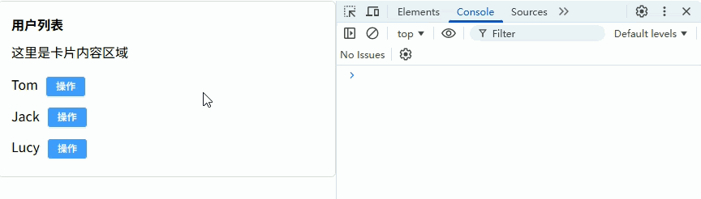

------

## 跨多层父子组件通信（provide / inject）

当组件层级很深时：

```
Parent
 └─ Child
     └─ GrandChild
```

如果使用 `props + emit` 逐层传递会非常麻烦，因此 Vue 提供：

- **provide**：祖先组件提供数据或方法
- **inject**：后代组件直接注入使用

特点：

- 可以跨 **多层组件**
- 不需要逐层传递
- 常用于 **全局配置 / 表单上下文 / 组件库内部通信**

------

**父组件 Parent.vue（提供数据）**

```vue
<template>
  <div class="container"> <!-- 页面容器 -->

    <h3>父组件</h3>

    <Child /> <!-- 子组件 -->

  </div>
</template>

<script setup lang="ts">
import { provide, ref } from 'vue'
import Child from './Child.vue'

const userName = ref('Tom') // 共享数据

const changeUser = () => { // 修改方法
  userName.value = 'Jack'
}

provide('userName', userName) // 提供数据
provide('changeUser', changeUser) // 提供方法
</script>

<style scoped>
.container {
  padding: 20px; /* 内边距 */
  border: 1px solid #ddd; /* 边框 */
}
</style>
```

------

**子组件 Child.vue（中间层）**

```vue
<template>
  <div class="child"> <!-- 子组件容器 -->

    <h4>子组件</h4>

    <GrandChild /> <!-- 孙组件 -->

  </div>
</template>

<script setup lang="ts">
import GrandChild from './GrandChild.vue'
</script>

<style scoped>
.child {
  margin-top: 10px; /* 上边距 */
  padding: 10px; /* 内边距 */
  border: 1px dashed #999; /* 虚线边框 */
}
</style>
```

------

**孙组件 GrandChild.vue（注入使用）**

```vue
<template>
  <div class="grand"> <!-- 孙组件 -->

    <p>用户名：{{ userName }}</p> <!-- 显示数据 -->

    <el-button
      type="primary"
      @click="changeUser"
    >
      修改用户名
    </el-button>

  </div>
</template>

<script setup lang="ts">
import { inject, Ref } from 'vue'

const userName = inject<Ref<string>>('userName')! // 注入数据

const changeUser = inject<() => void>('changeUser')! // 注入方法
</script>

<style scoped>
.grand {
  margin-top: 10px; /* 上边距 */
  padding: 10px; /* 内边距 */
  border: 1px solid #409eff; /* 边框 */
}
</style>
```

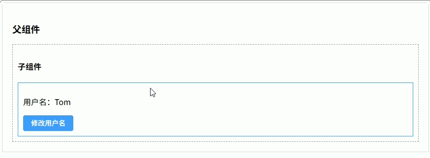

------

## 组合式 API + ref / reactive 共享状态

在 Vue3 中，可以把 **响应式状态抽离到组合式函数（composable）** 中，然后在父组件和子组件中 **共同使用同一个状态对象**。

特点：

- 使用 `ref` / `reactive` 创建共享状态
- 抽离到 `useXXX.ts`
- 父组件和子组件同时使用
- **状态实时联动**

常见场景：

- 表单状态管理
- 全局筛选条件
- 表格 + 查询条件联动

------

**组合式函数 useCounter.ts**

```ts
import { ref } from 'vue'

const count = ref(0) // 共享状态

const increment = () => { // 增加
  count.value++
}

const decrement = () => { // 减少
  count.value--
}

export function useCounter() { // 导出组合函数
  return {
    count,
    increment,
    decrement
  }
}
```

------

**父组件 Parent.vue**

```vue
<template>
  <div class="container"> <!-- 页面容器 -->

    <h3>父组件</h3>

    <p>Count：{{ count }}</p> <!-- 显示共享状态 -->

    <el-button type="primary" @click="increment">
      +1
    </el-button>

    <el-button @click="decrement">
      -1
    </el-button>

    <Child /> <!-- 子组件 -->

  </div>
</template>

<script setup lang="ts">
import Child from './Child.vue'
import { useCounter } from './useCounter'

const { count, increment, decrement } = useCounter() // 使用共享状态
</script>

<style scoped>
.container {
  padding: 20px; /* 内边距 */
  border: 1px solid #ddd; /* 边框 */
}
</style>
```

------

**子组件 Child.vue**

```vue
<template>
  <div class="child"> <!-- 子组件容器 -->

    <h4>子组件</h4>

    <p>Count：{{ count }}</p> <!-- 显示共享状态 -->

    <el-button type="success" @click="increment">
      子组件 +1
    </el-button>

  </div>
</template>

<script setup lang="ts">
import { useCounter } from './useCounter'

const { count, increment } = useCounter() // 使用同一个状态
</script>

<style scoped>
.child {
  margin-top: 20px; /* 上边距 */
  padding: 15px; /* 内边距 */
  border: 1px dashed #999; /* 虚线边框 */
}
</style>
```

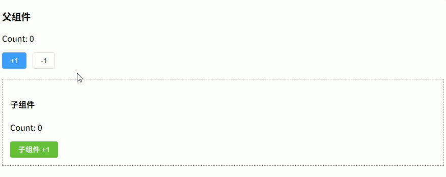

------

## 父子组件动态渲染组件（动态组件 + ref 调用）

在实际项目中，经常需要 **根据条件渲染不同组件**，例如：

- Tab 页面切换
- 不同类型表单
- 插件式组件
- 不同业务模块

实现方式：

1. 使用 `component` + `:is` 动态渲染组件
2. 使用 `ref` 获取当前组件实例
3. 子组件使用 `defineExpose` 暴露方法
4. 父组件调用当前组件的方法

------

**子组件 AComponent.vue**

```vue
<template>
  <div class="box">
    <h3>A组件</h3>
  </div>
</template>

<script setup lang="ts">
const sayHello = () => { // 子组件方法
  console.log('Hello from AComponent')
}

defineExpose({ // 暴露方法给父组件
  sayHello
})
</script>

<style scoped>
.box {
  padding: 20px; /* 内边距 */
  border: 1px solid #409eff; /* 边框 */
}
</style>
```

------

**子组件 BComponent.vue**

```vue
<template>
  <div class="box">
    <h3>B组件</h3>
  </div>
</template>

<script setup lang="ts">
const sayHello = () => { // 子组件方法
  console.log('Hello from BComponent')
}

defineExpose({ // 暴露方法给父组件
  sayHello
})
</script>

<style scoped>
.box {
  padding: 20px; /* 内边距 */
  border: 1px solid #67c23a; /* 边框 */
}
</style>
```

------

**父组件 Parent.vue**

```vue
<template>
  <div class="container"> <!-- 页面容器 -->

    <div class="toolbar"> <!-- 操作区域 -->

      <el-button type="primary" @click="current = 'AComponent'">
        显示A组件
      </el-button>

      <el-button type="success" @click="current = 'BComponent'">
        显示B组件
      </el-button>

      <el-button type="warning" @click="callChildMethod">
        调用子组件方法
      </el-button>

    </div>

    <component
      :is="components[current]"
      ref="componentRef"
    /> <!-- 动态组件 -->

  </div>
</template>

<script setup lang="ts">
import { ref } from 'vue'
import AComponent from './AComponent.vue'
import BComponent from './BComponent.vue'

const components = { // 组件映射表
  AComponent,
  BComponent
}

const current = ref<keyof typeof components>('AComponent') // 当前组件

const componentRef = ref<any>() // 当前组件实例

const callChildMethod = () => { // 调用子组件方法
  componentRef.value?.sayHello()
}
</script>

<style scoped>
.container {
  padding: 20px; /* 内边距 */
}

.toolbar {
  margin-bottom: 20px; /* 下边距 */
}
</style>
```

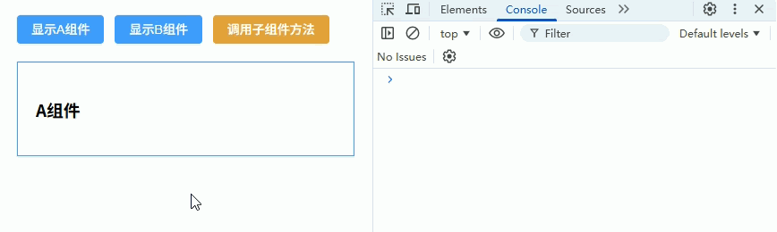

------

