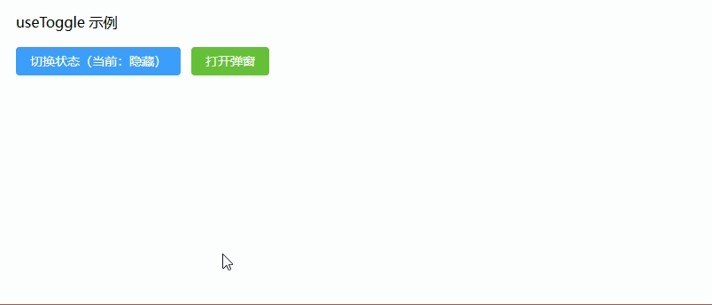
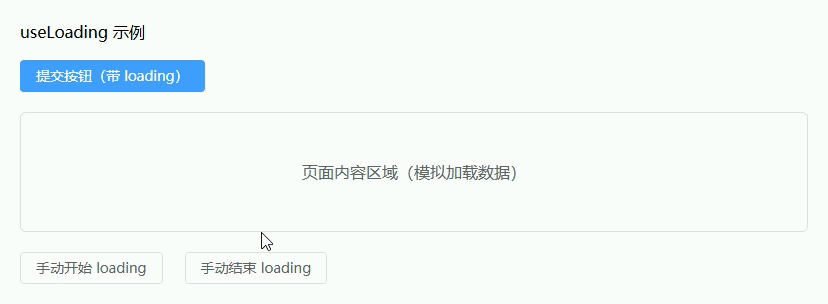
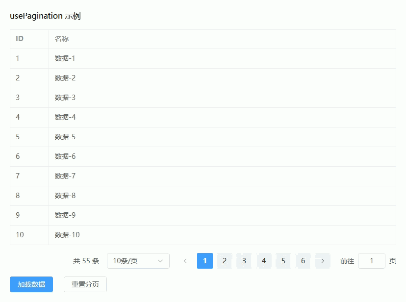
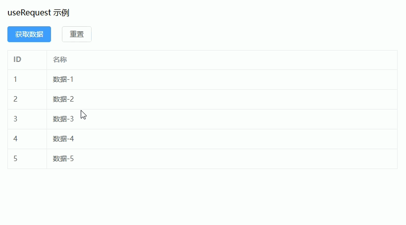
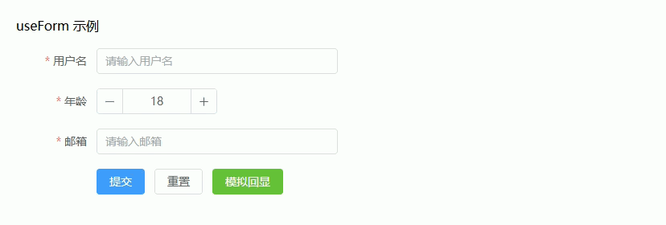
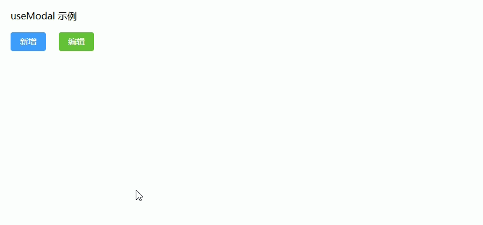
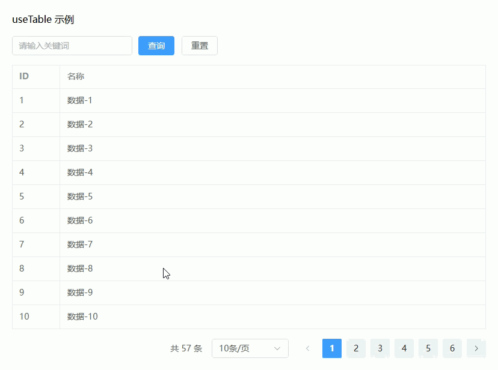
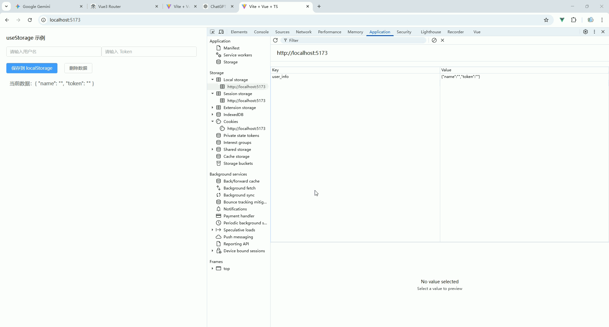
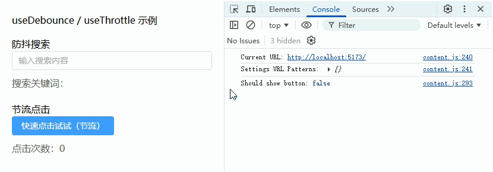
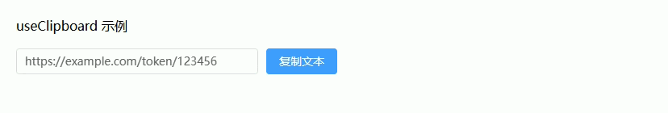

# Composables 可复用的组合式逻辑函数


## **useToggle（开关控制）**

控制布尔状态（弹窗开关、展开收起、开关按钮等）

------

**Composables：useToggle.ts**

```ts
import { ref } from 'vue'

/**
 * useToggle（布尔开关控制）
 * @param initial 初始值（默认 false）
 */
export function useToggle(initial: boolean = false) {
  const state = ref<boolean>(initial) // 当前状态

  /**
   * 切换状态
   */
  const toggle = () => {
    state.value = !state.value
  }

  /**
   * 设置为 true
   */
  const open = () => {
    state.value = true
  }

  /**
   * 设置为 false
   */
  const close = () => {
    state.value = false
  }

  /**
   * 直接设置值
   * @param value 布尔值
   */
  const set = (value: boolean) => {
    state.value = value
  }

  return {
    state,
    toggle,
    open,
    close,
    set
  }
}
```

------

**页面使用示例：ToggleDemo.vue**

```vue
<template>
  <div class="page">
    <h2>useToggle 示例</h2>

    <!-- 开关按钮 -->
    <el-button type="primary" @click="toggle">
      切换状态（当前：{{ visible ? '显示' : '隐藏' }}）
    </el-button>

    <!-- 显示 / 隐藏内容 -->
    <div v-if="visible" class="box">
      这是一个可切换的内容区域
    </div>

    <!-- 弹窗控制 -->
    <el-button type="success" @click="openDialog">
      打开弹窗
    </el-button>

    <el-dialog v-model="dialogVisible" title="提示">
      <span>这是一个 Dialog</span>
      <template #footer>
        <el-button @click="closeDialog">关闭</el-button>
      </template>
    </el-dialog>
  </div>
</template>

<script setup lang="ts">
import { computed } from 'vue'
import { useToggle } from '@/composables/useToggle'

// =========================
// 普通开关（控制内容显示）
// =========================
const {
  state: visibleState,
  toggle
} = useToggle(false)

// 转换为可读变量
const visible = computed(() => visibleState.value)

// =========================
// 弹窗开关（Dialog）
// =========================
const {
  state: dialogState,
  open: openDialog,
  close: closeDialog
} = useToggle(false)

const dialogVisible = computed({
  get: () => dialogState.value,
  set: (val: boolean) => {
    dialogState.value = val
  }
})
</script>

<style lang="scss" scoped>
.page {
  padding: 20px; // 页面内边距

  h2 {
    margin-bottom: 16px; // 标题间距
  }

  .box {
    margin-top: 16px; // 上间距
    padding: 12px; // 内边距
    background: #f5f7fa; // 背景色（ElementPlus风格）
    border-radius: 6px; // 圆角
    color: #606266; // 文本颜色
  }
}
</style>
```



------

## **useLoading（加载状态管理）**

统一处理 loading（按钮 loading / 页面 loading）

------

**Composables：useLoading.ts**

```ts
import { ref } from 'vue'

/**
 * useLoading（加载状态管理）
 * 支持：
 * 1. 单一 loading
 * 2. 异步函数自动包裹 loading
 */
export function useLoading(initial: boolean = false) {
  const loading = ref<boolean>(initial) // loading 状态

  /**
   * 开启 loading
   */
  const start = () => {
    loading.value = true
  }

  /**
   * 关闭 loading
   */
  const stop = () => {
    loading.value = false
  }

  /**
   * 切换 loading
   */
  const toggle = () => {
    loading.value = !loading.value
  }

  /**
   * 包裹异步方法（自动处理 loading）
   * @param fn 异步函数
   */
  const withLoading = async <T>(fn: () => Promise<T>): Promise<T | undefined> => {
    try {
      loading.value = true
      return await fn()
    } catch (error) {
      console.error('useLoading error:', error) // 打印错误
    } finally {
      loading.value = false
    }
  }

  return {
    loading,
    start,
    stop,
    toggle,
    withLoading
  }
}
```

------

**页面使用示例：LoadingDemo.vue**

```vue
<template>
  <div class="page">
    <h2>useLoading 示例</h2>

    <!-- ================= 按钮 loading ================= -->
    <el-button
      type="primary"
      :loading="btnLoading"
      @click="handleSubmit"
    >
      提交按钮（带 loading）
    </el-button>

    <!-- ================= 页面 loading ================= -->
    <div class="content" v-loading="pageLoading">
      页面内容区域（模拟加载数据）
    </div>

    <!-- ================= 手动控制 ================= -->
    <div class="actions">
      <el-button @click="startPageLoading">手动开始 loading</el-button>
      <el-button @click="stopPageLoading">手动结束 loading</el-button>
    </div>
  </div>
</template>

<script setup lang="ts">
import { computed } from 'vue'
import { useLoading } from '@/composables/useLoading'

// =========================
// 按钮 loading（提交场景）
// =========================
const {
  loading: btnLoadingState,
  withLoading: withBtnLoading
} = useLoading(false)

// 转换为可读变量
const btnLoading = computed(() => btnLoadingState.value)

/**
 * 提交事件（模拟接口请求）
 */
const handleSubmit = async () => {
  await withBtnLoading(async () => {
    await new Promise(resolve => setTimeout(resolve, 1500)) // 模拟接口延迟
    console.log('提交成功')
  })
}

// =========================
// 页面 loading（整块区域）
// =========================
const {
  loading: pageLoadingState,
  start: startPageLoading,
  stop: stopPageLoading
} = useLoading(false)

const pageLoading = computed(() => pageLoadingState.value)
</script>

<style lang="scss" scoped>
.page {
  padding: 20px; // 页面内边距

  h2 {
    margin-bottom: 16px; // 标题间距
  }

  .content {
    margin-top: 20px; // 上间距
    height: 120px; // 高度
    display: flex; // flex布局
    align-items: center; // 垂直居中
    justify-content: center; // 水平居中
    border: 1px solid #dcdfe6; // 边框
    border-radius: 6px; // 圆角
    background: #f9fafc; // 背景色
    color: #606266; // 字体颜色
  }

  .actions {
    margin-top: 20px; // 上间距

    .el-button {
      margin-right: 10px; // 按钮间距
    }
  }
}
</style>
```



------

## **usePagination（分页管理）**

封装分页逻辑（page、size、total、切换）

------

**Composables：usePagination.ts**

```ts
import { ref } from 'vue'

/**
 * usePagination（分页管理）
 */
export function usePagination() {
  const page = ref<number>(1) // 当前页
  const size = ref<number>(10) // 每页条数
  const total = ref<number>(0) // 总条数

  /**
   * 设置总条数
   * @param value 总数
   */
  const setTotal = (value: number) => {
    total.value = value
  }

  /**
   * 重置分页
   */
  const reset = () => {
    page.value = 1
    size.value = 10
    total.value = 0
  }

  /**
   * 页码改变
   */
  const onCurrentChange = (val: number) => {
    page.value = val
  }

  /**
   * 每页条数改变
   */
  const onSizeChange = (val: number) => {
    size.value = val
    page.value = 1 // 切换条数时重置页码
  }

  return {
    page,
    size,
    total,
    setTotal,
    reset,
    onCurrentChange,
    onSizeChange
  }
}
```

------

**页面使用示例：PaginationDemo.vue**

```vue
<template>
  <div class="page">
    <h2>usePagination 示例</h2>

    <!-- ================= 表格 ================= -->
    <el-table :data="tableData" border>
      <el-table-column prop="id" label="ID" width="80" />
      <el-table-column prop="name" label="名称" />
    </el-table>

    <!-- ================= 分页 ================= -->
    <el-pagination
      class="pagination"
      background
      layout="total, sizes, prev, pager, next, jumper"
      :current-page="page"
      :page-size="size"
      :total="total"
      @current-change="handlePageChange"
      @size-change="handleSizeChange"
    />

    <!-- ================= 操作 ================= -->
    <div class="actions">
      <el-button type="primary" @click="loadData">加载数据</el-button>
      <el-button @click="reset">重置分页</el-button>
    </div>
  </div>
</template>

<script setup lang="ts">
import { ref, computed, onMounted } from 'vue'
import { usePagination } from '@/composables/usePagination'

// =========================
// 分页
// =========================
const {
  page: pageState,
  size: sizeState,
  total: totalState,
  setTotal,
  onCurrentChange,
  onSizeChange,
  reset
} = usePagination()

const page = computed(() => pageState.value)
const size = computed(() => sizeState.value)
const total = computed(() => totalState.value)

// =========================
// 表格数据
// =========================
interface Item {
  id: number
  name: string
}

const tableData = ref<Item[]>([])

/**
 * 模拟接口请求
 */
const fetchData = async (page: number, size: number) => {
  return new Promise<{ list: Item[]; total: number }>((resolve) => {
    setTimeout(() => {
      const total = 55 // 模拟总数
      const list: Item[] = Array.from({ length: size }).map((_, index) => {
        const id = (page - 1) * size + index + 1
        return {
          id,
          name: `数据-${id}`
        }
      })
      resolve({ list, total })
    }, 800)
  })
}

/**
 * 加载数据
 */
const loadData = async () => {
  const res = await fetchData(page.value, size.value)
  tableData.value = res.list // 设置表格数据
  setTotal(res.total) // 设置总数
}

/**
 * 页码变化
 */
const handlePageChange = (val: number) => {
  onCurrentChange(val)
  loadData()
}

/**
 * 每页条数变化
 */
const handleSizeChange = (val: number) => {
  onSizeChange(val)
  loadData()
}

// 初始化加载
onMounted(() => {
  loadData()
})
</script>

<style lang="scss" scoped>
.page {
  padding: 20px; // 内边距

  h2 {
    margin-bottom: 16px; // 标题间距
  }

  .pagination {
    margin-top: 16px; // 上间距
    display: flex; // flex布局
    justify-content: flex-end; // 右对齐
  }

  .actions {
    margin-top: 16px; // 上间距

    .el-button {
      margin-right: 10px; // 按钮间距
    }
  }
}
</style>
```



------

## **useRequest（请求封装）**

统一处理 API 请求（loading / error / 成功回调）

------

**Composables：useRequest.ts**

```ts
import { ref } from 'vue'

/**
 * useRequest（请求封装）
 * 支持：
 * 1. loading 状态
 * 2. error 处理
 * 3. 成功回调
 * 4. 手动触发 / 自动执行
 */
export function useRequest<T = any>(
  service: (...args: any[]) => Promise<T>, // 请求函数
  options?: {
    immediate?: boolean // 是否立即执行
    onSuccess?: (data: T) => void // 成功回调
    onError?: (err: any) => void // 失败回调
  }
) {
  const data = ref<T | null>(null) // 响应数据
  const loading = ref<boolean>(false) // loading 状态
  const error = ref<any>(null) // 错误信息

  /**
   * 执行请求
   */
  const run = async (...args: any[]) => {
    try {
      loading.value = true
      error.value = null

      const res = await service(...args)
      data.value = res

      // 成功回调
      options?.onSuccess && options.onSuccess(res)

      return res
    } catch (err) {
      error.value = err

      // 失败回调
      options?.onError && options.onError(err)

      console.error('useRequest error:', err)
    } finally {
      loading.value = false
    }
  }

  /**
   * 重置状态
   */
  const reset = () => {
    data.value = null
    error.value = null
    loading.value = false
  }

  // 是否自动执行
  if (options?.immediate) {
    run()
  }

  return {
    data,
    loading,
    error,
    run,
    reset
  }
}
```

------

**页面使用示例：RequestDemo.vue**

```vue
<template>
  <div class="page">
    <h2>useRequest 示例</h2>

    <!-- ================= 操作按钮 ================= -->
    <div class="actions">
      <el-button type="primary" :loading="loading" @click="getList">
        获取数据
      </el-button>

      <el-button @click="reset">重置</el-button>
    </div>

    <!-- ================= 错误提示 ================= -->
    <el-alert
      v-if="error"
      class="mt"
      title="请求失败"
      type="error"
      :description="error?.message"
      show-icon
    />

    <!-- ================= 数据展示 ================= -->
    <el-table
      v-if="data"
      class="mt"
      :data="data.list"
      border
    >
      <el-table-column prop="id" label="ID" width="80" />
      <el-table-column prop="name" label="名称" />
    </el-table>

    <!-- ================= 空状态 ================= -->
    <el-empty v-if="!loading && !data" description="暂无数据" class="mt" />
  </div>
</template>

<script setup lang="ts">
import { computed } from 'vue'
import { ElMessage } from 'element-plus'
import { useRequest } from '@/composables/useRequest'

// =========================
// 模拟接口
// =========================
interface Item {
  id: number
  name: string
}

const fetchList = async (): Promise<{ list: Item[] }> => {
  return new Promise((resolve, reject) => {
    setTimeout(() => {
      // 随机模拟成功 / 失败
      const success = Math.random() > 0.3

      if (success) {
        const list = Array.from({ length: 5 }).map((_, i) => ({
          id: i + 1,
          name: `数据-${i + 1}`
        }))
        resolve({ list })
      } else {
        reject(new Error('接口请求失败'))
      }
    }, 1000)
  })
}

// =========================
// useRequest 使用
// =========================
const {
  data: dataState,
  loading: loadingState,
  error: errorState,
  run,
  reset
} = useRequest(fetchList, {
  immediate: false, // 不自动执行
  onSuccess: () => {
    ElMessage.success('请求成功') // 成功提示
  },
  onError: (err) => {
    ElMessage.error(err.message || '请求失败') // 失败提示
  }
})

// 转换为可读变量
const data = computed(() => dataState.value)
const loading = computed(() => loadingState.value)
const error = computed(() => errorState.value)

/**
 * 获取数据
 */
const getList = async () => {
  await run()
}
</script>

<style lang="scss" scoped>
.page {
  padding: 20px; // 内边距

  h2 {
    margin-bottom: 16px; // 标题间距
  }

  .actions {
    .el-button {
      margin-right: 10px; // 按钮间距
    }
  }

  .mt {
    margin-top: 16px; // 通用上间距
  }
}
</style>
```



------

## **useForm（表单封装）**

表单数据 + 校验 + 提交 + 重置（结合 ElementPlus）

------

**Composables：useForm.ts**

```ts
import { reactive, ref, toRaw } from 'vue'
import type { FormInstance, FormRules } from 'element-plus'

/**
 * 获取对象的 key，并保留 keyof T 类型
 * 解决 Object.keys 返回 string[] 导致的类型问题
 */
function typedKeys<T extends object>(obj: T): (keyof T)[] {
    return Object.keys(obj) as (keyof T)[]
}

/**
 * 深拷贝（用于避免引用污染）
 * 注意：适用于普通对象（表单场景足够）
 */
function deepClone<T>(value: T): T {
    return JSON.parse(JSON.stringify(value))
}

/**
 * useForm（表单封装）
 *
 * 功能：
 * 1. 表单数据管理（响应式）
 * 2. 表单校验（Element Plus）
 * 3. 提交（自动校验）
 * 4. 重置（支持恢复初始值）
 * 5. 设置表单值（编辑回显）
 *
 * @param initialValues 初始表单数据
 * @param rules 表单校验规则
 */
export function useForm<T extends Record<string, any>>(
    initialValues: T,
    rules?: FormRules
) {
    /**
     * 表单实例（用于调用 validate / resetFields 等方法）
     */
    const formRef = ref<FormInstance>()

    /**
     * 表单数据（响应式）
     *
     * 注意：
     * 不使用 reactive<T>()，避免类型 unwrap 问题
     */
    const formModel = reactive(deepClone(initialValues)) as T

    /**
     * 表单校验规则
     */
    const formRules = rules || {}

    /**
     * 重置表单
     *
     * 功能：
     * 1. 恢复为初始值
     * 2. 清除校验状态
     */
    const reset = () => {
        const clone = deepClone(initialValues)

        typedKeys(clone).forEach((key) => {
            formModel[key] = clone[key]
        })

        formRef.value?.clearValidate()
    }

    /**
     * 使用 Element Plus 官方 reset（可选）
     *
     * 注意：
     * 这个方法依赖 el-form 的 model 初始值
     */
    const resetFields = () => {
        formRef.value?.resetFields()
    }

    /**
     * 设置表单值（用于编辑回显）
     *
     * @param values 部分表单数据
     */
    const setValues = (values: Partial<T>) => {
        typedKeys(values).forEach((key) => {
            const value = values[key]

            if (value !== undefined) {
                formModel[key] = value as T[typeof key]
            }
        })
    }

    /**
     * 获取表单数据（返回原始对象）
     *
     * 注意：
     * 使用 toRaw 避免传递 Proxy
     */
    const getValues = (): T => {
        return toRaw(formModel) as T
    }

    /**
     * 表单校验
     *
     * @returns 是否通过校验
     */
    const validate = async (): Promise<boolean> => {
        if (!formRef.value) return false

        try {
            await formRef.value.validate()
            return true
        } catch {
            return false
        }
    }

    /**
     * 提交表单（自动校验）
     *
     * @param handler 提交回调
     */
    const submit = async (
        handler: (values: T) => Promise<void> | void
    ) => {
        const valid = await validate()

        if (!valid) return

        /**
         * 注意：
         * 这里必须使用 toRaw，否则类型不安全
         */
        const values = toRaw(formModel) as T

        await handler(values)
    }

    return {
        /**
         * 表单实例
         */
        formRef,

        /**
         * 表单数据
         */
        formModel,

        /**
         * 表单规则
         */
        formRules,

        /**
         * 重置（推荐）
         */
        reset,

        /**
         * Element Plus 原生重置
         */
        resetFields,

        /**
         * 设置值
         */
        setValues,

        /**
         * 获取值
         */
        getValues,

        /**
         * 校验
         */
        validate,

        /**
         * 提交
         */
        submit
    }
}
```

------

**页面使用示例：FormDemo.vue**

```vue
<template>
  <div class="page">
    <h2>useForm 示例</h2>

    <!-- ================= 表单 ================= -->
    <el-form
      ref="formRef"
      :model="formModel"
      :rules="formRules"
      label-width="100px"
      class="form"
    >
      <el-form-item label="用户名" prop="name">
        <el-input v-model="formModel.name" placeholder="请输入用户名" />
      </el-form-item>

      <el-form-item label="年龄" prop="age">
        <el-input-number v-model="formModel.age" :min="1" />
      </el-form-item>

      <el-form-item label="邮箱" prop="email">
        <el-input v-model="formModel.email" placeholder="请输入邮箱" />
      </el-form-item>

      <!-- ================= 操作 ================= -->
      <el-form-item>
        <el-button type="primary" @click="handleSubmit">
          提交
        </el-button>
        <el-button @click="reset">
          重置
        </el-button>
        <el-button type="success" @click="mockEdit">
          模拟回显
        </el-button>
      </el-form-item>
    </el-form>
  </div>
</template>

<script setup lang="ts">
import { ElMessage } from 'element-plus'
import type { FormRules } from 'element-plus'
import { useForm } from '@/composables/useForm'

// =========================
// 表单类型
// =========================
interface FormData {
  name: string
  age: number
  email: string
}

// =========================
// 初始值
// =========================
const initialValues: FormData = {
  name: '',
  age: 18,
  email: ''
}

// =========================
// 校验规则
// =========================
const rules: FormRules = {
  name: [
    { required: true, message: '请输入用户名', trigger: 'blur' }
  ],
  age: [
    { required: true, message: '请输入年龄', trigger: 'change' }
  ],
  email: [
    { required: true, message: '请输入邮箱', trigger: 'blur' },
    { type: 'email', message: '邮箱格式不正确', trigger: 'blur' }
  ]
}

// =========================
// 使用 useForm
// =========================
const {
  formRef,
  formModel,
  formRules,
  reset,
  setValues,
  submit
} = useForm<FormData>(initialValues, rules)

/**
 * 提交
 */
const handleSubmit = () => {
  submit(async (values) => {
    console.log('提交数据：', values)

    // 模拟接口
    await new Promise((resolve) => setTimeout(resolve, 1000))

    ElMessage.success('提交成功')
  })
}

/**
 * 模拟编辑回显
 */
const mockEdit = () => {
  setValues({
    name: '张三',
    age: 25,
    email: 'test@example.com'
  })
}
</script>

<style lang="scss" scoped>
.page {
  padding: 20px; // 内边距

  h2 {
    margin-bottom: 16px; // 标题间距
  }

  .form {
    width: 400px; // 表单宽度
  }
}
</style>
```



---

## **useModal（弹窗控制）**

Dialog 打开关闭 + 数据传递（新增 / 编辑复用）

------

**Composables：useModal.ts**

```ts
import { ref, nextTick } from 'vue'

/**
 * useModal（弹窗控制）
 * 支持：
 * 1. 打开 / 关闭 Dialog
 * 2. 传递数据（新增 / 编辑复用）
 * 3. 打开时初始化逻辑（如回显表单）
 */
export function useModal<T = any>() {
  const visible = ref<boolean>(false) // 弹窗显示状态
  const modalData = ref<T | null>(null) // 弹窗数据（编辑数据 / 详情数据）
  const loading = ref<boolean>(false) // 弹窗内部 loading（如提交）

  /**
   * 打开弹窗
   * @param data 可选数据（用于编辑）
   */
  const open = async (data?: T) => {
    modalData.value = (data ?? null) as T | null
    visible.value = true

    // 等待 DOM 更新后执行（用于表单回显等）
    await nextTick()
  }

  /**
   * 关闭弹窗
   */
  const close = () => {
    visible.value = false
    modalData.value = null
  }

  /**
   * 设置 loading（用于提交按钮等）
   */
  const setLoading = (val: boolean) => {
    loading.value = val
  }

  /**
   * 包裹异步操作（自动处理 loading）
   */
  const withLoading = async <R>(fn: () => Promise<R>): Promise<R | undefined> => {
    try {
      loading.value = true
      return await fn()
    } catch (err) {
      console.error('useModal error:', err)
    } finally {
      loading.value = false
    }
  }

  return {
    visible,
    modalData,
    loading,
    open,
    close,
    setLoading,
    withLoading
  }
}
```

------

**页面使用示例：ModalDemo.vue**

```vue
<template>
  <div class="page">
    <h2>useModal 示例</h2>

    <!-- ================= 操作按钮 ================= -->
    <div class="actions">
      <el-button type="primary" @click="handleAdd">
        新增
      </el-button>

      <el-button type="success" @click="handleEdit">
        编辑
      </el-button>
    </div>

    <!-- ================= 弹窗 ================= -->
    <el-dialog
      v-model="visible"
      :title="isEdit ? '编辑用户' : '新增用户'"
      width="400px"
      @close="handleClose"
    >
      <!-- 表单 -->
      <el-form :model="form" label-width="80px">
        <el-form-item label="姓名">
          <el-input v-model="form.name" placeholder="请输入姓名" />
        </el-form-item>

        <el-form-item label="年龄">
          <el-input-number v-model="form.age" :min="1" />
        </el-form-item>
      </el-form>

      <!-- footer -->
      <template #footer>
        <el-button @click="close">取消</el-button>
        <el-button
          type="primary"
          :loading="loading"
          @click="handleSubmit"
        >
          确定
        </el-button>
      </template>
    </el-dialog>
  </div>
</template>

<script setup lang="ts">
import { reactive, computed, watch } from 'vue'
import { ElMessage } from 'element-plus'
import { useModal } from '@/composables/useModal'

// =========================
// 类型定义
// =========================
interface User {
  id?: number
  name: string
  age: number
}

// =========================
// 使用 useModal
// =========================
const {
  visible,
  modalData,
  loading,
  open,
  close,
  withLoading
} = useModal<User>()

// =========================
// 表单数据
// =========================
const form = reactive<User>({
  name: '',
  age: 18
})

/**
 * 是否编辑模式
 */
const isEdit = computed(() => !!modalData.value)

/**
 * 监听数据变化（用于回显）
 */
watch(
  () => modalData.value,
  (val) => {
    if (val) {
      form.name = val.name
      form.age = val.age
    } else {
      form.name = ''
      form.age = 18
    }
  },
  { immediate: true }
)

/**
 * 新增
 */
const handleAdd = () => {
  open() // 不传数据
}

/**
 * 编辑
 */
const handleEdit = () => {
  open({
    id: 1,
    name: '张三',
    age: 25
  })
}

/**
 * 提交
 */
const handleSubmit = async () => {
  await withLoading(async () => {
    console.log('提交数据：', form)

    // 模拟接口
    await new Promise((resolve) => setTimeout(resolve, 1000))

    ElMessage.success(isEdit.value ? '编辑成功' : '新增成功')
    close()
  })
}

/**
 * 关闭回调（可选：清理逻辑）
 */
const handleClose = () => {
  close()
}
</script>

<style lang="scss" scoped>
.page {
  padding: 20px; // 内边距

  h2 {
    margin-bottom: 16px; // 标题间距
  }

  .actions {
    .el-button {
      margin-right: 10px; // 按钮间距
    }
  }
}
</style>
```



------

## **useTable（表格数据管理）**

表格数据 + loading + 查询 + 重载（后台管理核心）

------

**Composables：useTable.ts**

```ts
import { ref, reactive, onMounted } from 'vue'

/**
 * 分页返回结构
 */
export interface TableResult<T> {
  list: T[]
  total: number
}

/**
 * useTable（表格封装）
 * 支持：
 * 1. 表格数据管理
 * 2. 分页（page / size / total）
 * 3. loading 状态
 * 4. 查询参数（search）
 * 5. 自动加载 / 手动加载
 */
export function useTable<T = any, P extends Record<string, any> = Record<string, any>>(
  service: (params: P & { page: number; size: number }) => Promise<TableResult<T>>,
  options?: {
    immediate?: boolean // 是否自动加载
    defaultParams?: Partial<P> // 默认查询参数
    defaultPageSize?: number // 默认分页大小
  }
) {
  // =========================
  // 状态
  // =========================
  const loading = ref<boolean>(false) // loading
  const dataSource = ref<T[]>([]) // 表格数据
  const total = ref<number>(0) // 总条数

  const page = ref<number>(1) // 当前页
  const size = ref<number>(options?.defaultPageSize ?? 10) // 每页条数

  const params = reactive<P>({
    ...(options?.defaultParams || {})
  } as P) // 查询参数

  // =========================
  // 核心方法
  // =========================

  /**
   * 获取数据
   */
  const fetchData = async () => {
    try {
      loading.value = true

      const res = await service({
        ...(params as P),
        page: page.value,
        size: size.value
      })

      dataSource.value = res.list || []
      total.value = res.total || 0
    } catch (err) {
      console.error('useTable error:', err)
    } finally {
      loading.value = false
    }
  }

  /**
   * 查询（重置页码）
   */
  const search = async (newParams?: Partial<P>) => {
    if (newParams) {
      Object.assign(params, newParams) // 合并查询参数
    }
    page.value = 1 // 查询时重置页码
    await fetchData()
  }

  /**
   * 重置查询
   */
  const reset = async () => {
    Object.keys(params).forEach((key) => {
      // @ts-ignore 清空查询参数
      params[key] = undefined
    })
    page.value = 1
    await fetchData()
  }

  /**
   * 重载（不重置条件）
   */
  const reload = async () => {
    await fetchData()
  }

  /**
   * 页码变化
   */
  const onPageChange = async (val: number) => {
    page.value = val
    await fetchData()
  }

  /**
   * 每页条数变化
   */
  const onSizeChange = async (val: number) => {
    size.value = val
    page.value = 1
    await fetchData()
  }

  // =========================
  // 初始化
  // =========================
  if (options?.immediate !== false) {
    onMounted(() => {
      fetchData()
    })
  }

  return {
    loading,
    dataSource,
    total,
    page,
    size,
    params,
    fetchData,
    search,
    reset,
    reload,
    onPageChange,
    onSizeChange
  }
}
```

------

**页面使用示例：TableDemo.vue**

```vue
<template>
  <div class="page">
    <h2>useTable 示例</h2>

    <!-- ================= 查询表单 ================= -->
    <div class="search">
      <el-input
          v-model="params.keyword"
          placeholder="请输入关键词"
          class="search-item"
      />

      <el-button type="primary" @click="handleSearch">
        查询
      </el-button>

      <el-button @click="handleReset">
        重置
      </el-button>
    </div>

    <!-- ================= 表格 ================= -->
    <el-table
        :data="dataSource"
        v-loading="loading"
        border
        class="mt"
    >
      <el-table-column prop="id" label="ID" width="80" />
      <el-table-column prop="name" label="名称" />
    </el-table>

    <!-- ================= 分页 ================= -->
    <el-pagination
        class="mt pagination"
        background
        layout="total, sizes, prev, pager, next"
        :current-page="page"
        :page-size="size"
        :total="total"
        @current-change="onPageChange"
        @size-change="onSizeChange"
    />
  </div>
</template>

<script setup lang="ts">
import { useTable, type TableResult } from '@/composables/useTable'

// =========================
// 类型定义
// =========================
interface Item {
  id: number
  name: string
}

interface QueryParams {
  keyword?: string
}

// =========================
// 模拟接口
// =========================
const fetchTable = async (
    params: QueryParams & { page: number; size: number }
): Promise<TableResult<Item>> => {
  return new Promise((resolve) => {
    setTimeout(() => {
      const total = 57

      const list: Item[] = Array.from({ length: params.size }).map((_, i) => {
        const id = (params.page - 1) * params.size + i + 1
        return {
          id,
          name: params.keyword
              ? `${params.keyword}-${id}`
              : `数据-${id}`
        }
      })

      resolve({ list, total })
    }, 800)
  })
}

// =========================
// 使用 useTable
// =========================
const {
  loading,
  dataSource,
  total,
  page,
  size,
  params,
  search,
  reset,
  onPageChange,
  onSizeChange
} = useTable<Item, QueryParams>(fetchTable, {
  immediate: true,
  defaultParams: {
    keyword: ''
  }
})

/**
 * 查询
 */
const handleSearch = () => {
  search()
}

/**
 * 重置
 */
const handleReset = () => {
  reset()
}
</script>

<style lang="scss" scoped>
.page {
  padding: 20px; // 内边距

  h2 {
    margin-bottom: 16px; // 标题间距
  }

  .search {
    display: flex; // flex布局
    align-items: center; // 垂直居中

    .search-item {
      width: 200px; // 输入框宽度
      margin-right: 10px; // 间距
    }
  }

  .mt {
    margin-top: 16px; // 上间距
  }

  .pagination {
    display: flex; // flex布局
    justify-content: flex-end; // 右对齐
  }
}
</style>
```



------

## **useStorage（本地存储）**

localStorage / sessionStorage 响应式封装

------

**Composables：useStorage.ts**

```ts
import { ref, watch } from 'vue'

/**
 * useStorage（本地存储）
 * 支持：
 * 1. localStorage / sessionStorage
 * 2. 响应式数据同步
 * 3. 自动 JSON 序列化 / 反序列化
 * 4. remove / clear
 */
export function useStorage<T = any>(
  key: string,
  defaultValue: T,
  options?: {
    type?: 'local' | 'session' // 存储类型
  }
) {
  const storage = options?.type === 'session'
    ? window.sessionStorage
    : window.localStorage

  /**
   * 从 storage 读取
   */
  const getStorage = (): T => {
    try {
      const raw = storage.getItem(key)
      if (!raw) return defaultValue
      return JSON.parse(raw)
    } catch (err) {
      console.warn('useStorage parse error:', err)
      return defaultValue
    }
  }

  const state = ref<T>(getStorage()) // 响应式数据

  /**
   * 设置 storage
   */
  const set = (value: T) => {
    try {
      state.value = value
      storage.setItem(key, JSON.stringify(value))
    } catch (err) {
      console.error('useStorage set error:', err)
    }
  }

  /**
   * 删除
   */
  const remove = () => {
    storage.removeItem(key)
    state.value = defaultValue
  }

  /**
   * 清空（仅当前 key）
   */
  const clear = () => {
    remove()
  }

  /**
   * 自动同步（监听变化）
   */
  watch(
    state,
    (val) => {
      try {
        storage.setItem(key, JSON.stringify(val))
      } catch (err) {
        console.error('useStorage watch error:', err)
      }
    },
    { deep: true }
  )

  return {
    state,
    set,
    remove,
    clear
  }
}
```

------

**页面使用示例：StorageDemo.vue**

```vue
<template>
  <div class="page">
    <h2>useStorage 示例</h2>

    <!-- ================= 输入 ================= -->
    <el-input
      v-model="user.name"
      placeholder="请输入用户名"
      class="input"
    />

    <el-input
      v-model="user.token"
      placeholder="请输入 Token"
      class="input"
    />

    <!-- ================= 操作 ================= -->
    <div class="actions">
      <el-button type="primary" @click="save">
        保存到 localStorage
      </el-button>

      <el-button @click="remove">
        删除数据
      </el-button>
    </div>

    <!-- ================= 展示 ================= -->
    <div class="box">
      当前数据：{{ user }}
    </div>
  </div>
</template>

<script setup lang="ts">
import { computed } from 'vue'
import { useStorage } from '@/composables/useStorage'

// =========================
// 类型定义
// =========================
interface UserInfo {
  name: string
  token: string
}

// =========================
// 使用 useStorage
// =========================
const {
  state: userState,
  set,
  remove
} = useStorage<UserInfo>('user_info', {
  name: '',
  token: ''
}, {
  type: 'local' // localStorage
})

// 转换为可读变量
const user = computed({
  get: () => userState.value,
  set: (val: UserInfo) => set(val)
})

/**
 * 保存
 */
const save = () => {
  set(user.value)
}
</script>

<style lang="scss" scoped>
.page {
  padding: 20px; // 内边距

  h2 {
    margin-bottom: 16px; // 标题间距
  }

  .input {
    width: 300px; // 宽度
    margin-bottom: 10px; // 下间距
  }

  .actions {
    margin: 10px 0; // 上下间距

    .el-button {
      margin-right: 10px; // 按钮间距
    }
  }

  .box {
    margin-top: 10px; // 上间距
    padding: 10px; // 内边距
    background: #f5f7fa; // 背景色
    border-radius: 6px; // 圆角
    color: #606266; // 字体颜色
  }
}
</style>
```



---

## **useDebounce / useThrottle（防抖节流）**

输入搜索 / 按钮防重复点击

------

**Composables：useDebounce.ts**

```ts
/**
 * useDebounce（防抖）
 * 场景：输入搜索 / 频繁触发事件
 */
export function useDebounce<T extends (...args: any[]) => any>(
  fn: T,
  delay: number = 300
) {
  let timer: ReturnType<typeof setTimeout> | null = null

  /**
   * 防抖函数
   */
  const debounceFn = (...args: Parameters<T>) => {
    if (timer) {
      clearTimeout(timer) // 清除上一次定时器
    }

    timer = setTimeout(() => {
      fn(...args)
    }, delay)
  }

  /**
   * 取消防抖
   */
  const cancel = () => {
    if (timer) {
      clearTimeout(timer)
      timer = null
    }
  }

  return {
    debounceFn,
    cancel
  }
}
```

------

**Composables：useThrottle.ts**

```ts
/**
 * useThrottle（节流）
 * 场景：按钮防重复点击 / 滚动事件
 */
export function useThrottle<T extends (...args: any[]) => any>(
  fn: T,
  delay: number = 500
) {
  let lastTime = 0 // 上次执行时间

  /**
   * 节流函数
   */
  const throttleFn = (...args: Parameters<T>) => {
    const now = Date.now()

    if (now - lastTime > delay) {
      lastTime = now
      fn(...args)
    }
  }

  return {
    throttleFn
  }
}
```

------

**页面使用示例：DebounceThrottleDemo.vue**

```vue
<template>
  <div class="page">
    <h2>useDebounce / useThrottle 示例</h2>

    <!-- ================= 防抖：输入搜索 ================= -->
    <div class="block">
      <h3>防抖搜索</h3>
      <el-input
        v-model="keyword"
        placeholder="输入搜索内容"
        @input="handleSearch"
      />
      <div class="result">搜索关键词：{{ keyword }}</div>
    </div>

    <!-- ================= 节流：按钮点击 ================= -->
    <div class="block">
      <h3>节流点击</h3>
      <el-button type="primary" @click="handleClick">
        快速点击试试（节流）
      </el-button>
      <div class="result">点击次数：{{ count }}</div>
    </div>
  </div>
</template>

<script setup lang="ts">
import { ref } from 'vue'
import { useDebounce } from '@/composables/useDebounce'
import { useThrottle } from '@/composables/useThrottle'

// =========================
// 防抖（搜索）
// =========================
const keyword = ref('')

/**
 * 模拟搜索接口
 */
const searchApi = (val: string) => {
  console.log('触发搜索：', val)
}

// 使用防抖
const { debounceFn } = useDebounce(searchApi, 500)

/**
 * 输入事件
 */
const handleSearch = (val: string) => {
  debounceFn(val)
}

// =========================
// 节流（按钮点击）
// =========================
const count = ref(0)

/**
 * 点击事件
 */
const clickHandler = () => {
  count.value++
  console.log('点击执行')
}

// 使用节流
const { throttleFn } = useThrottle(clickHandler, 1000)

const handleClick = () => {
  throttleFn()
}
</script>

<style lang="scss" scoped>
.page {
  padding: 20px; // 内边距

  h2 {
    margin-bottom: 16px; // 标题间距
  }

  .block {
    margin-bottom: 20px; // 模块间距
  }

  .result {
    margin-top: 10px; // 上间距
    color: #606266; // 字体颜色
  }
}
</style>
```



---

## **useClipboard（剪贴板操作）**

复制文本（常用于复制链接 / Token）

------

**Composables：useClipboard.ts**

```ts
import { ref } from 'vue'

/**
 * useClipboard（剪贴板封装）
 * 支持：
 * 1. 复制文本到剪贴板
 * 2. 成功 / 失败提示
 */
export function useClipboard() {
  const success = ref<boolean>(false) // 是否复制成功
  const error = ref<string | null>(null) // 错误信息

  /**
   * 复制文本
   * @param text 待复制文本
   */
  const copy = async (text: string) => {
    try {
      await navigator.clipboard.writeText(text)
      success.value = true
      error.value = null
      return true
    } catch (err: any) {
      success.value = false
      error.value = err?.message || '复制失败'
      console.error('useClipboard copy error:', err)
      return false
    }
  }

  return {
    success,
    error,
    copy
  }
}
```

------

**页面使用示例：ClipboardDemo.vue**

```vue
<template>
  <div class="page">
    <h2>useClipboard 示例</h2>

    <el-input
      v-model="text"
      placeholder="请输入文本或链接"
      class="input"
    />

    <el-button type="primary" @click="handleCopy">
      复制文本
    </el-button>

    <div class="status">
      <span v-if="success" class="success">复制成功 ✅</span>
      <span v-else-if="error" class="error">复制失败 ❌ {{ error }}</span>
    </div>
  </div>
</template>

<script setup lang="ts">
import { ref } from 'vue'
import { useClipboard } from '@/composables/useClipboard'

// 输入文本
const text = ref('https://example.com/token/123456')

// 使用 useClipboard
const { success, error, copy } = useClipboard()

/**
 * 点击复制
 */
const handleCopy = async () => {
  await copy(text.value)
}
</script>

<style lang="scss" scoped>
.page {
  padding: 20px;

  h2 {
    margin-bottom: 16px;
  }

  .input {
    width: 300px;
    margin-right: 10px;
  }

  .status {
    margin-top: 10px;

    .success {
      color: #67c23a;
    }

    .error {
      color: #f56c6c;
    }
  }
}
</style>
```

