# 动态组件


## 动态组件基础切换

**动态组件基础切换（`component :is`）**
通过 `component :is` 根据按钮切换不同组件，例如在项目中切换 **表单 / 表格 / 统计组件**。

------

`DynamicSwitch.vue`

```vue
<template>
  <div class="container">
    <!-- 操作按钮 -->
    <div class="toolbar">
      <el-button type="primary" @click="current = 'UserTable'">用户表格</el-button> <!-- 切换表格组件 -->
      <el-button type="success" @click="current = 'UserForm'">用户表单</el-button> <!-- 切换表单组件 -->
      <el-button type="warning" @click="current = 'UserStats'">统计信息</el-button> <!-- 切换统计组件 -->
    </div>

    <!-- 动态组件 -->
    <component :is="componentMap[current]" class="content" /> <!-- 根据 current 动态渲染组件 -->
  </div>
</template>

<script setup lang="ts">
import { ref } from "vue" // 引入 Vue
import UserTable from "./components/UserTable.vue" // 表格组件
import UserForm from "./components/UserForm.vue" // 表单组件
import UserStats from "./components/UserStats.vue" // 统计组件

// 当前组件名称
const current = ref<keyof typeof componentMap>("UserTable") // 默认显示表格

// 组件映射
const componentMap = {
  UserTable, // 用户表格组件
  UserForm,  // 用户表单组件
  UserStats  // 用户统计组件
}
</script>

<style lang="scss" scoped>
.container {
  padding: 20px; // 页面内边距
}

.toolbar {
  margin-bottom: 16px; // 按钮区域底部间距
  display: flex; // 使用flex布局
  gap: 10px; // 按钮之间间距
}

.content {
  border: 1px solid #e4e7ed; // 边框
  padding: 20px; // 内边距
  border-radius: 6px; // 圆角
  background: #fff; // 背景颜色
}
</style>
```

------

`components/UserTable.vue`

```vue
<template>
  <div>
    <el-table :data="tableData" border style="width: 100%"> <!-- ElementPlus 表格 -->
      <el-table-column prop="name" label="姓名" width="180" /> <!-- 姓名列 -->
      <el-table-column prop="age" label="年龄" width="120" /> <!-- 年龄列 -->
      <el-table-column prop="address" label="地址" /> <!-- 地址列 -->
    </el-table>
  </div>
</template>

<script setup lang="ts">
import { ref } from "vue" // 引入Vue

interface User { // 用户类型定义
  name: string
  age: number
  address: string
}

const tableData = ref<User[]>([ // 表格数据
  { name: "Tom", age: 25, address: "Tokyo" },
  { name: "Jerry", age: 28, address: "Osaka" },
  { name: "Lucy", age: 22, address: "Nagoya" }
])
</script>

<style lang="scss" scoped>
</style>
```

------

`components/UserForm.vue`

```vue
<template>
  <div>
    <el-form :model="form" label-width="80px"> <!-- 表单 -->
      <el-form-item label="姓名"> <!-- 姓名 -->
        <el-input v-model="form.name" placeholder="请输入姓名" /> <!-- 输入框 -->
      </el-form-item>

      <el-form-item label="年龄"> <!-- 年龄 -->
        <el-input-number v-model="form.age" :min="0" /> <!-- 数字输入 -->
      </el-form-item>

      <el-form-item label="地址"> <!-- 地址 -->
        <el-input v-model="form.address" placeholder="请输入地址" /> <!-- 输入框 -->
      </el-form-item>

      <el-form-item>
        <el-button type="primary">提交</el-button> <!-- 提交按钮 -->
      </el-form-item>
    </el-form>
  </div>
</template>

<script setup lang="ts">
import { reactive } from "vue" // 引入Vue

const form = reactive({ // 表单数据
  name: "",
  age: 18,
  address: ""
})
</script>

<style lang="scss" scoped>
</style>
```

------

`components/UserStats.vue`

```vue
<template>
  <div class="stats">
    <el-card> <!-- ElementPlus 卡片 -->
      <div class="item">
        <span>用户数量：</span>
        <strong>128</strong>
      </div>

      <div class="item">
        <span>在线用户：</span>
        <strong>32</strong>
      </div>

      <div class="item">
        <span>新增用户：</span>
        <strong>8</strong>
      </div>
    </el-card>
  </div>
</template>

<script setup lang="ts">
</script>

<style lang="scss" scoped>
.stats {
  max-width: 400px; // 最大宽度
}

.item {
  margin-bottom: 10px; // 每行间距
  font-size: 14px; // 字体大小
}
</style>
```

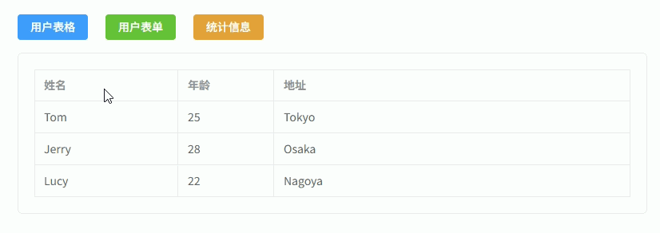

------

## 动态表格列

**动态表格列配置（根据配置数组生成表格列）**
通过 **列配置数组** 动态生成 `el-table-column`，企业项目中常用于 **统一表格组件 / 后台管理系统表格封装**。

```vue
<template>
  <div class="container">
    <!-- 表格 -->
    <el-table :data="tableData" border style="width: 100%"> <!-- ElementPlus 表格 -->

      <!-- 动态列 -->
      <el-table-column
        v-for="col in columns" 
        :key="col.prop" 
        :prop="col.prop" 
        :label="col.label"
        :width="col.width"
        :align="col.align || 'center'"
      /> <!-- 根据 columns 配置生成表格列 -->

    </el-table>
  </div>
</template>

<script setup lang="ts">
import { ref } from "vue" // 引入Vue

/**
 * 表格列配置类型
 */
interface TableColumn { 
  prop: string // 字段名
  label: string // 列标题
  width?: number // 列宽
  align?: "left" | "center" | "right" // 对齐方式
}

/**
 * 用户数据类型
 */
interface User {
  id: number
  name: string
  age: number
  address: string
}

/**
 * 表格列配置
 */
const columns = ref<TableColumn[]>([
  { prop: "id", label: "ID", width: 80 }, // ID列
  { prop: "name", label: "姓名", width: 180 }, // 姓名列
  { prop: "age", label: "年龄", width: 120 }, // 年龄列
  { prop: "address", label: "地址" } // 地址列
])

/**
 * 表格数据
 */
const tableData = ref<User[]>([
  { id: 1, name: "Tom", age: 25, address: "Tokyo" }, // 用户数据
  { id: 2, name: "Jerry", age: 28, address: "Osaka" },
  { id: 3, name: "Lucy", age: 22, address: "Nagoya" }
])
</script>

<style lang="scss" scoped>
.container {
  padding: 20px; // 页面内边距
}
</style>
```

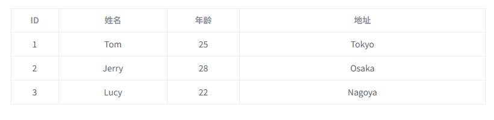

---

## 动态表格列 + 多表头

**动态表格列 + 多表头（支持表头分组 / 表头合并）**
通过 **树形列配置** 动态生成 `el-table-column`，实现 **多级表头（表头分组）**，企业后台常用于 **统计报表 / 财务报表 / 复杂数据表格**。

```vue
<template>
  <div class="container">

    <el-table :data="tableData" border style="width:100%">

      <!-- 动态多级表头 -->
      <template v-for="col in columns" :key="col.prop || col.label">

        <!-- 有子列 -->
        <el-table-column
          v-if="col.children"
          :label="col.label"
          :align="col.align || 'center'"
        >
          <el-table-column
            v-for="child in col.children"
            :key="child.prop"
            :prop="child.prop"
            :label="child.label"
            :width="child.width"
            :align="child.align || 'center'"
          />
        </el-table-column>

        <!-- 普通列 -->
        <el-table-column
          v-else
          :prop="col.prop"
          :label="col.label"
          :width="col.width"
          :align="col.align || 'center'"
        />

      </template>

    </el-table>

  </div>
</template>

<script setup lang="ts">
import { ref } from "vue"

/**
 * 表格列类型
 */
interface TableColumn {
  prop?: string
  label: string
  width?: number
  align?: "left" | "center" | "right"
  children?: TableColumn[]
}

/**
 * 表格列配置（支持多级表头）
 */
const columns = ref<TableColumn[]>([
  {
    prop: "id",
    label: "ID",
    width: 80
  },
  {
    prop: "name",
    label: "姓名",
    width: 150
  },
  {
    label: "基本信息",
    children: [
      {
        prop: "age",
        label: "年龄",
        width: 100
      },
      {
        prop: "gender",
        label: "性别",
        width: 100
      }
    ]
  },
  {
    label: "地址信息",
    children: [
      {
        prop: "province",
        label: "省份",
        width: 120
      },
      {
        prop: "city",
        label: "城市",
        width: 120
      }
    ]
  }
])

/**
 * 表格数据
 */
const tableData = ref([
  {
    id: 1,
    name: "Tom",
    age: 25,
    gender: "男",
    province: "Tokyo",
    city: "Shinjuku"
  },
  {
    id: 2,
    name: "Jerry",
    age: 28,
    gender: "男",
    province: "Osaka",
    city: "Namba"
  },
  {
    id: 3,
    name: "Lucy",
    age: 22,
    gender: "女",
    province: "Nagoya",
    city: "Sakae"
  }
])
</script>

<style lang="scss" scoped>
.container {
  padding: 20px; // 页面内边距
}
</style>
```

------

## 动态表单生成

**动态表单生成（根据配置渲染表单）**
通过 **表单配置数组** 动态生成 `el-form-item` 和不同表单组件（Input / Select / DatePicker 等），常用于 **后台管理系统表单封装、低代码表单**。

```vue
<template>
  <div class="container">
    <el-form :model="formModel" label-width="100px"> <!-- ElementPlus表单 -->

      <!-- 动态表单项 -->
      <el-form-item
          v-for="item in formSchema"
          :key="item.field"
          :label="item.label"
      > <!-- 根据配置生成表单项 -->

        <!-- 动态组件 -->
        <component
            :is="componentMap[item.component]"
            v-model="formModel[item.field]"
            v-bind="item.props"
            style="width: 100%"
        > <!-- 根据component类型渲染不同组件 -->

          <!-- Select选项 -->
          <el-option
              v-for="opt in item.options || []"
              :key="opt.value"
              :label="opt.label"
              :value="opt.value"
          /> <!-- Select选项 -->

        </component>

      </el-form-item>

      <!-- 操作按钮 -->
      <el-form-item>
        <el-button type="primary" @click="submit">提交</el-button> <!-- 提交按钮 -->
        <el-button @click="reset">重置</el-button> <!-- 重置按钮 -->
      </el-form-item>

    </el-form>
  </div>
</template>

<script setup lang="ts">
import { reactive } from "vue" // 引入Vue

/**
 * 表单字段配置类型
 */
interface FormSchema {
  label: string // 表单标签
  field: string // 字段名
  component: string // 组件类型
  props?: Record<string, any> // 组件属性
  options?: { label: string; value: any }[] // Select选项
}

/**
 * 表单组件映射
 */
const componentMap: Record<string, any> = {
  Input: "ElInput", // 输入框
  Select: "ElSelect", // 下拉框
  DatePicker: "ElDatePicker", // 日期选择
  InputNumber: "ElInputNumber" // 数字输入
}

/**
 * 表单配置
 */
const formSchema: FormSchema[] = [
  {
    label: "姓名",
    field: "name",
    component: "Input",
    props: { placeholder: "请输入姓名" }
  },
  {
    label: "年龄",
    field: "age",
    component: "InputNumber",
    props: { min: 0 }
  },
  {
    label: "性别",
    field: "gender",
    component: "Select",
    props: { placeholder: "请选择性别" },
    options: [
      { label: "男", value: "male" },
      { label: "女", value: "female" }
    ]
  },
  {
    label: "生日",
    field: "birthday",
    component: "DatePicker",
    props: { type: "date", placeholder: "选择日期" }
  }
]

/**
 * 表单数据
 */
const formModel = reactive<Record<string, any>>({
  name: "",
  age: 18,
  gender: "",
  birthday: ""
})

/**
 * 提交
 */
const submit = () => {
  console.log("表单数据:", formModel) // 打印表单数据
}

/**
 * 重置
 */
const reset = () => {
  formModel.name = "" // 重置姓名
  formModel.age = 18 // 重置年龄
  formModel.gender = "" // 重置性别
  formModel.birthday = "" // 重置生日
}
</script>

<style lang="scss" scoped>
.container {
  width: 500px; // 表单宽度
  padding: 20px; // 内边距
  background: #fff; // 背景颜色
  border: 1px solid #ebeef5; // 边框
  border-radius: 6px; // 圆角
}
</style>
```

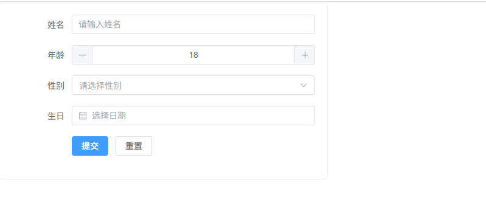

---

## 动态表单校验

**动态表单校验（根据配置自动生成 rules）**
通过 **表单配置生成 ElementPlus 表单校验规则**，常用于 **企业后台系统动态表单 / Schema 表单**。

```vue
<template>
  <div class="container">
    <el-form
        ref="formRef"
        :model="formModel"
        :rules="rules"
        label-width="100px"
    > <!-- ElementPlus表单 -->

      <!-- 动态表单项 -->
      <el-form-item
          v-for="item in formSchema"
          :key="item.field"
          :label="item.label"
          :prop="item.field"
      > <!-- 根据配置生成表单项 -->

        <!-- 动态组件 -->
        <component
            :is="componentMap[item.component]"
            v-model="formModel[item.field]"
            v-bind="item.props"
            style="width: 100%"
        /> <!-- 动态组件 -->

      </el-form-item>

      <!-- 操作按钮 -->
      <el-form-item>
        <el-button type="primary" @click="submit">提交</el-button> <!-- 提交 -->
        <el-button @click="reset">重置</el-button> <!-- 重置 -->
      </el-form-item>

    </el-form>
  </div>
</template>

<script setup lang="ts">
import { reactive, ref } from "vue" // Vue
import type { FormInstance, FormRules } from "element-plus" // 类型

/**
 * 表单字段配置
 */
interface FormSchema {
  label: string // 标签
  field: string // 字段名
  component: string // 组件类型
  required?: boolean // 是否必填
  message?: string // 校验提示
  props?: Record<string, any> // 组件属性
}

/**
 * 表单组件映射
 */
const componentMap: Record<string, any> = {
  Input: "ElInput", // 输入框
  InputNumber: "ElInputNumber", // 数字输入
  DatePicker: "ElDatePicker" // 日期选择
}

/**
 * 表单配置
 */
const formSchema: FormSchema[] = [
  {
    label: "姓名",
    field: "name",
    component: "Input",
    required: true,
    message: "请输入姓名",
    props: { placeholder: "请输入姓名" }
  },
  {
    label: "年龄",
    field: "age",
    component: "InputNumber",
    required: true,
    message: "请输入年龄",
    props: { min: 0 }
  },
  {
    label: "生日",
    field: "birthday",
    component: "DatePicker",
    required: true,
    message: "请选择生日",
    props: { type: "date", placeholder: "选择日期" }
  }
]

/**
 * 表单实例
 */
const formRef = ref<FormInstance>() // 表单引用

/**
 * 表单数据
 */
const formModel = reactive<Record<string, any>>({
  name: "",
  age: null,
  birthday: ""
})

/**
 * 动态生成校验规则
 */
const rules = reactive<FormRules>(
    formSchema.reduce((acc, item) => {
      if (item.required) {
        acc[item.field] = [
          { required: true, message: item.message, trigger: "blur" }
        ] // 生成必填校验规则
      }
      return acc
    }, {} as FormRules)
)

/**
 * 提交
 */
const submit = () => {
  formRef.value?.validate((valid) => { // 执行校验
    if (valid) {
      console.log("表单数据:", formModel) // 校验通过
    }
  })
}

/**
 * 重置
 */
const reset = () => {
  formRef.value?.resetFields() // 重置表单
}
</script>

<style lang="scss" scoped>
.container {
  width: 500px; // 表单宽度
  padding: 20px; // 内边距
  border: 1px solid #ebeef5; // 边框
  border-radius: 6px; // 圆角
  background: #fff; // 背景
}
</style>
```

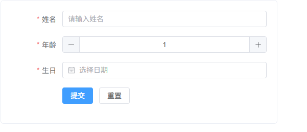

---

## 动态操作列

**动态操作列（根据配置渲染操作按钮）**
通过 **操作列配置数组** 动态生成 `编辑 / 删除 / 查看` 等按钮，常用于 **后台管理系统表格封装组件**。

```vue
<template>
  <div class="container">
    <el-table :data="tableData" border style="width: 100%"> <!-- ElementPlus表格 -->

      <!-- 普通列 -->
      <el-table-column prop="id" label="ID" width="80" align="center" /> <!-- ID列 -->
      <el-table-column prop="name" label="姓名" width="160" /> <!-- 姓名列 -->
      <el-table-column prop="age" label="年龄" width="100" /> <!-- 年龄列 -->
      <el-table-column prop="address" label="地址" /> <!-- 地址列 -->

      <!-- 操作列 -->
      <el-table-column label="操作" width="220" align="center"> <!-- 操作列 -->
        <template #default="{ row }"> <!-- 获取当前行数据 -->

          <el-button
            v-for="btn in actions"
            :key="btn.key"
            :type="btn.type"
            size="small"
            @click="btn.handler(row)"
          > <!-- 根据配置生成操作按钮 -->
            {{ btn.label }}
          </el-button>

        </template>
      </el-table-column>

    </el-table>
  </div>
</template>

<script setup lang="ts">
import { ref } from "vue" // 引入Vue
import { ElMessage, ElMessageBox } from "element-plus" // ElementPlus消息组件

/**
 * 用户类型
 */
interface User {
  id: number
  name: string
  age: number
  address: string
}

/**
 * 操作按钮配置类型
 */
interface TableAction {
  key: string // 唯一key
  label: string // 按钮文字
  type?: "primary" | "success" | "danger" | "warning" | "info" // 按钮类型
  handler: (row: User) => void // 点击事件
}

/**
 * 表格数据
 */
const tableData = ref<User[]>([
  { id: 1, name: "Tom", age: 25, address: "Tokyo" },
  { id: 2, name: "Jerry", age: 28, address: "Osaka" },
  { id: 3, name: "Lucy", age: 22, address: "Nagoya" }
])

/**
 * 操作按钮配置
 */
const actions: TableAction[] = [
  {
    key: "view",
    label: "查看",
    type: "primary",
    handler: (row) => {
      ElMessage.info(`查看用户: ${row.name}`) // 查看操作
    }
  },
  {
    key: "edit",
    label: "编辑",
    type: "success",
    handler: (row) => {
      ElMessage.success(`编辑用户: ${row.name}`) // 编辑操作
    }
  },
  {
    key: "delete",
    label: "删除",
    type: "danger",
    handler: (row) => {
      ElMessageBox.confirm(`确定删除 ${row.name} 吗？`, "提示") // 删除确认
        .then(() => {
          ElMessage.success("删除成功") // 删除成功提示
        })
    }
  }
]
</script>

<style lang="scss" scoped>
.container {
  padding: 20px; // 页面内边距
}
</style>
```

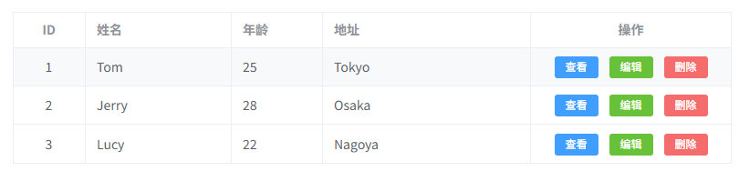

---

## 动态表格列显隐

**动态表格列显隐（用户勾选控制表格列显示）**
通过 **列配置 + Checkbox 选择** 控制 `el-table-column` 是否显示，常用于 **后台系统表格列自定义**。

```vue
<template>
  <div class="container">

    <!-- 列控制 -->
    <div class="toolbar">
      <el-checkbox-group v-model="visibleColumns"> <!-- 控制可见列 -->
        <el-checkbox
          v-for="col in columns"
          :key="col.prop"
          :label="col.prop"
        >
          {{ col.label }} <!-- 列名称 -->
        </el-checkbox>
      </el-checkbox-group>
    </div>

    <!-- 表格 -->
    <el-table :data="tableData" border style="width: 100%"> <!-- ElementPlus表格 -->

      <!-- 动态列 -->
      <el-table-column
        v-for="col in displayColumns"
        :key="col.prop"
        :prop="col.prop"
        :label="col.label"
        :width="col.width"
        align="center"
      /> <!-- 根据可见列渲染 -->

    </el-table>

  </div>
</template>

<script setup lang="ts">
import { ref, computed } from "vue" // 引入Vue

/**
 * 表格列类型
 */
interface TableColumn {
  prop: string // 字段名
  label: string // 列标题
  width?: number // 列宽
}

/**
 * 表格列配置
 */
const columns: TableColumn[] = [
  { prop: "id", label: "ID", width: 80 },
  { prop: "name", label: "姓名", width: 160 },
  { prop: "age", label: "年龄", width: 100 },
  { prop: "address", label: "地址" }
]

/**
 * 默认显示列
 */
const visibleColumns = ref<string[]>(
  columns.map(c => c.prop) // 默认全部显示
)

/**
 * 计算需要显示的列
 */
const displayColumns = computed(() =>
  columns.filter(col => visibleColumns.value.includes(col.prop))
)

/**
 * 用户类型
 */
interface User {
  id: number
  name: string
  age: number
  address: string
}

/**
 * 表格数据
 */
const tableData = ref<User[]>([
  { id: 1, name: "Tom", age: 25, address: "Tokyo" },
  { id: 2, name: "Jerry", age: 28, address: "Osaka" },
  { id: 3, name: "Lucy", age: 22, address: "Nagoya" }
])
</script>

<style lang="scss" scoped>
.container {
  padding: 20px; // 页面内边距
}

.toolbar {
  margin-bottom: 12px; // 控制栏间距
  padding: 10px; // 内边距
  border: 1px solid #ebeef5; // 边框
  border-radius: 6px; // 圆角
  background: #fafafa; // 背景色
}
</style>
```

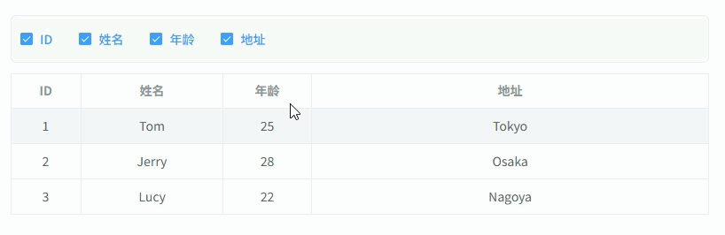

---

## 动态表单布局

**动态表单布局（根据配置自动生成 Grid 表单布局）**
通过 **表单配置 + Grid 列宽配置** 动态生成 `el-row / el-col` 布局，常用于 **后台系统复杂表单布局**。

```vue
<template>
  <div class="container">
    <el-form :model="formModel" label-width="100px"> <!-- ElementPlus表单 -->

      <el-row :gutter="20"> <!-- Grid布局 -->

        <el-col
            v-for="item in formSchema"
            :key="item.field"
            :span="item.span || 12"
        > <!-- 根据配置控制列宽 -->

          <el-form-item :label="item.label"> <!-- 表单项 -->

            <component
                :is="componentMap[item.component]"
                v-model="formModel[item.field]"
                v-bind="item.props"
                style="width: 100%"
            /> <!-- 动态组件 -->

          </el-form-item>

        </el-col>

      </el-row>

      <el-form-item>
        <el-button type="primary" @click="submit">提交</el-button> <!-- 提交 -->
        <el-button @click="reset">重置</el-button> <!-- 重置 -->
      </el-form-item>

    </el-form>
  </div>
</template>

<script setup lang="ts">
import { reactive } from "vue"

/**
 * 表单字段配置
 */
interface FormSchema {
  label: string // 标签
  field: string // 字段名
  component: string // 组件类型
  span?: number // Grid列宽
  props?: Record<string, any> // 组件属性
}

/**
 * 组件映射
 */
const componentMap: Record<string, any> = {
  Input: "ElInput", // 输入框
  Select: "ElSelect", // 下拉框
  DatePicker: "ElDatePicker", // 日期选择
  InputNumber: "ElInputNumber" // 数字输入
}

/**
 * 表单配置
 */
const formSchema: FormSchema[] = [
  {
    label: "姓名",
    field: "name",
    component: "Input",
    span: 12,
    props: { placeholder: "请输入姓名" }
  },
  {
    label: "年龄",
    field: "age",
    component: "InputNumber",
    span: 12,
    props: { min: 0 }
  },
  {
    label: "部门",
    field: "dept",
    component: "Input",
    span: 12,
    props: { placeholder: "请输入部门" }
  },
  {
    label: "入职日期",
    field: "date",
    component: "DatePicker",
    span: 12,
    props: { type: "date", placeholder: "选择日期" }
  },
  {
    label: "备注",
    field: "remark",
    component: "Input",
    span: 24,
    props: { type: "textarea", rows: 3, placeholder: "请输入备注" }
  }
]

/**
 * 表单数据
 */
const formModel = reactive<Record<string, any>>({
  name: "",
  age: 18,
  dept: "",
  date: "",
  remark: ""
})

/**
 * 提交
 */
const submit = () => {
  console.log("表单数据:", formModel) // 输出表单数据
}

/**
 * 重置
 */
const reset = () => {
  formModel.name = "" // 重置姓名
  formModel.age = 18 // 重置年龄
  formModel.dept = "" // 重置部门
  formModel.date = "" // 重置日期
  formModel.remark = "" // 重置备注
}
</script>

<style lang="scss" scoped>
.container {
  padding: 20px; // 内边距
  border: 1px solid #ebeef5; // 边框
  border-radius: 6px; // 圆角
  background: #fff; // 背景
}
</style>
```

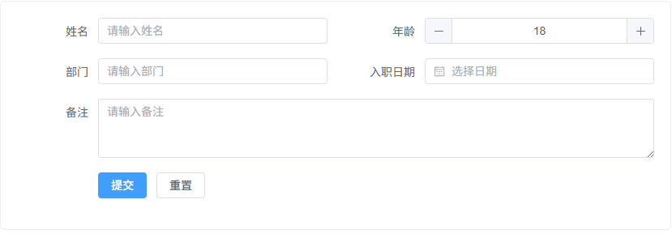

---


## 动态搜索表单

**动态搜索表单（根据配置生成查询表单并触发表格搜索）**
通过 **搜索表单配置数组** 动态生成查询条件，常用于 **后台管理系统列表查询区**。

```vue
<template>
  <div class="container">

    <!-- 搜索表单 -->
    <el-form :model="searchModel" inline> <!-- inline搜索表单 -->

      <el-form-item
          v-for="item in searchSchema"
          :key="item.field"
          :label="item.label"
      > <!-- 根据配置生成查询项 -->

        <component
            :is="componentMap[item.component]"
            v-model="searchModel[item.field]"
            v-bind="item.props"
            style="width: 180px"
        > <!-- 动态组件 -->

          <!-- Select选项 -->
          <el-option
              v-for="opt in item.options || []"
              :key="opt.value"
              :label="opt.label"
              :value="opt.value"
          /> <!-- 下拉选项 -->

        </component>

      </el-form-item>

      <!-- 操作按钮 -->
      <el-form-item>
        <el-button type="primary" @click="search">搜索</el-button> <!-- 搜索 -->
        <el-button @click="reset">重置</el-button> <!-- 重置 -->
      </el-form-item>

    </el-form>

    <!-- 表格 -->
    <el-table :data="tableData" border style="width: 100%; margin-top: 16px"> <!-- 表格 -->
      <el-table-column prop="id" label="ID" width="80" />
      <el-table-column prop="name" label="姓名" width="160" />
      <el-table-column prop="age" label="年龄" width="100" />
      <el-table-column prop="gender" label="性别" width="100" />
    </el-table>

  </div>
</template>

<script setup lang="ts">
import { reactive, ref } from "vue"

/**
 * 搜索字段配置
 */
interface SearchSchema {
  label: string // 标签
  field: string // 字段名
  component: string // 组件类型
  props?: Record<string, any> // 组件属性
  options?: { label: string; value: any }[] // 下拉选项
}

/**
 * 组件映射
 */
const componentMap: Record<string, any> = {
  Input: "ElInput", // 输入框
  Select: "ElSelect", // 下拉框
  InputNumber: "ElInputNumber" // 数字输入
}

/**
 * 搜索配置
 */
const searchSchema: SearchSchema[] = [
  {
    label: "姓名",
    field: "name",
    component: "Input",
    props: { placeholder: "请输入姓名", clearable: true }
  },
  {
    label: "年龄",
    field: "age",
    component: "InputNumber",
    props: { min: 0 }
  },
  {
    label: "性别",
    field: "gender",
    component: "Select",
    props: { placeholder: "请选择", clearable: true },
    options: [
      { label: "男", value: "male" },
      { label: "女", value: "female" }
    ]
  }
]

/**
 * 搜索模型
 */
const searchModel = reactive<Record<string, any>>({
  name: "",
  age: null,
  gender: ""
})

/**
 * 用户数据
 */
interface User {
  id: number
  name: string
  age: number
  gender: string
}

/**
 * 表格数据
 */
const tableData = ref<User[]>([
  { id: 1, name: "Tom", age: 25, gender: "male" },
  { id: 2, name: "Jerry", age: 28, gender: "male" },
  { id: 3, name: "Lucy", age: 22, gender: "female" }
])

/**
 * 搜索
 */
const search = () => {
  console.log("搜索条件:", searchModel) // 实际项目中这里请求接口
}

/**
 * 重置
 */
const reset = () => {
  searchModel.name = "" // 重置姓名
  searchModel.age = null // 重置年龄
  searchModel.gender = "" // 重置性别
}
</script>

<style lang="scss" scoped>
.container {
  padding: 20px; // 内边距
}
</style>
```

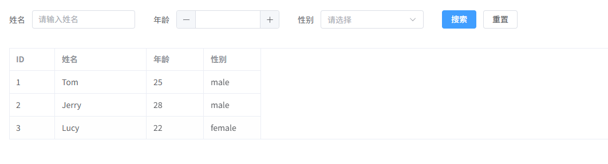

---

## 动态组件 + Dialog

**动态组件 + Dialog（根据类型动态加载弹窗组件）**
通过 `component :is` 在 `el-dialog` 中动态渲染不同业务组件，例如 **新增 / 编辑 / 查看弹窗**。

```vue
<template>
  <div class="container">

    <!-- 操作按钮 -->
    <el-button type="primary" @click="openDialog('create')">新增用户</el-button> <!-- 新增 -->
    <el-button type="success" @click="openDialog('edit')">编辑用户</el-button> <!-- 编辑 -->
    <el-button type="info" @click="openDialog('view')">查看用户</el-button> <!-- 查看 -->

    <!-- Dialog -->
    <el-dialog
      v-model="visible"
      :title="dialogTitle"
      width="500px"
    > <!-- ElementPlus弹窗 -->

      <!-- 动态组件 -->
      <component
        :is="componentMap[current]"
        :data="dialogData"
      /> <!-- 根据类型动态渲染组件 -->

    </el-dialog>

  </div>
</template>

<script setup lang="ts">
import { ref, computed } from "vue" // Vue
import CreateUser from "./components/CreateUser.vue" // 新增组件
import EditUser from "./components/EditUser.vue" // 编辑组件
import ViewUser from "./components/ViewUser.vue" // 查看组件

/**
 * 弹窗组件映射
 */
const componentMap = {
  create: CreateUser, // 新增
  edit: EditUser, // 编辑
  view: ViewUser // 查看
}

/**
 * 当前组件
 */
const current = ref<keyof typeof componentMap>("create") // 当前弹窗类型

/**
 * 弹窗显示状态
 */
const visible = ref(false) // 是否显示Dialog

/**
 * 弹窗数据
 */
const dialogData = ref({
  id: 1,
  name: "Tom",
  age: 25
}) // 示例数据

/**
 * 打开弹窗
 */
const openDialog = (type: keyof typeof componentMap) => {
  current.value = type // 设置当前组件
  visible.value = true // 打开弹窗
}

/**
 * 弹窗标题
 */
const dialogTitle = computed(() => {
  const map = {
    create: "新增用户",
    edit: "编辑用户",
    view: "查看用户"
  }
  return map[current.value]
})
</script>

<style lang="scss" scoped>
.container {
  padding: 20px; // 页面内边距
  display: flex; // flex布局
  gap: 10px; // 按钮间距
}
</style>
```


---


## 动态表单项增删

**动态表单项增删（可动态添加 / 删除表单行）**
通过 **数组控制表单项**，常用于 **联系人列表、地址列表、商品规格等场景**。

```vue
<template>
  <div class="container">

    <el-form :model="formModel" label-width="100px"> <!-- ElementPlus表单 -->

      <!-- 动态表单行 -->
      <div
        v-for="(item, index) in formModel.contacts"
        :key="index"
        class="row"
      > <!-- 根据数组渲染表单行 -->

        <el-row :gutter="10">

          <el-col :span="8">
            <el-form-item label="姓名">
              <el-input v-model="item.name" placeholder="联系人姓名" /> <!-- 姓名 -->
            </el-form-item>
          </el-col>

          <el-col :span="8">
            <el-form-item label="电话">
              <el-input v-model="item.phone" placeholder="联系电话" /> <!-- 电话 -->
            </el-form-item>
          </el-col>

          <el-col :span="6">
            <el-form-item label="地址">
              <el-input v-model="item.address" placeholder="联系地址" /> <!-- 地址 -->
            </el-form-item>
          </el-col>

          <el-col :span="2" class="actions">
            <el-button
              type="danger"
              icon="Delete"
              @click="remove(index)"
            /> <!-- 删除当前行 -->
          </el-col>

        </el-row>

      </div>

      <!-- 新增按钮 -->
      <el-form-item>
        <el-button type="primary" @click="add">新增联系人</el-button> <!-- 新增表单行 -->
      </el-form-item>

    </el-form>

  </div>
</template>

<script setup lang="ts">
import { reactive } from "vue" // Vue

/**
 * 联系人类型
 */
interface Contact {
  name: string
  phone: string
  address: string
}

/**
 * 表单数据
 */
const formModel = reactive({
  contacts: [
    { name: "", phone: "", address: "" } // 默认一行
  ] as Contact[]
})

/**
 * 新增表单行
 */
const add = () => {
  formModel.contacts.push({
    name: "",
    phone: "",
    address: ""
  }) // 添加新联系人
}

/**
 * 删除表单行
 */
const remove = (index: number) => {
  formModel.contacts.splice(index, 1) // 删除指定行
}
</script>

<style lang="scss" scoped>
.container {
  padding: 20px; // 页面内边距
}

.row {
  margin-bottom: 10px; // 表单行间距
  padding: 10px; // 内边距
  border: 1px solid #ebeef5; // 边框
  border-radius: 6px; // 圆角
}

.actions {
  display: flex; // flex布局
  align-items: center; // 垂直居中
}
</style>
```

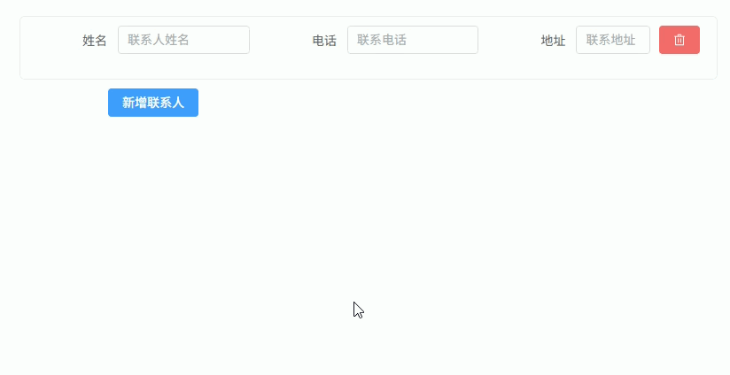

---

## 动态 Tabs 组件

**动态 Tabs 组件（根据配置动态生成 Tabs 并加载组件）**
通过 **Tabs 配置数组 + `component :is`** 动态加载不同页面组件，常用于 **后台系统模块切换页面**。

```vue
<template>
  <div class="container">

    <!-- Tabs -->
    <el-tabs v-model="activeTab"> <!-- 当前激活Tab -->

      <el-tab-pane
          v-for="tab in tabs"
          :key="tab.name"
          :label="tab.label"
          :name="tab.name"
      /> <!-- 根据配置生成Tabs -->

    </el-tabs>

    <!-- 动态组件 -->
    <div class="content">
      <component :is="componentMap[activeTab]" /> <!-- 根据当前Tab加载组件 -->
    </div>

  </div>
</template>

<script setup lang="ts">
import { ref } from "vue" // Vue
import UserTable from "./components/UserTable.vue" // 表格组件
import UserForm from "./components/UserForm.vue" // 表单组件
import UserStats from "./components/UserStats.vue" // 统计组件

/**
 * Tabs配置类型
 */
interface TabItem {
  name: string
  label: string
}

/**
 * Tabs配置
 */
const tabs: TabItem[] = [
  { name: "table", label: "用户列表" },
  { name: "form", label: "用户表单" },
  { name: "stats", label: "用户统计" }
]

/**
 * 组件映射
 */
const componentMap: Record<string, any> = {
  table: UserTable, // 用户列表
  form: UserForm, // 用户表单
  stats: UserStats // 用户统计
}

/**
 * 当前Tab
 */
const activeTab = ref("table") // 默认Tab
</script>

<style lang="scss" scoped>
.container {
  padding: 20px; // 页面内边距
}

.content {
  margin-top: 16px; // Tabs下方间距
  padding: 20px; // 内边距
  border: 1px solid #ebeef5; // 边框
  border-radius: 6px; // 圆角
  background: #fff; // 背景
}
</style>
```

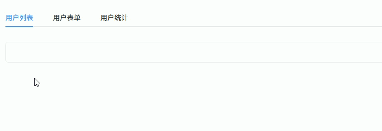

---

## 动态表格单元格组件

**动态表格单元格组件（根据字段类型渲染不同组件）**
通过 **列配置 + `component :is`** 动态渲染表格单元格，例如 **Tag / Switch / 文本等组件**。

```vue
<template>
  <div class="container">

    <el-table :data="tableData" border style="width: 100%"> <!-- ElementPlus表格 -->

      <!-- 动态列 -->
      <el-table-column
          v-for="col in columns"
          :key="col.prop"
          :label="col.label"
          :width="col.width"
      >

        <!-- 自定义单元格 -->
        <template #default="{ row }">

          <component
              :is="cellComponentMap[col.type]"
              :value="row[col.prop]"
              :row="row"
          /> <!-- 根据type渲染不同组件 -->

        </template>

      </el-table-column>

    </el-table>

  </div>
</template>

<script setup lang="ts">
import { ref } from "vue" // Vue
import TextCell from "./cells/TextCell.vue" // 文本组件
import TagCell from "./cells/TagCell.vue" // Tag组件
import SwitchCell from "./cells/SwitchCell.vue" // Switch组件

/**
 * 用户类型
 */
interface User {
  id: number
  name: string
  status: string
  enable: boolean
}

/**
 * 列配置类型
 */
interface TableColumn {
  prop: keyof User
  label: string
  width?: number
  type: string
}

/**
 * 表格列配置
 */
const columns: TableColumn[] = [
  { prop: "id", label: "ID", width: 80, type: "text" },
  { prop: "name", label: "姓名", width: 160, type: "text" },
  { prop: "status", label: "状态", width: 120, type: "tag" },
  { prop: "enable", label: "启用", width: 120, type: "switch" }
]

/**
 * 单元格组件映射
 */
const cellComponentMap: Record<string, any> = {
  text: TextCell, // 文本组件
  tag: TagCell, // Tag组件
  switch: SwitchCell // Switch组件
}

/**
 * 表格数据
 */
const tableData = ref<User[]>([
  { id: 1, name: "Tom", status: "active", enable: true },
  { id: 2, name: "Jerry", status: "disabled", enable: false },
  { id: 3, name: "Lucy", status: "active", enable: true }
])
</script>

<style lang="scss" scoped>
.container {
  padding: 20px; // 页面内边距
}
</style>
```


## 表格行内编辑

**表格行内编辑（根据编辑状态动态切换单元格组件）**
通过 **行编辑状态 + `component :is`** 在 `Input / Text` 之间切换，实现 **表格行内编辑**。

```vue
<template>
  <div class="container">

    <el-table :data="tableData" border style="width: 100%"> <!-- ElementPlus表格 -->

      <!-- ID -->
      <el-table-column prop="id" label="ID" width="80" align="center" /> <!-- ID列 -->

      <!-- 姓名 -->
      <el-table-column label="姓名" width="180">
        <template #default="{ row }">

          <component
            :is="row.editing ? ElInput : 'span'"
            v-model="row.name"
            v-bind="row.editing ? { size: 'small' } : {}"
          >
            <template v-if="!row.editing">{{ row.name }}</template>
          </component> <!-- 编辑模式Input / 查看模式文本 -->

        </template>
      </el-table-column>

      <!-- 年龄 -->
      <el-table-column label="年龄" width="120">
        <template #default="{ row }">

          <component
            :is="row.editing ? ElInputNumber : 'span'"
            v-model="row.age"
            v-bind="row.editing ? { size: 'small', min: 0 } : {}"
          >
            <template v-if="!row.editing">{{ row.age }}</template>
          </component> <!-- 编辑模式InputNumber -->

        </template>
      </el-table-column>

      <!-- 地址 -->
      <el-table-column label="地址">
        <template #default="{ row }">

          <component
            :is="row.editing ? ElInput : 'span'"
            v-model="row.address"
            v-bind="row.editing ? { size: 'small' } : {}"
          >
            <template v-if="!row.editing">{{ row.address }}</template>
          </component> <!-- 编辑模式Input -->

        </template>
      </el-table-column>

      <!-- 操作 -->
      <el-table-column label="操作" width="180" align="center">
        <template #default="{ row }">

          <el-button
            v-if="!row.editing"
            type="primary"
            size="small"
            @click="editRow(row)"
          >
            编辑
          </el-button> <!-- 进入编辑 -->

          <el-button
            v-if="row.editing"
            type="success"
            size="small"
            @click="saveRow(row)"
          >
            保存
          </el-button> <!-- 保存 -->

          <el-button
            v-if="row.editing"
            size="small"
            @click="cancelRow(row)"
          >
            取消
          </el-button> <!-- 取消 -->

        </template>
      </el-table-column>

    </el-table>

  </div>
</template>

<script setup lang="ts">
import { ref } from "vue" // Vue
import { ElInput, ElInputNumber } from "element-plus" // ElementPlus组件

/**
 * 用户类型
 */
interface User {
  id: number
  name: string
  age: number
  address: string
  editing?: boolean // 是否编辑状态
  _backup?: Omit<User, "editing" | "_backup"> // 编辑前备份
}

/**
 * 表格数据
 */
const tableData = ref<User[]>([
  { id: 1, name: "Tom", age: 25, address: "Tokyo", editing: false },
  { id: 2, name: "Jerry", age: 28, address: "Osaka", editing: false },
  { id: 3, name: "Lucy", age: 22, address: "Nagoya", editing: false }
])

/**
 * 进入编辑
 */
const editRow = (row: User) => {
  row._backup = { name: row.name, age: row.age, address: row.address, id: row.id } // 备份数据
  row.editing = true // 开启编辑
}

/**
 * 保存
 */
const saveRow = (row: User) => {
  row.editing = false // 关闭编辑
  row._backup = undefined // 清除备份
}

/**
 * 取消
 */
const cancelRow = (row: User) => {
  if (row._backup) {
    row.name = row._backup.name // 恢复姓名
    row.age = row._backup.age // 恢复年龄
    row.address = row._backup.address // 恢复地址
  }
  row.editing = false // 关闭编辑
}
</script>

<style lang="scss" scoped>
.container {
  padding: 20px; // 页面内边距
}
</style>
```

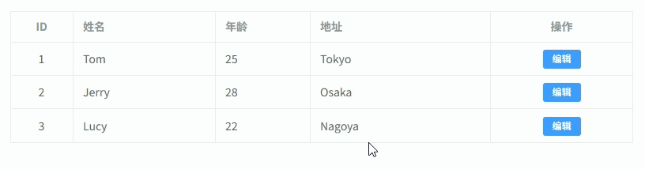

---

## Step 步骤表单

**Step 步骤表单（每一步使用动态组件渲染）**
通过 **`el-steps` + `component :is`** 动态加载不同步骤表单组件，实现 **多步骤表单流程**。

```vue
<template>
  <div class="container">

    <!-- 步骤条 -->
    <el-steps :active="activeStep" finish-status="success"> <!-- 当前步骤 -->
      <el-step
        v-for="step in steps"
        :key="step.name"
        :title="step.title"
      /> <!-- 根据配置生成步骤 -->
    </el-steps>

    <!-- 步骤内容 -->
    <div class="content">
      <component
        :is="componentMap[steps[activeStep].name]"
        v-model="formData"
      /> <!-- 根据步骤加载组件 -->
    </div>

    <!-- 操作按钮 -->
    <div class="actions">

      <el-button
        :disabled="activeStep === 0"
        @click="prev"
      >
        上一步
      </el-button> <!-- 上一步 -->

      <el-button
        v-if="activeStep < steps.length - 1"
        type="primary"
        @click="next"
      >
        下一步
      </el-button> <!-- 下一步 -->

      <el-button
        v-else
        type="success"
        @click="submit"
      >
        提交
      </el-button> <!-- 提交 -->

    </div>

  </div>
</template>

<script setup lang="ts">
import { ref, reactive } from "vue" // Vue
import StepUser from "./steps/StepUser.vue" // 用户信息步骤
import StepAddress from "./steps/StepAddress.vue" // 地址信息步骤
import StepConfirm from "./steps/StepConfirm.vue" // 确认步骤

/**
 * 步骤配置类型
 */
interface StepItem {
  name: string
  title: string
}

/**
 * 步骤配置
 */
const steps: StepItem[] = [
  { name: "user", title: "用户信息" },
  { name: "address", title: "地址信息" },
  { name: "confirm", title: "确认提交" }
]

/**
 * 组件映射
 */
const componentMap = {
  user: StepUser, // 用户信息
  address: StepAddress, // 地址信息
  confirm: StepConfirm // 确认
}

/**
 * 当前步骤
 */
const activeStep = ref(0) // 当前步骤索引

/**
 * 表单数据
 */
const formData = reactive({
  name: "",
  age: 0,
  city: "",
  address: ""
})

/**
 * 下一步
 */
const next = () => {
  if (activeStep.value < steps.length - 1) {
    activeStep.value++ // 步骤+1
  }
}

/**
 * 上一步
 */
const prev = () => {
  if (activeStep.value > 0) {
    activeStep.value-- // 步骤-1
  }
}

/**
 * 提交
 */
const submit = () => {
  console.log("提交数据:", formData) // 提交数据
}
</script>

<style lang="scss" scoped>
.container {
  padding: 20px; // 内边距
}

.content {
  margin-top: 20px; // 步骤内容间距
  padding: 20px; // 内边距
  border: 1px solid #ebeef5; // 边框
  border-radius: 6px; // 圆角
  background: #fff; // 背景
}

.actions {
  margin-top: 20px; // 按钮区域间距
  display: flex; // flex布局
  justify-content: flex-end; // 右对齐
  gap: 10px; // 按钮间距
}
</style>
```

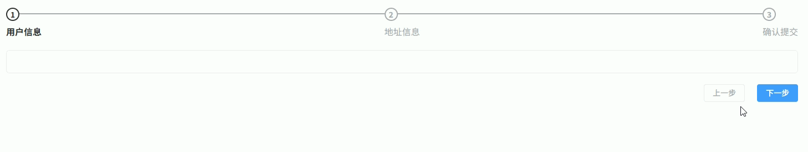

---

## 动态组件权限控制

**动态组件权限控制（根据权限动态渲染组件 / 按钮）**
通过 **权限配置 + `component :is` + 条件过滤** 控制组件是否渲染，常用于 **后台系统 RBAC 权限控制**。

```vue
<template>
  <div class="container">

    <!-- 动态组件区域 -->
    <div class="modules">

      <component
        v-for="item in visibleModules"
        :key="item.key"
        :is="componentMap[item.component]"
      /> <!-- 根据权限渲染组件 -->

    </div>

    <!-- 操作按钮 -->
    <div class="toolbar">

      <el-button
        v-for="btn in visibleActions"
        :key="btn.key"
        :type="btn.type"
        size="small"
        @click="btn.handler"
      >
        {{ btn.label }}
      </el-button> <!-- 根据权限渲染按钮 -->

    </div>

  </div>
</template>

<script setup lang="ts">
import { computed } from "vue" // Vue
import UserTable from "./modules/UserTable.vue" // 用户模块
import RoleTable from "./modules/RoleTable.vue" // 角色模块
import Dashboard from "./modules/Dashboard.vue" // 仪表盘

/**
 * 当前用户权限（通常来自后端）
 */
const userPermissions = [
  "dashboard:view",
  "user:view",
  "user:add",
  "user:edit"
]

/**
 * 模块配置
 */
interface ModuleItem {
  key: string
  component: string
  permission: string
}

/**
 * 模块列表
 */
const modules: ModuleItem[] = [
  { key: "dashboard", component: "Dashboard", permission: "dashboard:view" },
  { key: "user", component: "UserTable", permission: "user:view" },
  { key: "role", component: "RoleTable", permission: "role:view" }
]

/**
 * 组件映射
 */
const componentMap: Record<string, any> = {
  Dashboard,
  UserTable,
  RoleTable
}

/**
 * 按钮配置
 */
interface ActionItem {
  key: string
  label: string
  type: "primary" | "success" | "danger" | "warning" | "info"
  permission: string
  handler: () => void
}

const actions: ActionItem[] = [
  {
    key: "add",
    label: "新增",
    type: "primary",
    permission: "user:add",
    handler: () => console.log("新增用户")
  },
  {
    key: "edit",
    label: "编辑",
    type: "success",
    permission: "user:edit",
    handler: () => console.log("编辑用户")
  },
  {
    key: "delete",
    label: "删除",
    type: "danger",
    permission: "user:delete",
    handler: () => console.log("删除用户")
  }
]

/**
 * 可见模块
 */
const visibleModules = computed(() =>
  modules.filter(m => userPermissions.includes(m.permission))
)

/**
 * 可见按钮
 */
const visibleActions = computed(() =>
  actions.filter(a => userPermissions.includes(a.permission))
)
</script>

<style lang="scss" scoped>
.container {
  padding: 20px; // 页面内边距
}

.modules {
  display: grid; // grid布局
  grid-template-columns: repeat(2, 1fr); // 两列
  gap: 20px; // 模块间距
  margin-bottom: 20px; // 下方间距
}

.toolbar {
  display: flex; // flex布局
  gap: 10px; // 按钮间距
}
</style>
```

---

## 异步动态组件加载

**异步动态组件加载（`defineAsyncComponent` 按需加载组件）**
通过 **`defineAsyncComponent` + `component :is`** 实现组件 **按需加载（懒加载）**，常用于 **大型页面模块优化首屏性能**。

```vue
<template>
  <div class="container">

    <!-- 操作按钮 -->
    <div class="toolbar">
      <el-button @click="switchModule('user')">用户模块</el-button> <!-- 切换用户模块 -->
      <el-button @click="switchModule('role')">角色模块</el-button> <!-- 切换角色模块 -->
      <el-button @click="switchModule('report')">报表模块</el-button> <!-- 切换报表模块 -->
    </div>

    <!-- 动态组件 -->
    <div class="content">
      <component :is="componentMap[current]" /> <!-- 按需加载组件 -->
    </div>

  </div>
</template>

<script setup lang="ts">
import { ref, defineAsyncComponent } from "vue" // Vue

/**
 * 当前模块
 */
const current = ref<keyof typeof componentMap>("user") // 默认模块

/**
 * 异步组件映射
 */
const componentMap = {
  user: defineAsyncComponent(() => import("./modules/UserModule.vue")), // 用户模块
  role: defineAsyncComponent(() => import("./modules/RoleModule.vue")), // 角色模块
  report: defineAsyncComponent(() => import("./modules/ReportModule.vue")) // 报表模块
}

/**
 * 切换模块
 */
const switchModule = (name: keyof typeof componentMap) => {
  current.value = name // 更新当前组件
}
</script>

<style lang="scss" scoped>
.container {
  padding: 20px; // 页面内边距
}

.toolbar {
  display: flex; // flex布局
  gap: 10px; // 按钮间距
  margin-bottom: 16px; // 下方间距
}

.content {
  padding: 20px; // 内边距
  border: 1px solid #ebeef5; // 边框
  border-radius: 6px; // 圆角
  background: #fff; // 背景色
}
</style>
```


## Dashboard 动态组件

**Dashboard 动态组件（根据配置动态渲染统计卡片 / 图表组件）**

```vue
<template>
  <div class="dashboard">

    <!-- 动态渲染组件 -->
    <component
      v-for="item in widgets"
      :key="item.key"
      :is="componentMap[item.component]"
      v-bind="item.props"
      class="widget"
    /> <!-- 根据配置动态渲染组件 -->

  </div>
</template>

<script setup lang="ts">
import { reactive } from "vue" // Vue
import StatsCard from "./widgets/StatsCard.vue" // 统计卡片组件
import ChartLine from "./widgets/ChartLine.vue" // 折线图组件
import ChartPie from "./widgets/ChartPie.vue" // 饼图组件

/**
 * Dashboard组件配置
 */
interface WidgetItem {
  key: string
  component: string
  props?: Record<string, any>
}

/**
 * 组件映射
 */
const componentMap: Record<string, any> = {
  StatsCard,
  ChartLine,
  ChartPie
}

/**
 * 仪表盘组件列表（通常来自后端）
 */
const widgets = reactive<WidgetItem[]>([
  {
    key: "userCount",
    component: "StatsCard",
    props: {
      title: "用户数量",
      value: 1200
    }
  },
  {
    key: "orderTrend",
    component: "ChartLine",
    props: {
      title: "订单趋势"
    }
  },
  {
    key: "salesRatio",
    component: "ChartPie",
    props: {
      title: "销售占比"
    }
  }
])
</script>

<style lang="scss" scoped>
.dashboard {
  display: grid; // grid布局
  grid-template-columns: repeat(3, 1fr); // 三列布局
  gap: 20px; // 组件间距
}

.widget {
  background: #fff; // 背景色
  border-radius: 8px; // 圆角
  padding: 16px; // 内边距
  box-shadow: 0 2px 8px rgba(0,0,0,0.05); // 阴影
}
</style>
```


## JSON 表单设计器基础

**JSON 表单设计器基础（通过 JSON 配置渲染可编辑表单）**

```vue
<template>
  <div class="container">

    <!-- 表单预览 -->
    <div class="form-area">

      <el-form :model="formData" label-width="100px">

        <el-form-item
          v-for="item in schema"
          :key="item.field"
          :label="item.label"
        >
          <component
            :is="componentMap[item.component]"
            v-model="formData[item.field]"
            v-bind="item.props"
          /> <!-- 根据 JSON 渲染组件 -->
        </el-form-item>

      </el-form>

    </div>

    <!-- JSON 配置编辑 -->
    <div class="json-area">

      <el-input
        v-model="schemaJson"
        type="textarea"
        :rows="18"
      /> <!-- 编辑 JSON -->

      <el-button type="primary" @click="applySchema">
        应用 JSON
      </el-button>

    </div>

  </div>
</template>

<script setup lang="ts">
import { ref, reactive } from "vue"

/**
 * 表单数据
 */
const formData = reactive<Record<string, any>>({})

/**
 * schema
 */
const schema = ref<any[]>([
  {
    field: "name",
    label: "姓名",
    component: "el-input",
    props: { placeholder: "请输入姓名" }
  },
  {
    field: "age",
    label: "年龄",
    component: "el-input-number",
    props: { min: 1 }
  }
])

/**
 * JSON 文本
 */
const schemaJson = ref(JSON.stringify(schema.value, null, 2))

/**
 * 组件映射
 */
const componentMap: Record<string, any> = {
  "el-input": "el-input",
  "el-input-number": "el-input-number",
  "el-date-picker": "el-date-picker"
}

/**
 * 应用 JSON
 */
const applySchema = () => {
  try {
    schema.value = JSON.parse(schemaJson.value)
  } catch (e) {
    console.error("JSON格式错误")
  }
}
</script>

<style lang="scss" scoped>
.container {
  display: grid; // grid布局
  grid-template-columns: 1fr 1fr; // 两列布局
  gap: 20px; // 间距
}

.form-area {
  padding: 20px; // 内边距
  border: 1px solid #ebeef5; // 边框
  border-radius: 6px; // 圆角
  background: #fff; // 背景
}

.json-area {
  display: flex; // flex布局
  flex-direction: column; // 垂直布局
  gap: 10px; // 间距
}
</style>
```

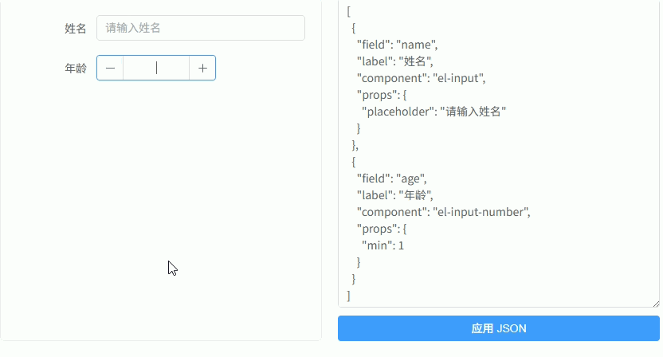