# 键鼠事件


## 按钮点击事件（click）

```vue
<template>
  <div class="page">
    <h2>按钮点击事件（click）</h2>

    <!-- 基础点击事件 -->
    <el-button type="primary" @click="handleClick">
      点击我
    </el-button>

    <!-- 带参数的点击事件 -->
    <el-button type="success" @click="handleClickWithParams('Vue3 + TS')">
      点击传参
    </el-button>

    <!-- 阻止事件冒泡 -->
    <div class="box" @click="handleParentClick">
      父元素
      <el-button type="danger" @click.stop="handleChildClick">
        子按钮（阻止冒泡）
      </el-button>
    </div>
  </div>
</template>

<script setup lang="ts">
import { ElMessage } from 'element-plus'

/**
 * 基础点击事件
 */
const handleClick = (): void => {
  ElMessage.success('按钮被点击了')
}

/**
 * 带参数的点击事件
 * @param msg 传递的参数
 */
const handleClickWithParams = (msg: string): void => {
  ElMessage.info(`参数：${msg}`)
}

/**
 * 父元素点击事件
 */
const handleParentClick = (): void => {
  ElMessage.warning('父元素被点击')
}

/**
 * 子元素点击事件
 */
const handleChildClick = (): void => {
  ElMessage.error('子按钮被点击（已阻止冒泡）')
}
</script>

<style scoped>
.page {
  padding: 20px;
}

/* 父容器样式 */
.box {
  margin-top: 20px;
  padding: 20px;
  border: 1px dashed #409eff; /* 蓝色虚线边框 */
  cursor: pointer; /* 鼠标变小手 */
}
</style>
```

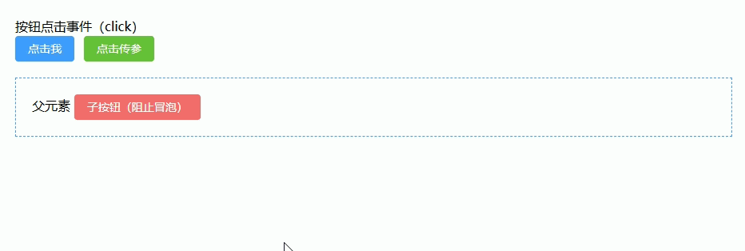

## 双击事件（dblclick）

```vue
<template>
  <div class="page">
    <h2>双击事件（dblclick）</h2>

    <!-- 基础双击事件 -->
    <el-button type="primary" @dblclick="handleDblClick">
      双击我
    </el-button>

    <!-- 单击 + 双击区分 -->
    <el-button
        type="success"
        @click="handleClick"
        @dblclick="handleDblClickOnly"
    >
      单击 / 双击测试
    </el-button>

    <!-- 双击编辑示例 -->
    <div class="edit-box" @dblclick="enableEdit">
      <el-input
          v-if="isEditing"
          v-model="text"
          ref="inputRef"
          @blur="disableEdit"
      />
      <span v-else>{{ text }}</span>
    </div>
  </div>
</template>

<script setup lang="ts">
import { ref, nextTick } from 'vue'
import { ElMessage } from 'element-plus'

/**
 * 基础双击事件
 */
const handleDblClick = (): void => {
  ElMessage.success('触发双击事件')
}

/**
 * 单击事件（用于区分单双击）
 */
let clickTimer: number | null = null
const delay = 250 // 延迟250ms区分单击/双击

const handleClick = (): void => {
  // 先清除已有定时器，避免重复
  if (clickTimer) clearTimeout(clickTimer)

  clickTimer = window.setTimeout(() => {
    ElMessage.info('单击事件')
    clickTimer = null
  }, delay)
}

/**
 * 双击事件（清除单击）
 */
const handleDblClickOnly = (): void => {
  if (clickTimer) {
    clearTimeout(clickTimer)
    clickTimer = null
  }
  ElMessage.success('双击事件（已屏蔽单击）')
}

/**
 * 双击编辑
 */
const isEditing = ref(false)
const text = ref('双击这里进行编辑')
const inputRef = ref<HTMLInputElement | null>(null)

const enableEdit = (): void => {
  isEditing.value = true
  // 下一个 DOM 更新周期再聚焦
  nextTick(() => {
    inputRef.value?.focus()
  })
}

const disableEdit = (): void => {
  isEditing.value = false
}
</script>

<style scoped>
.page {
  padding: 20px;
}

/* 可编辑区域 */
.edit-box {
  margin-top: 20px;
  padding: 10px;
  border: 1px solid #dcdfe6; /* Element 边框色 */
  cursor: pointer; /* 鼠标提示可点击 */
  width: 300px;
}
</style>
```

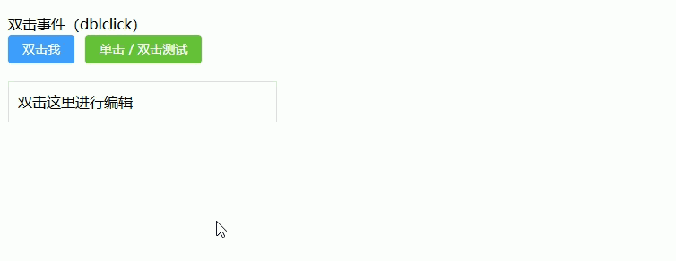

## 右键菜单（contextmenu 自定义菜单）

**在指定区域右键弹出自定义菜单，支持点击操作与关闭菜单**

```vue
<template>
  <div class="page">
    <h2>右键菜单（contextmenu 自定义菜单）</h2>

    <!-- 右键区域 -->
    <div
      class="target"
      @contextmenu.prevent="openMenu" 
    >
      在此区域右键点击
    </div>

    <!-- 自定义右键菜单 -->
    <ul
      v-if="visible"
      class="menu"
      :style="{ top: y + 'px', left: x + 'px' }"
    >
      <li @click="handleAction('复制')">复制</li>
      <li @click="handleAction('粘贴')">粘贴</li>
      <li @click="handleAction('删除')">删除</li>
    </ul>
  </div>
</template>

<script setup lang="ts">
import { ref, onMounted, onBeforeUnmount } from 'vue'
import { ElMessage } from 'element-plus'

/**
 * 菜单显示状态
 */
const visible = ref(false)

/**
 * 菜单位置
 */
const x = ref(0)
const y = ref(0)

/**
 * 打开菜单
 * @param e 鼠标事件
 */
const openMenu = (e: MouseEvent): void => {
  x.value = e.clientX // 鼠标X坐标
  y.value = e.clientY // 鼠标Y坐标
  visible.value = true
}

/**
 * 点击菜单项
 */
const handleAction = (action: string): void => {
  ElMessage.success(`点击了：${action}`)
  visible.value = false
}

/**
 * 全局点击关闭菜单
 */
const closeMenu = (): void => {
  visible.value = false
}

onMounted(() => {
  window.addEventListener('click', closeMenu) // 点击任意位置关闭
})

onBeforeUnmount(() => {
  window.removeEventListener('click', closeMenu) // 清理事件
})
</script>

<style scoped>
.page {
  padding: 20px;
}

/* 右键区域 */
.target {
  width: 300px;
  height: 150px;
  border: 1px dashed #409eff; /* 蓝色虚线 */
  display: flex;
  align-items: center;
  justify-content: center;
  cursor: context-menu; /* 鼠标右键样式 */
}

/* 菜单样式 */
.menu {
  position: fixed; /* 固定定位，跟随鼠标 */
  list-style: none;
  padding: 5px 0;
  margin: 0;
  width: 120px;
  background: #fff;
  border: 1px solid #dcdfe6; /* 边框 */
  box-shadow: 0 2px 8px rgba(0, 0, 0, 0.15); /* 阴影 */
  z-index: 999;
}

/* 菜单项 */
.menu li {
  padding: 8px 12px;
  cursor: pointer;
}

/* hover效果 */
.menu li:hover {
  background: #ecf5ff; /* Element hover色 */
}
</style>
```

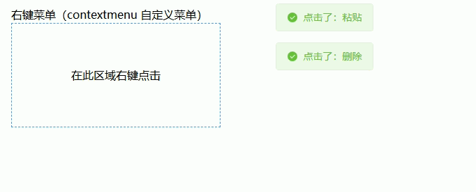

## 鼠标移入移出（mouseenter / mouseleave）

**鼠标进入元素触发高亮，移出恢复状态，常用于卡片/按钮 hover 效果**

```vue
<template>
  <div class="page">
    <h2>鼠标移入移出（mouseenter / mouseleave）</h2>

    <!-- 基础 hover 效果 -->
    <div
      class="box"
      :class="{ active: isHover }"
      @mouseenter="handleEnter"
      @mouseleave="handleLeave"
    >
      鼠标移入试试
    </div>

    <!-- 列表 hover 高亮 -->
    <ul class="list">
      <li
        v-for="item in list"
        :key="item"
        :class="{ active: activeItem === item }"
        @mouseenter="activeItem = item"
        @mouseleave="activeItem = ''"
      >
        {{ item }}
      </li>
    </ul>
  </div>
</template>

<script setup lang="ts">
import { ref } from 'vue'

/**
 * 单个元素 hover 状态
 */
const isHover = ref(false)

/**
 * 鼠标进入
 */
const handleEnter = (): void => {
  isHover.value = true
}

/**
 * 鼠标移出
 */
const handleLeave = (): void => {
  isHover.value = false
}

/**
 * 列表 hover 控制
 */
const list = ['选项1', '选项2', '选项3']
const activeItem = ref('')
</script>

<style scoped>
.page {
  padding: 20px;
}

/* 基础盒子 */
.box {
  width: 200px;
  height: 100px;
  border: 1px solid #dcdfe6; /* 默认边框 */
  display: flex;
  align-items: center;
  justify-content: center;
  transition: all 0.3s; /* 平滑过渡 */
}

/* hover 激活状态 */
.box.active {
  border-color: #409eff; /* 高亮边框 */
  background: #ecf5ff; /* 浅蓝背景 */
}

/* 列表 */
.list {
  margin-top: 20px;
  padding: 0;
  list-style: none;
}

/* 列表项 */
.list li {
  padding: 10px;
  border: 1px solid #ebeef5;
  margin-bottom: 5px;
  transition: all 0.2s;
}

/* hover 高亮 */
.list li.active {
  background: #f0f9eb; /* 绿色高亮 */
  border-color: #67c23a;
}
</style>
```

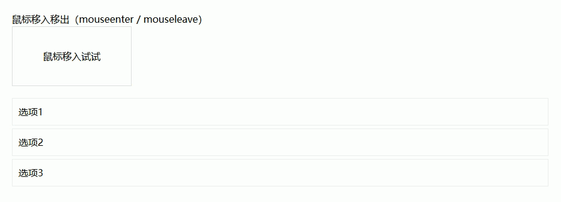

## 鼠标移动位置跟踪（mousemove）

**实时获取鼠标坐标并展示，常用于拖拽、绘制、区域选择等场景**

```vue
<template>
  <div class="page">
    <h2>鼠标移动位置跟踪（mousemove）</h2>

    <!-- 跟踪区域 -->
    <div class="area" @mousemove="handleMouseMove">
      <p>鼠标位置：</p>
      <p>X：{{ x }}</p>
      <p>Y：{{ y }}</p>
    </div>

    <!-- 跟随鼠标的小圆点 -->
    <div
      class="dot"
      :style="{ left: x + 'px', top: y + 'px' }"
    ></div>
  </div>
</template>

<script setup lang="ts">
import { ref } from 'vue'

/**
 * 鼠标坐标
 */
const x = ref(0)
const y = ref(0)

/**
 * 鼠标移动事件
 * @param e 鼠标事件对象
 */
const handleMouseMove = (e: MouseEvent): void => {
  x.value = e.clientX // 相对于视口的X
  y.value = e.clientY // 相对于视口的Y
}
</script>

<style scoped>
.page {
  padding: 20px;
}

/* 跟踪区域 */
.area {
  width: 400px;
  height: 200px;
  border: 1px dashed #409eff; /* 蓝色虚线 */
  position: relative;
  user-select: none; /* 防止选中文本 */
}

/* 跟随鼠标的小圆点 */
.dot {
  position: fixed; /* 跟随鼠标 */
  width: 10px;
  height: 10px;
  background: #f56c6c; /* 红色 */
  border-radius: 50%; /* 圆形 */
  pointer-events: none; /* 不影响鼠标事件 */
  transform: translate(-50%, -50%); /* 居中对齐鼠标 */
}
</style>
```

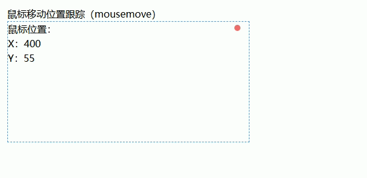

## 拖拽功能（mousedown + mousemove + mouseup）

**通过鼠标按下、移动、松开实现元素拖拽，常用于弹窗、面板移动**

```vue
<template>
  <div class="page">
    <h2>拖拽功能（mousedown + mousemove + mouseup）</h2>

    <!-- 可拖拽盒子 -->
    <div
      class="drag-box"
      :style="{ left: x + 'px', top: y + 'px' }"
      @mousedown="handleMouseDown"
    >
      拖拽我
    </div>
  </div>
</template>

<script setup lang="ts">
import { ref, onBeforeUnmount } from 'vue'

/**
 * 元素位置
 */
const x = ref(100)
const y = ref(100)

/**
 * 拖拽状态
 */
let isDragging = false

/**
 * 鼠标与元素的偏移
 */
let offsetX = 0
let offsetY = 0

/**
 * 鼠标按下
 */
const handleMouseDown = (e: MouseEvent): void => {
  isDragging = true

  // 记录鼠标与元素的偏移
  offsetX = e.clientX - x.value
  offsetY = e.clientY - y.value

  // 绑定全局事件（防止鼠标移出元素）
  window.addEventListener('mousemove', handleMouseMove)
  window.addEventListener('mouseup', handleMouseUp)
}

/**
 * 鼠标移动
 */
const handleMouseMove = (e: MouseEvent): void => {
  if (!isDragging) return

  // 计算新位置
  x.value = e.clientX - offsetX
  y.value = e.clientY - offsetY
}

/**
 * 鼠标松开
 */
const handleMouseUp = (): void => {
  isDragging = false

  // 移除全局事件
  window.removeEventListener('mousemove', handleMouseMove)
  window.removeEventListener('mouseup', handleMouseUp)
}

onBeforeUnmount(() => {
  // 组件销毁时兜底清理
  window.removeEventListener('mousemove', handleMouseMove)
  window.removeEventListener('mouseup', handleMouseUp)
})
</script>

<style scoped>
.page {
  padding: 20px;
}

/* 拖拽盒子 */
.drag-box {
  position: fixed; /* 使用固定定位方便拖拽 */
  width: 120px;
  height: 120px;
  background: #409eff; /* 蓝色背景 */
  color: #fff;
  display: flex;
  align-items: center;
  justify-content: center;
  cursor: move; /* 拖拽光标 */
  border-radius: 8px; /* 圆角 */
  user-select: none; /* 防止拖拽时选中文本 */
}
</style>
```

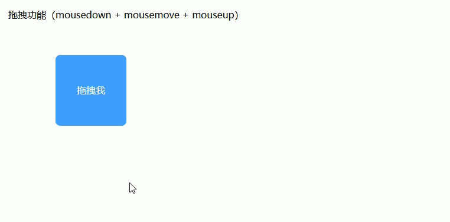

## 滚轮缩放（wheel）

**通过鼠标滚轮控制元素缩放，常用于图片预览、画布缩放**

```vue
<template>
  <div class="page">
    <h2>滚轮缩放（wheel）</h2>

    <!-- 缩放区域 -->
    <div class="container" @wheel.prevent="handleWheel">
      
    </div>

    <!-- 显示当前缩放比例 -->
    <p>当前缩放：{{ scale.toFixed(2) }}</p>
  </div>
</template>

<script setup lang="ts">
import { ref } from 'vue'

/**
 * 缩放比例
 */
const scale = ref(1)

/**
 * 最小/最大缩放限制
 */
const MIN_SCALE = 0.5
const MAX_SCALE = 3

/**
 * 滚轮事件
 */
const handleWheel = (e: WheelEvent): void => {
  const delta = e.deltaY

  // 向上滚动：放大，向下滚动：缩小
  if (delta < 0) {
    scale.value += 0.1
  } else {
    scale.value -= 0.1
  }

  // 限制缩放范围
  if (scale.value < MIN_SCALE) scale.value = MIN_SCALE
  if (scale.value > MAX_SCALE) scale.value = MAX_SCALE
}
</script>

<style scoped>
.page {
  padding: 20px;
}

/* 容器 */
.container {
  width: 320px;
  height: 320px;
  border: 1px solid #dcdfe6; /* 边框 */
  display: flex;
  align-items: center;
  justify-content: center;
  overflow: hidden; /* 防止图片溢出 */
}

/* 图片 */
.image {
  transition: transform 0.2s; /* 平滑缩放 */
  user-select: none; /* 防止选中 */
  pointer-events: none; /* 不影响滚轮事件 */
}
</style>
```

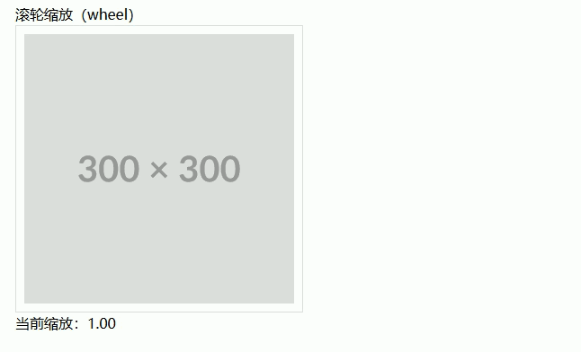

## 键盘输入监听（keydown / keyup）

**监听键盘按下与抬起事件，实时获取输入内容和按键信息**

```vue
<template>
  <div class="page">
    <h2>键盘输入监听（keydown / keyup）</h2>

    <!-- 输入框监听 -->
    <el-input
      v-model="inputValue"
      placeholder="请输入内容"
      @keydown="handleKeyDown"
      @keyup="handleKeyUp"
    />

    <!-- 显示信息 -->
    <div class="info">
      <p>当前输入：{{ inputValue }}</p>
      <p>按下键：{{ keyDown }}</p>
      <p>抬起键：{{ keyUp }}</p>
    </div>
  </div>
</template>

<script setup lang="ts">
import { ref } from 'vue'

/**
 * 输入值
 */
const inputValue = ref('')

/**
 * 按键信息
 */
const keyDown = ref('')
const keyUp = ref('')

/**
 * 键盘按下
 */
const handleKeyDown = (e: KeyboardEvent): void => {
  keyDown.value = e.key // 获取按键名称
}

/**
 * 键盘抬起
 */
const handleKeyUp = (e: KeyboardEvent): void => {
  keyUp.value = e.key
}
</script>

<style scoped>
.page {
  padding: 20px;
}

/* 信息展示 */
.info {
  margin-top: 20px;
  padding: 10px;
  border: 1px solid #ebeef5; /* 边框 */
}
</style>
```

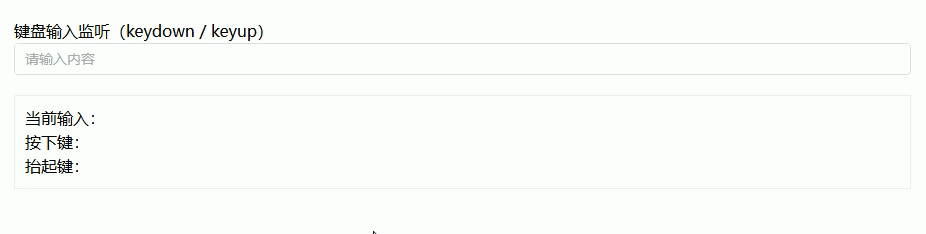

## 快捷键操作（Ctrl / Shift / Alt 组合键）

**通过组合键触发特定功能，常用于保存、撤销、全选等操作**

```vue
<template>
  <div class="page">
    <h2>快捷键操作（Ctrl / Shift / Alt 组合键）</h2>

    <el-input
      v-model="text"
      placeholder="在此输入，尝试快捷键"
    />

    <div class="info">
      <p>最近触发的快捷键：{{ lastShortcut }}</p>
    </div>
  </div>
</template>

<script setup lang="ts">
import { ref, onMounted, onBeforeUnmount } from 'vue'
import { ElMessage } from 'element-plus'

const text = ref('')
const lastShortcut = ref('')

/**
 * 全局键盘组合键监听
 */
const handleShortcut = (e: KeyboardEvent): void => {
  let combo = []

  if (e.ctrlKey) combo.push('Ctrl')
  if (e.shiftKey) combo.push('Shift')
  if (e.altKey) combo.push('Alt')

  combo.push(e.key)

  const shortcut = combo.join('+')
  lastShortcut.value = shortcut

  // 示例功能
  if (shortcut === 'Ctrl+s' || shortcut === 'Ctrl+S') {
    e.preventDefault() // 阻止默认浏览器保存
    ElMessage.success('触发保存操作')
  }
  if (shortcut === 'Ctrl+z' || shortcut === 'Ctrl+Z') {
    e.preventDefault()
    ElMessage.info('触发撤销操作')
  }
}

onMounted(() => {
  window.addEventListener('keydown', handleShortcut)
})

onBeforeUnmount(() => {
  window.removeEventListener('keydown', handleShortcut)
})
</script>

<style scoped>
.page {
  padding: 20px;
}

.info {
  margin-top: 20px;
  padding: 10px;
  border: 1px solid #ebeef5;
  background: #f5f7fa;
  font-size: 14px;
}
</style>
```

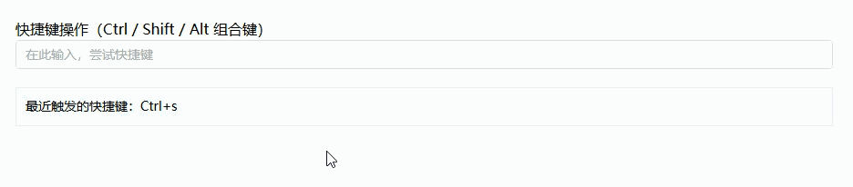

## Enter 提交 / Esc 关闭（键盘控制弹窗）

**在弹窗中通过 Enter 提交表单，Esc 关闭弹窗，常用于表单、对话框操作**

```vue
<template>
  <div class="page">
    <h2>Enter 提交 / Esc 关闭（键盘控制弹窗）</h2>

    <el-button type="primary" @click="dialogVisible = true">
      打开弹窗
    </el-button>

    <el-dialog v-model="dialogVisible" title="键盘控制弹窗">
      <el-input v-model="inputValue" ref="inputRef" placeholder="输入内容后按 Enter 提交" />
      <template #footer>
        <el-button @click="dialogVisible = false">取消</el-button>
        <el-button type="primary" @click="submit">提交</el-button>
      </template>
    </el-dialog>
  </div>
</template>

<script setup lang="ts">
import { ref, watch, onMounted, onUnmounted, nextTick } from 'vue'
import { ElMessage } from 'element-plus'

const dialogVisible = ref(false)
const inputValue = ref('')
const inputRef = ref<HTMLInputElement | null>(null)

const submit = (): void => {
  if (!inputValue.value) {
    ElMessage.warning('请输入内容')
    return
  }
  ElMessage.success(`提交内容：${inputValue.value}`)
  dialogVisible.value = false
  inputValue.value = ''
}

const handleKeyDown = (e: KeyboardEvent) => {
  if (!dialogVisible.value) return
  if (e.key === 'Enter') submit()
  if (e.key === 'Escape') dialogVisible.value = false
}

watch(dialogVisible, async (val) => {
  if (val) {
    await nextTick()
    inputRef.value?.focus()
  }
})

onMounted(() => {
  document.addEventListener('keydown', handleKeyDown)
})
onUnmounted(() => {
  document.removeEventListener('keydown', handleKeyDown)
})
</script>

<style scoped>
.page {
  padding: 20px;
}

/* 弹窗底部按钮间距 */
.dialog-footer .el-button {
  margin-left: 10px;
}
</style>
```

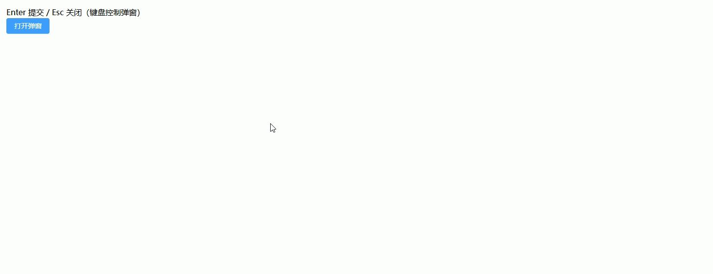

## 全局键盘监听（window 级事件）

**在整个页面范围监听键盘事件，适用于全局快捷键、游戏操作、全局搜索等场景**

```vue
<template>
  <div class="page">
    <h2>全局键盘监听（window 级事件）</h2>

    <p>按任意键会显示在下方：</p>
    <div class="key-display">{{ lastKey }}</div>

    <p>示例：按 "F1" 弹出提示，按 "F2" 清空内容</p>
  </div>
</template>

<script setup lang="ts">
import { ref, onMounted, onBeforeUnmount } from 'vue'
import { ElMessage } from 'element-plus'

const lastKey = ref('无')

/**
 * 全局键盘监听
 * @param e 键盘事件
 */
const handleGlobalKey = (e: KeyboardEvent): void => {
  lastKey.value = e.key

  // 示例功能
  if (e.key === 'F1') {
    e.preventDefault() // 阻止默认帮助弹窗
    ElMessage.info('触发 F1 全局提示')
  }
  if (e.key === 'F2') {
    lastKey.value = '已清空'
  }
}

onMounted(() => {
  window.addEventListener('keydown', handleGlobalKey)
})

onBeforeUnmount(() => {
  window.removeEventListener('keydown', handleGlobalKey)
})
</script>

<style scoped>
.page {
  padding: 20px;
}

.key-display {
  margin-top: 10px;
  padding: 10px;
  border: 1px solid #dcdfe6;
  width: 200px;
  text-align: center;
  background: #f5f7fa;
  font-weight: bold;
}
</style>
```

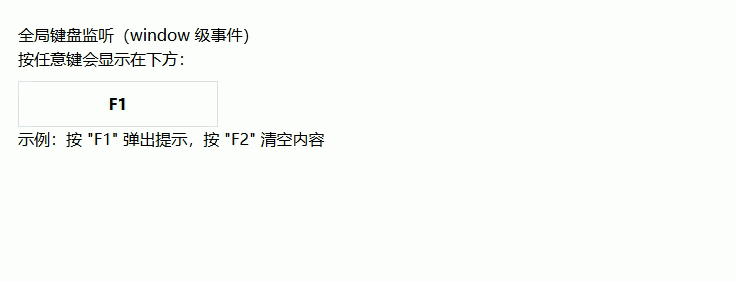

## 长按事件（mousedown + 定时器实现）

**按住元素一段时间触发特定操作，常用于删除确认、特殊功能触发**

```vue
<template>
  <div class="page">
    <h2>长按事件（mousedown + 定时器实现）</h2>

    <!-- 长按按钮 -->
    <el-button
        type="danger"
        @mousedown="startPress"
        @mouseup="endPress"
        @mouseleave="endPress"
    >
      长按我 2 秒触发
    </el-button>
  </div>
</template>

<script setup lang="ts">
import { ElMessage } from 'element-plus'

/**
 * 定时器引用
 */
let timer: number | null = null

/**
 * 长按时间（毫秒）
 */
const PRESS_TIME = 2000

/**
 * 开始按下
 */
const startPress = (): void => {
  timer = window.setTimeout(() => {
    ElMessage.success('长按触发成功！')
  }, PRESS_TIME)
}

/**
 * 结束按下 / 移出
 */
const endPress = (): void => {
  if (timer) {
    clearTimeout(timer)
    timer = null
  }
}
</script>

<style scoped>
.page {
  padding: 20px;
}

/* 按钮可视提示 */
.el-button {
  user-select: none; /* 防止选中文本 */
  cursor: pointer;
}
</style>
```

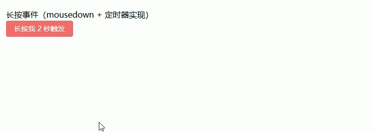
