# 样式布局

- 开源 UI 库：https://uiverse.io/loaders

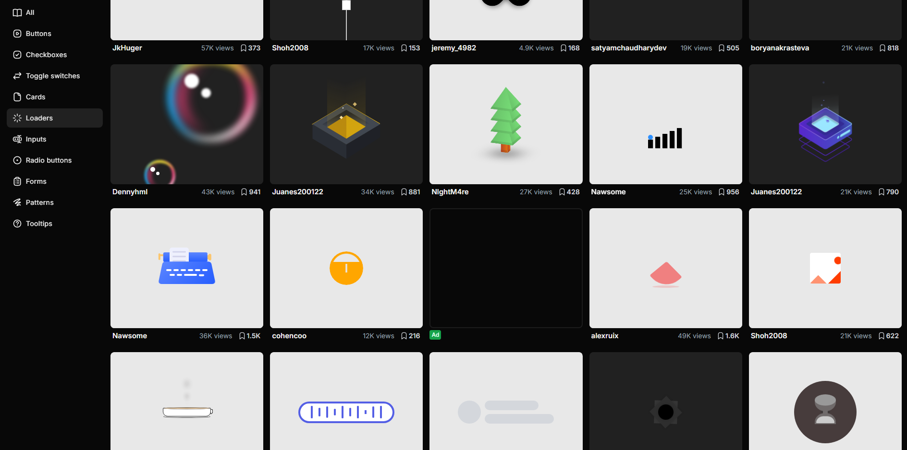


## 经典后台管理布局（Header + Sidebar + Main）

- 顶部导航栏（Header）：放系统名称、用户信息、操作按钮
- 左侧菜单（Sidebar）：项目常见导航菜单
- 内容区域（Main）：页面主体区域
- 响应式布局：使用 `flex` 实现自适应
- Sass 变量管理：统一控制颜色、尺寸
- ElementPlus 组件：使用 `el-menu` 构建侧边菜单

```vue
<template>
  <div class="layout">
    <!-- Header -->
    <header class="layout-header">
      <div class="logo">Admin System</div>
      <div class="actions">
        <el-button size="small">用户</el-button>
      </div>
    </header>

    <!-- Body -->
    <div class="layout-body">
      <!-- Sidebar -->
      <aside class="layout-sidebar">
        <el-menu default-active="1">
          <el-menu-item index="1">首页</el-menu-item>
          <el-menu-item index="2">用户管理</el-menu-item>
          <el-menu-item index="3">系统设置</el-menu-item>
        </el-menu>
      </aside>

      <!-- Main -->
      <main class="layout-main">
        <el-card>
          主体内容区域
        </el-card>
      </main>
    </div>
  </div>
</template>

<script setup lang="ts">
</script>

<style lang="scss" scoped>

$header-height: 60px; // 顶部高度
$sidebar-width: 220px; // 侧边栏宽度
$bg-color: #f5f7fa; // 页面背景色
$border-color: #e4e7ed; // 边框颜色

.layout {
  height: 100vh; // 占满整个视口高度
  display: flex; // 使用flex布局
  flex-direction: column; // 垂直排列

  &-header {
    height: $header-height; // header高度
    background: #ffffff; // 背景色
    border-bottom: 1px solid $border-color; // 底部边框
    display: flex; // flex布局
    align-items: center; // 垂直居中
    justify-content: space-between; // 两端对齐
    padding: 0 20px; // 左右内边距

    .logo {
      font-size: 18px; // 字体大小
      font-weight: 600; // 字体加粗
    }

    .actions {
      display: flex; // flex布局
      align-items: center; // 垂直居中
      gap: 10px; // 子元素间距
    }
  }

  &-body {
    flex: 1; // 占据剩余空间
    display: flex; // 横向布局
    overflow: hidden; // 防止溢出
  }

  &-sidebar {
    width: $sidebar-width; // 侧边栏宽度
    background: #ffffff; // 背景色
    border-right: 1px solid $border-color; // 右边框
    padding: 10px 0; // 上下内边距
  }

  &-main {
    flex: 1; // 填满剩余空间
    background: $bg-color; // 背景色
    padding: 20px; // 内边距
    overflow: auto; // 内容滚动
  }
}

</style>
```

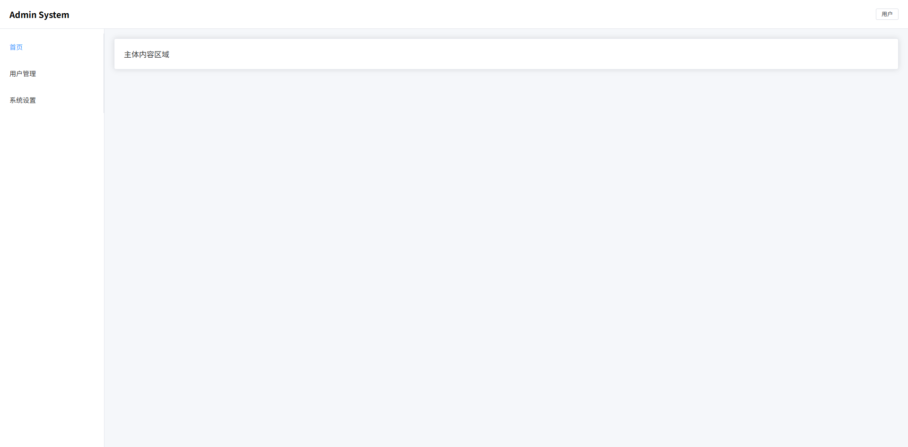


## 双侧边栏布局（常见 BI / 数据平台）

- 左侧主导航：系统模块入口（Dashboard / 数据源 / 任务等）
- 次级侧边栏：当前模块的子菜单
- 内容区域：数据分析页面主体
- 三列布局结构：`Sidebar + SubSidebar + Main`
- Sass 变量管理：统一控制宽度和颜色
- ElementPlus 组件：`el-menu` 构建导航菜单

```vue
<template>
  <div class="bi-layout">
    <!-- 左侧主导航 -->
    <aside class="bi-layout-sidebar">
      <div class="logo">BI</div>

      <el-menu default-active="1" class="menu">
        <el-menu-item index="1">Dashboard</el-menu-item>
        <el-menu-item index="2">数据源</el-menu-item>
        <el-menu-item index="3">任务调度</el-menu-item>
        <el-menu-item index="4">用户管理</el-menu-item>
      </el-menu>
    </aside>

    <!-- 次级侧边栏 -->
    <aside class="bi-layout-subsidebar">
      <div class="title">Dashboard</div>

      <el-menu default-active="1-1">
        <el-menu-item index="1-1">数据概览</el-menu-item>
        <el-menu-item index="1-2">趋势分析</el-menu-item>
        <el-menu-item index="1-3">指标监控</el-menu-item>
      </el-menu>
    </aside>

    <!-- 主内容 -->
    <main class="bi-layout-main">
      <el-card>
        数据分析内容区域
      </el-card>
    </main>
  </div>
</template>

<script setup lang="ts">
</script>

<style scoped lang="scss">

$sidebar-width: 80px; // 主导航宽度
$subsidebar-width: 220px; // 二级侧边栏宽度
$bg-main: #f5f7fa; // 主内容背景
$border-color: #e5e6eb; // 边框颜色
$sidebar-bg: #1e1f26; // 主导航背景色
$subsidebar-bg: #ffffff; // 二级侧边栏背景色

.bi-layout {
  height: 100vh; // 占满整个视口高度
  display: flex; // flex布局
  background: $bg-main; // 页面背景

  &-sidebar {
    width: $sidebar-width; // 主侧边栏宽度
    background: $sidebar-bg; // 背景色
    color: #fff; // 文字颜色
    display: flex; // flex布局
    flex-direction: column; // 垂直排列
    align-items: center; // 水平居中

    .logo {
      height: 60px; // logo高度
      display: flex; // flex布局
      align-items: center; // 垂直居中
      justify-content: center; // 水平居中
      font-size: 18px; // 字体大小
      font-weight: 600; // 字体加粗
    }

    .menu {
      width: 100%; // 菜单宽度100%
      border-right: none; // 去掉右边框
    }
  }

  &-subsidebar {
    width: $subsidebar-width; // 二级侧边栏宽度
    background: $subsidebar-bg; // 背景色
    border-right: 1px solid $border-color; // 右边框
    display: flex; // flex布局
    flex-direction: column; // 垂直排列

    .title {
      height: 60px; // 标题高度
      display: flex; // flex布局
      align-items: center; // 垂直居中
      padding-left: 20px; // 左内边距
      font-weight: 600; // 字体加粗
      border-bottom: 1px solid $border-color; // 底部边框
    }
  }

  &-main {
    flex: 1; // 占据剩余空间
    padding: 20px; // 内边距
    overflow: auto; // 内容滚动
  }

}

</style>
```

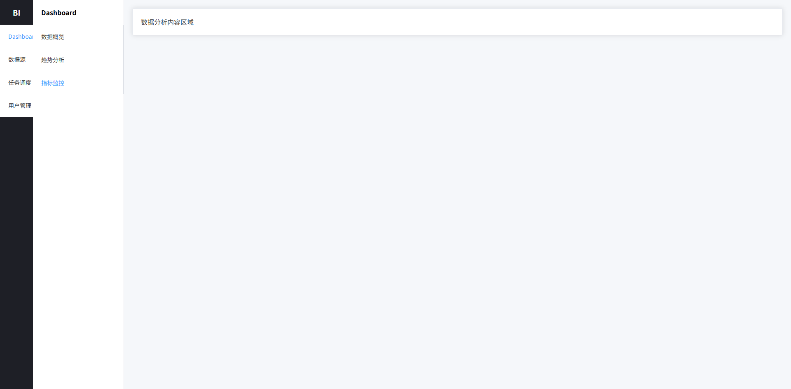

## 响应式导航栏布局（移动端折叠菜单）

- 顶部导航栏：系统 Logo、菜单入口、用户操作区
- PC 菜单：横向导航
- 移动端菜单：抽屉式菜单（Hamburger）
- 响应式布局：`media query` 自动切换
- Sass 变量 + 结构化样式：统一颜色、间距
- ElementPlus 组件：`el-drawer` 实现移动菜单

```vue
<template>
  <div class="nav-layout">
    <!-- 顶部导航 -->
    <header class="nav-header">
      <div class="nav-left">
        <div class="logo">Vue Admin</div>

        <nav class="nav-menu">
          <a class="nav-item">首页</a>
          <a class="nav-item">产品</a>
          <a class="nav-item">文档</a>
          <a class="nav-item">关于</a>
        </nav>
      </div>

      <div class="nav-right">
        <el-button class="mobile-menu-btn" @click="drawer = true">
          ☰
        </el-button>

        <el-avatar size="small">
          U
        </el-avatar>
      </div>
    </header>

    <!-- 页面内容 -->
    <main class="nav-main">
      <el-card>
        页面内容区域
      </el-card>
    </main>

    <!-- 移动端菜单 -->
    <el-drawer v-model="drawer" direction="ltr" size="220px">
      <div class="mobile-menu">
        <a class="mobile-item">首页</a>
        <a class="mobile-item">产品</a>
        <a class="mobile-item">文档</a>
        <a class="mobile-item">关于</a>
      </div>
    </el-drawer>
  </div>
</template>

<script setup lang="ts">
import { ref } from "vue"

const drawer = ref(false)
</script>

<style scoped lang="scss">

$nav-height: 64px; // 顶部导航高度
$primary: #409eff; // 主色
$text-color: #333; // 文字颜色
$bg-color: #f6f8fb; // 页面背景
$border-color: #e6e8eb; // 边框颜色

.nav-layout {
  min-height: 100vh; // 最小高度
  background: $bg-color; // 背景颜色
  display: flex; // flex布局
  flex-direction: column; // 垂直排列
}

.nav-header {
  height: $nav-height; // 高度
  background: #fff; // 背景
  border-bottom: 1px solid $border-color; // 底部边框
  display: flex; // flex布局
  align-items: center; // 垂直居中
  justify-content: space-between; // 两端对齐
  padding: 0 24px; // 左右内边距
  position: sticky; // 固定顶部
  top: 0; // 顶部位置
  z-index: 10; // 层级

  .nav-left {
    display: flex; // flex布局
    align-items: center; // 垂直居中
    gap: 40px; // 元素间距
  }

  .logo {
    font-size: 20px; // 字体大小
    font-weight: 600; // 字体加粗
    color: $primary; // 主色
  }

  .nav-menu {
    display: flex; // flex布局
    gap: 24px; // 菜单间距
  }

  .nav-item {
    cursor: pointer; // 鼠标指针
    color: $text-color; // 文字颜色
    font-size: 14px; // 字体大小
    position: relative; // 相对定位
    padding: 4px 0; // 上下内边距

    &:hover {
      color: $primary; // hover颜色
    }

    &::after {
      content: ""; // 伪元素
      position: absolute; // 绝对定位
      bottom: -6px; // 底部位置
      left: 0; // 左边
      width: 0; // 初始宽度
      height: 2px; // 高度
      background: $primary; // 背景色
      transition: width .25s; // 动画
    }

    &:hover::after {
      width: 100%; // hover宽度
    }
  }

  .nav-right {
    display: flex; // flex布局
    align-items: center; // 垂直居中
    gap: 16px; // 元素间距
  }

  .mobile-menu-btn {
    display: none; // 默认隐藏
  }
}

.nav-main {
  flex: 1; // 占剩余空间
  padding: 24px; // 内边距
}

.mobile-menu {
  display: flex; // flex布局
  flex-direction: column; // 垂直排列
  gap: 16px; // 元素间距
  padding: 20px; // 内边距

  .mobile-item {
    font-size: 16px; // 字体大小
    cursor: pointer; // 鼠标指针
  }
}

/* 响应式 */

@media (max-width: 768px) {

  .nav-menu {
    display: none !important; // 隐藏PC菜单
  }

  .mobile-menu-btn {
    display: inline-flex !important; // 显示移动菜单按钮
  }

}

</style>
```

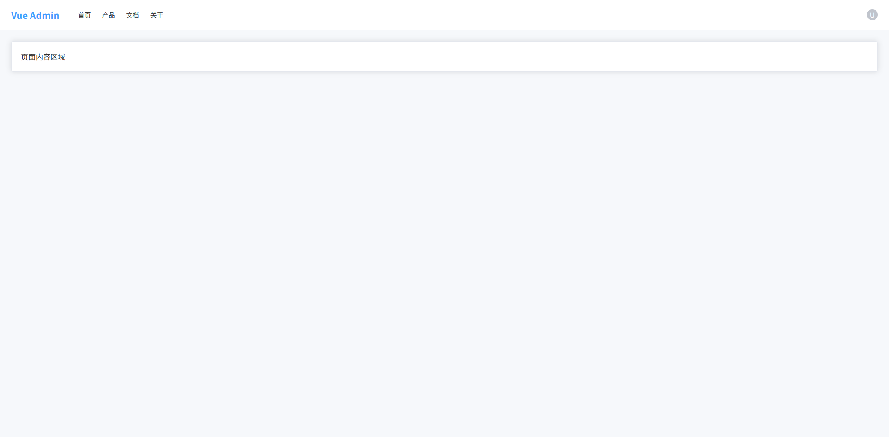

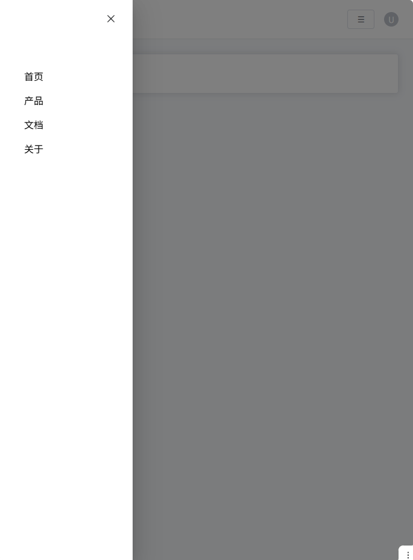


## 搜索 + 表格页面布局（后台最常见）

- 查询区域：筛选数据（用户名 / 状态 / 时间等）
- 操作按钮区域：新增 / 批量删除 / 导出等
- 数据表格区域：展示列表数据
- 分页区域：控制数据分页
- 卡片式布局：现代后台常见视觉结构
- Sass 变量 + mixin：统一间距与布局

```vue
<template>
  <div class="page">
    <!-- 查询区域 -->
    <el-card class="search-card">
      <el-form :inline="true" class="search-form">
        <el-form-item label="用户名">
          <el-input placeholder="请输入用户名" />
        </el-form-item>

        <el-form-item label="状态">
          <el-select placeholder="请选择">
            <el-option label="启用" value="1"/>
            <el-option label="禁用" value="0"/>
          </el-select>
        </el-form-item>

        <el-form-item>
          <el-button type="primary">搜索</el-button>
          <el-button>重置</el-button>
        </el-form-item>
      </el-form>
    </el-card>

    <!-- 表格区域 -->
    <el-card class="table-card">

      <!-- 操作栏 -->
      <div class="table-toolbar">
        <div class="left">
          <el-button type="primary">新增</el-button>
          <el-button type="danger">批量删除</el-button>
        </div>

        <div class="right">
          <el-button>导出</el-button>
        </div>
      </div>

      <!-- 表格 -->
      <el-table :data="tableData" border>

        <el-table-column type="selection" width="50"/>

        <el-table-column prop="name" label="用户名"/>

        <el-table-column prop="email" label="邮箱"/>

        <el-table-column prop="status" label="状态"/>

        <el-table-column label="操作" width="180">
          <template #default>
            <el-button size="small">编辑</el-button>
            <el-button size="small" type="danger">删除</el-button>
          </template>
        </el-table-column>

      </el-table>

      <!-- 分页 -->
      <div class="pagination">
        <el-pagination
          background
          layout="total, prev, pager, next"
          :total="100"
        />
      </div>

    </el-card>
  </div>
</template>

<script setup lang="ts">

import { ref } from "vue"

const tableData = ref([
  { name: "admin", email: "admin@test.com", status: "启用" },
  { name: "test", email: "test@test.com", status: "禁用" }
])

</script>

<style scoped lang="scss">

$bg-page: #f6f8fb; // 页面背景
$card-radius: 8px; // 卡片圆角
$gap: 16px; // 通用间距
$border-color: #ebeef5; // 边框颜色

@mixin flex-between {
  display: flex; // flex布局
  justify-content: space-between; // 两端对齐
  align-items: center; // 垂直居中
}

.page {
  padding: 20px; // 页面内边距
  background: $bg-page; // 页面背景
  min-height: 100vh; // 最小高度
  display: flex; // flex布局
  flex-direction: column; // 垂直布局
  gap: $gap; // 卡片间距
}

.search-card {
  border-radius: $card-radius; // 卡片圆角
}

.search-form {
  display: flex; // flex布局
  flex-wrap: wrap; // 自动换行
  gap: 10px; // 元素间距
}

.table-card {
  border-radius: $card-radius; // 卡片圆角
  display: flex; // flex布局
  flex-direction: column; // 垂直布局
}

.table-toolbar {
  @include flex-between; // 使用mixin
  margin-bottom: 16px; // 底部间距

  .left {
    display: flex; // flex布局
    gap: 10px; // 按钮间距
  }

  .right {
    display: flex; // flex布局
    gap: 10px; // 按钮间距
  }
}

.pagination {
  margin-top: 16px; // 顶部间距
  display: flex; // flex布局
  justify-content: flex-end; // 右对齐
}

</style>
```

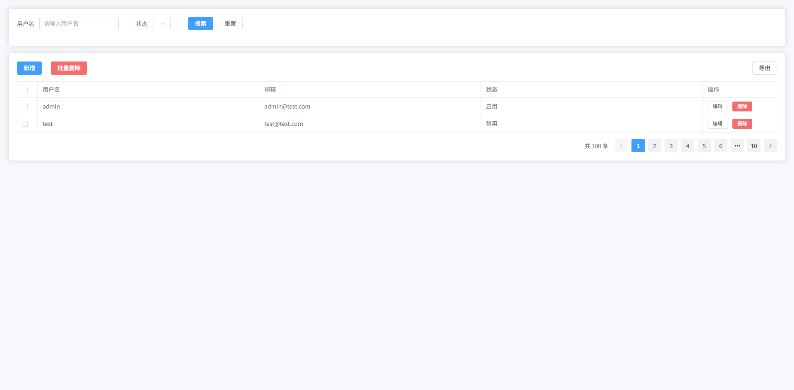


## 卡片 Dashboard 布局

- 统计卡片区域：展示核心指标（用户数 / 订单 / 收入等）
- 图表区域：趋势或统计图表容器
- 数据列表区域：最近数据记录
- Grid 布局：卡片自适应排列
- Sass 变量 + mixin：统一阴影、圆角、间距
- ElementPlus：使用 `el-card`、`el-table` 构建

```vue
<template>
  <div class="dashboard">

    <!-- 统计卡片 -->
    <div class="stats">

      <el-card class="stat-card">
        <div class="stat-content">
          <div class="stat-value">12,560</div>
          <div class="stat-title">总用户</div>
        </div>
      </el-card>

      <el-card class="stat-card">
        <div class="stat-content">
          <div class="stat-value">3,280</div>
          <div class="stat-title">今日访问</div>
        </div>
      </el-card>

      <el-card class="stat-card">
        <div class="stat-content">
          <div class="stat-value">¥82,430</div>
          <div class="stat-title">今日收入</div>
        </div>
      </el-card>

      <el-card class="stat-card">
        <div class="stat-content">
          <div class="stat-value">158</div>
          <div class="stat-title">新增订单</div>
        </div>
      </el-card>

    </div>

    <!-- 图表区域 -->
    <div class="charts">

      <el-card class="chart-card">
        <div class="chart-placeholder">
          图表区域（ECharts）
        </div>
      </el-card>

      <el-card class="chart-card">
        <div class="chart-placeholder">
          图表区域（ECharts）
        </div>
      </el-card>

    </div>

    <!-- 数据表格 -->
    <el-card class="table-card">

      <div class="table-title">
        最近订单
      </div>

      <el-table :data="tableData" border>

        <el-table-column prop="id" label="订单ID"/>

        <el-table-column prop="user" label="用户"/>

        <el-table-column prop="amount" label="金额"/>

        <el-table-column prop="status" label="状态"/>

      </el-table>

    </el-card>

  </div>
</template>

<script setup lang="ts">

import { ref } from "vue"

const tableData = ref([
  { id: "10001", user: "张三", amount: "¥120", status: "已完成" },
  { id: "10002", user: "李四", amount: "¥90", status: "处理中" },
  { id: "10003", user: "王五", amount: "¥300", status: "已完成" }
])

</script>

<style scoped lang="scss">

$gap: 20px; // 通用间距
$radius: 10px; // 圆角
$bg-page: #f6f8fb; // 页面背景
$shadow: 0 4px 12px rgba(0,0,0,0.05); // 卡片阴影

@mixin card-style {
  border-radius: $radius; // 卡片圆角
  box-shadow: $shadow; // 阴影
}

.dashboard {
  padding: 24px; // 页面内边距
  background: $bg-page; // 页面背景
  min-height: 100vh; // 最小高度
  display: flex; // flex布局
  flex-direction: column; // 垂直布局
  gap: $gap; // 模块间距
}

.stats {
  display: grid; // grid布局
  grid-template-columns: repeat(4, 1fr); // 4列
  gap: $gap; // 卡片间距
}

.stat-card {
  @include card-style; // 使用卡片样式

  .stat-content {
    display: flex; // flex布局
    flex-direction: column; // 垂直排列
    gap: 6px; // 元素间距
  }

  .stat-value {
    font-size: 28px; // 字体大小
    font-weight: 600; // 字体加粗
    color: #303133; // 文字颜色
  }

  .stat-title {
    font-size: 14px; // 字体大小
    color: #909399; // 文字颜色
  }
}

.charts {
  display: grid; // grid布局
  grid-template-columns: 2fr 1fr; // 两列布局
  gap: $gap; // 间距
}

.chart-card {
  @include card-style; // 卡片样式
}

.chart-placeholder {
  height: 300px; // 图表高度
  display: flex; // flex布局
  align-items: center; // 垂直居中
  justify-content: center; // 水平居中
  color: #909399; // 文字颜色
  font-size: 16px; // 字体大小
}

.table-card {
  @include card-style; // 卡片样式
}

.table-title {
  font-size: 16px; // 字体大小
  font-weight: 600; // 字体加粗
  margin-bottom: 16px; // 底部间距
}

</style>
```

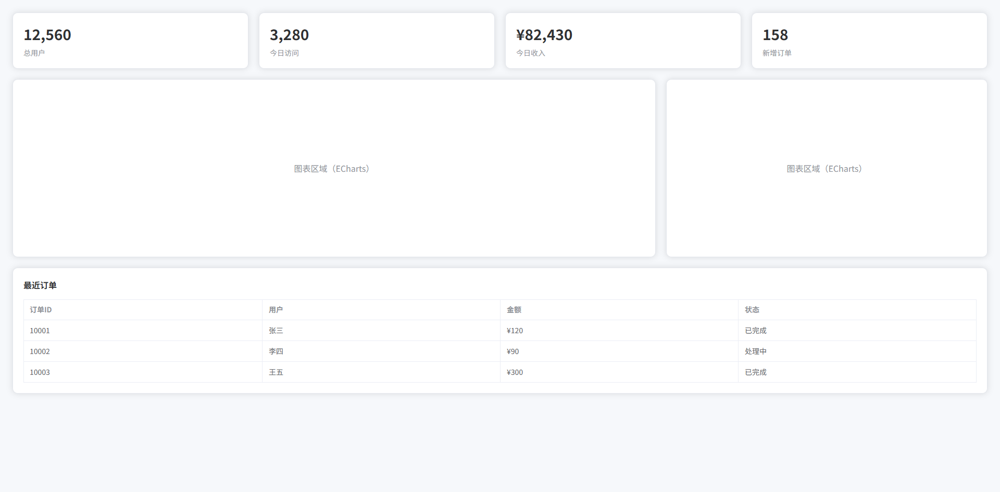

## 全屏大图背景布局（登录页 / Landing Page）

- 全屏背景图：常见登录页视觉设计
- 半透明遮罩层：提升文字可读性
- 居中登录卡片：登录表单区域
- 左侧宣传文案：Landing Page 常见布局
- Glass 风格卡片：现代 UI 视觉
- Sass 变量 + mixin：统一阴影、透明度、模糊效果

```vue
<template>
  <div class="login-page">

    <div class="overlay">

      <div class="login-container">

        <!-- 左侧介绍 -->
        <div class="login-intro">
          <h1 class="title">Vue Admin System</h1>
          <p class="desc">
            现代化企业级后台管理系统
          </p>
        </div>

        <!-- 登录卡片 -->
        <el-card class="login-card">

          <div class="login-title">
            用户登录
          </div>

          <el-form>

            <el-form-item>
              <el-input placeholder="用户名"/>
            </el-form-item>

            <el-form-item>
              <el-input type="password" placeholder="密码"/>
            </el-form-item>

            <el-form-item>
              <el-button type="primary" class="login-btn">
                登录
              </el-button>
            </el-form-item>

          </el-form>

        </el-card>

      </div>

    </div>

  </div>
</template>

<script setup lang="ts">
</script>

<style scoped lang="scss">

$primary: #409eff; // 主色
$text-light: rgba(255,255,255,0.9); // 亮色文字
$overlay-bg: rgba(0,0,0,0.35); // 遮罩层颜色
$radius: 12px; // 圆角
$shadow: 0 10px 30px rgba(0,0,0,0.2); // 阴影

@mixin glass-card {
  backdrop-filter: blur(12px); // 背景模糊
  background: rgba(255,255,255,0.15); // 半透明背景
  border: 1px solid rgba(255,255,255,0.25); // 边框
  border-radius: $radius; // 圆角
}

.login-page {
  height: 100vh; // 视口高度
  background: url("https://picsum.photos/1920/1080") center/cover no-repeat; // 背景图
  display: flex; // flex布局
}

.overlay {
  flex: 1; // 填充父容器
  background: $overlay-bg; // 遮罩层
  display: flex; // flex布局
  align-items: center; // 垂直居中
  justify-content: center; // 水平居中
  padding: 40px; // 内边距
}

.login-container {
  width: 1100px; // 容器宽度
  display: grid; // grid布局
  grid-template-columns: 1fr 420px; // 两列布局
  gap: 60px; // 列间距
  align-items: center; // 垂直居中
}

.login-intro {
  color: $text-light; // 文字颜色

  .title {
    font-size: 42px; // 字体大小
    font-weight: 700; // 字体加粗
    margin-bottom: 16px; // 底部间距
  }

  .desc {
    font-size: 18px; // 字体大小
    opacity: 0.9; // 透明度
  }
}

.login-card {
  @include glass-card; // 使用glass风格
  padding: 36px; // 内边距
  box-shadow: $shadow; // 阴影
}

.login-title {
  font-size: 20px; // 字体大小
  font-weight: 600; // 字体加粗
  color: #fff; // 文字颜色
  margin-bottom: 24px; // 底部间距
}

.login-btn {
  width: 100%; // 按钮宽度
  height: 42px; // 按钮高度
  font-size: 15px; // 字体大小
}

</style>
```

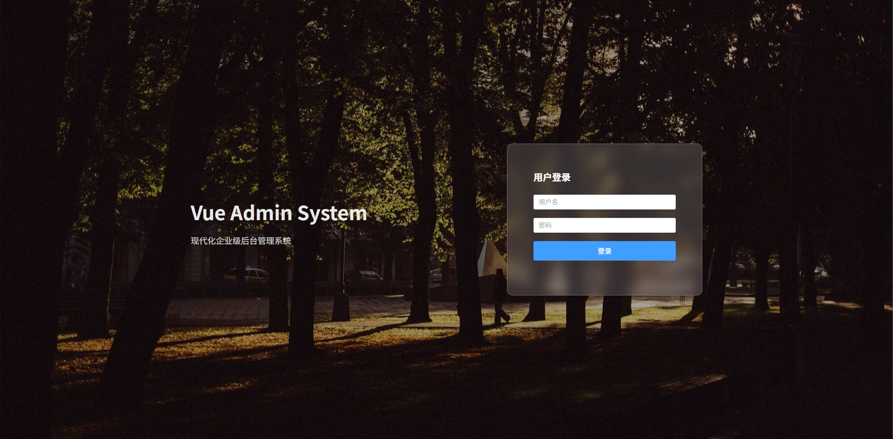


## 可折叠 Sidebar 布局

- 左侧菜单：系统主导航
- Sidebar 折叠 / 展开：节省空间
- Header 操作栏：折叠按钮 + 用户信息
- 主内容区域：页面主体
- 动画过渡：Sidebar 平滑收缩
- Sass 变量 + mixin：统一布局尺寸
- ElementPlus：`el-menu collapse` 实现菜单折叠

```vue
<template>
  <div class="admin-layout">

    <!-- Sidebar -->
    <aside :class="['sidebar', { collapse }]">

      <div class="logo">
        <span v-if="!collapse">Vue Admin</span>
        <span v-else>VA</span>
      </div>

      <el-menu
          class="menu"
          :collapse="collapse"
          default-active="1"
      >

        <el-menu-item index="1">
          <span>首页</span>
        </el-menu-item>

        <el-menu-item index="2">
          <span>用户管理</span>
        </el-menu-item>

        <el-menu-item index="3">
          <span>系统设置</span>
        </el-menu-item>

      </el-menu>

    </aside>

    <!-- Main -->
    <div class="main">

      <!-- Header -->
      <header class="header">

        <el-button
            text
            @click="collapse = !collapse"
        >
          ☰
        </el-button>

        <div class="header-right">
          <el-avatar size="small">U</el-avatar>
        </div>

      </header>

      <!-- Content -->
      <main class="content">

        <el-card>
          页面内容区域
        </el-card>

      </main>

    </div>

  </div>
</template>

<script setup lang="ts">

import { ref } from "vue"

const collapse = ref(false)

</script>

<style scoped lang="scss">

$sidebar-width: 220px; // Sidebar展开宽度
$sidebar-collapse-width: 64px; // Sidebar折叠宽度
$header-height: 60px; // Header高度
$bg-main: #f6f8fb; // 页面背景
$border-color: #e5e6eb; // 边框颜色
$transition: all .25s ease; // 过渡动画

@mixin flex-center {
  display: flex; // flex布局
  align-items: center; // 垂直居中
}

.admin-layout {
  height: 100vh; // 占满视口高度
  display: flex; // flex布局
  background: $bg-main; // 背景颜色
}

.sidebar {
  width: $sidebar-width; // 默认宽度
  background: #1e1f26; // 背景颜色
  color: #fff; // 文字颜色
  display: flex; // flex布局
  flex-direction: column; // 垂直排列
  transition: $transition; // 动画

  .logo {
    height: $header-height; // logo高度
    @include flex-center; // 垂直居中
    justify-content: center; // 水平居中
    font-size: 18px; // 字体大小
    font-weight: 600; // 字体加粗
  }

  .menu {
    border-right: none; // 去掉右边框
  }

  &.collapse {
    width: $sidebar-collapse-width; // 折叠宽度
  }

}

.main {
  flex: 1; // 占剩余空间
  display: flex; // flex布局
  flex-direction: column; // 垂直排列
}

.header {
  height: $header-height; // 高度
  background: #fff; // 背景
  border-bottom: 1px solid $border-color; // 底部边框
  padding: 0 20px; // 左右内边距
  display: flex; // flex布局
  align-items: center; // 垂直居中
  justify-content: space-between; // 两端对齐
}

.content {
  flex: 1; // 占剩余空间
  padding: 20px; // 内边距
  overflow: auto; // 滚动
}

</style>
```

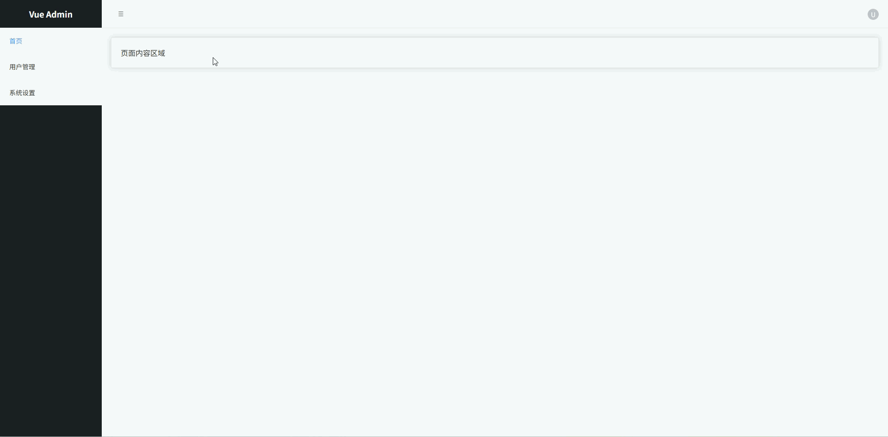


## 多 Tab 页面布局（Admin 常见）

- 左侧 **Sidebar 菜单**
- 顶部 **Tab 标签页**
- Tab **关闭**
- 当前页 **高亮**
- 内容区 **动态切换**
- **Sass 变量 + mixin**
- **ElementPlus Tabs**

```vue
<template>
  <div class="layout">

    <!-- Sidebar -->
    <aside class="sidebar">

      <div class="logo">
        Vue Admin
      </div>

      <el-menu
        default-active="dashboard"
        @select="openTab"
      >

        <el-menu-item index="dashboard">
          <span>Dashboard</span>
        </el-menu-item>

        <el-menu-item index="user">
          <span>用户管理</span>
        </el-menu-item>

        <el-menu-item index="setting">
          <span>系统设置</span>
        </el-menu-item>

      </el-menu>

    </aside>

    <!-- Main -->
    <div class="main">

      <!-- Tabs -->
      <div class="tabs">

        <el-tabs
          v-model="activeTab"
          type="card"
          closable
          @tab-remove="removeTab"
        >

          <el-tab-pane
            v-for="tab in tabs"
            :key="tab.name"
            :label="tab.title"
            :name="tab.name"
          />

        </el-tabs>

      </div>

      <!-- Content -->
      <div class="content">

        <el-card v-if="activeTab === 'dashboard'">
          Dashboard 页面
        </el-card>

        <el-card v-if="activeTab === 'user'">
          用户管理页面
        </el-card>

        <el-card v-if="activeTab === 'setting'">
          系统设置页面
        </el-card>

      </div>

    </div>

  </div>
</template>

<script setup lang="ts">

import { ref } from "vue"

interface Tab {
  title: string | undefined
  name: string
}

const activeTab = ref("dashboard")

const tabs = ref<Tab[]>([
  { title: "Dashboard", name: "dashboard" }
])

/**
 * 打开 Tab
 */
const openTab = (name: string) => {

  const exist = tabs.value.find(t => t.name === name)

  if (!exist) {

    const map: Record<string, string> = {
      dashboard: "Dashboard",
      user: "用户管理",
      setting: "系统设置"
    }

    tabs.value.push({
      name,
      title: map[name]
    })

  }

  activeTab.value = name

}

/**
 * 删除 Tab
 */
const removeTab = (name: string) => {

  const index = tabs.value.findIndex(t => t.name === name)

  tabs.value.splice(index, 1)

  if (activeTab.value === name) {

    const last = tabs.value[index - 1] || tabs.value[0]

    if (last) activeTab.value = last.name

  }

}

</script>

<style scoped lang="scss">

$sidebar-width: 220px; // Sidebar宽度
$tabs-height: 48px; // Tabs高度
$bg-main: #f5f7fa; // 页面背景
$border-color: #e5e6eb; // 边框颜色

@mixin flex-center {
  display: flex; // flex布局
  align-items: center; // 垂直居中
}

.layout {
  display: flex; // flex布局
  height: 100vh; // 视口高度
}

.sidebar {
  width: $sidebar-width; // 侧边栏宽度
  background: #1f2937; // 深色背景
  color: white; // 文字颜色
  display: flex; // flex布局
  flex-direction: column; // 垂直排列

  .logo {
    height: 60px; // Logo高度
    @include flex-center; // 垂直居中
    justify-content: center; // 水平居中
    font-size: 18px; // 字体大小
    font-weight: 600; // 字体加粗
  }

}

.main {
  flex: 1; // 占满剩余空间
  display: flex; // flex布局
  flex-direction: column; // 垂直排列
  background: $bg-main; // 背景颜色
}

.tabs {
  height: $tabs-height; // Tabs高度
  background: white; // 背景颜色
  border-bottom: 1px solid $border-color; // 下边框
  padding: 0 12px; // 左右内边距
  display: flex; // flex布局
  align-items: center; // 垂直居中
}

.content {
  flex: 1; // 占满剩余空间
  padding: 20px; // 内边距
  overflow: auto; // 内容滚动
}

</style>
```


## 两栏布局（左筛选 + 右内容）

 常见于：数据列表页、商品列表、用户管理筛选页面。

- **左侧筛选面板**：放置查询条件、分类筛选、过滤项
- **右侧内容区域**：展示表格、卡片列表等主数据
- **固定筛选区宽度**：筛选区宽度稳定，内容区自适应
- **卡片式视觉风格**：后台系统常见设计，更专业美观
- **内容区独立滚动**：避免整页滚动体验差
- **Sass 变量管理布局尺寸**：方便统一维护样式

```vue
<template>
  <div class="page">

    <aside class="filter">

      <el-card shadow="never">

        <template #header>
          筛选条件
        </template>

        <el-form label-position="top">

          <el-form-item label="关键词">
            <el-input placeholder="请输入关键词"/>
          </el-form-item>

          <el-form-item label="状态">
            <el-select placeholder="请选择状态">
              <el-option label="启用" value="1"/>
              <el-option label="禁用" value="0"/>
            </el-select>
          </el-form-item>

          <el-form-item label="日期">
            <el-date-picker type="daterange"/>
          </el-form-item>

          <el-button type="primary" style="width:100%">
            搜索
          </el-button>

        </el-form>

      </el-card>

    </aside>

    <main class="content">

      <el-card shadow="never">

        <template #header>
          数据列表
        </template>

        <el-table :data="tableData">

          <el-table-column prop="name" label="名称"/>
          <el-table-column prop="status" label="状态"/>
          <el-table-column prop="date" label="日期"/>

        </el-table>

      </el-card>

    </main>

  </div>
</template>

<script setup lang="ts">

import { ref } from "vue"

interface Row {
  name: string
  status: string
  date: string
}

const tableData = ref<Row[]>([
  { name: "数据A", status: "启用", date: "2026-01-01" },
  { name: "数据B", status: "禁用", date: "2026-01-02" },
  { name: "数据C", status: "启用", date: "2026-01-03" }
])

</script>

<style scoped lang="scss">

$page-bg: #f5f7fa; // 页面背景色
$filter-width: 260px; // 左侧筛选宽度
$gap: 16px; // 布局间距
$radius: 8px; // 圆角大小

.page {
  height: 100vh; // 页面高度
  display: flex; // 使用flex布局
  background: $page-bg; // 页面背景
  padding: $gap; // 页面内边距
  box-sizing: border-box; // 盒模型
  gap: $gap; // 子元素间距
}

.filter {
  width: $filter-width; // 固定筛选区域宽度
  flex-shrink: 0; // 防止被压缩

  :deep(.el-card) {
    border-radius: $radius; // 卡片圆角
  }
}

.content {
  flex: 1; // 占据剩余空间
  display: flex; // flex布局
  flex-direction: column; // 垂直排列
  overflow: auto; // 内容区域滚动

  :deep(.el-card) {
    border-radius: $radius; // 卡片圆角
  }
}

</style>
```

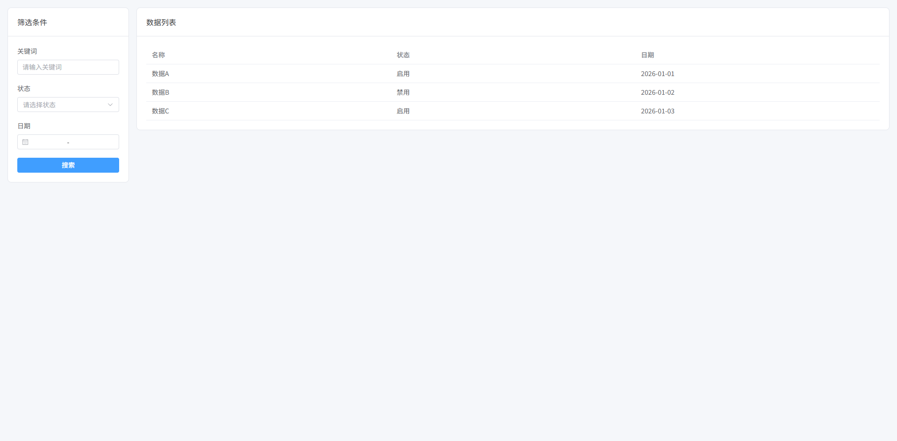

## Master-Detail 布局（列表 + 详情）

 左侧列表，右侧详情内容。常见于：邮件系统、任务系统、用户详情查看。

- **左侧列表区域**：展示数据列表，支持点击选择
- **右侧详情区域**：展示当前选中项的详细信息
- **左右分栏布局**：列表固定宽度，详情区自适应
- **选中高亮效果**：当前列表项视觉高亮
- **卡片式 UI 风格**：统一后台系统视觉风格
- **独立滚动区域**：列表和详情区分别滚动

```vue
<template>
  <div class="page">

    <aside class="list">

      <el-card shadow="never">

        <template #header>
          数据列表
        </template>

        <div class="list-body">

          <div
            v-for="item in data"
            :key="item.id"
            class="list-item"
            :class="{ active: current?.id === item.id }"
            @click="selectItem(item)"
          >
            <div class="title">{{ item.name }}</div>
            <div class="meta">{{ item.date }}</div>
          </div>

        </div>

      </el-card>

    </aside>

    <main class="detail">

      <el-card shadow="never" v-if="current">

        <template #header>
          详情信息
        </template>

        <el-descriptions :column="2" border>

          <el-descriptions-item label="名称">
            {{ current.name }}
          </el-descriptions-item>

          <el-descriptions-item label="状态">
            {{ current.status }}
          </el-descriptions-item>

          <el-descriptions-item label="日期">
            {{ current.date }}
          </el-descriptions-item>

          <el-descriptions-item label="描述">
            {{ current.desc }}
          </el-descriptions-item>

        </el-descriptions>

      </el-card>

      <div v-else class="empty">
        请选择一条数据
      </div>

    </main>

  </div>
</template>

<script setup lang="ts">

import { ref } from "vue"

interface Item {
  id: number
  name: string
  status: string
  date: string
  desc: string
}

const data = ref<Item[]>([
  { id: 1, name: "任务A", status: "进行中", date: "2026-03-01", desc: "任务A详细信息" },
  { id: 2, name: "任务B", status: "已完成", date: "2026-03-02", desc: "任务B详细信息" },
  { id: 3, name: "任务C", status: "待处理", date: "2026-03-03", desc: "任务C详细信息" }
])

const current = ref<Item | null>(data.value[0])

const selectItem = (item: Item) => {
  current.value = item
}

</script>

<style scoped lang="scss">

$page-bg: #f5f7fa; // 页面背景色
$list-width: 320px; // 左侧列表宽度
$gap: 16px; // 布局间距
$radius: 8px; // 圆角大小
$border: #e5e7eb; // 边框颜色
$active: #ecf5ff; // 选中背景色
$text-secondary: #6b7280; // 次级文字颜色

.page {
  height: 100vh; // 页面高度
  display: flex; // 使用flex布局
  background: $page-bg; // 页面背景
  padding: $gap; // 页面内边距
  gap: $gap; // 子元素间距
  box-sizing: border-box; // 盒模型
}

.list {
  width: $list-width; // 左侧列表宽度
  flex-shrink: 0; // 防止被压缩
  display: flex; // flex布局
  flex-direction: column; // 垂直排列

  .list-body {
    display: flex; // flex布局
    flex-direction: column; // 垂直排列
    gap: 8px; // 项目间距
  }

  .list-item {
    padding: 12px; // 内边距
    border-radius: $radius; // 圆角
    border: 1px solid $border; // 边框
    cursor: pointer; // 鼠标指针
    transition: all .2s; // 过渡动画
    background: #fff; // 背景颜色

    &:hover {
      background: #f9fafb; // 悬停背景
    }

    &.active {
      background: $active; // 选中背景
      border-color: #409eff; // 选中边框
    }

    .title {
      font-weight: 600; // 字体加粗
    }

    .meta {
      font-size: 12px; // 字体大小
      color: $text-secondary; // 次级文字颜色
      margin-top: 4px; // 上边距
    }

  }

}

.detail {
  flex: 1; // 占剩余空间
  overflow: auto; // 内容滚动
  display: flex; // flex布局
  flex-direction: column; // 垂直排列
}

.empty {
  flex: 1; // 占剩余空间
  display: flex; // flex布局
  align-items: center; // 垂直居中
  justify-content: center; // 水平居中
  color: #9ca3af; // 文字颜色
  font-size: 14px; // 字体大小
}

</style>
```

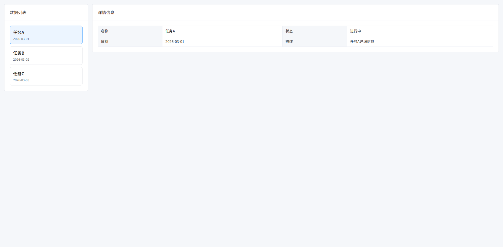

## 三栏工作台布局（左导航 + 中内容 + 右属性面板）

 常见于：BI系统、低代码平台、配置中心、编辑器系统。

- **左侧：导航/组件区**
- **中间：主要工作区**
- **右侧：属性配置面板**
- **中间区域占最大空间**
- **左右两侧固定宽度**

```vue
<template>
  <div class="workspace">

    <!-- 左侧导航 -->
    <aside class="left-panel">

      <el-card shadow="never">

        <template #header>
          组件列表
        </template>

        <div class="menu">

          <div
            v-for="item in components"
            :key="item"
            class="menu-item"
          >
            {{ item }}
          </div>

        </div>

      </el-card>

    </aside>

    <!-- 中间工作区 -->
    <main class="center-panel">

      <el-card shadow="never" class="canvas">

        <template #header>
          工作区
        </template>

        <div class="canvas-body">

          <div class="placeholder">
            这里是主要工作区域
          </div>

        </div>

      </el-card>

    </main>

    <!-- 右侧属性面板 -->
    <aside class="right-panel">

      <el-card shadow="never">

        <template #header>
          属性配置
        </template>

        <el-form label-width="80px">

          <el-form-item label="名称">
            <el-input v-model="form.name"/>
          </el-form-item>

          <el-form-item label="宽度">
            <el-input v-model="form.width"/>
          </el-form-item>

          <el-form-item label="高度">
            <el-input v-model="form.height"/>
          </el-form-item>

        </el-form>

      </el-card>

    </aside>

  </div>
</template>

<script setup lang="ts">

import { reactive } from "vue"

const components = [
  "按钮",
  "输入框",
  "选择器",
  "表格",
  "图片"
]

const form = reactive({
  name: "",
  width: "200",
  height: "100"
})

</script>

<style scoped lang="scss">

$page-bg: #f5f7fa; // 页面背景色
$left-width: 240px; // 左侧宽度
$right-width: 300px; // 右侧宽度
$gap: 16px; // 间距
$border: #e5e7eb; // 边框颜色
$radius: 8px; // 圆角大小
$hover: #f3f4f6; // hover背景色

.workspace {
  height: 100vh; // 页面高度
  display: flex; // 使用flex布局
  gap: $gap; // 子元素间距
  padding: $gap; // 页面内边距
  background: $page-bg; // 背景色
  box-sizing: border-box; // 盒模型
}

.left-panel {
  width: $left-width; // 左侧宽度
  flex-shrink: 0; // 防止压缩
}

.right-panel {
  width: $right-width; // 右侧宽度
  flex-shrink: 0; // 防止压缩
}

.center-panel {
  flex: 1; // 占剩余空间
  display: flex; // flex布局
  flex-direction: column; // 垂直排列
}

.canvas {
  flex: 1; // 占满父容器
  display: flex; // flex布局
  flex-direction: column; // 垂直排列
}

.canvas-body {
  flex: 1; // 占剩余空间
  border: 1px dashed $border; // 虚线边框
  border-radius: $radius; // 圆角
  display: flex; // flex布局
  align-items: center; // 垂直居中
  justify-content: center; // 水平居中
  background: #fff; // 背景颜色
}

.placeholder {
  color: #9ca3af; // 文字颜色
  font-size: 14px; // 字体大小
}

.menu {
  display: flex; // flex布局
  flex-direction: column; // 垂直排列
  gap: 8px; // 间距
}

.menu-item {
  padding: 10px; // 内边距
  border: 1px solid $border; // 边框
  border-radius: $radius; // 圆角
  cursor: pointer; // 鼠标手型
  transition: all .2s; // 过渡动画
  background: #fff; // 背景色

  &:hover {
    background: $hover; // hover背景
  }
}

</style>
```

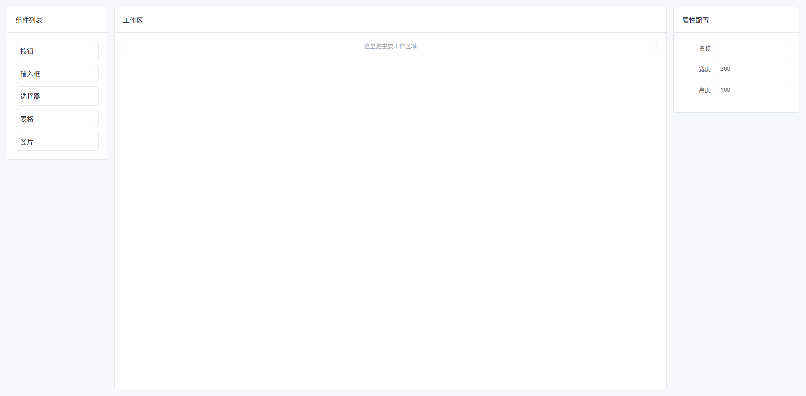

## Split 可拖拽布局（可调整面板宽度）

 面板之间可以拖动改变宽度。常见于：IDE、SQL编辑器、数据分析平台。

- **面板之间可拖拽**
- **动态调整宽度**
- **支持最小宽度限制**
- **用户自定义工作区**

```vue
<template>
  <div class="split-layout">

    <!-- 左面板 -->
    <div
      class="left-panel"
      :style="{ width: leftWidth + 'px' }"
    >
      <el-card shadow="never">

        <template #header>
          文件列表
        </template>

        <ul class="list">
          <li v-for="f in files" :key="f">
            {{ f }}
          </li>
        </ul>

      </el-card>
    </div>

    <!-- 拖拽分割线 -->
    <div
      class="splitter"
      @mousedown="startDrag"
    ></div>

    <!-- 右面板 -->
    <div class="right-panel">

      <el-card shadow="never">

        <template #header>
          编辑器
        </template>

        <div class="editor">
          这里是编辑区域
        </div>

      </el-card>

    </div>

  </div>
</template>

<script setup lang="ts">

import { ref, onUnmounted } from "vue"

const leftWidth = ref(300) // 左面板宽度

const minWidth = 200 // 最小宽度
const maxWidth = 600 // 最大宽度

const files = [
  "index.ts",
  "App.vue",
  "main.ts",
  "router.ts",
  "store.ts"
]

let dragging = false // 是否正在拖拽

const startDrag = () => {
  dragging = true
  document.addEventListener("mousemove", onDrag)
  document.addEventListener("mouseup", stopDrag)
}

const onDrag = (e: MouseEvent) => {
  if (!dragging) return

  const newWidth = e.clientX

  if (newWidth < minWidth) return
  if (newWidth > maxWidth) return

  leftWidth.value = newWidth
}

const stopDrag = () => {
  dragging = false
  document.removeEventListener("mousemove", onDrag)
  document.removeEventListener("mouseup", stopDrag)
}

onUnmounted(() => {
  stopDrag()
})

</script>

<style scoped lang="scss">

$page-bg: #f5f7fa; // 页面背景
$gap: 0px; // 面板间距
$border: #e5e7eb; // 边框颜色
$split-color: #d1d5db; // 分割线颜色
$split-hover: #409eff; // hover颜色

.split-layout {
  height: 100vh; // 页面高度
  display: flex; // flex布局
  background: $page-bg; // 背景
}

/* 左面板 */
.left-panel {
  height: 100%; // 高度
  overflow: auto; // 滚动
}

/* 右面板 */
.right-panel {
  flex: 1; // 占剩余空间
  overflow: auto; // 滚动
}

/* 分割线 */
.splitter {
  width: 6px; // 分割线宽度
  cursor: col-resize; // 鼠标样式
  background: $split-color; // 背景色
  transition: background .2s; // 动画

  &:hover {
    background: $split-hover; // hover颜色
  }
}

.list {
  list-style: none; // 去掉列表符号
  padding: 0; // 内边距
  margin: 0; // 外边距
}

.list li {
  padding: 8px 10px; // 内边距
  border-bottom: 1px solid $border; // 下边框
}

.editor {
  height: 400px; // 编辑区高度
  display: flex; // flex布局
  align-items: center; // 垂直居中
  justify-content: center; // 水平居中
  color: #9ca3af; // 文字颜色
}

</style>
```

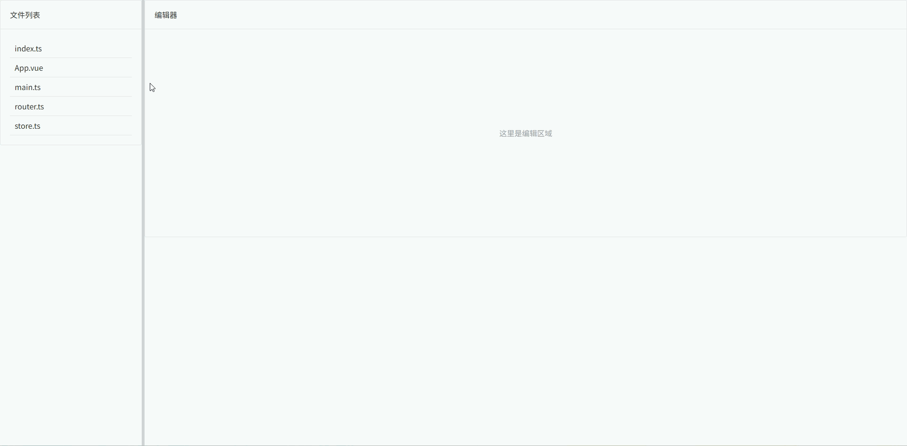

## 文档系统布局（左目录 + 右内容）

 常见于：技术文档、知识库、帮助中心。

- **左侧目录固定宽度**
- **右侧内容区域自适应**
- **目录支持滚动**
- **内容区支持长文档滚动**
- **适合 Markdown / 富文本内容**

```vue
<template>
  <div class="doc-layout">

    <!-- 左侧目录 -->
    <aside class="sidebar">

      <el-card shadow="never">

        <template #header>
          文档目录
        </template>

        <ul class="menu">

          <li
            v-for="item in menus"
            :key="item.id"
            :class="{ active: current?.id === item.id }"
            @click="select(item)"
          >
            {{ item.title }}
          </li>

        </ul>

      </el-card>

    </aside>

    <!-- 右侧内容 -->
    <main class="content">

      <el-card shadow="never">

        <h1 class="title">{{ current?.title }}</h1>

        <p class="paragraph">
          {{ current?.content }}
        </p>

        <p class="paragraph">
          这里通常会放 Markdown 渲染后的内容。
        </p>

        <p class="paragraph">
          技术文档系统一般会结合：
        </p>

        <ul>
          <li>Markdown</li>
          <li>代码高亮</li>
          <li>目录锚点</li>
        </ul>

      </el-card>

    </main>

  </div>
</template>

<script setup lang="ts">

import { ref } from "vue"

interface DocMenu {
  id: number
  title: string
  content: string
}

const menus = ref<DocMenu[]>([
  {
    id: 1,
    title: "快速开始",
    content: "这里是快速开始文档内容。"
  },
  {
    id: 2,
    title: "安装指南",
    content: "这里是安装指南。"
  },
  {
    id: 3,
    title: "API 文档",
    content: "这里是 API 文档介绍。"
  },
  {
    id: 4,
    title: "常见问题",
    content: "这里是 FAQ 内容。"
  }
])

const current = ref<DocMenu | null>(menus.value[0])

const select = (item: DocMenu) => {
  current.value = item
}

</script>

<style scoped lang="scss">

$page-bg: #f5f7fa; // 页面背景
$sidebar-width: 260px; // 左侧宽度
$gap: 16px; // 间距
$border: #e5e7eb; // 边框颜色
$active: #ecf5ff; // 选中背景
$text-secondary: #6b7280; // 次级文字颜色

.doc-layout {
  height: 100vh; // 页面高度
  display: flex; // flex布局
  gap: $gap; // 子元素间距
  padding: $gap; // 页面内边距
  background: $page-bg; // 背景色
  box-sizing: border-box; // 盒模型
}

/* 左侧目录 */
.sidebar {
  width: $sidebar-width; // 固定宽度
  flex-shrink: 0; // 防止压缩
  overflow: auto; // 允许滚动
}

/* 目录列表 */
.menu {
  list-style: none; // 去掉默认样式
  padding: 0; // 内边距
  margin: 0; // 外边距
}

.menu li {
  padding: 10px 12px; // 内边距
  border-radius: 6px; // 圆角
  cursor: pointer; // 鼠标样式
  transition: all .2s; // 动画
  color: #374151; // 文字颜色
}

.menu li:hover {
  background: #f3f4f6; // hover背景
}

.menu li.active {
  background: $active; // 选中背景
  color: #409eff; // 选中文字
}

/* 右侧内容 */
.content {
  flex: 1; // 占剩余空间
  overflow: auto; // 内容滚动
}

/* 文档标题 */
.title {
  margin-bottom: 20px; // 下边距
  font-size: 26px; // 字体大小
  font-weight: 600; // 字体加粗
}

/* 段落 */
.paragraph {
  margin-bottom: 14px; // 段落间距
  color: $text-secondary; // 文字颜色
  line-height: 1.7; // 行高
}

</style>
```

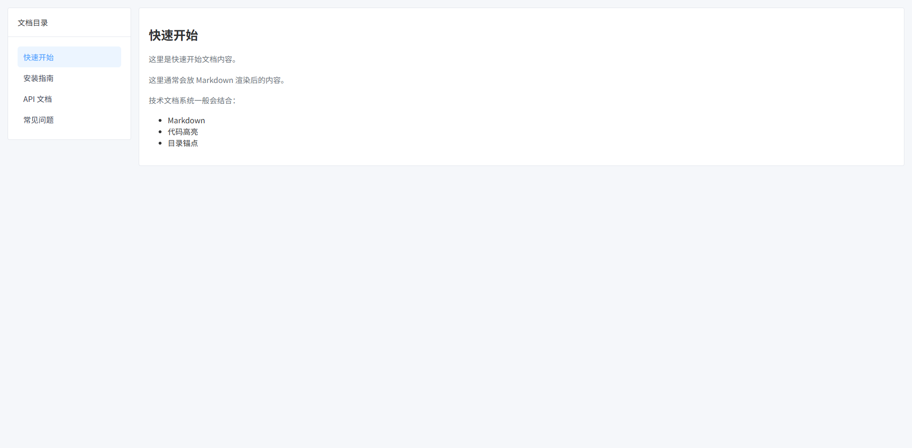