# TailwindCSS 实操


## 一、基础布局类

### Flex 布局（水平 / 垂直居中）

**功能说明**：使用 TailwindCSS 快速实现容器内元素水平和垂直居中。适用于按钮、文本、卡片等组件居中场景。

```vue
<template>
  <div class="flex h-64 bg-gray-100 justify-center items-center border border-gray-300">
    <!-- justify-center: 水平居中 -->
    <!-- items-center: 垂直居中 -->
    <!-- h-64: 高度 16rem -->
    <!-- bg-gray-100: 背景灰色 -->
    <!-- border: 边框 -->
    <button class="bg-blue-500 text-white px-4 py-2 rounded hover:bg-blue-600">
      居中按钮
      <!-- bg-blue-500: 背景蓝色 -->
      <!-- text-white: 白色文字 -->
      <!-- px-4 py-2: 内边距 -->
      <!-- rounded: 圆角 -->
      <!-- hover:bg-blue-600: 悬停颜色变化 -->
    </button>
  </div>
</template>

<script lang="ts" setup>
// 这是一个简单示例，无需额外逻辑
</script>

<style lang="scss" scoped>
// 额外 Sass 可以用来扩展样式，但此处全用 Tailwind
</style>
```

✅ 特点：

- `flex` 激活 Flex 布局
- `justify-center` 水平居中
- `items-center` 垂直居中
- Tailwind 类组合简洁，适合快速原型开发

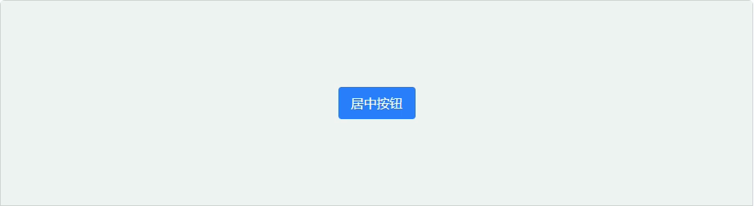

### Grid 布局（响应式卡片）

**功能说明**：使用 TailwindCSS 的 Grid 布局实现响应式卡片排列，适用于仪表盘、商品列表、图文展示等场景。

```vue
<template>
  <div class="p-4">
    <!-- grid: 激活网格布局 -->
    <!-- gap-4: 网格间距 1rem -->
    <!-- sm:grid-cols-2: 小屏 2 列 -->
    <!-- md:grid-cols-3: 中屏 3 列 -->
    <!-- lg:grid-cols-4: 大屏 4 列 -->
    <div class="grid gap-4 sm:grid-cols-2 md:grid-cols-3 lg:grid-cols-4">
      <div
        v-for="card in cards"
        :key="card.id"
        class="bg-white p-4 rounded shadow hover:shadow-lg transition-shadow"
      >
        <!-- bg-white: 白色背景 -->
        <!-- p-4: 内边距 -->
        <!-- rounded: 圆角 -->
        <!-- shadow: 默认阴影 -->
        <!-- hover:shadow-lg: 悬停阴影加深 -->
        <!-- transition-shadow: 阴影变化动画 -->
        <h3 class="text-lg font-semibold mb-2">{{ card.title }}</h3>
        <!-- text-lg: 大号文字 -->
        <!-- font-semibold: 半粗体 -->
        <!-- mb-2: 下边距 -->
        <p class="text-gray-600 text-sm">{{ card.desc }}</p>
        <!-- text-gray-600: 灰色文字 -->
        <!-- text-sm: 小号文字 -->
      </div>
    </div>
  </div>
</template>

<script lang="ts" setup>
import { reactive } from 'vue';

interface Card {
  id: number;
  title: string;
  desc: string;
}

// 示例卡片数据
const cards = reactive<Card[]>([
  { id: 1, title: '卡片 1', desc: '这是第一个卡片描述' },
  { id: 2, title: '卡片 2', desc: '这是第二个卡片描述' },
  { id: 3, title: '卡片 3', desc: '这是第三个卡片描述' },
  { id: 4, title: '卡片 4', desc: '这是第四个卡片描述' },
  { id: 5, title: '卡片 5', desc: '这是第五个卡片描述' },
  { id: 6, title: '卡片 6', desc: '这是第六个卡片描述' },
]);
</script>

<style lang="scss" scoped>
// 可使用 Sass 自定义变量或嵌套样式
</style>
```

✅ 特点：

- `grid` + `gap` 快速构建网格
- 响应式列数（`sm:grid-cols-2`、`md:grid-cols-3`、`lg:grid-cols-4`）
- 卡片有悬停阴影动画，UI 更生动
- Tailwind + Vue3 reactive 数据绑定结合

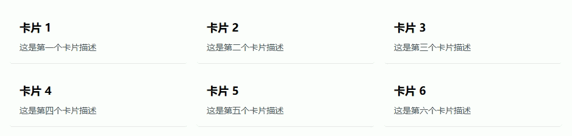

### 常见页面布局（Header + Sidebar + Content）

**功能说明**：使用 TailwindCSS 构建经典后台或管理系统布局：顶部 Header + 左侧 Sidebar + 右侧 Content。基础布局用 TailwindCSS，按钮、菜单等基础组件可用 ElementPlus。

```vue
<template>
  <div class="flex flex-col h-screen">
    <!-- Header -->
    <header class="h-16 bg-blue-600 text-white flex items-center px-4">
      <!-- h-16: 高度 4rem -->
      <!-- flex + items-center: 垂直居中 -->
      <!-- px-4: 左右内边距 1rem -->
      <h1 class="text-xl font-bold">管理系统</h1>
      <el-button class="ml-auto" type="primary" size="small">登出</el-button>
      <!-- ml-auto: 自动左边距，让按钮靠右 -->
    </header>

    <!-- 主体区域: Sidebar + Content -->
    <div class="flex flex-1 overflow-hidden">
      <!-- Sidebar -->
      <aside class="w-64 bg-gray-100 p-4 overflow-auto">
        <!-- w-64: 宽度 16rem -->
        <!-- overflow-auto: 超出滚动 -->
        <el-menu default-active="1" class="bg-gray-100">
          <el-menu-item index="1">仪表盘</el-menu-item>
          <el-menu-item index="2">用户管理</el-menu-item>
          <el-menu-item index="3">设置</el-menu-item>
        </el-menu>
      </aside>

      <!-- Content -->
      <main class="flex-1 bg-gray-50 p-6 overflow-auto">
        <!-- flex-1: 占据剩余空间 -->
        <h2 class="text-2xl font-semibold mb-4">仪表盘</h2>
        <div class="grid gap-4 sm:grid-cols-2 md:grid-cols-3 lg:grid-cols-4">
          <div class="bg-white p-4 rounded shadow hover:shadow-lg transition-shadow">
            卡片 1
          </div>
          <div class="bg-white p-4 rounded shadow hover:shadow-lg transition-shadow">
            卡片 2
          </div>
          <div class="bg-white p-4 rounded shadow hover:shadow-lg transition-shadow">
            卡片 3
          </div>
          <div class="bg-white p-4 rounded shadow hover:shadow-lg transition-shadow">
            卡片 4
          </div>
        </div>
      </main>
    </div>
  </div>
</template>

<script lang="ts" setup>
// 此布局示例无需额外逻辑
</script>

<style lang="scss" scoped>
// 可以使用 Sass 变量控制宽度或颜色，但布局全用 TailwindCSS
</style>
```

✅ 特点：

- Header 高度固定，左右对齐用 `flex` + `items-center`
- Sidebar 固定宽度，内容滚动 `overflow-auto`
- Content 自适应剩余空间 `flex-1`
- Tailwind + ElementPlus 混合使用：布局用 Tailwind，菜单/按钮用 ElementPlus

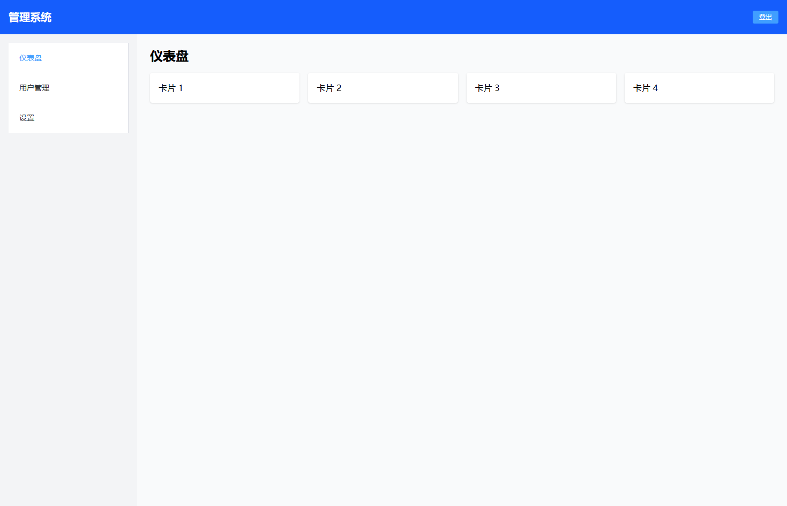

------

### 自适应布局（移动端适配）

**功能说明**：使用 TailwindCSS 构建响应式布局，支持 PC / 平板 / 手机显示。示例为 Header + Sidebar + Content，移动端 Sidebar 折叠为抽屉式。

```vue
<template>
  <div class="flex flex-col h-screen">
    <!-- Header -->
    <div class="flex flex-1 overflow-hidden">
      <!-- Sidebar PC端显示 -->
      <!-- hidden md:block: 小于 md 隐藏，大于等于 md 显示 -->
      <aside
          class="bg-gray-100 p-4 overflow-auto w-64 hidden md:block"
      >
      <el-menu default-active="1" class="bg-gray-100">
        <el-menu-item index="1">仪表盘</el-menu-item>
        <el-menu-item index="2">用户管理</el-menu-item>
        <el-menu-item index="3">设置</el-menu-item>
      </el-menu>
      </aside>

      <!-- Sidebar 手机端抽屉 -->
      <!-- md:hidden: 大屏隐藏 -->
      <el-drawer
          :visible.sync="sidebarOpen"
          direction="ltr"
          size="200px"
          class="md:hidden"
      >
      <el-menu default-active="1">
        <el-menu-item index="1">仪表盘</el-menu-item>
        <el-menu-item index="2">用户管理</el-menu-item>
        <el-menu-item index="3">设置</el-menu-item>
      </el-menu>
      </el-drawer>

      <!-- Content 区域 -->
      <main class="flex-1 bg-gray-50 p-6 overflow-auto">
        <!-- flex-1: 占据剩余空间 -->
        <h2 class="text-2xl font-semibold mb-4">仪表盘</h2>
        <div class="grid gap-4 sm:grid-cols-2 md:grid-cols-3 lg:grid-cols-4">
          <!-- gap-4: 网格间距 1rem -->
          <div class="bg-white p-4 rounded shadow hover:shadow-lg transition-shadow">
            卡片 1
          </div>
          <div class="bg-white p-4 rounded shadow hover:shadow-lg transition-shadow">
            卡片 2
          </div>
          <div class="bg-white p-4 rounded shadow hover:shadow-lg transition-shadow">
            卡片 3
          </div>
          <div class="bg-white p-4 rounded shadow hover:shadow-lg transition-shadow">
            卡片 4
          </div>
        </div>
      </main>
    </div>

    <!-- 主体区域 -->
    <header class="h-16 bg-blue-600 text-white flex items-center px-4">
      <!-- h-16: 高度 4rem -->
      <!-- flex + items-center: 垂直居中 -->
      <!-- px-4: 左右内边距 1rem -->
      <button
          class="block md:hidden mr-4 text-white"
          @click="sidebarOpen = !sidebarOpen"
      >
        <!-- block md:hidden: 手机端显示，md 及以上隐藏 -->
        <el-icon><Menu /></el-icon>
        <!-- 使用 ElementPlus 图标组件 -->
      </button>
      <h1 class="text-xl font-bold">响应式管理系统</h1>
      <el-button class="ml-auto" type="primary" size="small">登出</el-button>
      <!-- ml-auto: 左边距自动，按钮靠右 -->
    </header>
  </div>
</template>

<script lang="ts" setup>
import { ref } from 'vue'
import { Menu } from '@element-plus/icons-vue'

// 控制移动端 Sidebar 抽屉开关
const sidebarOpen = ref(false)
</script>

<style lang="scss" scoped>
// 全局颜色或宽度可通过 Sass 变量管理，布局主要用 Tailwind
</style>
```

✅ 特点：

- `hidden md:block` / `block md:hidden` 实现移动端折叠显示
- `el-drawer` 结合 Tailwind 控制移动端 Sidebar
- `flex-1` Content 自适应剩余空间
- 网格卡片使用 `grid` + 响应式列数

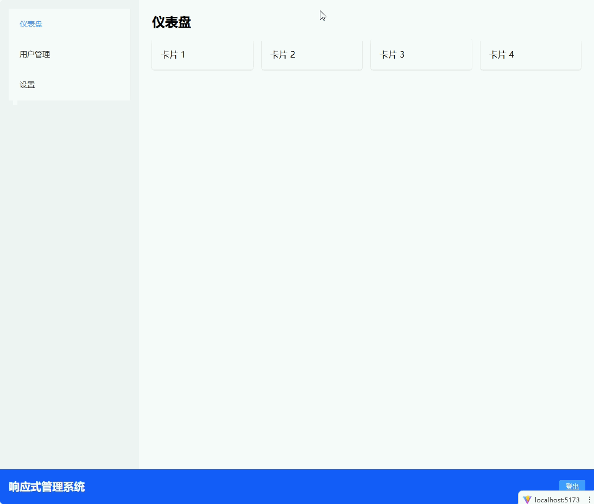

------

### 间距（margin / padding）规范用法

**功能说明**：使用 TailwindCSS 快速管理元素的内外间距，支持响应式、统一规范，避免写自定义 CSS。

```vue
<template>
  <div class="p-4 bg-gray-100 min-h-screen">
    <!-- p-4: 容器内边距 1rem -->
    <h2 class="text-xl font-bold mb-6">间距示例</h2>
    <!-- mb-6: 下边距 1.5rem -->

    <div class="flex flex-col space-y-4">
      <!-- flex-col: 垂直排列 -->
      <!-- space-y-4: 垂直子元素间距 1rem -->
      <div class="bg-white p-4 rounded shadow">卡片 1</div>
      <div class="bg-white p-6 rounded shadow">卡片 2（内边距更大 p-6）</div>
      <div class="bg-white p-2 rounded shadow">卡片 3（内边距更小 p-2）</div>
    </div>

    <div class="mt-8 grid grid-cols-3 gap-4">
      <!-- mt-8: 上边距 2rem -->
      <!-- gap-4: 网格子元素间距 1rem -->
      <div class="bg-blue-200 p-2">1</div>
      <div class="bg-blue-300 p-4">2</div>
      <div class="bg-blue-400 p-6">3</div>
    </div>

    <div class="mt-8 flex justify-between">
      <!-- justify-between: 两端对齐 -->
      <div class="m-2 p-2 bg-green-200">外边距 m-2, 内边距 p-2</div>
      <div class="m-4 p-4 bg-green-300">外边距 m-4, 内边距 p-4</div>
      <div class="m-6 p-6 bg-green-400">外边距 m-6, 内边距 p-6</div>
    </div>
  </div>
</template>

<script lang="ts" setup>
// 此示例无需额外逻辑
</script>

<style lang="scss" scoped>
// 可通过 Sass 变量控制间距单位，但 Tailwind 原生类已覆盖绝大多数需求
</style>
```

✅ 特点：

- `p-*`：内边距（padding），支持全方向或单边：`px-4` / `py-2` / `pt-4`
- `m-*`：外边距（margin），支持全方向或单边：`mx-4` / `my-2` / `mb-6`
- `space-x-*` / `space-y-*`：子元素间距，避免单独写 margin
- `gap-*`：Grid 或 Flex 间距
- 响应式支持：`sm:p-4 md:p-6 lg:p-8`

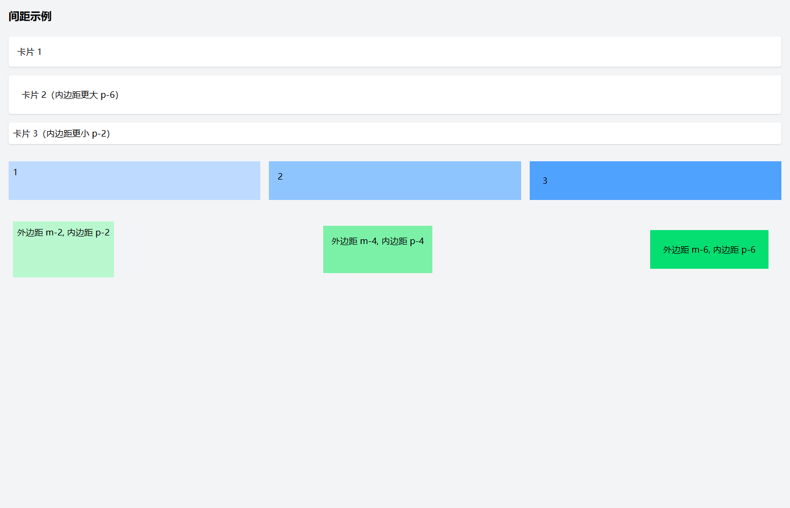

------

### 宽高控制（固定 / 自适应 / 百分比）

**功能说明**：使用 TailwindCSS 设置元素的宽度和高度，支持固定值、自适应（flex-1）、百分比以及响应式控制。

```vue
<template>
  <div class="p-4 bg-gray-100 min-h-screen space-y-6">
    <h2 class="text-xl font-bold mb-4">宽高控制示例</h2>

    <!-- 固定宽高 -->
    <div class="bg-white w-64 h-32 rounded shadow flex items-center justify-center">
      <!-- w-64: 宽度 16rem -->
      <!-- h-32: 高度 8rem -->
      <!-- flex + items-center + justify-center: 水平垂直居中 -->
      固定宽高 16rem x 8rem
    </div>

    <!-- 自适应宽度 flex-1 -->
    <div class="flex space-x-4">
      <!-- flex: 水平排列 -->
      <!-- space-x-4: 子元素间距 1rem -->
      <div class="flex-1 bg-blue-200 p-4 rounded shadow text-center">
        <!-- flex-1: 占据剩余空间 -->
        自适应宽度 flex-1
      </div>
      <div class="flex-1 bg-blue-300 p-4 rounded shadow text-center">
        flex-1
      </div>
    </div>

    <!-- 百分比宽度 -->
    <div class="flex space-x-4">
      <div class="w-1/3 bg-green-200 p-4 rounded shadow text-center">
        <!-- w-1/3: 宽度 33.333% -->
        1/3 宽度
      </div>
      <div class="w-2/3 bg-green-300 p-4 rounded shadow text-center">
        <!-- w-2/3: 宽度 66.666% -->
        2/3 宽度
      </div>
    </div>

    <!-- 高度自适应内容 -->
    <div class="bg-purple-200 p-4 rounded shadow">
      <!-- h-auto: 高度自适应内容 -->
      高度自适应内容
      <p class="mt-2">多行文本示例</p>
      <p>更多内容...</p>
    </div>

    <!-- 响应式宽高控制 -->
    <div class="bg-pink-200 rounded shadow p-4 w-full sm:w-3/4 md:w-1/2 lg:w-1/3 h-24 flex items-center justify-center">
      <!-- w-full: 全宽 -->
      <!-- sm:w-3/4: 小屏幕 ≥ 640px 宽度 75% -->
      <!-- md:w-1/2: 中屏幕 ≥ 768px 宽度 50% -->
      <!-- lg:w-1/3: 大屏幕 ≥ 1024px 宽度 33.333% -->
      <!-- h-24: 高度 6rem -->
      响应式宽度
    </div>
  </div>
</template>

<script lang="ts" setup>
// 示例无需额外逻辑
</script>

<style lang="scss" scoped>
// Tailwind 原生类已涵盖绝大多数宽高需求
</style>
```

✅ 特点：

- 固定宽高：`w-64`、`h-32`
- 自适应：`flex-1`
- 百分比：`w-1/3`、`w-2/3`
- 高度自适应：`h-auto`
- 响应式宽高：`sm:w-3/4 md:w-1/2 lg:w-1/3`
- Tailwind 组合简洁，布局可快速调整

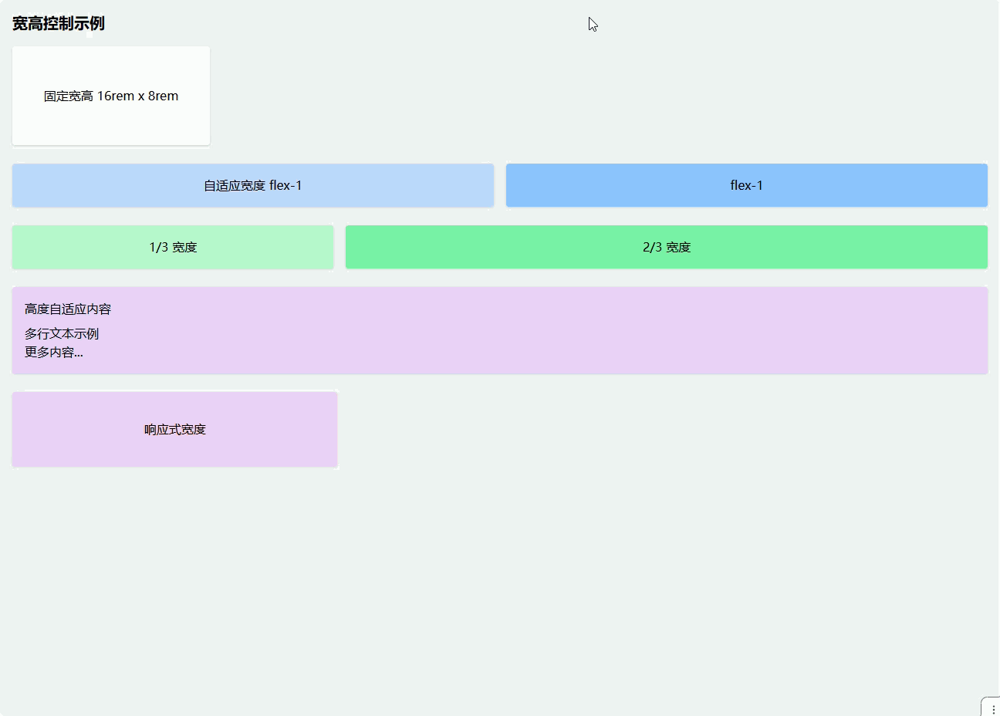

------

## 二、文本与排版

### 文本大小 / 颜色 / 加粗

**功能说明**：使用 TailwindCSS 控制文本的大小、颜色、粗细，支持响应式调整，适用于标题、段落、标签等排版场景。

```vue
<template>
  <div class="p-6 bg-gray-100 space-y-6">
    <h2 class="text-xl font-bold text-gray-900 mb-4">
      <!-- text-xl: 字体大小 1.25rem -->
      <!-- font-bold: 字体加粗 -->
      <!-- text-gray-900: 深灰色文字 -->
      标题示例
      <!-- mb-4: 下边距 1rem -->
    </h2>

    <!-- 不同字体大小 -->
    <div class="space-y-2">
      <p class="text-sm text-gray-700">
        <!-- text-sm: 字体大小 0.875rem -->
        <!-- text-gray-700: 灰色文字 -->
        小号文本示例
      </p>
      <p class="text-base text-gray-800">
        <!-- text-base: 字体大小 1rem -->
        <!-- text-gray-800: 灰色文字稍深 -->
        基本文本示例
      </p>
      <p class="text-lg text-gray-900 font-semibold">
        <!-- text-lg: 字体大小 1.125rem -->
        <!-- text-gray-900: 深灰色文字 -->
        <!-- font-semibold: 半粗体 -->
        大号半粗体文本
      </p>
      <p class="text-xl text-blue-600 font-extrabold">
        <!-- text-xl: 字体大小 1.25rem -->
        <!-- text-blue-600: 蓝色文字 -->
        <!-- font-extrabold: 极粗字体 -->
        大号极粗体文本
      </p>
    </div>

    <!-- 响应式文本大小 -->
    <p class="text-sm sm:text-base md:text-lg lg:text-xl text-gray-800 font-medium">
      <!-- text-sm: 默认字体大小 0.875rem -->
      <!-- sm:text-base: ≥640px 屏幕字体大小 1rem -->
      <!-- md:text-lg: ≥768px 屏幕字体大小 1.125rem -->
      <!-- lg:text-xl: ≥1024px 屏幕字体大小 1.25rem -->
      <!-- text-gray-800: 灰色文字 -->
      <!-- font-medium: 中等粗细 -->
      响应式文本示例
    </p>

    <!-- 文本颜色示例 -->
    <div class="space-x-4 mt-4">
      <span class="text-red-500 font-bold">
        <!-- text-red-500: 红色文字 -->
        <!-- font-bold: 加粗 -->
        红色加粗
      </span>
      <span class="text-green-600 font-semibold">
        <!-- text-green-600: 绿色文字 -->
        <!-- font-semibold: 半粗体 -->
        绿色半粗
      </span>
      <span class="text-blue-400 font-medium">
        <!-- text-blue-400: 蓝色文字 -->
        <!-- font-medium: 中等粗细 -->
        蓝色中等
      </span>
      <span class="text-gray-500 font-light">
        <!-- text-gray-500: 灰色文字 -->
        <!-- font-light: 细字体 -->
        灰色细体
      </span>
    </div>
  </div>
</template>

<script lang="ts" setup>
// 示例无需逻辑
</script>

<style lang="scss" scoped>
// Tailwind 原生类已包含文本大小、颜色、粗细控制
</style>
```

✅ 特点：

- `text-*`：控制字体大小，如 `text-sm`、`text-base`、`text-lg`、`text-xl`
- `text-{color}-{number}`：文字颜色，如 `text-gray-700`、`text-blue-600`
- `font-*`：字体粗细，如 `font-light`、`font-medium`、`font-semibold`、`font-bold`、`font-extrabold`
- 响应式字体大小：`sm:text-base`、`md:text-lg`、`lg:text-xl`

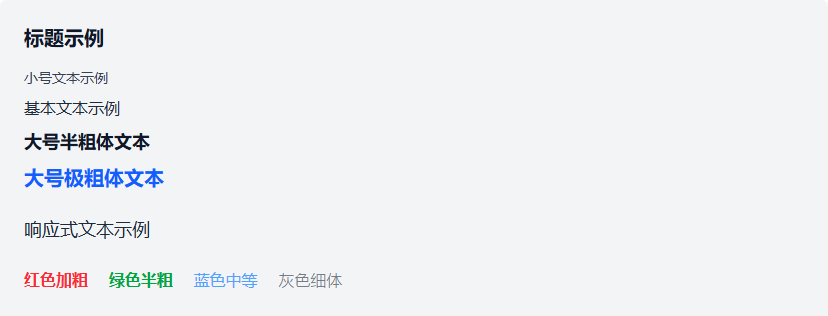

------

### 文本溢出（省略号）

**功能说明**：使用 TailwindCSS 控制文本溢出显示省略号，支持单行和多行文本截断，常用于卡片标题、列表项、标签等场景。

```vue
<template>
  <div class="p-6 bg-gray-100 space-y-6">
    <h2 class="text-xl font-bold text-gray-900 mb-4">
      <!-- text-xl: 字体大小 1.25rem -->
      <!-- font-bold: 加粗字体 -->
      <!-- text-gray-900: 深灰色文字 -->
      <!-- mb-4: 下边距 1rem -->
      文本溢出示例
    </h2>

    <!-- 单行文本溢出 -->
    <div class="w-64 border border-gray-300 p-2">
      <!-- w-64: 宽度 16rem -->
      <!-- border: 边框 -->
      <!-- border-gray-300: 灰色边框 -->
      <!-- p-2: 内边距 0.5rem -->
      <p class="truncate text-gray-800">
        <!-- truncate: 单行文本溢出显示省略号 -->
        <!-- text-gray-800: 灰色文字 -->
        这是一段很长的文本，超过容器宽度会显示省略号，适用于单行文本溢出处理
      </p>
    </div>

    <!-- 多行文本溢出 -->
    <div class="w-64 border border-gray-300 p-2">
      <!-- w-64: 宽度 16rem -->
      <!-- border: 边框 -->
      <!-- border-gray-300: 灰色边框 -->
      <!-- p-2: 内边距 0.5rem -->
      <p class="line-clamp-3 text-gray-800">
        <!-- line-clamp-3: 多行文本最多显示 3 行，超过显示省略号 -->
        <!-- text-gray-800: 灰色文字 -->
        这是一段很长的文本，用于展示多行文本溢出处理，超过三行会显示省略号。
        TailwindCSS 提供 line-clamp 插件来实现多行文本截断，非常适合卡片描述或列表项。
        无需额外 CSS，使用类即可快速生效。
      </p>
    </div>

    <!-- 响应式文本溢出 -->
    <div class="w-full sm:w-80 md:w-96 border border-gray-300 p-2">
      <!-- w-full: 默认全宽 -->
      <!-- sm:w-80: 小屏幕 ≥640px 宽度 20rem -->
      <!-- md:w-96: 中屏幕 ≥768px 宽度 24rem -->
      <!-- border: 边框 -->
      <!-- border-gray-300: 灰色边框 -->
      <!-- p-2: 内边距 0.5rem -->
      <p class="truncate text-gray-700">
        <!-- truncate: 单行文本溢出显示省略号 -->
        <!-- text-gray-700: 灰色文字 -->
        响应式文本溢出示例，根据屏幕宽度自动调整容器宽度，文本超出部分显示省略号
      </p>
    </div>
  </div>
</template>

<script lang="ts" setup>
// 示例无需额外逻辑
</script>

<style lang="scss" scoped>
// line-clamp 插件需在 Tailwind 配置中启用
// @tailwind base;
// @tailwind components;
// @tailwind utilities;
</style>
```

✅ 特点：

- 单行文本溢出：`truncate`
- 多行文本溢出：`line-clamp-{n}`（需 Tailwind 插件支持）
- 响应式宽度结合溢出控制：`w-full sm:w-80 md:w-96`
- Tailwind 类组合简单，无需自定义 CSS

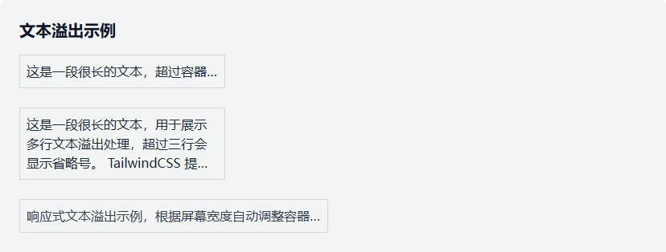

------

### 多行文本截断（line-clamp）

**功能说明**：使用 TailwindCSS 的 `line-clamp` 插件实现多行文本省略，适用于卡片描述、文章摘要、列表简介等场景。

```vue
<template>
  <div class="p-6 bg-gray-100 space-y-6">
    <!-- p-6: 内边距 1.5rem -->
    <!-- bg-gray-100: 浅灰背景 -->
    <!-- space-y-6: 子元素垂直间距 1.5rem -->

    <h2 class="text-xl font-bold text-gray-900 mb-4">
      <!-- text-xl: 字体大小 1.25rem -->
      <!-- font-bold: 加粗 -->
      <!-- text-gray-900: 深灰色 -->
      <!-- mb-4: 下边距 1rem -->
      多行文本截断示例
    </h2>

    <!-- 2 行截断 -->
    <div class="w-64 bg-white p-4 rounded shadow">
      <!-- w-64: 宽度 16rem -->
      <!-- bg-white: 白色背景 -->
      <!-- p-4: 内边距 1rem -->
      <!-- rounded: 圆角 -->
      <!-- shadow: 阴影 -->
      <p class="line-clamp-2 text-gray-700">
        <!-- line-clamp-2: 限制最多显示 2 行，超出显示省略号 -->
        <!-- text-gray-700: 灰色文字 -->
        这是一段用于测试多行文本截断的内容，当文本超过两行时会自动隐藏并显示省略号，
        在实际项目中常用于卡片描述或新闻摘要展示，保证布局整齐统一。
      </p>
    </div>

    <!-- 3 行截断 -->
    <div class="w-64 bg-white p-4 rounded shadow">
      <!-- w-64: 宽度 16rem -->
      <!-- bg-white: 白色背景 -->
      <!-- p-4: 内边距 1rem -->
      <!-- rounded: 圆角 -->
      <!-- shadow: 阴影 -->
      <p class="line-clamp-3 text-gray-700">
        <!-- line-clamp-3: 限制最多显示 3 行 -->
        <!-- text-gray-700: 灰色文字 -->
        TailwindCSS 提供 line-clamp 插件用于多行文本截断，
        相比传统 CSS（如 -webkit-line-clamp），使用更加简洁。
        在 Vue 项目中可以直接通过 class 控制展示行数，
        非常适合组件化开发。
      </p>
    </div>

    <!-- 响应式截断 -->
    <div class="w-full sm:w-80 md:w-96 bg-white p-4 rounded shadow">
      <!-- w-full: 默认宽度 100% -->
      <!-- sm:w-80: ≥640px 宽度 20rem -->
      <!-- md:w-96: ≥768px 宽度 24rem -->
      <!-- bg-white: 白色背景 -->
      <!-- p-4: 内边距 1rem -->
      <!-- rounded: 圆角 -->
      <!-- shadow: 阴影 -->
      <p class="line-clamp-2 md:line-clamp-4 text-gray-800">
        <!-- line-clamp-2: 默认显示 2 行 -->
        <!-- md:line-clamp-4: ≥768px 显示 4 行 -->
        <!-- text-gray-800: 灰色文字 -->
        响应式多行截断示例，小屏幕只显示两行内容，
        大屏幕可以展示更多内容，从而提升阅读体验。
        这种方式在移动端和 PC 端适配中非常常见，
        能有效避免布局错乱。
      </p>
    </div>

    <!-- 卡片列表场景 -->
    <div class="grid grid-cols-1 sm:grid-cols-2 md:grid-cols-3 gap-4">
      <!-- grid: 网格布局 -->
      <!-- grid-cols-1: 默认 1 列 -->
      <!-- sm:grid-cols-2: ≥640px 2 列 -->
      <!-- md:grid-cols-3: ≥768px 3 列 -->
      <!-- gap-4: 网格间距 1rem -->
      <div
        v-for="item in list"
        :key="item.id"
        class="bg-white p-4 rounded shadow hover:shadow-lg transition-shadow"
      >
        <!-- bg-white: 白色背景 -->
        <!-- p-4: 内边距 -->
        <!-- rounded: 圆角 -->
        <!-- shadow: 默认阴影 -->
        <!-- hover:shadow-lg: 悬停阴影加深 -->
        <!-- transition-shadow: 阴影过渡动画 -->
        <h3 class="text-lg font-semibold mb-2">
          <!-- text-lg: 字体 1.125rem -->
          <!-- font-semibold: 半粗体 -->
          <!-- mb-2: 下边距 0.5rem -->
          {{ item.title }}
        </h3>
        <p class="line-clamp-3 text-gray-600">
          <!-- line-clamp-3: 限制 3 行 -->
          <!-- text-gray-600: 灰色文字 -->
          {{ item.desc }}
        </p>
      </div>
    </div>
  </div>
</template>

<script lang="ts" setup>
import { reactive } from 'vue'

interface Item {
  id: number
  title: string
  desc: string
}

const list = reactive<Item[]>([
  {
    id: 1,
    title: '文章 1',
    desc: '这是一段很长的描述内容，用于展示多行文本截断效果，在卡片列表中非常常见。'
  },
  {
    id: 2,
    title: '文章 2',
    desc: 'TailwindCSS 的 line-clamp 插件可以非常方便地控制文本行数，提高开发效率。'
  },
  {
    id: 3,
    title: '文章 3',
    desc: '通过响应式断点，可以在不同设备上显示不同的文本行数，提升用户体验。'
  }
])
</script>

<style lang="scss" scoped>
// ⚠️ 必须在 tailwind.config.js 中启用插件
// plugins: [require('@tailwindcss/line-clamp')]
</style>
```

✅ 特点：

- `line-clamp-2 / 3 / 4`：控制最大显示行数
- 响应式支持：`md:line-clamp-4`
- 适用于卡片列表 / 文章摘要
- 比传统 CSS 更简单，直接 class 控制

------

### 文本对齐（左 / 中 / 右）

**功能说明**：使用 TailwindCSS 控制文本对齐方式（左对齐 / 居中 / 右对齐），支持响应式，在表格、卡片、按钮、表单中非常常用。适用于 TailwindCSS 4.1.18。

```vue
<template>
  <div class="p-6 bg-gray-100 space-y-6">
    <!-- p-6: 内边距 1.5rem -->
    <!-- bg-gray-100: 浅灰背景 -->
    <!-- space-y-6: 子元素垂直间距 1.5rem -->

    <h2 class="text-xl font-bold text-gray-900 mb-4">
      <!-- text-xl: 字体大小 1.25rem -->
      <!-- font-bold: 加粗 -->
      <!-- text-gray-900: 深灰色 -->
      <!-- mb-4: 下边距 1rem -->
      文本对齐示例
    </h2>

    <!-- 基础对齐 -->
    <div class="bg-white p-4 rounded shadow space-y-2">
      <!-- bg-white: 白色背景 -->
      <!-- p-4: 内边距 1rem -->
      <!-- rounded: 圆角 -->
      <!-- shadow: 阴影 -->
      <!-- space-y-2: 子元素垂直间距 0.5rem -->

      <p class="text-left text-gray-800">
        <!-- text-left: 左对齐 -->
        <!-- text-gray-800: 灰色文字 -->
        左对齐文本（默认）
      </p>

      <p class="text-center text-gray-800">
        <!-- text-center: 居中对齐 -->
        <!-- text-gray-800: 灰色文字 -->
        居中对齐文本
      </p>

      <p class="text-right text-gray-800">
        <!-- text-right: 右对齐 -->
        <!-- text-gray-800: 灰色文字 -->
        右对齐文本
      </p>
    </div>

    <!-- 响应式对齐 -->
    <div class="bg-white p-4 rounded shadow">
      <!-- bg-white: 白色背景 -->
      <!-- p-4: 内边距 1rem -->
      <!-- rounded: 圆角 -->
      <!-- shadow: 阴影 -->
      <p class="text-left sm:text-center md:text-right text-gray-700">
        <!-- text-left: 默认左对齐 -->
        <!-- sm:text-center: ≥640px 居中 -->
        <!-- md:text-right: ≥768px 右对齐 -->
        <!-- text-gray-700: 灰色文字 -->
        响应式文本对齐（小屏左 → 中屏居中 → 大屏右）
      </p>
    </div>

    <!-- 卡片标题 + 内容 -->
    <div class="bg-white p-4 rounded shadow">
      <!-- bg-white: 白色背景 -->
      <!-- p-4: 内边距 -->
      <!-- rounded: 圆角 -->
      <!-- shadow: 阴影 -->
      <h3 class="text-lg font-semibold text-center mb-2">
        <!-- text-lg: 字体 1.125rem -->
        <!-- font-semibold: 半粗体 -->
        <!-- text-center: 居中 -->
        <!-- mb-2: 下边距 0.5rem -->
        居中标题
      </h3>
      <p class="text-gray-600 text-left">
        <!-- text-gray-600: 灰色文字 -->
        <!-- text-left: 左对齐 -->
        内容通常保持左对齐，提升阅读体验。
      </p>
    </div>

    <!-- 表格对齐（ElementPlus） -->
    <div class="bg-white p-4 rounded shadow">
      <!-- bg-white: 白色背景 -->
      <!-- p-4: 内边距 -->
      <!-- rounded: 圆角 -->
      <!-- shadow: 阴影 -->
      <el-table :data="tableData" border class="w-full">
        <!-- w-full: 表格宽度 100% -->
        <el-table-column prop="name" label="姓名">
          <template #default="{ row }">
            <span class="text-left block">
              <!-- text-left: 左对齐 -->
              <!-- block: 转为块级元素，保证对齐生效 -->
              {{ row.name }}
            </span>
          </template>
        </el-table-column>

        <el-table-column prop="age" label="年龄">
          <template #default="{ row }">
            <span class="text-center block">
              <!-- text-center: 居中 -->
              <!-- block: 块级元素 -->
              {{ row.age }}
            </span>
          </template>
        </el-table-column>

        <el-table-column prop="salary" label="薪资">
          <template #default="{ row }">
            <span class="text-right block">
              <!-- text-right: 右对齐 -->
              <!-- block: 块级元素 -->
              {{ row.salary }}
            </span>
          </template>
        </el-table-column>
      </el-table>
    </div>

    <!-- 按钮对齐 -->
    <div class="flex justify-between bg-white p-4 rounded shadow">
      <!-- flex: 水平布局 -->
      <!-- justify-between: 两端对齐 -->
      <!-- bg-white: 白色背景 -->
      <!-- p-4: 内边距 -->
      <!-- rounded: 圆角 -->
      <!-- shadow: 阴影 -->
      <el-button type="default">左侧按钮</el-button>
      <el-button type="primary">右侧按钮</el-button>
    </div>
  </div>
</template>

<script lang="ts" setup>
import { reactive } from 'vue'

interface Row {
  name: string
  age: number
  salary: string
}

const tableData = reactive<Row[]>([
  { name: '张三', age: 25, salary: '¥8000' },
  { name: '李四', age: 30, salary: '¥12000' },
  { name: '王五', age: 28, salary: '¥10000' }
])
</script>

<style lang="scss" scoped>
// Tailwind 4.x 文本对齐无需额外配置
</style>
```

✅ 特点：

- `text-left / text-center / text-right`：控制文本对齐
- 响应式支持：`sm:text-center md:text-right`
- 表格中需配合 `block` 使用保证对齐生效
- 按钮布局通过 `flex + justify-*` 控制

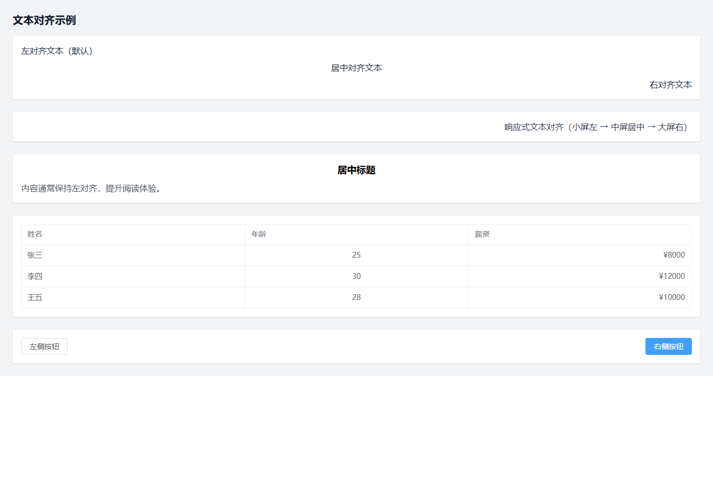

------

### 字体间距 / 行高（tracking / leading）

**功能说明**：使用 TailwindCSS 控制字间距（tracking）和行高（leading），用于优化排版密度和可读性，适用于标题、正文、卡片描述等场景。

```vue
<template>
  <div class="p-6 bg-gray-100 space-y-6">
    <!-- p-6: 内边距 1.5rem -->
    <!-- bg-gray-100: 浅灰背景 -->
    <!-- space-y-6: 子元素垂直间距 1.5rem -->

    <h2 class="text-xl font-bold text-gray-900 mb-4 tracking-wide">
      <!-- text-xl: 字体大小 1.25rem -->
      <!-- font-bold: 加粗 -->
      <!-- text-gray-900: 深灰色 -->
      <!-- mb-4: 下边距 1rem -->
      <!-- tracking-wide: 字间距略宽 -->
      字体间距与行高示例
    </h2>

    <!-- 字间距示例 -->
    <div class="bg-white p-4 rounded shadow space-y-2">
      <!-- bg-white: 白色背景 -->
      <!-- p-4: 内边距 -->
      <!-- rounded: 圆角 -->
      <!-- shadow: 阴影 -->
      <!-- space-y-2: 子元素垂直间距 0.5rem -->

      <p class="tracking-tight text-gray-800">
        <!-- tracking-tight: 字间距紧凑 -->
        <!-- text-gray-800: 灰色文字 -->
        紧凑字间距（tracking-tight）
      </p>

      <p class="tracking-normal text-gray-800">
        <!-- tracking-normal: 默认字间距 -->
        <!-- text-gray-800: 灰色文字 -->
        默认字间距（tracking-normal）
      </p>

      <p class="tracking-wide text-gray-800">
        <!-- tracking-wide: 字间距稍宽 -->
        <!-- text-gray-800: 灰色文字 -->
        宽字间距（tracking-wide）
      </p>

      <p class="tracking-widest text-gray-800">
        <!-- tracking-widest: 字间距最大 -->
        <!-- text-gray-800: 灰色文字 -->
        最大字间距（tracking-widest）
      </p>
    </div>

    <!-- 行高示例 -->
    <div class="bg-white p-4 rounded shadow space-y-4">
      <!-- bg-white: 白色背景 -->
      <!-- p-4: 内边距 -->
      <!-- rounded: 圆角 -->
      <!-- shadow: 阴影 -->
      <!-- space-y-4: 子元素垂直间距 1rem -->

      <p class="leading-none text-gray-700">
        <!-- leading-none: 行高 1（紧凑） -->
        <!-- text-gray-700: 灰色文字 -->
        行高 very tight。多行文本显示会非常紧凑，适合标题但不适合正文。
      </p>

      <p class="leading-snug text-gray-700">
        <!-- leading-snug: 行高略紧 -->
        <!-- text-gray-700: 灰色文字 -->
        行高 snug。比默认更紧凑一点，适合副标题。
      </p>

      <p class="leading-normal text-gray-700">
        <!-- leading-normal: 默认行高 -->
        <!-- text-gray-700: 灰色文字 -->
        默认行高 normal。适用于大多数正文场景。
      </p>

      <p class="leading-relaxed text-gray-700">
        <!-- leading-relaxed: 行高较大 -->
        <!-- text-gray-700: 灰色文字 -->
        行高 relaxed。阅读体验更舒适，适合长文本内容。
      </p>

      <p class="leading-loose text-gray-700">
        <!-- leading-loose: 行高最大 -->
        <!-- text-gray-700: 灰色文字 -->
        行高 loose。适用于展示型内容或强调间距。
      </p>
    </div>

    <!-- 组合示例（标题 + 正文） -->
    <div class="bg-white p-4 rounded shadow">
      <!-- bg-white: 白色背景 -->
      <!-- p-4: 内边距 -->
      <!-- rounded: 圆角 -->
      <!-- shadow: 阴影 -->

      <h3 class="text-lg font-semibold tracking-wide mb-2 text-gray-900">
        <!-- text-lg: 字体大小 1.125rem -->
        <!-- font-semibold: 半粗体 -->
        <!-- tracking-wide: 字间距略宽 -->
        <!-- mb-2: 下边距 0.5rem -->
        <!-- text-gray-900: 深灰色 -->
        卡片标题（推荐：稍大字间距）
      </h3>

      <p class="text-gray-600 leading-relaxed tracking-normal">
        <!-- text-gray-600: 灰色文字 -->
        <!-- leading-relaxed: 行高较大，提高可读性 -->
        <!-- tracking-normal: 默认字间距 -->
        正文内容建议使用较大的行高（leading-relaxed）来提升阅读体验，
        同时保持默认字间距，使排版更加自然舒适。
      </p>
    </div>

    <!-- 响应式排版 -->
    <p class="text-gray-800 tracking-tight md:tracking-wide leading-normal md:leading-relaxed">
      <!-- text-gray-800: 灰色文字 -->
      <!-- tracking-tight: 小屏紧凑 -->
      <!-- md:tracking-wide: ≥768px 字间距变宽 -->
      <!-- leading-normal: 默认行高 -->
      <!-- md:leading-relaxed: ≥768px 行高变大 -->
      响应式排版：小屏紧凑，大屏舒适阅读。
    </p>
  </div>
</template>

<script lang="ts" setup>
// 示例无需逻辑
</script>

<style lang="scss" scoped>
// Tailwind 4.x 已内置 tracking / leading 工具类
</style>
```

✅ 特点：

- `tracking-*`：控制字间距（tight / normal / wide / widest）
- `leading-*`：控制行高（none / snug / normal / relaxed / loose）
- 组合使用提升排版质量（标题 vs 正文）
- 响应式排版：`md:tracking-wide md:leading-relaxed`

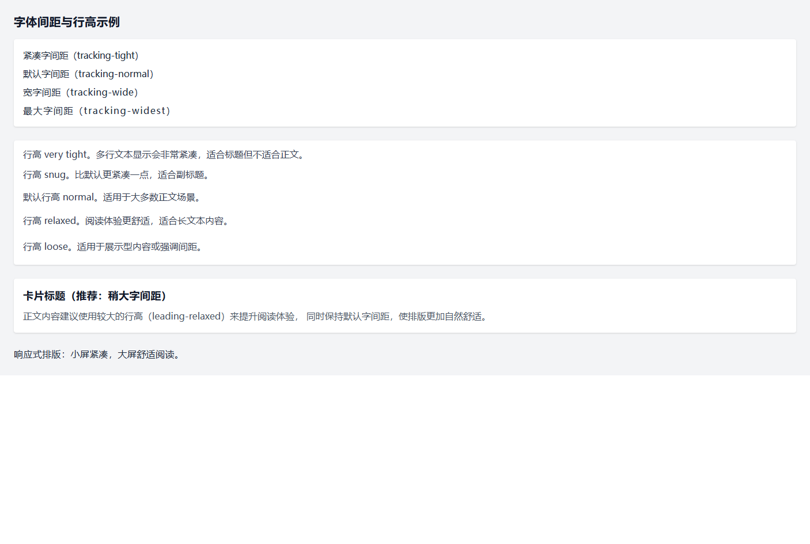

------

## 三、背景与边框

### 背景颜色 / 渐变

**功能说明**：使用 TailwindCSS 控制背景颜色和渐变效果，适用于页面背景、卡片、按钮、Banner 等 UI 场景，提升视觉层次。

```vue
<template>
  <div class="p-6 bg-gray-100 space-y-6">
    <!-- p-6: 内边距 1.5rem -->
    <!-- bg-gray-100: 浅灰背景 -->
    <!-- space-y-6: 子元素垂直间距 1.5rem -->

    <h2 class="text-xl font-bold text-gray-900 mb-4">
      <!-- text-xl: 字体大小 1.25rem -->
      <!-- font-bold: 加粗 -->
      <!-- text-gray-900: 深灰色 -->
      <!-- mb-4: 下边距 1rem -->
      背景颜色与渐变示例
    </h2>

    <!-- 基础背景颜色 -->
    <div class="bg-blue-500 text-white p-4 rounded shadow">
      <!-- bg-blue-500: 蓝色背景 -->
      <!-- text-white: 白色文字 -->
      <!-- p-4: 内边距 -->
      <!-- rounded: 圆角 -->
      <!-- shadow: 阴影 -->
      基础背景色
    </div>

    <!-- 多种背景色 -->
    <div class="grid grid-cols-2 md:grid-cols-4 gap-4">
      <!-- grid: 网格布局 -->
      <!-- grid-cols-2: 默认 2 列 -->
      <!-- md:grid-cols-4: ≥768px 4 列 -->
      <!-- gap-4: 间距 1rem -->

      <div class="bg-red-500 text-white p-4 rounded text-center">
        <!-- bg-red-500: 红色背景 -->
        <!-- text-white: 白色文字 -->
        <!-- p-4: 内边距 -->
        <!-- rounded: 圆角 -->
        <!-- text-center: 文本居中 -->
        Red
      </div>

      <div class="bg-green-500 text-white p-4 rounded text-center">
        <!-- bg-green-500: 绿色背景 -->
        <!-- text-white: 白色文字 -->
        <!-- p-4: 内边距 -->
        <!-- rounded: 圆角 -->
        <!-- text-center: 居中 -->
        Green
      </div>

      <div class="bg-yellow-400 text-black p-4 rounded text-center">
        <!-- bg-yellow-400: 黄色背景 -->
        <!-- text-black: 黑色文字 -->
        <!-- p-4: 内边距 -->
        <!-- rounded: 圆角 -->
        <!-- text-center: 居中 -->
        Yellow
      </div>

      <div class="bg-purple-500 text-white p-4 rounded text-center">
        <!-- bg-purple-500: 紫色背景 -->
        <!-- text-white: 白色文字 -->
        <!-- p-4: 内边距 -->
        <!-- rounded: 圆角 -->
        <!-- text-center: 居中 -->
        Purple
      </div>
    </div>

    <!-- 渐变背景 -->
    <div class="bg-gradient-to-r from-blue-500 via-purple-500 to-pink-500 text-white p-6 rounded shadow">
      <!-- bg-gradient-to-r: 从左到右渐变 -->
      <!-- from-blue-500: 起始颜色 -->
      <!-- via-purple-500: 中间过渡颜色 -->
      <!-- to-pink-500: 结束颜色 -->
      <!-- text-white: 白色文字 -->
      <!-- p-6: 内边距 -->
      <!-- rounded: 圆角 -->
      <!-- shadow: 阴影 -->
      渐变背景（横向）
    </div>

    <!-- 渐变方向示例 -->
    <div class="grid grid-cols-1 md:grid-cols-2 gap-4">
      <!-- grid: 网格布局 -->
      <!-- grid-cols-1: 默认 1 列 -->
      <!-- md:grid-cols-2: ≥768px 2 列 -->
      <!-- gap-4: 间距 -->

      <div class="bg-gradient-to-b from-green-400 to-blue-500 text-white p-4 rounded">
        <!-- bg-gradient-to-b: 从上到下渐变 -->
        <!-- from-green-400: 起始颜色 -->
        <!-- to-blue-500: 结束颜色 -->
        <!-- text-white: 白色文字 -->
        <!-- p-4: 内边距 -->
        <!-- rounded: 圆角 -->
        垂直渐变
      </div>

      <div class="bg-gradient-to-tr from-orange-400 to-red-500 text-white p-4 rounded">
        <!-- bg-gradient-to-tr: 左下 → 右上 渐变 -->
        <!-- from-orange-400: 起始颜色 -->
        <!-- to-red-500: 结束颜色 -->
        <!-- text-white: 白色文字 -->
        <!-- p-4: 内边距 -->
        <!-- rounded: 圆角 -->
        对角线渐变
      </div>
    </div>

    <!-- Hover 渐变按钮 -->
    <div>
      <button
        class="bg-gradient-to-r from-indigo-500 to-blue-500 hover:from-blue-500 hover:to-indigo-500 text-white px-6 py-2 rounded transition-all"
      >
        <!-- bg-gradient-to-r: 横向渐变 -->
        <!-- from-indigo-500: 起始颜色 -->
        <!-- to-blue-500: 结束颜色 -->
        <!-- hover:from-blue-500: hover 起始色变化 -->
        <!-- hover:to-indigo-500: hover 结束色变化 -->
        <!-- text-white: 白色文字 -->
        <!-- px-6: 左右内边距 1.5rem -->
        <!-- py-2: 上下内边距 0.5rem -->
        <!-- rounded: 圆角 -->
        <!-- transition-all: 所有属性过渡动画 -->
        渐变按钮
      </button>
    </div>

    <!-- 响应式背景 -->
    <div class="p-6 rounded text-white bg-blue-500 md:bg-green-500 lg:bg-purple-500">
      <!-- p-6: 内边距 -->
      <!-- rounded: 圆角 -->
      <!-- text-white: 白色文字 -->
      <!-- bg-blue-500: 默认蓝色 -->
      <!-- md:bg-green-500: ≥768px 绿色 -->
      <!-- lg:bg-purple-500: ≥1024px 紫色 -->
      响应式背景颜色
    </div>
  </div>
</template>

<script lang="ts" setup>
// 示例无需逻辑
</script>

<style lang="scss" scoped>
// Tailwind 4.x 已内置渐变工具类，无需额外配置
</style>
```

✅ 特点：

- `bg-{color}`：背景颜色
- `bg-gradient-to-*`：渐变方向（r / b / tr 等）
- `from / via / to`：渐变颜色控制
- 支持 hover 渐变动画
- 响应式背景：`md:bg-* lg:bg-*`

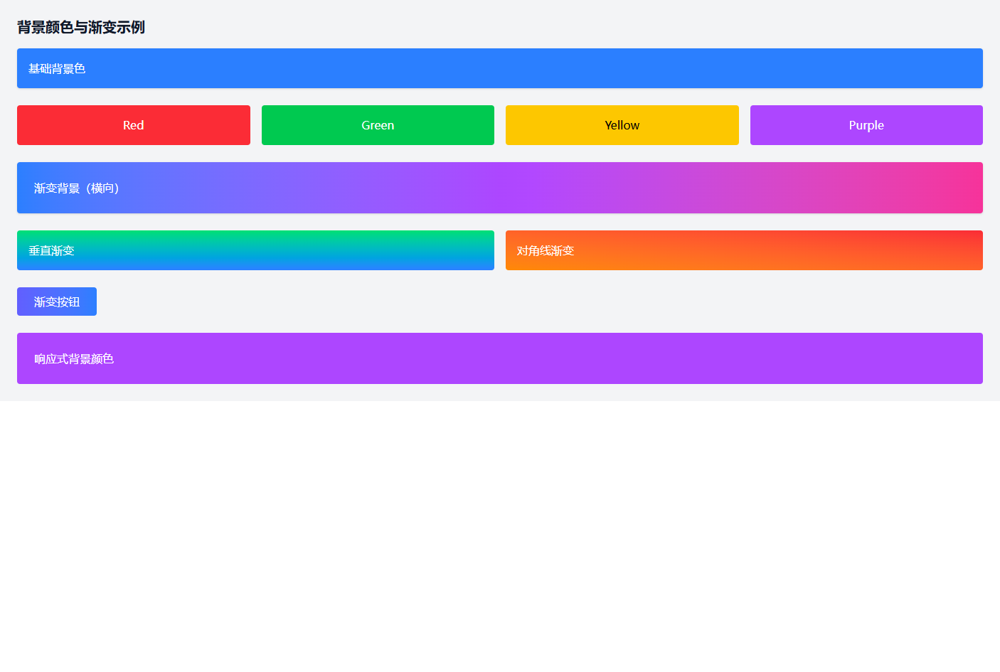

------

### 圆角（不同级别）

**功能说明**：使用 TailwindCSS 控制元素圆角大小，支持不同等级、单边圆角、响应式控制，常用于卡片、按钮、图片等 UI 场景。

```vue
<template>
  <div class="p-6 bg-gray-100 space-y-6">
    <!-- p-6: 内边距 1.5rem -->
    <!-- bg-gray-100: 浅灰背景 -->
    <!-- space-y-6: 子元素垂直间距 1.5rem -->

    <h2 class="text-xl font-bold text-gray-900 mb-4">
      <!-- text-xl: 字体大小 1.25rem -->
      <!-- font-bold: 加粗 -->
      <!-- text-gray-900: 深灰色 -->
      <!-- mb-4: 下边距 1rem -->
      圆角示例
    </h2>

    <!-- 不同级别圆角 -->
    <div class="grid grid-cols-2 md:grid-cols-4 gap-4">
      <!-- grid: 网格布局 -->
      <!-- grid-cols-2: 默认 2 列 -->
      <!-- md:grid-cols-4: ≥768px 4 列 -->
      <!-- gap-4: 间距 1rem -->

      <div class="bg-blue-200 p-4 rounded-none text-center">
        <!-- bg-blue-200: 浅蓝背景 -->
        <!-- p-4: 内边距 -->
        <!-- rounded-none: 无圆角 -->
        <!-- text-center: 文本居中 -->
        none
      </div>

      <div class="bg-blue-300 p-4 rounded-sm text-center">
        <!-- bg-blue-300: 蓝色背景 -->
        <!-- p-4: 内边距 -->
        <!-- rounded-sm: 小圆角 -->
        <!-- text-center: 文本居中 -->
        sm
      </div>

      <div class="bg-blue-400 p-4 rounded text-center">
        <!-- bg-blue-400: 深一点蓝 -->
        <!-- p-4: 内边距 -->
        <!-- rounded: 默认圆角 -->
        <!-- text-center: 文本居中 -->
        default
      </div>

      <div class="bg-blue-500 text-white p-4 rounded-md text-center">
        <!-- bg-blue-500: 蓝色背景 -->
        <!-- text-white: 白色文字 -->
        <!-- p-4: 内边距 -->
        <!-- rounded-md: 中等圆角 -->
        <!-- text-center: 文本居中 -->
        md
      </div>

      <div class="bg-blue-600 text-white p-4 rounded-lg text-center">
        <!-- bg-blue-600: 深蓝 -->
        <!-- text-white: 白色文字 -->
        <!-- p-4: 内边距 -->
        <!-- rounded-lg: 大圆角 -->
        <!-- text-center: 文本居中 -->
        lg
      </div>

      <div class="bg-blue-700 text-white p-4 rounded-xl text-center">
        <!-- bg-blue-700: 更深蓝 -->
        <!-- text-white: 白色文字 -->
        <!-- p-4: 内边距 -->
        <!-- rounded-xl: 更大圆角 -->
        <!-- text-center: 文本居中 -->
        xl
      </div>

      <div class="bg-blue-800 text-white p-4 rounded-2xl text-center">
        <!-- bg-blue-800: 深蓝 -->
        <!-- text-white: 白色文字 -->
        <!-- p-4: 内边距 -->
        <!-- rounded-2xl: 超大圆角 -->
        <!-- text-center: 文本居中 -->
        2xl
      </div>

      <div class="bg-blue-900 text-white p-4 rounded-full text-center">
        <!-- bg-blue-900: 深蓝 -->
        <!-- text-white: 白色文字 -->
        <!-- p-4: 内边距 -->
        <!-- rounded-full: 完全圆形（适合头像/按钮） -->
        <!-- text-center: 文本居中 -->
        full
      </div>
    </div>

    <!-- 单边圆角 -->
    <div class="grid grid-cols-2 md:grid-cols-4 gap-4">
      <!-- grid: 网格 -->
      <!-- gap-4: 间距 -->

      <div class="bg-green-300 p-4 rounded-t-lg text-center">
        <!-- bg-green-300: 绿色背景 -->
        <!-- p-4: 内边距 -->
        <!-- rounded-t-lg: 上边圆角 -->
        <!-- text-center: 居中 -->
        上圆角
      </div>

      <div class="bg-green-400 p-4 rounded-b-lg text-center">
        <!-- bg-green-400: 绿色 -->
        <!-- p-4: 内边距 -->
        <!-- rounded-b-lg: 下边圆角 -->
        <!-- text-center -->
        下圆角
      </div>

      <div class="bg-green-500 p-4 text-white rounded-l-lg text-center">
        <!-- bg-green-500: 深绿 -->
        <!-- text-white: 白字 -->
        <!-- p-4 -->
        <!-- rounded-l-lg: 左边圆角 -->
        <!-- text-center -->
        左圆角
      </div>

      <div class="bg-green-600 p-4 text-white rounded-r-lg text-center">
        <!-- bg-green-600: 深绿 -->
        <!-- text-white -->
        <!-- p-4 -->
        <!-- rounded-r-lg: 右边圆角 -->
        <!-- text-center -->
        右圆角
      </div>
    </div>

    <!-- 卡片实战 -->
    <div class="bg-white p-4 rounded-xl shadow">
      <!-- bg-white: 白色背景 -->
      <!-- p-4: 内边距 -->
      <!-- rounded-xl: 常用卡片圆角（推荐） -->
      <!-- shadow: 阴影 -->
      <h3 class="text-lg font-semibold mb-2">
        <!-- text-lg: 字体 -->
        <!-- font-semibold: 半粗 -->
        <!-- mb-2: 下边距 -->
        卡片标题
      </h3>
      <p class="text-gray-600">
        <!-- text-gray-600: 灰色文字 -->
        实际项目中推荐使用 rounded-lg 或 rounded-xl，视觉更现代。
      </p>
    </div>

    <!-- 响应式圆角 -->
    <div class="bg-purple-400 text-white p-4 rounded-sm md:rounded-lg lg:rounded-2xl text-center">
      <!-- bg-purple-400: 紫色 -->
      <!-- text-white -->
      <!-- p-4 -->
      <!-- rounded-sm: 默认小圆角 -->
      <!-- md:rounded-lg: ≥768px 大圆角 -->
      <!-- lg:rounded-2xl: ≥1024px 超大圆角 -->
      <!-- text-center -->
      响应式圆角
    </div>
  </div>
</template>

<script lang="ts" setup>
// 示例无需逻辑
</script>

<style lang="scss" scoped>
// Tailwind 4.x 圆角工具类已内置
</style>
```

✅ 特点：

- `rounded-*`：多级圆角（sm / md / lg / xl / 2xl / full）
- 单边控制：`rounded-t-*` / `rounded-b-*` / `rounded-l-*` / `rounded-r-*`
- 响应式：`md:rounded-lg`
- 推荐：卡片用 `rounded-lg / rounded-xl`，头像用 `rounded-full`

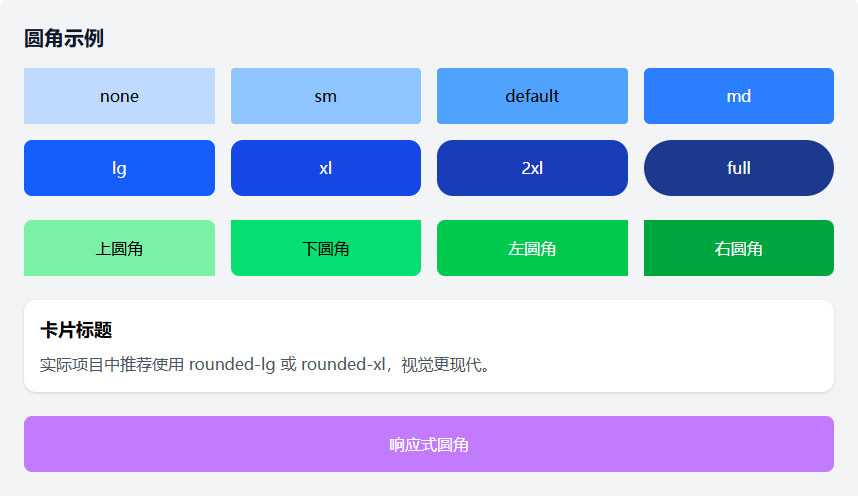

------

### 边框（虚线 / 实线 / 分割线）

**功能说明**：使用 TailwindCSS 控制边框样式（实线 / 虚线 / 分割线），支持方向、粗细、颜色、响应式，适用于卡片、表单、列表、表格等场景。

```vue
<template>
  <div class="p-6 bg-gray-100 space-y-6">
    <!-- p-6: 内边距 1.5rem -->
    <!-- bg-gray-100: 浅灰背景 -->
    <!-- space-y-6: 子元素垂直间距 1.5rem -->

    <h2 class="text-xl font-bold text-gray-900 mb-4">
      <!-- text-xl: 字体大小 1.25rem -->
      <!-- font-bold: 加粗 -->
      <!-- text-gray-900: 深灰色 -->
      <!-- mb-4: 下边距 1rem -->
      边框示例
    </h2>

    <!-- 基础边框（实线） -->
    <div class="bg-white p-4 border border-gray-300 rounded">
      <!-- bg-white: 白色背景 -->
      <!-- p-4: 内边距 -->
      <!-- border: 1px 实线边框 -->
      <!-- border-gray-300: 灰色边框 -->
      <!-- rounded: 圆角 -->
      默认实线边框
    </div>

    <!-- 边框粗细 -->
    <div class="grid grid-cols-3 gap-4">
      <!-- grid: 网格布局 -->
      <!-- grid-cols-3: 3列 -->
      <!-- gap-4: 间距 1rem -->

      <div class="border border-gray-400 p-4 text-center">
        <!-- border: 1px 边框 -->
        <!-- border-gray-400: 灰色 -->
        <!-- p-4: 内边距 -->
        <!-- text-center: 居中 -->
        1px
      </div>

      <div class="border-2 border-gray-400 p-4 text-center">
        <!-- border-2: 2px 边框 -->
        <!-- border-gray-400 -->
        <!-- p-4 -->
        <!-- text-center -->
        2px
      </div>

      <div class="border-4 border-gray-400 p-4 text-center">
        <!-- border-4: 4px 边框 -->
        <!-- border-gray-400 -->
        <!-- p-4 -->
        <!-- text-center -->
        4px
      </div>
    </div>

    <!-- 虚线 / 点线 -->
    <div class="grid grid-cols-2 gap-4">
      <!-- grid -->
      <!-- grid-cols-2 -->
      <!-- gap-4 -->

      <div class="border-2 border-dashed border-blue-400 p-4 text-center">
        <!-- border-2: 边框宽度 -->
        <!-- border-dashed: 虚线 -->
        <!-- border-blue-400: 蓝色 -->
        <!-- p-4 -->
        <!-- text-center -->
        虚线边框
      </div>

      <div class="border-2 border-dotted border-red-400 p-4 text-center">
        <!-- border-2 -->
        <!-- border-dotted: 点线 -->
        <!-- border-red-400 -->
        <!-- p-4 -->
        <!-- text-center -->
        点线边框
      </div>
    </div>

    <!-- 单边边框 -->
    <div class="bg-white p-4 space-y-2">
      <!-- bg-white -->
      <!-- p-4 -->
      <!-- space-y-2 -->

      <div class="border-b border-gray-300 pb-2">
        <!-- border-b: 下边框 -->
        <!-- border-gray-300 -->
        <!-- pb-2: 下内边距 -->
        下边框（常用于分割）
      </div>

      <div class="border-l-4 border-blue-500 pl-2">
        <!-- border-l-4: 左边框 4px -->
        <!-- border-blue-500 -->
        <!-- pl-2: 左内边距 -->
        左侧强调边框
      </div>

      <div class="border-t border-gray-300 pt-2">
        <!-- border-t: 上边框 -->
        <!-- border-gray-300 -->
        <!-- pt-2 -->
        上边框
      </div>
    </div>

    <!-- 分割线（Divide） -->
    <div class="bg-white p-4 divide-y divide-gray-300">
      <!-- bg-white -->
      <!-- p-4 -->
      <!-- divide-y: 子元素之间添加纵向分割线 -->
      <!-- divide-gray-300: 分割线颜色 -->

      <div class="py-2">
        <!-- py-2: 上下内边距 -->
        列表项 1
      </div>

      <div class="py-2">
        <!-- py-2 -->
        列表项 2
      </div>

      <div class="py-2">
        <!-- py-2 -->
        列表项 3
      </div>
    </div>

    <!-- 横向分割 -->
    <div class="flex divide-x divide-gray-300 bg-white p-4">
      <!-- flex: 水平布局 -->
      <!-- divide-x: 横向分割线 -->
      <!-- divide-gray-300 -->
      <!-- bg-white -->
      <!-- p-4 -->

      <div class="px-4">
        <!-- px-4 -->
        左
      </div>

      <div class="px-4">
        <!-- px-4 -->
        中
      </div>

      <div class="px-4">
        <!-- px-4 -->
        右
      </div>
    </div>

    <!-- 表格边框（ElementPlus） -->
    <div class="bg-white p-4 rounded shadow">
      <!-- bg-white -->
      <!-- p-4 -->
      <!-- rounded -->
      <!-- shadow -->
      <el-table :data="tableData" border class="w-full">
        <!-- border: ElementPlus 自带表格边框 -->
        <!-- w-full: 宽度100% -->
        <el-table-column prop="name" label="姓名" />
        <el-table-column prop="age" label="年龄" />
      </el-table>
    </div>

    <!-- 响应式边框 -->
    <div class="p-4 border border-gray-300 md:border-2 lg:border-4">
      <!-- p-4 -->
      <!-- border: 默认 1px -->
      <!-- border-gray-300 -->
      <!-- md:border-2: ≥768px 2px -->
      <!-- lg:border-4: ≥1024px 4px -->
      响应式边框
    </div>
  </div>
</template>

<script lang="ts" setup>
import { reactive } from 'vue'

const tableData = reactive([
  { name: '张三', age: 25 },
  { name: '李四', age: 30 }
])
</script>

<style lang="scss" scoped>
// Tailwind 4.x 边框工具类已内置
</style>
```

✅ 特点：

- `border / border-2 / border-4`：控制边框粗细
- `border-dashed / border-dotted`：虚线 / 点线
- 单边控制：`border-t / border-b / border-l / border-r`
- 分割线：`divide-y / divide-x`（列表神器）
- 响应式边框：`md:border-2 lg:border-4`

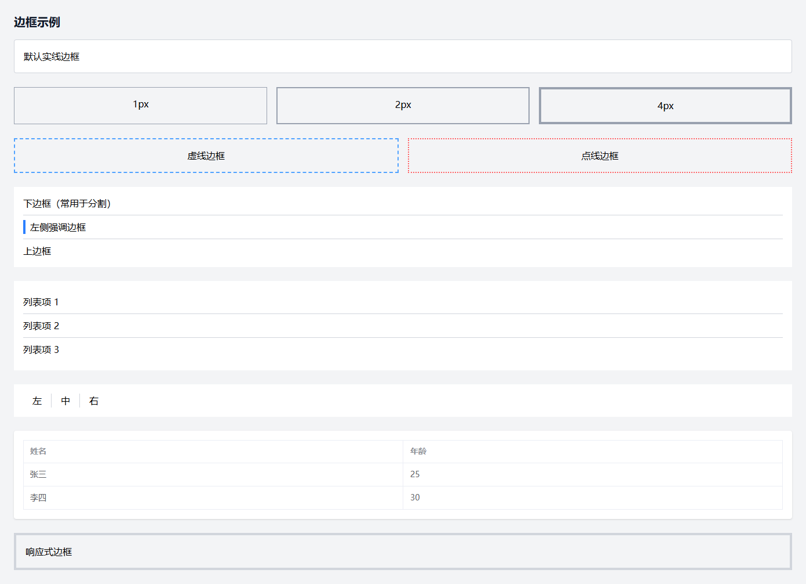

------

### 阴影（卡片阴影 / hover 阴影）

**功能说明**：使用 TailwindCSS 控制阴影效果（卡片阴影 / hover 动效），提升 UI 层次感和交互体验。适用于卡片、按钮、浮层等场景。

```vue
<template>
  <div class="p-6 bg-gray-100 space-y-6">
    <!-- p-6: 内边距 1.5rem -->
    <!-- bg-gray-100: 浅灰背景 -->
    <!-- space-y-6: 子元素垂直间距 1.5rem -->

    <h2 class="text-xl font-bold text-gray-900 mb-4">
      <!-- text-xl: 字体大小 1.25rem -->
      <!-- font-bold: 加粗 -->
      <!-- text-gray-900: 深灰色 -->
      <!-- mb-4: 下边距 1rem -->
      阴影示例
    </h2>

    <!-- 基础阴影级别 -->
    <div class="grid grid-cols-2 md:grid-cols-4 gap-4">
      <!-- grid: 网格布局 -->
      <!-- grid-cols-2: 默认 2 列 -->
      <!-- md:grid-cols-4: ≥768px 4 列 -->
      <!-- gap-4: 间距 1rem -->

      <div class="bg-white p-4 rounded shadow-sm text-center">
        <!-- bg-white: 白色背景 -->
        <!-- p-4: 内边距 -->
        <!-- rounded: 圆角 -->
        <!-- shadow-sm: 小阴影 -->
        <!-- text-center: 居中 -->
        sm
      </div>

      <div class="bg-white p-4 rounded shadow text-center">
        <!-- shadow: 默认阴影 -->
        default
      </div>

      <div class="bg-white p-4 rounded shadow-md text-center">
        <!-- shadow-md: 中等阴影 -->
        md
      </div>

      <div class="bg-white p-4 rounded shadow-lg text-center">
        <!-- shadow-lg: 大阴影 -->
        lg
      </div>

      <div class="bg-white p-4 rounded shadow-xl text-center">
        <!-- shadow-xl: 超大阴影 -->
        xl
      </div>

      <div class="bg-white p-4 rounded shadow-2xl text-center">
        <!-- shadow-2xl: 最大阴影 -->
        2xl
      </div>

      <div class="bg-white p-4 rounded shadow-inner text-center">
        <!-- shadow-inner: 内阴影 -->
        inner
      </div>

      <div class="bg-white p-4 rounded shadow-none text-center">
        <!-- shadow-none: 无阴影 -->
        none
      </div>
    </div>

    <!-- Hover 阴影（卡片动效） -->
    <div class="grid grid-cols-1 md:grid-cols-3 gap-4">
      <!-- grid -->
      <!-- grid-cols-1 -->
      <!-- md:grid-cols-3 -->
      <!-- gap-4 -->

      <div class="bg-white p-4 rounded shadow hover:shadow-lg transition-shadow">
        <!-- bg-white -->
        <!-- p-4 -->
        <!-- rounded -->
        <!-- shadow: 默认阴影 -->
        <!-- hover:shadow-lg: hover 时变大阴影 -->
        <!-- transition-shadow: 阴影变化动画 -->
        Hover 提升阴影
      </div>

      <div class="bg-white p-4 rounded shadow-md hover:shadow-xl transition-all duration-300">
        <!-- shadow-md: 初始中等阴影 -->
        <!-- hover:shadow-xl: hover 更强 -->
        <!-- transition-all: 所有属性动画 -->
        <!-- duration-300: 动画 300ms -->
        Hover 强化阴影
      </div>

      <div class="bg-white p-4 rounded shadow-lg hover:shadow-2xl transition-shadow duration-200">
        <!-- shadow-lg -->
        <!-- hover:shadow-2xl -->
        <!-- transition-shadow -->
        <!-- duration-200 -->
        Hover 极强阴影
      </div>
    </div>

    <!-- 按钮阴影 -->
    <div class="flex space-x-4">
      <!-- flex: 水平布局 -->
      <!-- space-x-4: 子元素间距 1rem -->

      <button class="bg-blue-500 text-white px-4 py-2 rounded shadow hover:shadow-md transition-shadow">
        <!-- bg-blue-500: 蓝色背景 -->
        <!-- text-white: 白色文字 -->
        <!-- px-4: 左右内边距 -->
        <!-- py-2: 上下内边距 -->
        <!-- rounded: 圆角 -->
        <!-- shadow: 默认阴影 -->
        <!-- hover:shadow-md: hover 增强 -->
        <!-- transition-shadow -->
        默认按钮
      </button>

      <button class="bg-green-500 text-white px-4 py-2 rounded shadow-md hover:shadow-lg transition-all">
        <!-- shadow-md -->
        <!-- hover:shadow-lg -->
        <!-- transition-all -->
        强阴影按钮
      </button>
    </div>

    <!-- 卡片 + 渐变 + 阴影（实战） -->
    <div class="bg-gradient-to-r from-blue-500 to-purple-500 text-white p-6 rounded-xl shadow-lg hover:shadow-2xl transition-all duration-300">
      <!-- bg-gradient-to-r: 横向渐变 -->
      <!-- from-blue-500: 起始颜色 -->
      <!-- to-purple-500: 结束颜色 -->
      <!-- text-white -->
      <!-- p-6 -->
      <!-- rounded-xl -->
      <!-- shadow-lg: 初始阴影 -->
      <!-- hover:shadow-2xl: hover 更强 -->
      <!-- transition-all -->
      <!-- duration-300 -->
      高级卡片效果（渐变 + 阴影）
    </div>

    <!-- 响应式阴影 -->
    <div class="bg-white p-4 rounded shadow-sm md:shadow-lg lg:shadow-2xl">
      <!-- bg-white -->
      <!-- p-4 -->
      <!-- rounded -->
      <!-- shadow-sm: 默认小阴影 -->
      <!-- md:shadow-lg: ≥768px 大阴影 -->
      <!-- lg:shadow-2xl: ≥1024px 最大阴影 -->
      响应式阴影
    </div>
  </div>
</template>

<script lang="ts" setup>
// 示例无需逻辑
</script>

<style lang="scss" scoped>
// Tailwind 4.x 阴影工具类已内置
</style>
```

✅ 特点：

- `shadow-*`：控制阴影强度（sm → 2xl）
- `shadow-inner`：内阴影
- `hover:shadow-*`：交互增强
- `transition-shadow / transition-all`：平滑动画
- 推荐组合：`shadow + hover:shadow-lg`（最常用卡片效果）

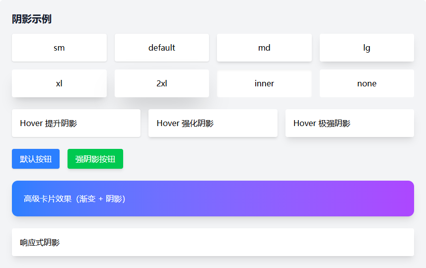

------

## 四、按钮与交互

### 按钮（主按钮 / 次按钮 / 禁用 / 加载）

**功能说明**：基于 ElementPlus 按钮组件，结合 TailwindCSS 做样式增强，实现主按钮 / 次按钮 / 禁用 / 加载等常见状态。

```vue
<template>
  <div class="p-6 bg-gray-100 space-y-6">
    <!-- p-6: 内边距 1.5rem -->
    <!-- bg-gray-100: 浅灰背景 -->
    <!-- space-y-6: 子元素垂直间距 1.5rem -->

    <h2 class="text-xl font-bold text-gray-900 mb-4">
      <!-- text-xl: 字体大小 1.25rem -->
      <!-- font-bold: 加粗 -->
      <!-- text-gray-900: 深灰色 -->
      <!-- mb-4: 下边距 1rem -->
      按钮示例
    </h2>

    <!-- 主按钮 / 次按钮 -->
    <div class="flex space-x-4">
      <!-- flex: 水平布局 -->
      <!-- space-x-4: 子元素间距 1rem -->

      <el-button
        type="primary"
        class="px-6 py-2 rounded-lg shadow hover:shadow-lg transition-all duration-200"
      >
        <!-- px-6: 左右内边距 1.5rem -->
        <!-- py-2: 上下内边距 0.5rem -->
        <!-- rounded-lg: 大圆角 -->
        <!-- shadow: 默认阴影 -->
        <!-- hover:shadow-lg: hover 阴影增强 -->
        <!-- transition-all: 所有属性动画 -->
        <!-- duration-200: 动画时长 200ms -->
        主按钮
      </el-button>

      <el-button
        type="default"
        class="px-6 py-2 rounded-lg border border-gray-300 hover:bg-gray-50 transition-colors"
      >
        <!-- px-6 -->
        <!-- py-2 -->
        <!-- rounded-lg -->
        <!-- border: 1px 边框 -->
        <!-- border-gray-300: 灰色边框 -->
        <!-- hover:bg-gray-50: hover 浅灰背景 -->
        <!-- transition-colors: 颜色过渡 -->
        次按钮
      </el-button>
    </div>

    <!-- 禁用按钮 -->
    <div class="flex space-x-4">
      <!-- flex -->
      <!-- space-x-4 -->

      <el-button
        type="primary"
        disabled
        class="px-6 py-2 rounded-lg opacity-50 cursor-not-allowed"
      >
        <!-- px-6 -->
        <!-- py-2 -->
        <!-- rounded-lg -->
        <!-- opacity-50: 半透明 -->
        <!-- cursor-not-allowed: 禁用鼠标样式 -->
        禁用主按钮
      </el-button>

      <el-button
        disabled
        class="px-6 py-2 rounded-lg border border-gray-300 opacity-50 cursor-not-allowed"
      >
        <!-- border -->
        <!-- border-gray-300 -->
        <!-- opacity-50 -->
        <!-- cursor-not-allowed -->
        禁用次按钮
      </el-button>
    </div>

    <!-- 加载按钮 -->
    <div class="flex space-x-4">
      <!-- flex -->
      <!-- space-x-4 -->

      <el-button
        type="primary"
        :loading="loading"
        class="px-6 py-2 rounded-lg shadow"
        @click="handleClick"
      >
        <!-- :loading: ElementPlus 加载状态 -->
        <!-- px-6 -->
        <!-- py-2 -->
        <!-- rounded-lg -->
        <!-- shadow -->
        提交中
      </el-button>

      <el-button
        type="success"
        :loading="loading"
        class="px-6 py-2 rounded-lg shadow-md hover:shadow-lg transition-all"
      >
        <!-- type="success": 绿色按钮 -->
        <!-- shadow-md -->
        <!-- hover:shadow-lg -->
        <!-- transition-all -->
        加载按钮
      </el-button>
    </div>

    <!-- 按钮组 -->
    <div class="flex">
      <!-- flex: 水平排列 -->

      <el-button
        type="primary"
        class="rounded-l-lg rounded-r-none"
      >
        <!-- rounded-l-lg: 左侧圆角 -->
        <!-- rounded-r-none: 右侧无圆角 -->
        左
      </el-button>

      <el-button
        type="primary"
        class="rounded-none border-l border-white"
      >
        <!-- rounded-none: 无圆角 -->
        <!-- border-l: 左边框 -->
        <!-- border-white: 白色边框（分割） -->
        中
      </el-button>

      <el-button
        type="primary"
        class="rounded-r-lg rounded-l-none"
      >
        <!-- rounded-r-lg: 右侧圆角 -->
        <!-- rounded-l-none: 左侧无圆角 -->
        右
      </el-button>
    </div>

    <!-- 渐变按钮（增强UI） -->
    <button
      class="bg-gradient-to-r from-blue-500 to-purple-500 hover:from-purple-500 hover:to-blue-500 text-white px-6 py-2 rounded-lg shadow hover:shadow-lg transition-all duration-300"
    >
      <!-- bg-gradient-to-r: 横向渐变 -->
      <!-- from-blue-500: 起始色 -->
      <!-- to-purple-500: 结束色 -->
      <!-- hover:from-purple-500: hover 起始色 -->
      <!-- hover:to-blue-500: hover 结束色 -->
      <!-- text-white -->
      <!-- px-6 -->
      <!-- py-2 -->
      <!-- rounded-lg -->
      <!-- shadow -->
      <!-- hover:shadow-lg -->
      <!-- transition-all -->
      <!-- duration-300 -->
      渐变按钮
    </button>
  </div>
</template>

<script lang="ts" setup>
import { ref } from 'vue'

const loading = ref(false)

// 模拟加载
const handleClick = () => {
  loading.value = true
  setTimeout(() => {
    loading.value = false
  }, 2000)
}
</script>

<style lang="scss" scoped>
// Tailwind + ElementPlus 按钮组合推荐写法
</style>
```

✅ 特点：

- 主按钮：`type="primary" + shadow + hover`
- 次按钮：`border + hover:bg-*`
- 禁用态：`opacity-50 + cursor-not-allowed`
- 加载态：`:loading`（ElementPlus）
- 按钮组：`rounded-l / rounded-r / border 分割`
- UI增强：渐变 + 阴影 + 动画

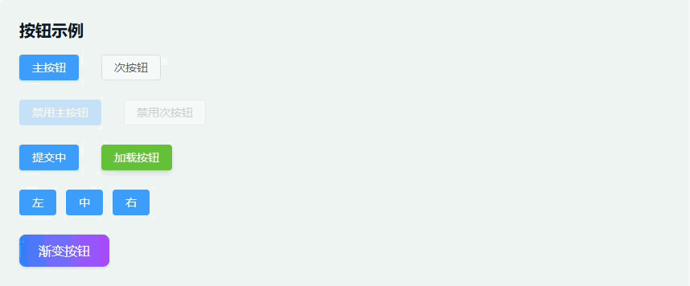

---

### Hover / Active 状态

**功能说明**：使用 TailwindCSS 控制元素的 Hover（悬停）和 Active（点击）状态，提升交互反馈。适用于按钮、卡片、列表项等场景。

```vue
<template>
  <div class="p-6 bg-gray-100 space-y-6">
    <!-- p-6: 内边距 1.5rem -->
    <!-- bg-gray-100: 浅灰背景 -->
    <!-- space-y-6: 子元素垂直间距 1.5rem -->

    <h2 class="text-xl font-bold text-gray-900 mb-4">
      <!-- text-xl: 字体大小 1.25rem -->
      <!-- font-bold: 加粗 -->
      <!-- text-gray-900: 深灰色 -->
      <!-- mb-4: 下边距 1rem -->
      Hover / Active 状态示例
    </h2>

    <!-- 按钮 Hover / Active -->
    <div class="flex space-x-4">
      <!-- flex: 水平布局 -->
      <!-- space-x-4: 子元素间距 1rem -->

      <button
        class="bg-blue-500 hover:bg-blue-600 active:bg-blue-700 text-white px-4 py-2 rounded transition-colors"
      >
        <!-- bg-blue-500: 默认背景 -->
        <!-- hover:bg-blue-600: 悬停变深 -->
        <!-- active:bg-blue-700: 点击更深 -->
        <!-- text-white: 白色文字 -->
        <!-- px-4: 左右内边距 -->
        <!-- py-2: 上下内边距 -->
        <!-- rounded: 圆角 -->
        <!-- transition-colors: 颜色过渡动画 -->
        按钮
      </button>

      <button
        class="bg-green-500 hover:scale-105 active:scale-95 text-white px-4 py-2 rounded shadow hover:shadow-lg transition-all"
      >
        <!-- bg-green-500 -->
        <!-- hover:scale-105: hover 放大 -->
        <!-- active:scale-95: 点击缩小 -->
        <!-- text-white -->
        <!-- px-4 -->
        <!-- py-2 -->
        <!-- rounded -->
        <!-- shadow -->
        <!-- hover:shadow-lg -->
        <!-- transition-all -->
        动效按钮
      </button>
    </div>

    <!-- 卡片 Hover -->
    <div class="grid grid-cols-1 md:grid-cols-3 gap-4">
      <!-- grid -->
      <!-- grid-cols-1 -->
      <!-- md:grid-cols-3 -->
      <!-- gap-4 -->

      <div
        class="bg-white p-4 rounded shadow hover:shadow-xl hover:-translate-y-1 transition-all duration-300"
      >
        <!-- bg-white -->
        <!-- p-4 -->
        <!-- rounded -->
        <!-- shadow -->
        <!-- hover:shadow-xl: hover 阴影增强 -->
        <!-- hover:-translate-y-1: hover 向上移动 0.25rem -->
        <!-- transition-all -->
        <!-- duration-300 -->
        卡片 Hover 提升
      </div>

      <div
        class="bg-white p-4 rounded shadow hover:bg-gray-50 transition-colors"
      >
        <!-- hover:bg-gray-50: hover 背景变浅 -->
        <!-- transition-colors -->
        背景变化
      </div>

      <div
        class="bg-white p-4 rounded shadow hover:border-blue-500 border border-transparent transition-all"
      >
        <!-- border: 默认边框 -->
        <!-- border-transparent: 初始透明 -->
        <!-- hover:border-blue-500: hover 显示蓝色边框 -->
        <!-- transition-all -->
        边框高亮
      </div>
    </div>

    <!-- 列表 Hover -->
    <div class="bg-white rounded shadow divide-y divide-gray-200">
      <!-- bg-white -->
      <!-- rounded -->
      <!-- shadow -->
      <!-- divide-y: 子元素分割线 -->
      <!-- divide-gray-200 -->
      <div
        v-for="item in list"
        :key="item"
        class="p-3 hover:bg-gray-50 cursor-pointer transition-colors"
      >
        <!-- p-3: 内边距 -->
        <!-- hover:bg-gray-50 -->
        <!-- cursor-pointer: 鼠标手型 -->
        <!-- transition-colors -->
        {{ item }}
      </div>
    </div>

    <!-- Active 状态（点击反馈） -->
    <div class="flex space-x-4">
      <!-- flex -->
      <!-- space-x-4 -->

      <button
        class="bg-purple-500 active:translate-y-1 active:shadow-inner text-white px-4 py-2 rounded shadow transition-all"
      >
        <!-- bg-purple-500 -->
        <!-- active:translate-y-1: 点击向下移动 -->
        <!-- active:shadow-inner: 点击内阴影 -->
        <!-- text-white -->
        <!-- px-4 -->
        <!-- py-2 -->
        <!-- rounded -->
        <!-- shadow -->
        <!-- transition-all -->
        点击反馈
      </button>

      <button
        class="bg-red-500 hover:bg-red-600 active:bg-red-700 text-white px-4 py-2 rounded transition-colors"
      >
        <!-- bg-red-500 -->
        <!-- hover:bg-red-600 -->
        <!-- active:bg-red-700 -->
        <!-- text-white -->
        <!-- px-4 -->
        <!-- py-2 -->
        <!-- rounded -->
        <!-- transition-colors -->
        颜色反馈
      </button>
    </div>

    <!-- ElementPlus 按钮增强 -->
    <div>
      <el-button
        type="primary"
        class="hover:shadow-lg active:scale-95 transition-all"
      >
        <!-- hover:shadow-lg: hover 阴影 -->
        <!-- active:scale-95: 点击缩小 -->
        <!-- transition-all -->
        Element 按钮增强
      </el-button>
    </div>
  </div>
</template>

<script lang="ts" setup>
const list = ['列表项 1', '列表项 2', '列表项 3']
</script>

<style lang="scss" scoped>
// Tailwind 状态类：hover: / active:
</style>
```

✅ 特点：

- `hover:*`：悬停状态（颜色 / 阴影 / 位移 / 缩放）
- `active:*`：点击状态（缩小 / 内阴影 / 位移）
- 常见组合：
  - 按钮：`hover:bg-* + active:bg-*`
  - 卡片：`hover:shadow-xl + hover:-translate-y-1`
  - 动效：`hover:scale-* + active:scale-*`
- 必配动画：`transition-*`

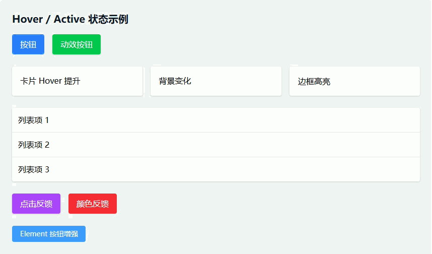

------

### 禁用状态

**功能说明**：使用 TailwindCSS 规范化禁用态样式（视觉 + 交互），适用于按钮、输入框、卡片等。结合 ElementPlus 的 `disabled` 属性，实现统一的企业级禁用态。

```vue
<template>
  <div class="p-6 bg-gray-100 space-y-6">
    <!-- p-6: 内边距 1.5rem -->
    <!-- bg-gray-100: 浅灰背景 -->
    <!-- space-y-6: 子元素垂直间距 1.5rem -->

    <h2 class="text-xl font-bold text-gray-900 mb-4">
      <!-- text-xl: 字体大小 1.25rem -->
      <!-- font-bold: 加粗 -->
      <!-- text-gray-900: 深灰色 -->
      <!-- mb-4: 下边距 1rem -->
      禁用状态示例
    </h2>

    <!-- 基础禁用按钮 -->
    <div class="flex space-x-4">
      <!-- flex: 水平布局 -->
      <!-- space-x-4: 子元素间距 1rem -->

      <button
        disabled
        class="bg-blue-500 text-white px-4 py-2 rounded opacity-50 cursor-not-allowed"
      >
        <!-- bg-blue-500: 蓝色背景 -->
        <!-- text-white: 白色文字 -->
        <!-- px-4: 左右内边距 -->
        <!-- py-2: 上下内边距 -->
        <!-- rounded: 圆角 -->
        <!-- opacity-50: 半透明（禁用视觉） -->
        <!-- cursor-not-allowed: 禁用鼠标样式 -->
        禁用按钮
      </button>

      <button
        class="bg-green-500 text-white px-4 py-2 rounded disabled:opacity-50 disabled:cursor-not-allowed"
        disabled
      >
        <!-- bg-green-500 -->
        <!-- text-white -->
        <!-- px-4 -->
        <!-- py-2 -->
        <!-- rounded -->
        <!-- disabled:opacity-50: 禁用时透明 -->
        <!-- disabled:cursor-not-allowed: 禁用鼠标 -->
        推荐写法（Tailwind状态）
      </button>
    </div>

    <!-- ElementPlus 按钮禁用 -->
    <div class="flex space-x-4">
      <!-- flex -->
      <!-- space-x-4 -->

      <el-button
        type="primary"
        disabled
        class="opacity-50 cursor-not-allowed"
      >
        <!-- opacity-50 -->
        <!-- cursor-not-allowed -->
        Element 禁用
      </el-button>

      <el-button
        disabled
        class="border border-gray-300 opacity-50 cursor-not-allowed"
      >
        <!-- border -->
        <!-- border-gray-300 -->
        <!-- opacity-50 -->
        <!-- cursor-not-allowed -->
        次按钮禁用
      </el-button>
    </div>

    <!-- 表单输入禁用 -->
    <div class="space-y-4">
      <!-- space-y-4: 垂直间距 -->

      <input
        type="text"
        placeholder="请输入内容"
        disabled
        class="w-full px-4 py-2 border border-gray-300 rounded bg-gray-100 text-gray-500 cursor-not-allowed"
      />
      <!-- w-full: 宽度100% -->
      <!-- px-4 -->
      <!-- py-2 -->
      <!-- border -->
      <!-- border-gray-300 -->
      <!-- rounded -->
      <!-- bg-gray-100: 禁用背景 -->
      <!-- text-gray-500: 禁用文字颜色 -->
      <!-- cursor-not-allowed -->

      <el-input
        disabled
        placeholder="Element 输入框禁用"
        class="w-full"
      />
      <!-- w-full -->
    </div>

    <!-- 卡片禁用态 -->
    <div class="grid grid-cols-1 md:grid-cols-3 gap-4">
      <!-- grid -->
      <!-- md:grid-cols-3 -->
      <!-- gap-4 -->

      <div
        class="bg-white p-4 rounded shadow opacity-50 pointer-events-none"
      >
        <!-- bg-white -->
        <!-- p-4 -->
        <!-- rounded -->
        <!-- shadow -->
        <!-- opacity-50: 半透明 -->
        <!-- pointer-events-none: 禁止鼠标事件 -->
        禁用卡片（不可点击）
      </div>

      <div
        class="bg-white p-4 rounded shadow hover:shadow-lg transition-all"
      >
        <!-- 正常卡片对比 -->
        正常卡片
      </div>
    </div>

    <!-- 推荐统一禁用规范 -->
    <div class="bg-white p-4 rounded shadow space-y-2">
      <!-- bg-white -->
      <!-- p-4 -->
      <!-- rounded -->
      <!-- shadow -->
      <!-- space-y-2 -->

      <p class="text-gray-700">
        推荐组合：
      </p>

      <ul class="list-disc pl-6 text-gray-600">
        <!-- list-disc: 圆点列表 -->
        <!-- pl-6: 左内边距 -->
        <!-- text-gray-600 -->
        <li>视觉：opacity-50</li>
        <li>交互：cursor-not-allowed</li>
        <li>行为：pointer-events-none（必要时）</li>
        <li>状态：disabled: 前缀统一控制</li>
      </ul>
    </div>

    <!-- 响应式禁用（示例） -->
    <button
      class="bg-purple-500 text-white px-4 py-2 rounded md:opacity-50 md:pointer-events-none"
    >
      <!-- bg-purple-500 -->
      <!-- text-white -->
      <!-- px-4 -->
      <!-- py-2 -->
      <!-- rounded -->
      <!-- md:opacity-50: ≥768px 禁用视觉 -->
      <!-- md:pointer-events-none: ≥768px 禁止点击 -->
      响应式禁用（演示）
    </button>
  </div>
</template>

<script lang="ts" setup>
// 示例无需逻辑
</script>

<style lang="scss" scoped>
// Tailwind 禁用状态推荐使用 disabled: 前缀
</style>
```

✅ 企业级规范总结：

- **视觉统一**：`opacity-50`
- **交互限制**：`cursor-not-allowed`
- **彻底禁用**：`pointer-events-none`
- **推荐写法**：`disabled:opacity-50 disabled:cursor-not-allowed`
- ElementPlus 必须配合 `disabled` 属性

------

### 加载按钮（结合 ElementPlus）

**功能说明**：基于 ElementPlus 的 `loading` 属性实现按钮加载态，结合 TailwindCSS 优化样式与交互（禁用、防重复点击、动画反馈）。

```vue
<template>
  <div class="p-6 bg-gray-100 space-y-6">
    <!-- p-6: 内边距 1.5rem -->
    <!-- bg-gray-100: 浅灰背景 -->
    <!-- space-y-6: 子元素垂直间距 1.5rem -->

    <h2 class="text-xl font-bold text-gray-900 mb-4">
      <!-- text-xl: 字体大小 1.25rem -->
      <!-- font-bold: 加粗 -->
      <!-- text-gray-900: 深灰色 -->
      <!-- mb-4: 下边距 1rem -->
      加载按钮示例
    </h2>

    <!-- 基础加载按钮 -->
    <div class="flex space-x-4">
      <!-- flex: 水平布局 -->
      <!-- space-x-4: 子元素间距 1rem -->

      <el-button
        type="primary"
        :loading="loading"
        :disabled="loading"
        class="px-6 py-2 rounded-lg shadow transition-all duration-200"
        @click="handleSubmit"
      >
        <!-- :loading: ElementPlus 内置加载状态 -->
        <!-- :disabled="loading": 加载时禁用按钮（防重复点击） -->
        <!-- px-6: 左右内边距 1.5rem -->
        <!-- py-2: 上下内边距 0.5rem -->
        <!-- rounded-lg: 圆角 -->
        <!-- shadow: 阴影 -->
        <!-- transition-all: 动画过渡 -->
        <!-- duration-200: 动画时长 -->
        提交
      </el-button>

      <el-button
        type="success"
        :loading="loading"
        :disabled="loading"
        class="px-6 py-2 rounded-lg shadow-md hover:shadow-lg transition-all duration-200"
        @click="handleSubmit"
      >
        <!-- type="success": 绿色按钮 -->
        <!-- shadow-md: 初始阴影 -->
        <!-- hover:shadow-lg: hover 阴影增强 -->
        <!-- 其余同上 -->
        保存
      </el-button>
    </div>

    <!-- 自定义 Loading 文案 -->
    <div>
      <el-button
        type="primary"
        :loading="loading"
        :disabled="loading"
        class="px-6 py-2 rounded-lg shadow transition-all"
        @click="handleSubmit"
      >
        <!-- loading 时切换文案 -->
        {{ loading ? '提交中...' : '提交数据' }}
      </el-button>
    </div>

    <!-- 图标 + Loading -->
    <div>
      <el-button
        type="primary"
        :loading="loading"
        :disabled="loading"
        class="px-6 py-2 rounded-lg flex items-center space-x-2 transition-all"
        @click="handleSubmit"
      >
        <!-- flex: 水平布局 -->
        <!-- items-center: 垂直居中 -->
        <!-- space-x-2: 子元素间距 -->
        <span>提交</span>
      </el-button>
    </div>

    <!-- 按钮组 Loading -->
    <div class="flex space-x-4">
      <!-- flex -->
      <!-- space-x-4 -->

      <el-button
        type="primary"
        :loading="loading1"
        :disabled="loading1"
        class="px-6 py-2 rounded-lg"
        @click="handleSubmit1"
      >
        提交 A
      </el-button>

      <el-button
        type="primary"
        :loading="loading2"
        :disabled="loading2"
        class="px-6 py-2 rounded-lg"
        @click="handleSubmit2"
      >
        提交 B
      </el-button>
    </div>

    <!-- 渐变加载按钮（增强UI） -->
    <button
      :disabled="loading"
      @click="handleSubmit"
      class="bg-gradient-to-r from-blue-500 to-purple-500 hover:from-purple-500 hover:to-blue-500 disabled:opacity-50 disabled:cursor-not-allowed text-white px-6 py-2 rounded-lg shadow hover:shadow-lg transition-all duration-300"
    >
      <!-- bg-gradient-to-r: 横向渐变 -->
      <!-- from-blue-500: 起始颜色 -->
      <!-- to-purple-500: 结束颜色 -->
      <!-- hover:from-purple-500 -->
      <!-- hover:to-blue-500 -->
      <!-- disabled:opacity-50: 禁用透明 -->
      <!-- disabled:cursor-not-allowed -->
      <!-- text-white -->
      <!-- px-6 -->
      <!-- py-2 -->
      <!-- rounded-lg -->
      <!-- shadow -->
      <!-- hover:shadow-lg -->
      <!-- transition-all -->
      <!-- duration-300 -->
      {{ loading ? '加载中...' : '渐变按钮' }}
    </button>
  </div>
</template>

<script lang="ts" setup>
import { ref } from 'vue'

const loading = ref(false)
const loading1 = ref(false)
const loading2 = ref(false)

// 模拟请求
const handleSubmit = () => {
  if (loading.value) return
  loading.value = true
  setTimeout(() => {
    loading.value = false
  }, 2000)
}

const handleSubmit1 = () => {
  if (loading1.value) return
  loading1.value = true
  setTimeout(() => {
    loading1.value = false
  }, 1500)
}

const handleSubmit2 = () => {
  if (loading2.value) return
  loading2.value = true
  setTimeout(() => {
    loading2.value = false
  }, 2500)
}
</script>

<style lang="scss" scoped>
// 推荐：loading 状态一定要禁用按钮（防重复请求）
</style>
```

✅ 企业级规范总结：

- 必须绑定：`:loading` + `:disabled="loading"`
- 防重复点击：函数内再次判断 loading
- UI增强：`shadow + hover + transition`
- 文案切换：`loading ? 'xxx中' : '正常文案'`
- 多按钮独立 loading 状态

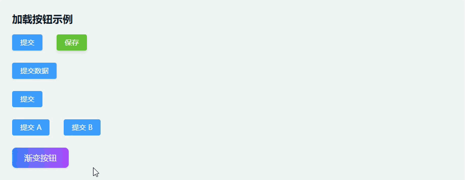

------

### 按钮组

**功能说明**：使用 TailwindCSS + ElementPlus 构建按钮组（横向组合 / 操作栏 / 表格操作列），实现统一样式、边界合并、间距规范。

```vue
<template>
  <div class="p-6 bg-gray-100 space-y-6">
    <!-- p-6: 内边距 1.5rem -->
    <!-- bg-gray-100: 浅灰背景 -->
    <!-- space-y-6: 子元素垂直间距 1.5rem -->

    <h2 class="text-xl font-bold text-gray-900 mb-4">
      <!-- text-xl: 字体大小 1.25rem -->
      <!-- font-bold: 加粗 -->
      <!-- text-gray-900: 深灰色 -->
      <!-- mb-4: 下边距 1rem -->
      按钮组示例
    </h2>

    <!-- 基础按钮组（无间距） -->
    <div class="flex">
      <!-- flex: 水平布局 -->

      <el-button
        type="primary"
        class="rounded-l-lg rounded-r-none"
      >
        <!-- rounded-l-lg: 左圆角 -->
        <!-- rounded-r-none: 右无圆角 -->
        新增
      </el-button>

      <el-button
        type="primary"
        class="rounded-none border-l border-white"
      >
        <!-- rounded-none: 无圆角 -->
        <!-- border-l: 左边框 -->
        <!-- border-white: 白色分割线 -->
        编辑
      </el-button>

      <el-button
        type="primary"
        class="rounded-r-lg rounded-l-none"
      >
        <!-- rounded-r-lg: 右圆角 -->
        <!-- rounded-l-none: 左无圆角 -->
        删除
      </el-button>
    </div>

    <!-- 带间距按钮组（推荐） -->
    <div class="flex space-x-2">
      <!-- flex -->
      <!-- space-x-2: 间距 0.5rem -->

      <el-button type="primary">新增</el-button>
      <el-button type="success">保存</el-button>
      <el-button type="danger">删除</el-button>
    </div>

    <!-- 操作栏（常见后台） -->
    <div class="flex justify-between items-center bg-white p-4 rounded shadow">
      <!-- flex: 水平布局 -->
      <!-- justify-between: 两端对齐 -->
      <!-- items-center: 垂直居中 -->
      <!-- bg-white -->
      <!-- p-4 -->
      <!-- rounded -->
      <!-- shadow -->

      <div class="flex space-x-2">
        <!-- 左侧操作区 -->
        <el-button type="primary">新增</el-button>
        <el-button>导入</el-button>
        <el-button>导出</el-button>
      </div>

      <div class="flex space-x-2">
        <!-- 右侧操作区 -->
        <el-button>刷新</el-button>
        <el-button type="danger">批量删除</el-button>
      </div>
    </div>

    <!-- 表格操作列（核心场景） -->
    <div class="bg-white p-4 rounded shadow">
      <!-- bg-white -->
      <!-- p-4 -->
      <!-- rounded -->
      <!-- shadow -->

      <el-table :data="tableData" border class="w-full">
        <!-- border: 表格边框 -->
        <!-- w-full: 宽度100% -->

        <el-table-column prop="name" label="姓名" />
        <el-table-column prop="age" label="年龄" />

        <el-table-column label="操作" width="220">
          <template #default="{ row }">
            <div class="flex space-x-2">
              <!-- flex -->
              <!-- space-x-2 -->

              <el-button size="small" type="primary">编辑</el-button>

              <el-button size="small" type="danger">删除</el-button>

              <el-button size="small">详情</el-button>
            </div>
          </template>
        </el-table-column>
      </el-table>
    </div>

    <!-- 图标按钮组 -->
    <div class="flex space-x-2">
      <!-- flex -->
      <!-- space-x-2 -->

      <el-button type="primary" circle>
        <!-- circle: 圆形按钮 -->
        <el-icon><Plus /></el-icon>
      </el-button>

      <el-button type="success" circle>
        <el-icon><Check /></el-icon>
      </el-button>

      <el-button type="danger" circle>
        <el-icon><Delete /></el-icon>
      </el-button>
    </div>

    <!-- 渐变按钮组（增强UI） -->
    <div class="flex space-x-2">
      <!-- flex -->
      <!-- space-x-2 -->

      <button
        class="bg-gradient-to-r from-blue-500 to-indigo-500 hover:from-indigo-500 hover:to-blue-500 text-white px-4 py-2 rounded shadow hover:shadow-lg transition-all"
      >
        <!-- bg-gradient-to-r -->
        <!-- from-blue-500 -->
        <!-- to-indigo-500 -->
        <!-- hover:from-indigo-500 -->
        <!-- hover:to-blue-500 -->
        <!-- text-white -->
        <!-- px-4 -->
        <!-- py-2 -->
        <!-- rounded -->
        <!-- shadow -->
        <!-- hover:shadow-lg -->
        <!-- transition-all -->
        操作1
      </button>

      <button
        class="bg-gradient-to-r from-green-500 to-emerald-500 hover:from-emerald-500 hover:to-green-500 text-white px-4 py-2 rounded shadow hover:shadow-lg transition-all"
      >
        操作2
      </button>
    </div>
  </div>
</template>

<script lang="ts" setup>
import { reactive } from 'vue'
import { Plus, Check, Delete } from '@element-plus/icons-vue'

const tableData = reactive([
  { name: '张三', age: 25 },
  { name: '李四', age: 30 }
])
</script>

<style lang="scss" scoped>
// 推荐：
// 1. 操作按钮使用 space-x-2 控制间距
// 2. 操作列按钮统一 size="small"
// 3. 主操作用 primary，危险操作用 danger
</style>
```

✅ 企业级规范总结：

- 无缝按钮组：`rounded-l / rounded-none / rounded-r`
- 常规按钮组：`flex + space-x-*`（推荐）
- 操作栏：`justify-between` 分左右区
- 表格操作列：`size="small" + space-x-2`
- 图标按钮：`circle`

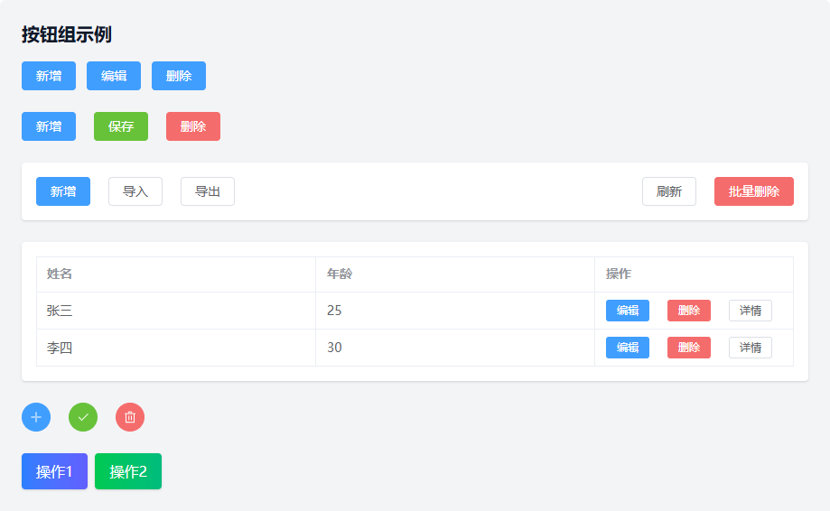

------

## 五、表单相关

### 输入框样式（Tailwind + ElementPlus）

**功能说明**：基于 ElementPlus 输入组件（`el-input / el-select / el-textarea`），结合 TailwindCSS 做布局、间距、状态增强，形成企业级表单输入规范。

```vue
<template>
  <div class="p-6 bg-gray-100 space-y-6">
    <!-- p-6: 内边距 1.5rem -->
    <!-- bg-gray-100: 浅灰背景 -->
    <!-- space-y-6: 子元素垂直间距 1.5rem -->

    <h2 class="text-xl font-bold text-gray-900 mb-4">
      <!-- text-xl: 字体大小 1.25rem -->
      <!-- font-bold: 加粗 -->
      <!-- text-gray-900: 深灰色 -->
      <!-- mb-4: 下边距 1rem -->
      输入框示例
    </h2>

    <!-- 基础输入框 -->
    <div class="bg-white p-4 rounded shadow space-y-4">
      <!-- bg-white -->
      <!-- p-4 -->
      <!-- rounded -->
      <!-- shadow -->
      <!-- space-y-4 -->

      <el-input
        v-model="form.name"
        placeholder="请输入姓名"
        class="w-full"
      />
      <!-- w-full: 宽度100% -->

      <el-input
        v-model="form.email"
        placeholder="请输入邮箱"
        class="w-full"
        clearable
      />
      <!-- clearable: 可清空 -->
    </div>

    <!-- 带图标输入框 -->
    <div class="bg-white p-4 rounded shadow space-y-4">
      <el-input
        v-model="form.keyword"
        placeholder="搜索关键词"
        class="w-full"
      >
        <template #prefix>
          <!-- 前缀图标 -->
          <el-icon class="text-gray-400">
            <!-- text-gray-400: 灰色图标 -->
            <Search />
          </el-icon>
        </template>
      </el-input>
    </div>

    <!-- 输入框状态（focus / hover 增强） -->
    <div class="bg-white p-4 rounded shadow space-y-4">
      <el-input
        v-model="form.username"
        placeholder="用户名"
        class="w-full focus-within:ring-2 focus-within:ring-blue-500 rounded"
      />
      <!-- focus-within:ring-2: 聚焦时外圈 2px -->
      <!-- focus-within:ring-blue-500: 蓝色高亮 -->
      <!-- rounded: 圆角 -->

      <el-input
        v-model="form.password"
        type="password"
        placeholder="密码"
        class="w-full hover:shadow-md transition-shadow rounded"
      />
      <!-- hover:shadow-md: hover 阴影 -->
      <!-- transition-shadow: 阴影动画 -->
    </div>

    <!-- 禁用输入框 -->
    <div class="bg-white p-4 rounded shadow space-y-4">
      <el-input
        v-model="form.disabled"
        disabled
        placeholder="禁用状态"
        class="w-full opacity-50 cursor-not-allowed"
      />
      <!-- opacity-50 -->
      <!-- cursor-not-allowed -->
    </div>

    <!-- 文本域 -->
    <div class="bg-white p-4 rounded shadow space-y-4">
      <el-input
        v-model="form.desc"
        type="textarea"
        :rows="4"
        placeholder="请输入描述"
        class="w-full"
      />
      <!-- type="textarea" -->
      <!-- rows: 行数 -->
    </div>

    <!-- Select 下拉 -->
    <div class="bg-white p-4 rounded shadow space-y-4">
      <el-select
        v-model="form.type"
        placeholder="请选择类型"
        class="w-full"
      >
        <el-option label="类型A" value="A" />
        <el-option label="类型B" value="B" />
      </el-select>
    </div>

    <!-- 表单布局（Label + Input） -->
    <div class="bg-white p-4 rounded shadow space-y-4">
      <div class="grid grid-cols-1 md:grid-cols-2 gap-4">
        <!-- grid -->
        <!-- md:grid-cols-2 -->
        <!-- gap-4 -->

        <div>
          <label class="block text-sm text-gray-700 mb-1">
            <!-- block: 独占一行 -->
            <!-- text-sm: 小字体 -->
            <!-- text-gray-700 -->
            <!-- mb-1 -->
            姓名
          </label>
          <el-input v-model="form.name" class="w-full" />
        </div>

        <div>
          <label class="block text-sm text-gray-700 mb-1">
            邮箱
          </label>
          <el-input v-model="form.email" class="w-full" />
        </div>
      </div>
    </div>

    <!-- 输入组（前后缀） -->
    <div class="bg-white p-4 rounded shadow space-y-4">
      <div class="flex">
        <!-- flex: 横向布局 -->

        <span class="px-3 py-2 bg-gray-200 border border-gray-300 rounded-l">
          <!-- px-3 -->
          <!-- py-2 -->
          <!-- bg-gray-200 -->
          <!-- border -->
          <!-- rounded-l -->
          https://
        </span>

        <input
          v-model="form.url"
          class="flex-1 px-3 py-2 border-t border-b border-gray-300 outline-none"
          placeholder="请输入域名"
        />
        <!-- flex-1: 占满剩余空间 -->
        <!-- px-3 -->
        <!-- py-2 -->
        <!-- border-t / border-b -->
        <!-- border-gray-300 -->
        <!-- outline-none: 去除默认聚焦边框 -->

        <span class="px-3 py-2 bg-gray-200 border border-gray-300 rounded-r">
          .com
        </span>
      </div>
    </div>
  </div>
</template>

<script lang="ts" setup>
import { reactive } from 'vue'
import { Search } from '@element-plus/icons-vue'

const form = reactive({
  name: '',
  email: '',
  keyword: '',
  username: '',
  password: '',
  desc: '',
  type: '',
  url: '',
  disabled: '不可编辑'
})
</script>

<style lang="scss" scoped>
// 推荐：
// 1. 输入框统一 w-full
// 2. 使用 focus-within:ring 做高亮
// 3. 表单项间距统一 space-y-4
// 4. Label 使用 text-sm + text-gray-700
</style>
```

✅ 企业级规范总结：

- 宽度统一：`w-full`
- 间距统一：`space-y-4`
- Label：`text-sm text-gray-700 mb-1`
- 聚焦高亮：`focus-within:ring-*`
- 状态增强：`hover / focus / disabled`
- 复杂输入：前后缀 + flex 布局

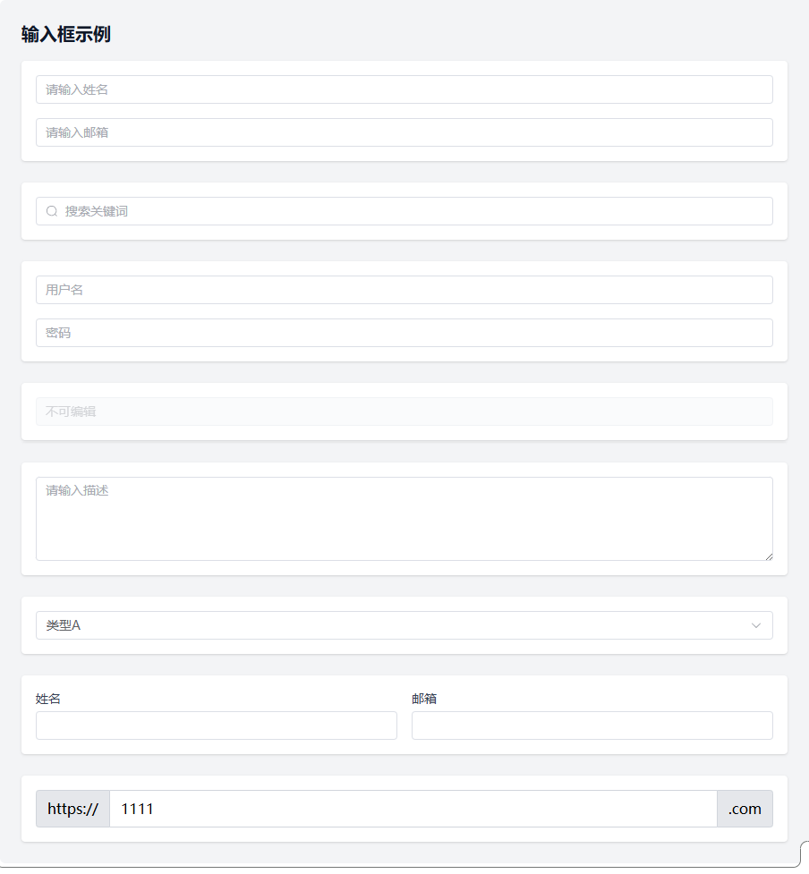

------

### 表单布局（行内 / 栅格）

**简单功能描述：**
使用 TailwindCSS + ElementPlus 实现后台常见的「查询表单」，支持行内布局 + 栅格响应式布局

------

```vue
<template>
  <div class="p-4 bg-white rounded-lg shadow-sm">
    <!-- p-4: 内边距 1rem -->
    <!-- bg-white: 白色背景 -->
    <!-- rounded-lg: 大圆角 -->
    <!-- shadow-sm: 小阴影 -->

    <el-form :model="form" label-width="80px">
      <!-- 栅格表单 -->
      <div class="grid grid-cols-1 md:grid-cols-2 lg:grid-cols-4 gap-4">
        <!-- grid: 使用 grid 布局 -->
        <!-- grid-cols-1: 默认 1 列 -->
        <!-- md:grid-cols-2: 中屏 2 列 -->
        <!-- lg:grid-cols-4: 大屏 4 列 -->
        <!-- gap-4: 间距 1rem -->

        <!-- 用户名 -->
        <el-form-item label="用户名">
          <el-input
            v-model="form.username"
            placeholder="请输入用户名"
            class="w-full"
          />
          <!-- w-full: 宽度 100% -->
        </el-form-item>

        <!-- 手机号 -->
        <el-form-item label="手机号">
          <el-input
            v-model="form.phone"
            placeholder="请输入手机号"
            class="w-full"
          />
          <!-- w-full: 宽度 100% -->
        </el-form-item>

        <!-- 状态 -->
        <el-form-item label="状态">
          <el-select
            v-model="form.status"
            placeholder="请选择状态"
            class="w-full"
          >
            <!-- w-full: 宽度 100% -->
            <el-option label="启用" value="1" />
            <el-option label="禁用" value="0" />
          </el-select>
        </el-form-item>

        <!-- 创建时间 -->
        <el-form-item label="创建时间">
          <el-date-picker
            v-model="form.date"
            type="daterange"
            start-placeholder="开始时间"
            end-placeholder="结束时间"
            class="w-full"
          />
          <!-- w-full: 宽度 100% -->
        </el-form-item>
      </div>

      <!-- 按钮区域（行内布局） -->
      <div class="mt-4 flex justify-end items-center gap-2">
        <!-- mt-4: 上边距 1rem -->
        <!-- flex: 使用 flex 布局 -->
        <!-- justify-end: 主轴右对齐 -->
        <!-- items-center: 交叉轴居中 -->
        <!-- gap-2: 间距 0.5rem -->

        <el-button>重置</el-button>

        <el-button type="primary" :loading="loading">
          查询
        </el-button>
      </div>
    </el-form>
  </div>
</template>

<script setup lang="ts">
import { reactive, ref } from 'vue'

interface FormType {
  username: string
  phone: string
  status: string
  date: string[]
}

const form = reactive<FormType>({
  username: '',
  phone: '',
  status: '',
  date: []
})

const loading = ref(false)
</script>

<style lang="scss" scoped>
</style>
```

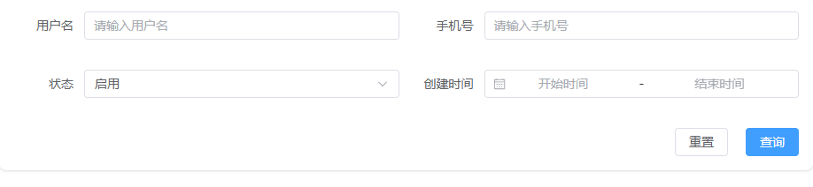

------

### 表单校验提示样式

**简单功能描述：**
基于 ElementPlus 表单校验 + TailwindCSS 实现「错误提示样式强化（红框 + 提示信息 + 状态提示）」

------

```vue
<template>
  <div class="p-4 bg-white rounded-lg shadow-sm">
    <!-- p-4: 内边距 1rem -->
    <!-- bg-white: 白色背景 -->
    <!-- rounded-lg: 大圆角 -->
    <!-- shadow-sm: 小阴影 -->

    <el-form
      ref="formRef"
      :model="form"
      :rules="rules"
      label-width="80px"
      class="space-y-4"
    >
      <!-- space-y-4: 子元素垂直间距 1rem -->

      <!-- 用户名 -->
      <el-form-item label="用户名" prop="username">
        <el-input
          v-model="form.username"
          placeholder="请输入用户名"
          class="w-full"
        />
        <!-- w-full: 宽度 100% -->
      </el-form-item>

      <!-- 邮箱 -->
      <el-form-item label="邮箱" prop="email">
        <el-input
          v-model="form.email"
          placeholder="请输入邮箱"
          class="w-full"
        />
        <!-- w-full: 宽度 100% -->
      </el-form-item>

      <!-- 密码 -->
      <el-form-item label="密码" prop="password">
        <el-input
          v-model="form.password"
          type="password"
          placeholder="请输入密码"
          show-password
          class="w-full"
        />
        <!-- w-full: 宽度 100% -->
      </el-form-item>

      <!-- 自定义提示 -->
      <div
        v-if="errorMsg"
        class="text-red-500 text-sm"
      >
        <!-- text-red-500: 红色文本 -->
        <!-- text-sm: 小字体 -->
        {{ errorMsg }}
      </div>

      <!-- 按钮 -->
      <div class="flex justify-end gap-2 mt-2">
        <!-- flex: 使用 flex 布局 -->
        <!-- justify-end: 右对齐 -->
        <!-- gap-2: 间距 0.5rem -->
        <!-- mt-2: 上边距 0.5rem -->

        <el-button @click="handleReset">重置</el-button>

        <el-button
          type="primary"
          :loading="loading"
          @click="handleSubmit"
        >
          提交
        </el-button>
      </div>
    </el-form>
  </div>
</template>

<script setup lang="ts">
import { reactive, ref } from 'vue'
import type { FormInstance, FormRules } from 'element-plus'

const formRef = ref<FormInstance>()

const form = reactive({
  username: '',
  email: '',
  password: ''
})

const loading = ref(false)
const errorMsg = ref('')

const rules: FormRules = {
  username: [{ required: true, message: '请输入用户名', trigger: 'blur' }],
  email: [
    { required: true, message: '请输入邮箱', trigger: 'blur' },
    { type: 'email', message: '邮箱格式错误', trigger: 'blur' }
  ],
  password: [
    { required: true, message: '请输入密码', trigger: 'blur' },
    { min: 6, message: '密码至少6位', trigger: 'blur' }
  ]
}

const handleSubmit = () => {
  errorMsg.value = ''
  formRef.value?.validate((valid) => {
    if (!valid) {
      errorMsg.value = '请检查表单输入项'
      return
    }
    loading.value = true
    setTimeout(() => {
      loading.value = false
    }, 1000)
  })
}

const handleReset = () => {
  formRef.value?.resetFields()
  errorMsg.value = ''
}
</script>

<style lang="scss" scoped>
/* 强化错误状态（ElementPlus 覆盖） */
:deep(.el-form-item.is-error .el-input__wrapper) {
  border: 1px solid #f56c6c; /* 红色边框 */
  box-shadow: 0 0 0 1px rgba(245, 108, 108, 0.2); /* 外发光 */
}

:deep(.el-form-item__error) {
  color: #f56c6c; /* 错误文字颜色 */
  font-size: 12px; /* 字体大小 */
}
</style>
```

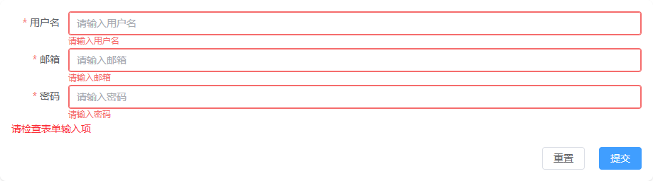

------

### Select / Radio / Checkbox 美化

**简单功能描述：**
基于 ElementPlus 的 Select / Radio / Checkbox，通过 TailwindCSS 实现统一风格（间距、布局、选中态强化）

------

```vue
<template>
  <div class="p-4 bg-white rounded-lg shadow-sm space-y-6">
    <!-- p-4: 内边距 1rem -->
    <!-- bg-white: 白色背景 -->
    <!-- rounded-lg: 大圆角 -->
    <!-- shadow-sm: 小阴影 -->
    <!-- space-y-6: 子元素垂直间距 1.5rem -->

    <!-- Select -->
    <div>
      <div class="mb-2 text-sm font-medium text-gray-700">
        <!-- mb-2: 下边距 0.5rem -->
        <!-- text-sm: 字体大小 0.875rem -->
        <!-- font-medium: 中等加粗 -->
        <!-- text-gray-700: 灰色文字 -->
        下拉选择
      </div>

      <el-select
          v-model="form.status"
          placeholder="请选择状态"
          class="w-full"
      >
        <!-- w-full: 宽度 100% -->
        <el-option label="启用" value="1" />
        <el-option label="禁用" value="0" />
      </el-select>
    </div>

    <!-- Radio -->
    <div>
      <div class="mb-2 text-sm font-medium text-gray-700">
        <!-- mb-2: 下边距 0.5rem -->
        <!-- text-sm: 字体大小 0.875rem -->
        <!-- font-medium: 中等加粗 -->
        <!-- text-gray-700: 灰色文字 -->
        单选（按钮风格）
      </div>

      <el-radio-group v-model="form.gender" class="flex gap-3">
        <!-- flex: 使用 flex 布局 -->
        <!-- gap-3: 间距 0.75rem -->

        <el-radio-button value="male">男</el-radio-button>
        <el-radio-button value="female">女</el-radio-button>
      </el-radio-group>
    </div>

    <!-- Checkbox -->
    <div>
      <div class="mb-2 text-sm font-medium text-gray-700">
        <!-- mb-2: 下边距 0.5rem -->
        <!-- text-sm: 字体大小 0.875rem -->
        <!-- font-medium: 中等加粗 -->
        <!-- text-gray-700: 灰色文字 -->
        多选（标签风格）
      </div>

      <el-checkbox-group v-model="form.hobby" class="flex flex-wrap gap-2">
        <!-- flex: 使用 flex 布局 -->
        <!-- flex-wrap: 自动换行 -->
        <!-- gap-2: 间距 0.5rem -->

        <el-checkbox value="code" border>编程</el-checkbox>
        <el-checkbox value="music" border>音乐</el-checkbox>
        <el-checkbox value="sport" border>运动</el-checkbox>
      </el-checkbox-group>
    </div>
  </div>
</template>

<script setup lang="ts">
import { reactive } from 'vue'

const form = reactive({
  status: '',
  gender: 'male',
  hobby: [] as string[]
})
</script>

<style lang="scss" scoped>
/* Select 美化 */
:deep(.el-select .el-input__wrapper) {
  border-radius: 8px; /* 圆角 */
}

/* Radio Button 选中态强化 */
:deep(.el-radio-button__inner) {
  border-radius: 6px; /* 圆角 */
}

:deep(.el-radio-button__original-radio:checked + .el-radio-button__inner) {
  background-color: #409eff; /* 主色 */
  color: #fff; /* 白字 */
}

/* Checkbox 标签风格 */
:deep(.el-checkbox.is-bordered) {
  border-radius: 6px; /* 圆角 */
  padding: 6px 12px; /* 内边距 */
}

:deep(.el-checkbox.is-checked) {
  background-color: #ecf5ff; /* 选中背景 */
}
</style>
```

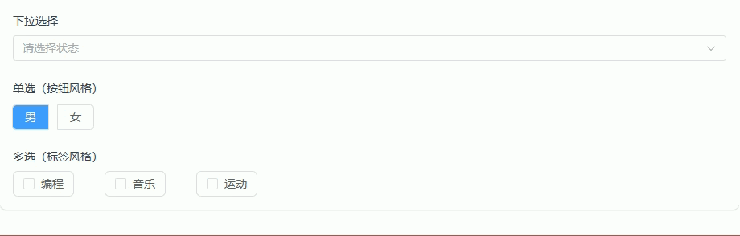

------

### 搜索表单

**简单功能描述：**
后台常用「搜索表单」，包含输入框 / 下拉 / 日期 / 按钮组，支持响应式 + 操作区

------

```vue
<template>
  <div class="p-4 bg-white rounded-lg shadow-sm">
    <!-- p-4: 内边距 1rem -->
    <!-- bg-white: 白色背景 -->
    <!-- rounded-lg: 大圆角 -->
    <!-- shadow-sm: 小阴影 -->

    <!-- 搜索区域 -->
    <div class="flex flex-wrap items-center gap-4">
      <!-- flex: 使用 flex 布局 -->
      <!-- flex-wrap: 自动换行 -->
      <!-- items-center: 垂直居中 -->
      <!-- gap-4: 间距 1rem -->

      <!-- 用户名 -->
      <el-input
        v-model="form.username"
        placeholder="用户名"
        clearable
        class="w-full md:w-56"
      />
      <!-- w-full: 小屏 100% -->
      <!-- md:w-56: 中屏宽度 14rem -->

      <!-- 状态 -->
      <el-select
        v-model="form.status"
        placeholder="状态"
        clearable
        class="w-full md:w-40"
      >
        <!-- w-full: 小屏 100% -->
        <!-- md:w-40: 中屏宽度 10rem -->
        <el-option label="启用" value="1" />
        <el-option label="禁用" value="0" />
      </el-select>

      <!-- 日期 -->
      <el-date-picker
        v-model="form.date"
        type="daterange"
        range-separator="-"
        start-placeholder="开始时间"
        end-placeholder="结束时间"
        class="w-full md:w-72"
      />
      <!-- w-full: 小屏 100% -->
      <!-- md:w-72: 中屏宽度 18rem -->

      <!-- 按钮组 -->
      <div class="flex items-center gap-2 ml-auto">
        <!-- flex: 使用 flex 布局 -->
        <!-- items-center: 垂直居中 -->
        <!-- gap-2: 间距 0.5rem -->
        <!-- ml-auto: 左外边距自动（推到右侧） -->

        <el-button @click="handleReset">重置</el-button>

        <el-button
          type="primary"
          :loading="loading"
          @click="handleSearch"
        >
          搜索
        </el-button>
      </div>
    </div>
  </div>
</template>

<script setup lang="ts">
import { reactive, ref } from 'vue'

const form = reactive({
  username: '',
  status: '',
  date: [] as string[]
})

const loading = ref(false)

const handleSearch = () => {
  loading.value = true
  setTimeout(() => {
    loading.value = false
  }, 800)
}

const handleReset = () => {
  form.username = ''
  form.status = ''
  form.date = []
}
</script>

<style lang="scss" scoped>
</style>
```

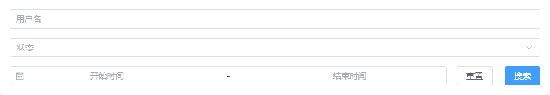

------

## 六、卡片与列表

### 卡片布局（基础卡片）

**简单功能描述：**
后台常用「卡片列表布局」，支持标题 / 内容 / 操作区，适用于数据概览、功能入口

------

```vue
<template>
  <div class="p-6 bg-gray-100">
    <!-- p-6: 内边距 1.5rem -->
    <!-- bg-gray-100: 浅灰背景 -->

    <!-- 卡片列表 -->
    <div class="grid grid-cols-1 md:grid-cols-2 lg:grid-cols-3 gap-6">
      <!-- grid: 使用 grid 布局 -->
      <!-- grid-cols-1: 默认 1 列 -->
      <!-- md:grid-cols-2: 中屏 2 列 -->
      <!-- lg:grid-cols-3: 大屏 3 列 -->
      <!-- gap-6: 间距 1.5rem -->

      <!-- 卡片 -->
      <div
        v-for="item in list"
        :key="item.id"
        class="bg-white rounded-xl shadow-sm p-4 flex flex-col justify-between"
      >
        <!-- bg-white: 白色背景 -->
        <!-- rounded-xl: 超大圆角 -->
        <!-- shadow-sm: 小阴影 -->
        <!-- p-4: 内边距 1rem -->
        <!-- flex: 使用 flex 布局 -->
        <!-- flex-col: 垂直排列 -->
        <!-- justify-between: 两端分布 -->

        <!-- 标题区 -->
        <div class="flex items-center justify-between mb-3">
          <!-- flex: 使用 flex 布局 -->
          <!-- items-center: 垂直居中 -->
          <!-- justify-between: 两端对齐 -->
          <!-- mb-3: 下边距 0.75rem -->

          <div class="text-base font-semibold text-gray-900">
            <!-- text-base: 字体大小 1rem -->
            <!-- font-semibold: 半加粗 -->
            <!-- text-gray-900: 深灰色 -->
            {{ item.title }}
          </div>

          <el-tag type="success" size="small">正常</el-tag>
        </div>

        <!-- 内容区 -->
        <div class="text-sm text-gray-600 leading-relaxed mb-4">
          <!-- text-sm: 字体大小 0.875rem -->
          <!-- text-gray-600: 灰色文字 -->
          <!-- leading-relaxed: 行高较宽松 -->
          <!-- mb-4: 下边距 1rem -->
          {{ item.desc }}
        </div>

        <!-- 操作区 -->
        <div class="flex justify-end gap-2">
          <!-- flex: 使用 flex 布局 -->
          <!-- justify-end: 右对齐 -->
          <!-- gap-2: 间距 0.5rem -->

          <el-button size="small">查看</el-button>
          <el-button size="small" type="primary">编辑</el-button>
        </div>
      </div>
    </div>
  </div>
</template>

<script setup lang="ts">
interface CardItem {
  id: number
  title: string
  desc: string
}

const list: CardItem[] = [
  {
    id: 1,
    title: '用户管理',
    desc: '管理系统用户信息，包括新增、编辑、权限分配等操作'
  },
  {
    id: 2,
    title: '订单管理',
    desc: '查看订单列表、处理订单状态以及订单数据统计分析'
  },
  {
    id: 3,
    title: '商品管理',
    desc: '商品上架、库存管理、分类管理等电商核心功能'
  }
]
</script>

<style lang="scss" scoped>
</style>
```

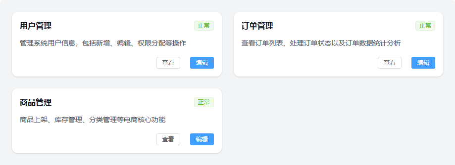

------

### 卡片 Hover 动效

**简单功能描述：**
基础卡片增加 Hover 动效（上浮 + 阴影增强 + 边框高亮），用于提升后台 UI 交互体验

------

```vue
<template>
  <div class="p-6 bg-gray-100">
    <!-- p-6: 内边距 1.5rem -->
    <!-- bg-gray-100: 浅灰背景 -->

    <!-- 卡片列表 -->
    <div class="grid grid-cols-1 md:grid-cols-2 lg:grid-cols-3 gap-6">
      <!-- grid: 使用 grid 布局 -->
      <!-- grid-cols-1: 默认 1 列 -->
      <!-- md:grid-cols-2: 中屏 2 列 -->
      <!-- lg:grid-cols-3: 大屏 3 列 -->
      <!-- gap-6: 间距 1.5rem -->

      <!-- 卡片 -->
      <div
        v-for="item in list"
        :key="item.id"
        class="group bg-white rounded-xl shadow-sm p-4 flex flex-col justify-between transition-all duration-300 border border-transparent hover:-translate-y-1 hover:shadow-lg hover:border-blue-500"
      >
        <!-- group: 分组（用于子元素 hover 联动） -->
        <!-- bg-white: 白色背景 -->
        <!-- rounded-xl: 超大圆角 -->
        <!-- shadow-sm: 初始小阴影 -->
        <!-- p-4: 内边距 1rem -->
        <!-- flex: 使用 flex 布局 -->
        <!-- flex-col: 垂直排列 -->
        <!-- justify-between: 两端分布 -->
        <!-- transition-all: 所有属性过渡 -->
        <!-- duration-300: 动画时长 300ms -->
        <!-- border: 边框 -->
        <!-- border-transparent: 默认透明边框 -->
        <!-- hover:-translate-y-1: hover 上移 0.25rem -->
        <!-- hover:shadow-lg: hover 大阴影 -->
        <!-- hover:border-blue-500: hover 蓝色边框 -->

        <!-- 标题区 -->
        <div class="flex items-center justify-between mb-3">
          <!-- flex: 使用 flex 布局 -->
          <!-- items-center: 垂直居中 -->
          <!-- justify-between: 两端对齐 -->
          <!-- mb-3: 下边距 0.75rem -->

          <div
            class="text-base font-semibold text-gray-900 transition-colors duration-300 group-hover:text-blue-600"
          >
            <!-- text-base: 字体大小 1rem -->
            <!-- font-semibold: 半加粗 -->
            <!-- text-gray-900: 深灰色 -->
            <!-- transition-colors: 颜色过渡 -->
            <!-- duration-300: 动画时长 300ms -->
            <!-- group-hover:text-blue-600: 父级 hover 时变蓝 -->
            {{ item.title }}
          </div>

          <el-tag size="small">模块</el-tag>
        </div>

        <!-- 内容区 -->
        <div class="text-sm text-gray-600 leading-relaxed mb-4">
          <!-- text-sm: 字体大小 0.875rem -->
          <!-- text-gray-600: 灰色文字 -->
          <!-- leading-relaxed: 行高较宽松 -->
          <!-- mb-4: 下边距 1rem -->
          {{ item.desc }}
        </div>

        <!-- 操作区 -->
        <div
          class="flex justify-end gap-2 opacity-80 group-hover:opacity-100 transition-opacity duration-300"
        >
          <!-- flex: 使用 flex 布局 -->
          <!-- justify-end: 右对齐 -->
          <!-- gap-2: 间距 0.5rem -->
          <!-- opacity-80: 初始透明度 80% -->
          <!-- group-hover:opacity-100: hover 时完全显示 -->
          <!-- transition-opacity: 透明度过渡 -->
          <!-- duration-300: 动画时长 300ms -->

          <el-button size="small">查看</el-button>
          <el-button size="small" type="primary">编辑</el-button>
        </div>
      </div>
    </div>
  </div>
</template>

<script setup lang="ts">
interface CardItem {
  id: number
  title: string
  desc: string
}

const list: CardItem[] = [
  {
    id: 1,
    title: '用户管理',
    desc: '管理系统用户信息，包括新增、编辑、权限分配等操作'
  },
  {
    id: 2,
    title: '订单管理',
    desc: '查看订单列表、处理订单状态以及订单数据统计分析'
  },
  {
    id: 3,
    title: '商品管理',
    desc: '商品上架、库存管理、分类管理等电商核心功能'
  }
]
</script>

<style lang="scss" scoped>
</style>
```

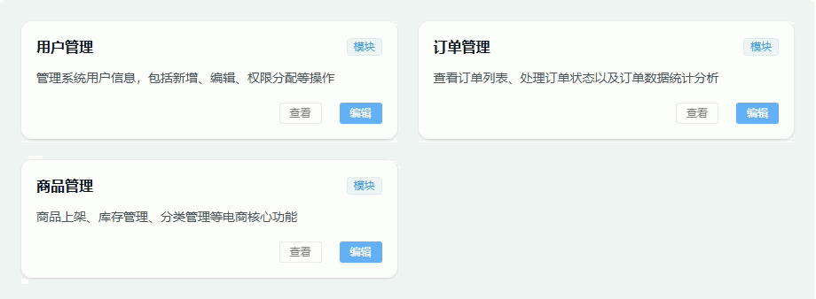

------

### 列表布局（带分割线）

**简单功能描述：**
后台常用「数据列表」，支持分割线 + 左右结构（标题 / 描述 / 操作）

------

```vue
<template>
  <div class="p-6 bg-gray-100">
    <!-- p-6: 内边距 1.5rem -->
    <!-- bg-gray-100: 浅灰背景 -->

    <!-- 列表容器 -->
    <div class="bg-white rounded-lg shadow-sm divide-y">
      <!-- bg-white: 白色背景 -->
      <!-- rounded-lg: 大圆角 -->
      <!-- shadow-sm: 小阴影 -->
      <!-- divide-y: 子元素纵向分割线 -->

      <!-- 列表项 -->
      <div
        v-for="item in list"
        :key="item.id"
        class="flex items-center justify-between p-4 hover:bg-gray-50 transition-colors duration-200"
      >
        <!-- flex: 使用 flex 布局 -->
        <!-- items-center: 垂直居中 -->
        <!-- justify-between: 两端对齐 -->
        <!-- p-4: 内边距 1rem -->
        <!-- hover:bg-gray-50: hover 浅灰背景 -->
        <!-- transition-colors: 颜色过渡 -->
        <!-- duration-200: 动画时长 200ms -->

        <!-- 左侧信息 -->
        <div class="flex flex-col">
          <!-- flex: 使用 flex 布局 -->
          <!-- flex-col: 垂直排列 -->

          <div class="text-sm font-medium text-gray-900 mb-1">
            <!-- text-sm: 字体大小 0.875rem -->
            <!-- font-medium: 中等加粗 -->
            <!-- text-gray-900: 深灰色 -->
            <!-- mb-1: 下边距 0.25rem -->
            {{ item.title }}
          </div>

          <div class="text-xs text-gray-500">
            <!-- text-xs: 字体大小 0.75rem -->
            <!-- text-gray-500: 灰色 -->
            {{ item.desc }}
          </div>
        </div>

        <!-- 右侧操作 -->
        <div class="flex items-center gap-2">
          <!-- flex: 使用 flex 布局 -->
          <!-- items-center: 垂直居中 -->
          <!-- gap-2: 间距 0.5rem -->

          <el-tag size="small" type="success">正常</el-tag>

          <el-button size="small">查看</el-button>
          <el-button size="small" type="primary">编辑</el-button>
        </div>
      </div>
    </div>
  </div>
</template>

<script setup lang="ts">
interface ListItem {
  id: number
  title: string
  desc: string
}

const list: ListItem[] = [
  {
    id: 1,
    title: '系统通知',
    desc: '系统将在今晚进行维护，请提前保存数据'
  },
  {
    id: 2,
    title: '订单更新',
    desc: '您有一条新的订单，请及时处理'
  },
  {
    id: 3,
    title: '权限变更',
    desc: '您的角色权限已更新，请重新登录'
  }
]
</script>

<style lang="scss" scoped>
</style>
```

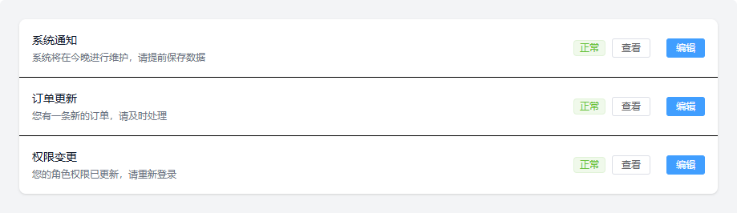

------

### 图文列表

**简单功能描述：**
后台常用「图文列表」，支持头像/图片 + 标题描述 + 操作区，适用于用户列表、消息列表等

------

```vue
<template>
  <div class="p-6 bg-gray-100">
    <!-- p-6: 内边距 1.5rem -->
    <!-- bg-gray-100: 浅灰背景 -->

    <!-- 列表容器 -->
    <div class="bg-white rounded-lg shadow-sm divide-y">
      <!-- bg-white: 白色背景 -->
      <!-- rounded-lg: 大圆角 -->
      <!-- shadow-sm: 小阴影 -->
      <!-- divide-y: 子元素纵向分割线 -->

      <!-- 列表项 -->
      <div
        v-for="item in list"
        :key="item.id"
        class="flex items-center justify-between p-4 hover:bg-gray-50 transition-colors duration-200"
      >
        <!-- flex: 使用 flex 布局 -->
        <!-- items-center: 垂直居中 -->
        <!-- justify-between: 两端对齐 -->
        <!-- p-4: 内边距 1rem -->
        <!-- hover:bg-gray-50: hover 浅灰背景 -->
        <!-- transition-colors: 颜色过渡 -->
        <!-- duration-200: 动画时长 200ms -->

        <!-- 左侧（头像 + 文本） -->
        <div class="flex items-center gap-3">
          <!-- flex: 使用 flex 布局 -->
          <!-- items-center: 垂直居中 -->
          <!-- gap-3: 间距 0.75rem -->

          <!-- 头像 -->
          
          <!-- w-10: 宽度 2.5rem -->
          <!-- h-10: 高度 2.5rem -->
          <!-- rounded-full: 圆形 -->
          <!-- object-cover: 图片填充裁剪 -->

          <!-- 文本 -->
          <div class="flex flex-col">
            <!-- flex: 使用 flex 布局 -->
            <!-- flex-col: 垂直排列 -->

            <div class="text-sm font-medium text-gray-900">
              <!-- text-sm: 字体大小 0.875rem -->
              <!-- font-medium: 中等加粗 -->
              <!-- text-gray-900: 深灰色 -->
              {{ item.name }}
            </div>

            <div class="text-xs text-gray-500 mt-1">
              <!-- text-xs: 字体大小 0.75rem -->
              <!-- text-gray-500: 灰色 -->
              <!-- mt-1: 上边距 0.25rem -->
              {{ item.desc }}
            </div>
          </div>
        </div>

        <!-- 右侧操作 -->
        <div class="flex items-center gap-2">
          <!-- flex: 使用 flex 布局 -->
          <!-- items-center: 垂直居中 -->
          <!-- gap-2: 间距 0.5rem -->

          <el-button size="small">查看</el-button>
          <el-button size="small" type="primary">编辑</el-button>
        </div>
      </div>
    </div>
  </div>
</template>

<script setup lang="ts">
interface Item {
  id: number
  name: string
  desc: string
  avatar: string
}

const list: Item[] = [
  {
    id: 1,
    name: '张三',
    desc: '前端开发工程师',
    avatar: 'https://i.pravatar.cc/100?img=1'
  },
  {
    id: 2,
    name: '李四',
    desc: '后端开发工程师',
    avatar: 'https://i.pravatar.cc/100?img=2'
  },
  {
    id: 3,
    name: '王五',
    desc: '产品经理',
    avatar: 'https://i.pravatar.cc/100?img=3'
  }
]
</script>

<style lang="scss" scoped>
</style>
```

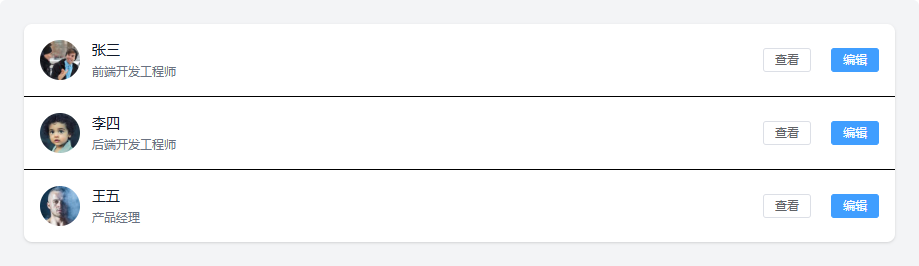

------

### 空状态展示

**简单功能描述：**
后台常用「空状态展示」，用于列表无数据时展示提示 + 操作入口（引导创建）

------

```vue
<template>
  <div class="p-6 bg-gray-100">
    <!-- p-6: 内边距 1.5rem -->
    <!-- bg-gray-100: 浅灰背景 -->

    <div class="bg-white rounded-lg shadow-sm p-6">
      <!-- bg-white: 白色背景 -->
      <!-- rounded-lg: 大圆角 -->
      <!-- shadow-sm: 小阴影 -->
      <!-- p-6: 内边距 1.5rem -->

      <!-- 空状态 -->
      <div class="flex flex-col items-center justify-center py-16">
        <!-- flex: 使用 flex 布局 -->
        <!-- flex-col: 垂直排列 -->
        <!-- items-center: 水平居中 -->
        <!-- justify-center: 垂直居中 -->
        <!-- py-16: 上下内边距 4rem -->

        <el-empty description="暂无数据" />

        <!-- 操作按钮 -->
        <div class="mt-4">
          <!-- mt-4: 上边距 1rem -->

          <el-button type="primary" @click="handleCreate">
            新建数据
          </el-button>
        </div>
      </div>
    </div>
  </div>
</template>

<script setup lang="ts">
const handleCreate = () => {
  console.log('创建数据')
}
</script>

<style lang="scss" scoped>
</style>
```

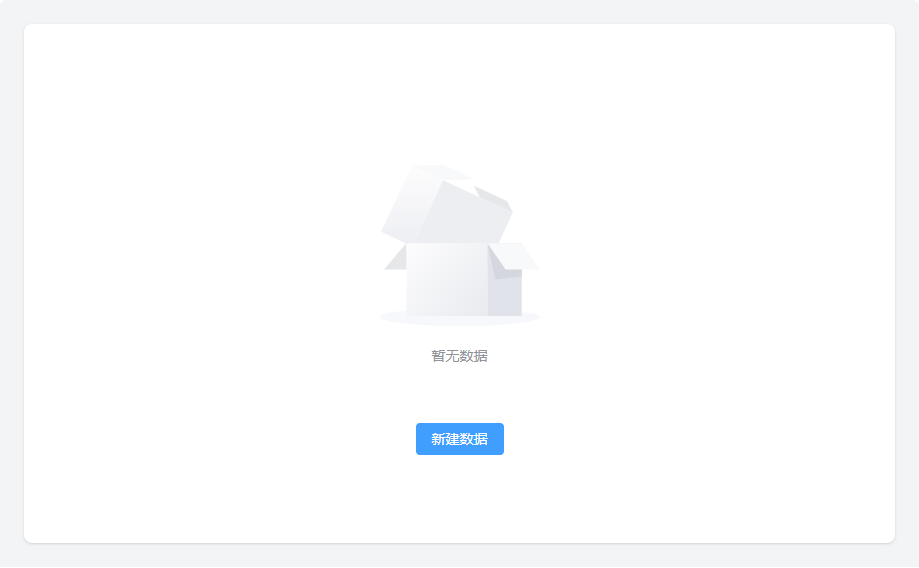

------

## 七、表格增强

### 表格容器（滚动 / 固定高度）

**简单功能描述：**
后台常用「表格容器」，支持固定高度 + 内容滚动 + 表头固定

------

```vue
<template>
  <div class="p-6 bg-gray-100">
    <!-- p-6: 内边距 1.5rem -->
    <!-- bg-gray-100: 浅灰背景 -->

    <!-- 表格卡片 -->
    <div class="bg-white rounded-lg shadow-sm p-4">
      <!-- bg-white: 白色背景 -->
      <!-- rounded-lg: 大圆角 -->
      <!-- shadow-sm: 小阴影 -->
      <!-- p-4: 内边距 1rem -->

      <!-- 表格容器 -->
      <div class="h-96 overflow-auto">
        <!-- h-96: 高度 24rem -->
        <!-- overflow-auto: 内容超出显示滚动条 -->

        <el-table
          :data="tableData"
          border
          style="width: 100%"
        >
          <!-- border: 带边框 -->

          <el-table-column prop="name" label="姓名" width="120" />
          <el-table-column prop="email" label="邮箱" />
          <el-table-column prop="role" label="角色" width="120" />
          <el-table-column prop="date" label="创建时间" width="180" />

          <el-table-column label="操作" width="160">
            <template #default>
              <el-button size="small">查看</el-button>
              <el-button size="small" type="primary">编辑</el-button>
            </template>
          </el-table-column>
        </el-table>
      </div>
    </div>
  </div>
</template>

<script setup lang="ts">
interface Row {
  name: string
  email: string
  role: string
  date: string
}

const tableData: Row[] = Array.from({ length: 20 }).map((_, i) => ({
  name: `用户${i + 1}`,
  email: `user${i + 1}@test.com`,
  role: i % 2 === 0 ? '管理员' : '普通用户',
  date: '2026-03-20'
}))
</script>

<style lang="scss" scoped>
/* 固定表头（ElementPlus 默认支持，增强滚动体验） */
:deep(.el-table__body-wrapper) {
  max-height: 100%; /* 限制高度 */
}
</style>
```

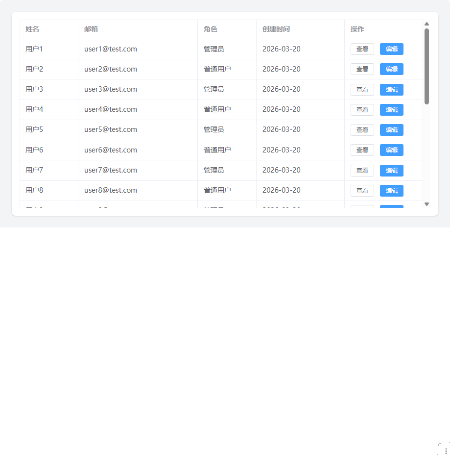

------

### 行 hover 效果

**简单功能描述：**
表格行 Hover 高亮（背景色 + 过渡动画），提升数据可读性

------

```vue
<template>
  <div class="p-6 bg-gray-100">
    <!-- p-6: 内边距 1.5rem -->
    <!-- bg-gray-100: 浅灰背景 -->

    <!-- 表格卡片 -->
    <div class="bg-white rounded-lg shadow-sm p-4">
      <!-- bg-white: 白色背景 -->
      <!-- rounded-lg: 大圆角 -->
      <!-- shadow-sm: 小阴影 -->
      <!-- p-4: 内边距 1rem -->

      <el-table
        :data="tableData"
        border
        class="w-full"
      >
        <!-- w-full: 宽度 100% -->

        <el-table-column prop="name" label="姓名" width="120" />
        <el-table-column prop="email" label="邮箱" />
        <el-table-column prop="role" label="角色" width="120" />
        <el-table-column prop="date" label="创建时间" width="180" />

        <el-table-column label="操作" width="160">
          <template #default>
            <el-button size="small">查看</el-button>
            <el-button size="small" type="primary">编辑</el-button>
          </template>
        </el-table-column>
      </el-table>
    </div>
  </div>
</template>

<script setup lang="ts">
interface Row {
  name: string
  email: string
  role: string
  date: string
}

const tableData: Row[] = Array.from({ length: 10 }).map((_, i) => ({
  name: `用户${i + 1}`,
  email: `user${i + 1}@test.com`,
  role: i % 2 === 0 ? '管理员' : '普通用户',
  date: '2026-03-20'
}))
</script>

<style lang="scss" scoped>
/* 行 hover 高亮 */
:deep(.el-table__body tr) {
  transition: background-color 0.2s; /* 背景过渡 */
}

:deep(.el-table__body tr:hover) {
  background-color: #f5f7fa; /* hover 背景色 */
}
</style>
```

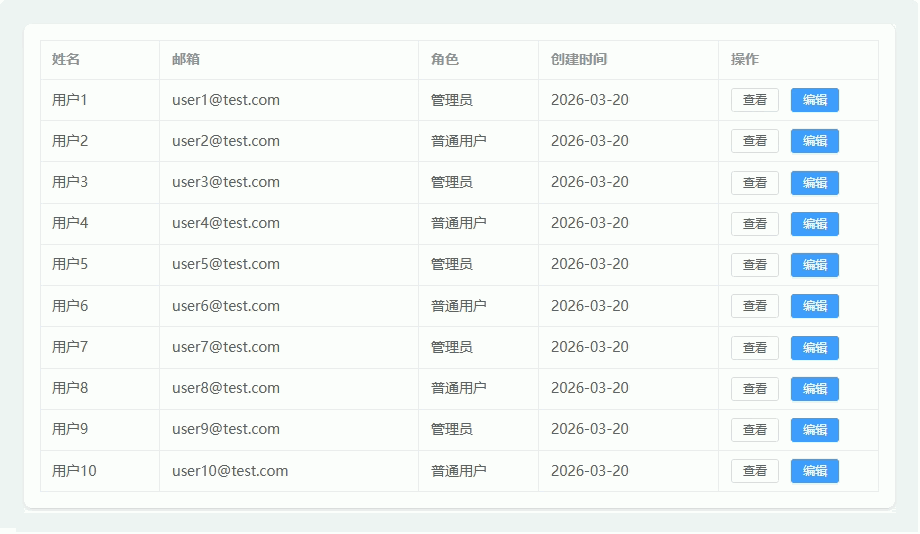

------

### 条纹表格（斑马纹）

**简单功能描述：**
表格隔行背景（斑马纹），提升可读性，支持 hover 效果叠加

------

```vue
<template>
  <div class="p-6 bg-gray-100">
    <!-- p-6: 内边距 1.5rem -->
    <!-- bg-gray-100: 浅灰背景 -->

    <!-- 表格卡片 -->
    <div class="bg-white rounded-lg shadow-sm p-4">
      <!-- bg-white: 白色背景 -->
      <!-- rounded-lg: 大圆角 -->
      <!-- shadow-sm: 小阴影 -->
      <!-- p-4: 内边距 1rem -->

      <el-table
        :data="tableData"
        border
        class="w-full"
      >
        <!-- w-full: 宽度 100% -->

        <el-table-column prop="name" label="姓名" width="120" />
        <el-table-column prop="email" label="邮箱" />
        <el-table-column prop="role" label="角色" width="120" />
        <el-table-column prop="date" label="创建时间" width="180" />

        <el-table-column label="操作" width="160">
          <template #default>
            <el-button size="small">查看</el-button>
            <el-button size="small" type="primary">编辑</el-button>
          </template>
        </el-table-column>
      </el-table>
    </div>
  </div>
</template>

<script setup lang="ts">
interface Row {
  name: string
  email: string
  role: string
  date: string
}

const tableData: Row[] = Array.from({ length: 12 }).map((_, i) => ({
  name: `用户${i + 1}`,
  email: `user${i + 1}@test.com`,
  role: i % 2 === 0 ? '管理员' : '普通用户',
  date: '2026-03-20'
}))
</script>

<style lang="scss" scoped>
/* 斑马纹 */
:deep(.el-table__body tr:nth-child(odd)) {
  background-color: #fafafa; /* 奇数行背景 */
}

/* hover 覆盖斑马纹 */
:deep(.el-table__body tr:hover) {
  background-color: #f5f7fa; /* hover 背景 */
  transition: background-color 0.2s; /* 过渡动画 */
}
</style>
```

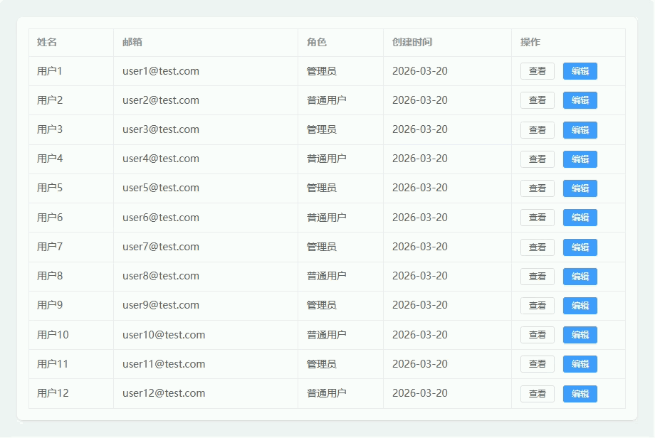

------

### 状态颜色标识

**简单功能描述：**
表格中使用 Tag + 语义颜色展示状态（成功 / 警告 / 失败 / 禁用）

------

```vue
<template>
  <div class="p-6 bg-gray-100">
    <!-- p-6: 内边距 1.5rem -->
    <!-- bg-gray-100: 浅灰背景 -->

    <!-- 表格卡片 -->
    <div class="bg-white rounded-lg shadow-sm p-4">
      <!-- bg-white: 白色背景 -->
      <!-- rounded-lg: 大圆角 -->
      <!-- shadow-sm: 小阴影 -->
      <!-- p-4: 内边距 1rem -->

      <el-table
          :data="tableData"
          border
          class="w-full"
      >
        <!-- w-full: 宽度 100% -->

        <el-table-column prop="name" label="名称" width="160" />
        <el-table-column prop="type" label="类型" width="120" />

        <!-- 状态列 -->
        <el-table-column label="状态">
          <template #default="{ row }">
            <el-tag
                :type="getTagType(row.status)"
                effect="light"
                class="px-2 py-1"
            >
              <!-- px-2: 左右内边距 0.5rem -->
              <!-- py-1: 上下内边距 0.25rem -->
              {{ getStatusText(row.status) }}
            </el-tag>
          </template>
        </el-table-column>

        <el-table-column prop="date" label="更新时间" width="180" />

        <!-- 操作 -->
        <el-table-column label="操作" width="160">
          <template #default>
            <el-button size="small">查看</el-button>
            <el-button size="small" type="primary">编辑</el-button>
          </template>
        </el-table-column>
      </el-table>
    </div>
  </div>
</template>

<script setup lang="ts">
interface Row {
  name: string
  type: string
  status: number
  date: string
}

const tableData: Row[] = [
  { name: '订单A', type: '订单', status: 1, date: '2026-03-20' },
  { name: '订单B', type: '订单', status: 2, date: '2026-03-20' },
  { name: '订单C', type: '订单', status: 3, date: '2026-03-20' },
  { name: '订单D', type: '订单', status: 0, date: '2026-03-20' }
]

const getTagType = (status: number) => {
  switch (status) {
    case 1:
      return 'success'
    case 2:
      return 'warning'
    case 3:
      return 'danger'
    default:
      return 'info'
  }
}

const getStatusText = (status: number) => {
  switch (status) {
    case 1:
      return '正常'
    case 2:
      return '待处理'
    case 3:
      return '异常'
    default:
      return '禁用'
  }
}
</script>

<style lang="scss" scoped>
</style>
```

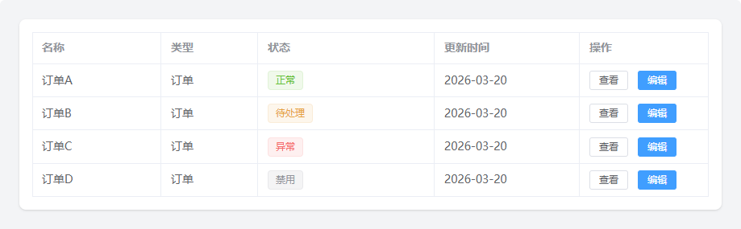

------

### 操作列布局优化

**简单功能描述：**
优化表格操作列（按钮组 + 间距 + 收纳更多操作 Dropdown）

------

```vue
<template>
  <div class="p-6 bg-gray-100">
    <!-- p-6: 内边距 1.5rem -->
    <!-- bg-gray-100: 浅灰背景 -->

    <!-- 表格卡片 -->
    <div class="bg-white rounded-lg shadow-sm p-4">
      <!-- bg-white: 白色背景 -->
      <!-- rounded-lg: 大圆角 -->
      <!-- shadow-sm: 小阴影 -->
      <!-- p-4: 内边距 1rem -->

      <el-table
          :data="tableData"
          border
          class="w-full"
      >
        <!-- w-full: 宽度 100% -->

        <el-table-column prop="name" label="名称" width="160" />
        <el-table-column prop="type" label="类型" width="120" />
        <el-table-column prop="date" label="更新时间" />

        <!-- 操作列 -->
        <el-table-column label="操作" width="220" fixed="right">
          <template #default>
            <div class="flex items-center gap-2">
              <!-- flex: 使用 flex 布局 -->
              <!-- items-center: 垂直居中 -->
              <!-- gap-2: 间距 0.5rem -->

              <el-button size="small" type="primary">
                编辑
              </el-button>

              <el-button size="small">
                查看
              </el-button>

              <!-- 更多操作 -->
              <el-dropdown>
                <span
                    class="flex items-center cursor-pointer text-gray-500 hover:text-gray-700"
                >
                  <!-- flex: 使用 flex 布局 -->
                  <!-- items-center: 垂直居中 -->
                  <!-- cursor-pointer: 鼠标手型 -->
                  <!-- text-gray-500: 灰色文字 -->
                  <!-- hover:text-gray-700: hover 深灰色 -->

                  更多
                  <el-icon class="ml-1">
                    <!-- ml-1: 左边距 0.25rem -->
                    <arrow-down />
                  </el-icon>
                </span>

                <template #dropdown>
                  <el-dropdown-menu>
                    <el-dropdown-item>删除</el-dropdown-item>
                    <el-dropdown-item>禁用</el-dropdown-item>
                    <el-dropdown-item>重置密码</el-dropdown-item>
                  </el-dropdown-menu>
                </template>
              </el-dropdown>
            </div>
          </template>
        </el-table-column>
      </el-table>
    </div>
  </div>
</template>

<script setup lang="ts">
import { ArrowDown } from '@element-plus/icons-vue'

interface Row {
  name: string
  type: string
  date: string
}

const tableData: Row[] = [
  { name: '用户A', type: '管理员', date: '2026-03-20' },
  { name: '用户B', type: '普通用户', date: '2026-03-20' },
  { name: '用户C', type: '访客', date: '2026-03-20' }
]
</script>

<style lang="scss" scoped>
</style>
```

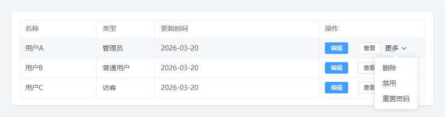

------

## 八、弹窗与浮层

### Dialog 内容布局优化

**简单功能描述：**
优化 Dialog 内部布局（头部标题 + 表单区 + 操作区固定底部），适用于新增/编辑弹窗

------

```vue
<template>
  <div class="p-6 bg-gray-100">
    <!-- p-6: 内边距 1.5rem -->
    <!-- bg-gray-100: 浅灰背景 -->

    <el-button type="primary" @click="visible = true">
      打开弹窗
    </el-button>

    <!-- Dialog -->
    <el-dialog
        v-model="visible"
        title="新增用户"
        width="600px"
        destroy-on-close
    >
      <!-- 内容容器 -->
      <div class="flex flex-col h-[500px]">
        <!-- flex: 使用 flex 布局 -->
        <!-- flex-col: 垂直排列 -->
        <!-- h-[500px]: 高度 500px -->

        <!-- 表单区域（可滚动） -->
        <div class="flex-1 overflow-auto pr-2">
          <!-- flex-1: 占满剩余空间 -->
          <!-- overflow-auto: 超出滚动 -->
          <!-- pr-2: 右内边距 0.5rem -->

          <el-form :model="form" label-width="80px" class="space-y-4">
            <!-- space-y-4: 子元素垂直间距 1rem -->

            <el-form-item label="用户名">
              <el-input v-model="form.username" />
            </el-form-item>

            <el-form-item label="邮箱">
              <el-input v-model="form.email" />
            </el-form-item>

            <el-form-item label="角色">
              <el-select v-model="form.role" class="w-full">
                <!-- w-full: 宽度 100% -->
                <el-option label="管理员" value="admin" />
                <el-option label="用户" value="user" />
              </el-select>
            </el-form-item>

            <el-form-item label="备注">
              <el-input
                  v-model="form.remark"
                  type="textarea"
                  :rows="4"
              />
            </el-form-item>
          </el-form>
        </div>

        <!-- 底部操作区 -->
        <div class="flex justify-end gap-2 pt-4 border-t mt-4">
          <!-- flex: 使用 flex 布局 -->
          <!-- justify-end: 右对齐 -->
          <!-- gap-2: 间距 0.5rem -->
          <!-- pt-4: 上内边距 1rem -->
          <!-- border-t: 上边框 -->
          <!-- mt-4: 上外边距 1rem -->

          <el-button @click="visible = false">取消</el-button>

          <el-button type="primary" :loading="loading">
            确定
          </el-button>
        </div>
      </div>
    </el-dialog>
  </div>
</template>

<script setup lang="ts">
import { reactive, ref } from 'vue'

const visible = ref(false)
const loading = ref(false)

const form = reactive({
  username: '',
  email: '',
  role: '',
  remark: ''
})
</script>

<style lang="scss" scoped>
</style>
```

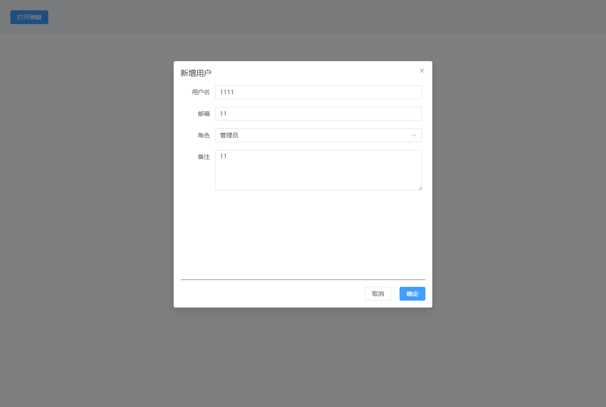

------

### Drawer 抽屉布局

**简单功能描述：**
后台常用「抽屉侧边编辑面板」，支持表单滚动 + 底部操作区固定

------

```vue
<template>
  <div class="p-6 bg-gray-100">
    <!-- p-6: 内边距 1.5rem -->
    <!-- bg-gray-100: 浅灰背景 -->

    <el-button type="primary" @click="visible = true">
      打开抽屉
    </el-button>

    <!-- Drawer -->
    <el-drawer
      v-model="visible"
      title="编辑用户"
      size="500px"
      destroy-on-close
    >
      <!-- 内容容器 -->
      <div class="flex flex-col h-full">
        <!-- flex: 使用 flex 布局 -->
        <!-- flex-col: 垂直排列 -->
        <!-- h-full: 高度 100% -->

        <!-- 表单区域（滚动） -->
        <div class="flex-1 overflow-auto pr-2">
          <!-- flex-1: 占满剩余空间 -->
          <!-- overflow-auto: 超出滚动 -->
          <!-- pr-2: 右内边距 0.5rem -->

          <el-form :model="form" label-width="80px" class="space-y-4">
            <!-- space-y-4: 子元素垂直间距 1rem -->

            <el-form-item label="用户名">
              <el-input v-model="form.username" />
            </el-form-item>

            <el-form-item label="邮箱">
              <el-input v-model="form.email" />
            </el-form-item>

            <el-form-item label="角色">
              <el-select v-model="form.role" class="w-full">
                <!-- w-full: 宽度 100% -->
                <el-option label="管理员" value="admin" />
                <el-option label="用户" value="user" />
              </el-select>
            </el-form-item>

            <el-form-item label="备注">
              <el-input
                v-model="form.remark"
                type="textarea"
                rows="4"
              />
            </el-form-item>
          </el-form>
        </div>

        <!-- 底部操作区 -->
        <div class="flex justify-end gap-2 pt-4 border-t mt-4">
          <!-- flex: 使用 flex 布局 -->
          <!-- justify-end: 右对齐 -->
          <!-- gap-2: 间距 0.5rem -->
          <!-- pt-4: 上内边距 1rem -->
          <!-- border-t: 上边框 -->
          <!-- mt-4: 上外边距 1rem -->

          <el-button @click="visible = false">取消</el-button>

          <el-button type="primary" :loading="loading">
            保存
          </el-button>
        </div>
      </div>
    </el-drawer>
  </div>
</template>

<script setup lang="ts">
import { reactive, ref } from 'vue'

const visible = ref(false)
const loading = ref(false)

const form = reactive({
  username: '',
  email: '',
  role: '',
  remark: ''
})
</script>

<style lang="scss" scoped>
</style>
```

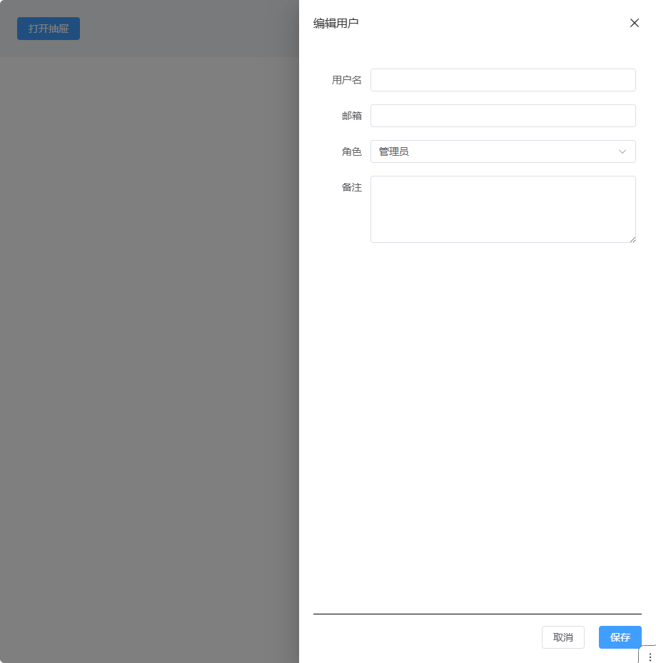

------

### Popover / Tooltip 样式增强

**简单功能描述：**
增强 Popover / Tooltip 样式（卡片化 + 阴影 + 间距 + 信息层级），适用于提示信息、操作说明

------

```vue
<template>
  <div class="p-6 bg-gray-100 flex items-center gap-6">
    <!-- p-6: 内边距 1.5rem -->
    <!-- bg-gray-100: 浅灰背景 -->
    <!-- flex: 使用 flex 布局 -->
    <!-- items-center: 垂直居中 -->
    <!-- gap-6: 间距 1.5rem -->

    <!-- Tooltip -->
    <el-tooltip content="这是一个提示信息" placement="top">
      <el-button>
        提示按钮
      </el-button>
    </el-tooltip>

    <!-- Popover -->
    <el-popover
      placement="bottom"
      width="240"
      trigger="click"
      popper-class="custom-popover"
    >
      <!-- 触发元素 -->
      <template #reference>
        <el-button type="primary">
          更多信息
        </el-button>
      </template>

      <!-- 内容 -->
      <div class="flex flex-col gap-2">
        <!-- flex: 使用 flex 布局 -->
        <!-- flex-col: 垂直排列 -->
        <!-- gap-2: 间距 0.5rem -->

        <div class="text-sm font-medium text-gray-800">
          <!-- text-sm: 字体大小 0.875rem -->
          <!-- font-medium: 中等加粗 -->
          <!-- text-gray-800: 深灰色 -->
          操作说明
        </div>

        <div class="text-xs text-gray-500 leading-relaxed">
          <!-- text-xs: 字体大小 0.75rem -->
          <!-- text-gray-500: 灰色 -->
          <!-- leading-relaxed: 行高较宽松 -->
          点击按钮可进行更多操作，如删除、禁用等。
        </div>

        <div class="flex justify-end gap-2 mt-2">
          <!-- flex: 使用 flex 布局 -->
          <!-- justify-end: 右对齐 -->
          <!-- gap-2: 间距 0.5rem -->
          <!-- mt-2: 上边距 0.5rem -->

          <el-button size="small">取消</el-button>
          <el-button size="small" type="primary">确定</el-button>
        </div>
      </div>
    </el-popover>
  </div>
</template>

<script setup lang="ts">
</script>

<style lang="scss" scoped>
/* Popover 卡片化 */
:deep(.custom-popover) {
  border-radius: 10px; /* 圆角 */
  padding: 12px; /* 内边距 */
  box-shadow: 0 8px 20px rgba(0, 0, 0, 0.08); /* 阴影 */
}

/* Tooltip 样式增强 */
:deep(.el-tooltip__popper) {
  border-radius: 6px; /* 圆角 */
  font-size: 12px; /* 字体 */
  padding: 6px 10px; /* 内边距 */
}
</style>
```

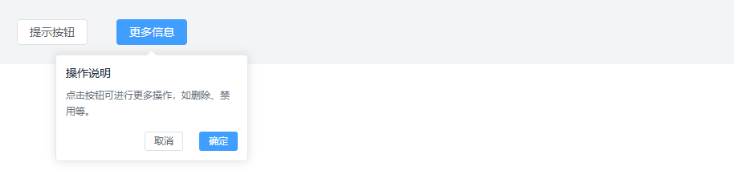

------

### 遮罩层自定义

**简单功能描述：**
自定义页面遮罩层（Loading + 半透明遮罩 + 内容居中），用于全局加载 / 提交中状态

------

```vue
<template>
  <div class="p-6 bg-gray-100 min-h-screen relative">
    <!-- p-6: 内边距 1.5rem -->
    <!-- bg-gray-100: 浅灰背景 -->
    <!-- min-h-screen: 最小高度 100vh -->
    <!-- relative: 相对定位（用于遮罩定位） -->

    <!-- 内容区域 -->
    <div class="bg-white rounded-lg shadow-sm p-6">
      <!-- bg-white: 白色背景 -->
      <!-- rounded-lg: 大圆角 -->
      <!-- shadow-sm: 小阴影 -->
      <!-- p-6: 内边距 1.5rem -->

      <div class="flex justify-between items-center mb-4">
        <!-- flex: 使用 flex 布局 -->
        <!-- justify-between: 两端对齐 -->
        <!-- items-center: 垂直居中 -->
        <!-- mb-4: 下边距 1rem -->

        <div class="text-lg font-semibold text-gray-800">
          <!-- text-lg: 字体大小 1.125rem -->
          <!-- font-semibold: 半加粗 -->
          <!-- text-gray-800: 深灰色 -->
          页面内容
        </div>

        <el-button type="primary" @click="handleLoad">
          模拟加载
        </el-button>
      </div>

      <p class="text-sm text-gray-600">
        <!-- text-sm: 字体大小 0.875rem -->
        <!-- text-gray-600: 灰色 -->
        这里是页面主体内容区域...
      </p>
    </div>

    <!-- 自定义遮罩 -->
    <div
      v-if="loading"
      class="absolute inset-0 bg-black bg-opacity-40 flex items-center justify-center z-50"
    >
      <!-- absolute: 绝对定位 -->
      <!-- inset-0: 上下左右 0 -->
      <!-- bg-black: 黑色背景 -->
      <!-- bg-opacity-40: 透明度 40% -->
      <!-- flex: 使用 flex 布局 -->
      <!-- items-center: 垂直居中 -->
      <!-- justify-center: 水平居中 -->
      <!-- z-50: 层级 50 -->

      <!-- Loading 内容 -->
      <div class="bg-white rounded-lg shadow-lg px-6 py-4 flex items-center gap-3">
        <!-- bg-white: 白色背景 -->
        <!-- rounded-lg: 大圆角 -->
        <!-- shadow-lg: 大阴影 -->
        <!-- px-6: 左右内边距 1.5rem -->
        <!-- py-4: 上下内边距 1rem -->
        <!-- flex: 使用 flex 布局 -->
        <!-- items-center: 垂直居中 -->
        <!-- gap-3: 间距 0.75rem -->

        <el-icon class="animate-spin text-blue-500 text-xl">
          <!-- animate-spin: 旋转动画 -->
          <!-- text-blue-500: 蓝色 -->
          <!-- text-xl: 字体大小 1.25rem -->
          <loading />
        </el-icon>

        <span class="text-sm text-gray-700">
          <!-- text-sm: 字体大小 0.875rem -->
          <!-- text-gray-700: 灰色 -->
          数据加载中...
        </span>
      </div>
    </div>
  </div>
</template>

<script setup lang="ts">
import { ref } from 'vue'
import { Loading } from '@element-plus/icons-vue'

const loading = ref(false)

const handleLoad = () => {
  loading.value = true
  setTimeout(() => {
    loading.value = false
  }, 2000)
}
</script>

<style lang="scss" scoped>
</style>
```

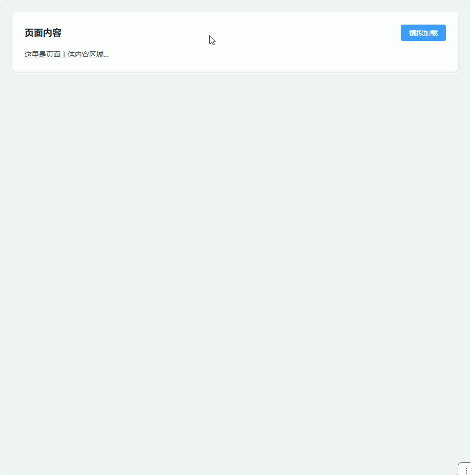

------

## 九、动画与过渡

### Hover 动画（缩放 / 阴影）

**简单功能描述：**
卡片 Hover 动效（轻微放大 + 阴影增强），用于列表/卡片提升交互感

------

```vue
<template>
  <div class="p-6 bg-gray-100">
    <!-- p-6: 内边距 1.5rem -->
    <!-- bg-gray-100: 浅灰背景 -->

    <!-- 卡片列表 -->
    <div class="grid grid-cols-1 md:grid-cols-2 lg:grid-cols-3 gap-6">
      <!-- grid: 使用 grid 布局 -->
      <!-- grid-cols-1: 默认 1 列 -->
      <!-- md:grid-cols-2: 中屏 2 列 -->
      <!-- lg:grid-cols-3: 大屏 3 列 -->
      <!-- gap-6: 间距 1.5rem -->

      <div
        v-for="item in list"
        :key="item.id"
        class="bg-white rounded-xl shadow-sm p-4 transition-all duration-300 transform hover:scale-105 hover:shadow-xl"
      >
        <!-- bg-white: 白色背景 -->
        <!-- rounded-xl: 超大圆角 -->
        <!-- shadow-sm: 初始小阴影 -->
        <!-- p-4: 内边距 1rem -->
        <!-- transition-all: 所有属性过渡 -->
        <!-- duration-300: 动画时长 300ms -->
        <!-- transform: 启用 transform -->
        <!-- hover:scale-105: hover 放大 1.05 倍 -->
        <!-- hover:shadow-xl: hover 大阴影 -->

        <!-- 标题 -->
        <div class="text-base font-semibold text-gray-900 mb-2">
          <!-- text-base: 字体大小 1rem -->
          <!-- font-semibold: 半加粗 -->
          <!-- text-gray-900: 深灰色 -->
          <!-- mb-2: 下边距 0.5rem -->
          {{ item.title }}
        </div>

        <!-- 内容 -->
        <div class="text-sm text-gray-600 mb-4">
          <!-- text-sm: 字体大小 0.875rem -->
          <!-- text-gray-600: 灰色 -->
          <!-- mb-4: 下边距 1rem -->
          {{ item.desc }}
        </div>

        <!-- 按钮 -->
        <el-button size="small" type="primary">
          查看
        </el-button>
      </div>
    </div>
  </div>
</template>

<script setup lang="ts">
interface CardItem {
  id: number
  title: string
  desc: string
}

const list: CardItem[] = [
  { id: 1, title: '用户模块', desc: '用户管理相关功能' },
  { id: 2, title: '订单模块', desc: '订单处理与管理' },
  { id: 3, title: '商品模块', desc: '商品信息维护' }
]
</script>

<style lang="scss" scoped>
</style>
```

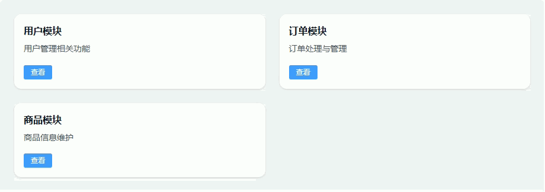

------

### 过渡动画（transition）

**简单功能描述：**
使用 Vue `<transition>` + TailwindCSS 实现元素显示/隐藏过渡（缩放 + 透明度）

------

```vue
<template>
  <div class="p-6 bg-gray-100 min-h-screen">
    <!-- p-6: 内边距 1.5rem -->
    <!-- bg-gray-100: 浅灰背景 -->
    <!-- min-h-screen: 最小高度 100vh -->

    <div class="bg-white rounded-lg shadow-sm p-6">
      <!-- bg-white: 白色背景 -->
      <!-- rounded-lg: 大圆角 -->
      <!-- shadow-sm: 小阴影 -->
      <!-- p-6: 内边距 1.5rem -->

      <div class="flex justify-between items-center mb-4">
        <!-- flex: 使用 flex 布局 -->
        <!-- justify-between: 两端对齐 -->
        <!-- items-center: 垂直居中 -->
        <!-- mb-4: 下边距 1rem -->

        <div class="text-lg font-semibold text-gray-800">
          <!-- text-lg: 字体大小 1.125rem -->
          <!-- font-semibold: 半加粗 -->
          <!-- text-gray-800: 深灰色 -->
          过渡动画示例
        </div>

        <el-button type="primary" @click="visible = !visible">
          切换内容
        </el-button>
      </div>

      <!-- 过渡 -->
      <transition name="fade-scale">
        <div
          v-if="visible"
          class="p-4 bg-blue-50 border border-blue-200 rounded-lg"
        >
          <!-- p-4: 内边距 1rem -->
          <!-- bg-blue-50: 浅蓝背景 -->
          <!-- border: 边框 -->
          <!-- border-blue-200: 浅蓝边框 -->
          <!-- rounded-lg: 圆角 -->

          <div class="text-sm text-gray-700">
            <!-- text-sm: 字体大小 0.875rem -->
            <!-- text-gray-700: 灰色 -->
            这是一个带过渡动画的内容区域
          </div>
        </div>
      </transition>
    </div>
  </div>
</template>

<script setup lang="ts">
import { ref } from 'vue'

const visible = ref(true)
</script>

<style lang="scss" scoped>
/* 进入前 */
.fade-scale-enter-from {
  opacity: 0; /* 透明 */
  transform: scale(0.95); /* 缩小 */
}

/* 进入中 */
.fade-scale-enter-active {
  transition: all 0.3s ease; /* 过渡 */
}

/* 进入后 */
.fade-scale-enter-to {
  opacity: 1; /* 显示 */
  transform: scale(1); /* 正常大小 */
}

/* 离开前 */
.fade-scale-leave-from {
  opacity: 1;
  transform: scale(1);
}

/* 离开中 */
.fade-scale-leave-active {
  transition: all 0.2s ease;
}

/* 离开后 */
.fade-scale-leave-to {
  opacity: 0;
  transform: scale(0.95);
}
</style>
```

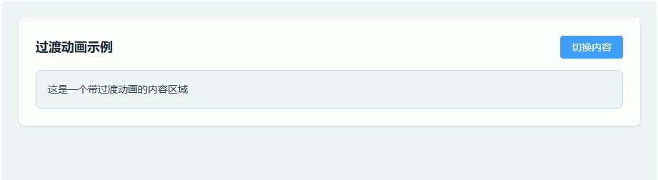

------

### 淡入淡出（fade）

**简单功能描述：**
使用 Vue `<transition>` 实现基础淡入淡出动画（透明度变化）

------

```vue
<template>
  <div class="p-6 bg-gray-100 min-h-screen">
    <!-- p-6: 内边距 1.5rem -->
    <!-- bg-gray-100: 浅灰背景 -->
    <!-- min-h-screen: 最小高度 100vh -->

    <div class="bg-white rounded-lg shadow-sm p-6">
      <!-- bg-white: 白色背景 -->
      <!-- rounded-lg: 大圆角 -->
      <!-- shadow-sm: 小阴影 -->
      <!-- p-6: 内边距 1.5rem -->

      <div class="flex justify-between items-center mb-4">
        <!-- flex: 使用 flex 布局 -->
        <!-- justify-between: 两端对齐 -->
        <!-- items-center: 垂直居中 -->
        <!-- mb-4: 下边距 1rem -->

        <div class="text-lg font-semibold text-gray-800">
          <!-- text-lg: 字体大小 1.125rem -->
          <!-- font-semibold: 半加粗 -->
          <!-- text-gray-800: 深灰色 -->
          淡入淡出动画
        </div>

        <el-button type="primary" @click="visible = !visible">
          切换显示
        </el-button>
      </div>

      <!-- fade 动画 -->
      <transition name="fade">
        <div
          v-if="visible"
          class="p-4 bg-green-50 border border-green-200 rounded-lg"
        >
          <!-- p-4: 内边距 1rem -->
          <!-- bg-green-50: 浅绿背景 -->
          <!-- border: 边框 -->
          <!-- border-green-200: 浅绿边框 -->
          <!-- rounded-lg: 圆角 -->

          <div class="text-sm text-gray-700">
            <!-- text-sm: 字体大小 0.875rem -->
            <!-- text-gray-700: 灰色 -->
            这是一个淡入淡出的内容区域
          </div>
        </div>
      </transition>
    </div>
  </div>
</template>

<script setup lang="ts">
import { ref } from 'vue'

const visible = ref(true)
</script>

<style lang="scss" scoped>
/* 进入 */
.fade-enter-from {
  opacity: 0;
}

.fade-enter-active {
  transition: opacity 0.3s ease;
}

.fade-enter-to {
  opacity: 1;
}

/* 离开 */
.fade-leave-from {
  opacity: 1;
}

.fade-leave-active {
  transition: opacity 0.2s ease;
}

.fade-leave-to {
  opacity: 0;
}
</style>
```

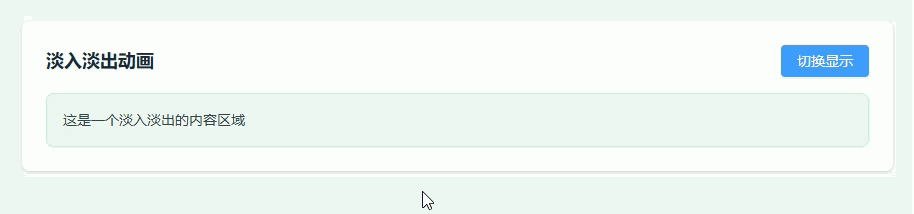

------

### 滑入滑出（slide）

**简单功能描述：**
使用 Vue `<transition>` 实现滑入滑出动画（位移 + 透明度），适用于面板展开/收起

------

```vue
<template>
  <div class="p-6 bg-gray-100 min-h-screen">
    <!-- p-6: 内边距 1.5rem -->
    <!-- bg-gray-100: 浅灰背景 -->
    <!-- min-h-screen: 最小高度 100vh -->

    <div class="bg-white rounded-lg shadow-sm p-6">
      <!-- bg-white: 白色背景 -->
      <!-- rounded-lg: 大圆角 -->
      <!-- shadow-sm: 小阴影 -->
      <!-- p-6: 内边距 1.5rem -->

      <div class="flex justify-between items-center mb-4">
        <!-- flex: 使用 flex 布局 -->
        <!-- justify-between: 两端对齐 -->
        <!-- items-center: 垂直居中 -->
        <!-- mb-4: 下边距 1rem -->

        <div class="text-lg font-semibold text-gray-800">
          <!-- text-lg: 字体大小 1.125rem -->
          <!-- font-semibold: 半加粗 -->
          <!-- text-gray-800: 深灰色 -->
          滑入滑出动画
        </div>

        <el-button type="primary" @click="visible = !visible">
          切换面板
        </el-button>
      </div>

      <!-- slide 动画 -->
      <transition name="slide-y">
        <div
          v-if="visible"
          class="p-4 bg-purple-50 border border-purple-200 rounded-lg"
        >
          <!-- p-4: 内边距 1rem -->
          <!-- bg-purple-50: 浅紫背景 -->
          <!-- border: 边框 -->
          <!-- border-purple-200: 浅紫边框 -->
          <!-- rounded-lg: 圆角 -->

          <div class="text-sm text-gray-700">
            <!-- text-sm: 字体大小 0.875rem -->
            <!-- text-gray-700: 灰色 -->
            这是一个滑入滑出的内容区域
          </div>
        </div>
      </transition>
    </div>
  </div>
</template>

<script setup lang="ts">
import { ref } from 'vue'

const visible = ref(true)
</script>

<style lang="scss" scoped>
/* 进入 */
.slide-y-enter-from {
  opacity: 0;
  transform: translateY(-10px); /* 上方进入 */
}

.slide-y-enter-active {
  transition: all 0.3s ease;
}

.slide-y-enter-to {
  opacity: 1;
  transform: translateY(0);
}

/* 离开 */
.slide-y-leave-from {
  opacity: 1;
  transform: translateY(0);
}

.slide-y-leave-active {
  transition: all 0.2s ease;
}

.slide-y-leave-to {
  opacity: 0;
  transform: translateY(-10px);
}
</style>
```

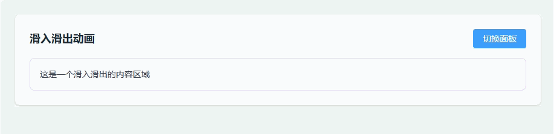

------

### 加载动画（spinner）

**简单功能描述：**
自定义 Spinner 加载动画（旋转图标 + 遮罩 + 内嵌 loading），适用于局部/全局加载

------

```vue
<template>
  <div class="p-6 bg-gray-100 min-h-screen">
    <!-- p-6: 内边距 1.5rem -->
    <!-- bg-gray-100: 浅灰背景 -->
    <!-- min-h-screen: 最小高度 100vh -->

    <!-- 内容卡片 -->
    <div class="bg-white rounded-lg shadow-sm p-6 relative">
      <!-- bg-white: 白色背景 -->
      <!-- rounded-lg: 大圆角 -->
      <!-- shadow-sm: 小阴影 -->
      <!-- p-6: 内边距 1.5rem -->
      <!-- relative: 相对定位 -->

      <!-- 标题 -->
      <div class="flex justify-between items-center mb-4">
        <!-- flex: 使用 flex 布局 -->
        <!-- justify-between: 两端对齐 -->
        <!-- items-center: 垂直居中 -->
        <!-- mb-4: 下边距 1rem -->

        <div class="text-lg font-semibold text-gray-800">
          <!-- text-lg: 字体大小 1.125rem -->
          <!-- font-semibold: 半加粗 -->
          <!-- text-gray-800: 深灰色 -->
          Spinner 加载动画
        </div>

        <el-button type="primary" @click="handleLoad">
          开始加载
        </el-button>
      </div>

      <!-- 内容区域 -->
      <div class="text-sm text-gray-600">
        <!-- text-sm: 字体大小 0.875rem -->
        <!-- text-gray-600: 灰色 -->
        这里是数据内容区域...
      </div>

      <!-- 局部 Spinner -->
      <div
        v-if="loading"
        class="absolute inset-0 bg-white bg-opacity-70 flex items-center justify-center z-10"
      >
        <!-- absolute: 绝对定位 -->
        <!-- inset-0: 填满容器 -->
        <!-- bg-white: 白色背景 -->
        <!-- bg-opacity-70: 透明度 70% -->
        <!-- flex: 使用 flex 布局 -->
        <!-- items-center: 垂直居中 -->
        <!-- justify-center: 水平居中 -->
        <!-- z-10: 层级 -->

        <div class="flex flex-col items-center gap-3">
          <!-- flex: 使用 flex 布局 -->
          <!-- flex-col: 垂直排列 -->
          <!-- items-center: 居中 -->
          <!-- gap-3: 间距 0.75rem -->

          <!-- Spinner -->
          <div class="w-8 h-8 border-4 border-blue-500 border-t-transparent rounded-full animate-spin"></div>
          <!-- w-8: 宽度 2rem -->
          <!-- h-8: 高度 2rem -->
          <!-- border-4: 边框 4px -->
          <!-- border-blue-500: 蓝色边框 -->
          <!-- border-t-transparent: 上边透明（形成缺口） -->
          <!-- rounded-full: 圆形 -->
          <!-- animate-spin: 旋转动画 -->

          <div class="text-sm text-gray-700">
            <!-- text-sm: 字体大小 0.875rem -->
            <!-- text-gray-700: 灰色 -->
            加载中...
          </div>
        </div>
      </div>
    </div>

    <!-- 全局 Spinner -->
    <div
      v-if="globalLoading"
      class="fixed inset-0 bg-black bg-opacity-40 flex items-center justify-center z-50"
    >
      <!-- fixed: 固定定位 -->
      <!-- inset-0: 全屏 -->
      <!-- bg-black: 黑色背景 -->
      <!-- bg-opacity-40: 透明度 40% -->
      <!-- flex: 使用 flex 布局 -->
      <!-- items-center: 垂直居中 -->
      <!-- justify-center: 水平居中 -->
      <!-- z-50: 层级 -->

      <div class="bg-white rounded-lg px-6 py-4 flex items-center gap-3 shadow-lg">
        <!-- bg-white: 白色背景 -->
        <!-- rounded-lg: 圆角 -->
        <!-- px-6: 左右内边距 1.5rem -->
        <!-- py-4: 上下内边距 1rem -->
        <!-- flex: 使用 flex 布局 -->
        <!-- items-center: 垂直居中 -->
        <!-- gap-3: 间距 0.75rem -->
        <!-- shadow-lg: 大阴影 -->

        <div class="w-6 h-6 border-4 border-blue-500 border-t-transparent rounded-full animate-spin"></div>
        <!-- w-6: 宽度 1.5rem -->
        <!-- h-6: 高度 1.5rem -->
        <!-- border-4: 边框 -->
        <!-- border-blue-500: 蓝色 -->
        <!-- border-t-transparent: 上透明 -->
        <!-- rounded-full: 圆形 -->
        <!-- animate-spin: 旋转 -->

        <span class="text-sm text-gray-700">
          <!-- text-sm: 字体大小 0.875rem -->
          <!-- text-gray-700: 灰色 -->
          全局加载中...
        </span>
      </div>
    </div>
  </div>
</template>

<script setup lang="ts">
import { ref } from 'vue'

const loading = ref(false)
const globalLoading = ref(false)

const handleLoad = () => {
  loading.value = true
  globalLoading.value = true

  setTimeout(() => {
    loading.value = false
  }, 2000)

  setTimeout(() => {
    globalLoading.value = false
  }, 3000)
}
</script>

<style lang="scss" scoped>
</style>
```

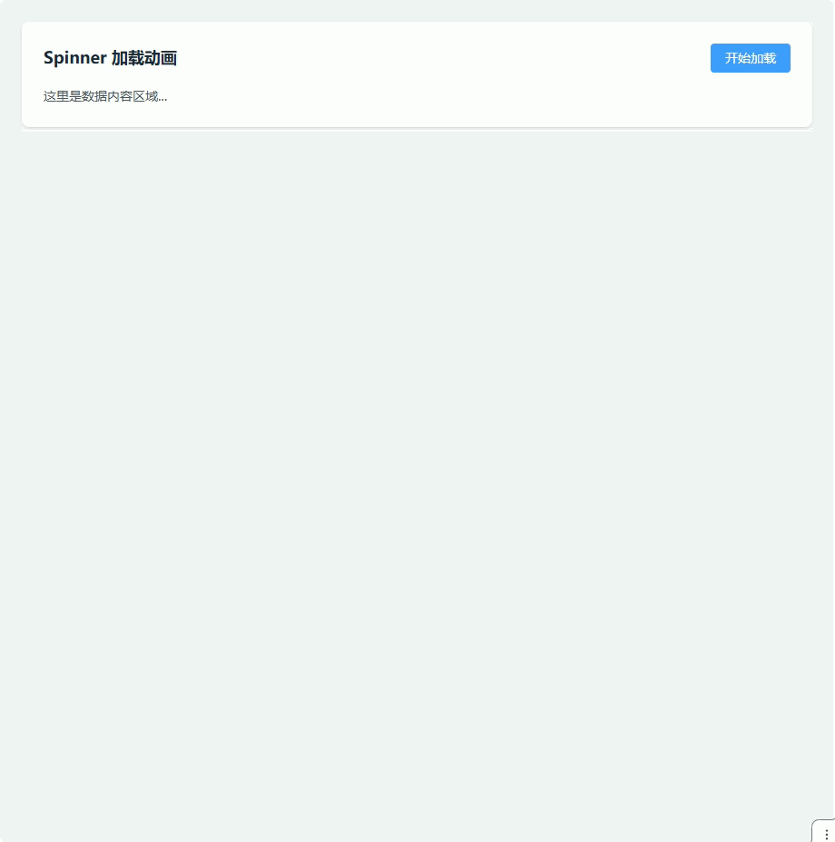

------

## 十、响应式设计

### 断点用法（sm / md / lg / xl）

👉 后台用户管理页面：不同断点下调整表单布局、按钮排列、表格间距

```vue
<template>
  <div class="p-4">
    <!-- p-4: 内边距 1rem -->

    <!-- 查询表单 -->
    <el-card class="mb-4">
      <!-- mb-4: 下外边距 1rem -->

      <div
        class="
          grid
          grid-cols-1
          sm:grid-cols-2
          md:grid-cols-3
          lg:grid-cols-4
          gap-4
        "
      >
        <!-- grid: 使用 grid 布局 -->
        <!-- grid-cols-1: 默认 1 列 -->
        <!-- sm:grid-cols-2: ≥640px 两列 -->
        <!-- md:grid-cols-3: ≥768px 三列 -->
        <!-- lg:grid-cols-4: ≥1024px 四列 -->
        <!-- gap-4: 间距 1rem -->

        <el-input placeholder="用户名" />
        <el-input placeholder="手机号" />
        <el-select placeholder="状态">
          <el-option label="启用" value="1" />
          <el-option label="禁用" value="0" />
        </el-select>
        <el-date-picker type="daterange" />

        <!-- 操作按钮 -->
        <div
          class="
            col-span-1
            sm:col-span-2
            md:col-span-3
            lg:col-span-4
            flex
            flex-col
            sm:flex-row
            gap-2
            justify-end
          "
        >
          <!-- col-span-1: 默认占 1 列 -->
          <!-- sm:col-span-2: ≥640px 占 2 列 -->
          <!-- md:col-span-3: ≥768px 占 3 列 -->
          <!-- lg:col-span-4: ≥1024px 占 4 列 -->
          <!-- flex: 使用 flex 布局 -->
          <!-- flex-col: 默认纵向排列 -->
          <!-- sm:flex-row: ≥640px 横向排列 -->
          <!-- gap-2: 间距 0.5rem -->
          <!-- justify-end: 右对齐 -->

          <el-button type="primary">查询</el-button>
          <el-button>重置</el-button>
        </div>
      </div>
    </el-card>

    <!-- 表格区域 -->
    <el-card>
      <div
        class="
          flex
          flex-col
          md:flex-row
          md:items-center
          justify-between
          mb-4
          gap-2
        "
      >
        <!-- flex: 使用 flex 布局 -->
        <!-- flex-col: 默认纵向排列 -->
        <!-- md:flex-row: ≥768px 横向排列 -->
        <!-- md:items-center: ≥768px 垂直居中 -->
        <!-- justify-between: 两端对齐 -->
        <!-- mb-4: 下外边距 1rem -->
        <!-- gap-2: 间距 0.5rem -->

        <div
          class="
            text-base
            md:text-lg
            font-semibold
          "
        >
          <!-- text-base: 字体大小 1rem -->
          <!-- md:text-lg: ≥768px 字体 1.125rem -->
          <!-- font-semibold: 半粗体 -->

          用户列表
        </div>

        <div
          class="
            flex
            flex-wrap
            gap-2
          "
        >
          <!-- flex: 使用 flex 布局 -->
          <!-- flex-wrap: 自动换行 -->
          <!-- gap-2: 间距 0.5rem -->

          <el-button type="primary">新增</el-button>
          <el-button type="success">导出</el-button>
          <el-button type="danger">删除</el-button>
        </div>
      </div>

      <el-table :data="tableData" border>
        <el-table-column prop="name" label="用户名" />
        <el-table-column prop="phone" label="手机号" />
        <el-table-column prop="status" label="状态" />
      </el-table>
    </el-card>
  </div>
</template>

<script setup lang="ts">
import { ref } from 'vue'

interface User {
  name: string
  phone: string
  status: string
}

const tableData = ref<User[]>([
  { name: '张三', phone: '13800000000', status: '启用' },
  { name: '李四', phone: '13900000000', status: '禁用' }
])
</script>

<style lang="scss" scoped>
</style>
```

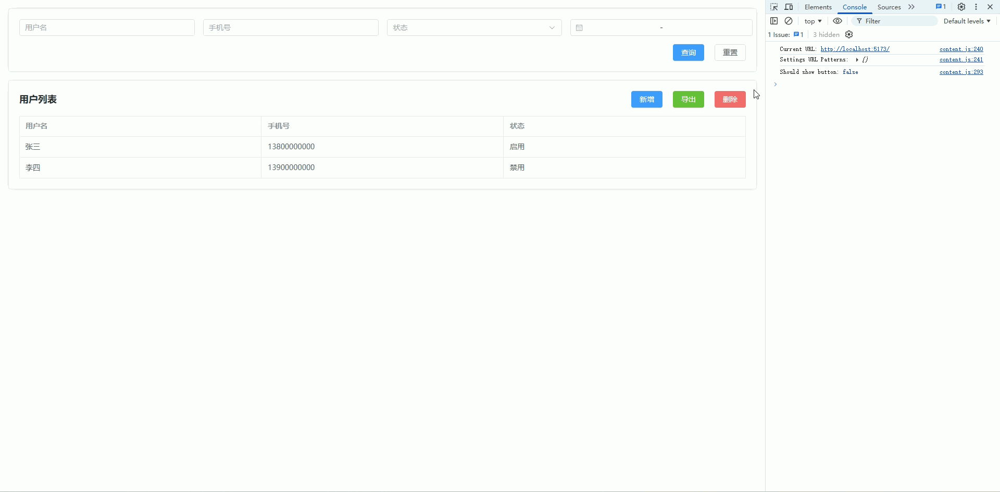

---

### 响应式布局切换

👉 后台统计卡片：移动端单列 → 平板两列 → 桌面四列

```vue
<template>
  <div class="p-4">
    <!-- p-4: 内边距 1rem -->

    <el-card>
      <!-- 统计卡片区域 -->
      <div
        class="
          grid
          grid-cols-1
          sm:grid-cols-2
          lg:grid-cols-4
          gap-4
        "
      >
        <!-- grid: 使用 grid 布局 -->
        <!-- grid-cols-1: 默认 1 列（移动端） -->
        <!-- sm:grid-cols-2: ≥640px 两列 -->
        <!-- lg:grid-cols-4: ≥1024px 四列 -->
        <!-- gap-4: 间距 1rem -->

        <!-- 卡片1 -->
        <div
          class="
            bg-white
            rounded-lg
            p-4
            shadow-sm
            hover:shadow-md
            transition
          "
        >
          <!-- bg-white: 白色背景 -->
          <!-- rounded-lg: 圆角 -->
          <!-- p-4: 内边距 1rem -->
          <!-- shadow-sm: 小阴影 -->
          <!-- hover:shadow-md: hover 时中等阴影 -->
          <!-- transition: 过渡动画 -->

          <div class="text-gray-500 text-sm mb-2">
            <!-- text-gray-500: 灰色文字 -->
            <!-- text-sm: 小号字体 -->
            <!-- mb-2: 下外边距 0.5rem -->
            用户总数
          </div>

          <div class="text-2xl font-bold">
            <!-- text-2xl: 字体 1.5rem -->
            <!-- font-bold: 加粗 -->
            12,345
          </div>
        </div>

        <!-- 卡片2 -->
        <div
          class="
            bg-white
            rounded-lg
            p-4
            shadow-sm
            hover:shadow-md
            transition
          "
        >
          <!-- 同上样式说明 -->
          <div class="text-gray-500 text-sm mb-2">今日新增</div>
          <div class="text-2xl font-bold text-green-600">
            <!-- text-green-600: 绿色文字 -->
            123
          </div>
        </div>

        <!-- 卡片3 -->
        <div
          class="
            bg-white
            rounded-lg
            p-4
            shadow-sm
            hover:shadow-md
            transition
          "
        >
          <div class="text-gray-500 text-sm mb-2">活跃用户</div>
          <div class="text-2xl font-bold text-blue-600">
            <!-- text-blue-600: 蓝色文字 -->
            8,765
          </div>
        </div>

        <!-- 卡片4 -->
        <div
          class="
            bg-white
            rounded-lg
            p-4
            shadow-sm
            hover:shadow-md
            transition
          "
        >
          <div class="text-gray-500 text-sm mb-2">转化率</div>
          <div class="text-2xl font-bold text-red-600">
            <!-- text-red-600: 红色文字 -->
            23%
          </div>
        </div>
      </div>
    </el-card>
  </div>
</template>

<script setup lang="ts">
</script>

<style lang="scss" scoped>
</style>
```

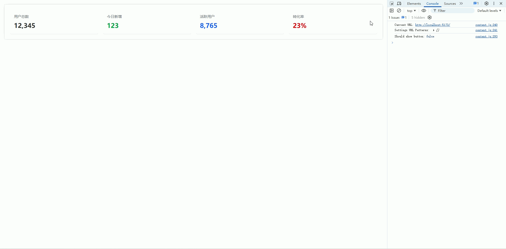

---

### 响应式隐藏 / 显示

👉 后台工具栏：移动端简化按钮（仅图标）→ 桌面端显示完整文字按钮

```vue
<template>
  <div class="p-4">
    <!-- p-4: 内边距 1rem -->

    <el-card>
      <!-- 顶部工具栏 -->
      <div
        class="
          flex
          items-center
          justify-between
          mb-4
        "
      >
        <!-- flex: 使用 flex 布局 -->
        <!-- items-center: 垂直居中 -->
        <!-- justify-between: 两端对齐 -->
        <!-- mb-4: 下外边距 1rem -->

        <!-- 标题 -->
        <div
          class="
            text-lg
            font-semibold
          "
        >
          <!-- text-lg: 字体 1.125rem -->
          <!-- font-semibold: 半粗体 -->
          用户管理
        </div>

        <!-- 操作区 -->
        <div
          class="
            flex
            items-center
            gap-2
          "
        >
          <!-- flex: 使用 flex 布局 -->
          <!-- items-center: 垂直居中 -->
          <!-- gap-2: 间距 0.5rem -->

          <!-- 桌面端按钮（带文字） -->
          <el-button
            type="primary"
            class="
              hidden
              sm:inline-flex
            "
          >
            <!-- hidden: 默认隐藏 -->
            <!-- sm:inline-flex: ≥640px 显示为行内 flex -->
            新增用户
          </el-button>

          <el-button
            type="success"
            class="
              hidden
              sm:inline-flex
            "
          >
            <!-- hidden: 默认隐藏 -->
            <!-- sm:inline-flex: ≥640px 显示 -->
            导出数据
          </el-button>

          <!-- 移动端按钮（仅图标） -->
          <el-button
            type="primary"
            circle
            class="
              inline-flex
              sm:hidden
            "
          >
            <!-- inline-flex: 默认显示 -->
            <!-- sm:hidden: ≥640px 隐藏 -->
            +
          </el-button>

          <el-button
            type="success"
            circle
            class="
              inline-flex
              sm:hidden
            "
          >
            <!-- inline-flex: 默认显示 -->
            <!-- sm:hidden: ≥640px 隐藏 -->
            ⬇
          </el-button>
        </div>
      </div>

      <!-- 表格 -->
      <el-table :data="tableData" border>
        <el-table-column prop="name" label="用户名" />
        <el-table-column prop="phone" label="手机号" />
        <el-table-column
          prop="email"
          label="邮箱"
          class-name="
            hidden
            md:table-cell
          "
        >
          <!-- hidden: 默认隐藏 -->
          <!-- md:table-cell: ≥768px 显示为表格单元格 -->
        </el-table-column>
        <el-table-column prop="status" label="状态" />
      </el-table>
    </el-card>
  </div>
</template>

<script setup lang="ts">
import { ref } from 'vue'

interface User {
  name: string
  phone: string
  email: string
  status: string
}

const tableData = ref<User[]>([
  { name: '张三', phone: '13800000000', email: 'a@test.com', status: '启用' },
  { name: '李四', phone: '13900000000', email: 'b@test.com', status: '禁用' }
])
</script>

<style lang="scss" scoped>
</style>
```

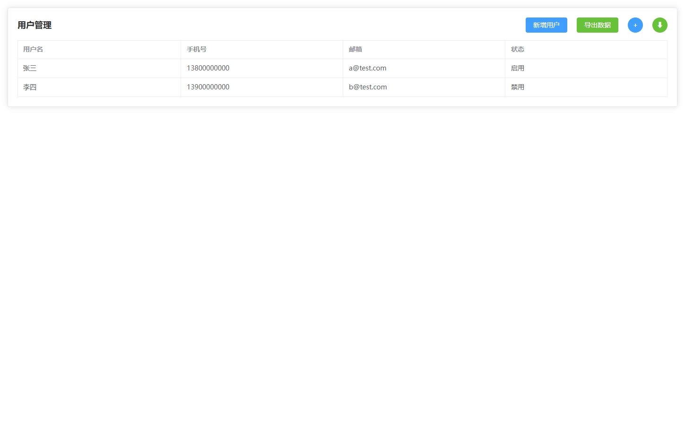

---

### 移动端适配优化

👉 后台列表页：移动端优化（间距压缩 + 按钮自适应 + 表格横向滚动）

```vue
<template>
  <div class="p-3 sm:p-4">
    <!-- p-3: 默认内边距 0.75rem（移动端更紧凑） -->
    <!-- sm:p-4: ≥640px 内边距 1rem -->

    <!-- 查询区 -->
    <el-card class="mb-3 sm:mb-4">
      <!-- mb-3: 默认下外边距 0.75rem -->
      <!-- sm:mb-4: ≥640px 下外边距 1rem -->

      <div
        class="
          flex
          flex-col
          sm:flex-row
          gap-2
        "
      >
        <!-- flex: 使用 flex 布局 -->
        <!-- flex-col: 默认纵向排列（移动端） -->
        <!-- sm:flex-row: ≥640px 横向排列 -->
        <!-- gap-2: 间距 0.5rem -->

        <el-input
          placeholder="请输入用户名"
          class="flex-1"
        />
        <!-- flex-1: 占满剩余空间 -->

        <div
          class="
            flex
            gap-2
          "
        >
          <!-- flex: 使用 flex 布局 -->
          <!-- gap-2: 间距 0.5rem -->

          <el-button
            type="primary"
            class="
              flex-1
              sm:flex-none
            "
          >
            <!-- flex-1: 移动端按钮自适应宽度 -->
            <!-- sm:flex-none: ≥640px 恢复自适应内容宽度 -->
            查询
          </el-button>

          <el-button
            class="
              flex-1
              sm:flex-none
            "
          >
            <!-- 同上 -->
            重置
          </el-button>
        </div>
      </div>
    </el-card>

    <!-- 表格区域 -->
    <el-card>
      <div
        class="
          overflow-x-auto
        "
      >
        <!-- overflow-x-auto: 横向超出滚动（移动端防止挤压） -->

        <div
          class="
            min-w-[600px]
          "
        >
          <!-- min-w-[600px]: 最小宽度 600px，保证表格不被压缩 -->

          <el-table :data="tableData" border>
            <el-table-column prop="name" label="用户名" width="120" />
            <el-table-column prop="phone" label="手机号" width="160" />
            <el-table-column prop="email" label="邮箱" width="200" />
            <el-table-column prop="status" label="状态" width="100" />

            <el-table-column label="操作" width="180">
              <template #default>
                <div
                  class="
                    flex
                    gap-1
                  "
                >
                  <!-- flex: 使用 flex 布局 -->
                  <!-- gap-1: 间距 0.25rem -->

                  <el-button size="small" type="primary">编辑</el-button>
                  <el-button size="small" type="danger">删除</el-button>
                </div>
              </template>
            </el-table-column>
          </el-table>
        </div>
      </div>
    </el-card>
  </div>
</template>

<script setup lang="ts">
import { ref } from 'vue'

interface User {
  name: string
  phone: string
  email: string
  status: string
}

const tableData = ref<User[]>([
  { name: '张三', phone: '13800000000', email: 'a@test.com', status: '启用' },
  { name: '李四', phone: '13900000000', email: 'b@test.com', status: '禁用' }
])
</script>

<style lang="scss" scoped>
</style>
```

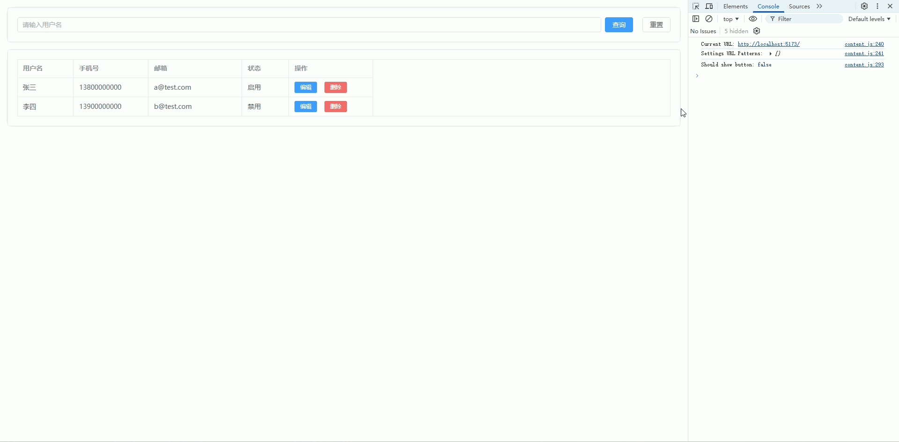

------

## 十一、主题与暗黑模式

### 暗黑模式（dark）

👉 后台页面：支持暗黑模式切换（卡片、文字、按钮自适应）

tailwind.config.js：darkMode: 'class'

import 'element-plus/theme-chalk/dark/css-vars.css'

```vue
<template>
  <div class="p-4 bg-gray-100 dark:bg-gray-900 min-h-screen">
    <!-- p-4: 内边距 1rem -->
    <!-- bg-gray-100: 浅色背景 -->
    <!-- dark:bg-gray-900: 暗黑模式背景 -->
    <!-- min-h-screen: 最小高度 100vh -->

    <!-- 顶部操作栏 -->
    <div
      class="
        flex
        justify-between
        items-center
        mb-4
      "
    >
      <!-- flex: 使用 flex 布局 -->
      <!-- justify-between: 两端对齐 -->
      <!-- items-center: 垂直居中 -->
      <!-- mb-4: 下外边距 1rem -->

      <div
        class="
          text-lg
          font-semibold
          text-gray-800
          dark:text-gray-100
        "
      >
        <!-- text-lg: 字体 1.125rem -->
        <!-- font-semibold: 半粗体 -->
        <!-- text-gray-800: 浅色模式文字 -->
        <!-- dark:text-gray-100: 暗黑模式文字 -->

        系统面板
      </div>

      <el-switch v-model="isDark" @change="toggleDark" />
    </div>

    <!-- 内容卡片 -->
    <el-card
      class="
        bg-white
        dark:bg-gray-800
        text-gray-800
        dark:text-gray-100
      "
    >
      <!-- bg-white: 浅色背景 -->
      <!-- dark:bg-gray-800: 暗黑背景 -->
      <!-- text-gray-800: 浅色文字 -->
      <!-- dark:text-gray-100: 暗黑文字 -->

      <div
        class="
          flex
          flex-col
          gap-4
        "
      >
        <!-- flex: 使用 flex 布局 -->
        <!-- flex-col: 垂直排列 -->
        <!-- gap-4: 间距 1rem -->

        <el-input placeholder="请输入内容" />

        <div
          class="
            flex
            gap-2
          "
        >
          <!-- flex: 使用 flex 布局 -->
          <!-- gap-2: 间距 0.5rem -->

          <el-button type="primary">提交</el-button>
          <el-button>取消</el-button>
        </div>

        <div
          class="
            p-4
            rounded-lg
            bg-gray-50
            dark:bg-gray-700
          "
        >
          <!-- p-4: 内边距 1rem -->
          <!-- rounded-lg: 圆角 -->
          <!-- bg-gray-50: 浅色背景 -->
          <!-- dark:bg-gray-700: 暗黑背景 -->

          这是一个支持暗黑模式的内容区域
        </div>
      </div>
    </el-card>
  </div>
</template>

<script setup lang="ts">
import { ref, onMounted } from 'vue'

const isDark = ref(false)

const toggleDark = () => {
  const html = document.documentElement
  if (isDark.value) {
    html.classList.add('dark')
  } else {
    html.classList.remove('dark')
  }
}

onMounted(() => {
  isDark.value = document.documentElement.classList.contains('dark')
})
</script>

<style lang="scss" scoped>
</style>
```

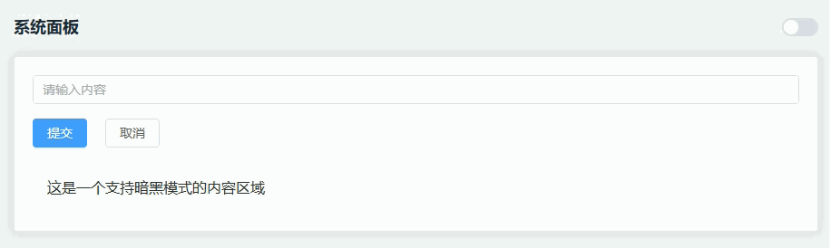

---

### 自定义主题色

👉 后台主题切换：支持动态切换主色（按钮 / 标签 / 高亮区域统一）

```vue
<template>
  <div class="p-4 bg-gray-100 min-h-screen">
    <!-- p-4: 内边距 1rem -->
    <!-- bg-gray-100: 浅灰背景 -->
    <!-- min-h-screen: 最小高度 100vh -->

    <!-- 主题色切换 -->
    <el-card class="mb-4">
      <!-- mb-4: 下外边距 1rem -->

      <div
        class="
          flex
          items-center
          gap-4
        "
      >
        <!-- flex: 使用 flex 布局 -->
        <!-- items-center: 垂直居中 -->
        <!-- gap-4: 间距 1rem -->

        <span class="text-gray-700">
          <!-- text-gray-700: 深灰文字 -->
          主题色：
        </span>

        <el-color-picker v-model="themeColor" @change="changeTheme" />
      </div>
    </el-card>

    <!-- 示例区域 -->
    <el-card>
      <div
        class="
          flex
          flex-col
          gap-4
        "
      >
        <!-- flex: 使用 flex 布局 -->
        <!-- flex-col: 垂直排列 -->
        <!-- gap-4: 间距 1rem -->

        <!-- 按钮 -->
        <div class="flex gap-2">
          <!-- flex: 使用 flex 布局 -->
          <!-- gap-2: 间距 0.5rem -->

          <el-button type="primary">主要按钮</el-button>
          <el-button>默认按钮</el-button>
        </div>

        <!-- 标签 -->
        <div class="flex gap-2">
          <!-- flex: 使用 flex 布局 -->
          <!-- gap-2: 间距 0.5rem -->

          <el-tag type="primary">标签</el-tag>
          <el-tag>默认</el-tag>
        </div>

        <!-- 自定义高亮块 -->
        <div
          class="
            p-4
            rounded-lg
            text-white
          "
          :style="{ backgroundColor: themeColor }"
        >
          <!-- p-4: 内边距 1rem -->
          <!-- rounded-lg: 圆角 -->
          <!-- text-white: 白色文字 -->

          当前主题色展示区域
        </div>
      </div>
    </el-card>
  </div>
</template>

<script setup lang="ts">
import { ref } from 'vue'

const themeColor = ref('#409EFF')

const changeTheme = (color: string) => {
  // 设置 CSS 变量（给 Tailwind / 自定义样式使用）
  document.documentElement.style.setProperty('--theme-color', color)

  // 动态修改 ElementPlus 主色
  document.documentElement.style.setProperty('--el-color-primary', color)
}
</script>

<style lang="scss" scoped>
</style>
```

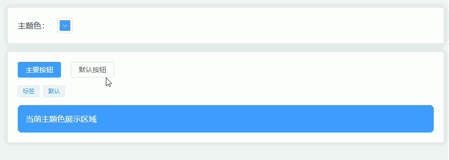

---

### CSS 变量结合 Tailwind

👉 后台主题系统：使用 CSS 变量驱动 Tailwind（支持动态主题色 + hover）

```vue
<template>
  <div class="p-4 bg-gray-100 min-h-screen">
    <!-- p-4: 内边距 1rem -->
    <!-- bg-gray-100: 浅灰背景 -->
    <!-- min-h-screen: 最小高度 100vh -->

    <!-- 主题色设置 -->
    <el-card class="mb-4">
      <!-- mb-4: 下外边距 1rem -->

      <div
        class="
          flex
          items-center
          gap-4
        "
      >
        <!-- flex: 使用 flex 布局 -->
        <!-- items-center: 垂直居中 -->
        <!-- gap-4: 间距 1rem -->

        <span class="text-gray-700">
          <!-- text-gray-700: 深灰文字 -->
          主题色：
        </span>

        <el-color-picker v-model="themeColor" @change="setTheme" />
      </div>
    </el-card>

    <!-- 示例区域 -->
    <el-card>
      <div
        class="
          flex
          flex-col
          gap-4
        "
      >
        <!-- flex: 使用 flex 布局 -->
        <!-- flex-col: 垂直排列 -->
        <!-- gap-4: 间距 1rem -->

        <!-- Tailwind + CSS变量按钮 -->
        <button
          class="
            px-4
            py-2
            rounded-lg
            text-white
            transition
          "
          :style="{
            backgroundColor: 'var(--theme-color)'
          }"
          @mouseenter="hover = true"
          @mouseleave="hover = false"
          :class="hover ? 'opacity-90' : ''"
        >
          <!-- px-4: 左右内边距 1rem -->
          <!-- py-2: 上下内边距 0.5rem -->
          <!-- rounded-lg: 圆角 -->
          <!-- text-white: 白色文字 -->
          <!-- transition: 过渡动画 -->
          <!-- opacity-90: 透明度 0.9 -->

          自定义主题按钮
        </button>

        <!-- 高亮区域 -->
        <div
          class="
            p-4
            rounded-lg
            text-white
          "
          :style="{
            backgroundColor: 'var(--theme-color)'
          }"
        >
          <!-- p-4: 内边距 1rem -->
          <!-- rounded-lg: 圆角 -->
          <!-- text-white: 白色文字 -->

          使用 CSS 变量驱动 Tailwind 的主题区域
        </div>
      </div>
    </el-card>
  </div>
</template>

<script setup lang="ts">
import { ref } from 'vue'

const themeColor = ref('#409EFF')
const hover = ref(false)

const setTheme = (color: string) => {
  document.documentElement.style.setProperty('--theme-color', color)
}
</script>

<style lang="scss" scoped>
</style>
```

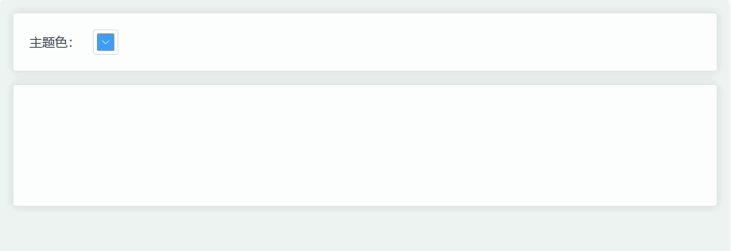

---

### ElementPlus + Tailwind 主题统一

👉 后台主题统一：ElementPlus 主色 + Tailwind 按钮 / 标签 / 高亮区域统一风格

```vue
<template>
  <div class="p-4 bg-gray-100 min-h-screen">
    <!-- p-4: 内边距 1rem -->
    <!-- bg-gray-100: 浅灰背景 -->
    <!-- min-h-screen: 最小高度 100vh -->

    <!-- 主题设置 -->
    <el-card class="mb-4">
      <!-- mb-4: 下外边距 1rem -->

      <div
        class="
          flex
          items-center
          gap-4
        "
      >
        <!-- flex: 使用 flex 布局 -->
        <!-- items-center: 垂直居中 -->
        <!-- gap-4: 间距 1rem -->

        <span class="text-gray-700">
          <!-- text-gray-700: 深灰文字 -->
          主题色：
        </span>

        <el-color-picker v-model="themeColor" @change="applyTheme" />
      </div>
    </el-card>

    <!-- 示例区域 -->
    <el-card>
      <div
        class="
          flex
          flex-col
          gap-4
        "
      >
        <!-- flex: 使用 flex 布局 -->
        <!-- flex-col: 垂直排列 -->
        <!-- gap-4: 间距 1rem -->

        <!-- ElementPlus 按钮 -->
        <div class="flex gap-2">
          <!-- flex: 使用 flex 布局 -->
          <!-- gap-2: 间距 0.5rem -->

          <el-button type="primary">Element 按钮</el-button>
          <el-button>默认按钮</el-button>
        </div>

        <!-- Tailwind 按钮 -->
        <div class="flex gap-2">
          <!-- flex: 使用 flex 布局 -->
          <!-- gap-2: 间距 0.5rem -->

          <button
            class="
              px-4
              py-2
              rounded-lg
              text-white
              transition
            "
            :style="{ backgroundColor: 'var(--theme-color)' }"
          >
            <!-- px-4: 左右内边距 1rem -->
            <!-- py-2: 上下内边距 0.5rem -->
            <!-- rounded-lg: 圆角 -->
            <!-- text-white: 白色文字 -->
            <!-- transition: 过渡动画 -->

            Tailwind 按钮
          </button>
        </div>

        <!-- 标签统一 -->
        <div class="flex gap-2">
          <!-- flex: 使用 flex 布局 -->
          <!-- gap-2: 间距 0.5rem -->

          <el-tag type="primary">Element Tag</el-tag>

          <span
            class="
              px-2
              py-1
              rounded
              text-white
              text-sm
            "
            :style="{ backgroundColor: 'var(--theme-color)' }"
          >
            <!-- px-2: 左右内边距 0.5rem -->
            <!-- py-1: 上下内边距 0.25rem -->
            <!-- rounded: 圆角 -->
            <!-- text-white: 白色文字 -->
            <!-- text-sm: 字体 0.875rem -->

            Tailwind Tag
          </span>
        </div>

        <!-- 高亮信息块 -->
        <div
          class="
            p-4
            rounded-lg
            text-white
          "
          :style="{ backgroundColor: 'var(--theme-color)' }"
        >
          <!-- p-4: 内边距 1rem -->
          <!-- rounded-lg: 圆角 -->
          <!-- text-white: 白色文字 -->

          ElementPlus 与 Tailwind 主题已统一
        </div>
      </div>
    </el-card>
  </div>
</template>

<script setup lang="ts">
import { ref } from 'vue'

const themeColor = ref('#409EFF')

const applyTheme = (color: string) => {
  // Tailwind 使用
  document.documentElement.style.setProperty('--theme-color', color)

  // ElementPlus 使用
  document.documentElement.style.setProperty('--el-color-primary', color)
}
</script>

<style lang="scss" scoped>
</style>
```

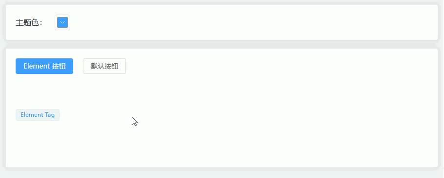

------

## 十二、进阶技巧

### class 合并（clsx / computed）

👉 后台按钮组件：根据状态（primary / disabled / loading）动态合并 Tailwind class

```vue
<template>
  <div class="p-4 bg-gray-100 min-h-screen">
    <!-- p-4: 内边距 1rem -->
    <!-- bg-gray-100: 浅灰背景 -->
    <!-- min-h-screen: 最小高度 100vh -->

    <el-card>
      <div
        class="
          flex
          flex-col
          gap-4
        "
      >
        <!-- flex: 使用 flex 布局 -->
        <!-- flex-col: 垂直排列 -->
        <!-- gap-4: 间距 1rem -->

        <!-- 控制区 -->
        <div class="flex gap-2">
          <!-- flex: 使用 flex 布局 -->
          <!-- gap-2: 间距 0.5rem -->

          <el-button @click="type = 'primary'">Primary</el-button>
          <el-button @click="type = 'default'">Default</el-button>
          <el-button @click="disabled = !disabled">切换禁用</el-button>
          <el-button @click="loading = !loading">切换加载</el-button>
        </div>

        <!-- 按钮展示 -->
        <button :class="btnClass">
          <span v-if="loading">加载中...</span>
          <span v-else>提交按钮</span>
        </button>
      </div>
    </el-card>
  </div>
</template>

<script setup lang="ts">
import { computed, ref } from 'vue'

type BtnType = 'primary' | 'default'

const type = ref<BtnType>('primary')
const disabled = ref(false)
const loading = ref(false)

// class 合并
const btnClass = computed(() => [
  // 基础样式
  'px-4', // px-4: 左右内边距 1rem
  'py-2', // py-2: 上下内边距 0.5rem
  'rounded-lg', // rounded-lg: 圆角
  'text-white', // text-white: 白色文字
  'transition', // transition: 过渡动画
  'flex', // flex: 使用 flex 布局
  'items-center', // items-center: 垂直居中
  'justify-center', // justify-center: 水平居中

  // 类型样式
  type.value === 'primary'
    ? 'bg-blue-600 hover:bg-blue-700' // bg-blue-600: 蓝色背景 | hover:bg-blue-700: hover 深蓝
    : 'bg-gray-500 hover:bg-gray-600', // bg-gray-500: 灰色背景 | hover:bg-gray-600: hover 深灰

  // 禁用状态
  disabled.value
    ? 'opacity-50 cursor-not-allowed' // opacity-50: 半透明 | cursor-not-allowed: 禁用鼠标
    : '',

  // 加载状态
  loading.value
    ? 'animate-pulse' // animate-pulse: 呼吸动画
    : ''
])
</script>

<style lang="scss" scoped>
</style>
```

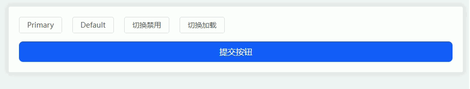

---

### 动态 class（Vue 绑定）

👉 后台列表：选中行高亮 + 状态标签动态颜色（success / danger）

```vue
<template>
  <div class="p-4 bg-gray-100 min-h-screen">
    <!-- p-4: 内边距 1rem -->
    <!-- bg-gray-100: 浅灰背景 -->
    <!-- min-h-screen: 最小高度 100vh -->

    <el-card>
      <div
        class="
          flex
          flex-col
          gap-4
        "
      >
        <!-- flex: 使用 flex 布局 -->
        <!-- flex-col: 垂直排列 -->
        <!-- gap-4: 间距 1rem -->

        <!-- 列表 -->
        <div
          class="
            divide-y
          "
        >
          <!-- divide-y: 子元素之间添加分割线 -->

          <div
            v-for="item in list"
            :key="item.id"
            @click="select(item)"
            :class="[
              'p-4 flex justify-between items-center cursor-pointer transition',
              selectedId === item.id
                ? 'bg-blue-50 border-l-4 border-blue-500'
                : 'bg-white hover:bg-gray-50'
            ]"
          >
            <!-- p-4: 内边距 1rem -->
            <!-- flex: 使用 flex 布局 -->
            <!-- justify-between: 两端对齐 -->
            <!-- items-center: 垂直居中 -->
            <!-- cursor-pointer: 鼠标手型 -->
            <!-- transition: 过渡动画 -->
            <!-- bg-blue-50: 浅蓝背景（选中） -->
            <!-- border-l-4: 左边框 4px -->
            <!-- border-blue-500: 蓝色边框 -->
            <!-- bg-white: 白色背景 -->
            <!-- hover:bg-gray-50: hover 浅灰 -->

            <div class="flex flex-col">
              <!-- flex: 使用 flex 布局 -->
              <!-- flex-col: 垂直排列 -->

              <span class="font-medium">
                <!-- font-medium: 中等加粗 -->
                {{ item.name }}
              </span>

              <span class="text-sm text-gray-500">
                <!-- text-sm: 字体 0.875rem -->
                <!-- text-gray-500: 灰色文字 -->
                {{ item.desc }}
              </span>
            </div>

            <!-- 状态标签 -->
            <span
              :class="[
                'px-2 py-1 rounded text-xs text-white',
                item.status === 'success'
                  ? 'bg-green-500'
                  : 'bg-red-500'
              ]"
            >
              <!-- px-2: 左右内边距 0.5rem -->
              <!-- py-1: 上下内边距 0.25rem -->
              <!-- rounded: 圆角 -->
              <!-- text-xs: 字体 0.75rem -->
              <!-- text-white: 白色文字 -->
              <!-- bg-green-500: 成功状态 -->
              <!-- bg-red-500: 失败状态 -->

              {{ item.status === 'success' ? '成功' : '失败' }}
            </span>
          </div>
        </div>
      </div>
    </el-card>
  </div>
</template>

<script setup lang="ts">
import { ref } from 'vue'

interface Item {
  id: number
  name: string
  desc: string
  status: 'success' | 'fail'
}

const selectedId = ref<number | null>(null)

const list = ref<Item[]>([
  { id: 1, name: '任务A', desc: '描述信息A', status: 'success' },
  { id: 2, name: '任务B', desc: '描述信息B', status: 'fail' },
  { id: 3, name: '任务C', desc: '描述信息C', status: 'success' }
])

const select = (item: Item) => {
  selectedId.value = item.id
}
</script>

<style lang="scss" scoped>
</style>
```

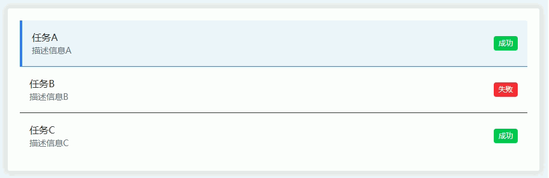

---

### Tailwind + Sass 混合使用

👉 后台卡片组件：Tailwind 做布局 + Sass 做可复用样式（统一卡片风格）

```vue
<template>
  <div class="p-4 bg-gray-100 min-h-screen">
    <!-- p-4: 内边距 1rem -->
    <!-- bg-gray-100: 浅灰背景 -->
    <!-- min-h-screen: 最小高度 100vh -->

    <div
      class="
        grid
        grid-cols-1
        sm:grid-cols-2
        lg:grid-cols-3
        gap-4
      "
    >
      <!-- grid: 使用 grid 布局 -->
      <!-- grid-cols-1: 默认 1 列 -->
      <!-- sm:grid-cols-2: ≥640px 两列 -->
      <!-- lg:grid-cols-3: ≥1024px 三列 -->
      <!-- gap-4: 间距 1rem -->

      <!-- 卡片 -->
      <div class="card">
        <div
          class="
            flex
            justify-between
            items-center
            mb-2
          "
        >
          <!-- flex: 使用 flex 布局 -->
          <!-- justify-between: 两端对齐 -->
          <!-- items-center: 垂直居中 -->
          <!-- mb-2: 下外边距 0.5rem -->

          <span class="font-semibold">
            <!-- font-semibold: 半粗体 -->
            订单统计
          </span>

          <el-button size="small">更多</el-button>
        </div>

        <div
          class="
            text-2xl
            font-bold
          "
        >
          <!-- text-2xl: 字体 1.5rem -->
          <!-- font-bold: 加粗 -->
          8,520
        </div>
      </div>

      <!-- 卡片 -->
      <div class="card card-success">
        <div class="flex justify-between items-center mb-2">
          <!-- 同上 -->
          <span class="font-semibold">收入</span>
          <el-button size="small">更多</el-button>
        </div>

        <div class="text-2xl font-bold">¥ 120,000</div>
      </div>

      <!-- 卡片 -->
      <div class="card card-warning">
        <div class="flex justify-between items-center mb-2">
          <span class="font-semibold">异常订单</span>
          <el-button size="small">更多</el-button>
        </div>

        <div class="text-2xl font-bold">23</div>
      </div>
    </div>
  </div>
</template>

<script setup lang="ts">
</script>

<style lang="scss" scoped>
// 基础卡片
.card {
  @apply bg-white p-4 rounded-lg shadow-sm transition; // Tailwind 混入
  // bg-white: 白色背景
  // p-4: 内边距 1rem
  // rounded-lg: 圆角
  // shadow-sm: 小阴影
  // transition: 过渡动画

  &:hover {
    @apply shadow-md; // hover 阴影增强
    // shadow-md: 中等阴影
  }
}

// 成功卡片
.card-success {
  border-left: 4px solid #16a34a; // 左边框绿色
}

// 警告卡片
.card-warning {
  border-left: 4px solid #f59e0b; // 左边框橙色
}
</style>
```

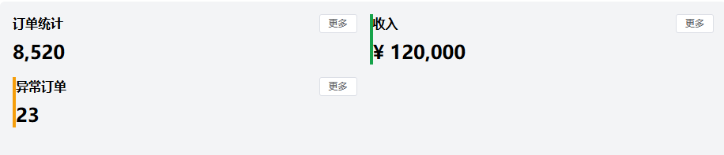

---

### 自定义指令结合 Tailwind

👉 后台按钮权限控制：无权限自动禁用 + Tailwind 样式控制（灰化 + 禁用态）

```vue
<template>
  <div class="p-4 bg-gray-100 min-h-screen">
    <!-- p-4: 内边距 1rem -->
    <!-- bg-gray-100: 浅灰背景 -->
    <!-- min-h-screen: 最小高度 100vh -->

    <el-card>
      <div
          class="
          flex
          flex-col
          gap-4
        "
      >
        <!-- flex: 使用 flex 布局 -->
        <!-- flex-col: 垂直排列 -->
        <!-- gap-4: 间距 1rem -->

        <!-- 按钮区 -->
        <div class="flex gap-2">
          <!-- flex: 使用 flex 布局 -->
          <!-- gap-2: 间距 0.5rem -->

          <!-- 有权限 -->
          <button
              v-permission="'add'"
              class="
              px-4
              py-2
              rounded-lg
              text-white
              bg-blue-600
              hover:bg-blue-700
              transition
            "
          >
            <!-- px-4: 左右内边距 1rem -->
            <!-- py-2: 上下内边距 0.5rem -->
            <!-- rounded-lg: 圆角 -->
            <!-- text-white: 白色文字 -->
            <!-- bg-blue-600: 蓝色背景 -->
            <!-- hover:bg-blue-700: hover 深蓝 -->
            <!-- transition: 过渡动画 -->

            新增
          </button>

          <!-- 无权限 -->
          <button
              v-permission="'delete'"
              class="
              px-4
              py-2
              rounded-lg
              text-white
              bg-red-600
              hover:bg-red-700
              transition
            "
          >
            <!-- px-4: 左右内边距 1rem -->
            <!-- py-2: 上下内边距 0.5rem -->
            <!-- rounded-lg: 圆角 -->
            <!-- text-white: 白色文字 -->
            <!-- bg-red-600: 红色背景 -->
            <!-- hover:bg-red-700: hover 深红 -->
            <!-- transition: 过渡动画 -->

            删除
          </button>
        </div>
      </div>
    </el-card>
  </div>
</template>

<script setup lang="ts">
import type { Directive } from 'vue'

// 模拟当前用户权限
const userPermissions = ['add']

// 自定义指令
const vPermission: Directive = {
  mounted(el, binding) {
    const value = binding.value

    if (!userPermissions.includes(value)) {
      // 无权限：禁用按钮 + Tailwind 样式控制
      el.classList.add(
          'opacity-50', // opacity-50: 半透明
          'cursor-not-allowed' // cursor-not-allowed: 禁用鼠标
      )

      el.setAttribute('disabled', 'true')

      // 移除 hover 效果
      el.classList.remove('hover:bg-red-700', 'hover:bg-blue-700')
    }
  }
}
</script>

<style lang="scss" scoped>
</style>
```

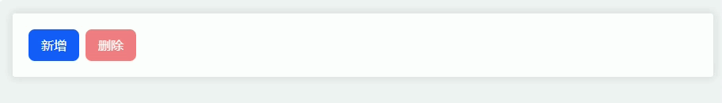

---

### 封装通用 UI 组件

👉 通用按钮组件：统一 Tailwind 风格 + 支持 type / loading / disabled（企业级复用）

```vue
<template>
  <div class="p-4 bg-gray-100 min-h-screen">
    <!-- p-4: 内边距 1rem -->
    <!-- bg-gray-100: 浅灰背景 -->
    <!-- min-h-screen: 最小高度 100vh -->

    <el-card>
      <div
        class="
          flex
          flex-col
          gap-4
        "
      >
        <!-- flex: 使用 flex 布局 -->
        <!-- flex-col: 垂直排列 -->
        <!-- gap-4: 间距 1rem -->

        <!-- 示例 -->
        <div class="flex gap-2">
          <!-- flex: 使用 flex 布局 -->
          <!-- gap-2: 间距 0.5rem -->

          <BaseButton type="primary">主要按钮</BaseButton>

          <BaseButton type="success">成功按钮</BaseButton>

          <BaseButton :loading="true">加载中</BaseButton>

          <BaseButton :disabled="true">禁用按钮</BaseButton>
        </div>
      </div>
    </el-card>
  </div>
</template>

<script setup lang="ts">
import { computed, defineComponent, h } from 'vue'

// 通用按钮组件
const BaseButton = defineComponent({
  name: 'BaseButton',
  props: {
    type: {
      type: String,
      default: 'default'
    },
    loading: Boolean,
    disabled: Boolean
  },
  setup(props, { slots }) {
    const btnClass = computed(() => [
      // 基础样式
      'px-4', // px-4: 左右内边距 1rem
      'py-2', // py-2: 上下内边距 0.5rem
      'rounded-lg', // rounded-lg: 圆角
      'text-white', // text-white: 白色文字
      'transition', // transition: 过渡动画
      'flex', // flex: 使用 flex 布局
      'items-center', // items-center: 垂直居中
      'justify-center', // justify-center: 水平居中

      // 类型
      props.type === 'primary'
        ? 'bg-blue-600 hover:bg-blue-700' // bg-blue-600: 蓝色背景 | hover:bg-blue-700: hover 深蓝
        : props.type === 'success'
        ? 'bg-green-600 hover:bg-green-700' // 绿色按钮
        : 'bg-gray-500 hover:bg-gray-600', // 默认灰色

      // 状态
      props.disabled
        ? 'opacity-50 cursor-not-allowed' // 禁用态
        : '',

      props.loading
        ? 'animate-pulse' // 加载动画
        : ''
    ])

    return () =>
      h(
        'button',
        {
          class: btnClass.value,
          disabled: props.disabled || props.loading
        },
        props.loading ? '加载中...' : slots.default?.()
      )
  }
})
</script>

<style lang="scss" scoped>
</style>
```

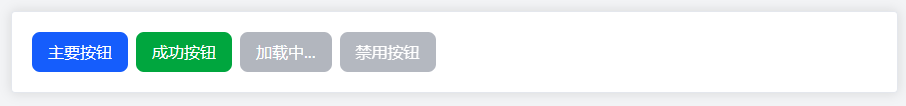