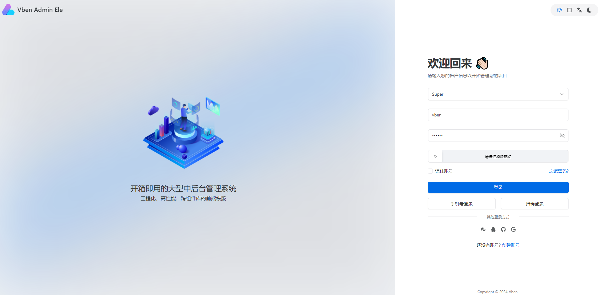

# Vben Admin 5 企业级管理系统框架

Vben Admin 5 是一套基于 Vue3、Vite、TypeScript 的现代化中后台管理框架，内置完善的权限体系、多主题布局、国际化、多标签页、数据展示组件等常用功能。项目采用模块化与配置化设计，支持快速二次开发，适合中后台系统、运营平台、管理控制台等场景。开发体验流畅、代码规范、生态完善。

- [官网地址](https://doc.vben.pro/)


## 当前环境

```
node: v22
pnpm: 10.12.4
```


## 启动项目

**获取源码**

```
git clone https://github.com/vbenjs/vue-vben-admin.git
cd vue-vben-admin
```

**切换到指定版本**

切换到 tag `v5.6.0` 并创建分支

```
git checkout -b v5.6.0_branch v5.6.0
```

**安装依赖**

如果已全局安装 pnpm：

```
pnpm install
```

> 💡 如果没有安装 pnpm，可以执行：
>
> ```
> corepack enable
> corepack prepare pnpm@10.12.4 --activate
> ```

**启动项目**

```
pnpm run dev:ele
```


## 修改配置

### 修改 ESLint 配置

编辑 `eslint.config.mjs`

```js
// @ts-check
import { defineConfig } from '@vben/eslint-config';

export default defineConfig([
  {
    rules: {
      'no-console': 'off',
      'no-debugger': 'off',

      '@typescript-eslint/no-explicit-any': 'off',

      '@typescript-eslint/no-unused-vars': [
        'warn',
        {
          argsIgnorePattern: '^_',
          varsIgnorePattern: '^_',
        },
      ],

      'vue/multi-word-component-names': 'off',
    },
  },
]);
```


## 应用精简

参考文档：[链接](https://doc.vben.pro/guide/introduction/thin.html)

**应用精简**

我这里使用的 UI 组件是 Element Plus，我先拷贝一份 `apps/web-ele` 应用为 `apps/ateng-web`

```
rm -rf apps/web-ele/node_modules
cp -r apps/web-ele apps/ateng-web
rm -rf apps/web-antd apps/web-ele apps/web-naive apps/web-tdesign 
```

修改应用名称

`apps/ateng-web/package.json`

```
"name": "@apps/ateng-web"
```

**其他精简**

如果你不需要演示代码，你可以直接删除 `playground` 文件夹。

```
rm -rf playground
```

如果你不需要文档，你可以直接删除`docs`文件夹。

```
rm -rf docs
```

如果你想更进一步精简，你可以删除参考以下文件或者文件夹的作用，判断自己是否需要，不需要删除即可：

```
rm -rf .changeset .github .vscode scripts/deploy
```

**命令调整**

在精简后，你可能需要根据你的项目调整命令，在根目录下的`package.json`文件中，你可以调整`scripts`字段，移除你不需要的命令。

```json
{
  "scripts": {
    "build:web": "pnpm run build --filter=@apps/ateng-web",
    "dev:web": "pnpm -F @apps/ateng-web run dev",
  }
}
```

**清理依赖**

```
pnpm clean
```

**安装依赖**

```
pnpm install
```

**启动项目**

```
pnpm run dev:web
```




## 组件适配

修改文件：`/src/adapter/component/index.ts`

1️⃣ **异步引入组件**
2️⃣ **在 ComponentType 中声明类型**
3️⃣ **在 components 映射中注册**

### 1. 引入 ElementPlus 组件

在文件顶部，和 `ElInput`、`ElSelectV2` 一样写。

```ts
const ElSlider = defineAsyncComponent(() =>
  Promise.all([
    import('element-plus/es/components/slider/index'),
    import('element-plus/es/components/slider/style/css'),
  ]).then(([res]) => res.ElSlider),
);
```

这里做了两件事：

1. **按需加载组件**
2. **按需加载样式**

这是 **Vben 推荐写法**，防止 UI 库打包过大。

------

### 2. 在 ComponentType 中声明

找到这里：

```ts
export type ComponentType =
```

添加一个类型：

```ts
| 'Slider'
```

变成：

```ts
export type ComponentType =
  | 'ApiSelect'
  | 'ApiTreeSelect'
  | 'Checkbox'
  | 'CheckboxGroup'
  | 'DatePicker'
  | 'Divider'
  | 'IconPicker'
  | 'Input'
  | 'InputNumber'
  | 'RadioGroup'
  | 'Select'
  | 'Slider'        // 新增
  | 'Space'
  | 'Switch'
  | 'TimePicker'
  | 'TreeSelect'
  | 'Upload'
  | BaseFormComponentType;
```

否则 **vben-form / vben-table** 会报类型错误。

------

### 3. 在 components 中注册

找到：

```ts
const components: Partial<Record<ComponentType, Component>> = {
```

加入：

```ts
Slider: ElSlider,
```

完整示例：

```ts
const components: Partial<Record<ComponentType, Component>> = {

  Input: withDefaultPlaceholder(ElInput, 'input'),

  InputNumber: withDefaultPlaceholder(ElInputNumber, 'input'),

  Slider: ElSlider,

  Select: (props, { attrs, slots }) => {
    return h(ElSelectV2, { ...props, attrs }, slots);
  },

}
```

------

### 4. 在 Vben Form 中使用

适配后可以直接在 **Vben Form** 使用：

```ts
{
  fieldName: 'progress',
  label: '进度',
  component: 'Slider',
  componentProps: {
    min: 0,
    max: 100,
  },
}
```


## 添加页面

参考文档：[链接](https://doc.vben.pro/guide/essentials/route.html)

**添加页面**

`src/views/system/user/index.vue`

```vue
<script lang="ts" setup>
import { Page } from '@vben/common-ui';
</script>

<template>
  <Page title="用户管理" description="Hello World 示例">
    Hello, Vben Admin with Element Plus! 👋
  </Page>
</template>
```

**添加路由**

`src/router/routes/modules/system.ts`

```ts
import type { RouteRecordRaw } from 'vue-router';

const routes: RouteRecordRaw[] = [
  {
    meta: {
      icon: 'ic:baseline-view-in-ar',
      keepAlive: true,
      order: 1000,
      title: '系统管理',
    },
    name: 'System',
    path: '/system',
    children: [
      {
        meta: {
          title: '用户管理',
        },
        name: 'user',
        path: '/system/user',
        component: () => import('#/views/system/user/index.vue'),
      },
    ],
  },
];

export default routes;
```


## 组件使用

### Page 常规页面组件

提供一个常规页面布局的组件，包括头部、内容区域、底部三个部分。

参考文档：[链接](https://doc.vben.pro/components/layout-ui/page.html)

#### 基础标题 + 描述 + 内容

```vue
<script setup lang="ts">
import { Page } from '@vben/common-ui';
</script>

<template>
  <Page title="用户管理" description="查看并操作用户信息">
    <div>
      这是主要内容。
    </div>
  </Page>
</template>
```

------

#### 头部右侧操作按钮（extra slot）

```vue
<script setup lang="ts">
import { Page } from '@vben/common-ui';
import { ElButton } from 'element-plus';

function handleAdd() {
  console.log('点击新增');
}
</script>

<template>
  <Page title="用户管理" description="带头部按钮">
    <template #extra>
      <ElButton type="primary" @click="handleAdd">新增用户</ElButton>
    </template>

    主体内容...
  </Page>
</template>
```

------

#### 自定义标题 / 描述 插槽

```vue
<script setup lang="ts">
import { Page } from '@vben/common-ui';
</script>

<template>
  <Page>
    <template #title>
      <span class="bg-indigo-600 text-white">📌 自定义标题</span>
    </template>
    <template #description>
      这里使用插槽定义了描述内容
    </template>

    页面内容
  </Page>
</template>
```

------

#### 底部 Footer 区域

设置了底部区域的插槽，主题内容区域的高度必须要有，不然部分内容会被覆盖

```vue
<script setup lang="ts">
import { Page } from '@vben/common-ui';

import { ElButton } from 'element-plus';
</script>

<template>
  <Page title="用户编辑" description="底部操作按钮示例">
    <div class="h-[400px] bg-blue-50">主体内容...</div>

    <template #footer>
      <div>
        <ElButton>取消</ElButton>
        <ElButton type="primary">保存</ElButton>
      </div>
    </template>
  </Page>
</template>
```

------

#### 不显示头部 — 纯内容

如果没有设置 `title`、`description` 或 `extra`，头部就不会渲染：

```vue
<script setup lang="ts">
import { Page } from '@vben/common-ui';
</script>

<template>
  <Page>
    纯内容页面，不渲染头部
  </Page>
</template>
```

------

#### Header 区域样式（`headerClass`）

用于给页面头部增加视觉强调，例如模块分隔、主题色块、信息提示等。

```vue
<script setup lang="ts">
import { Page } from '@vben/common-ui';
</script>

<template>
  <Page
    title="自定义 Header"
    description="用于强调标题和描述区域"
    header-class="bg-indigo-600 text-white px-6 py-4 shadow-lg rounded"
  >
    内容区域...
  </Page>
</template>
```

------

#### 内容区域样式（`contentClass`）

用于给内容区加背景、padding、卡片效果等，让主体内容更聚焦。

```vue
<script setup lang="ts">
import { Page } from '@vben/common-ui';
</script>

<template>
  <Page
    title="内容样式示例"
    content-class="p-8 bg-yellow-100 border-2 border-yellow-500 rounded-lg shadow-inner"
  >
    这是带背景 + 内边距 + 内阴影的内容区域
  </Page>
</template>
```

#### Footer 区域样式（`footerClass`）

常用于表单提交区域、审批确认按钮区、工具栏等底部操作区域。

```vue
<script setup lang="ts">
import { Page } from '@vben/common-ui';

import { ElButton } from 'element-plus';
</script>

<template>
  <Page
    title="底部操作示例"
    description="底部区域用于承载操作按钮"
    footer-class="bg-green-600 text-white px-6 py-3 flex justify-between items-center rounded shadow-md"
  >
    <div class="h-[400px] bg-blue-50">主体内容...</div>

    <template #footer>
      <span class="font-semibold">操作区：</span>
      <div class="space-x-2">
        <ElButton>取消</ElButton>
        <ElButton type="primary">确认</ElButton>
      </div>
    </template>
  </Page>
</template>
```

#### 自动撑满内容高度（autoContentHeight）

```vue
<script setup lang="ts">
import { Page } from '@vben/common-ui';
</script>

<template>
  <div class="h-[400px] border border-gray-300">
    <Page title="开启 autoContentHeight" auto-content-height>
      <div class="h-full bg-green-200">内容自动撑满高度</div>
    </Page>
  </div>
</template>
```

#### 双列布局（左右分栏）

```vue
<script setup lang="ts">
import { Page } from '@vben/common-ui';
</script>

<template>
  <Page title="双列布局示例" description="左侧为列表，右侧为详情">
    <div class="flex w-full gap-4">
      <!-- 左侧 -->
      <div
        class="min-h-[300px] w-1/3 rounded border border-gray-300 bg-gray-50 p-3"
      >
        <div class="mb-2 font-semibold">用户列表</div>
        <ul class="space-y-2">
          <li class="cursor-pointer rounded px-2 py-1 hover:bg-gray-200">
            用户 A
          </li>
          <li class="cursor-pointer rounded px-2 py-1 hover:bg-gray-200">
            用户 B
          </li>
          <li class="cursor-pointer rounded px-2 py-1 hover:bg-gray-200">
            用户 C
          </li>
        </ul>
      </div>

      <!-- 右侧 -->
      <div class="min-h-[300px] flex-1 rounded border border-gray-300 p-4">
        <div class="mb-2 font-semibold">详情区域</div>
        <p>在此显示用户的详细信息。</p>
      </div>
    </div>
  </Page>
</template>
```

------


### Form 表单

参考文档：[链接](https://doc.vben.pro/components/common-ui/vben-form.html)

#### 基础用法

```vue
<script lang="ts" setup>
import type { UploadUserFile } from 'element-plus';

import { h, toRaw } from 'vue';

import { Page } from '@vben/common-ui';

import dayjs from 'dayjs';
import { ElButton, ElCard, ElMessage, ElTag } from 'element-plus';

import { useVbenForm, z } from '#/adapter/form';

/**
 * 本地 Select 选项
 */
const selectOptions = [
  { label: '选项一', value: '1' },
  { label: '选项二', value: '2' },
];

/**
 * 本地 Tree 数据
 */
const treeOptions = [
  {
    label: '根节点',
    value: 'root',
    children: [
      {
        label: '子节点 1',
        value: 'child-1',
      },
      {
        label: '子节点 2',
        value: 'child-2',
      },
    ],
  },
];

const [BaseForm, baseFormApi] = useVbenForm({
  commonConfig: {
    colon: true,
    componentProps: {
      class: 'w-full',
    },
  },

  layout: 'horizontal',

  handleSubmit: onSubmit,

  schema: [
    {
      component: 'Input',
      fieldName: 'username',
      label: '用户名',
      rules: 'required',
      componentProps: {
        placeholder: '请输入用户名',
      },
    },
    {
      component: 'Input',
      fieldName: 'password',
      label: '密码',
      componentProps: {
        type: 'password',
      },
    },
    {
      component: 'Select',
      fieldName: 'select',
      label: '下拉选择',
      componentProps: {
        options: selectOptions,
        clearable: true,
        filterable: true,
        placeholder: '请选择',
      },
    },
    {
      component: 'TreeSelect',
      fieldName: 'treeSelect',
      label: '树选择',
      componentProps: {
        data: treeOptions,
        clearable: true,
        filterable: true,
      },
    },
    {
      component: 'CheckboxGroup',
      fieldName: 'checkboxGroup',
      label: '多选组',
      componentProps: {
        options: selectOptions,
      },
    },
    {
      component: 'Checkbox',
      fieldName: 'agree',
      label: '',
      renderComponentContent: () => ({
        default: () => ['我已阅读并同意'],
      }),
      rules: z.boolean().refine((v) => v, {
        message: '请先同意协议',
      }),
    },
    {
      component: 'DatePicker',
      fieldName: 'date',
      label: '日期选择',
      componentProps: {
        placeholder: '请选择日期',
      },
    },
    {
      component: 'DatePicker',
      fieldName: 'range',
      label: '日期范围',
      componentProps: {
        type: 'daterange',
        rangeSeparator: '-',
        startPlaceholder: '开始日期',
        endPlaceholder: '结束日期',
      },
    },
    {
      component: 'Upload',
      fieldName: 'files',
      label: '文件上传',
      componentProps: {
        listType: 'picture-card',
        maxCount: 1,
        /**
         * 本地模拟上传成功
         */
        onSuccess(_response: any, file: UploadUserFile) {
          file.status = 'success';
          file.url =
            'https://unpkg.com/@vbenjs/static-source@0.1.7/source/logo-v1.webp';
        },
      },
      rules: 'selectRequired',
    },
    {
      component: 'Switch',
      fieldName: 'enabled',
      label: '启用状态',
    },
    {
      component: 'InputNumber',
      fieldName: 'amount',
      label: '金额',
      suffix: () => '¥',
    },
    {
      component: 'Divider',
      fieldName: 'divider',
      renderComponentContent: () => ({
        default: () => h(ElTag, { type: 'info' }, () => '基础示例结束'),
      }),
    },
  ],

  wrapperClass: 'grid-cols-1 md:grid-cols-2 lg:grid-cols-3',
});

function onSubmit(values: Record<string, any>) {
  const files = toRaw(values.files) as UploadUserFile[];

  values.files = files.map((f) => f.url);

  ElMessage.success({
    message: `提交数据：${JSON.stringify(values, null, 2)}`,
    duration: 3000,
  });
}

function handleSetFormValue() {
  baseFormApi.setValues({
    username: 'admin',
    password: '123456',
    select: '1',
    treeSelect: 'child-1',
    checkboxGroup: ['1'],
    agree: true,
    date: dayjs(),
    range: [dayjs().subtract(1, 'day'), dayjs()],
    enabled: true,
    amount: 100,
    rate: 4,
    remark: '这是一个本地示例',
  });
}
</script>

<template>
  <Page
    title="基础表单"
    description="VBen Admin5 + Element Plus 本地无依赖基础表单示例"
    content-class="flex flex-col gap-4"
  >
    <ElCard>
      <template #header>
        <div class="flex items-center justify-between">
          <span>基础示例</span>
          <ElButton type="primary" @click="handleSetFormValue">
            设置表单值
          </ElButton>
        </div>
      </template>

      <BaseForm />
    </ElCard>
  </Page>
</template>
```

------

#### 查询表单


------

#### 表单校验


------

#### 动态表单


---

#### 自定义布局


------

#### 自定义组件


------

#### 表单操作 API


------

#### 合并表单


---

#### 滚动到错误字段


---


### Vxe Table 表格（官网示例）

参考文档：[链接](https://doc.vben.pro/components/common-ui/vben-vxe-table.html)

#### 基础表格

这个示例展示静态数据列表，包含丰富字段、多行数据、点击单元格事件、分页关闭、边框/斑马纹/Loading 动态控制，并保留 Page 组件结构。

```vue
<script lang="ts" setup>
import type { VxeGridListeners, VxeGridProps } from '#/adapter/vxe-table';

import { Page } from '@vben/common-ui';

import { ElButton, ElMessage } from 'element-plus';

import { useVbenVxeGrid } from '#/adapter/vxe-table';

interface RowType {
  id: number;
  name: string;
  age: number;
  nickname: string;
  role: string | undefined;
  address: string;
  email: string;
  phone: string;
  city: string | undefined;
  company: string | undefined;
}

// 模拟 100 条数据
const tableData: RowType[] = Array.from({ length: 100 }).map((_, i) => ({
  id: i + 1,
  name: `User_${i + 1}`,
  age: 20 + (i % 25),
  nickname: `Nick_${i + 1}`,
  role: ['Dev', 'QA', 'PM'][i % 3],
  address: `Street_${i + 10}, District_${(i % 8) + 1}`,
  email: `user_${i + 1}@example.com`,
  phone: `090-${1000 + i}-${2000 + i}`,
  city: ['Tokyo', 'Osaka', 'Nagoya'][i % 3],
  company: ['Google', 'Microsoft', 'Nintendo'][i % 3],
}));

const gridOptions: VxeGridProps<RowType> = {
  columns: [
    { title: '序号', type: 'seq', width: 60 },
    { field: 'name', title: '姓名', minWidth: 120 },
    { field: 'age', title: '年龄', width: 60, sortable: true },
    { field: 'nickname', title: '昵称', minWidth: 120 },
    { field: 'role', title: '角色', minWidth: 100 },
    { field: 'city', title: '城市', minWidth: 100 },
    { field: 'company', title: '公司', minWidth: 130 },
    { field: 'email', title: '邮箱', minWidth: 200, showOverflow: true },
    { field: 'phone', title: '电话', minWidth: 150 },
    { field: 'address', title: '地址', minWidth: 220, showOverflow: true },
  ],
  data: tableData,
  pagerConfig: { enabled: false },
  sortConfig: { multiple: true },
};

const gridEvents: VxeGridListeners<RowType> = {
  cellClick: ({ row }) => {
    ElMessage.info(`点击单元格：${row.name}`);
  },
};

const [Grid, gridApi] = useVbenVxeGrid<RowType>({
  gridOptions,
  gridEvents,
});

const showBorder = gridApi.useStore((s) => s.gridOptions?.border);
const showStripe = gridApi.useStore((s) => s.gridOptions?.stripe);

function toggleBorder() {
  gridApi.setGridOptions({ border: !showBorder.value });
}
function toggleStripe() {
  gridApi.setGridOptions({ stripe: !showStripe.value });
}
function triggerLoading() {
  gridApi.setLoading(true);
  setTimeout(() => gridApi.setLoading(false), 1500);
}
</script>

<template>
  <Page
    title="基础表格示例"
    description="展示静态数据列表，支持多列排序、样式切换、加载状态与单元格事件。"
  >
    <!-- Page 顶栏扩展区域 -->
    <template #extra>
      <ElButton type="primary">帮助文档</ElButton>
    </template>

    <Grid
      table-title="用户信息列表"
      table-title-help="支持排序、点击提示、样式控制"
    >
      <template #toolbar-tools>
        <ElButton class="mr-8" type="primary" @click="toggleBorder">
          {{ showBorder ? '隐藏' : '显示' }}边框
        </ElButton>
        <ElButton class="mr-8" type="primary" @click="triggerLoading">
          显示Loading
        </ElButton>
        <ElButton type="primary" @click="toggleStripe">
          {{ showStripe ? '隐藏' : '显示' }}斑马纹
        </ElButton>
      </template>
    </Grid>
  </Page>
</template>

<style scoped>
.mr-8 {
  margin-right: 8px;
}
</style>
```

#### 远程加载

 实现表格的远程分页加载、远程排序及刷新控制。

```vue
<script lang="ts" setup>
import type { VxeGridProps } from '#/adapter/vxe-table';

import { ref } from 'vue';

import { Page } from '@vben/common-ui';

import { ElButton, ElMessage } from 'element-plus';

import { useVbenVxeGrid } from '#/adapter/vxe-table';

/* ------------------------------
 *  数据模型定义
 * ------------------------------ */
export interface RowType {
  id: number;
  name: string;
  age: number;
  role: string | undefined;
  city: string | undefined;
  company: string | undefined;
  phone: string;
  email: string;
  address: string;
  joinDate: string;
}

/* ------------------------------
 *  远程分页请求参数类型
 * ------------------------------ */
export interface RemoteQueryParams {
  page: number;
  pageSize: number;
  sortBy?: string;
  sortOrder?: string;
}

/* ------------------------------
 *  远程分页返回类型
 * ------------------------------ */
export interface RemoteQueryResult<T> {
  total: number;
  items: T[];
}

/* ------------------------------
 *  构造模拟数据库
 * ------------------------------ */
const mockDatabase: RowType[] = Array.from({ length: 200 }).map((_, idx) => ({
  id: idx + 1,
  name: `User-${idx + 1}`,
  age: 18 + (idx % 40),
  role: ['Admin', 'User', 'Guest'][idx % 3],
  city: ['Tokyo', 'Osaka', 'Nagoya'][idx % 3],
  company: ['Google', 'Amazon', 'Meta'][idx % 3],
  phone: `1380000${(1000 + idx).toString().slice(-4)}`,
  email: `user${idx + 1}@example.com`,
  address: `Address-${idx + 1}, Some Street`,
  joinDate: new Date(Date.now() - idx * 86_400_000).toISOString(),
}));

/* ------------------------------
 *  模拟远程分页接口
 * ------------------------------ */
async function fakeRemoteQuery(
  params: RemoteQueryParams,
): Promise<RemoteQueryResult<RowType>> {
  ElMessage.info(`fakeRemoteQuery 请求参数: ${JSON.stringify(params)}`);

  const { page, pageSize } = params;

  const start = (page - 1) * pageSize;
  const end = start + pageSize;

  return new Promise<RemoteQueryResult<RowType>>((resolve) => {
    setTimeout(() => {
      resolve({
        total: mockDatabase.length,
        items: mockDatabase.slice(start, end),
      });
    }, 500);
  });
}

/* ------------------------------
 *  VxeGrid 配置
 * ------------------------------ */
const gridOptions: VxeGridProps<RowType> = {
  height: 'auto',
  exportConfig: {},

  columns: [
    { type: 'seq', title: '序号', width: 60 },
    { field: 'id', title: 'ID', width: 70, sortable: true },
    { field: 'name', title: 'Name', minWidth: 120, sortable: true },
    { field: 'age', title: 'Age', width: 80, sortable: true },
    { field: 'role', title: 'Role', minWidth: 100, sortable: true },
    { field: 'city', title: 'City', minWidth: 100, sortable: true },
    { field: 'company', title: 'Company', minWidth: 120, sortable: true },
    { field: 'phone', title: 'Phone', minWidth: 140 },
    { field: 'email', title: 'Email', minWidth: 180 },
    { field: 'address', title: 'Address', minWidth: 220 },
    {
      field: 'joinDate',
      title: 'Join Date',
      minWidth: 140,
      formatter: ({ cellValue }) => cellValue?.slice(0, 10),
      sortable: true,
    },
  ],

  toolbarConfig: {
    custom: true,
    export: true,
    refresh: true,
    zoom: true,
  },

  proxyConfig: {
    sort: true,
    ajax: {
      query: async ({ page, sort }) => {
        const result = await fakeRemoteQuery({
          page: page.currentPage,
          pageSize: page.pageSize,
          sortBy: sort.field,
          sortOrder: sort.order,
        });

        return {
          total: result.total,
          items: result.items,
        };
      },
    },
  },

  sortConfig: {
    remote: true,
    multiple: false, // 单列排序
    defaultSort: {
      field: 'age',
      order: 'asc',
    },
  },
};

/* ------------------------------
 *  Grid 实例
 * ------------------------------ */
const [Grid, gridApi] = useVbenVxeGrid<RowType>({
  gridOptions,
});

const loading = ref(false);

function refreshCurrentPage() {
  loading.value = true;
  gridApi.query().finally(() => (loading.value = false));
}

function refreshToFirstPage() {
  loading.value = true;
  gridApi.reload().finally(() => (loading.value = false));
}
</script>

<template>
  <Page auto-content-height>
    <Grid
      table-title="远程加载示例"
      table-title-help="单列排序，仅打印后端参数"
    >
      <template #toolbar-tools>
        <ElButton
          class="mr-8"
          type="primary"
          :loading="loading"
          @click="refreshCurrentPage"
        >
          刷新当前页
        </ElButton>
        <ElButton type="primary" :loading="loading" @click="refreshToFirstPage">
          刷新并回到第一页
        </ElButton>
      </template>
    </Grid>
  </Page>
</template>

<style scoped>
.mr-8 {
  margin-right: 8px;
}
</style>
```

#### 多列排序

```vue
<script lang="ts" setup>
import type { VxeGridProps } from '#/adapter/vxe-table';

import { ref } from 'vue';

import { Page } from '@vben/common-ui';

import { ElButton, ElMessage } from 'element-plus';

import { useVbenVxeGrid } from '#/adapter/vxe-table';

/* ------------------------------
 *  数据模型定义
 * ------------------------------ */
export interface RowType {
  id: number;
  name: string;
  age: number;
  role?: string;
  city?: string;
  company?: string;
  phone: string;
  email: string;
  address: string;
  joinDate: string;
}

/* ------------------------------
 *  排序字段类型定义（更安全）
 * ------------------------------ */
export interface SortItem {
  field: keyof RowType;
  order: 'asc' | 'desc';
}

/* ------------------------------
 *  远程分页请求参数类型
 * ------------------------------ */
export interface RemoteQueryParams {
  page: number;
  pageSize: number;
  sorts?: SortItem[];
}

/* ------------------------------
 *  远程分页返回类型
 * ------------------------------ */
export interface RemoteQueryResult<T> {
  total: number;
  items: T[];
}

/* ------------------------------
 *  构造模拟数据库
 * ------------------------------ */
const mockDatabase: RowType[] = Array.from({ length: 200 }).map((_, idx) => ({
  id: idx + 1,
  name: `User-${idx + 1}`,
  age: 18 + (idx % 40),
  role: ['Admin', 'User', 'Guest'][idx % 3],
  city: ['Tokyo', 'Osaka', 'Nagoya'][idx % 3],
  company: ['Google', 'Amazon', 'Meta'][idx % 3],
  phone: `1380000${(1000 + idx).toString().slice(-4)}`,
  email: `user${idx + 1}@example.com`,
  address: `Address-${idx + 1}, Some Street`,
  joinDate: new Date(Date.now() - idx * 86_400_000).toISOString(),
}));

/* ------------------------------
 *  模拟远程接口
 * ------------------------------ */
async function fakeRemoteQuery(
  params: RemoteQueryParams,
): Promise<RemoteQueryResult<RowType>> {
  ElMessage.info(`fakeRemoteQuery 参数: ${JSON.stringify(params)}`);

  const { page, pageSize } = params;

  const start = (page - 1) * pageSize;
  const end = start + pageSize;

  return new Promise<RemoteQueryResult<RowType>>((resolve) => {
    setTimeout(() => {
      resolve({
        total: mockDatabase.length,
        items: mockDatabase.slice(start, end),
      });
    }, 500);
  });
}

/* ------------------------------
 *  VxeGrid 配置
 * ------------------------------ */
const gridOptions: VxeGridProps<RowType> = {
  height: 'auto',

  columns: [
    { type: 'seq', title: '序号', width: 60 },
    { field: 'id', title: 'ID', width: 70, sortable: true },
    { field: 'name', title: 'Name', minWidth: 120, sortable: true },
    { field: 'age', title: 'Age', width: 80, sortable: true },
    { field: 'role', title: 'Role', minWidth: 100, sortable: true },
    { field: 'city', title: 'City', minWidth: 100, sortable: true },
    { field: 'company', title: 'Company', minWidth: 120, sortable: true },
    { field: 'phone', title: 'Phone', minWidth: 140 },
    { field: 'email', title: 'Email', minWidth: 180 },
    { field: 'address', title: 'Address', minWidth: 220 },
    {
      field: 'joinDate',
      title: 'Join Date',
      minWidth: 140,
      sortable: true,
      formatter: ({ cellValue }) => cellValue.slice(0, 10),
    },
  ],

  toolbarConfig: {
    custom: true,
    export: true,
    refresh: true,
    zoom: true,
  },

  proxyConfig: {
    sort: true,
    ajax: {
      query: async ({ page, sorts }) => {
        const sortParams: SortItem[] = (sorts ?? [])
          .filter((s) => s.order)
          .map((s) => ({
            field: s.field as keyof RowType,
            order: s.order as 'asc' | 'desc',
          }));

        const result = await fakeRemoteQuery({
          page: page.currentPage,
          pageSize: page.pageSize,
          sorts: sortParams,
        });

        return {
          total: result.total,
          items: result.items,
        };
      },
    },
  },

  sortConfig: {
    remote: true,
    multiple: true,
    trigger: 'default',
  },
};

/* ------------------------------
 *  Grid实例 & 刷新控制
 * ------------------------------ */
const [Grid, gridApi] = useVbenVxeGrid<RowType>({ gridOptions });

const loading = ref(false);

const refreshCurrentPage = () => {
  loading.value = true;
  gridApi.query().finally(() => (loading.value = false));
};

const refreshToFirstPage = () => {
  loading.value = true;
  gridApi.reload().finally(() => (loading.value = false));
};
</script>

<template>
  <Page auto-content-height>
    <Grid table-title="远程加载示例" table-title-help="支持多列远程排序">
      <template #toolbar-tools>
        <ElButton
          class="mr-8"
          type="primary"
          :loading="loading"
          @click="refreshCurrentPage"
        >
          刷新当前页
        </ElButton>
        <ElButton type="primary" :loading="loading" @click="refreshToFirstPage">
          刷新并回到第一页
        </ElButton>
      </template>
    </Grid>
  </Page>
</template>

<style scoped>
.mr-8 {
  margin-right: 8px;
}
</style>
```

#### 树形表格

创建一个可展开/折叠的树形表格，支持父子层级树结构展示，并提供“展开全部 / 折叠全部”操作

```vue
<script lang="ts" setup>
import type { VxeGridListeners, VxeGridProps } from '#/adapter/vxe-table';

import { ElButton, ElMessage } from 'element-plus';

import { useVbenVxeGrid } from '#/adapter/vxe-table';

/* ------------------------------
 * 数据模型定义
 * ------------------------------ */
interface RowType {
  id: number;
  parentId: null | number;
  name: string;
  type: string;
  size: number;
  date: string;
}

/* ------------------------------
 * 构造模拟树数据
 * ------------------------------ */
const tableData: RowType[] = [
  {
    id: 1,
    parentId: 0,
    name: 'src',
    type: 'folder',
    size: 0,
    date: '2024-01-10',
  },
  {
    id: 2,
    parentId: 1,
    name: 'api',
    type: 'folder',
    size: 0,
    date: '2024-01-10',
  },
  {
    id: 3,
    parentId: 2,
    name: 'index.ts',
    type: 'file',
    size: 22,
    date: '2024-01-08',
  },
  {
    id: 4,
    parentId: 1,
    name: 'components',
    type: 'folder',
    size: 0,
    date: '2024-01-09',
  },
  {
    id: 5,
    parentId: 4,
    name: 'Table.vue',
    type: 'file',
    size: 45,
    date: '2024-01-07',
  },
  {
    id: 6,
    parentId: 0,
    name: 'package.json',
    type: 'file',
    size: 3,
    date: '2024-01-05',
  },
];

/* ------------------------------
 * Grid 配置
 * ------------------------------ */
const gridOptions: VxeGridProps<RowType> = {
  columns: [
    { type: 'seq', width: 60, title: '序号' },
    { field: 'name', title: 'Name', minWidth: 250, treeNode: true },
    { field: 'type', title: 'Type', minWidth: 120 },
    { field: 'size', title: 'Size (KB)', width: 100 },
    { field: 'date', title: 'Updated', width: 120 },
  ],
  data: tableData,
  pagerConfig: { enabled: false },
  treeConfig: {
    transform: true,
    rowField: 'id',
    parentField: 'parentId',
  },
};

/* ------------------------------
 * Grid 事件
 * ------------------------------ */
const gridEvents: VxeGridListeners<RowType> = {
  cellClick: ({ row }) => {
    ElMessage.info(`点击：${row.name} (type: ${row.type})`);
  },
};

/* ------------------------------
 * 实例与方法
 * ------------------------------ */
const [Grid, gridApi] = useVbenVxeGrid({
  gridOptions,
  gridEvents,
});

const expandAll = () => {
  gridApi.grid?.setAllTreeExpand(true);
};

const collapseAll = () => {
  gridApi.grid?.setAllTreeExpand(false);
};
</script>

<template>
  <Grid table-title="文件结构树" table-title-help="支持点击提示">
    <template #toolbar-tools>
      <ElButton type="primary" class="mr-8" @click="expandAll">
        展开全部
      </ElButton>
      <ElButton type="primary" @click="collapseAll"> 折叠全部 </ElButton>
    </template>
  </Grid>
</template>

<style scoped>
.mr-8 {
  margin-right: 8px;
}
</style>
```

#### 固定表头/列

在 **远程分页 + 远程排序** 模式下，结合 **固定左/右列、固定表头、工具栏、刷新控制、及自定义单元格渲染** 的完整表格使用方案。

```vue
<script lang="ts" setup>
import type { VxeGridProps } from '#/adapter/vxe-table';

import { ref } from 'vue';

import { Page } from '@vben/common-ui';

import { ElButton, ElMessage } from 'element-plus';

import { useVbenVxeGrid } from '#/adapter/vxe-table';

/* ------------------------------
 *  数据模型定义
 * ------------------------------ */
export interface RowType {
  id: number;
  name: string;
  age: number;
  role: string | undefined;
  city: string | undefined;
  company: string | undefined;
  phone: string;
  email: string;
  address: string;
  joinDate: string;
}

/* ------------------------------
 *  远程分页请求参数类型
 * ------------------------------ */
export interface RemoteQueryParams {
  page: number;
  pageSize: number;
  sortBy?: string;
  sortOrder?: string;
}

/* ------------------------------
 *  远程分页返回类型
 * ------------------------------ */
export interface RemoteQueryResult<T> {
  total: number;
  items: T[];
}

/* ------------------------------
 *  模拟 Fake 数据库
 * ------------------------------ */
const mockDatabase: RowType[] = Array.from({ length: 200 }).map((_, idx) => ({
  id: idx + 1,
  name: `User-${idx + 1}`,
  age: 18 + (idx % 40),
  role: ['Admin', 'User', 'Guest'][idx % 3],
  city: ['Tokyo', 'Osaka', 'Nagoya'][idx % 3],
  company: ['Google', 'Amazon', 'Meta'][idx % 3],
  phone: `1380000${(1000 + idx).toString().slice(-4)}`,
  email: `user${idx + 1}@example.com`,
  address: `Address-${idx + 1}, Some Street`,
  joinDate: new Date(Date.now() - idx * 86_400_000).toISOString(),
}));

/* ------------------------------
 *  模拟远程分页接口
 * ------------------------------ */
async function fakeRemoteQuery(
  params: RemoteQueryParams,
): Promise<RemoteQueryResult<RowType>> {
  ElMessage.info(`fakeRemoteQuery 请求参数: ${JSON.stringify(params)}`);

  const { page, pageSize } = params;
  const start = (page - 1) * pageSize;
  const end = start + pageSize;

  return new Promise<RemoteQueryResult<RowType>>((resolve) => {
    setTimeout(() => {
      resolve({
        total: mockDatabase.length,
        items: mockDatabase.slice(start, end),
      });
    }, 500);
  });
}

/* ------------------------------
 *  VxeGrid 配置（改成固定表头 / 固定列）
 * ------------------------------ */
const gridOptions: VxeGridProps<RowType> = {
  height: 'auto',
  exportConfig: {},

  columns: [
    { type: 'seq', title: '序号', width: 60, fixed: 'left' },
    { field: 'id', title: 'ID', width: 70, sortable: true, fixed: 'left' },
    { field: 'name', title: 'Name', minWidth: 120, sortable: true },
    { field: 'age', title: 'Age', width: 80, sortable: true },
    { field: 'role', title: 'Role', minWidth: 100, sortable: true },
    { field: 'city', title: 'City', minWidth: 100, sortable: true },
    { field: 'company', title: 'Company', minWidth: 120, sortable: true },
    { field: 'phone', title: 'Phone', minWidth: 140 },
    { field: 'email', title: 'Email', minWidth: 180 },
    { field: 'address', title: 'Address', minWidth: 220 },
    {
      field: 'joinDate',
      title: 'Join Date',
      minWidth: 140,
      formatter: ({ cellValue }) => cellValue?.slice(0, 10),
      sortable: true,
    },
    {
      title: '操作',
      fixed: 'right',
      width: 120,
      slots: { default: 'action' },
    },
  ],

  toolbarConfig: {
    custom: true,
    export: true,
    refresh: true,
    zoom: true,
  },

  proxyConfig: {
    sort: true,
    ajax: {
      query: async ({ page, sort }) => {
        const result = await fakeRemoteQuery({
          page: page.currentPage,
          pageSize: page.pageSize,
          sortBy: sort.field,
          sortOrder: sort.order,
        });

        return {
          total: result.total,
          items: result.items,
        };
      },
    },
  },

  sortConfig: {
    remote: true,
    multiple: false,
    defaultSort: {
      field: 'age',
      order: 'asc',
    },
  },
};

/* ------------------------------
 *  Grid 实例控制
 * ------------------------------ */
const [Grid, gridApi] = useVbenVxeGrid<RowType>({
  gridOptions,
});

const loading = ref(false);

function refreshCurrentPage() {
  loading.value = true;
  gridApi.query().finally(() => (loading.value = false));
}

function refreshToFirstPage() {
  loading.value = true;
  gridApi.reload().finally(() => (loading.value = false));
}
</script>

<template>
  <Page auto-content-height>
    <Grid
      table-title="固定表头 / 固定列示例"
      table-title-help="左侧固定序号和ID，右侧固定操作列"
    >
      <template #toolbar-tools>
        <ElButton
          class="mr-8"
          type="primary"
          :loading="loading"
          @click="refreshCurrentPage"
        >
          刷新当前页
        </ElButton>
        <ElButton type="primary" :loading="loading" @click="refreshToFirstPage">
          刷新并回到第一页
        </ElButton>
      </template>

      <template #action="{ row }: { row: RowType }">
        <ElButton
          type="primary"
          link
          size="small"
          @click="ElMessage.info(JSON.stringify(row))"
        >
          编辑
        </ElButton>
      </template>
    </Grid>
  </Page>
</template>

<style scoped>
.mr-8 {
  margin-right: 8px;
}
</style>
```

#### 自定义单元格

这个示例演示了 `vxe-grid` 的**后端分页代理模式**（`proxyConfig + pagerConfig`），配合 **固定列**（左右固定）、**自定义单元格渲染**（slots），实现了带分页、固定表头列与自定义操作列的完整表格呈现流程。

```vue
<script lang="ts" setup>
import type { VxeGridProps } from '#/adapter/vxe-table';

import { Page } from '@vben/common-ui';

import { ElButton, ElImage, ElMessage, ElSwitch, ElTag } from 'element-plus';

import { useVbenVxeGrid } from '#/adapter/vxe-table';

/* ------------------------------
 * 常量定义
 * ------------------------------ */
const categories = ['Food', 'Book', 'Toy'] as const;
const colors = ['red', 'blue', 'green'] as const;
const statuses = ['error', 'success', 'warning'] as const;

/* ------------------------------
 * Row 模型定义
 * ------------------------------ */
interface RowType {
  id: number;
  category: string | undefined;
  color: string | undefined;
  imageUrl: string;
  open: boolean;
  price: string;
  productName: string;
  releaseDate: string;
  status: 'error' | 'success' | 'warning' | undefined;
}

/* ------------------------------
 * Mock 数据库
 * ------------------------------ */
const mockDatabase: RowType[] = Array.from({ length: 50 }).map((_, idx) => ({
  id: idx + 1,
  category: categories[idx % categories.length],
  color: colors[idx % colors.length],
  imageUrl:
    'https://fuss10.elemecdn.com/1/34/19aa98b1fcb2781c4fba33d850549jpeg.jpeg',
  open: Math.random() > 0.5,
  price: `$${(10 + idx).toFixed(2)}`,
  productName: `Product-${idx + 1}`,
  releaseDate: new Date(Date.now() - idx * 86_400_000).toISOString(),
  status: statuses[idx % statuses.length],
}));

/* ------------------------------
 * 模拟接口
 * ------------------------------ */
async function fakeRemoteQuery(page: number, pageSize: number) {
  ElMessage.info(`fakeRemoteQuery: page=${page}, pageSize=${pageSize}`);

  const start = (page - 1) * pageSize;
  const end = start + pageSize;

  return new Promise<{ items: RowType[]; total: number }>((resolve) => {
    setTimeout(() => {
      resolve({
        total: mockDatabase.length,
        items: mockDatabase.slice(start, end),
      });
    }, 400);
  });
}

/* ------------------------------
 * VxeGrid 配置（核心：自定义 slots 渲染单元格）
 * ------------------------------ */
const gridOptions: VxeGridProps<RowType> = {
  height: 'auto',
  showOverflow: false,
  keepSource: true,
  checkboxConfig: {
    highlight: true,
    labelField: 'productName',
  },
  columns: [
    { type: 'seq', title: '序号', width: 60 },
    { field: 'category', title: 'Category', width: 120 },
    {
      field: 'imageUrl',
      title: 'Image',
      width: 100,
      slots: { default: 'image-url' },
    },
    {
      field: 'open',
      title: 'Open',
      width: 100,
      slots: { default: 'open' },
    },
    {
      field: 'status',
      title: 'Status',
      width: 100,
      slots: { default: 'status' },
    },
    { field: 'color', title: 'Color', width: 100 },
    { field: 'productName', title: 'Product Name', width: 200 },
    { field: 'price', title: 'Price', width: 100 },
    {
      field: 'releaseDate',
      title: 'Date',
      width: 160,
      formatter: ({ cellValue }) => cellValue?.slice(0, 10),
    },
    {
      title: '操作',
      width: 120,
      fixed: 'right',
      slots: { default: 'action' },
    },
  ],
  pagerConfig: {},
  proxyConfig: {
    ajax: {
      query: async ({ page }) => {
        const res = await fakeRemoteQuery(page.currentPage, page.pageSize);
        return {
          total: res.total,
          items: res.items,
        };
      },
    },
  },
};

const [Grid] = useVbenVxeGrid<RowType>({
  gridOptions,
});
</script>

<template>
  <Page auto-content-height>
    <Grid>
      <!-- 自定义图片 -->
      <template #image-url="{ row }">
        <ElImage :src="row.imageUrl" style="width: 30px; height: 30px" />
      </template>

      <!-- 自定义开关 -->
      <template #open="{ row }">
        <ElSwitch v-model="row.open" />
      </template>

      <!-- 自定义状态 Tag -->
      <template #status="{ row }">
        <ElTag
          :type="
            row.status === 'error'
              ? 'danger'
              : row.status === 'success'
                ? 'success'
                : 'warning'
          "
        >
          {{ row.status }}
        </ElTag>
      </template>

      <!-- 自定义操作按钮 -->
      <template #action="{ row }">
        <ElButton
          link
          type="primary"
          @click="ElMessage.info(JSON.stringify(row))"
        >
          编辑
        </ElButton>
      </template>
    </Grid>
  </Page>
</template>
```

#### 搜索表单

```vue
<script lang="ts" setup>
import type { VbenFormProps } from '#/adapter/form';
import type { VxeTableGridOptions } from '#/adapter/vxe-table';

import { Page } from '@vben/common-ui';

import { ElMessage } from 'element-plus';

import { useVbenVxeGrid } from '#/adapter/vxe-table';

/* ---------------------------------------
 * 常量定义
 * --------------------------------------- */
const colors = ['Red', 'Blue', 'Green'] as const;

/* ---------------------------------------
 * Row 模型定义
 * --------------------------------------- */
interface RowType {
  id: number;
  name: string;
  category: string;
  color: 'Blue' | 'Green' | 'Red' | undefined;
  productName: string;
  price: number;
  releaseDate: string;
}

/* ---------------------------------------
 * 搜索表单字段类型
 * --------------------------------------- */
export interface SearchFormModel {
  category?: string;
  productName?: string;
  price?: string;
  color?: string;
  start?: string;
  end?: string;
}

/* ---------------------------------------
 * 模拟 Fake 数据库
 * --------------------------------------- */
const mockDatabase: RowType[] = Array.from({ length: 200 }).map((_, idx) => ({
  id: idx + 1,
  name: `User-${idx + 1}`,
  category: `C-${(idx % 5) + 1}`,
  color: colors[idx % colors.length],
  productName: `Product-${idx + 1}`,
  price: 10 + idx,
  releaseDate: new Date(Date.now() - idx * 86_400_000).toISOString(),
}));

/* ---------------------------------------
 * 模拟远程分页 + 搜索接口
 * --------------------------------------- */
async function fakeRemoteQuery(
  page: number,
  pageSize: number,
  params: SearchFormModel,
) {
  ElMessage.info(`查询参数: ${JSON.stringify(params)}`);

  const total = mockDatabase.length;
  const startIndex = (page - 1) * pageSize;
  const pageData = mockDatabase.slice(startIndex, startIndex + pageSize);

  return { total, items: pageData };
}

/* ---------------------------------------
 * 表单配置
 * --------------------------------------- */
const formOptions: VbenFormProps = {
  fieldMappingTime: [['date', ['start', 'end']]],
  schema: [
    {
      component: 'Input',
      label: 'Category',
      fieldName: 'category',
    },
    {
      component: 'Input',
      label: 'ProductName',
      fieldName: 'productName',
    },
    {
      component: 'Input',
      label: 'Price',
      fieldName: 'price',
    },
    {
      component: 'Select',
      label: 'Color',
      fieldName: 'color',
      componentProps: {
        options: [
          { label: 'Red', value: 'Red' },
          { label: 'Blue', value: 'Blue' },
          { label: 'Green', value: 'Green' },
        ],
        placeholder: '请选择',
      },
    },
    {
      component: 'DatePicker',
      label: 'Date',
      fieldName: 'date',
      componentProps: {
        type: 'daterange',
        rangeSeparator: '-',
        startPlaceholder: '开始日期',
        endPlaceholder: '结束日期',
      },
    },
  ],
  showCollapseButton: false,
  submitOnChange: false,
  submitOnEnter: false,
};

/* ---------------------------------------
 * 表格配置
 * --------------------------------------- */
const gridOptions: VxeTableGridOptions<RowType> = {
  height: 'auto',
  columns: [
    { title: '序号', type: 'seq', width: 60 },
    { field: 'category', title: 'Category' },
    { field: 'color', title: 'Color' },
    { field: 'productName', title: 'Product Name' },
    { field: 'price', title: 'Price' },
    {
      field: 'releaseDate',
      title: 'Date',
      formatter: ({ cellValue }) => cellValue?.slice(0, 10),
    },
  ],
  pagerConfig: {},
  toolbarConfig: {
    custom: true,
    export: true,
    refresh: true,
    search: true,
    zoom: true,
  },
  proxyConfig: {
    ajax: {
      query: async ({ page }, formValues: SearchFormModel) => {
        const result = await fakeRemoteQuery(
          page.currentPage,
          page.pageSize,
          formValues,
        );

        return {
          total: result.total,
          items: result.items,
        };
      },
    },
  },
};

/* ---------------------------------------
 * Grid 实例
 * --------------------------------------- */
const [Grid] = useVbenVxeGrid({
  formOptions,
  gridOptions,
});
</script>

<template>
  <Page auto-content-height>
    <Grid />
  </Page>
</template>
```

#### 单元格编辑

```vue
<script lang="ts" setup>
import type { VxeGridProps } from '#/adapter/vxe-table';

import { ref } from 'vue';

import { Page } from '@vben/common-ui';

import { ElButton, ElMessage } from 'element-plus';

import { useVbenVxeGrid } from '#/adapter/vxe-table';

/* ------------------------------
 *  数据模型定义
 * ------------------------------ */
export interface RowType {
  id: number;
  name: string;
  age: number;
  role: string | undefined;
  city: string | undefined;
  company: string | undefined;
  phone: string;
  email: string;
  address: string;
  joinDate: string;
}

/* ------------------------------
 *  远程分页请求参数类型
 * ------------------------------ */
export interface RemoteQueryParams {
  page: number;
  pageSize: number;
  sortBy?: string;
  sortOrder?: string;
}

/* ------------------------------
 *  远程分页返回类型
 * ------------------------------ */
export interface RemoteQueryResult<T> {
  total: number;
  items: T[];
}

/* ------------------------------
 *  构造模拟数据库
 * ------------------------------ */
const mockDatabase: RowType[] = Array.from({ length: 200 }).map((_, idx) => ({
  id: idx + 1,
  name: `User-${idx + 1}`,
  age: 18 + (idx % 40),
  role: ['Admin', 'User', 'Guest'][idx % 3],
  city: ['Tokyo', 'Osaka', 'Nagoya'][idx % 3],
  company: ['Google', 'Amazon', 'Meta'][idx % 3],
  phone: `1380000${(1000 + idx).toString().slice(-4)}`,
  email: `user${idx + 1}@example.com`,
  address: `Address-${idx + 1}, Some Street`,
  joinDate: new Date(Date.now() - idx * 86_400_000).toISOString(),
}));

/* ------------------------------
 *  模拟远程分页接口
 * ------------------------------ */
async function fakeRemoteQuery(
  params: RemoteQueryParams,
): Promise<RemoteQueryResult<RowType>> {
  ElMessage.info(`fakeRemoteQuery 请求参数: ${JSON.stringify(params)}`);

  const { page, pageSize } = params;

  const start = (page - 1) * pageSize;
  const end = start + pageSize;

  return new Promise<RemoteQueryResult<RowType>>((resolve) => {
    setTimeout(() => {
      resolve({
        total: mockDatabase.length,
        items: mockDatabase.slice(start, end),
      });
    }, 500);
  });
}

/* ------------------------------
 *  VxeGrid 配置
 * ------------------------------ */
const gridOptions: VxeGridProps<RowType> = {
  height: 'auto',
  exportConfig: {},

  columns: [
    { type: 'seq', title: '序号', width: 60 },
    { field: 'id', title: 'ID', width: 70, sortable: true },
    {
      field: 'name',
      title: 'Name',
      minWidth: 120,
      sortable: true,
      editRender: { name: 'input' },
    },
    {
      field: 'age',
      title: 'Age',
      width: 80,
      sortable: true,
      editRender: { name: 'input' },
    },
    {
      field: 'role',
      title: 'Role',
      minWidth: 100,
      sortable: true,
      editRender: { name: 'input' },
    },
    { field: 'city', title: 'City', minWidth: 100, sortable: true },
    { field: 'company', title: 'Company', minWidth: 120, sortable: true },
    { field: 'phone', title: 'Phone', minWidth: 140 },
    { field: 'email', title: 'Email', minWidth: 180 },
    { field: 'address', title: 'Address', minWidth: 220 },
    {
      field: 'joinDate',
      title: 'Join Date',
      minWidth: 140,
      formatter: ({ cellValue }) => cellValue?.slice(0, 10),
      sortable: true,
    },
  ],
  editConfig: {
    mode: 'cell',
    trigger: 'click',
  },
  toolbarConfig: {
    custom: true,
    export: true,
    refresh: true,
    zoom: true,
  },

  proxyConfig: {
    sort: true,
    ajax: {
      query: async ({ page, sort }) => {
        const result = await fakeRemoteQuery({
          page: page.currentPage,
          pageSize: page.pageSize,
          sortBy: sort.field,
          sortOrder: sort.order,
        });

        return {
          total: result.total,
          items: result.items,
        };
      },
    },
  },

  sortConfig: {
    remote: true,
    multiple: false, // 单列排序
    defaultSort: {
      field: 'age',
      order: 'asc',
    },
  },
};

/* ------------------------------
 *  Grid 实例
 * ------------------------------ */
const [Grid, gridApi] = useVbenVxeGrid<RowType>({
  gridOptions,
});

const loading = ref(false);

function refreshCurrentPage() {
  loading.value = true;
  gridApi.query().finally(() => (loading.value = false));
}

function refreshToFirstPage() {
  loading.value = true;
  gridApi.reload().finally(() => (loading.value = false));
}
</script>

<template>
  <Page auto-content-height>
    <Grid
      table-title="远程加载示例"
      table-title-help="单列排序，仅打印后端参数"
    >
      <template #toolbar-tools>
        <ElButton
          class="mr-8"
          type="primary"
          :loading="loading"
          @click="refreshCurrentPage"
        >
          刷新当前页
        </ElButton>
        <ElButton type="primary" :loading="loading" @click="refreshToFirstPage">
          刷新并回到第一页
        </ElButton>
      </template>
    </Grid>
  </Page>
</template>

<style scoped>
.mr-8 {
  margin-right: 8px;
}
</style>
```

#### 行编辑

```vue
<script lang="ts" setup>
import type { VxeGridProps } from '#/adapter/vxe-table';

import { Page } from '@vben/common-ui';

import { ElButton, ElMessage } from 'element-plus';

import { useVbenVxeGrid } from '#/adapter/vxe-table';

/** =============================
 * 数据模型定义
 * ============================= */
export interface RowType {
  id: number;
  name: string;
  age: number;
  role: string | undefined;
  city: string | undefined;
  company: string | undefined;
  phone: string;
  email: string;
  address: string;
  joinDate: string;
}

export interface RemoteQueryParams {
  page: number;
  pageSize: number;
}

export interface RemoteQueryResult<T> {
  total: number;
  items: T[];
}

/** =============================
 * 模拟数据库
 * ============================= */
const mockDatabase: RowType[] = Array.from({ length: 200 }).map((_, idx) => ({
  id: idx + 1,
  name: `User-${idx + 1}`,
  age: 18 + (idx % 40),
  role: ['Admin', 'User', 'Guest'][idx % 3],
  city: ['Tokyo', 'Osaka', 'Nagoya'][idx % 3],
  company: ['Google', 'Amazon', 'Meta'][idx % 3],
  phone: `1380000${(1000 + idx).toString().slice(-4)}`,
  email: `user${idx + 1}@example.com`,
  address: `Address-${idx + 1}, Some Street`,
  joinDate: new Date(Date.now() - idx * 86_400_000).toISOString(),
}));

/** =============================
 * 模拟远程分页接口
 * ============================= */
async function fakeRemoteQuery(
  params: RemoteQueryParams,
): Promise<RemoteQueryResult<RowType>> {
  const { page, pageSize } = params;
  const start = (page - 1) * pageSize;
  const end = start + pageSize;

  return new Promise((resolve) => {
    setTimeout(() => {
      resolve({
        total: mockDatabase.length,
        items: mockDatabase.slice(start, end),
      });
    }, 400);
  });
}

/** =============================
 * VxeGrid 配置
 * ============================= */
const gridOptions: VxeGridProps<RowType> = {
  height: 'auto',

  columns: [
    { type: 'seq', title: '序号', width: 60, fixed: 'left' },
    { field: 'id', title: 'ID', width: 70 },
    {
      field: 'name',
      title: 'Name',
      minWidth: 120,
      editRender: { name: 'input' },
    },
    { field: 'age', title: 'Age', width: 80, editRender: { name: 'input' } },
    {
      field: 'role',
      title: 'Role',
      minWidth: 100,
      editRender: { name: 'input' },
    },
    { field: 'city', title: 'City', minWidth: 100 },
    { field: 'company', title: 'Company', minWidth: 120 },
    { field: 'phone', title: 'Phone', minWidth: 140 },
    { field: 'email', title: 'Email', minWidth: 180 },
    { field: 'address', title: 'Address', minWidth: 220 },
    {
      field: 'joinDate',
      title: 'Join Date',
      minWidth: 140,
      formatter: ({ cellValue }) => cellValue.slice(0, 10),
    },
    {
      title: '操作',
      fixed: 'right',
      width: 160,
      slots: { default: 'action' },
    },
  ],

  /** 行编辑配置 */
  editConfig: {
    mode: 'row',
    trigger: 'click',
  },

  pagerConfig: {},

  proxyConfig: {
    ajax: {
      query: async ({ page }) => {
        return await fakeRemoteQuery({
          page: page.currentPage,
          pageSize: page.pageSize,
        });
      },
    },
  },
};

/** =============================
 * Grid 实例 & 接口
 * ============================= */
const [Grid, gridApi] = useVbenVxeGrid<RowType>({
  gridOptions,
});

/** =============================
 * 事件处理
 * ============================= */
function isEditingRow(row: RowType) {
  return gridApi.grid?.isEditByRow(row);
}

function editRow(row: RowType) {
  gridApi.grid?.setEditRow(row);
}

async function saveRow(row: RowType) {
  await gridApi.grid?.clearEdit();

  ElMessage.success(`假保存成功: User ${row.id}`);
  ElMessage.info(`fakeSaveRow 参数:, ${JSON.stringify(row, null, 2)}`);
}

function cancelEdit() {
  gridApi.grid?.clearEdit();
}
</script>

<template>
  <Page auto-content-height>
    <Grid table-title="行编辑示例">
      <template #action="{ row }">
        <template v-if="isEditingRow(row)">
          <ElButton type="success" link @click="saveRow(row)">保存</ElButton>
          <ElButton type="danger" link @click="cancelEdit">取消</ElButton>
        </template>
        <template v-else>
          <ElButton type="primary" link @click="editRow(row)">编辑</ElButton>
        </template>
      </template>
    </Grid>
  </Page>
</template>
```

#### 虚拟滚动

```vue
<script lang="ts" setup>
import type { VxeGridProps } from '#/adapter/vxe-table';

import { ref } from 'vue';

import { Page } from '@vben/common-ui';

import { ElButton, ElMessage } from 'element-plus';

import { useVbenVxeGrid } from '#/adapter/vxe-table';

/* ------------------------------
 * 数据模型
 * ------------------------------ */
export interface RowType {
  id: number;
  name: string;
  age: number;
  role: string | undefined;
  city: string | undefined;
  company: string | undefined;
  phone: string;
  email: string;
  address: string;
  joinDate: string;
}

/* ------------------------------
 * 模拟后端接口（不排序，不分页）
 * ------------------------------ */
async function fakeRemoteQuery(): Promise<RowType[]> {
  ElMessage.info(`fakeRemoteQuery 请求数据`);

  // 构造数据
  const data: RowType[] = Array.from({ length: 200 }).map((_, idx) => ({
    id: idx + 1,
    name: `User-${idx + 1}`,
    age: 18 + (idx % 40),
    role: ['Admin', 'User', 'Guest'][idx % 3],
    city: ['Tokyo', 'Osaka', 'Nagoya'][idx % 3],
    company: ['Google', 'Amazon', 'Meta'][idx % 3],
    phone: `1380000${(1000 + idx).toString().slice(-4)}`,
    email: `user${idx + 1}@example.com`,
    address: `Address-${idx + 1}, Some Street`,
    joinDate: new Date(Date.now() - idx * 86_400_000).toISOString(),
  }));

  return new Promise((resolve) => setTimeout(() => resolve(data), 400));
}

/* ------------------------------
 * Grid 配置
 * ------------------------------ */
const gridOptions: VxeGridProps<RowType> = {
  height: 'auto',
  // 开启虚拟滚动
  virtualYConfig: {
    enabled: true,
    gt: 50, // 大于50行启用虚拟滚动
    oSize: 20, // 每次渲染偏移量
    preSize: 20, // 预加载数量
    immediate: true, // 实时渲染
    scrollToTopOnChange: true,
  },
  showOverflow: true,
  pagerConfig: { enabled: false }, // 不分页
  columns: [
    { type: 'seq', title: '序号', width: 60 },
    { field: 'id', title: 'ID', width: 70 },
    { field: 'name', title: 'Name', minWidth: 120 },
    { field: 'age', title: 'Age', width: 80 },
    { field: 'role', title: 'Role', minWidth: 100 },
    { field: 'city', title: 'City', minWidth: 100 },
    { field: 'company', title: 'Company', minWidth: 120 },
    { field: 'phone', title: 'Phone', minWidth: 140 },
    { field: 'email', title: 'Email', minWidth: 180 },
    { field: 'address', title: 'Address', minWidth: 220 },
    {
      field: 'joinDate',
      title: 'Join Date',
      minWidth: 140,
      formatter: ({ cellValue }) => cellValue?.slice(0, 10),
    },
  ],
  toolbarConfig: {
    custom: true,
    export: true,
    refresh: true,
    zoom: true,
  },
};

/* ------------------------------
 * Grid 实例
 * ------------------------------ */
const [Grid, gridApi] = useVbenVxeGrid<RowType>({ gridOptions });
const loading = ref(false);

/* ------------------------------
 * 加载数据
 * ------------------------------ */
async function loadData() {
  loading.value = true;
  try {
    const list = await fakeRemoteQuery();
    gridApi.setGridOptions({ data: list });
  } finally {
    loading.value = false;
  }
}

/* ------------------------------
 * 初始化加载
 * ------------------------------ */
loadData();

/* ------------------------------
 * 刷新操作
 * ------------------------------ */
function refreshData() {
  loadData();
}
</script>

<template>
  <Page auto-content-height>
    <Grid table-title="不分页示例" table-title-help="加载全部数据，无排序">
      <template #toolbar-tools>
        <ElButton
          class="mr-8"
          type="primary"
          :loading="loading"
          @click="refreshData"
        >
          刷新
        </ElButton>
      </template>
    </Grid>
  </Page>
</template>

<style scoped>
.mr-8 {
  margin-right: 8px;
}
</style>
```

### Vxe Table 表格（自定义示例）

#### 基础表格渲染

支持普通列展示、列标题、自定义列字段等。

```vue
<script lang="ts" setup>
import type { VxeGridProps } from '#/adapter/vxe-table';

import { useVbenVxeGrid } from '#/adapter/vxe-table';

interface RowType {
  id: number;
  name: string;
  age: number;
  role: string;
}

const tableData: RowType[] = [
  { id: 1, name: '张三', age: 24, role: 'Admin' },
  { id: 2, name: '李四', age: 28, role: 'User' },
  { id: 3, name: '王五', age: 31, role: 'Guest' },
];

const gridOptions: VxeGridProps<RowType> = {
  columns: [
    { title: '序号', type: 'seq', width: 50 },
    { field: 'name', title: 'Name' },
    { field: 'age', title: 'Age' },
    { field: 'role', title: 'Role' },
  ],
  data: tableData,
  pagerConfig: { enabled: false },
};

const [Grid] = useVbenVxeGrid({ gridOptions });
</script>

<template>
  <div class="w-full">
    <Grid />
  </div>
</template>
```

#### 边框与样式控制

支持控制表格边框显示、斑马纹、对齐等样式项

```vue
<script lang="ts" setup>
import type { VxeGridProps } from '#/adapter/vxe-table';

import { ElButton } from 'element-plus';

import { useVbenVxeGrid } from '#/adapter/vxe-table';

interface RowType {
  id: number;
  name: string;
  age: number;
  role: string;
}

const tableData: RowType[] = [
  { id: 1, name: '张三', age: 24, role: 'Admin' },
  { id: 2, name: '李四', age: 28, role: 'User' },
  { id: 3, name: '王五', age: 31, role: 'Guest' },
];

const gridOptions: VxeGridProps<RowType> = {
  columns: [
    { title: '序号', type: 'seq', width: 50 },
    { field: 'name', title: 'Name' },
    { field: 'age', title: 'Age' },
    { field: 'role', title: 'Role' },
  ],
  data: tableData,
  border: true,
  stripe: true,
  align: 'center',
  pagerConfig: { enabled: false },
};

const [Grid, gridApi] = useVbenVxeGrid({ gridOptions });

function toggleBorder() {
  gridApi.setGridOptions({
    border: !gridApi.useStore((s) => s.gridOptions?.border).value,
  });
}

function toggleStripe() {
  gridApi.setGridOptions({
    stripe: !gridApi.useStore((s) => s.gridOptions?.stripe).value,
  });
}
</script>

<template>
  <div class="w-full">
    <Grid>
      <template #toolbar-tools>
        <ElButton size="small" class="mr-2" @click="toggleBorder">
          切换边框
        </ElButton>
        <ElButton size="small" class="mr-2" @click="toggleStripe">
          切换斑马纹
        </ElButton>
      </template>
    </Grid>
  </div>
</template>
```

#### Loading 状态控制

可通过 API 触发表格 loading 效果

```vue
<script lang="ts" setup>
import type { VxeGridProps } from '#/adapter/vxe-table';

import { ElButton } from 'element-plus';

import { useVbenVxeGrid } from '#/adapter/vxe-table';

interface RowType {
  id: number;
  name: string;
  age: number;
  role: string;
}

const tableData: RowType[] = [
  { id: 1, name: '张三', age: 24, role: 'Admin' },
  { id: 2, name: '李四', age: 28, role: 'User' },
  { id: 3, name: '王五', age: 31, role: 'Guest' },
];

const gridOptions: VxeGridProps<RowType> = {
  columns: [
    { title: '序号', type: 'seq', width: 50 },
    { field: 'name', title: 'Name' },
    { field: 'age', title: 'Age' },
    { field: 'role', title: 'Role' },
  ],
  data: tableData,
  pagerConfig: { enabled: false },
};

const [Grid, gridApi] = useVbenVxeGrid({ gridOptions });

function showLoading() {
  gridApi.setLoading(true);
  setTimeout(() => gridApi.setLoading(false), 1500);
}
</script>

<template>
  <div class="w-full">
    <Grid>
      <template #toolbar-tools>
        <ElButton size="small" class="mr-2" @click="showLoading">
          显示 Loading
        </ElButton>
      </template>
    </Grid>
  </div>
</template>
```

#### 分页列表

内置分页能力，可开启/关闭分页、控制 total/当前页/页面大小等

```vue
<script lang="ts" setup>
import type { VxeGridProps } from '#/adapter/vxe-table';

import { useVbenVxeGrid } from '#/adapter/vxe-table';

interface RowType {
  id: number;
  name: string;
  age: number;
  role: string;
}

// 模拟全量数据（100条）
const fullTableData: RowType[] = Array.from({ length: 100 }, (_, i) => ({
  id: i + 1,
  name: `用户${i + 1}`,
  age: 20 + (i % 50),
  role: `角色${i + 1}`,
}));

const gridOptions: VxeGridProps<RowType> = {
  columns: [
    { title: '序号', type: 'seq', width: 60 },
    { field: 'name', title: 'Name' },
    { field: 'age', title: 'Age' },
    { field: 'role', title: 'Role' },
  ],
  pagerConfig: {
    enabled: true,
    pageSize: 10,
    pageSizes: [10, 20, 50, 100],
    total: 0, // 初始可为0，由 proxy 返回后自动更新
  },
  proxyConfig: {
    enabled: true,
    autoLoad: true,
    response: {
      result: 'items',
      total: 'total',
    },
    ajax: {
      query: async ({ page }) => {
        const currentPage = page?.currentPage || 1;
        const pageSize = page?.pageSize || 10;
        const start = (currentPage - 1) * pageSize;
        const end = start + pageSize;

        // 模拟异步延迟（可选）
        await new Promise((resolve) => setTimeout(resolve, 200));

        return {
          items: fullTableData.slice(start, end),
          total: fullTableData.length,
        };
      },
    },
  },
};

const [Grid] = useVbenVxeGrid({ gridOptions });
</script>

<template>
  <div class="w-full">
    <Grid />
  </div>
</template>
```

#### 排序配置

支持单列或多列排序并通过 `sortConfig` 控制行为

```vue
<script lang="ts" setup>
import type { VxeGridListeners, VxeGridProps } from '#/adapter/vxe-table';

import { ElMessage } from 'element-plus';

import { useVbenVxeGrid } from '#/adapter/vxe-table';

interface RowType {
  id: number;
  name: string;
  age: number;
  address: string;
}

// 模拟数据
const data: RowType[] = [
  { id: 1, name: '张三', age: 26, address: '北京' },
  { id: 2, name: '李四', age: 31, address: '上海' },
  { id: 3, name: '王五', age: 22, address: '杭州' },
];

const gridOptions: VxeGridProps<RowType> = {
  columns: [
    { title: '序号', type: 'seq', width: 60 },
    { field: 'name', title: '姓名' },
    { field: 'age', title: '年龄', sortable: true },
    { field: 'address', title: '地址', sortable: true },
  ],
  data,
  pagerConfig: { enabled: false },
  sortConfig: {
    remote: true,
    multiple: true,
  },
};

const gridEvents: VxeGridListeners<RowType> = {
  sortChange: async ({ sortList }) => {
    // sortList = [{ field: 'age', order: 'asc' }, { field: 'name', order: 'desc' }]
    if (sortList.length === 0) {
      ElMessage.info('排序已清空');
      // await remoteSortQuery([]);
      return;
    }

    // 传给后台的排序参数数组
    const orders = sortList
      .filter((item) => item.order)
      .map((item) => ({
        field: item.field,
        order: item.order,
      }));

    ElMessage.info(`远程多列排序: ${JSON.stringify(orders)}`);

    // 发给后端
    // await remoteSortQuery(orders);
  },
};

const [Grid] = useVbenVxeGrid({
  gridOptions,
  gridEvents,
});
</script>

<template>
  <div class="w-full">
    <Grid />
  </div>
</template>
```

#### 表头筛选功能

支持表头筛选条件（基于 vxe-table 原生筛选机制）

```vue
<script lang="ts" setup>
import type { VxeGridProps } from '#/adapter/vxe-table';

import { useVbenVxeGrid } from '#/adapter/vxe-table';

interface RowType {
  id: number;
  name: string;
  age: number;
  role: string;
}

const tableData: RowType[] = [
  { id: 1, name: '张三', age: 24, role: 'Admin' },
  { id: 2, name: '李四', age: 28, role: 'User' },
  { id: 3, name: '王五', age: 31, role: 'Guest' },
  { id: 4, name: '赵六', age: 28, role: 'User' },
];

const gridOptions: VxeGridProps<RowType> = {
  columns: [
    { title: '序号', type: 'seq', width: 50 },
    {
      field: 'name',
      title: 'Name',
      filters: [
        { label: '张三', value: '张三' },
        { label: '李四', value: '李四' },
        { label: '王五', value: '王五' },
      ],
      filterMethod({ option, row }) {
        return row.name === option.value;
      },
    },
    {
      field: 'role',
      title: 'Role',
      filters: [
        { label: 'Admin', value: 'Admin' },
        { label: 'User', value: 'User' },
        { label: 'Guest', value: 'Guest' },
      ],
      filterMultiple: true,
      filterMethod({ option, row }) {
        return row.role === option.value;
      },
    },
    { field: 'age', title: 'Age' },
  ],
  data: tableData,
  pagerConfig: { enabled: false },
};

const [Grid] = useVbenVxeGrid({ gridOptions });
</script>

<template>
  <div class="w-full">
    <Grid />
  </div>
</template>
```

#### 列表多选（Checkbox）

支持勾选多行并通过 checkboxConfig 控制行为，同时可以通过 gridApi 获取选择结果。

```vue
<script lang="ts" setup>
import type { VxeGridListeners, VxeGridProps } from '#/adapter/vxe-table';

import { ElButton, ElMessage } from 'element-plus';

import { useVbenVxeGrid } from '#/adapter/vxe-table';

interface RowType {
  id: number;
  name: string;
  age: number;
  role: string;
  disable?: boolean;
}

const tableData: RowType[] = [
  { id: 1, name: '张三', age: 24, role: 'Admin' },
  { id: 2, name: '李四', age: 28, role: 'User' },
  { id: 3, name: '王五', age: 31, role: 'Guest' },
  { id: 4, name: '赵六', age: 22, role: 'User', disable: true },
];

const gridOptions: VxeGridProps<RowType> = {
  rowConfig: {
    keyField: 'id', // 每行唯一标识字段，对应 RowType 中的 id
  },
  columns: [
    { type: 'checkbox', width: 60 },
    { title: '序号', type: 'seq', width: 60 },
    { field: 'name', title: '姓名' },
    { field: 'age', title: '年龄' },
    { field: 'role', title: '角色' },
  ],
  data: tableData,
  pagerConfig: { enabled: false },
  checkboxConfig: {
    reserve: true,
    checkMethod({ row }) {
      // 禁止 disable 行被手动选中
      return !row.disable;
    },
  },
};

const gridEvents: VxeGridListeners<RowType> = {
  checkboxChange({ records }) {
    ElMessage.success(`当前选中 ${records.length} 项`);
  },
  checkboxAll({ records }) {
    ElMessage.success(`全选/取消全选：共 ${records.length} 项`);
  },
};

const [Grid, gridApi] = useVbenVxeGrid({ gridOptions, gridEvents });

/** 获取所有已勾选的行 */
function getSelectedRows() {
  const rows = gridApi.grid?.getCheckboxRecords() ?? [];
  ElMessage.success(`已选中 ${rows.length} 行`);
}

/** 清空所有勾选 */
function clearSelections() {
  gridApi.grid?.clearCheckboxRow(); // 调用原生方法
  ElMessage.success('清空勾选成功');
}

/** 默认勾选第一行 */
function checkFirstRow() {
  const first = tableData[0];
  if (!first) {
    ElMessage.success('无可勾选数据');
    return;
  }
  gridApi.grid?.setCheckboxRow(first, true); // 原生方法设置勾选
  ElMessage.success('已勾选第一行');
}
</script>

<template>
  <div class="w-full">
    <Grid>
      <template #toolbar-tools>
        <ElButton size="small" class="mr-2" @click="getSelectedRows">
          获取选中
        </ElButton>
        <ElButton size="small" class="mr-2" @click="clearSelections">
          清空选中
        </ElButton>
        <ElButton size="small" @click="checkFirstRow"> 勾选第一行 </ElButton>
      </template>
    </Grid>
  </div>
</template>
```

#### 固定表头 / 固定列

```vue
<script lang="ts" setup>
import type { VxeGridProps } from '#/adapter/vxe-table';

import { ElButton, ElMessage } from 'element-plus';

import { useVbenVxeGrid } from '#/adapter/vxe-table';

interface RowType {
  id: number;
  name: string;
  age: number;
  role: string;
  department: string;
  phone: string;
  email: string;
  address: string;
  createTime: string;
}

// 模拟全量数据（100 条）
const fullTableData: RowType[] = Array.from({ length: 100 }, (_, i) => ({
  id: i + 1,
  name: `用户${i + 1}`,
  age: 20 + (i % 30),
  role: `角色${(i % 5) + 1}`,
  department: `部门${(i % 8) + 1}`,
  phone: `1380000${String(i).padStart(4, '0')}`,
  email: `user${i + 1}@demo.com`,
  address: `某某省某某市某某区 ${i + 1} 号`,
  createTime: new Date(2025, i % 12, (i % 28) + 1, 10, 30, 0).toLocaleString(),
}));

const gridOptions: VxeGridProps<RowType> = {
  // 固定表头必备：给 maxHeight
  maxHeight: 800,

  columns: [
    { fixed: 'left', title: '序号', type: 'seq', width: 60 },

    { field: 'name', title: '姓名', minWidth: 120 },
    { field: 'age', title: '年龄', minWidth: 100 },
    { field: 'role', title: '角色', minWidth: 120 },
    { field: 'department', title: '部门', minWidth: 140 },
    { field: 'phone', title: '手机号', minWidth: 160 },
    { field: 'email', title: '邮箱', minWidth: 200 },
    { field: 'address', title: '地址', minWidth: 260 },
    { field: 'createTime', title: '创建时间', minWidth: 180 },

    {
      field: 'id',
      title: '操作',
      fixed: 'right',
      width: 140,
      slots: { default: 'action' }, // 使用插槽渲染操作列
    },
  ],

  pagerConfig: {
    enabled: true,
    pageSize: 10,
    pageSizes: [10, 20, 50, 100],
    total: 0,
  },

  proxyConfig: {
    enabled: true,
    autoLoad: true,
    response: {
      result: 'items',
      total: 'total',
    },
    ajax: {
      query: async ({ page }) => {
        const currentPage = page?.currentPage || 1;
        const pageSize = page?.pageSize || 10;
        const start = (currentPage - 1) * pageSize;
        const end = start + pageSize;

        // 模拟延迟
        await new Promise((r) => setTimeout(r, 200));

        return {
          items: fullTableData.slice(start, end),
          total: fullTableData.length,
        };
      },
    },
  },

  rowConfig: {
    keyField: 'id',
    isHover: true,
  },
};

const [Grid] = useVbenVxeGrid({ gridOptions });

/** 点击编辑 */
function handleEdit(row: RowType) {
  ElMessage.success(`点击编辑：${JSON.stringify(row)}`);
}

/** 点击删除 */
function handleDelete(row: RowType) {
  ElMessage.warning(`点击删除：${JSON.stringify(row)}`);
}
</script>

<template>
  <div class="vp-raw w-full">
    <Grid>
      <!-- 操作列插槽，给 row 明确类型 -->
      <template #action="{ row }: { row: RowType }">
        <ElButton type="primary" size="small" @click="handleEdit(row)">
          编辑
        </ElButton>

        <ElButton type="danger" size="small" @click="handleDelete(row)">
          删除
        </ElButton>
      </template>
    </Grid>
  </div>
</template>
```

#### 树形表格

```vue
<script lang="ts" setup>
import type { VxeGridProps } from '#/adapter/vxe-table';

import { ElButton } from 'element-plus';

import { useVbenVxeGrid } from '#/adapter/vxe-table';

interface RowType {
  id: number;
  parentId: null | number; // 关键：父节点 ID
  name: string;
  age: number;
  role: string;
}

// 树形数据（平铺结构，由 treeConfig.transform 自动转树）
const tableData: RowType[] = [
  { id: 1, parentId: 0, name: '技术部', age: 0, role: 'Department' },
  { id: 2, parentId: 1, name: '张三', age: 24, role: 'Admin' },
  { id: 3, parentId: 1, name: '李四', age: 28, role: 'User' },

  { id: 4, parentId: 0, name: '市场部', age: 0, role: 'Department' },
  { id: 5, parentId: 4, name: '王五', age: 31, role: 'Guest' },
  { id: 6, parentId: 4, name: '赵六', age: 26, role: 'User' },
];

const gridOptions: VxeGridProps<RowType> = {
  // 开启树形表格配置
  treeConfig: {
    transform: true, // 指定表格为树形表格
    parentField: 'parentId', // 父节点字段名
    rowField: 'id', // 行数据字段名
    expandAll: true, // 默认展开全部
  },

  columns: [
    { title: '序号', type: 'seq', width: 60 },
    {
      title: '名称',
      field: 'name',
      treeNode: true, // 关键：告诉 vxe 这是树节点列
      minWidth: 200,
    },
    { field: 'age', title: 'Age', width: 100 },
    { field: 'role', title: 'Role', minWidth: 120 },
  ],

  data: tableData,
  pagerConfig: { enabled: false },

  rowConfig: {
    keyField: 'id',
  },
};

const [Grid, gridApi] = useVbenVxeGrid({ gridOptions });

const expandAll = () => {
  gridApi.grid?.setAllTreeExpand(true);
};

const collapseAll = () => {
  gridApi.grid?.setAllTreeExpand(false);
};
</script>

<template>
  <div class="w-full">
    <Grid>
      <template #toolbar-tools>
        <ElButton class="mr-2" type="primary" @click="expandAll">
          展开全部
        </ElButton>
        <ElButton type="primary" @click="collapseAll"> 折叠全部 </ElButton>
      </template>
    </Grid>
  </div>
</template>
```

#### 分页 + 搜索表单

```vue
<script lang="ts" setup>
import type { VbenFormProps } from '#/adapter/form';
import type { VxeGridProps } from '#/adapter/vxe-table';

import { useVbenVxeGrid } from '#/adapter/vxe-table';

/* ================= 类型定义 ================= */
interface RowType {
  id: number;
  name: string;
  age: number;
  role: string;
}

/* ================= 搜索表单配置 ================= */
const formOptions: VbenFormProps = {
  collapsed: false,
  showCollapseButton: true,
  submitButtonOptions: {
    content: '查询',
  },
  submitOnChange: false,
  submitOnEnter: false,
  schema: [
    {
      fieldName: 'name',
      label: '姓名',
      component: 'Input',
      componentProps: {
        placeholder: '请输入姓名',
      },
    },
    {
      fieldName: 'role',
      label: '角色',
      component: 'Input',
      componentProps: {
        placeholder: '请输入角色',
      },
    },
    {
      fieldName: 'age',
      label: '年龄',
      component: 'InputNumber',
      componentProps: {
        placeholder: '请输入年龄',
        min: 0,
      },
    },
  ],
};

/* ================= 模拟“数据库”数据 ================= */
const fullTableData: RowType[] = Array.from({ length: 100 }, (_, i) => ({
  id: i + 1,
  name: `用户${i + 1}`,
  age: 20 + (i % 50),
  role: `角色${(i % 5) + 1}`,
}));

/* ================= 模拟后端接口（不拆文件，直接写在这里） ================= */
/**
 * 模拟后端分页 + 条件查询接口
 */
function queryUserListApi(params: {
  age?: number;
  name?: string;
  page: number;
  pageSize: number;
  role?: string;
}): Promise<{ items: RowType[]; total: number }> {
  return new Promise((resolve) => {
    setTimeout(() => {
      const { page, pageSize, name, role, age } = params;

      // 1. 模拟后端条件过滤
      const filtered = fullTableData.filter((item) => {
        if (name && !item.name.includes(name)) {
          return false;
        }
        if (role && !item.role.includes(role)) {
          return false;
        }
        if (age !== undefined && age !== null && item.age !== age) {
          return false;
        }
        return true;
      });

      // 2. 模拟后端分页
      const start = (page - 1) * pageSize;
      const end = start + pageSize;

      resolve({
        items: filtered.slice(start, end),
        total: filtered.length,
      });
    }, 300); // 模拟网络延迟
  });
}

/* ================= 表格配置 ================= */
const gridOptions: VxeGridProps<RowType> = {
  columns: [
    { title: '序号', type: 'seq', width: 60 },
    { field: 'name', title: 'Name' },
    { field: 'age', title: 'Age' },
    { field: 'role', title: 'Role' },
  ],

  pagerConfig: {
    enabled: true,
    pageSize: 10,
    pageSizes: [10, 20, 50, 100],
    total: 0,
  },

  proxyConfig: {
    enabled: true,
    autoLoad: true,
    response: {
      result: 'items',
      total: 'total',
    },
    ajax: {
      /**
       * 这里就是真正“像在调后端接口”的地方
       * page      → 分页参数
       * formValues → 搜索表单参数
       */
      query: async ({ page }, formValues) => {
        const currentPage = page?.currentPage || 1;
        const pageSize = page?.pageSize || 10;

        // 直接调用“假接口”
        return await queryUserListApi({
          page: currentPage,
          pageSize,
          ...formValues,
        });
      },
    },
  },

  toolbarConfig: {
    // 打开搜索表单控制按钮
    // 当前类型文件里没暴露 search 字段，所以先忽略 TS
    // 实际完整环境中是有声明的
    // @ts-ignore
    search: true,
  },
};

/* ================= 初始化 Grid ================= */
const [Grid] = useVbenVxeGrid({
  formOptions,
  gridOptions,
});
</script>

<template>
  <div class="w-full">
    <Grid />
  </div>
</template>
```

#### 表格默认插槽和自定义插槽

```vue
<script lang="ts" setup>
import type { VxeGridProps } from '#/adapter/vxe-table';

import { ElButton, ElInput, ElMessage, ElTag } from 'element-plus';

import { useVbenVxeGrid } from '#/adapter/vxe-table';

interface RowType {
  id: number;
  name: string;
  age: number;
  role: string;
}

const tableData: RowType[] = [
  { id: 1, name: '张三', age: 24, role: 'Admin' },
  { id: 2, name: '李四', age: 28, role: 'User' },
  { id: 3, name: '王五', age: 31, role: 'Guest' },
];

const gridOptions: VxeGridProps<RowType> = {
  columns: [
    { title: '序号', type: 'seq', width: 50 },

    {
      field: 'name',
      title: 'Name',
      slots: { default: 'name' }, // 单元格插槽
    },
    {
      field: 'age',
      title: 'Age',
      slots: { default: 'age' }, // 单元格插槽
    },
    {
      field: 'role',
      title: 'Role',
      slots: { default: 'role' }, // 单元格插槽
    },
    {
      title: '操作',
      width: 160,
      fixed: 'right',
      slots: { default: 'action' }, // 操作列插槽
    },
  ],
  data: tableData,
  pagerConfig: { enabled: false },
};

const [Grid] = useVbenVxeGrid({ gridOptions });

/* ===== 事件示例 ===== */
function handleEdit(row: RowType) {
  ElMessage.success(`编辑：${row.name}`);
}

function handleDelete(row: RowType) {
  ElMessage.error(`删除：${row.name}`);
}
</script>

<template>
  <div class="w-full">
    <Grid>
      <!-- ================= 表格标题插槽 ================= -->
      <template #table-title>
        <div class="flex items-center">
          <ElTag type="success" class="mr-2">Demo</ElTag>
          <span class="text-base font-bold">用户列表（Slots 演示）</span>
        </div>
      </template>

      <!-- ================= 工具栏左侧：toolbar-actions ================= -->
      <template #toolbar-actions>
        <ElButton
          type="primary"
          size="small"
          @click="ElMessage.success('新增点击')"
        >
          新增
        </ElButton>
        <ElButton size="small" @click="ElMessage.info('导出点击')">
          导出
        </ElButton>
      </template>

      <!-- ================= 工具栏右侧：toolbar-tools ================= -->
      <template #toolbar-tools>
        <ElInput
          size="small"
          style="width: 180px"
          placeholder="右侧快速搜索（示例）"
        />
        <ElButton
          size="small"
          type="primary"
          class="ml-2"
          @click="ElMessage.success('右侧按钮点击')"
        >
          搜索
        </ElButton>
      </template>

      <!-- ================= 单元格插槽 ================= -->
      <template #name="{ row }: { row: RowType }">
        <ElTag type="info">{{ row.name }}</ElTag>
      </template>

      <template #age="{ row }: { row: RowType }">
        <span :style="{ color: row.age > 26 ? '#f56c6c' : '#67c23a' }">
          {{ row.age }}
        </span>
      </template>

      <template #role="{ row }: { row: RowType }">
        <ElTag
          :type="
            row.role === 'Admin'
              ? 'danger'
              : row.role === 'User'
                ? 'success'
                : 'info'
          "
        >
          {{ row.role }}
        </ElTag>
      </template>

      <!-- ================= 操作列插槽 ================= -->
      <template #action="{ row }: { row: RowType }">
        <ElButton type="primary" size="small" link @click="handleEdit(row)">
          编辑
        </ElButton>
        <ElButton type="danger" size="small" link @click="handleDelete(row)">
          删除
        </ElButton>
      </template>
    </Grid>
  </div>
</template>
```

#### 搜索表单插槽

```vue

```

#### 虚拟滚动

```vue
<script lang="ts" setup>
import type { VxeGridProps } from '#/adapter/vxe-table';

import { onMounted } from 'vue';

import { useVbenVxeGrid } from '#/adapter/vxe-table';

interface RowType {
  id: number;
  name: string;
  role: string;
  sex: string;
}

const gridOptions: VxeGridProps<RowType> = {
  columns: [
    { type: 'seq', width: 70 },
    { field: 'name', title: 'Name' },
    { field: 'role', title: 'Role' },
    { field: 'sex', title: 'Sex' },
  ],

  data: [],

  // 表格高度交给外层容器控制
  height: 'auto',

  pagerConfig: {
    enabled: false,
  },

  // 开启虚拟滚动
  virtualYConfig: {
    enabled: true,
    gt: 50, // 大于50行启用虚拟滚动
    oSize: 20, // 每次渲染偏移量
    preSize: 20, // 预加载数量
    immediate: true, // 实时渲染
    scrollToTopOnChange: true,
  },

  showOverflow: true,
};

const [Grid, gridApi] = useVbenVxeGrid({ gridOptions });

// 模拟接口返回数据
function loadList(size = 1000) {
  const list: RowType[] = [];

  for (let i = 0; i < size; i++) {
    list.push({
      id: i + 1,
      name: `Test${i}`,
      role: 'Developer',
      sex: i % 2 === 0 ? '男' : '女',
    });
  }

  // 模拟“接口返回后刷新表格数据”
  gridApi.setGridOptions({
    data: list,
  });
}

onMounted(() => {
  loadList(5000); // 你可以改成 10000、50000 感受差别
});
</script>

<template>
  <!-- 外层容器给高度，虚拟滚动才生效 -->
  <div class="h-[500px] w-full">
    <Grid />
  </div>
</template>
```

